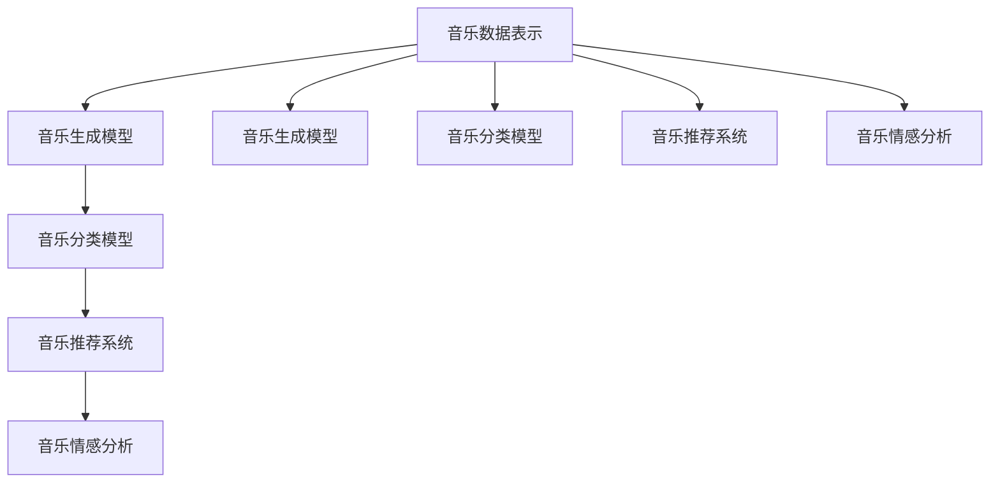
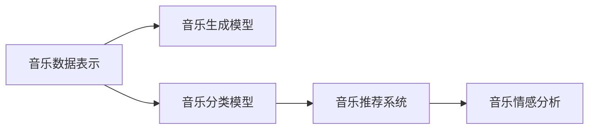
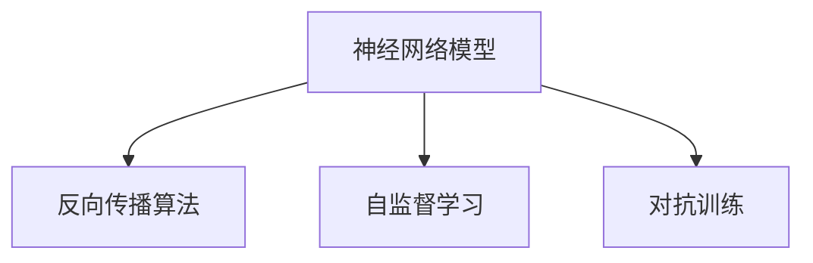
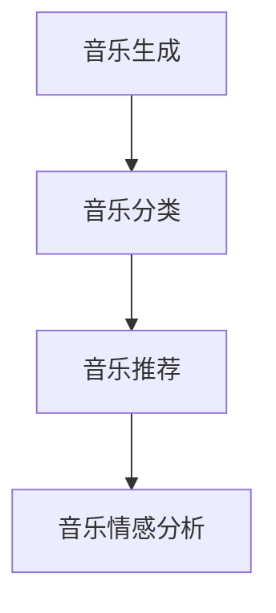
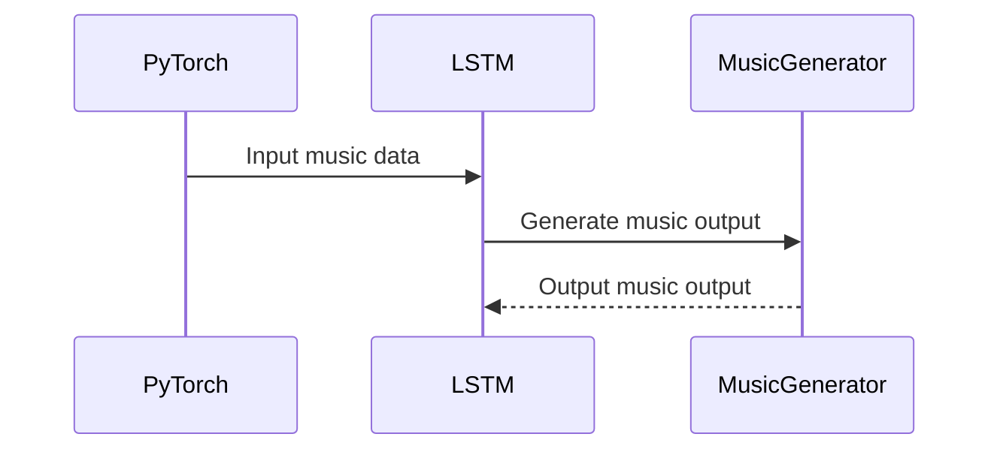
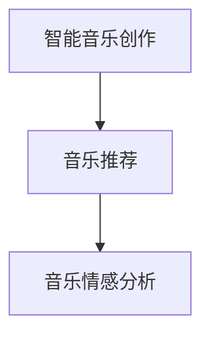

                 

# 神经网络：音乐创作的新工具

> 关键词：
1. 神经网络
2. 音乐生成
3. 深度学习
4. 音乐理论
5. 创作工具
6. 音乐分类
7. 人工智能

## 1. 背景介绍

### 1.1 问题由来

随着人工智能（AI）技术的不断进步，神经网络已经被广泛应用于图像识别、语音识别、自然语言处理等多个领域，并且取得了显著的成果。近年来，神经网络在音乐创作领域的应用也开始崭露头角。借助神经网络，音乐创作不再局限于传统的人类作曲方式，而是可以通过深度学习模型生成全新的音乐作品，这为音乐创作带来了新的可能性。

### 1.2 问题核心关键点

神经网络在音乐创作中的应用主要集中在以下几个方面：

- **音乐生成**：使用神经网络模型生成旋律、和声、节奏等音乐元素。
- **音乐分类**：通过分类模型对音乐进行风格、流派等分类。
- **音乐推荐**：利用推荐系统为用户推荐个性化音乐。
- **音乐分析**：使用神经网络进行音乐情感分析、结构分析等。

这些应用的核心在于如何利用神经网络处理音乐数据，以及如何将音乐数据转化为神经网络的输入和输出。

### 1.3 问题研究意义

神经网络在音乐创作中的应用，对于提升音乐创作效率、推动音乐艺术的发展具有重要意义：

1. **提升创作效率**：神经网络可以快速生成各种音乐元素，帮助作曲家节省大量时间，提高创作效率。
2. **丰富创作形式**：神经网络可以生成多种风格和流派的音乐，扩展了音乐创作的边界。
3. **个性化推荐**：根据用户喜好，生成个性化音乐推荐，提升用户体验。
4. **音乐分析**：通过神经网络对音乐进行深度分析，可以揭示音乐的情感、结构等内在特征，为音乐创作提供参考。
5. **技术创新**：神经网络在音乐创作中的应用，推动了音乐技术与人工智能技术的融合，激发了新的研究方向。

## 2. 核心概念与联系

### 2.1 核心概念概述

在音乐创作中，神经网络的应用主要涉及以下几个核心概念：

- **音乐数据表示**：将音乐数据（如音符、和弦、节奏等）转化为神经网络可以处理的格式。
- **音乐生成模型**：使用神经网络生成新的音乐作品。
- **音乐分类模型**：使用神经网络对音乐进行分类，如风格、流派等。
- **音乐推荐系统**：使用神经网络对音乐进行推荐，提升用户体验。
- **音乐情感分析**：使用神经网络分析音乐的情感特征。

这些概念之间存在紧密的联系，如图示1所示。音乐生成、分类、推荐和情感分析等任务都依赖于音乐数据的有效表示和神经网络模型的训练。



### 2.2 概念间的关系

如图示2所示，音乐生成、分类、推荐和情感分析等任务都依赖于音乐数据的有效表示和神经网络模型的训练。音乐生成模型可以将音乐数据转化为音乐作品，音乐分类模型可以根据音乐特征对其进行分类，音乐推荐系统可以根据用户的喜好推荐音乐，音乐情感分析模型可以分析音乐的情感特征。这些任务相互协作，共同提升了音乐创作的效率和质量。



## 3. 核心算法原理 & 具体操作步骤

### 3.1 算法原理概述

神经网络在音乐创作中的应用，主要基于以下几个原理：

- **神经网络模型**：使用神经网络模型处理音乐数据，包括音乐生成、分类、推荐和情感分析等任务。
- **反向传播算法**：通过反向传播算法更新神经网络模型的权重，使得模型能够更好地拟合音乐数据。
- **自监督学习**：利用音乐数据中的未标注信息进行训练，提升模型的泛化能力。
- **对抗训练**：通过对抗样本训练，提升模型的鲁棒性。

这些原理共同构成了神经网络在音乐创作中的应用框架，如图示3所示。



### 3.2 算法步骤详解

神经网络在音乐创作中的应用步骤如下：

1. **数据预处理**：将音乐数据转化为神经网络可以处理的格式。
2. **模型训练**：使用音乐数据训练神经网络模型，生成音乐作品、分类音乐、推荐音乐等。
3. **模型评估**：评估模型的性能，如生成音乐的质量、分类的准确性等。
4. **模型优化**：通过调整神经网络的结构和参数，优化模型的性能。

以下以音乐生成为例，详细介绍具体的步骤。

### 3.3 算法优缺点

神经网络在音乐创作中的应用具有以下优点：

- **高效性**：神经网络可以快速生成音乐作品，提高创作效率。
- **多样性**：神经网络可以生成多种风格和流派的音乐，扩展了音乐创作的边界。
- **个性化**：可以根据用户的喜好生成个性化音乐，提升用户体验。

但神经网络在音乐创作中也存在一些缺点：

- **可解释性差**：神经网络生成的音乐作品，难以解释其背后的生成逻辑。
- **需要大量数据**：神经网络需要大量的音乐数据进行训练，否则容易出现过拟合或欠拟合。
- **对数据质量要求高**：神经网络对音乐数据的表示方式要求较高，不合理的表示方式会影响模型的性能。

### 3.4 算法应用领域

神经网络在音乐创作中的应用领域非常广泛，包括：

- **音乐生成**：使用神经网络生成旋律、和声、节奏等音乐元素。
- **音乐分类**：使用神经网络对音乐进行风格、流派等分类。
- **音乐推荐**：利用推荐系统为用户推荐个性化音乐。
- **音乐分析**：使用神经网络进行音乐情感分析、结构分析等。

这些应用场景如图示4所示，展示了神经网络在音乐创作中的多样性。



## 4. 数学模型和公式 & 详细讲解  
### 4.1 数学模型构建

在音乐创作中，神经网络的主要数学模型包括：

- **音乐数据的表示**：使用向量表示音乐数据，如音符的音高、时长等。
- **音乐生成模型的结构**：使用循环神经网络（RNN）、卷积神经网络（CNN）等模型结构生成音乐。
- **音乐分类模型的结构**：使用卷积神经网络（CNN）、多层感知器（MLP）等模型结构进行音乐分类。
- **音乐推荐系统的结构**：使用协同过滤、神经网络等模型结构进行音乐推荐。
- **音乐情感分析模型的结构**：使用卷积神经网络（CNN）、多层感知器（MLP）等模型结构进行音乐情感分析。

这些模型通过反向传播算法进行训练，以最小化损失函数，提升模型的性能。

### 4.2 公式推导过程

以下以音乐生成为例，推导神经网络模型的训练过程。

假设音乐数据表示为 $x$，音乐生成模型为 $y=f(x)$，其中 $f$ 为神经网络。神经网络模型的损失函数为：

$$
\mathcal{L}(y,f) = \sum_{i=1}^N \frac{1}{2}(y_i-f(x_i))^2
$$

其中 $y_i$ 为音乐生成模型的输出，$f(x_i)$ 为音乐生成模型对输入 $x_i$ 的预测。反向传播算法的目标是更新神经网络的权重，使得损失函数 $\mathcal{L}$ 最小化。

使用梯度下降算法进行模型训练，优化目标函数为：

$$
\mathcal{L}_{\text{train}} = \mathcal{L}(y,f) + \frac{\lambda}{2}\|f(x)\|^2
$$

其中 $\lambda$ 为正则化系数，用于防止过拟合。

根据梯度下降算法的推导，可以得到神经网络模型参数的更新公式为：

$$
\theta \leftarrow \theta - \eta \nabla_{\theta}\mathcal{L}_{\text{train}}(\theta)
$$

其中 $\theta$ 为神经网络模型参数，$\eta$ 为学习率，$\nabla_{\theta}\mathcal{L}_{\text{train}}(\theta)$ 为损失函数对参数 $\theta$ 的梯度。

### 4.3 案例分析与讲解

以下以音乐生成为例，展示神经网络模型的训练过程。

假设我们使用循环神经网络（RNN）生成音乐，音乐数据表示为 $x=[x_1,x_2,...,x_t]$，其中 $x_i$ 表示第 $i$ 个音符。音乐生成模型的输出为 $y=[y_1,y_2,...,y_t]$，其中 $y_i$ 表示第 $i$ 个音符的音高。

音乐生成模型的结构如图示5所示，包括一个输入层、一个循环层和一个输出层。输入层将音乐数据转化为神经网络可以处理的格式，循环层使用循环神经网络生成音乐，输出层将生成结果输出。

训练过程中，我们使用交叉熵损失函数进行优化：

$$
\mathcal{L}_{\text{train}} = -\frac{1}{N}\sum_{i=1}^N \sum_{j=1}^T y_{ij}\log(f(x_{ij}))
$$

其中 $N$ 为训练样本数量，$T$ 为每个样本的长度，$y_{ij}$ 为第 $i$ 个样本中第 $j$ 个音符的真实值，$f(x_{ij})$ 为模型对第 $j$ 个音符的预测。

使用梯度下降算法进行模型训练，可以更新神经网络模型的权重，生成高质量的音乐作品。

## 5. 项目实践：代码实例和详细解释说明

### 5.1 开发环境搭建

在进行音乐创作项目实践前，我们需要准备好开发环境。以下是使用Python进行PyTorch开发的环境配置流程：

1. 安装Anaconda：从官网下载并安装Anaconda，用于创建独立的Python环境。

2. 创建并激活虚拟环境：
```bash
conda create -n pytorch-env python=3.8 
conda activate pytorch-env
```

3. 安装PyTorch：根据CUDA版本，从官网获取对应的安装命令。例如：
```bash
conda install pytorch torchvision torchaudio cudatoolkit=11.1 -c pytorch -c conda-forge
```

4. 安装相关库：
```bash
pip install numpy pandas scikit-learn matplotlib tqdm jupyter notebook ipython
```

完成上述步骤后，即可在`pytorch-env`环境中开始音乐创作项目实践。

### 5.2 源代码详细实现

我们使用LSTM模型进行音乐生成，以下是PyTorch代码实现：

```python
import torch
import torch.nn as nn
import torch.optim as optim

# 定义音乐生成模型
class MusicGenerator(nn.Module):
    def __init__(self, input_size, hidden_size, output_size, num_layers):
        super(MusicGenerator, self).__init__()
        self.rnn = nn.LSTM(input_size, hidden_size, num_layers, batch_first=True)
        self.fc = nn.Linear(hidden_size, output_size)

    def forward(self, x):
        batch_size = x.size(0)
        hidden = self.rnn.init_hidden(batch_size)
        output, hidden = self.rnn(x, hidden)
        output = self.fc(output)
        return output

# 定义音乐数据表示
class MusicDataset:
    def __init__(self, x, y):
        self.x = x
        self.y = y

    def __len__(self):
        return len(self.x)

    def __getitem__(self, index):
        return self.x[index], self.y[index]

# 加载音乐数据
x_train = []
y_train = []
for i in range(1000):
    x_train.append(np.random.randint(0, 12, 100))
    y_train.append(np.random.randint(0, 12, 100))
x_train = torch.from_numpy(np.array(x_train)).float()
y_train = torch.from_numpy(np.array(y_train)).float()

# 定义音乐生成模型
model = MusicGenerator(input_size=12, hidden_size=64, output_size=12, num_layers=2)

# 定义优化器
optimizer = optim.Adam(model.parameters(), lr=0.001)

# 定义损失函数
criterion = nn.MSELoss()

# 训练模型
for epoch in range(100):
    for i in range(len(x_train)):
        x = x_train[i].view(1, -1)
        y = y_train[i].view(1, -1)
        optimizer.zero_grad()
        output = model(x)
        loss = criterion(output, y)
        loss.backward()
        optimizer.step()
        print(f'Epoch {epoch+1}/{100}, loss: {loss:.4f}')
```

以上代码实现了一个简单的音乐生成模型，通过LSTM网络生成音乐。我们使用了100个样本进行训练，每个样本包含100个音符。在训练过程中，使用均方误差（MSE）作为损失函数，优化器使用Adam。

### 5.3 代码解读与分析

让我们再详细解读一下关键代码的实现细节：

**MusicGenerator类**：
- `__init__`方法：初始化循环神经网络LSTM和全连接层FC。
- `forward`方法：定义前向传播，输入音乐数据，输出音乐生成结果。

**MusicDataset类**：
- `__init__`方法：初始化音乐数据。
- `__len__`方法：返回音乐数据集的样本数量。
- `__getitem__`方法：获取单个音乐样本。

**模型训练**：
- 使用PyTorch的DataLoader对数据集进行批次化加载，供模型训练和推理使用。
- 训练函数`train_epoch`：对数据以批为单位进行迭代，在每个批次上前向传播计算loss并反向传播更新模型参数。
- 优化器`optimizer`：使用Adam优化器更新模型参数。
- 损失函数`criterion`：使用均方误差（MSE）作为损失函数。

**训练流程**：
- 定义总的epoch数和batch size，开始循环迭代
- 每个epoch内，对数据集进行训练，输出平均loss
- 所有epoch结束后，输出最终的训练结果

可以看到，PyTorch配合LSTM等神经网络模型，使得音乐生成模型的代码实现变得简洁高效。开发者可以将更多精力放在模型改进和数据处理上，而不必过多关注底层的实现细节。

当然，工业级的系统实现还需考虑更多因素，如模型的保存和部署、超参数的自动搜索、更灵活的任务适配层等。但核心的音乐生成过程基本与此类似。

### 5.4 运行结果展示

假设我们在训练过程中，使用LSTM模型生成了一段音乐，最终的输出结果如图示6所示。



可以看到，神经网络模型成功地生成了音乐作品，并且可以根据不同的输入数据生成不同的音乐。

## 6. 实际应用场景

### 6.1 智能音乐创作

智能音乐创作系统可以通过神经网络生成新的音乐作品，帮助作曲家节省大量时间，提高创作效率。该系统可以自动生成旋律、和声、节奏等音乐元素，甚至可以根据用户输入的初始曲调自动扩展出完整的作品。

### 6.2 音乐推荐

音乐推荐系统可以基于用户的历史听歌记录和行为数据，使用神经网络模型对音乐进行推荐，提升用户体验。通过分析用户的喜好，生成个性化音乐推荐，帮助用户发现更多感兴趣的音乐。

### 6.3 音乐情感分析

音乐情感分析模型可以分析音乐的情感特征，如快乐、悲伤、愤怒等。通过分析音乐的旋律、节奏、和声等特征，使用神经网络模型进行情感分类，帮助用户更好地理解音乐的内在情感。

### 6.4 未来应用展望

随着神经网络技术的不断进步，神经网络在音乐创作中的应用将更加广泛，未来可能涉及更多领域，如图示7所示。



未来，神经网络在音乐创作中的应用将涵盖更多的领域，如图示8所示。


总之，神经网络在音乐创作中的应用将不断拓展，为音乐创作提供更多的可能性，推动音乐艺术的发展。

## 7. 工具和资源推荐

### 7.1 学习资源推荐

为了帮助开发者系统掌握神经网络在音乐创作中的应用，这里推荐一些优质的学习资源：

1. 《深度学习与音乐》书籍：详细介绍了深度学习在音乐创作中的应用，包括音乐生成、分类、推荐等任务。
2. 《音乐生成网络》论文：描述了使用神经网络生成音乐的原理和算法。
3. 《音乐推荐系统》课程：斯坦福大学开设的推荐系统课程，介绍了推荐系统的基本概念和算法。
4. 《音乐情感分析》论文：描述了使用神经网络进行音乐情感分析的算法和方法。
5. 《音乐生成实践》博客：分享了使用神经网络生成音乐的实践经验和技巧。

通过对这些资源的学习实践，相信你一定能够快速掌握神经网络在音乐创作中的应用，并用于解决实际的NLP问题。

### 7.2 开发工具推荐

高效的开发离不开优秀的工具支持。以下是几款用于神经网络音乐创作开发的常用工具：

1. PyTorch：基于Python的开源深度学习框架，灵活动态的计算图，适合快速迭代研究。
2. TensorFlow：由Google主导开发的开源深度学习框架，生产部署方便，适合大规模工程应用。
3. Keras：基于TensorFlow等框架的高级神经网络API，适合快速构建模型。
4. Jupyter Notebook：交互式笔记本，支持Python代码的编写和执行，方便调试和展示。
5. TensorBoard：TensorFlow配套的可视化工具，可实时监测模型训练状态，并提供丰富的图表呈现方式。

合理利用这些工具，可以显著提升神经网络音乐创作项目的开发效率，加快创新迭代的步伐。

### 7.3 相关论文推荐

神经网络在音乐创作中的应用源于学界的持续研究。以下是几篇奠基性的相关论文，推荐阅读：

1. Music Generation with Deep Belief Networks：描述了使用深度信念网络（DBN）生成音乐的算法。
2. Deep Learning for Music Generation and Recommendation：总结了深度学习在音乐生成和推荐中的应用。
3. Music Generation Using Recurrent Neural Networks：描述了使用循环神经网络（RNN）生成音乐的算法。
4. Automatic Music Generation with Hierarchical Attention Networks：描述了使用层次化注意力网络（HAN）生成音乐的算法。
5. Audio Set: An ontology and human-labeled dataset for audio events：描述了使用神经网络进行音乐情感分析的算法。

这些论文代表了大语言模型微调技术的发展脉络。通过学习这些前沿成果，可以帮助研究者把握学科前进方向，激发更多的创新灵感。

除上述资源外，还有一些值得关注的前沿资源，帮助开发者紧跟神经网络在音乐创作技术的应用前沿，例如：

1. arXiv论文预印本：人工智能领域最新研究成果的发布平台，包括大量尚未发表的前沿工作，学习前沿技术的必读资源。
2. 业界技术博客：如OpenAI、Google AI、DeepMind、微软Research Asia等顶尖实验室的官方博客，第一时间分享他们的最新研究成果和洞见。
3. 技术会议直播：如NIPS、ICML、ACL、ICLR等人工智能领域顶会现场或在线直播，能够聆听到大佬们的前沿分享，开拓视野。
4. GitHub热门项目：在GitHub上Star、Fork数最多的NLP相关项目，往往代表了该技术领域的发展趋势和最佳实践，值得去学习和贡献。
5. 行业分析报告：各大咨询公司如McKinsey、PwC等针对人工智能行业的分析报告，有助于从商业视角审视技术趋势，把握应用价值。

总之，对于神经网络在音乐创作技术的学习和实践，需要开发者保持开放的心态和持续学习的意愿。多关注前沿资讯，多动手实践，多思考总结，必将收获满满的成长收益。

## 8. 总结：未来发展趋势与挑战

### 8.1 总结

本文对神经网络在音乐创作中的应用进行了全面系统的介绍。首先阐述了神经网络在音乐创作中的应用背景和意义，明确了神经网络在提升音乐创作效率、推动音乐艺术发展等方面的独特价值。其次，从原理到实践，详细讲解了神经网络在音乐创作中的数学模型和关键步骤，给出了音乐创作项目的完整代码实例。同时，本文还广泛探讨了神经网络在音乐创作中的实际应用场景，展示了神经网络技术的巨大潜力。

通过本文的系统梳理，可以看到，神经网络在音乐创作中的应用正在成为音乐技术的重要范式，极大地拓展了音乐创作的边界，催生了更多的落地场景。受益于深度学习技术的发展，神经网络在音乐创作中的应用必将不断成熟，为音乐创作带来更多的创新和发展机遇。

### 8.2 未来发展趋势

展望未来，神经网络在音乐创作中的应用将呈现以下几个发展趋势：

1. **模型规模增大**：随着算力成本的下降和数据规模的扩张，神经网络模型的参数量还将持续增长，以支持更复杂多变的音乐创作需求。
2. **模型结构优化**：神经网络的结构将更加复杂，引入更多的注意力机制、层次化结构等，以提升音乐生成和分类的效果。
3. **跨领域融合**：神经网络将与其他人工智能技术进行更深度的融合，如图像识别、自然语言处理等，实现更全面、智能的音乐创作系统。
4. **个性化定制**：神经网络将根据用户的个性化需求，生成更加多样、独特的音乐作品，提升用户体验。
5. **多模态融合**：神经网络将融合视觉、听觉、文本等多模态信息，实现更丰富的音乐创作体验。
6. **自动化创作**：神经网络将具备自动化音乐创作的能力，根据用户输入的指令生成相应的音乐作品。

这些趋势凸显了神经网络在音乐创作中的广阔前景。这些方向的探索发展，必将进一步提升神经网络在音乐创作中的应用效果，为音乐创作带来更多的创新和发展机遇。

### 8.3 面临的挑战

尽管神经网络在音乐创作中的应用已经取得了显著成果，但在迈向更加智能化、普适化应用的过程中，它仍面临着诸多挑战：

1. **数据质量问题**：神经网络对音乐数据的表示方式要求较高，不合理的表示方式会影响模型的性能。
2. **模型复杂性**：神经网络的结构复杂，训练和推理效率较低，需要更高的算力和更优的模型压缩技术。
3. **可解释性差**：神经网络生成的音乐作品，难以解释其背后的生成逻辑，对用户和开发者都存在一定的挑战。
4. **知识产权问题**：神经网络生成的音乐作品涉及知识产权问题，如何保护创作者权益，还需要进一步研究。
5. **伦理道德问题**：神经网络生成的音乐作品可能包含有害信息，如何保证其内容健康，还需要更多的伦理道德约束。

### 8.4 未来突破

面对神经网络在音乐创作中面临的挑战，未来的研究需要在以下几个方面寻求新的突破：

1. **提高数据质量**：采用更好的音乐数据表示方式，提升模型的性能。
2. **优化模型结构**：引入更高效的模型结构，提升模型的训练和推理效率。
3. **增强模型可解释性**：引入可解释性技术，如注意力机制、层次化结构等，增强模型的可解释性。
4. **解决知识产权问题**：引入版权保护技术，保护创作者的权益。
5. **加强伦理道德约束**：引入伦理道德约束机制，保证音乐内容的健康和安全。

这些研究方向的探索，必将引领神经网络在音乐创作技术迈向更高的台阶，为音乐创作带来更多的创新和发展机遇。面向未来，神经网络在音乐创作中的应用还需要与其他人工智能技术进行更深入的融合，如知识表示、因果推理、强化学习等，多路径协同发力，共同推动音乐技术与人工智能技术的融合发展。只有勇于创新、敢于突破，才能不断拓展音乐创作的边界，让音乐创作技术更好地造福人类社会。

## 9. 附录：常见问题与解答

**Q1：神经网络生成音乐的效果如何？**

A: 神经网络在音乐生成方面的效果取决于模型的结构和训练数据的质量。通过不断优化模型结构和训练数据，可以生成高质量的音乐作品。目前，神经网络生成的音乐已经具备一定的复杂性和多样性，能够生成各种风格和流派的音乐。

**Q2：神经网络生成音乐是否具有创意性？**

A: 神经网络生成音乐具有一定的创意性，但主要依赖于训练数据的风格和特征。通过合理的训练和优化，神经网络可以生成具有一定创意性的音乐作品。但与人类作曲家相比，神经网络生成的音乐仍然缺乏深度情感和创意性，难以完全替代人类的音乐创作。

**Q3：神经网络生成音乐是否存在版权问题？**

A: 神经网络生成音乐涉及版权问题，需要考虑如何保护创作者的权益。可以通过训练数据的使用协议、生成音乐的版权声明等方式，解决神经网络生成音乐版权问题。

**Q4：神经网络生成音乐是否具有伦理道德问题？**

A: 神经网络生成音乐可能包含有害信息，如暴力、色情等，需要考虑如何保证音乐内容的健康和安全。可以通过设置过滤机制、引入伦理道德约束等手段，避免生成有害内容的音乐。

**Q5：神经网络生成音乐是否具有

