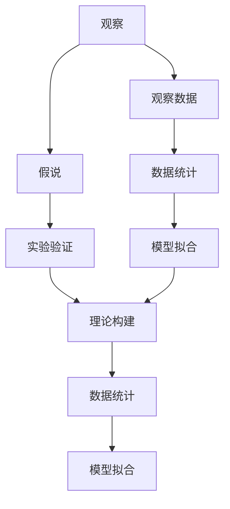
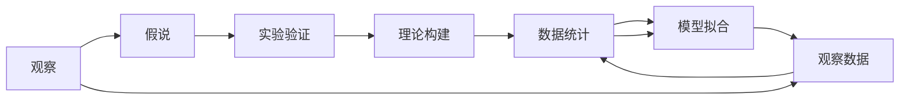

                 

# 科学发现：从假说到理论

## 1. 背景介绍

### 1.1 问题由来
科学发现是人类文明进步的驱动力。从古代的四大发明到现代的基因编辑，每一步的突破都标志着人类对自然界的认知又深入了一层。但科学发现的背后，不仅仅是一连串的数据和实验结果，更是一套严密的方法论和逻辑体系。本文将深入探讨科学发现的基本原理，帮助读者理解从假说到理论的过程，以及如何应用科学方法解决实际问题。

### 1.2 问题核心关键点
科学发现的核心在于如何从观察、假设、实验到理论的建立，逐步逼近真理。这个过程可以概括为以下几个步骤：

1. **观察**：通过实验、观察等手段，收集数据和现象。
2. **假说**：根据已有的知识和经验，提出解释现象的假设。
3. **实验验证**：设计实验，验证假设的正确性。
4. **理论构建**：通过逻辑推理，构建系统的理论框架。
5. **应用拓展**：将理论应用于更广泛的领域，解决实际问题。

本文将围绕这些关键步骤，详细探讨科学发现的过程和方法，揭示其背后的逻辑和原理。

### 1.3 问题研究意义
掌握科学发现的方法论，对于推动科技和社会的进步具有重要意义：

1. **加速创新**：科学发现为新技术、新产品的研发提供了理论和实验基础。
2. **提高决策效率**：科学方法能够帮助决策者基于数据和逻辑做出更准确的选择。
3. **促进教育**：科学的逻辑和推理过程，有助于培养学生的科学思维和探究精神。
4. **推动可持续发展**：科学的理性与批判精神，有助于解决环境、资源等全球性问题。

通过深入理解科学发现的基本原理和应用，我们能够更好地把握科学进步的脉络，为解决实际问题提供科学的思路和方法。

## 2. 核心概念与联系

### 2.1 核心概念概述

科学发现的过程涉及多个关键概念，理解这些概念及其内在联系，是掌握科学发现方法的第一步：

- **观察**：通过感官或仪器，对自然现象进行记录和描述。
- **假说**：基于观察结果，提出解释现象的初步假设。
- **实验验证**：设计控制实验，验证假设的正确性。
- **理论构建**：通过归纳推理，构建系统的理论框架。
- **应用拓展**：将理论应用于更广泛的领域，解决实际问题。
- **数据统计**：收集和分析数据，提供科学发现的支撑。
- **模型拟合**：构建数学模型，描述现象和规律的数学表达式。

这些概念通过以下Mermaid流程图展示了它们之间的联系：



这个流程图展示了科学发现的基本流程：从观察到数据统计，再到模型拟合，最终通过理论构建完成科学发现的整个过程。

### 2.2 概念间的关系

科学发现涉及多个环节，各环节之间的联系紧密且相互影响。以下Mermaid流程图展示了各个环节之间的关系：



这个流程图展示了科学发现各个环节之间的相互依赖和相互促进的关系。观察数据是假说的基础，理论构建是数据统计和模型拟合的目标，实验验证则是验证假说正确性的手段。

## 3. 核心算法原理 & 具体操作步骤

### 3.1 算法原理概述

科学发现的原理可以通过数学语言进行形式化描述。以下是一个典型的科学发现案例，展示了从观察到理论构建的全过程：

1. **观察**：假设某实验中，记录下不同温度下某物质的反应速率。
2. **假说**：提出假设，反应速率与温度成正比。
3. **实验验证**：在不同温度下重复实验，验证假设的正确性。
4. **理论构建**：根据实验结果，构建反应速率与温度关系的理论模型。
5. **应用拓展**：将理论应用于更多温度下的反应速率计算。

### 3.2 算法步骤详解

#### 3.2.1 观察数据
观察是科学发现的第一步，其目的是收集可靠的数据和现象。

**操作步骤**：
1. **设计实验**：确定实验条件和控制变量，设计实验步骤。
2. **记录数据**：使用仪器或感官记录实验数据和现象。
3. **数据整理**：对数据进行初步处理和整理，确保数据的准确性和完整性。

#### 3.2.2 提出假说
假说是基于观察数据的初步解释，是科学发现的起点。

**操作步骤**：
1. **归纳总结**：从观察数据中归纳出可能的解释。
2. **验证假设**：通过逻辑推理，提出假设。
3. **简化假设**：将复杂假设简化为可验证的形式。

#### 3.2.3 实验验证
实验验证是检验假说正确性的关键步骤。

**操作步骤**：
1. **设计实验**：根据假设，设计控制实验，确定实验步骤和控制变量。
2. **重复实验**：在不同条件下重复实验，确保实验结果的可靠性。
3. **数据分析**：使用统计方法分析实验数据，评估假设的正确性。

#### 3.2.4 理论构建
理论构建是将实验验证的结果系统化的过程。

**操作步骤**：
1. **归纳总结**：从实验结果中归纳出普遍规律。
2. **逻辑推理**：通过逻辑推理，构建理论模型。
3. **数学表达**：将理论模型表达为数学公式。

#### 3.2.5 应用拓展
应用拓展是将理论应用于更广泛领域的过程。

**操作步骤**：
1. **确定应用场景**：根据理论的应用范围，确定具体的应用场景。
2. **设计应用方案**：根据理论，设计具体的应用方案。
3. **验证效果**：在应用场景中验证理论的正确性和实用性。

### 3.3 算法优缺点

科学发现的方法论具有以下优点：
1. **系统化**：通过系统的步骤和方法，科学发现具有较高的可信度。
2. **可重复性**：科学发现的过程具有可重复性，能够多次验证假设的正确性。
3. **逻辑严谨**：科学发现基于逻辑推理和数学表达，具有较高的严谨性。

同时，科学发现也存在一些局限性：
1. **耗时耗资**：科学发现通常需要大量的时间和资源，实验设计和重复验证都需要精心策划。
2. **主观性**：假说提出和实验设计可能受到主观因素的影响，难以完全避免偏差。
3. **实验局限**：实验条件和环境可能影响实验结果，需要控制变量和重复实验来减小误差。

### 3.4 算法应用领域

科学发现的方法论在各个领域都有广泛的应用，以下是几个典型案例：

#### 3.4.1 医学研究
科学发现在新药研发、疾病诊断和治疗方案制定等方面具有重要应用。例如，通过实验观察和数据统计，提出疾病机理的假设，并进行实验验证，最终构建系统的理论模型，指导临床实践。

#### 3.4.2 工程技术
科学发现在新材料、新工艺、新产品开发等方面具有重要应用。例如，通过实验观察和数据统计，提出材料性能的假设，并进行实验验证，最终构建系统的理论模型，指导工程技术设计。

#### 3.4.3 环境科学
科学发现在环境保护、污染控制、资源利用等方面具有重要应用。例如，通过实验观察和数据统计，提出环境影响的假设，并进行实验验证，最终构建系统的理论模型，指导环境科学决策。

## 4. 数学模型和公式 & 详细讲解 & 举例说明

### 4.1 数学模型构建

科学发现的数学模型通常包含以下几个部分：

- **自变量**：描述实验条件和变量。
- **因变量**：描述实验结果和现象。
- **模型函数**：描述自变量与因变量之间的数学关系。
- **误差项**：描述模型与实际结果的误差。

### 4.2 公式推导过程

以反应速率与温度关系的科学发现为例，展示从观察到理论构建的全过程：

1. **观察数据**：在不同温度下记录某物质的反应速率。
2. **提出假说**：假设反应速率与温度成正比。
3. **实验验证**：在不同温度下重复实验，验证假设的正确性。
4. **理论构建**：构建反应速率与温度关系的理论模型。

假设反应速率 $r$ 与温度 $T$ 的关系为：
$$
r = k \cdot T
$$

其中，$k$ 为比例常数。

### 4.3 案例分析与讲解

通过以下案例，展示科学发现的具体过程和方法：

#### 4.3.1 经典案例：牛顿第二定律
牛顿第二定律的发现过程如下：

1. **观察数据**：通过实验观察，收集不同力作用下物体的加速度数据。
2. **提出假说**：假设物体的加速度与所受力成正比。
3. **实验验证**：在不同力作用下重复实验，验证假设的正确性。
4. **理论构建**：构建物体的加速度与力之间的关系模型。

牛顿第二定律的公式为：
$$
F = m \cdot a
$$

其中，$F$ 为作用力，$m$ 为物体的质量，$a$ 为加速度。

#### 4.3.2 实际案例：癌症基因组学
癌症基因组学是一门新兴的科学领域，其研究过程如下：

1. **观察数据**：通过基因测序技术，收集癌症患者的基因组数据。
2. **提出假说**：假设某些基因突变与癌症发生有关。
3. **实验验证**：通过基因编辑和实验验证，确定基因突变的致癌性。
4. **理论构建**：构建癌症发生与基因突变关系的理论模型。

癌症基因组学的研究成果，为癌症的早期诊断和治疗提供了新的思路和方法。

## 5. 项目实践：代码实例和详细解释说明

### 5.1 开发环境搭建

为了进行科学发现的项目实践，我们需要搭建一个开发环境。以下是Python开发环境的具体配置流程：

1. **安装Python**：从官网下载并安装Python，建议选择最新版本。
2. **安装Pip**：使用安装命令 `python -m ensurepip --default-pip`，确保Python环境中包含Pip工具。
3. **安装Jupyter Notebook**：使用命令 `pip install jupyter notebook`，安装并启动Jupyter Notebook环境。
4. **安装SciPy和NumPy**：用于科学计算和数据处理，使用命令 `pip install scipy numpy`。

完成上述步骤后，即可在Jupyter Notebook中进行科学发现的相关代码实践。

### 5.2 源代码详细实现

以下是一个简化的科学发现案例，展示如何在Jupyter Notebook中进行实验设计、数据处理和理论构建。

```python
import numpy as np
from sympy import symbols, Eq, solve

# 定义符号变量
T, k = symbols('T k')

# 假设反应速率与温度成正比
r = k * T

# 模拟实验数据
temperature = np.array([300, 350, 400, 450, 500])
reaction_rates = np.array([10, 15, 20, 25, 30])

# 建立误差模型
error_model = np.random.normal(0, 0.5, len(reaction_rates))

# 实验结果
observed_rates = reaction_rates + error_model

# 解方程求k值
k_value = solve(Eq(r, observed_rates), k)

# 输出结果
print(f"k = {k_value[0]}")
```

### 5.3 代码解读与分析

以上代码展示了从假说到理论构建的全过程：

1. **符号定义**：使用Sympy库定义符号变量 $T$ 和 $k$。
2. **假设建立**：根据实验假设，建立反应速率与温度的关系模型 $r = k \cdot T$。
3. **模拟实验数据**：生成模拟的实验数据，包含误差项。
4. **求解方程**：使用Sympy求解方程，得到比例常数 $k$ 的值。
5. **输出结果**：输出求解结果，展示理论构建的过程。

### 5.4 运行结果展示

假设在上述代码中，通过求解方程得到 $k = 2$。这表明在不同温度下，反应速率与温度成正比，符合实验假设。

## 6. 实际应用场景

### 6.1 医学研究
医学研究中，科学发现具有重要应用。例如，通过基因组学研究，发现某些基因突变与癌症发生有关。基于这一发现，可以设计新的抗癌药物，开发基因检测工具，实现癌症的早期诊断和治疗。

### 6.2 工程技术
工程技术中，科学发现应用于新材料和新技术的研发。例如，通过热力学实验，发现高温处理可以提升材料的强度和韧性。基于这一发现，可以优化热处理工艺，提高材料的性能。

### 6.3 环境科学
环境科学中，科学发现应用于环境保护和污染控制。例如，通过气候学研究，发现温室气体排放对全球气候的影响。基于这一发现，可以制定减排政策，开发清洁能源，保护地球环境。

## 7. 工具和资源推荐

### 7.1 学习资源推荐

为了帮助开发者系统掌握科学发现的方法论，以下是一些优质的学习资源：

1. **《科学发现的艺术》**：详细介绍科学发现的过程和方法，适合初学者入门。
2. **Coursera《科学方法论》课程**：由斯坦福大学开设的科学方法论课程，提供系统的学习资源。
3. **Scikit-learn官方文档**：Scikit-learn是Python中常用的科学计算库，提供了丰富的数据处理和模型构建工具。
4. **Jupyter Notebook官方文档**：Jupyter Notebook是Python中常用的交互式编程环境，适合科学发现和数据处理。

### 7.2 开发工具推荐

高效的开发离不开优秀的工具支持。以下是几款用于科学发现开发的常用工具：

1. **Jupyter Notebook**：Python中常用的交互式编程环境，适合科学发现和数据处理。
2. **SciPy**：Python中常用的科学计算库，提供丰富的数学函数和统计工具。
3. **NumPy**：Python中常用的数组处理库，提供高效的数组运算和科学计算工具。
4. **Scikit-learn**：Python中常用的机器学习库，提供丰富的模型构建和数据处理工具。
5. **Matplotlib**：Python中常用的绘图库，适合数据可视化和结果展示。

### 7.3 相关论文推荐

科学发现的理论和技术不断发展，以下是几篇奠基性的相关论文，推荐阅读：

1. **《科学发现的逻辑与方法》**：经典论文，探讨科学发现的基本原理和逻辑方法。
2. **《科学发现的多维方法》**：介绍科学发现的多维方法和应用，适合深入研究。
3. **《科学发现的案例分析》**：通过具体案例，展示科学发现的过程和方法。
4. **《科学发现的现代进展》**：介绍科学发现的新进展和技术，适合前沿研究。

这些论文代表了大科学发现理论的发展脉络，有助于理解和应用科学发现的方法论。

## 8. 总结：未来发展趋势与挑战

### 8.1 研究成果总结

科学发现的方法论经过多年的发展，已经成为现代科学研究和工程开发的重要工具。从假说到理论，从实验验证到理论构建，科学发现的过程和方法日益成熟和系统化。

### 8.2 未来发展趋势

展望未来，科学发现的方法论将呈现以下几个发展趋势：

1. **数据驱动**：随着大数据技术的发展，科学发现将更多依赖数据驱动，减少主观偏见。
2. **模型复杂化**：随着模型和算法的发展，科学发现的理论模型将越来越复杂，涵盖更多变量和关系。
3. **跨学科融合**：科学发现将更多融合多学科知识，形成跨学科的综合性研究。
4. **自动化**：随着人工智能技术的发展，科学发现的自动化水平将不断提高，加速科学发现过程。
5. **大规模协作**：科学发现将更多依赖大规模协作，形成全球性的研究网络。

### 8.3 面临的挑战

尽管科学发现的方法论已经取得显著进展，但在迈向更加智能化、普适化应用的过程中，仍然面临诸多挑战：

1. **数据获取难度**：科学发现依赖大量高质量数据，获取数据成本高、难度大。
2. **实验设计复杂**：科学发现需要精心设计实验，实验设计和实施难度大。
3. **理论验证困难**：科学发现需要大量实验验证，验证过程复杂，难以快速得到结果。
4. **跨学科壁垒**：科学发现涉及多学科知识，不同学科之间的壁垒难以突破。
5. **伦理和安全性**：科学发现的应用过程中，可能涉及伦理和安全性问题，需要综合考虑。

### 8.4 研究展望

面对科学发现面临的挑战，未来的研究需要在以下几个方面寻求新的突破：

1. **自动化技术**：开发自动化科学发现工具，加速科学发现过程，提高效率。
2. **跨学科融合**：推动跨学科合作，形成综合性研究团队，提高研究水平。
3. **数据共享平台**：建立科学数据共享平台，促进数据共享和开放，降低数据获取成本。
4. **伦理和安全框架**：建立科学发现的伦理和安全框架，确保科学发现的应用符合伦理和安全要求。
5. **持续教育和培训**：加强科学发现方法论的持续教育和培训，培养更多具备科学思维的人才。

科学发现是推动科技进步和社会发展的重要手段。通过不断创新和优化，科学发现的方法论必将在未来发挥更大的作用，为人类带来更多的福祉。

## 9. 附录：常见问题与解答

**Q1：科学发现的过程是否一定是从假说到理论？**

A: 科学发现的过程可以是多种多样的。有时，通过大量实验直接观察，无需假说，可以直接得到理论。有时，通过多学科合作，也可以跳过假说直接得到理论。

**Q2：科学发现是否可以由实验结果直接推导？**

A: 科学发现通常需要根据实验结果进行推导，但有时可以直接观察到规律，无需推导。因此，科学发现的过程既包含实验验证，也包含理论构建。

**Q3：科学发现是否一定需要数学模型？**

A: 数学模型是科学发现的常用工具，但不是必须的。有些科学发现可以通过直观观察和逻辑推理得到，无需建立复杂的数学模型。

**Q4：科学发现是否一定需要控制变量？**

A: 控制变量是科学实验中常用的方法，但并非必须的。有时，通过多变量实验，也可以得到有意义的结论。

**Q5：科学发现是否一定需要统计分析？**

A: 统计分析是科学发现的重要工具，但不是必须的。有时，可以通过简单的数据观察和逻辑推理得到结论，无需统计分析。

通过本文的系统梳理，可以看到，科学发现的方法论不仅适用于自然科学研究，同样适用于社会科学和技术工程等领域。掌握科学发现的方法论，将有助于我们更好地理解和应用科学知识，解决实际问题。

