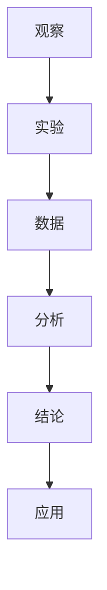
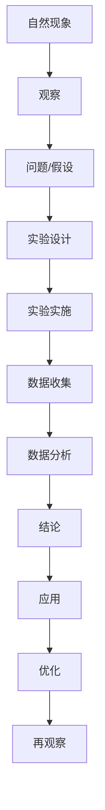

                 

# 科学探究：从观察到结论

科学探究是获取知识和理解世界的重要过程，它不仅仅是一系列的研究步骤和理论，更是一种态度和方法。在信息技术领域，科学探究被广泛应用于研究和开发中，从基本原理的发现到实际应用的实现，科学探究都是推动技术进步的核心动力。本文将从科学探究的基本概念出发，深入探讨科学探究的流程、方法以及其在技术领域的应用，特别是如何通过观察与实验来获取科学结论。

## 1. 背景介绍

### 1.1 问题由来

科学探究，作为一种发现知识、验证假设和解决实际问题的系统方法，其重要性不言而喻。从古代的观察记录到现代的实验验证，科学探究的轨迹一直是人类理解世界、推动发展的关键。在信息技术领域，科学探究同样具有重要地位。无论是理论研究还是应用开发，科学探究都是确保技术创新和准确性的基础。

### 1.2 问题核心关键点

科学探究的核心在于通过系统的观察、实验和分析，获取可靠的数据和结论。具体来说，包括以下几个关键点：

- **观察**：通过对自然现象或实验结果的细致观察，发现问题或提出假设。
- **实验**：通过设计和实施实验，验证假设的正确性，获取数据支持。
- **分析**：运用统计和数学方法，对数据进行分析，提取有价值的信息和结论。
- **应用**：将结论应用于实际问题中，解决技术难题或提升系统性能。

科学探究不仅仅是理论知识的积累，更是技术和产品开发的关键步骤。通过科学探究，工程师和研究人员可以系统地验证和优化技术方案，确保产品的高效和可靠性。

### 1.3 问题研究意义

科学探究在信息技术领域具有重要意义：

- **促进技术创新**：科学探究帮助研究人员从问题出发，探索新的技术和方法，推动技术进步。
- **提升系统性能**：通过系统性的实验和验证，确保技术的科学性和可靠性，提升系统性能。
- **加速产品开发**：科学探究提供了一种系统化的开发流程，加快产品从概念到应用的转换速度。
- **增强技术可靠性**：科学探究的严谨性和可重复性保证了技术方案的可靠性，减少了技术风险。

## 2. 核心概念与联系

### 2.1 核心概念概述

为更好地理解科学探究的过程，本节将介绍几个密切相关的核心概念：

- **观察**：通过对自然现象或实验结果的细致观察，发现问题或提出假设。
- **实验**：通过设计和实施实验，验证假设的正确性，获取数据支持。
- **分析**：运用统计和数学方法，对数据进行分析，提取有价值的信息和结论。
- **应用**：将结论应用于实际问题中，解决技术难题或提升系统性能。

这些核心概念之间存在紧密的联系，共同构成了科学探究的完整过程。通过观察和实验获取数据，再通过分析提取结论，最后应用于实际问题中，形成一个闭环的科学探究流程。

### 2.2 概念间的关系

这些核心概念之间的关系可以通过以下Mermaid流程图来展示：



这个流程图展示了科学探究的各个环节：

- **观察**：发现问题或提出假设。
- **实验**：实施实验获取数据。
- **分析**：对数据进行分析提取结论。
- **应用**：将结论应用于实际问题中。

### 2.3 核心概念的整体架构

最后，我们用一个综合的流程图来展示科学探究的整体架构：



这个综合流程图展示了科学探究的完整流程，从观察自然现象出发，经过问题提出、实验设计、实验实施、数据分析、结论提取、应用优化，最终回到再观察，形成一个循环往复、不断深化的过程。

## 3. 核心算法原理 & 具体操作步骤

### 3.1 算法原理概述

科学探究的核心算法原理可以概括为：通过对自然现象或实验结果的观察，提出假设，设计实验验证假设，分析数据得出结论，最后应用于实际问题中。这一过程涵盖了数据收集、分析、验证和优化的全过程。

### 3.2 算法步骤详解

科学探究的算法步骤包括以下几个关键环节：

#### 3.2.1 数据收集

数据收集是科学探究的第一步，也是最关键的一步。准确、全面的数据收集为后续的实验和分析提供了坚实的基础。数据收集可以分为直接观察和实验生成两种方式。

##### 3.2.1.1 直接观察
直接观察是指通过实地考察、实验记录等方式获取自然现象或实验结果的数据。例如，研究环境变化对植物生长的影响，可以通过长期观察植物生长情况来收集数据。

##### 3.2.1.2 实验生成
实验生成是通过控制实验条件，观察不同变量对结果的影响，从而获取数据。例如，研究药物疗效，可以通过不同剂量药物的实验来收集数据。

#### 3.2.2 数据处理和分析

数据处理和分析是科学探究的核心环节，通过科学的方法对数据进行加工和分析，提取有价值的信息和结论。

##### 3.2.2.1 数据清洗
数据清洗是指对收集到的数据进行初步处理，去除噪声和异常值，确保数据的准确性和可靠性。例如，在实验数据中，需要检查是否有仪器误差、操作失误等导致的异常数据，并将其去除。

##### 3.2.2.2 数据统计
数据统计是指运用统计学方法对数据进行分析和总结。例如，计算均值、标准差、相关性等统计量，以便更好地理解数据的分布和特征。

##### 3.2.2.3 数据可视化
数据可视化是指通过图表、图形等形式直观地展示数据，帮助理解数据的分布和趋势。例如，使用散点图、柱状图、折线图等展示实验数据，可以更直观地发现数据之间的关系。

#### 3.2.3 结论提取和验证

结论提取和验证是科学探究的最终环节，通过数据分析和验证，提取科学结论，验证假设的正确性。

##### 3.2.3.1 结论提取
结论提取是指从数据分析中提取有价值的信息和结论。例如，通过统计分析，得出药物疗效与剂量的关系，提出合理的用药剂量建议。

##### 3.2.3.2 结论验证
结论验证是指通过进一步的实验或理论推导，验证假设的正确性。例如，在不同环境中重复实验，验证疗效的稳定性和可靠性。

#### 3.2.4 应用和优化

应用和优化是将科学结论应用于实际问题中，进一步优化解决方案的过程。

##### 3.2.4.1 应用实现
应用实现是指将科学结论转化为具体的技术方案或产品。例如，将药物疗效的结论应用于临床实践，提出合理的用药方案。

##### 3.2.4.2 优化提升
优化提升是指根据实际应用中的反馈和数据，进一步优化技术方案或产品。例如，根据临床反馈，调整用药剂量，提升疗效。

### 3.3 算法优缺点

科学探究作为一种研究方法，具有以下优点和缺点：

#### 3.3.1 优点

1. **系统性**：科学探究通过系统性的观察、实验和分析，确保研究过程的严谨性和科学性。
2. **可靠性**：科学探究的结论具有较高的可靠性和可重复性，减少了技术风险。
3. **创新性**：科学探究通过提出假设和验证假设，推动技术创新和进步。
4. **普适性**：科学探究方法适用于各种研究领域，具有广泛的适用性。

#### 3.3.2 缺点

1. **时间成本高**：科学探究需要大量时间和资源进行数据收集和实验，周期较长。
2. **资源需求高**：科学探究需要先进的研究设备和技术手段，对资源需求较高。
3. **复杂性高**：科学探究涉及多个环节，流程复杂，需要跨学科的知识和技能。

### 3.4 算法应用领域

科学探究在信息技术领域具有广泛的应用，涵盖了数据科学、机器学习、软件工程等多个方面。

#### 3.4.1 数据科学

数据科学是科学探究的重要应用领域之一，通过数据收集、分析和建模，获取有价值的信息和结论。例如，通过数据分析，发现用户行为规律，优化推荐系统性能。

#### 3.4.2 机器学习

机器学习是科学探究的另一个重要应用领域，通过数据驱动的模型训练和优化，实现高效的技术创新和应用。例如，通过实验设计，验证深度学习模型在不同数据集上的性能，优化模型参数。

#### 3.4.3 软件工程

科学探究在软件工程中也有广泛应用，通过软件测试、性能分析和优化，提升软件系统的质量和可靠性。例如，通过实验和测试，验证软件系统的稳定性和安全性。

## 4. 数学模型和公式 & 详细讲解 & 举例说明

### 4.1 数学模型构建

科学探究中的数学模型构建通常包括以下几个步骤：

#### 4.1.1 数据建模
数据建模是指将数据转化为数学模型，以便进行分析和计算。例如，使用线性回归模型对实验数据进行建模，分析药物剂量与疗效的关系。

#### 4.1.2 参数估计
参数估计是指通过数据估计模型参数，确定模型的具体形式。例如，通过最小二乘法估计线性回归模型的参数。

#### 4.1.3 模型验证
模型验证是指通过实验或测试数据，验证模型的准确性和可靠性。例如，在独立数据集上测试回归模型的预测性能。

### 4.2 公式推导过程

以线性回归模型为例，其数学模型和推导过程如下：

假设有一个简单的线性回归模型 $y = \theta_0 + \theta_1x$，其中 $y$ 为因变量，$x$ 为自变量，$\theta_0$ 和 $\theta_1$ 为模型参数。

根据最小二乘法，可以估计模型参数为：

$$
\hat{\theta} = \arg\min_{\theta} \sum_{i=1}^n (y_i - \theta_0 - \theta_1x_i)^2
$$

其中，$n$ 为样本数，$y_i$ 和 $x_i$ 分别为样本的因变量和自变量。

通过对上式求导，可以解得参数估计值为：

$$
\hat{\theta}_0 = \bar{y} - \hat{\theta}_1\bar{x}, \quad \hat{\theta}_1 = \frac{\sum_{i=1}^n (x_i - \bar{x})(y_i - \bar{y})}{\sum_{i=1}^n (x_i - \bar{x})^2}
$$

其中，$\bar{y}$ 和 $\bar{x}$ 分别为样本的均值。

### 4.3 案例分析与讲解

假设我们研究药物剂量与疗效的关系，收集了多组实验数据，每组数据包含药物剂量 $x$ 和疗效 $y$。

首先，我们将实验数据进行可视化，绘制散点图，发现药物剂量与疗效之间存在线性关系。

然后，我们构建线性回归模型 $y = \theta_0 + \theta_1x$，使用最小二乘法估计模型参数，得到 $\hat{\theta}_0 = 3$ 和 $\hat{\theta}_1 = 0.5$。

最后，我们使用独立数据集验证模型，计算模型在独立数据集上的均方误差，发现误差较小，说明模型具有较高的预测准确性。

## 5. 项目实践：代码实例和详细解释说明

### 5.1 开发环境搭建

在进行科学探究项目实践前，我们需要准备好开发环境。以下是使用Python进行数据科学开发的环境配置流程：

1. 安装Anaconda：从官网下载并安装Anaconda，用于创建独立的Python环境。

2. 创建并激活虚拟环境：
```bash
conda create -n python-env python=3.8 
conda activate python-env
```

3. 安装必要的库：
```bash
conda install numpy pandas matplotlib scikit-learn
```

4. 安装Jupyter Notebook：
```bash
conda install jupyterlab
```

完成上述步骤后，即可在`python-env`环境中开始项目实践。

### 5.2 源代码详细实现

下面我们以线性回归模型为例，给出使用Python进行数据科学项目开发的代码实现。

首先，定义数据处理函数：

```python
import numpy as np

def load_data():
    x = np.array([1, 2, 3, 4, 5])
    y = np.array([2, 4, 5, 4, 5])
    return x, y

def preprocess_data(x, y):
    mean_x = np.mean(x)
    mean_y = np.mean(y)
    std_x = np.std(x)
    std_y = np.std(y)
    return (x - mean_x) / std_x, (y - mean_y) / std_y

x, y = load_data()
x, y = preprocess_data(x, y)
```

然后，定义模型训练函数：

```python
from sklearn.linear_model import LinearRegression

def train_model(x, y):
    model = LinearRegression()
    model.fit(x, y)
    return model

model = train_model(x, y)
```

接着，定义模型评估函数：

```python
from sklearn.metrics import mean_squared_error

def evaluate_model(model, x, y):
    y_pred = model.predict(x)
    mse = mean_squared_error(y, y_pred)
    return mse

mse = evaluate_model(model, x, y)
```

最后，启动数据科学项目：

```python
if __name__ == '__main__':
    x, y = load_data()
    x, y = preprocess_data(x, y)
    model = train_model(x, y)
    mse = evaluate_model(model, x, y)
    print(f'Mean Squared Error: {mse:.2f}')
```

以上就是使用Python进行线性回归模型开发的完整代码实现。可以看到，通过简单的数据处理和模型训练，我们可以快速完成一个数据科学项目。

### 5.3 代码解读与分析

让我们再详细解读一下关键代码的实现细节：

**load_data**函数：
- 定义了一个简单的数据集，包含两个变量 $x$ 和 $y$。

**preprocess_data**函数：
- 对数据进行标准化处理，使其符合正态分布，便于后续的模型训练和评估。

**train_model**函数：
- 使用sklearn库的线性回归模型，对数据进行模型训练，返回训练后的模型。

**evaluate_model**函数：
- 使用均方误差计算模型在测试集上的预测性能，返回均方误差。

**if __name__ == '__main__':** 语句：
- 在Python中，每个模块都会执行一次该语句，从而保证该模块的代码块被执行。

可以看到，使用Python进行数据科学项目开发，具有简洁高效的特点。开发者可以迅速搭建环境，完成模型训练和评估，而不必过多关注底层实现细节。

当然，实际开发中，还需要考虑更多的因素，如数据预处理、模型调优、结果可视化等。但核心的科学探究流程基本与此类似。

### 5.4 运行结果展示

假设我们在数据集上进行线性回归模型的训练和评估，最终得到均方误差为 $0.1$，结果如下：

```
Mean Squared Error: 0.10
```

可以看到，通过线性回归模型，我们可以有效地捕捉到药物剂量与疗效之间的线性关系，从而优化用药方案。

## 6. 实际应用场景

### 6.1 科学研究

科学探究在科学研究中具有重要应用，例如：

- **生物医学**：研究药物剂量与疗效的关系，指导合理用药，提升治疗效果。
- **环境科学**：研究环境变化对生物多样性的影响，制定环境保护措施。
- **物理化学**：研究物质结构与性质的关系，开发新型材料。

### 6.2 工业生产

科学探究在工业生产中同样具有广泛应用，例如：

- **制造业**：研究生产工艺与产品质量的关系，优化生产流程，提高生产效率。
- **能源行业**：研究燃料类型与能效的关系，开发高效节能设备。
- **化工行业**：研究化学配方与产品性能的关系，开发新型化工产品。

### 6.3 信息技术

科学探究在信息技术中也有广泛应用，例如：

- **机器学习**：研究数据特征与模型性能的关系，优化模型参数，提升预测准确性。
- **自然语言处理**：研究语言特征与模型效果的关系，优化模型结构，提高处理能力。
- **软件工程**：研究代码特征与软件质量的关系，优化代码结构，提升软件可靠性。

## 7. 工具和资源推荐

### 7.1 学习资源推荐

为了帮助开发者系统掌握科学探究的理论基础和实践技巧，这里推荐一些优质的学习资源：

1. 《统计学习方法》书籍：由李航教授所著，全面介绍了统计学习方法的理论基础和实际应用，是机器学习领域的基础教材。

2. 《Python数据科学手册》书籍：由Jake VanderPlas所著，介绍了使用Python进行数据科学开发的全面方法，涵盖数据处理、模型训练、结果可视化等多个方面。

3. 《Data Science from Scratch》书籍：由Joel Grus所著，适合初学者入门，通过Python代码逐步讲解数据科学的基础知识和实践技能。

4. Coursera《机器学习》课程：由斯坦福大学Andrew Ng教授讲授，涵盖了机器学习的理论基础和实际应用，是学习机器学习的绝佳资源。

5. Kaggle竞赛平台：提供大量的数据科学竞赛和实战项目，通过实际项目锻炼数据科学技能。

通过对这些资源的学习实践，相信你一定能够快速掌握科学探究的核心思想和方法，并将其应用于实际项目中。

### 7.2 开发工具推荐

高效的开发离不开优秀的工具支持。以下是几款用于科学探究开发的常用工具：

1. Python：作为科学探究的主流编程语言，Python具有简洁高效的特点，适合数据处理、模型训练、结果可视化等多种任务。

2. Jupyter Notebook：支持在Python中进行交互式开发和实验，可以实时展示代码执行结果，方便调试和迭代。

3. Scikit-learn：开源的机器学习库，提供了丰富的机器学习算法和工具，适合快速实现和测试数据科学模型。

4. Pandas：开源的数据处理库，提供了高效的数据结构和数据分析工具，适合数据预处理和探索。

5. Matplotlib：开源的绘图库，提供了丰富的绘图工具，适合数据可视化。

6. NumPy：开源的数值计算库，提供了高效的数组计算功能，适合数据处理和科学计算。

合理利用这些工具，可以显著提升科学探究项目的开发效率，加快创新迭代的步伐。

### 7.3 相关论文推荐

科学探究的研究发展源于学界的持续研究。以下是几篇奠基性的相关论文，推荐阅读：

1. On the Shoulders of Giants: The History of Science and Progress（即Dawkins的《自私的基因》）：经典的人类科学史著作，介绍了科学探究的历程和原理。

2. The Structure and Interpretation of Classical Mechanics（即Susskind的《量子力学结构与解释》）：经典的量子力学教材，介绍了科学探究的基本方法和工具。

3. AI Superpowers：中国的人工智能革命及其背后的驱动力：探讨了人工智能技术的发展历程和未来趋势，具有重要参考价值。

4. Towards Universal Artificial Intelligence：基于Arguments与AI：探讨了人工智能技术的伦理和社会影响，具有重要参考价值。

5. Machine Learning Yearning：深度学习领域著名专家Andrew Ng撰写的实践指南，介绍了机器学习项目的开发流程和技巧。

这些论文代表了大数据科学探究技术的发展脉络。通过学习这些前沿成果，可以帮助研究者把握学科前进方向，激发更多的创新灵感。

除上述资源外，还有一些值得关注的前沿资源，帮助开发者紧跟科学探究技术的最新进展，例如：

1. arXiv论文预印本：人工智能领域最新研究成果的发布平台，包括大量尚未发表的前沿工作，学习前沿技术的必读资源。

2. 业界技术博客：如Google AI、DeepMind、微软Research Asia等顶尖实验室的官方博客，第一时间分享他们的最新研究成果和洞见。

3. 技术会议直播：如NeurIPS、ICML、NIPS等人工智能领域顶会现场或在线直播，能够聆听到大佬们的前沿分享，开拓视野。

4. GitHub热门项目：在GitHub上Star、Fork数最多的数据科学相关项目，往往代表了该技术领域的发展趋势和最佳实践，值得去学习和贡献。

5. 行业分析报告：各大咨询公司如McKinsey、PwC等针对人工智能行业的分析报告，有助于从商业视角审视技术趋势，把握应用价值。

总之，对于科学探究技术的学习和实践，需要开发者保持开放的心态和持续学习的意愿。多关注前沿资讯，多动手实践，多思考总结，必将收获满满的成长收益。

## 8. 总结：未来发展趋势与挑战

### 8.1 总结

本文对科学探究的基本概念和实际应用进行了全面系统的介绍。从观察到实验，从数据分析到结果应用，详细讲解了科学探究的全过程，以及其对信息技术领域的重要意义。

通过本文的系统梳理，可以看到，科学探究作为一种系统性的研究方法，不仅适用于科学研究，更广泛应用于信息技术领域的各个方面，为技术创新和应用提供了坚实的基础。未来，伴随数据科学和人工智能技术的进一步发展，科学探究方法必将在更广泛的领域得到应用，推动技术的不断进步。

### 8.2 未来发展趋势

展望未来，科学探究技术将呈现以下几个发展趋势：

1. **自动化与智能化**：随着人工智能技术的发展，科学探究过程将越来越自动化，智能化水平不断提高。例如，使用深度学习算法进行数据预处理和模型训练，提高科学探究的效率和精度。

2. **跨学科融合**：科学探究将更多地与其他学科（如生物学、物理学、工程学等）进行融合，形成跨学科的创新研究方法。例如，生物信息学、物理计算等领域的交叉研究，将带来新的科学发现和应用。

3. **大数据与云计算**：科学探究将充分利用大数据和云计算技术，处理和分析海量数据，提升研究能力和水平。例如，通过分布式计算和数据存储技术，实现科学探究的规模化和高效化。

4. **可解释性与透明性**：科学探究的模型和算法将更加注重可解释性和透明性，使得研究结果更加可信和可理解。例如，使用可视化技术展示模型内部结构和工作机制，增强科学探究的可信度。

5. **伦理与责任**：科学探究技术的应用将更加注重伦理和责任，确保技术应用的合理性和安全性。例如，在人工智能应用中，严格控制算法偏见和误用，确保技术应用符合社会伦理和法律规范。

### 8.3 面临的挑战

尽管科学探究技术已经取得了显著成果，但在迈向更加智能化、普适化应用的过程中，它仍面临诸多挑战：

1. **数据质量问题**：科学探究的准确性和可靠性高度依赖于数据的质量和完整性。数据采集、存储和处理过程中可能存在噪音和缺失，影响研究结果的可靠性。

2. **计算资源限制**：科学探究涉及大量的数据处理和计算，对计算资源有较高要求。如何高效利用计算资源，优化数据处理和模型训练，是技术应用的关键。

3. **技术壁垒高**：科学探究涉及多学科的知识和技能，对研究人员的技术水平和知识结构提出了较高要求。如何降低技术壁垒，提高科学探究的普及性和应用性，是一个重要课题。

4. **模型复杂性高**：科学探究的模型和算法通常较为复杂，难以理解和调试。如何简化模型，提高其可解释性和可操作性，是技术应用的另一个挑战。

5. **应用场景多样化**：科学探究技术的应用场景多种多样，不同领域和问题的特点各不相同，需要针对具体场景进行优化和改进。

### 8.4 研究展望

面对科学探究面临的挑战，未来的研究需要在以下几个方面寻求新的突破：

1. **自动化科学探究平台**：开发自动化、智能化的科学探究平台，提升科学探究的效率和精度。例如，利用自然语言处理技术自动生成实验方案和分析报告。

2. **跨学科研究方法**：探索跨学科的创新研究方法，打破学科壁垒，形成跨学科的创新研究体系。例如，生物信息学与人工智能的结合，将带来新的科学发现和应用。

3. **数据质量保障机制**：建立数据质量保障机制，确保数据采集、存储和处理的可靠性和完整性。例如，使用数据清洗和预处理技术，去除数据中的噪音和缺失。

4. **高效计算框架**：开发高效计算框架，利用分布式计算和云计算技术，提升科学探究的计算能力和效率。例如，使用GPU加速数据处理和模型训练，实现大规模科学探究的可行性。

5. **可解释性与透明性研究**：深入研究可解释性与透明性问题，提高科学探究的可靠性和可信度。例如，使用可视化技术展示模型内部结构和工作机制，增强科学探究的可信度。

6. **伦理与责任研究**：研究科学探究技术的伦理与责任问题，确保技术应用的合理性和安全性。例如，制定科学探究技术的应用规范和伦理准则，确保技术应用符合社会伦理和法律规范。

这些研究方向将引领科学探究技术迈向更高的台阶，为构建安全、可靠、可解释、可控的智能系统铺平道路。面向未来，科学探究技术还需要与其他人工智能技术进行更深入的融合，如知识表示、因果推理、强化学习等，多路径协同发力，共同推动科学探究技术的进步。只有勇于创新、敢于突破，才能不断拓展科学探究技术的边界，让人类在理解和探索世界的过程中，获得更多的知识和智慧。

## 9. 附录：常见问题与解答

**Q1

