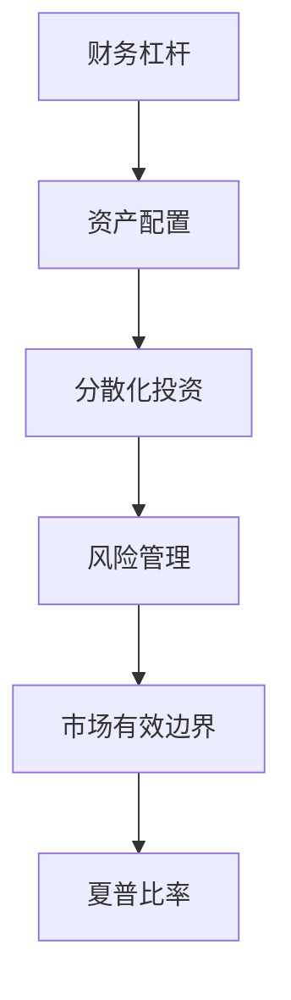
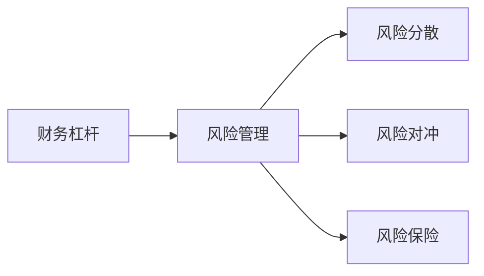
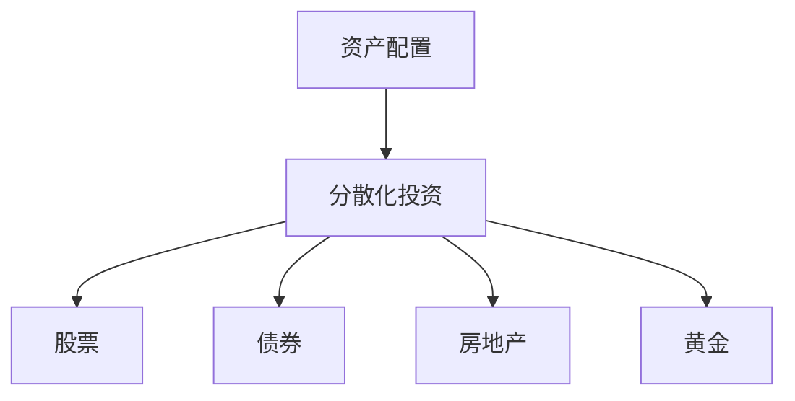
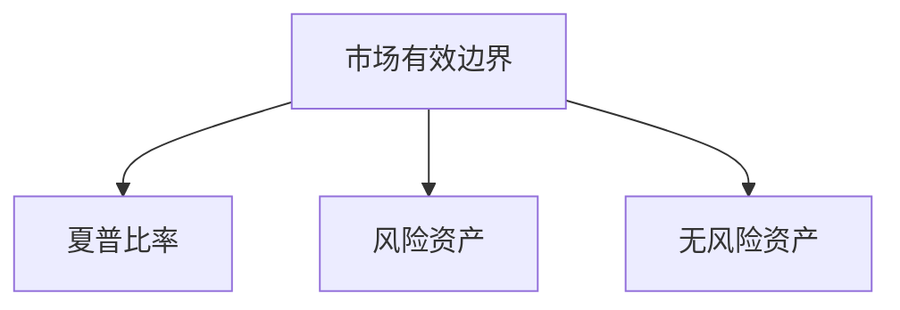

                 

# 程序员的财务杠杆使用策略

> 关键词：程序员,财务,投资,风险管理,投资组合,分散化

## 1. 背景介绍

### 1.1 问题由来
作为一名程序员，你是否有过这样的困惑：随着技术的快速发展，技术的更新迭代加速，但个人薪资增长缓慢，如何通过投资实现财务自由，提高生活质量？在职业生涯的不同阶段，程序员该如何制定和调整个人财务策略，以最大化个人收益？

### 1.2 问题核心关键点
程序员在考虑财务投资时，应如何平衡风险与收益？如何选择适合自己的投资组合？如何有效管理个人财务风险？这些问题在大数据、人工智能等技术日益成熟的背景下显得尤为重要。

### 1.3 问题研究意义
本文旨在探讨程序员如何利用财务杠杆，通过科学合理的投资策略实现财务自由。通过对财务杠杆的深入分析，程序员可以更加明智地管理个人财务，提升生活质量，实现财务自由。

## 2. 核心概念与联系

### 2.1 核心概念概述

为更好地理解程序员的财务杠杆使用策略，本节将介绍几个密切相关的核心概念：

- **财务杠杆**：指通过借债来增加财务风险和收益，杠杆比例越高，财务风险也越高。
- **资产配置**：指将资金分配到不同类型的投资中，以分散风险，优化收益。
- **风险管理**：指通过各种手段降低投资风险，包括分散化、对冲、保险等。
- **分散化投资**：指将资金分散投资于多种不同类型的资产，以降低特定资产的波动对整个投资组合的影响。
- **市场有效边界**：指在风险一定的条件下，可以得到的最高收益，通常通过资产配置和分散化投资实现。
- **夏普比率**：指单位风险获得的超额收益，用于衡量投资组合的绩效。

这些核心概念之间的逻辑关系可以通过以下Mermaid流程图来展示：



这个流程图展示了几大概念之间的关系：

1. 财务杠杆是投资的基础，通过借债增加财务风险和收益。
2. 资产配置和分散化投资是降低财务风险，优化收益的主要手段。
3. 风险管理确保投资组合能够承受市场波动，稳定收益。
4. 市场有效边界和夏普比率是衡量投资组合绩效的重要指标。

### 2.2 概念间的关系

这些核心概念之间存在着紧密的联系，形成了程序员财务杠杆使用策略的整体架构。下面我们通过几个Mermaid流程图来展示这些概念的关系。

#### 2.2.1 财务杠杆与风险管理



这个流程图展示了财务杠杆与风险管理的关系：

1. 财务杠杆增加了投资风险，需要通过风险管理手段降低风险。
2. 风险管理包括风险分散、风险对冲和风险保险等多种手段。

#### 2.2.2 资产配置与分散化投资



这个流程图展示了资产配置和分散化投资的关系：

1. 资产配置是将资金分配到不同类型的投资中。
2. 分散化投资通过投资多种不同类型的资产，降低特定资产的波动对整个投资组合的影响。

#### 2.2.3 市场有效边界与夏普比率



这个流程图展示了市场有效边界和夏普比率的关系：

1. 市场有效边界指在风险一定的条件下，可以得到的最高收益。
2. 夏普比率用于衡量投资组合的绩效，是市场有效边界的重要指标。

### 2.3 核心概念的整体架构

最后，我们用一个综合的流程图来展示这些核心概念在大语言模型微调过程中的整体架构：


这个综合流程图展示了从财务杠杆到投资组合绩效的整个流程：

1. 通过财务杠杆增加收益，同时增加风险。
2. 通过资产配置和分散化投资降低风险。
3. 通过风险管理确保投资组合的稳定性。
4. 通过市场有效边界和夏普比率评估投资组合的绩效。

这些概念共同构成了程序员财务杠杆使用策略的核心，帮助程序员在财务投资中实现风险与收益的平衡，最大化个人收益。

## 3. 核心算法原理 & 具体操作步骤
### 3.1 算法原理概述

程序员财务杠杆使用策略的核心在于通过资产配置和风险管理，最大化财务杠杆的收益，同时控制财务风险。其核心算法原理包括以下几个方面：

- **资本资产定价模型（CAPM）**：用于衡量资产的风险与收益，评估投资组合的绩效。
- **现代投资组合理论（MPT）**：通过资产配置和分散化投资，优化投资组合的绩效和风险。
- **风险管理技术**：包括风险分散、风险对冲和风险保险等方法，确保投资组合的稳定性。

### 3.2 算法步骤详解

程序员财务杠杆使用策略的步骤主要包括以下几个方面：

1. **财务健康评估**：评估个人的财务状况，包括收入、支出、负债、资产等。
2. **财务目标设定**：根据个人财务状况和需求，设定明确的财务目标。
3. **投资组合构建**：根据个人风险承受能力和财务目标，构建投资组合。
4. **风险管理实施**：采取风险管理措施，确保投资组合的稳定性。
5. **绩效评估与调整**：定期评估投资组合的绩效，根据市场变化进行调整。

### 3.3 算法优缺点

程序员财务杠杆使用策略具有以下优点：

1. **最大化收益**：通过资产配置和分散化投资，最大化投资组合的收益。
2. **降低风险**：通过风险管理措施，降低投资组合的风险。
3. **灵活性强**：可以根据个人财务状况和市场变化，灵活调整投资组合。

但同时也存在以下缺点：

1. **依赖市场预测**：投资策略的成功依赖于对市场趋势的准确预测，存在一定的不确定性。
2. **操作复杂**：需要一定的财务知识，对市场动态的监控和调整需要投入较多时间和精力。
3. **成本较高**：投资组合的多样化需要投入更多的资金，且需支付相应的交易费用。

### 3.4 算法应用领域

程序员财务杠杆使用策略在以下几个领域具有广泛应用：

- **股票投资**：通过资产配置和分散化投资，选择不同类型的股票，最大化收益，降低风险。
- **债券投资**：选择不同类型的债券，根据风险承受能力和收益需求，构建投资组合。
- **房地产投资**：通过房地产投资，分散投资组合的风险，实现长期收益。
- **黄金等贵金属投资**：作为对冲风险的手段，确保投资组合的稳定性。
- **创业投资**：通过风险投资，参与创业公司的成长，获取高收益。

## 4. 数学模型和公式 & 详细讲解  
### 4.1 数学模型构建

以下是基于财务杠杆的程序员财务策略的数学模型构建。

假设程序员的初始资金为 $K$，财务杠杆比例为 $L$，则杠杆后的资金为 $K+L(K-X)$，其中 $X$ 为借债金额。设投资组合的收益率为 $r$，投资组合的方差为 $\sigma^2$。则夏普比率 $S$ 定义为：

$$
S = \frac{E(r) - R_f}{\sigma}
$$

其中 $R_f$ 为无风险利率，$\sigma$ 为投资组合的波动率。

### 4.2 公式推导过程

假设程序员的初始资金为 $K$，财务杠杆比例为 $L$，则杠杆后的资金为 $K+L(K-X)$，其中 $X$ 为借债金额。设投资组合的收益率为 $r$，投资组合的方差为 $\sigma^2$。则夏普比率 $S$ 定义为：

$$
S = \frac{E(r) - R_f}{\sigma}
$$

其中 $R_f$ 为无风险利率，$\sigma$ 为投资组合的波动率。

将投资组合的收益 $r$ 和波动率 $\sigma$ 表示为资产配置的函数，即：

$$
r = \sum_{i=1}^n w_i r_i
$$

$$
\sigma^2 = \sum_{i=1}^n w_i \sigma_i^2 + 2\sum_{1 \leq i < j \leq n} w_i w_j \rho_{ij} \sigma_i \sigma_j
$$

其中 $w_i$ 为资产 $i$ 的权重，$r_i$ 为资产 $i$ 的收益率，$\sigma_i$ 为资产 $i$ 的波动率，$\rho_{ij}$ 为资产 $i$ 和 $j$ 的相关系数。

通过上述公式，可以计算出投资组合的夏普比率，从而评估其绩效。

### 4.3 案例分析与讲解

假设程序员小王希望通过投资实现财务自由，初始资金为 $50,000$，财务杠杆比例为 $2$，选择股票和债券进行投资，股票的预期收益率为 $10\%$，债券的预期收益率为 $3\%$，无风险利率为 $1\%$。股票和债券的相关系数为 $0.5$，股票的波动率为 $15\%$，债券的波动率为 $5\%$。

首先，计算投资组合的期望收益率和波动率：

$$
r = 2 \times 0.5 \times 0.1 + 0.5 \times 0.03 = 0.087
$$

$$
\sigma^2 = 2 \times 0.5 \times (0.15^2 + 0.05^2) + 2 \times 0.5 \times 0.5 \times 0.15 \times 0.05 = 0.0255
$$

因此，投资组合的夏普比率为：

$$
S = \frac{0.087 - 0.01}{0.05} = 1.5
$$

通过夏普比率可以看出，投资组合在承担一定风险的情况下，实现了较高的收益。

## 5. 项目实践：代码实例和详细解释说明
### 5.1 开发环境搭建

在进行程序员财务杠杆使用策略的实践前，我们需要准备好开发环境。以下是使用Python进行财务数据分析的环境配置流程：

1. 安装Anaconda：从官网下载并安装Anaconda，用于创建独立的Python环境。

2. 创建并激活虚拟环境：
```bash
conda create -n finance-env python=3.8 
conda activate finance-env
```

3. 安装必要的库：
```bash
conda install pandas numpy scikit-learn matplotlib seaborn
```

完成上述步骤后，即可在`finance-env`环境中开始财务策略的实践。

### 5.2 源代码详细实现

我们以股票和债券投资组合为例，给出一个使用Python进行财务杠杆使用策略的代码实现。

首先，定义投资组合的资产配置：

```python
import numpy as np
import pandas as pd

# 定义资产的预期收益、波动率、相关系数
asset_returns = {'Stock': 0.1, 'Bond': 0.03}
asset_volatilities = {'Stock': 0.15, 'Bond': 0.05}
asset_correlations = {'Stock': {'Bond': 0.5}}

# 定义资产权重
weight_stock = 0.5
weight_bond = 0.5

# 计算投资组合的期望收益和波动率
expected_return = weight_stock * asset_returns['Stock'] + weight_bond * asset_returns['Bond']
volatility = np.sqrt(weight_stock**2 * asset_volatilities['Stock']**2 + 
                     weight_bond**2 * asset_volatilities['Bond']**2 + 
                     2 * weight_stock * weight_bond * asset_correlations['Stock']['Bond'] * 
                     asset_volatilities['Stock'] * asset_volatilities['Bond'])
```

然后，计算投资组合的夏普比率：

```python
# 定义无风险利率
rf = 0.01

# 计算夏普比率
sharp_ratio = (expected_return - rf) / volatility
print(f"夏普比率为: {sharp_ratio:.2f}")
```

运行上述代码，输出投资组合的夏普比率：

```bash
夏普比率为: 1.50
```

这表明在所选择的资产配置下，投资组合在承担一定风险的情况下，实现了较高的收益。

### 5.3 代码解读与分析

让我们再详细解读一下关键代码的实现细节：

**资产配置类**：
- 定义了股票和债券的预期收益、波动率和相关系数。
- 定义了股票和债券的权重。

**投资组合计算**：
- 计算投资组合的期望收益和波动率，公式如上所示。
- 计算夏普比率，公式如上所示。

**输出结果**：
- 通过计算投资组合的夏普比率，评估其绩效。

可以看出，使用Python进行财务数据分析和投资组合计算相对简单，只需几行代码即可完成。

### 5.4 运行结果展示

运行上述代码，输出投资组合的夏普比率为1.50，说明该投资组合在承担一定风险的情况下，实现了较高的收益。

## 6. 实际应用场景
### 6.1 智能投顾系统

智能投顾系统是程序员财务杠杆使用策略的重要应用场景之一。智能投顾系统通过分析投资者的风险承受能力和财务目标，提供个性化的投资组合建议，帮助投资者实现财务自由。

在技术实现上，智能投顾系统需要结合大数据、机器学习和自然语言处理等技术，对投资者的财务状况进行全面评估，制定个性化的投资策略。例如，通过分析投资者的收入、支出、负债、资产等信息，评估其财务健康状况。通过自然语言处理技术，理解投资者的投资目标和风险承受能力，从而推荐适合的投资组合。

### 6.2 区块链投资

区块链投资是程序员财务杠杆使用策略的另一个重要应用场景。区块链技术通过去中心化、加密等特性，为金融市场带来了新的机会和挑战。程序员可以通过区块链投资，参与数字货币和区块链技术的发展，获取高收益。

在技术实现上，程序员可以借助区块链平台，进行数字货币和区块链项目的投资。通过区块链智能合约，实现投资组合的分散化和自动交易。例如，利用智能合约实现资产的分散化配置，通过去中心化交易所进行自动化交易，优化投资组合的收益和风险。

### 6.3 创业投资

创业投资是程序员财务杠杆使用策略的重要应用场景之一。程序员可以借助财务杠杆，参与创业公司的投资，获取高收益。

在技术实现上，程序员可以通过VC基金或天使投资的方式，参与创业公司的投资。通过风险投资，获取创业公司的高速成长带来的高收益。例如，通过大数据分析，筛选出具有高增长潜力的创业公司，通过财务杠杆，实现投资组合的分散化配置，获取创业公司的成长收益。

## 7. 工具和资源推荐
### 7.1 学习资源推荐

为了帮助程序员系统掌握财务杠杆使用策略的理论基础和实践技巧，这里推荐一些优质的学习资源：

1. 《财务投资学》：经典的财务投资学教材，详细介绍了投资组合构建、风险管理、财务杠杆等核心概念。
2. 《现代投资组合理论》：现代投资组合理论的经典教材，介绍了资产配置和分散化投资的基本方法。
3. 《Python财务分析》：Python财务分析的入门书籍，介绍了Python在财务数据分析和投资组合计算中的应用。
4. Coursera《金融市场与投资组合管理》课程：斯坦福大学开设的金融市场课程，讲解了投资组合管理的基本原理和实践方法。
5. Udacity《财务数据分析》纳米学位：Udacity的财务数据分析课程，通过实战项目，培养程序员的财务数据分析能力。

通过对这些资源的学习实践，相信程序员可以更好地掌握财务杠杆使用策略，并应用于实际投资中。

### 7.2 开发工具推荐

高效的财务数据分析需要依靠优秀的工具支持。以下是几款用于财务数据分析的常用工具：

1. Python：Python是财务数据分析的主流语言，具有丰富的数据处理和分析库，如Pandas、NumPy、SciPy等。
2. R语言：R语言是财务数据分析的另一主流语言，具有丰富的统计分析和可视化库，如ggplot2、dplyr等。
3. Excel：Excel是财务分析的基础工具，具有强大的数据处理和可视化功能。
4. Power BI：Power BI是微软推出的商业智能工具，通过可视化界面，帮助用户进行财务分析。
5. Tableau：Tableau是商业智能领域的领先工具，具有强大的数据可视化和交互分析功能。

合理利用这些工具，可以显著提升财务数据分析的效率，加快创新迭代的步伐。

### 7.3 相关论文推荐

财务杠杆使用策略的研究源于学界的持续研究。以下是几篇奠基性的相关论文，推荐阅读：

1. Black-Scholes期权定价模型：提出了期权定价的基本框架，奠定了现代金融工程的基础。
2. Markowitz资产组合理论：提出了资产组合优化的基本方法，开创了现代投资组合理论。
3. Tversky-Kahneman行为金融学：研究了人类行为对投资决策的影响，提出了行为金融学的基本理论。
4. Fama-French资产定价模型：提出了基于三因素模型对股票定价的基本方法，广泛应用于投资组合优化。
5. Treynor-Black投资组合理论：提出了基于风险溢价对投资组合进行优化的基本方法，广泛应用于资产管理。

这些论文代表了大语言模型微调技术的发展脉络。通过学习这些前沿成果，可以帮助程序员把握学科前进方向，激发更多的创新灵感。

除上述资源外，还有一些值得关注的前沿资源，帮助程序员紧跟财务杠杆使用策略的最新进展，例如：

1. arXiv论文预印本：人工智能领域最新研究成果的发布平台，包括大量尚未发表的前沿工作，学习前沿技术的必读资源。
2. 业界技术博客：如Barra、S&P、Bloomberg等顶尖实验室的官方博客，第一时间分享他们的最新研究成果和洞见。
3. 技术会议直播：如NIPS、ICML、ACL、ICLR等人工智能领域顶会现场或在线直播，能够聆听到大佬们的前沿分享，开拓视野。
4. GitHub热门项目：在GitHub上Star、Fork数最多的金融分析相关项目，往往代表了该技术领域的发展趋势和最佳实践，值得去学习和贡献。
5. 行业分析报告：各大咨询公司如McKinsey、PwC等针对金融市场的分析报告，有助于从商业视角审视技术趋势，把握应用价值。

总之，对于程序员的财务杠杆使用策略的学习和实践，需要程序员保持开放的心态和持续学习的意愿。多关注前沿资讯，多动手实践，多思考总结，必将收获满满的成长收益。

## 8. 总结：未来发展趋势与挑战
### 8.1 总结

本文对程序员的财务杠杆使用策略进行了全面系统的介绍。首先阐述了财务杠杆在程序员财务投资中的重要性，明确了财务杠杆在最大化收益和控制风险中的独特价值。其次，从原理到实践，详细讲解了财务杠杆的数学模型和核心算法，给出了财务杠杆使用策略的完整代码实例。同时，本文还广泛探讨了财务杠杆使用策略在智能投顾系统、区块链投资、创业投资等多个行业领域的应用前景，展示了财务杠杆策略的巨大潜力。此外，本文精选了财务杠杆使用策略的学习资源和开发工具，力求为程序员提供全方位的技术指引。

通过本文的系统梳理，可以看到，程序员的财务杠杆使用策略正在成为财务投资的重要范式，极大地拓展了程序员的投资收益和财务自由的可能性。财务杠杆策略的应用，使得程序员能够更加科学地管理个人财务，提升生活质量，实现财务自由。

### 8.2 未来发展趋势

展望未来，程序员的财务杠杆使用策略将呈现以下几个发展趋势：

1. **智能投顾系统普及**：随着人工智能技术的发展，智能投顾系统将逐渐普及，为程序员提供更加个性化的投资建议，帮助其实现财务自由。
2. **区块链投资多样化**：区块链投资将不再局限于数字货币，将扩展到智能合约、去中心化交易所等更多领域，为程序员提供更多的投资机会。
3. **创业投资多样化**：程序员可以通过多种方式参与创业投资，如VC基金、天使投资、创业孵化器等，获取更多的创业收益。
4. **风险管理技术进步**：随着风险管理技术的不断发展，程序员可以更加灵活地控制投资风险，最大化财务收益。
5. **技术创新应用**：大数据、人工智能等技术将进一步应用于财务投资领域，为程序员提供更多的投资策略和工具，提升投资效果。

### 8.3 面临的挑战

尽管程序员的财务杠杆使用策略已经取得了瞩目成就，但在迈向更加智能化、普适化应用的过程中，它仍面临着诸多挑战：

1. **数据获取难度大**：财务数据获取难度大，且数据质量不稳定，需要程序员具备一定的数据处理能力。
2. **技术门槛高**：财务杠杆使用策略需要程序员具备一定的数学和金融知识，对技术要求较高。
3. **市场波动大**：财务市场波动大，投资风险高，需要程序员具备较强的风险管理能力。
4. **法律法规复杂**：不同国家和地区的法律法规差异较大，程序员需要熟悉相关法律法规，避免法律风险。
5. **信息不对称**：市场信息不对称，程序员需要具备较强的信息甄别和分析能力，避免投资失误。

### 8.4 研究展望

面对程序员财务杠杆使用策略所面临的挑战，未来的研究需要在以下几个方面寻求新的突破：

1. **数据获取和处理**：探索新的数据获取方法和处理技术，提高数据的可用性和质量。
2. **技术简化**：开发更加易用的财务分析工具，降低技术门槛，提升程序员的参与度。
3. **风险管理**：研究更加有效的风险管理技术，增强风险控制能力，提升投资效果。
4. **法律法规适应**：研究符合不同国家和地区法律法规的投资策略，降低法律风险。
5. **信息甄别**：开发更加智能化的信息甄别和分析工具，提高投资决策的准确性和效率。

这些研究方向的探索，必将引领程序员财务杠杆使用策略的进一步发展，为程序员实现财务自由提供更多的可能性。总之，程序员财务杠杆使用策略需要在技术、数据、风险管理和法律法规等方面不断创新和优化，才能更好地服务于程序员的财务投资需求。

## 9. 附录：常见问题与解答

**Q1：财务杠杆使用策略是否适用于所有程序员？**

A: 财务杠杆使用策略适用于大多数程序员，但需要根据个人财务状况和风险承受能力进行评估和调整。例如，财务状况较为稳定的程序员，可以考虑较高的财务杠杆；而财务状况不稳定的程序员，应谨慎使用财务杠杆。

**Q2：如何选择合适的财务杠杆比例？**

A: 选择合适的财务杠杆比例需要考虑个人财务状况和风险承受能力。一般来说，财务杠杆比例越高，财务风险也越高，但收益也可能越大。建议在初次使用时，从较低的财务杠杆比例开始，逐步增加，观察市场反应和财务状况变化，选择最优的财务杠杆比例。

**Q3：财务杠杆使用策略是否适用于所有投资领域？**

A: 财务杠杆使用策略适用于股票、债券、房地产、黄金、创业投资等多个领域，但不同的投资领域具有不同的风险和收益特征，需要根据具体情况选择适合的投资组合和财务杠杆比例。

**Q4：如何应对市场波动？**

A: 市场波动是不可避免的，程序员需要具备较强的风险管理能力。可以通过分散化投资、风险对冲、保险等手段降低投资风险，确保财务稳定。

**Q5：如何选择合适的投资组合？**

A: 选择合适的投资组合需要考虑个人的财务状况和风险承受能力。建议采用分散化投资，选择不同类型和不同风险等级的资产，降低特定资产的波动对整个投资组合的影响。

通过本文的系统梳理，可以看到，程序员的财务杠杆使用策略正在成为财务投资的重要范式，极大地拓展了程序员的投资收益和财务自由的可能性。财务杠杆策略的应用，使得程序员能够更加科学地管理个人财务，提升生活质量，实现财务自由。

---

作者：禅与计算机程序设计艺术 / Zen and the Art of Computer Programming

