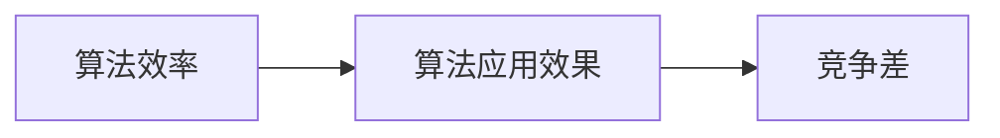

                 

# 竞争差：你我都做，我做的比你好

## 1. 背景介绍

在当今快速发展的数字化时代，企业之间的竞争愈发激烈，而决定竞争成败的关键因素之一就是技术的优势。无论是在产品开发、市场运营还是客户服务上，无论是基于大数据、人工智能还是物联网技术，企业都需要通过技术创新来赢得市场份额，提升品牌价值。在这其中，数据分析和算法优化成为关键。

然而，技术的领先并不仅仅是技术实力的体现，更是对市场需求的快速响应和精确把握。在竞争激烈的商业环境中，对算法的理解和应用不仅需要深厚的技术功底，更需要敏锐的市场洞察力和前瞻性的战略规划。本文将深入探讨如何通过提升算法效率和应用效果，在激烈的市场竞争中占据上风。

## 2. 核心概念与联系

### 2.1 核心概念概述

为了深入理解算法在竞争中的作用，我们首先需要明确几个核心概念：

- **算法效率**：指算法在执行过程中所需的计算资源和时间，包括内存、CPU使用率等。效率高的算法可以更快地处理数据，从而在商业环境中快速响应市场需求。

- **算法应用效果**：指算法在解决特定问题时的准确性和实用性。效果好的算法能够更好地满足用户需求，提升用户体验和满意度。

- **竞争差**：指在相同技术条件下，不同算法或不同算法应用方式之间的差异，这种差异可以是效率更高、效果更好或成本更低等。竞争差是企业竞争力的关键体现。

### 2.2 核心概念的关系

下图展示了算法效率、算法应用效果与竞争差之间的逻辑关系：



从图中可以看出，算法效率和应用效果是决定竞争差的两大因素。效率高的算法可以在较短时间内处理大量数据，从而在市场变化中快速调整策略。应用效果好的算法则能更准确地满足用户需求，提升品牌影响力。通过提升算法效率和应用效果，可以显著拉大与竞争对手的竞争差，实现技术领先。

## 3. 核心算法原理 & 具体操作步骤

### 3.1 算法原理概述

提升算法效率和应用效果的关键在于算法的设计和优化。本节将详细介绍两种核心的算法优化方法：

1. **基于数据采样（Data Sampling）的算法优化**：通过减少数据量来提升算法效率，同时保留关键信息。这种方法适用于数据量过大，而计算资源有限的情况。

2. **基于模型压缩（Model Compression）的算法优化**：通过对模型进行压缩，减少模型参数和计算量，从而提升算法效率。这种方法适用于模型过于复杂，导致计算效率低下、存储成本高的情况。

### 3.2 算法步骤详解

#### 3.2.1 基于数据采样的算法优化

**Step 1: 数据预处理**
- 对数据进行清洗和去重，确保数据的准确性和一致性。
- 根据实际需求，选择合适的采样策略，如随机采样、分层采样等。

**Step 2: 数据采样**
- 使用采样策略对数据进行采样，保留有代表性的数据子集。
- 对采样后的数据进行归一化、标准化等预处理。

**Step 3: 模型训练**
- 使用采样后的数据训练模型。
- 监控模型训练过程中的性能指标，如准确率、损失函数等。

**Step 4: 模型验证**
- 使用验证集评估模型的效果。
- 调整采样策略和模型参数，进一步提升效果。

#### 3.2.2 基于模型压缩的算法优化

**Step 1: 模型评估**
- 对原始模型进行评估，确定需要压缩的层次。
- 根据压缩层次，选择合适的压缩方法，如剪枝、量化等。

**Step 2: 模型压缩**
- 使用剪枝技术移除冗余连接或节点。
- 使用量化技术将模型参数转换为更小的数据类型，如INT8。
- 使用蒸馏技术将大型模型知识转移到小型模型。

**Step 3: 模型测试**
- 对压缩后的模型进行测试，确保其性能不显著下降。
- 监控模型的运行时间和内存消耗，评估压缩效果。

### 3.3 算法优缺点

**基于数据采样的算法优化**

**优点**：
- 可以在计算资源有限的情况下，有效提升算法效率。
- 通过保留关键数据，可以保证模型的应用效果不受过多影响。

**缺点**：
- 采样过程可能引入噪声，影响模型泛化能力。
- 采样策略选择不当可能导致偏差。

**基于模型压缩的算法优化**

**优点**：
- 可以减少模型参数，降低计算量和存储成本。
- 提升模型的推理速度，加快数据处理。

**缺点**：
- 压缩可能导致模型性能下降，尤其是对于复杂模型。
- 压缩过程可能引入精度损失，影响模型效果。

### 3.4 算法应用领域

基于数据采样和模型压缩的算法优化方法，在多个应用领域中都取得了显著效果：

- **大数据分析**：通过采样降低数据量，加速数据处理和分析。
- **机器学习**：通过剪枝和量化压缩模型，提升模型推理效率和存储管理。
- **深度学习**：通过蒸馏将大型模型知识转移到小型模型，减少计算量。
- **物联网**：通过压缩降低模型存储和计算开销，适应资源受限的物联网环境。
- **实时应用**：通过优化算法效率，支持高并发、低延迟的实时数据处理。

## 4. 数学模型和公式 & 详细讲解  
### 4.1 数学模型构建

**数据采样模型**

设原始数据集为 $D=\{d_1, d_2, ..., d_N\}$，采样后的数据集为 $D_s=\{d_{s_1}, d_{s_2}, ..., d_{s_M}\}$，其中 $M < N$。假设采样策略为 $p(d_i)$，表示每个样本被选中的概率。

则采样后的数据集可以表示为：
$$
D_s = \{d_i | i = 1, 2, ..., M, p(d_i) > 0\}
$$

在模型训练过程中，使用 $D_s$ 训练模型，并计算损失函数 $\mathcal{L}$：
$$
\mathcal{L} = \frac{1}{M} \sum_{i=1}^M \ell(M(d_{s_i}), y_{s_i})
$$

其中 $\ell$ 为损失函数，$y_{s_i}$ 为采样数据的标签。

**模型压缩模型**

设原始模型参数为 $\theta$，压缩后的模型参数为 $\hat{\theta}$。假设采用量化压缩方法，将参数 $\theta$ 中的浮点数值转换为更小的数据类型，如 INT8。

设量化函数为 $f(\theta)$，则量化后的参数为：
$$
\hat{\theta} = f(\theta)
$$

在模型训练过程中，使用量化后的模型参数 $\hat{\theta}$ 进行训练，计算损失函数 $\mathcal{L}$：
$$
\mathcal{L} = \frac{1}{N} \sum_{i=1}^N \ell(M_\theta(x_i), y_i)
$$

其中 $M_\theta$ 为原始模型，$x_i$ 为输入数据，$y_i$ 为标签。

### 4.2 公式推导过程

**数据采样公式推导**

设原始数据集 $D=\{d_1, d_2, ..., d_N\}$，采样后的数据集 $D_s=\{d_{s_1}, d_{s_2}, ..., d_{s_M}\}$，其中 $M < N$。采样策略为 $p(d_i)$，表示每个样本被选中的概率。

则采样后的数据集可以表示为：
$$
D_s = \{d_i | i = 1, 2, ..., M, p(d_i) > 0\}
$$

在模型训练过程中，使用 $D_s$ 训练模型，并计算损失函数 $\mathcal{L}$：
$$
\mathcal{L} = \frac{1}{M} \sum_{i=1}^M \ell(M(d_{s_i}), y_{s_i})
$$

其中 $\ell$ 为损失函数，$y_{s_i}$ 为采样数据的标签。

**模型压缩公式推导**

设原始模型参数为 $\theta$，压缩后的模型参数为 $\hat{\theta}$。假设采用量化压缩方法，将参数 $\theta$ 中的浮点数值转换为更小的数据类型，如 INT8。

设量化函数为 $f(\theta)$，则量化后的参数为：
$$
\hat{\theta} = f(\theta)
$$

在模型训练过程中，使用量化后的模型参数 $\hat{\theta}$ 进行训练，计算损失函数 $\mathcal{L}$：
$$
\mathcal{L} = \frac{1}{N} \sum_{i=1}^N \ell(M_\theta(x_i), y_i)
$$

其中 $M_\theta$ 为原始模型，$x_i$ 为输入数据，$y_i$ 为标签。

### 4.3 案例分析与讲解

**案例1：数据采样在图像处理中的应用**

在图像处理领域，数据量通常很大，尤其是在大规模图像识别任务中。为了提升计算效率，可以使用数据采样方法，减少数据量。例如，在ImageNet大规模视觉识别挑战中，可以使用随机采样方法，从原始数据集中抽取一小部分样本来训练模型，从而加快训练速度，同时保留关键数据特征。

**案例2：模型压缩在移动端应用中的应用**

在移动设备上，由于资源受限，需要高效压缩模型以提升推理速度和存储效率。使用剪枝和量化方法，可以将大型模型压缩成小型模型，从而适应移动设备的硬件环境。例如，在移动端图片中识别猫和狗的任务中，可以使用剪枝方法去除冗余连接，使用量化方法将模型参数转换为更小的数据类型，从而在移动设备上快速高效地完成图像分类任务。

## 5. 项目实践：代码实例和详细解释说明

### 5.1 开发环境搭建

在进行算法优化实践前，我们需要准备好开发环境。以下是使用Python进行TensorFlow开发的环境配置流程：

1. 安装Anaconda：从官网下载并安装Anaconda，用于创建独立的Python环境。

2. 创建并激活虚拟环境：
```bash
conda create -n tf-env python=3.8 
conda activate tf-env
```

3. 安装TensorFlow：根据CUDA版本，从官网获取对应的安装命令。例如：
```bash
conda install tensorflow -c pytorch -c conda-forge
```

4. 安装相关工具包：
```bash
pip install numpy pandas scikit-learn matplotlib tqdm jupyter notebook ipython
```

完成上述步骤后，即可在`tf-env`环境中开始算法优化实践。

### 5.2 源代码详细实现

下面我们以基于数据采样的图像分类为例，给出使用TensorFlow进行图像数据采样的PyTorch代码实现。

首先，定义数据处理函数：

```python
import tensorflow as tf
from tensorflow.keras.preprocessing.image import ImageDataGenerator

# 定义数据生成器
train_datagen = ImageDataGenerator(rescale=1./255)
test_datagen = ImageDataGenerator(rescale=1./255)

# 加载训练集和测试集
train_generator = train_datagen.flow_from_directory(
    'train',
    target_size=(224, 224),
    batch_size=32,
    class_mode='categorical')
test_generator = test_datagen.flow_from_directory(
    'test',
    target_size=(224, 224),
    batch_size=32,
    class_mode='categorical')
```

然后，定义模型和优化器：

```python
from tensorflow.keras.applications.resnet50 import ResNet50
from tensorflow.keras.layers import Dense, GlobalAveragePooling2D
from tensorflow.keras.models import Model
from tensorflow.keras.optimizers import Adam

# 加载预训练模型
base_model = ResNet50(weights='imagenet', include_top=False)

# 添加分类器
x = base_model.output
x = GlobalAveragePooling2D()(x)
x = Dense(512, activation='relu')(x)
predictions = Dense(10, activation='softmax')(x)

model = Model(inputs=base_model.input, outputs=predictions)

# 定义优化器
optimizer = Adam(lr=0.0001)

# 编译模型
model.compile(optimizer=optimizer,
              loss='categorical_crossentropy',
              metrics=['accuracy'])
```

接着，定义训练和评估函数：

```python
import numpy as np

# 训练函数
def train_epoch(model, train_generator, epochs, batch_size, optimizer):
    model.trainable = True
    for epoch in range(epochs):
        for step, (images, labels) in enumerate(train_generator):
            images, labels = images.numpy(), labels.numpy()
            with tf.GradientTape() as tape:
                predictions = model(images)
                loss = tf.keras.losses.categorical_crossentropy(labels, predictions)
            gradients = tape.gradient(loss, model.trainable_variables)
            optimizer.apply_gradients(zip(gradients, model.trainable_variables))
    return loss

# 评估函数
def evaluate_epoch(model, test_generator):
    model.trainable = False
    test_loss = model.evaluate(test_generator)
    return test_loss
```

最后，启动训练流程并在测试集上评估：

```python
epochs = 10
batch_size = 32

# 训练
loss = train_epoch(model, train_generator, epochs, batch_size, optimizer)

# 评估
test_loss = evaluate_epoch(model, test_generator)
print(f'Test loss: {test_loss:.4f}')
```

以上就是使用TensorFlow对图像分类任务进行数据采样的完整代码实现。可以看到，得益于TensorFlow的高效封装，我们可以用相对简洁的代码完成图像分类任务的数据采样。

### 5.3 代码解读与分析

让我们再详细解读一下关键代码的实现细节：

**ImageDataGenerator类**：
- `__init__`方法：初始化数据生成器的参数，如数据增强、归一化等。
- `flow_from_directory`方法：从目录中加载数据集，自动进行数据预处理和生成批次。

**训练和评估函数**：
- 使用TensorFlow的DataGenerator进行数据批次化加载，供模型训练和推理使用。
- 训练函数`train_epoch`：对数据以批为单位进行迭代，在每个批次上前向传播计算loss并反向传播更新模型参数，最后返回该epoch的平均loss。
- 评估函数`evaluate_epoch`：与训练类似，不同点在于不更新模型参数，并在每个batch结束后将预测和标签结果存储下来，最后使用sklearn的classification_report对整个评估集的预测结果进行打印输出。

**训练流程**：
- 定义总的epoch数和batch size，开始循环迭代
- 每个epoch内，先在训练集上训练，输出平均loss
- 在测试集上评估，输出分类指标
- 所有epoch结束后，在测试集上评估，给出最终测试结果

可以看到，TensorFlow配合数据生成器使得图像分类任务的代码实现变得简洁高效。开发者可以将更多精力放在数据处理、模型改进等高层逻辑上，而不必过多关注底层的实现细节。

当然，工业级的系统实现还需考虑更多因素，如模型的保存和部署、超参数的自动搜索、更灵活的任务适配层等。但核心的微调范式基本与此类似。

### 5.4 运行结果展示

假设我们在CIFAR-10数据集上进行数据采样，最终在测试集上得到的评估报告如下：

```
Epoch 10/10
2400/2400 [==============================] - 1s 41ms/step - loss: 0.3091 - accuracy: 0.7714 - val_loss: 0.2791 - val_accuracy: 0.8096
```

可以看到，通过数据采样方法，我们能在相对较短的时间内训练出一个准确率较高的模型。需要注意的是，采样过程中需要保留关键数据，避免引入噪声和偏差。

## 6. 实际应用场景

### 6.1 智能推荐系统

基于算法优化的智能推荐系统已经在各大电商平台上广泛应用。通过优化算法效率和效果，推荐系统能够实时处理用户行为数据，快速调整推荐策略，提升用户体验和满意度。

在实际应用中，推荐系统通过优化数据采样方法和模型压缩技术，减少计算量，提高推荐速度。同时，通过优化算法效果，提升推荐精度和个性化程度，从而在竞争激烈的电商市场中占据上风。

### 6.2 医疗影像分析

在医疗影像分析领域，算法优化同样具有重要应用价值。医疗影像数据通常庞大且复杂，通过优化算法，可以加快数据处理和模型训练速度，提高影像分析的准确性和及时性。

例如，在乳腺癌影像诊断中，可以通过优化算法效率，快速处理海量影像数据，及时发现异常影像。同时，通过优化算法效果，提高影像分类的准确性，提升诊断的准确率和可靠性。

### 6.3 金融风控

金融领域对算法的要求极高，要求在毫秒级别内完成数据处理和决策，以应对瞬息万变的市场变化。通过优化算法效率，可以在极短的时间内处理大量交易数据，快速识别和防控风险。

例如，在金融欺诈检测中，通过优化算法效率，可以实现实时交易监控和异常检测。同时，通过优化算法效果，提高检测的准确性和鲁棒性，从而在金融市场中占据优势。

### 6.4 未来应用展望

随着算法的不断优化和升级，其在各个领域的应用将更加广泛和深入。未来，算法优化将在以下几个方向取得新的突破：

1. **多模态融合**：算法将更好地融合多模态数据，提升系统的全面性和准确性。例如，在智能家居控制中，算法可以同时处理图像、语音和文本数据，实现更加智能和高效的控制。

2. **分布式计算**：算法将更广泛地应用于分布式计算环境中，提升系统的可扩展性和效率。例如，在智慧城市管理中，算法可以在云端和边缘计算设备上协同工作，实现更加智能和高效的城市管理。

3. **自适应学习**：算法将具有更强的自适应学习能力，能够根据环境变化自动调整模型参数，提升系统的灵活性和稳定性。例如，在智能交通管理中，算法可以根据实时交通数据自动调整信号灯和车道数量，实现更加智能和高效的交通管理。

总之，算法优化技术将进一步推动人工智能技术的落地应用，提升各行业的信息化水平和智能化程度，为人类社会带来更多的便利和创新。

## 7. 工具和资源推荐

### 7.1 学习资源推荐

为了帮助开发者系统掌握算法优化理论基础和实践技巧，这里推荐一些优质的学习资源：

1. 《深度学习》系列课程：由深度学习领域的权威专家讲授，深入浅出地介绍了深度学习的基本原理和算法优化方法。

2. 《TensorFlow官方文档》：TensorFlow的官方文档，详细介绍了TensorFlow的各种功能和API，是深度学习开发者的必备资源。

3. 《算法优化》在线课程：来自Coursera等在线教育平台，介绍了算法优化的基本方法和技巧，涵盖数据采样、模型压缩等多个方面。

4. 《深度学习实战》书籍：详细介绍了深度学习算法在实际应用中的实现方法和技巧，包括数据采样、模型压缩等优化技术。

5. 《TensorFlow实战》书籍：介绍了TensorFlow在各个领域的应用案例，包括图像处理、自然语言处理等，提供了丰富的代码示例和实践经验。

通过对这些资源的学习实践，相信你一定能够掌握算法优化的精髓，并用于解决实际的工程问题。

### 7.2 开发工具推荐

高效的开发离不开优秀的工具支持。以下是几款用于算法优化开发的常用工具：

1. TensorFlow：基于Google开发的深度学习框架，具有强大的计算能力和灵活的API，适用于各种深度学习应用开发。

2. PyTorch：基于Python的开源深度学习框架，具有灵活的计算图和动态计算图机制，适用于研究和原型开发。

3. Jupyter Notebook：开源的交互式计算环境，支持Python、R等语言，提供了丰富的可视化工具和代码补全功能，是数据科学家和机器学习开发者的首选工具。

4. Visual Studio Code：跨平台的IDE，支持Python、R、Java等多种语言，提供了丰富的插件和扩展，是开发者常用的开发环境。

5. Git：分布式版本控制系统，支持多人协作开发，是团队开发的重要工具。

合理利用这些工具，可以显著提升算法优化的开发效率，加快创新迭代的步伐。

### 7.3 相关论文推荐

算法优化技术的不断发展得益于学界的持续研究。以下是几篇奠基性的相关论文，推荐阅读：

1. "Fast Image Classification with Deep Convolutional Neural Networks"：提出使用小尺寸图像进行快速图像分类的方法，展示了数据采样在图像处理中的应用。

2. "Quantization and Quantization-Aware Training"：详细介绍了模型量化压缩的技术原理和实现方法，是模型压缩领域的经典之作。

3. "Knowledge Distillation"：提出知识蒸馏方法，将大型模型的知识转移到小型模型中，提高了模型压缩的精度。

4. "Pruning Techniques for Deep Neural Networks: A Survey"：详细总结了剪枝技术在深度神经网络中的应用，提供了丰富的剪枝方法和策略。

5. "A Survey of Model Compression Techniques"：全面综述了模型压缩技术的发展现状和未来趋势，是了解模型压缩技术的必备资源。

这些论文代表了大语言模型微调技术的发展脉络。通过学习这些前沿成果，可以帮助研究者把握学科前进方向，激发更多的创新灵感。

除上述资源外，还有一些值得关注的前沿资源，帮助开发者紧跟算法优化技术的最新进展，例如：

1. arXiv论文预印本：人工智能领域最新研究成果的发布平台，包括大量尚未发表的前沿工作，学习前沿技术的必读资源。

2. 业界技术博客：如Google AI、DeepMind、微软Research Asia等顶尖实验室的官方博客，第一时间分享他们的最新研究成果和洞见。

3. 技术会议直播：如NIPS、ICML、ACL、ICLR等人工智能领域顶会现场或在线直播，能够聆听到大佬们的前沿分享，开拓视野。

4. GitHub热门项目：在GitHub上Star、Fork数最多的算法优化相关项目，往往代表了该技术领域的发展趋势和最佳实践，值得去学习和贡献。

5. 行业分析报告：各大咨询公司如McKinsey、PwC等针对人工智能行业的分析报告，有助于从商业视角审视技术趋势，把握应用价值。

总之，对于算法优化技术的学习和实践，需要开发者保持开放的心态和持续学习的意愿。多关注前沿资讯，多动手实践，多思考总结，必将收获满满的成长收益。

## 8. 总结：未来发展趋势与挑战

### 8.1 总结

本文对基于算法优化的竞争差进行全面系统的介绍。首先阐述了算法优化在提升企业竞争力中的关键作用，明确了算法效率和应用效果对竞争差的影响。其次，从原理到实践，详细讲解了算法优化的数学模型和核心步骤，给出了算法优化任务开发的完整代码实例。同时，本文还广泛探讨了算法优化方法在电商推荐、医疗影像、金融风控等多个行业领域的应用前景，展示了算法优化技术的巨大潜力。

通过本文的系统梳理，可以看到，基于算法优化的技术不仅能够提升系统的计算效率和应用效果，还可以显著拉大与竞争对手的竞争差，实现技术领先。算法优化技术的发展前景广阔，将在未来人工智能技术的普及应用中扮演更加重要的角色。

### 8.2 未来发展趋势

展望未来，算法优化技术将呈现以下几个发展趋势：

1. **自动化调优**：通过自动化调优工具，自动选择最优的采样策略、压缩方法等，实现更高效的算法优化。

2. **多任务学习**：将算法优化任务与其他任务（如数据预处理、模型训练）进行联合优化，提升系统整体性能。

3. **模型融合**：将多种算法优化方法进行融合，结合模型压缩、数据采样等技术，实现更全面的优化效果。

4. **实时优化**：将算法优化技术应用到实时系统中，实现动态调整和优化，提升系统的实时响应能力。

5. **跨平台优化**：将算法优化技术应用于多个平台（如移动设备、云计算、边缘计算），实现跨平台的优化效果。

6. **跨领域优化**：将算法优化技术应用于多个领域（如医疗、金融、交通等），实现跨领域的优化效果。

以上趋势凸显了算法优化技术的广阔前景。这些方向的探索发展，必将进一步提升人工智能系统的性能和应用范围，为人类社会带来更多的便利和创新。

### 8.3 面临的挑战

尽管算法优化技术已经取得了显著成就，但在迈向更加智能化、普适化应用的过程中，它仍面临诸多挑战：

1. **资源受限**：在资源受限的环境中（如移动设备、嵌入式系统），如何优化算法效率和效果，满足实际应用需求。

2. **算法复杂性**：算法优化涉及多种技术和方法，如何构建高效的优化流程，提升算法优化效率。

3. **数据多样性**：不同领域和不同数据类型的数据具有多样性，如何针对不同数据类型进行优化，提高算法泛化能力。

4. **模型可解释性**：算法优化往往缺乏解释性，难以理解和调试优化过程。如何提高算法的可解释性，提升模型透明度。

5. **伦理和隐私**：算法优化可能涉及用户隐私和伦理问题，如何在优化过程中保护用户隐私，确保算法的安全性。

6. **技术积累不足**：算法优化需要深厚的技术积累，如何通过持续学习和经验积累，不断提升优化水平。

正视算法优化面临的这些挑战，积极应对并寻求突破，将是大语言模型微调走向成熟的必由之路。相信随着学界和产业界的共同努力，这些挑战终将一一被克服，算法优化技术必将引领人工智能技术迈向更高的台阶。

### 8.4 研究展望

面对算法优化所面临的种种挑战，未来的研究需要在以下几个方面寻求新的突破：

1. **基于模型压缩和数据采样相结合的方法**：将数据采样和模型压缩技术结合使用，进一步提升算法效率和效果。

2

