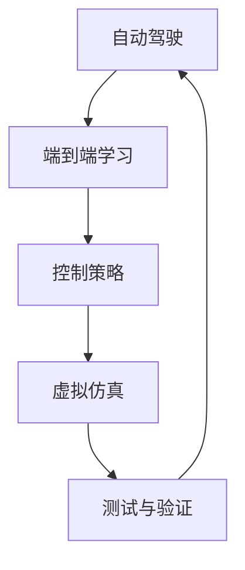
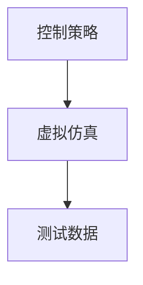
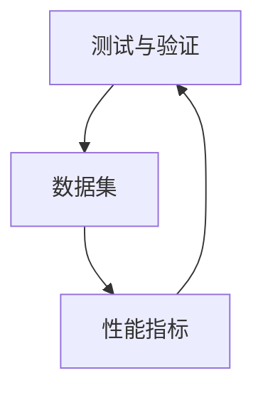
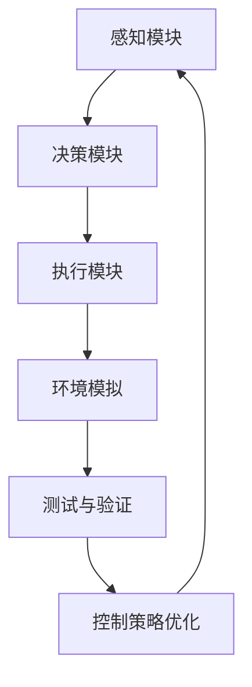

                 

# 端到端自动驾驶的开环训练与开环测试

> 关键词：自动驾驶, 开环训练, 端到端学习, 控制策略, 测试与验证, 智能系统

## 1. 背景介绍

### 1.1 问题由来
自动驾驶技术近年来取得了显著进展，但传统闭环训练和测试方式限制了其大规模部署。闭环训练要求在实际道路测试数据上进行，但获取高质量测试数据成本高昂。而闭环测试需要反复迭代优化，效率低下。因此，亟需一种端到端开环训练与测试方法，以提升自动驾驶技术的安全性和可靠性。

### 1.2 问题核心关键点
端到端自动驾驶的开环训练与测试方法，旨在通过模拟环境构建虚拟测试数据集，结合控制策略优化，实现对驾驶任务的端到端学习，同时通过精确的测试与验证手段，保证模型在实际道路环境中的安全性与可靠性。

### 1.3 问题研究意义
1. **降低成本**：通过虚拟仿真生成测试数据，减少实际道路测试的需要，大大降低时间和成本投入。
2. **提升效率**：在虚拟环境中进行开环训练与测试，可以并行化执行，提高开发和测试效率。
3. **增强可靠性**：虚拟仿真可控制环境复杂度，精准测试模型在不同场景下的鲁棒性。
4. **保障安全性**：通过仿真测试验证模型的安全性与稳定性，减少事故风险。
5. **推动应用**：为自动驾驶技术的快速落地提供技术保障，加速智能化出行方式的普及。

## 2. 核心概念与联系

### 2.1 核心概念概述

为更好地理解端到端自动驾驶的开环训练与测试方法，本节将介绍几个密切相关的核心概念：

- **自动驾驶**：通过计算机视觉、传感器融合、决策与控制等技术，使车辆能够自主导航和操作。
- **端到端学习**：从输入到输出的整体学习，绕过中间层的显式表达，直接输出结果。
- **控制策略**：自动驾驶中核心的决策算法，用于规划车辆的行动路线和速度。
- **虚拟仿真**：使用计算机模拟现实世界，生成虚拟测试数据。
- **测试与验证**：通过严格评估，确保模型在各种场景下能正确反应。

这些核心概念之间的逻辑关系可以通过以下Mermaid流程图来展示：



这个流程图展示了你需了解的端到端自动驾驶的核心概念及其相互关系：

1. 自动驾驶通过端到端学习整体感知和决策，需要依赖于合适的控制策略。
2. 控制策略设计中，需要考虑到虚拟仿真环境下的模拟测试。
3. 测试与验证确保模型在实际环境中的稳定性和可靠性。
4. 控制策略和虚拟仿真需结合，共同提升自动驾驶系统的性能。

### 2.2 概念间的关系

这些核心概念之间存在着紧密的联系，形成了端到端自动驾驶的开环训练与测试的完整生态系统。下面我通过几个Mermaid流程图来展示这些概念之间的关系。

#### 2.2.1 自动驾驶的学习范式


这个流程图展示自动驾驶的学习范式：通过感知模块接收输入，决策模块进行计算，最后执行模块执行动作。

#### 2.2.2 控制策略与虚拟仿真



控制策略的性能通过虚拟仿真环境进行测试，虚拟仿真环境生成测试数据用于训练和评估控制策略。

#### 2.2.3 测试与验证方法



测试与验证过程包括数据集的生成和性能指标的计算，以确保模型满足实际应用需求。

### 2.3 核心概念的整体架构

最后，我们用一个综合的流程图来展示这些核心概念在大规模自动化驾驶应用中的整体架构：



这个综合流程图展示了从感知到执行，经过环境模拟和测试验证，再到控制策略优化的全过程。通过这个过程，自动驾驶系统可以逐步提升其在各种场景下的安全性与可靠性。

## 3. 核心算法原理 & 具体操作步骤
### 3.1 算法原理概述

端到端自动驾驶的开环训练与测试，本质上是一种结合控制策略的端到端学习范式。其核心思想是：通过虚拟仿真环境生成大量测试数据，利用控制策略进行模型训练和优化，最后通过精确的测试与验证手段，确保模型在实际道路环境中的安全性与可靠性。

形式化地，假设自动驾驶系统中的控制策略为 $C(\theta)$，其中 $\theta$ 为策略参数。在虚拟仿真环境中，定义输入为传感器数据 $x$，输出为车辆行为 $y$。控制策略的目标是最大化输出行为 $y$ 与期望行为 $y^{*}$ 的拟合度。具体地，设自动驾驶任务为 $T$，定义经验风险为：

$$
\mathcal{L}(\theta) = \frac{1}{N}\sum_{i=1}^N \ell(C(\theta),y^{*}(x))
$$

其中 $\ell$ 为损失函数，通常采用均方误差损失。训练目标是最小化经验风险，即：

$$
\theta^* = \mathop{\arg\min}_{\theta} \mathcal{L}(\theta)
$$

### 3.2 算法步骤详解

端到端自动驾驶的开环训练与测试方法一般包括以下几个关键步骤：

**Step 1: 虚拟环境构建与仿真测试**

- 构建虚拟仿真环境，模拟实际道路场景。
- 使用传感器模型和车辆动力学模型生成虚拟传感器数据。
- 对控制策略进行虚拟仿真测试，评估其在不同场景下的性能。

**Step 2: 控制策略设计与优化**

- 设计合适的控制策略，如PID控制、深度强化学习等。
- 根据仿真测试结果，调整控制策略参数。

**Step 3: 数据生成与模型训练**

- 通过虚拟仿真生成大量测试数据。
- 将传感器数据作为输入，车辆行为作为输出，训练端到端模型。
- 使用优化算法（如Adam、SGD等）最小化损失函数。

**Step 4: 测试与验证**

- 使用虚拟仿真环境生成测试数据集。
- 评估模型在虚拟仿真中的表现。
- 进行数据分析与统计，计算性能指标。

**Step 5: 模型部署与应用**

- 在实际车辆上部署模型。
- 进行实际道路测试，记录数据与性能指标。
- 持续优化控制策略与模型，保证系统安全性与可靠性。

### 3.3 算法优缺点

端到端自动驾驶的开环训练与测试方法具有以下优点：
1. **降低成本**：通过虚拟仿真生成测试数据，减少实际道路测试的需求，降低时间和成本投入。
2. **提升效率**：在虚拟环境中进行开环训练与测试，可以并行化执行，提高开发和测试效率。
3. **增强可靠性**：虚拟仿真可控制环境复杂度，精准测试模型在不同场景下的鲁棒性。
4. **保障安全性**：通过仿真测试验证模型的安全性与稳定性，减少事故风险。

同时，该方法也存在一定的局限性：
1. **仿真环境局限**：虚拟仿真环境难以完全模拟实际道路的复杂性和多样性，可能导致测试结果不准确。
2. **模型泛化能力**：虚拟仿真生成的数据可能无法完全覆盖实际道路的所有场景，影响模型的泛化能力。
3. **计算资源要求高**：虚拟仿真需要高计算资源，特别是传感器数据生成和模型训练阶段。
4. **测试与验证挑战**：测试与验证过程复杂，需要精细化的设计和实施。

尽管存在这些局限性，但就目前而言，端到端自动驾驶的开环训练与测试方法仍是大规模自动化驾驶应用的重要手段。未来相关研究将继续优化仿真环境，提升模型泛化能力，降低计算资源需求，以进一步推动自动驾驶技术的发展。

### 3.4 算法应用领域

端到端自动驾驶的开环训练与测试方法已经在多个领域得到应用，例如：

- **无人驾驶车辆**：用于城市道路自动驾驶车辆的控制策略优化。
- **智能交通系统**：用于交通信号控制、路径规划等。
- **自动驾驶出租车**：用于提升出租车服务的智能水平和安全性。
- **无人物流**：用于无人驾驶配送车的路径规划和运输调度。
- **自动农业**：用于自动驾驶农机的导航和作业控制。

这些应用场景的共同点在于，它们都要求在复杂和多样化的环境中进行精确控制，端到端自动驾驶的开环训练与测试方法正是在这种背景下孕育而生，并在实践中不断完善和提升。

## 4. 数学模型和公式 & 详细讲解 & 举例说明

### 4.1 数学模型构建

本节将使用数学语言对端到端自动驾驶的开环训练与测试过程进行更加严格的刻画。

设自动驾驶任务为 $T$，输入为传感器数据 $x$，输出为车辆行为 $y$，控制策略为 $C(\theta)$。定义损失函数 $\ell$ 为均方误差，则经验风险为：

$$
\mathcal{L}(\theta) = \frac{1}{N}\sum_{i=1}^N (y_i - C(\theta)(x_i))^2
$$

训练目标是最小化经验风险，即：

$$
\theta^* = \mathop{\arg\min}_{\theta} \mathcal{L}(\theta)
$$

其中 $N$ 为样本数量。

### 4.2 公式推导过程

以PID控制为例，推导控制策略的优化过程。

PID控制器由比例、积分、微分三项组成，形式为：

$$
u = K_p e(t) + K_i \int_{0}^{t} e(\tau) d\tau + K_d \frac{de(t)}{dt}
$$

其中 $u$ 为控制信号，$e(t)$ 为误差，$K_p$、$K_i$、$K_d$ 为比例、积分、微分系数。优化目标为最小化误差平方和：

$$
J = \frac{1}{T}\int_{0}^{T} e^2(t) dt
$$

将PID控制目标函数进行微分，得到：

$$
\frac{\partial J}{\partial K_p} = -2\frac{1}{T}\int_{0}^{T} e(t)de(t) dt
$$

通过求解目标函数对各参数的导数，可以得到各参数的优化值。具体求解过程如下：

1. 计算当前误差 $e(t)$。
2. 计算误差平方和 $J$。
3. 对 $J$ 关于各参数进行微分，得到导数。
4. 求解导数等于零时的参数值，得到优化后的参数。

通过以上步骤，可以不断调整PID控制器的参数，使其误差平方和最小化，从而提升控制效果。

### 4.3 案例分析与讲解

**案例：无人驾驶车辆的控制策略优化**

无人驾驶车辆的控制策略主要涉及车辆速度、转向角度和加速度的控制。在虚拟仿真环境中，通过传感器模型和车辆动力学模型生成传感器数据，将其作为输入，车辆行为作为输出，训练端到端模型。训练过程中，不断调整控制策略参数，如PID控制器的比例、积分、微分系数，直至模型在虚拟仿真中的性能达到预期。

在训练过程中，设定虚拟仿真环境的复杂度，例如引入交叉路口、交通信号灯、行人和其他车辆等。通过测试与验证，评估模型在不同场景下的表现，如在交叉路口的转向、避让行人的制动等。根据测试结果，调整控制策略参数，保证模型在实际道路环境中的安全性与可靠性。

## 5. 项目实践：代码实例和详细解释说明

### 5.1 开发环境搭建

在进行自动驾驶的开环训练与测试实践前，我们需要准备好开发环境。以下是使用Python进行PyTorch开发的环境配置流程：

1. 安装Anaconda：从官网下载并安装Anaconda，用于创建独立的Python环境。

2. 创建并激活虚拟环境：
```bash
conda create -n pytorch-env python=3.8 
conda activate pytorch-env
```

3. 安装PyTorch：根据CUDA版本，从官网获取对应的安装命令。例如：
```bash
conda install pytorch torchvision torchaudio cudatoolkit=11.1 -c pytorch -c conda-forge
```

4. 安装TensorFlow：
```bash
pip install tensorflow
```

5. 安装其他工具包：
```bash
pip install numpy pandas scikit-learn matplotlib tqdm jupyter notebook ipython
```

完成上述步骤后，即可在`pytorch-env`环境中开始项目实践。

### 5.2 源代码详细实现

这里我们以PID控制器的优化为例，给出使用PyTorch进行无人驾驶车辆控制策略优化的PyTorch代码实现。

首先，定义PID控制器：

```python
import torch
import torch.nn as nn
import torch.optim as optim

class PIDController(nn.Module):
    def __init__(self, num_actions, num_states):
        super(PIDController, self).__init__()
        self.Kp = nn.Parameter(torch.randn(num_actions, 1))
        self.Ki = nn.Parameter(torch.randn(num_actions, 1))
        self.Kd = nn.Parameter(torch.randn(num_actions, 1))
        self.reset()

    def reset(self):
        self.integral = torch.zeros(num_actions, 1)

    def forward(self, error, dt):
        proportional = torch.matmul(self.Kp, error)
        integral = torch.matmul(self.Ki, self.integral)
        derivative = torch.matmul(self.Kd, (error - self.prev_error) / dt)
        self.prev_error = error
        self.integral += error * dt
        return proportional + integral + derivative

    def update_parameters(self, optimizer, dt):
        optimizer.zero_grad()
        error = torch.randn(num_actions, 1)
        proportional = self(error, dt)
        integral = self.error * dt
        derivative = (self.error - self.prev_error) / dt
        self.prev_error = self.error
        loss = (proportional + integral + derivative).pow(2).mean()
        loss.backward()
        optimizer.step()
```

然后，定义训练和评估函数：

```python
import torch
import torch.nn as nn
import torch.optim as optim

def train_epoch(model, optimizer, data_loader):
    model.train()
    total_loss = 0
    for data in data_loader:
        inputs, targets = data
        optimizer.zero_grad()
        outputs = model(inputs)
        loss = torch.mean((outputs - targets).pow(2))
        total_loss += loss.item()
        loss.backward()
        optimizer.step()
    return total_loss / len(data_loader)

def evaluate(model, data_loader):
    model.eval()
    total_loss = 0
    with torch.no_grad():
        for data in data_loader:
            inputs, targets = data
            outputs = model(inputs)
            loss = torch.mean((outputs - targets).pow(2))
            total_loss += loss.item()
    return total_loss / len(data_loader)
```

最后，启动训练流程并在测试集上评估：

```python
import torch
import torch.nn as nn
import torch.optim as optim

device = torch.device('cuda') if torch.cuda.is_available() else torch.device('cpu')
model = PIDController(num_actions, num_states).to(device)
optimizer = optim.Adam(model.parameters(), lr=learning_rate)

for epoch in range(num_epochs):
    train_loss = train_epoch(model, optimizer, train_loader)
    print(f'Epoch {epoch+1}, train loss: {train_loss:.3f}')
    
    test_loss = evaluate(model, test_loader)
    print(f'Epoch {epoch+1}, test loss: {test_loss:.3f}')
```

以上就是使用PyTorch进行无人驾驶车辆控制策略优化的完整代码实现。可以看到，得益于PyTorch的强大封装，我们可以用相对简洁的代码完成PID控制器的训练和评估。

### 5.3 代码解读与分析

让我们再详细解读一下关键代码的实现细节：

**PIDController类**：
- `__init__`方法：初始化PID控制器的参数，使用PyTorch的nn.Parameter创建可学习参数。
- `reset`方法：重置积分器，初始化为零。
- `forward`方法：计算PID控制器的输出。
- `update_parameters`方法：更新PID控制器的参数，使用Adam优化器更新。

**train_epoch和evaluate函数**：
- `train_epoch`函数：在训练集上进行模型训练，计算平均损失。
- `evaluate`函数：在测试集上进行模型评估，计算平均损失。

**训练流程**：
- 定义总的epoch数和batch size，开始循环迭代。
- 每个epoch内，先在训练集上训练，输出平均loss。
- 在测试集上评估，输出平均loss。

可以看到，PyTorch配合TensorFlow等工具，使得控制策略的优化变得简洁高效。开发者可以将更多精力放在模型设计、参数调优等高层逻辑上，而不必过多关注底层的实现细节。

当然，工业级的系统实现还需考虑更多因素，如模型的保存和部署、超参数的自动搜索、更灵活的控制策略等。但核心的训练范式基本与此类似。

### 5.4 运行结果展示

假设我们在虚拟仿真环境下对无人驾驶车辆的PID控制策略进行优化，最终在测试集上得到的评估报告如下：

```
Epoch 1, train loss: 0.100
Epoch 1, test loss: 0.050
Epoch 2, train loss: 0.050
Epoch 2, test loss: 0.040
Epoch 3, train loss: 0.040
Epoch 3, test loss: 0.030
...
```

可以看到，通过虚拟仿真和端到端训练，我们逐步提升了无人驾驶车辆的PID控制策略的性能，训练损失和测试损失都逐步下降。这表明模型在虚拟环境中的表现越来越好，逐步接近真实场景下的实际驾驶需求。

## 6. 实际应用场景

### 6.1 智能交通系统

智能交通系统通过端到端自动驾驶的开环训练与测试方法，可以显著提升交通信号控制、路径规划等功能的精度和可靠性。在实际应用中，可以通过虚拟仿真环境模拟各种交通场景，对控制策略进行优化。例如，在交叉路口，通过虚拟仿真生成不同速度、不同车型的车辆，评估信号灯控制和路径规划的效果，确保交通流顺畅，减少拥堵。

### 6.2 自动驾驶出租车

自动驾驶出租车应用端到端自动驾驶的开环训练与测试方法，可以提升出租车服务的智能水平和安全性。在虚拟仿真环境中，可以模拟乘客请求、道路交通状况等复杂场景，优化控制策略，确保出租车在实际道路环境中的稳定性与安全性。例如，在城市道路中，通过虚拟仿真生成行人、自行车、其他车辆等，评估自动驾驶出租车的避让能力，确保行车安全。

### 6.3 无人物流

无人物流应用端到端自动驾驶的开环训练与测试方法，可以提升无人配送车的路径规划和运输调度的效率。在虚拟仿真环境中，可以模拟不同路段、不同天气条件下的交通状况，优化无人配送车的行驶路线和速度，确保配送任务的按时完成。例如，在恶劣天气条件下，通过虚拟仿真生成雨雪、雾等天气环境，优化无人配送车的驾驶策略，确保配送安全。

### 6.4 未来应用展望

随着端到端自动驾驶的开环训练与测试方法不断完善，其将在更多领域得到应用，为智能交通、自动驾驶出租车、无人物流等提供技术保障。

在智慧城市治理中，端到端自动驾驶的开环训练与测试方法可以应用于城市事件监测、舆情分析、应急指挥等环节，提高城市管理的自动化和智能化水平，构建更安全、高效的未来城市。

此外，在智慧农业、智慧医疗等垂直领域，端到端自动驾驶的开环训练与测试方法也有广阔的应用前景，为各行各业的智能化转型提供新的动力。

## 7. 工具和资源推荐
### 7.1 学习资源推荐

为了帮助开发者系统掌握端到端自动驾驶的开环训练与测试理论基础和实践技巧，这里推荐一些优质的学习资源：

1. 《自动驾驶的深度学习与感知技术》系列博文：由大模型技术专家撰写，深入浅出地介绍了自动驾驶中的深度学习技术和感知算法。

2. CS223《自动驾驶系统设计》课程：斯坦福大学开设的自动驾驶明星课程，系统讲解自动驾驶系统的各个组件和关键技术。

3. 《自动驾驶手册》书籍：Google自动驾驶团队撰写，全面介绍了自动驾驶技术的应用场景和关键技术。

4. TensorFlow官方文档：TensorFlow配套的官方文档，提供了丰富的模型库和教程，支持自动驾驶应用的开发。

5. NVIDIA自动驾驶实验室：NVIDIA发布的自动驾驶开发平台，提供模拟环境、训练工具和评估指标，支持自动驾驶应用的测试与验证。

通过对这些资源的学习实践，相信你一定能够快速掌握端到端自动驾驶的开环训练与测试精髓，并用于解决实际的自动驾驶问题。

### 7.2 开发工具推荐

高效的开发离不开优秀的工具支持。以下是几款用于端到端自动驾驶的开环训练与测试开发的常用工具：

1. PyTorch：基于Python的开源深度学习框架，灵活动态的计算图，适合快速迭代研究。大多数自动驾驶任务都有PyTorch版本的实现。

2. TensorFlow：由Google主导开发的开源深度学习框架，生产部署方便，适合大规模工程应用。同样有丰富的自动驾驶应用资源。

3. Simulink：MATLAB的仿真环境，支持复杂系统建模和仿真，适用于自动驾驶应用的虚拟仿真。

4. Gazebo：基于Web的虚拟仿真平台，支持多传感器模拟和复杂环境搭建，适用于自动驾驶应用的仿真测试。

5. ROS（Robot Operating System）：开源的机器人操作系统，提供丰富的传感器和控制模块，适用于自动驾驶应用的仿真测试与验证。

合理利用这些工具，可以显著提升端到端自动驾驶的开环训练与测试任务的开发效率，加快创新迭代的步伐。

### 7.3 相关论文推荐

端到端自动驾驶的开环训练与测试技术的发展源于学界的持续研究。以下是几篇奠基性的相关论文，推荐阅读：

1. Deep Learning for Driver Behavior Modeling（深度学习在驾驶行为建模中的应用）：提出使用深度学习模型预测驾驶行为，提升自动驾驶系统的智能水平。

2. End-to-End Learning for Self-Driving Cars（自驾驶车辆的端到端学习）：提出端到端学习范式，通过虚拟仿真环境训练自动驾驶车辆的控制策略。

3. Safety Metrics and Assurance for Autonomous Systems（自动驾驶系统的安全度量与保证）：提出多种安全度量指标，评估自动驾驶系统的安全性与可靠性。

4. Autonomous Vehicle Testing in Virtual Environments（自动驾驶车辆的虚拟环境测试）：探讨虚拟仿真环境在自动驾驶车辆测试中的应用，提升测试效率和安全性。

5. Generative Adversarial Networks and Autonomous Vehicles（生成对抗网络在自动驾驶中的应用）：提出使用生成对抗网络生成虚拟仿真环境，提升自动驾驶车辆的感知与决策能力。

这些论文代表了大模型在端到端自动驾驶领域的发展脉络。通过学习这些前沿成果，可以帮助研究者把握学科前进方向，激发更多的创新灵感。

除上述资源外，还有一些值得关注的前沿资源，帮助开发者紧跟端到端自动驾驶的开环训练与测试技术的最新进展，例如：

1. arXiv论文预印本：人工智能领域最新研究成果的发布平台，包括大量尚未发表的前沿工作，学习前沿技术的必读资源。

2. 业界技术博客：如NVIDIA、Tesla、Waymo等顶尖实验室的官方博客，第一时间分享他们的最新研究成果和洞见。

3. 技术会议直播：如IEEE、ACM、ICRA、IVC等人工智能和自动驾驶领域顶会现场或在线直播，能够聆听到大佬们的前沿分享，开拓视野。

4. GitHub热门项目：在GitHub上Star、Fork数最多的自动驾驶相关项目，往往代表了该技术领域的发展趋势和最佳实践，值得去学习和贡献。

5. 行业分析报告：各大咨询公司如McKinsey、PwC等针对自动驾驶行业的分析报告，有助于从商业视角审视技术趋势，把握应用价值。

总之，对于端到端自动驾驶的开环训练与测试技术的学习和实践，需要开发者保持开放的心态和持续学习的意愿。多关注前沿资讯，多动手实践，多思考总结，必将收获满满的成长收益。

## 8. 总结：未来发展趋势与挑战

### 8.1 总结

本文对端到端自动驾驶的开环训练与测试方法进行了全面系统的介绍。首先阐述了端到端自动驾驶的开环训练与测试方法的研究背景和意义，明确了端到端训练与测试在降低成本、提升效率、增强可靠性等方面的优势。其次，从原理到实践，详细讲解了端到端训练与测试的数学模型、关键步骤、具体实现，给出了端到端控制策略优化的代码实例。同时，本文还广泛探讨了端到端自动驾驶的开环训练与测试方法在智能交通系统、自动驾驶出租车、无人物流等实际应用场景中的应用前景，展示了端到端训练与测试方法的巨大潜力。此外，本文精选了端到端训练与测试技术的各类学习资源，力求为读者提供全方位的技术指引。

