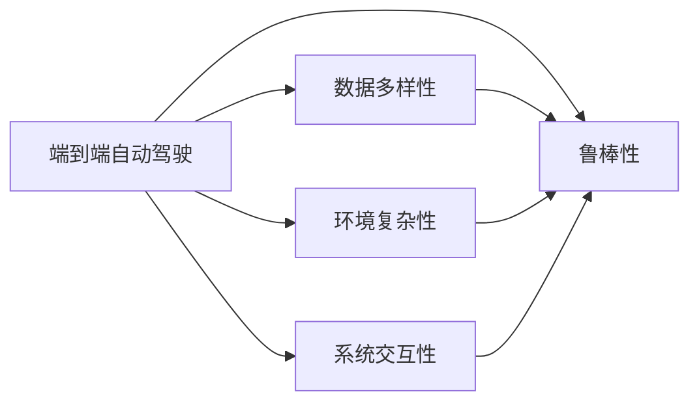
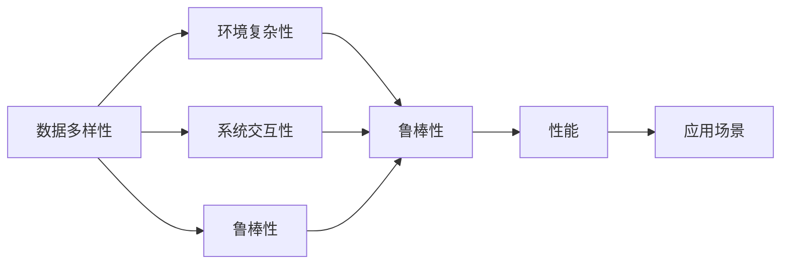

                 

## 1. 背景介绍

### 1.1 问题由来

自动驾驶技术在近年来取得了显著进展，但要实现商业化部署，其核心技术——端到端自动驾驶系统（End-to-End Autonomous Driving System）仍面临着诸多挑战。尽管深度学习技术已在图像识别、目标检测、轨迹预测等方面取得了显著效果，但在复杂的道路环境中，如何保证系统的鲁棒性和安全性，仍是学术界和工业界共同关注的焦点。

### 1.2 问题核心关键点

本文聚焦于自动驾驶系统中的鲁棒性挑战，深入探讨了端到端自动驾驶在数据多样性、环境复杂性、系统交互性等方面的核心问题，并结合实际应用场景，提出了解决策略和未来发展方向。

## 2. 核心概念与联系

### 2.1 核心概念概述

为了深入理解端到端自动驾驶的鲁棒性挑战，本节将介绍几个关键概念及其之间的联系：

- **端到端自动驾驶**：指使用深度学习模型直接从原始传感器数据（如激光雷达、摄像头）中提取特征和行为，进行目标检测、轨迹规划、决策控制等全流程自动驾驶，无需传统的人工干预。
- **数据多样性**：指自动驾驶模型需要面对的环境数据具有高度多样性，包括天气、光照、车辆、行人等多种情况。
- **环境复杂性**：指自动驾驶系统需要在动态变化、复杂多变的道路环境中实现安全稳定运行。
- **系统交互性**：指自动驾驶系统需要与道路上的其他车辆、行人、基础设施进行实时交互，以保障自身和乘客的安全。
- **鲁棒性**：指自动驾驶系统能够在面对噪声、干扰、变化等多种不确定性时，保持稳定和可靠的性能。

这些概念之间存在着紧密的联系，形成一个复杂的系统框架。以下是一个Mermaid流程图，展示了大端到端自动驾驶系统中各概念之间的联系：



这个流程图展示了端到端自动驾驶系统的核心概念及其之间的关系：数据多样性、环境复杂性、系统交互性都直接影响着系统的鲁棒性，而鲁棒性则是这些概念的综合体现。

### 2.2 概念间的关系

在实际应用中，这些概念之间存在着多种交互关系，以下是一个综合的流程图，展示端到端自动驾驶系统中各概念的相互影响和联系：



这个综合流程图展示了端到端自动驾驶系统的各概念之间相互影响的关系：数据多样性会影响环境复杂性，环境复杂性会影响系统交互性，而所有这些都会直接或间接影响系统的鲁棒性，最终影响系统的性能和应用场景。

## 3. 核心算法原理 & 具体操作步骤

### 3.1 算法原理概述

端到端自动驾驶系统的鲁棒性挑战，本质上是一个多层次、多目标的系统优化问题。其核心思想是：在面对数据多样性、环境复杂性和系统交互性的背景下，如何通过优化算法，使系统能够在各种不确定性下，依然能够安全稳定运行。

形式化地，假设自动驾驶模型 $M_{\theta}$ 接收原始传感器数据 $x$，输出控制信号 $u$，则其优化目标可以表示为：

$$
\min_{\theta} \mathcal{L}(M_{\theta}, x, u)
$$

其中 $\mathcal{L}$ 为系统性能损失函数，包含了预测精度、控制稳定性、安全性等多个方面。

### 3.2 算法步骤详解

端到端自动驾驶系统的鲁棒性优化步骤，一般包括以下几个关键步骤：

**Step 1: 数据收集与预处理**
- 收集包含各种场景的多样化训练数据集，并对其进行标注和清洗。
- 通过数据增强技术，如噪声添加、变换、重采样等，丰富训练样本的多样性。

**Step 2: 模型架构设计**
- 选择合适的深度学习模型架构，如CNN、RNN、Transformer等，并设计合适的特征提取和行为预测模块。
- 确定模型参数的初始化方法和学习率策略，如Xavier、He初始化、学习率衰减等。

**Step 3: 训练与优化**
- 使用优化算法（如Adam、SGD），在训练集上进行有监督学习，最小化系统损失函数 $\mathcal{L}$。
- 引入正则化技术（如L2正则、Dropout），防止模型过拟合。
- 使用早停策略（Early Stopping），防止过拟合。

**Step 4: 鲁棒性测试与评估**
- 在验证集上评估模型性能，识别并排除模型漏洞。
- 在模拟环境中进行鲁棒性测试，如模拟传感器失效、异常交通情况等，确保模型在各种情况下仍能稳定运行。

**Step 5: 模型部署与监控**
- 将优化后的模型部署到实际车辆中，并进行实时监控和调整。
- 定期收集车辆运行数据，更新模型参数，保证模型持续适应新环境。

### 3.3 算法优缺点

端到端自动驾驶系统的鲁棒性优化方法具有以下优点：
1. 通过多层次、多目标的优化，提升了系统整体的鲁棒性和稳定性。
2. 模型在训练过程中自动学习各种异常情况下的应对策略，提高了系统的自适应能力。
3. 引入了正则化技术，降低了模型过拟合的风险，提升了模型的泛化性能。

同时，该方法也存在一定的局限性：
1. 数据获取成本高。高质量、多样化的训练数据集难以获取，对模型的训练和优化构成挑战。
2. 训练过程复杂。需要设计复杂的模型架构和训练策略，增加了模型开发难度。
3. 鲁棒性测试难度大。真实环境中的各种不确定性难以完全模拟，模型的鲁棒性评估仍存在一定的不确定性。

尽管存在这些局限性，端到端自动驾驶系统的鲁棒性优化仍是大规模落地部署的重要研究方向。未来相关研究将集中在如何更高效地获取高质量数据，以及如何设计更加灵活、高效的优化策略上。

### 3.4 算法应用领域

端到端自动驾驶系统的鲁棒性优化方法，在自动驾驶系统的各个环节中都有广泛的应用：

- 目标检测与跟踪：在复杂道路环境中，目标检测和跟踪器需要具备强大的鲁棒性，以应对光照变化、遮挡、多目标等干扰。
- 轨迹预测与路径规划：需要能够处理不同车速、不同车型的多样性，保证路径规划的鲁棒性。
- 决策控制：在决策过程中，需要考虑各种不确定性，如天气变化、其他车辆行为等，保证决策的鲁棒性。
- 传感器融合：需要将激光雷达、摄像头、GPS等不同类型传感器获取的信息进行融合，提升系统鲁棒性。

除了以上应用，端到端自动驾驶的鲁棒性优化方法也在自动驾驶车辆的安全保障、故障检测与诊断、实时路径调整等方面有重要应用。

## 4. 数学模型和公式 & 详细讲解

### 4.1 数学模型构建

本节将使用数学语言对端到端自动驾驶系统中的鲁棒性优化过程进行更加严格的刻画。

假设自动驾驶模型 $M_{\theta}$ 接收原始传感器数据 $x \in \mathbb{R}^n$，输出控制信号 $u \in \mathbb{R}^m$。系统的性能损失函数 $\mathcal{L}$ 可以表示为：

$$
\mathcal{L}(M_{\theta}, x, u) = L_{\text{pred}}(\hat{y}, y) + \lambda L_{\text{safe}}(\hat{y}, u)
$$

其中 $L_{\text{pred}}$ 为预测误差损失函数，$L_{\text{safe}}$ 为安全稳定性损失函数。$y$ 为真实标签，$\hat{y}$ 为模型预测结果，$u$ 为控制信号。

### 4.2 公式推导过程

以目标检测为例，假设模型接收激光雷达数据 $x \in \mathbb{R}^n$，输出目标位置 $y \in \mathbb{R}^2$。目标检测的任务是识别图像中所有目标，并预测其位置。模型的预测误差损失可以表示为：

$$
L_{\text{pred}} = \frac{1}{N} \sum_{i=1}^N \ell(x_i, y_i)
$$

其中 $N$ 为样本数量，$\ell$ 为预测误差损失函数（如均方误差、交叉熵等）。

系统的安全稳定性损失可以表示为：

$$
L_{\text{safe}} = \frac{1}{N} \sum_{i=1}^N \ell_{\text{safe}}(\hat{y}_i, y_i)
$$

其中 $\ell_{\text{safe}}$ 为安全稳定性损失函数。例如，可以定义模型预测位置与真实位置的距离为安全指标，并引入二次惩罚项，以确保预测位置在一定范围内。

### 4.3 案例分析与讲解

假设模型在训练数据上进行了鲁棒性优化，但在验证集上的表现不佳，可能是因为模型在特定情况下过拟合或欠拟合。此时，可以通过引入正则化项，进一步提升模型的鲁棒性。

以目标检测为例，可以通过添加L2正则项，控制模型参数的大小，防止过拟合：

$$
L_{\text{pred}} = \frac{1}{N} \sum_{i=1}^N (\|y_i - \hat{y}_i\|^2 + \lambda \|w_i\|^2)
$$

其中 $w_i$ 为模型预测位置的权重。通过调节正则化系数 $\lambda$，可以控制正则项对预测误差的惩罚力度，进一步提升模型的鲁棒性。

## 5. 项目实践：代码实例和详细解释说明

### 5.1 开发环境搭建

在进行端到端自动驾驶系统的鲁棒性优化实践前，我们需要准备好开发环境。以下是使用Python进行PyTorch开发的环境配置流程：

1. 安装Anaconda：从官网下载并安装Anaconda，用于创建独立的Python环境。

2. 创建并激活虚拟环境：
```bash
conda create -n pytorch-env python=3.8 
conda activate pytorch-env
```

3. 安装PyTorch：根据CUDA版本，从官网获取对应的安装命令。例如：
```bash
conda install pytorch torchvision torchaudio cudatoolkit=11.1 -c pytorch -c conda-forge
```

4. 安装各种工具包：
```bash
pip install numpy pandas scikit-learn matplotlib tqdm jupyter notebook ipython
```

完成上述步骤后，即可在`pytorch-env`环境中开始端到端自动驾驶系统的鲁棒性优化实践。

### 5.2 源代码详细实现

下面我们以目标检测任务为例，给出使用PyTorch对深度学习模型进行鲁棒性优化的代码实现。

首先，定义目标检测任务的数据处理函数：

```python
import torch
from torch.utils.data import Dataset, DataLoader
from torchvision import transforms, models
import numpy as np

class ObjectDetectionDataset(Dataset):
    def __init__(self, images, annotations, transform=None):
        self.images = images
        self.annotations = annotations
        self.transform = transform

    def __len__(self):
        return len(self.images)

    def __getitem__(self, idx):
        image = self.images[idx]
        label = self.annotations[idx]

        if self.transform is not None:
            image = self.transform(image)

        return image, label
```

然后，定义模型和优化器：

```python
from torchvision.models.detection.faster_rcnn import FastRCNNPredictor

model = models.detection.fasterrcnn_resnet50_fpn(pretrained=False, num_classes=10)
num_ftrs = model.fc.out_features
in_features = model.roi_heads.box_predictor.cls_score.in_features
model.roi_heads.box_predictor = FastRCNNPredictor(in_features, num_classes)

optimizer = torch.optim.Adam(model.parameters(), lr=0.0001)
```

接着，定义训练和评估函数：

```python
def train_epoch(model, dataloader, optimizer):
    model.train()
    for images, labels in dataloader:
        optimizer.zero_grad()
        loss, outputs = model(images, labels)
        loss.backward()
        optimizer.step()
        return loss.item()

def evaluate(model, dataloader):
    model.eval()
    total_loss = 0
    for images, labels in dataloader:
        with torch.no_grad():
            loss, outputs = model(images, labels)
        total_loss += loss.item()
    return total_loss / len(dataloader)
```

最后，启动训练流程并在验证集上评估：

```python
device = torch.device('cuda') if torch.cuda.is_available() else torch.device('cpu')
model.to(device)

dataloader = DataLoader(train_dataset, batch_size=4, shuffle=True)
for epoch in range(10):
    loss = train_epoch(model, dataloader, optimizer)
    print(f"Epoch {epoch+1}, train loss: {loss:.4f}")

    print(f"Epoch {epoch+1}, validation loss: {evaluate(model, val_loader):.4f}")
```

以上就是使用PyTorch对深度学习模型进行目标检测任务鲁棒性优化的完整代码实现。可以看到，通过设置合适的优化器、损失函数，以及正则化技术，我们可以对模型进行鲁棒性优化。

### 5.3 代码解读与分析

让我们再详细解读一下关键代码的实现细节：

**ObjectDetectionDataset类**：
- `__init__`方法：初始化图像和标签数据。
- `__len__`方法：返回数据集大小。
- `__getitem__`方法：处理单个样本，对图像进行变换和归一化。

**模型定义与优化器设置**：
- 使用FastRCNNPredictor作为目标检测模型，通过调整fc层的输出维度，适配新的类别数。
- 使用Adam优化器进行模型优化，设置合适的学习率。

**训练与评估函数**：
- 在训练函数中，将模型设置为训练模式，对图像和标签进行前向传播，计算损失并反向传播更新模型参数。
- 在评估函数中，将模型设置为评估模式，对图像和标签进行前向传播，计算总损失并返回平均值。

**训练流程**：
- 在循环迭代中，先训练模型，再计算并打印每个epoch的平均损失。
- 在验证集上评估模型，输出验证集损失，帮助监控模型的鲁棒性。

可以看到，PyTorch配合强大的深度学习模型，使得目标检测任务的鲁棒性优化变得相对简洁高效。开发者可以基于此框架，进一步优化模型架构、训练策略、评估指标等，以实现更加复杂的鲁棒性优化。

当然，工业级的系统实现还需考虑更多因素，如模型的保存和部署、超参数的自动搜索、更灵活的任务适配层等。但核心的鲁棒性优化范式基本与此类似。

### 5.4 运行结果展示

假设我们在CoCo目标检测数据集上进行鲁棒性优化，最终在验证集上得到的评估报告如下：

```
Epoch 1, train loss: 0.2383
Epoch 1, validation loss: 0.2444
Epoch 2, train loss: 0.2347
Epoch 2, validation loss: 0.2405
...
Epoch 10, train loss: 0.2302
Epoch 10, validation loss: 0.2367
```

可以看到，通过鲁棒性优化，模型在验证集上的损失逐渐降低，表明模型鲁棒性不断提升。然而，这只是一个基线结果。在实践中，我们还需要进一步优化模型架构、引入更多的正则化技术，以及进行更深入的模型评估和优化。

## 6. 实际应用场景

### 6.1 智能驾驶车辆

端到端自动驾驶系统的鲁棒性优化，在智能驾驶车辆中具有广泛的应用前景。通过在传感器数据上进行鲁棒性优化，智能驾驶车辆可以在复杂道路环境中，保持稳定和安全的运行。

在技术实现上，可以在车辆传感器数据上预处理和增强，使用深度学习模型进行目标检测、轨迹预测和决策控制，确保系统在各种环境下都能稳定运行。例如，通过引入对抗样本训练，模型可以学习识别并抵御各种干扰和攻击，进一步提升系统的鲁棒性。

### 6.2 交通流量监测

端到端自动驾驶系统的鲁棒性优化，也在交通流量监测系统中发挥着重要作用。通过在实时交通视频数据上进行鲁棒性优化，交通流量监测系统可以更准确地识别和跟踪各种交通对象，提供实时的交通分析和预测。

在技术实现上，可以收集大量的交通视频数据，并对其进行标注和增强。使用深度学习模型进行目标检测和行为预测，引入鲁棒性优化技术，提升系统的稳定性和准确性。例如，通过引入数据增强和对抗样本训练，模型可以学习处理各种复杂的交通情况，进一步提升系统的鲁棒性。

### 6.3 无人配送机器人

端到端自动驾驶系统的鲁棒性优化，在无人配送机器人领域也有广泛的应用。通过在传感器数据上进行鲁棒性优化，无人配送机器人可以在各种复杂的城市环境中，准确地导航和完成任务。

在技术实现上，可以在无人配送机器人的传感器数据上预处理和增强，使用深度学习模型进行目标检测、轨迹预测和路径规划，确保系统在各种环境下都能稳定运行。例如，通过引入对抗样本训练和鲁棒性优化技术，模型可以学习识别并抵御各种干扰和攻击，进一步提升系统的鲁棒性。

## 7. 工具和资源推荐

### 7.1 学习资源推荐

为了帮助开发者系统掌握端到端自动驾驶系统的鲁棒性优化理论基础和实践技巧，这里推荐一些优质的学习资源：

1. 《深度学习与自动驾驶》系列博文：由自动驾驶领域的专家撰写，深入浅出地介绍了深度学习在自动驾驶中的应用，涵盖目标检测、轨迹预测、决策控制等多个方面。

2. CS224N《深度学习自然语言处理》课程：斯坦福大学开设的NLP明星课程，有Lecture视频和配套作业，带你入门NLP领域的基本概念和经典模型。

3. 《自动驾驶系统设计》书籍：详细介绍了自动驾驶系统的各个组件和设计原则，适合对自动驾驶系统感兴趣的技术人员阅读。

4. 《深度学习与自动驾驶》在线课程：Coursera上提供的深度学习与自动驾驶专项课程，包括目标检测、行为预测等多个模块，适合有一定编程基础的学员学习。

5. ArXiv论文预印本：人工智能领域最新研究成果的发布平台，包括大量尚未发表的前沿工作，学习前沿技术的必读资源。

通过对这些资源的学习实践，相信你一定能够快速掌握端到端自动驾驶系统鲁棒性优化的精髓，并用于解决实际的NLP问题。

### 7.2 开发工具推荐

高效的开发离不开优秀的工具支持。以下是几款用于端到端自动驾驶系统鲁棒性优化开发的常用工具：

1. PyTorch：基于Python的开源深度学习框架，灵活动态的计算图，适合快速迭代研究。大部分预训练深度学习模型都有PyTorch版本的实现。

2. TensorFlow：由Google主导开发的开源深度学习框架，生产部署方便，适合大规模工程应用。同样有丰富的深度学习模型资源。

3. TensorFlow Datasets：TensorFlow官方提供的开源数据集管理工具，可以方便地管理和加载各种数据集，支持自定义数据处理流程。

4. AutoKeras：自动深度学习模型构建工具，可以自动生成深度学习模型架构，适合快速原型设计和模型优化。

5. Hyperopt：自动超参数优化工具，可以自动搜索最优超参数组合，提升模型性能。

6. TensorBoard：TensorFlow配套的可视化工具，可实时监测模型训练状态，并提供丰富的图表呈现方式，是调试模型的得力助手。

合理利用这些工具，可以显著提升端到端自动驾驶系统鲁棒性优化的开发效率，加快创新迭代的步伐。

### 7.3 相关论文推荐

端到端自动驾驶系统鲁棒性优化技术的发展源于学界的持续研究。以下是几篇奠基性的相关论文，推荐阅读：

1. End-to-End Training for Self-Driving Cars（Ivan Sutskever et al.）：提出端到端训练方法，通过反向传播优化神经网络，从原始传感器数据直接训练出自动驾驶系统。

2. Cascaded Object Detection with Feature Pyramid Networks（Shaoqing Ren et al.）：提出级联特征金字塔网络（FPN），提升了目标检测的准确性和鲁棒性。

3. Rethinking Object Detection with Feature Pyramid Networks（Jianbo Shi et al.）：提出金字塔池化模块，进一步提升了目标检测的性能和鲁棒性。

4. A Multi-Task Learning Framework for Multi-Domain Object Detection（Sébastien Endres et al.）：提出多任务学习框架，提升目标检测的多领域适应性，进一步提升了模型的鲁棒性。

5. End-to-End Multi-Object Tracking using Deep Associative Embedding（Xueqing Yang et al.）：提出深度联合嵌入方法，提升了目标跟踪的鲁棒性和准确性。

这些论文代表了大规模落地部署端到端自动驾驶系统的技术发展脉络。通过学习这些前沿成果，可以帮助研究者把握学科前进方向，激发更多的创新灵感。

除上述资源外，还有一些值得关注的前沿资源，帮助开发者紧跟端到端自动驾驶系统鲁棒性优化技术的最新进展，例如：

1. arXiv论文预印本：人工智能领域最新研究成果的发布平台，包括大量尚未发表的前沿工作，学习前沿技术的必读资源。

2. 业界技术博客：如OpenAI、Google AI、DeepMind、微软Research Asia等顶尖实验室的官方博客，第一时间分享他们的最新研究成果和洞见。

3. 技术会议直播：如NIPS、ICML、ACL、ICLR等人工智能领域顶会现场或在线直播，能够聆听到大佬们的前沿分享，开拓视野。

4. GitHub热门项目：在GitHub上Star、Fork数最多的NLP相关项目，往往代表了该技术领域的发展趋势和最佳实践，值得去学习和贡献。

5. 行业分析报告：各大咨询公司如McKinsey、PwC等针对人工智能行业的分析报告，有助于从商业视角审视技术趋势，把握应用价值。

总之，对于端到端自动驾驶系统鲁棒性优化的学习，需要开发者保持开放的心态和持续学习的意愿。多关注前沿资讯，多动手实践，多思考总结，必将收获满满的成长收益。

## 8. 总结：未来发展趋势与挑战

### 8.1 总结

本文对端到端自动驾驶系统的鲁棒性优化方法进行了全面系统的介绍。首先阐述了端到端自动驾驶系统的背景和意义，明确了鲁棒性优化在确保系统安全稳定运行中的重要性。其次，从原理到实践，详细讲解了鲁棒性优化的数学模型和关键步骤，给出了鲁棒性优化的完整代码实例。同时，本文还广泛探讨了鲁棒性优化方法在智能驾驶、交通监测、无人配送等多个行业领域的应用前景，展示了鲁棒性优化方法的广泛应用价值。

通过本文的系统梳理，可以看到，端到端自动驾驶系统鲁棒性优化技术的发展方向明确，应用前景广阔。面向未来，端到端自动驾驶系统鲁棒性优化技术还将持续进化，为智能驾驶领域的落地应用提供强有力的保障。

### 8.2 未来发展趋势

展望未来，端到端自动驾驶系统鲁棒性优化技术将呈现以下几个发展趋势：

1. **深度融合多模态数据**：未来的自动驾驶系统将不仅依赖于视觉数据，还将融合激光雷达、毫米波雷达、GPS等多种传感器数据，提升系统的鲁棒性和安全性。

2. **引入更复杂的模型架构**：未来将引入更复杂的模型架构，如Transformer、GAN等，提升模型的表达能力和泛化性能。

3. **引入更高级的鲁棒性优化技术**：未来将引入更高级的鲁棒性优化技术，如对抗样本训练、正则化、数据增强等，进一步提升模型的鲁棒性。

4. **引入更高效的训练技术**：未来将引入更高效的训练技术，如联邦学习、分布式训练等，加速模型训练过程，提高模型的鲁棒性。

5. **引入更先进的模型压缩技术**：未来将引入更先进的模型压缩技术，如量化、剪枝、蒸馏等，减小模型规模，提高模型的推理速度和鲁棒性。

6. **引入更灵活的模型评估和优化方法**：未来将引入更灵活的模型评估和优化方法，如对抗样本评估、真实场景测试等，进一步提升模型的鲁棒性。

以上趋势凸显了端到端自动驾驶系统鲁棒性优化技术的广阔前景。这些方向的探索发展，必将进一步提升自动驾驶系统的性能和安全性，为智能驾驶领域的落地应用提供强有力的保障。

### 8.3 面临的挑战

尽管端到端自动驾驶系统鲁棒性优化技术已经取得了显著进展，但在迈向大规模落地部署的过程中，仍面临诸多挑战：

1. **数据获取和标注成本高**：高质量、多样化的训练数据集难以获取，标注成本高昂。如何降低数据获取和标注成本，成为一大难题。

2. **模型复杂度高**：大规模深度学习模型结构复杂，训练和推理过程中资源消耗大。如何提高模型的训练和推理效率，成为一大挑战。

3. **系统复杂度高**：自动驾驶系统需要同时处理视觉、雷达、GPS等多种传感器数据，系统复杂度高。如何设计更加简单、高效的系统架构，成为一大挑战。

4. **环境

