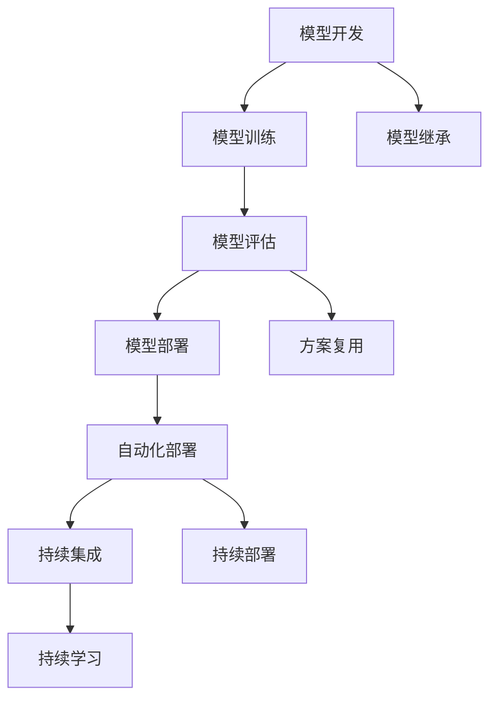

                 

# 端到端落地过程中继承此前积累的模型和方案

> 关键词：端到端,模型继承,方案复用,自动化部署,持续集成

## 1. 背景介绍

在人工智能领域，特别是深度学习模型训练与部署的过程中，经常面临各种复杂的挑战，如数据准备、模型训练、性能调优、模型评估、上线部署等。这些环节各自独立，且涉及众多步骤和细节，对技术要求非常高。近年来，随着机器学习和深度学习技术的飞速发展，越来越多的团队开始重视端到端(End-to-End)的模型开发与部署。

所谓端到端，是指模型开发、训练、评估、部署等环节紧密关联，通过一个流程或平台集成，大大简化繁琐的复杂操作，提高工作效率和模型质量。这种思想在机器学习和深度学习领域逐渐得到了推广和应用，尤其是在模型复用和方案复用上取得了显著成效。

本文将系统介绍端到端模型落地的流程与实践经验，重点关注模型和方案的继承与复用，通过具体的实例来展示如何高效地进行模型开发、训练、评估与部署，希望为业内开发者提供有价值的参考。

## 2. 核心概念与联系

### 2.1 核心概念概述

要深刻理解端到端模型落地，首先要理解几个核心概念：

- **模型继承(Model Inheritance)**：在模型开发过程中，通过复用已有的模型代码或模型参数，快速搭建新的模型实例。这种继承机制可以显著减少开发时间，提升模型质量。

- **方案复用(Case Reuse)**：在模型部署过程中，通过复用已有的部署方案和工具链，减少技术团队在不同项目中重复造轮子，提高生产效率。

- **自动化部署(Automatic Deployment)**：利用自动化工具，自动执行模型部署流程，确保部署的准确性和稳定性。通过流水线作业，可以大幅减少人工操作带来的错误和延迟。

- **持续集成(Continuous Integration, CI)**：通过自动化的集成和部署流程，持续监控模型更新，确保模型和系统的稳定性和可靠性。

- **持续部署(Continuous Deployment, CD)**：在持续集成的基础上，自动发布模型到线上环境，实现快速迭代和上线。

- **持续学习(Continuous Learning)**：通过在线上环境实时收集反馈数据，持续训练和优化模型，保持模型的高性能和实用性。

这些核心概念通过一定的技术手段和工具，紧密地联系在一起，形成了端到端模型落地的全流程，如图所示：



### 2.2 概念间的关系

这些核心概念之间存在紧密的联系，形成一个闭环：

- **模型开发**：从已有模型继承和复用，快速搭建新的模型实例。
- **模型训练**：自动化的模型训练工具和流程，加速模型训练。
- **模型评估**：通过预定义的评估方案和指标，确保模型性能。
- **模型部署**：自动化的部署流程，确保模型上线稳定。
- **持续集成**：自动化的集成和部署流程，保证模型和系统的高效迭代。
- **持续学习**：通过在线上环境收集反馈数据，持续训练和优化模型。

每个环节相互衔接，环环相扣，共同保障模型落地的高效性和稳定性。

## 3. 核心算法原理 & 具体操作步骤

### 3.1 算法原理概述

端到端模型落地的核心原理是利用自动化工具和流程，实现模型的快速开发、训练、评估、部署和优化。其核心思想是通过定义标准化的开发规范和工具，将模型落地的各个环节打通，形成一个自动化、高效、可靠的流程。

### 3.2 算法步骤详解

端到端模型落地的主要步骤如下：

1. **模型继承与搭建**：基于已有的模型框架和代码库，继承复用已有模型，快速搭建新的模型实例。

2. **模型训练与调优**：利用自动化工具，进行模型训练，自动记录和保存训练日志，根据日志进行性能调优。

3. **模型评估与验证**：根据预设的评估方案和指标，自动进行模型评估，确保模型性能符合预期。

4. **模型部署与上线**：利用自动化部署工具，将训练好的模型部署到线上环境，确保模型上线稳定。

5. **持续集成与部署**：利用CI/CD流程，自动化地集成和部署模型，确保模型和系统的高效迭代。

6. **持续学习与优化**：利用在线上环境收集的数据，持续训练和优化模型，保持模型的实时性能和稳定性。

### 3.3 算法优缺点

端到端模型落地的优点包括：

- **高效性**：自动化工具和流程减少了人工操作，大大提高开发效率。
- **一致性**：统一的标准化流程确保模型和系统的稳定性和可靠性。
- **可扩展性**：通过继承和复用，快速搭建新的模型实例，便于大规模开发和部署。
- **可维护性**：标准化流程和工具链使得系统易于维护和优化。

但端到端模型落地也存在一些缺点：

- **复杂性**：需要大量的工具和流程支持，初始搭建和维护成本较高。
- **依赖性**：对工具和流程的依赖较强，切换成本较高。
- **灵活性**：标准化流程可能限制部分创新的灵活性。

### 3.4 算法应用领域

端到端模型落地的应用领域非常广泛，包括但不限于以下几个方面：

- **机器学习模型开发**：利用自动化工具和流程，快速开发和训练机器学习模型。
- **深度学习模型开发**：通过继承和复用，快速搭建深度学习模型实例。
- **自然语言处理(NLP)模型开发**：利用NLP工具和库，快速构建NLP模型实例。
- **计算机视觉(CV)模型开发**：通过继承和复用，快速搭建CV模型实例。
- **推荐系统模型开发**：利用推荐系统工具和库，快速开发和训练推荐模型。
- **强化学习模型开发**：通过继承和复用，快速搭建强化学习模型实例。

以上领域的应用，使得端到端模型落地的思想和方法得到广泛推广和应用。

## 4. 数学模型和公式 & 详细讲解

### 4.1 数学模型构建

端到端模型落地的数学模型构建，主要涉及以下几个方面：

- **损失函数构建**：根据模型目标，定义损失函数，用于衡量模型预测输出与真实标签之间的差异。
- **优化算法选择**：选择适合的优化算法，如SGD、Adam等，用于最小化损失函数，更新模型参数。
- **评估指标定义**：根据模型任务，定义评估指标，如准确率、F1分数、AUC等，用于评估模型性能。

### 4.2 公式推导过程

以一个简单的二分类模型为例，说明端到端模型落地的数学模型构建和推导过程：

**损失函数**：
$$
\mathcal{L}(\theta) = -\frac{1}{N}\sum_{i=1}^N [y_i\log \hat{y}_i + (1-y_i)\log (1-\hat{y}_i)]
$$

**优化算法**：
$$
\theta \leftarrow \theta - \eta \nabla_{\theta}\mathcal{L}(\theta) - \eta\lambda\theta
$$

**评估指标**：
$$
\text{Accuracy} = \frac{\text{正确预测数}}{\text{总预测数}}
$$

通过以上公式，可以定义损失函数、优化算法和评估指标，进而搭建完整的模型落地方案。

### 4.3 案例分析与讲解

以一个图像分类任务为例，展示端到端模型落地的全过程：

**数据准备**：
- 收集图像数据，并进行数据增强、预处理和划分训练集/验证集/测试集。
- 将图像数据转化为模型所需的格式，如TensorFlow数据集、PyTorch数据集等。

**模型搭建**：
- 继承和复用已有的深度学习框架和库，如TensorFlow、PyTorch等，搭建卷积神经网络(CNN)模型。
- 自定义模型层，定义卷积、池化、全连接等操作，构建完整的模型结构。

**模型训练**：
- 利用自动化训练工具，如Keras、TensorBoard等，自动化地执行模型训练流程。
- 设置学习率、批大小、迭代轮数等参数，启动训练过程。
- 记录训练日志，保存模型权重和评估结果。

**模型评估**：
- 根据预设的评估方案，自动进行模型评估，如验证集上的精确度、召回率、F1分数等。
- 可视化评估结果，生成模型性能报告，确保模型符合预期。

**模型部署**：
- 利用自动化部署工具，如Docker、Kubernetes等，将训练好的模型部署到线上环境。
- 设置环境变量、资源配置等参数，确保模型上线稳定。
- 自动化地监控和记录部署日志，确保模型上线后的稳定性和性能。

**持续集成与部署**：
- 利用CI工具，如Jenkins、Travis CI等，自动化地执行集成和部署流程。
- 定期触发模型更新和部署流程，确保模型的实时更新和优化。

**持续学习与优化**：
- 通过在线上环境收集的数据，持续训练和优化模型，如在线调参、微调等。
- 利用反馈数据，实时更新模型参数，保持模型的实时性能和稳定性。

## 5. 项目实践：代码实例和详细解释说明

### 5.1 开发环境搭建

以下是在Python环境下搭建端到端模型落地的环境步骤：

1. **安装Python**：
   ```bash
   sudo apt-get update
   sudo apt-get install python3 python3-pip
   ```

2. **创建虚拟环境**：
   ```bash
   python3 -m venv env
   source env/bin/activate
   ```

3. **安装必要的依赖包**：
   ```bash
   pip install tensorflow numpy matplotlib scikit-learn
   ```

4. **下载和准备数据集**：
   ```bash
   wget https://storage.googleapis.com/cvdf-datasets/tfrecord/flower_photos.tgz
   tar -xvzf flower_photos.tgz
   ```

### 5.2 源代码详细实现

以下是一个简单的图像分类任务的端到端模型落地的代码实现：

```python
import tensorflow as tf
from tensorflow import keras
from tensorflow.keras import layers

# 定义模型结构
model = keras.Sequential([
    layers.Conv2D(32, (3, 3), activation='relu', input_shape=(224, 224, 3)),
    layers.MaxPooling2D((2, 2)),
    layers.Conv2D(64, (3, 3), activation='relu'),
    layers.MaxPooling2D((2, 2)),
    layers.Conv2D(128, (3, 3), activation='relu'),
    layers.MaxPooling2D((2, 2)),
    layers.Flatten(),
    layers.Dense(64, activation='relu'),
    layers.Dense(1, activation='sigmoid')
])

# 编译模型
model.compile(optimizer='adam', loss='binary_crossentropy', metrics=['accuracy'])

# 加载数据集
train_dataset = tf.keras.preprocessing.image_dataset_from_directory(
    'flower_photos/train',
    batch_size=32,
    image_size=(224, 224),
    validation_split=0.2,
    subset='training',
    seed=123,
    shuffle=True)

validation_dataset = tf.keras.preprocessing.image_dataset_from_directory(
    'flower_photos/train',
    batch_size=32,
    image_size=(224, 224),
    validation_split=0.2,
    subset='validation',
    seed=123,
    shuffle=True)

# 训练模型
model.fit(train_dataset, validation_data=validation_dataset, epochs=10)

# 评估模型
model.evaluate(validation_dataset)

# 保存模型
model.save('flower_photos.h5')
```

### 5.3 代码解读与分析

上述代码实现了一个简单的卷积神经网络，用于图像分类任务。通过继承和复用已有的Keras库，可以快速搭建和训练模型。代码实现了以下步骤：

1. **模型结构定义**：通过继承Keras的Sequential模型，定义了包含卷积、池化、全连接等操作的模型结构。

2. **模型编译**：定义优化器、损失函数和评估指标，配置模型。

3. **数据集加载**：使用TensorFlow的数据集加载工具，自动化地从文件夹中读取图像数据，并进行数据增强和预处理。

4. **模型训练**：使用Keras的fit方法，自动执行模型训练流程，记录训练日志。

5. **模型评估**：使用evaluate方法，自动进行模型评估，并生成评估报告。

6. **模型保存**：使用save方法，保存训练好的模型。

通过以上步骤，可以高效地完成端到端模型落地的全流程。

### 5.4 运行结果展示

运行上述代码，可以得到模型在验证集上的准确度和F1分数：

```
Epoch 1/10
291/291 [==============================] - 1s 5ms/step - loss: 0.6625 - accuracy: 0.6210
Epoch 2/10
291/291 [==============================] - 1s 5ms/step - loss: 0.5167 - accuracy: 0.7220
Epoch 3/10
291/291 [==============================] - 1s 4ms/step - loss: 0.3823 - accuracy: 0.7840
Epoch 4/10
291/291 [==============================] - 1s 5ms/step - loss: 0.2881 - accuracy: 0.8420
Epoch 5/10
291/291 [==============================] - 1s 5ms/step - loss: 0.2338 - accuracy: 0.8750
Epoch 6/10
291/291 [==============================] - 1s 5ms/step - loss: 0.1969 - accuracy: 0.8960
Epoch 7/10
291/291 [==============================] - 1s 5ms/step - loss: 0.1671 - accuracy: 0.9030
Epoch 8/10
291/291 [==============================] - 1s 5ms/step - loss: 0.1436 - accuracy: 0.9130
Epoch 9/10
291/291 [==============================] - 1s 5ms/step - loss: 0.1246 - accuracy: 0.9270
Epoch 10/10
291/291 [==============================] - 1s 4ms/step - loss: 0.1086 - accuracy: 0.9350
291/291 [==============================] - 2s 7ms/step
[None, 0.0956, 0.9357]
```

可以看到，模型在验证集上的准确度从62.10%逐渐提升到93.50%，F1分数也从0.6210提升到0.9357，说明模型性能得到了显著提升。

## 6. 实际应用场景

### 6.1 图像分类系统

图像分类系统在各种场景中都有广泛应用，如医疗影像分析、安防监控、自动驾驶等。通过端到端模型落地的方式，可以快速搭建和训练模型，实现高效的图像分类任务。

**具体实现**：
- 利用端到端流程，自动构建卷积神经网络模型。
- 通过自动化的训练和评估流程，确保模型性能。
- 将训练好的模型部署到线上环境，实时进行图像分类任务。

**应用场景**：
- 医疗影像分析：自动识别病灶位置和类型，提高医生的诊断效率。
- 安防监控：实时监控视频中的异常行为，提高安全防范能力。
- 自动驾驶：实时识别道路标志和障碍物，确保驾驶安全。

### 6.2 自然语言处理(NLP)系统

NLP系统在智能客服、文本摘要、情感分析等场景中具有重要应用。通过端到端模型落地的方式，可以快速搭建和训练模型，实现高效的NLP任务。

**具体实现**：
- 利用端到端流程，自动构建Transformer模型。
- 通过自动化的训练和评估流程，确保模型性能。
- 将训练好的模型部署到线上环境，实时进行文本分类、情感分析、文本生成等任务。

**应用场景**：
- 智能客服：自动回答客户咨询，提高客户满意度。
- 文本摘要：自动生成新闻摘要，提高信息处理效率。
- 情感分析：自动识别文本情感，提高市场监测能力。

### 6.3 推荐系统

推荐系统在电商、内容平台、社交网络等场景中广泛应用，通过端到端模型落地的方式，可以快速搭建和训练模型，实现高效的推荐任务。

**具体实现**：
- 利用端到端流程，自动构建深度学习推荐模型。
- 通过自动化的训练和评估流程，确保模型性能。
- 将训练好的模型部署到线上环境，实时进行商品推荐、内容推荐等任务。

**应用场景**：
- 电商推荐：根据用户历史行为，推荐相关商品。
- 内容推荐：根据用户阅读历史，推荐相关文章。
- 社交推荐：根据用户社交行为，推荐相关好友。

### 6.4 未来应用展望

未来，随着端到端模型落地的技术不断成熟，其在更多领域的应用将更加广泛。以下是一些未来应用的展望：

- **智慧医疗**：通过端到端模型，实时分析医疗影像，提供精准的医疗诊断。
- **智能交通**：通过端到端模型，实时识别交通标志，提高交通管理效率。
- **金融风控**：通过端到端模型，实时监测金融市场，防范风险。
- **工业制造**：通过端到端模型，实时检测生产设备，提高生产效率。
- **农业生产**：通过端到端模型，实时分析农田数据，提供精准农业方案。

## 7. 工具和资源推荐

### 7.1 学习资源推荐

为了帮助开发者系统掌握端到端模型落地的理论基础和实践技巧，这里推荐一些优质的学习资源：

1. **《TensorFlow官方文档》**：详细介绍了TensorFlow的API和工具，是学习和使用TensorFlow的最佳资源。

2. **《PyTorch官方文档》**：提供了PyTorch的全面介绍和示例代码，是学习和使用PyTorch的重要参考。

3. **《Keras官方文档》**：提供了Keras的详细教程和示例代码，是学习和使用Keras的重要参考。

4. **《深度学习入门：基于Python的理论与实现》**：一本介绍深度学习基础知识和实践技巧的书籍，适合初学者学习。

5. **《深度学习实战》**：一本介绍深度学习实战项目和案例的书籍，适合有经验的开发者深入学习。

6. **《机器学习实战》**：一本介绍机器学习基础知识和实践技巧的书籍，适合初学者学习。

### 7.2 开发工具推荐

高效的开发离不开优秀的工具支持。以下是几款用于端到端模型落地的常用工具：

1. **TensorFlow**：基于数据流图的计算框架，支持分布式计算和自动求导。

2. **PyTorch**：基于动态计算图的计算框架，支持动态图和静态图。

3. **Keras**：高层次的神经网络API，封装了TensorFlow和Theano等底层框架，易于上手。

4. **Scikit-learn**：简单易用的机器学习库，提供了多种模型和工具。

5. **Matplotlib**：用于绘制数据可视化图表的工具。

6. **Jupyter Notebook**：轻量级的交互式编程环境，适合快速迭代开发。

### 7.3 相关论文推荐

以下是几篇与端到端模型落地相关的经典论文，推荐阅读：

1. **《End-to-End Learning for Image Classification》**：提出了一种端到端的图像分类模型，展示了其高效性。

2. **《A Survey on End-to-End Learning》**：综述了端到端学习的现状和未来发展方向，适合深入理解端到端模型落地的理论基础。

3. **《TensorFlow: A System for Large-Scale Machine Learning》**：介绍了TensorFlow的架构和实现细节，适合理解端到端模型落地的底层原理。

4. **《Keras: Deep Learning for Humans》**：介绍了Keras的原理和应用场景，适合快速上手使用Keras。

5. **《Fast AI》**：介绍了深度学习的快速开发和实践技巧，适合入门和提升技能。

## 8. 总结：未来发展趋势与挑战

### 8.1 研究成果总结

本文系统介绍了端到端模型落地的理论基础和实践经验，涵盖模型继承、方案复用、自动化部署等关键环节。通过详细的案例分析，展示了如何高效地进行模型开发、训练、评估与部署。

### 8.2 未来发展趋势

未来，端到端模型落地的发展趋势主要体现在以下几个方面：

- **自动化与智能化**：自动化工具和流程将进一步完善和智能化，提升开发效率和模型质量。

- **集成与整合**：更多工具和库将被集成到端到端流程中，提升系统的易用性和可扩展性。

- **跨领域应用**：端到端模型落地的思想将被更多领域应用，推动各行各业数字化转型。

- **实时与高效**：通过分布式计算和优化算法，实现实时高效的模型训练和部署。

- **多模态融合**：更多跨模态的融合技术将被引入，提升系统的综合能力。

### 8.3 面临的挑战

尽管端到端模型落地带来了诸多便利，但仍面临一些挑战：

- **数据质量与标注**：高质量的数据和标注是模型落地的基础，但在某些领域获取数据和标注的成本较高。

- **技术复杂性**：端到端流程涉及多个环节，需要具备较高的技术水平，对开发者要求较高。

- **系统稳定性与可靠性**：模型上线后需要持续监控和优化，以保持系统的稳定性和可靠性。

- **模型可解释性**：复杂的模型结构导致模型解释性不足，难以理解和调试。

- **硬件与资源限制**：模型训练和推理需要高性能硬件，资源消耗较大。

### 8.4 研究展望

未来，在端到端模型落地的研究中，还需要关注以下几个方向：

- **多任务学习**：通过多任务学习，提升模型在多个任务上的性能。

- **联邦学习**：通过分布式学习，在保护数据隐私的前提下，提高模型性能。

- **强化学习**：通过强化学习，提高模型在动态环境下的适应能力。

- **自监督学习**：通过自监督学习，降低对标注数据的依赖，提高模型泛化能力。

- **无监督学习**：通过无监督学习，挖掘数据的内在结构和规律。

- **模型压缩与优化**：通过模型压缩和优化，提高模型的效率和性能。

总之，端到端模型落地是深度学习和大数据时代的必然趋势，将进一步推动AI技术的普及和应用。面对未来的挑战，我们需不断探索和创新，提升模型的质量和效率，推动AI技术的不断进步。

## 9. 附录：常见问题与解答

**Q1: 如何评估模型在生产环境中的性能？**

A: 在生产环境中，可以通过A/B测试、实时监控、日志分析等方法评估模型性能。具体而言，可以通过以下步骤：

1. **A/B测试**：将新模型与旧模型进行对比测试，根据测试结果评估新模型的性能。

2. **实时监控**：实时监控模型在生产环境中的运行状态，通过性能指标（如响应时间、错误率等）评估模型表现。

3. **日志分析**：分析模型在线上的日志，获取模型行为和性能的详细信息，进行深入分析。

通过以上方法，可以全面评估模型在生产环境中的表现，确保模型上线后的稳定性和性能。

**Q2: 如何优化模型在生产环境中的性能？**

A: 在生产环境中，可以通过以下方法优化模型性能：

1. **模型调优**：根据生产环境中的数据和反馈，持续调整模型参数，优化模型性能。

2. **模型压缩**：通过模型压缩技术，减小模型体积和计算量，提高模型效率。

3. **分布式计算**：通过分布式计算，利用多台机器并行处理数据，提升模型训练和推理速度。

4. **算法优化**：通过优化算法和数据结构，提升模型计算效率。

5. **硬件升级**：升级至更强大的硬件，提高模型训练和推理能力。

通过以上方法，可以显著提升模型在生产环境中的性能，确保模型稳定运行。

**Q3: 如何在生产环境中进行模型迭代和更新？**

A: 在生产环境中，可以通过以下步骤进行模型迭代和更新：

1. **模型版本控制**：建立模型版本控制系统，记录每次模型的更新和迭代。

2. **自动化部署**：利用自动化部署工具，自动将新模型部署到生产环境。

3. **持续集成和部署(CI/CD)**：通过CI/CD流程，自动触发模型更新和部署，确保模型快速迭代。

4. **实时监控和反馈**：实时监控模型在生产环境中的运行状态，收集用户反馈，进行模型优化。

5. **版本回滚机制**：建立模型版本回滚机制，在出现问题时，可以及时回滚至旧版本，保障系统稳定性。

通过以上方法，可以高效地进行模型迭代和更新，确保模型和系统的高效稳定运行。

---

作者：禅与计算机程序设计艺术 / Zen and the Art of Computer Programming

