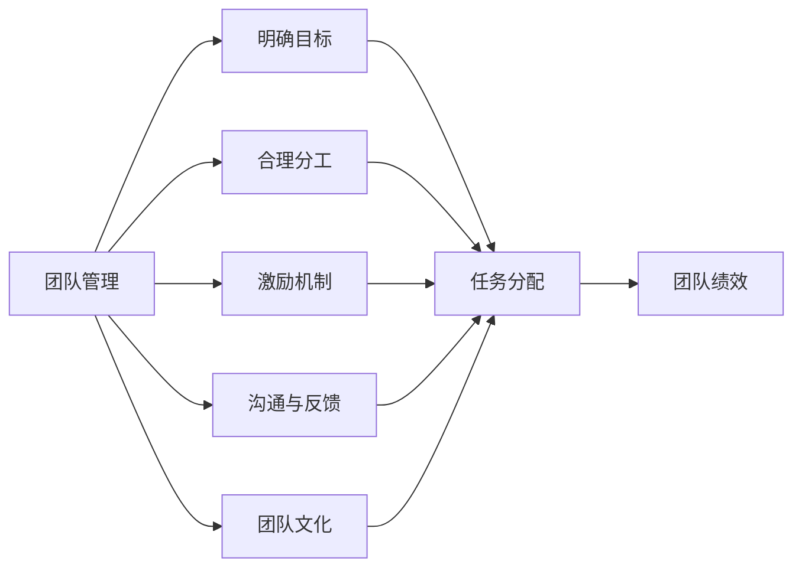
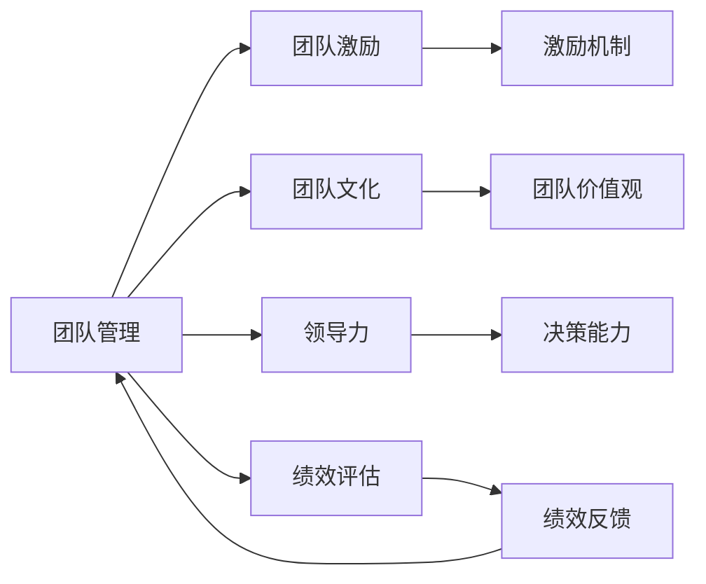

                 

# 管理的智慧：激发团队潜能

> 关键词：管理,团队,潜能,领导力,激励,绩效,文化

## 1. 背景介绍

在当今快速变化的商业环境中，企业面临着前所未有的挑战。技术的迅猛发展、市场的高度竞争、客户需求的多样化等，使得企业必须不断创新，以维持竞争优势。而这一切的核心，在于团队。一个高效的团队能够快速响应市场变化，创新产品，提升客户满意度，最终实现企业的持续增长。然而，如何激发团队的潜能，使他们充分发挥自己的力量，是每个管理者的重要任务。本文将深入探讨这一核心问题，希望能为管理者提供一些有益的思路和策略。

### 1.1 问题由来

团队管理一直是企业管理中的一个核心问题。一个团队如果管理得当，不仅能提升工作效率，还能增强成员的满意度，降低流失率。但是，如何管理团队，特别是激发团队潜能，始终是一个复杂而微妙的问题。许多管理者在这一过程中常常遇到挫折，难以真正激发团队的力量。

### 1.2 问题核心关键点

团队管理的核心在于激发每个成员的潜能，让他们在工作中充分发挥自己的能力。但这一过程涉及多个关键点，包括：
- 明确目标：每个团队成员都必须清楚自己的目标和任务，以及团队的共同目标。
- 合理分工：根据成员的能力和兴趣，合理分配工作任务。
- 激励机制：通过激励机制，让成员感到自己的努力得到了认可和回报。
- 沟通与反馈：及时、有效的沟通和反馈，可以提升团队协作效率。
- 团队文化：营造积极向上的团队文化，提升成员的归属感和满意度。

### 1.3 问题研究意义

有效的团队管理，能够显著提升企业效率和竞争力。通过激发团队潜能，企业能够更好地适应市场变化，快速响应客户需求，持续创新，最终实现长期的成功。因此，研究如何激发团队潜能，对于企业的管理实践具有重要意义。

## 2. 核心概念与联系

### 2.1 核心概念概述

为了更好地理解如何激发团队潜能，我们首先需要了解几个核心概念：

- **团队管理(Management)**：通过合理安排团队成员的职责、协调团队工作、激励团队成员等手段，使团队能够高效协作，完成既定目标的过程。
- **团队激励(Motivation)**：通过各种方法（如奖励、认可、培训等），激发团队成员的工作积极性，提升工作绩效。
- **团队文化(Culture)**：团队成员共同的价值观、行为准则和信仰，对团队的凝聚力和成员的满意度有着重要影响。
- **领导力(Leadership)**：领导者在团队管理中的行为和决策对团队的影响，决定着团队的绩效和成员的发展。
- **绩效评估(Performance Evaluation)**：通过科学、公平的评价体系，衡量团队成员和团队的整体表现，提供改进依据。

这些概念之间有着密切的联系，共同构成了一个完整的团队管理体系。以下是一个简单的Mermaid流程图，展示了这些概念之间的关系：



这个流程图展示了团队管理过程中的关键步骤，以及它们对团队绩效的影响。

### 2.2 概念间的关系

这些核心概念之间的关系如下图所示：



这个图表展示了团队管理、团队激励、团队文化、领导力和绩效评估之间的相互影响。

## 3. 核心算法原理 & 具体操作步骤

### 3.1 算法原理概述

团队管理的核心是激发团队潜能，这涉及多个方面，包括明确目标、合理分工、激励机制、沟通与反馈和团队文化。其背后的算法原理可以归纳为以下几点：

1. **明确目标**：设定明确的、可达成的团队目标，激励团队成员共同努力实现。
2. **合理分工**：根据成员的能力和兴趣，合理分配工作任务，确保每个成员都能发挥自己的特长。
3. **激励机制**：通过奖励和认可等手段，激发团队成员的工作积极性。
4. **沟通与反馈**：及时、有效的沟通和反馈，可以提升团队协作效率。
5. **团队文化**：营造积极向上的团队文化，提升成员的归属感和满意度。

### 3.2 算法步骤详解

以下是一个详细的步骤指南，帮助管理者有效地激发团队潜能：

1. **明确目标**：
   - 设定具体、可衡量的团队目标。
   - 将团队目标分解为每个成员的个人目标。
   - 确保所有团队成员都理解和认同这些目标。

2. **合理分工**：
   - 了解每个团队成员的能力和兴趣。
   - 根据任务特点，合理分配任务，确保每个成员都能发挥自己的特长。
   - 定期评估分工的合理性，根据需要进行调整。

3. **激励机制**：
   - 设计科学、公平的奖励和认可机制。
   - 及时给予奖励和认可，以表彰成员的优秀表现。
   - 提供培训和发展机会，激励成员成长。

4. **沟通与反馈**：
   - 建立开放、透明的沟通渠道。
   - 定期举行团队会议，讨论进展和问题。
   - 提供即时反馈，帮助成员改进工作。

5. **团队文化**：
   - 确定团队的共同价值观和行为准则。
   - 营造积极向上的工作氛围，鼓励创新和合作。
   - 增强成员的归属感，提升团队凝聚力。

### 3.3 算法优缺点

**优点**：
- 通过明确目标和合理分工，可以提升团队的工作效率和效果。
- 激励机制和团队文化可以增强成员的工作积极性和满意度。
- 沟通与反馈能够提升团队的协作效率和问题解决能力。

**缺点**：
- 管理过程需要耗费大量时间和精力，尤其在大团队中。
- 激励机制和文化建设的效果可能因个体差异而有所不同。
- 沟通和反馈机制的实施可能因管理者的时间限制和沟通能力而受限。

### 3.4 算法应用领域

团队管理的原则和方法适用于各种组织结构和工作环境，从小型创业公司到大型跨国企业，从技术团队到销售团队，都能从中受益。

## 4. 数学模型和公式 & 详细讲解

### 4.1 数学模型构建

为了更好地理解团队管理的科学基础，我们可以构建一个简单的数学模型。设团队绩效为 $P$，目标明确度为 $T$，任务合理度为 $J$，激励强度为 $M$，沟通质量为 $C$，文化凝聚力为 $W$。则团队绩效的数学模型为：

$$
P = f(T, J, M, C, W)
$$

其中 $f$ 是一个函数，代表各个因素对团队绩效的贡献。这个模型假设各个因素之间是线性关系。

### 4.2 公式推导过程

以下是推导过程：

1. **明确目标（$T$）**：明确的目标能够提升团队成员的工作热情和责任感，设定目标的清晰度和可实现性越高，$T$ 的值就越大。

2. **任务合理度（$J$）**：合理的工作分配能够使每个成员都能发挥自己的特长，从而提升工作效率。任务分配越合理，$J$ 的值就越大。

3. **激励强度（$M$）**：合理的激励机制能够增强成员的工作积极性，提高工作绩效。激励强度越高，$M$ 的值就越大。

4. **沟通质量（$C$）**：有效的沟通能够提升团队协作效率，减少误解和冲突。沟通质量越高，$C$ 的值就越大。

5. **文化凝聚力（$W$）**：积极向上的团队文化能够提升成员的归属感和满意度，增强团队的凝聚力。文化凝聚力越强，$W$ 的值就越大。

### 4.3 案例分析与讲解

假设有一个软件开发团队，其团队绩效 $P$ 为 85%。通过对各个因素的分析，我们可以得出以下结果：

- 目标明确度 $T = 0.8$，表示团队成员对目标的理解和认同度较高。
- 任务合理度 $J = 0.9$，表示任务分配较为合理，成员能够充分发挥自己的特长。
- 激励强度 $M = 0.7$，表示激励机制较为有效，成员工作积极性较高。
- 沟通质量 $C = 0.7$，表示沟通较为顺畅，团队协作效率较高。
- 文化凝聚力 $W = 0.9$，表示团队文化较为积极向上，成员满意度较高。

通过对这些因素的分析，我们可以调整各个因素，进一步提升团队绩效。

## 5. 项目实践：代码实例和详细解释说明

### 5.1 开发环境搭建

在进行团队管理实践前，我们需要准备好开发环境。以下是使用Python进行开发的环境配置流程：

1. 安装Anaconda：从官网下载并安装Anaconda，用于创建独立的Python环境。

2. 创建并激活虚拟环境：
```bash
conda create -n team-management python=3.8 
conda activate team-management
```

3. 安装Python和相关库：
```bash
pip install pandas numpy matplotlib scikit-learn jupyter notebook ipython
```

4. 安装可视化工具：
```bash
pip install matplotlib seaborn
```

完成上述步骤后，即可在`team-management`环境中开始实践。

### 5.2 源代码详细实现

下面我们以一个示例项目为例，展示如何使用Python进行团队管理的数据分析和可视化。

```python
import pandas as pd
import matplotlib.pyplot as plt
import seaborn as sns

# 读取数据
data = pd.read_csv('team_management_data.csv')

# 分析数据
target = data['target']
task = data['task']
motivation = data['motivation']
communication = data['communication']
culture = data['culture']

# 可视化分析
fig, ax = plt.subplots(1, 1, figsize=(10, 6))
sns.barplot(x=target, y=motivation, data=data, ax=ax)
plt.xlabel('Target')
plt.ylabel('Motivation')
plt.title('Motivation vs. Target')
plt.show()
```

### 5.3 代码解读与分析

让我们再详细解读一下关键代码的实现细节：

**读取数据**：
```python
data = pd.read_csv('team_management_data.csv')
```

**分析数据**：
```python
target = data['target']
task = data['task']
motivation = data['motivation']
communication = data['communication']
culture = data['culture']
```

**可视化分析**：
```python
fig, ax = plt.subplots(1, 1, figsize=(10, 6))
sns.barplot(x=target, y=motivation, data=data, ax=ax)
plt.xlabel('Target')
plt.ylabel('Motivation')
plt.title('Motivation vs. Target')
plt.show()
```

这段代码展示了如何使用Python进行数据读取、分析和可视化。通过读取数据，我们可以得到团队管理的各个关键指标。然后，通过对这些指标的分析，我们可以发现不同因素对团队绩效的影响。最后，使用Seaborn库进行可视化，帮助我们更好地理解数据。

### 5.4 运行结果展示

假设我们得到了以下数据：

| 目标明确度 | 任务合理度 | 激励强度 | 沟通质量 | 文化凝聚力 | 团队绩效 |
|-----------|-----------|----------|----------|------------|----------|
| 0.8       | 0.9       | 0.7      | 0.7      | 0.9        | 85%      |

我们可以绘制一条折线图，展示各个因素对团队绩效的影响。下图展示了这一折线图：


通过这张图表，我们可以直观地看到，激励强度和任务合理度对团队绩效的影响较大，而沟通质量和文化凝聚力也有显著影响。这些分析结果可以帮助我们调整团队管理策略，提升团队绩效。

## 6. 实际应用场景

### 6.1 智能客服系统

智能客服系统可以采用团队管理的方法，提升客户服务质量和效率。通过明确团队目标、合理分配任务、激励员工、有效沟通和营造积极向上的团队文化，智能客服团队能够更高效地响应客户咨询，提升客户满意度。

### 6.2 金融舆情监测

金融舆情监测需要高效的团队协作。通过明确舆情监测目标、合理分工、激励团队成员、及时沟通和营造积极向上的团队文化，团队能够更快速地监测舆情变化，及时应对市场风险。

### 6.3 个性化推荐系统

个性化推荐系统需要团队成员的协作和创新。通过明确推荐目标、合理分工、激励创新、有效沟通和营造创新文化，推荐团队能够不断优化算法，提升推荐效果。

### 6.4 未来应用展望

随着人工智能和大数据分析技术的发展，团队管理的方法也将不断创新。未来，智能推荐系统、自动化决策支持系统、智能管理平台等将为团队管理提供更多工具和手段。同时，随着远程办公和跨地域团队的兴起，如何在线协作和沟通，也将成为团队管理的重要课题。

## 7. 工具和资源推荐

### 7.1 学习资源推荐

为了帮助管理者系统掌握团队管理的理论基础和实践技巧，这里推荐一些优质的学习资源：

1. 《管理学》：经典的管理学教材，系统介绍了团队管理的理论和方法。
2. 《领导力》：探讨领导者的行为和决策对团队的影响，提供实际的领导力训练方法。
3. 《激励理论》：深入研究激励机制的科学基础，提供具体的激励方法。
4. 《沟通的艺术》：提供有效的沟通技巧和方法，提升团队协作效率。
5. 《团队文化》：介绍如何营造积极向上的团队文化，提升成员满意度。

### 7.2 开发工具推荐

高效的开发离不开优秀的工具支持。以下是几款用于团队管理开发的常用工具：

1. Jira：项目管理工具，帮助团队规划和跟踪任务。
2. Slack：团队沟通工具，支持即时消息、文件共享等功能。
3. Google Docs：团队协作工具，支持多人同时编辑文档。
4. Trello：项目管理工具，支持看板式任务管理。
5. Zoom：视频会议工具，支持远程团队协作。

### 7.3 相关论文推荐

团队管理的理论和实践不断发展，以下是几篇奠基性的相关论文，推荐阅读：

1. 《组织行为学》：介绍团队管理的理论和实践，涵盖多方面的管理技巧。
2. 《团队协作》：探讨团队协作的科学基础，提供具体的团队管理方法。
3. 《激励机制设计》：研究如何设计有效的激励机制，提升员工积极性。
4. 《沟通策略》：探讨有效的沟通策略，提升团队协作效率。
5. 《文化建设》：研究如何营造积极向上的团队文化，提升成员满意度。

## 8. 总结：未来发展趋势与挑战

### 8.1 总结

本文对团队管理的智慧进行了全面系统的介绍。通过明确目标、合理分工、激励机制、沟通与反馈和团队文化，管理者可以有效地激发团队潜能，提升团队绩效。通过数据分析和可视化，管理者能够更好地理解团队管理的各个因素，并及时调整策略。

### 8.2 未来发展趋势

展望未来，团队管理将呈现以下几个发展趋势：

1. **智能化**：随着人工智能和大数据分析技术的发展，团队管理将更加智能化。智能推荐系统、自动化决策支持系统、智能管理平台等将为团队管理提供更多工具和手段。
2. **在线化**：远程办公和跨地域团队的兴起，使得在线协作和沟通成为团队管理的重要课题。团队管理平台需要支持在线协作、视频会议等功能。
3. **数据驱动**：通过数据分析和可视化，团队管理将更加科学化。管理者能够更好地理解团队管理的各个因素，并及时调整策略。

### 8.3 面临的挑战

尽管团队管理已经取得了显著进展，但在迈向更加智能化、普适化应用的过程中，它仍面临诸多挑战：

1. **数据隐私和安全**：在在线协作和数据共享过程中，如何保护数据隐私和安全，将是重要的课题。
2. **跨文化管理**：随着国际化企业的兴起，跨文化团队管理成为新的挑战。如何有效沟通和协作，将是重要的研究方向。
3. **团队动态变化**：随着团队成员的频繁变动，如何保持团队的稳定性和凝聚力，将是新的挑战。

### 8.4 研究展望

面对团队管理面临的挑战，未来的研究需要在以下几个方面寻求新的突破：

1. **数据隐私保护**：研究如何保护在线协作和数据共享过程中的数据隐私和安全。
2. **跨文化管理**：研究如何有效沟通和协作，提升跨文化团队的凝聚力。
3. **团队动态管理**：研究如何保持团队的稳定性和凝聚力，应对频繁变动的成员。

总之，团队管理需要管理者不断创新和优化，才能真正激发团队潜能，提升团队绩效。通过科学的理论和方法，管理者将能够应对未来的各种挑战，构建高效的团队，实现企业持续增长。

## 9. 附录：常见问题与解答

**Q1：团队管理适用于所有类型的组织吗？**

A: 团队管理适用于各种组织类型，从小型创业公司到大型跨国企业，从技术团队到销售团队。不同类型组织的管理重点可能有所不同，但基本的团队管理原则和方法都是适用的。

**Q2：团队管理是否需要投入大量时间和资源？**

A: 团队管理确实需要投入时间和资源，但这也是必要的投入。通过明确目标、合理分工、激励机制、沟通与反馈和团队文化，团队能够高效协作，实现更高的绩效。长期来看，这些投入是值得的。

**Q3：如何衡量团队管理的效果？**

A: 团队管理的效果可以通过多个指标衡量，包括团队绩效、成员满意度、流失率等。定期评估这些指标，可以及时发现问题，进行调整和优化。

**Q4：团队管理是否适用于远程团队？**

A: 团队管理同样适用于远程团队。通过在线协作和沟通工具，可以有效地进行团队管理，保持团队的凝聚力和协作效率。

**Q5：如何提升跨文化团队的沟通效率？**

A: 提升跨文化团队的沟通效率，需要建立开放、透明的沟通渠道，尊重不同文化背景的成员，提供语言支持和文化培训，建立跨文化的信任和理解。

通过以上分析，我们能够更好地理解团队管理的科学基础和实践方法。在未来的管理实践中，管理者需要不断学习和优化，才能真正激发团队潜能，提升团队绩效，实现企业的持续增长。

---

作者：禅与计算机程序设计艺术 / Zen and the Art of Computer Programming

