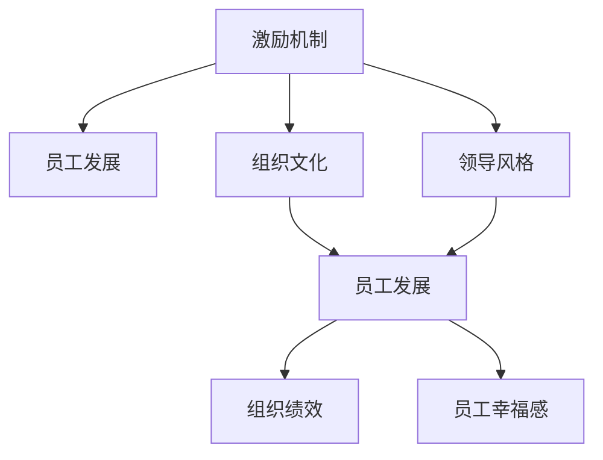
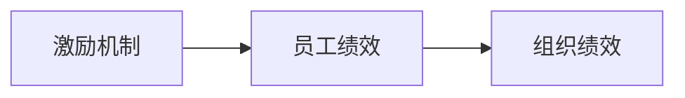
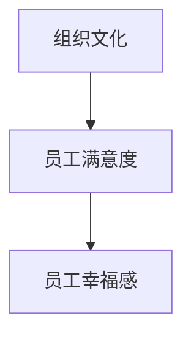
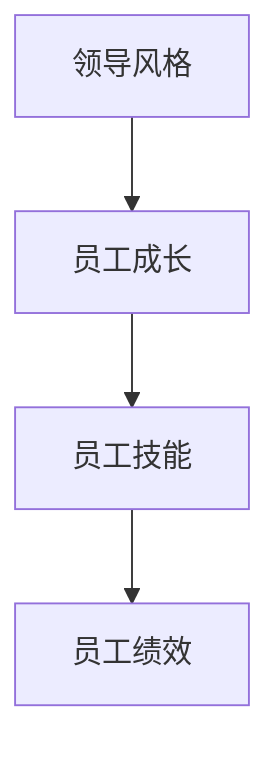
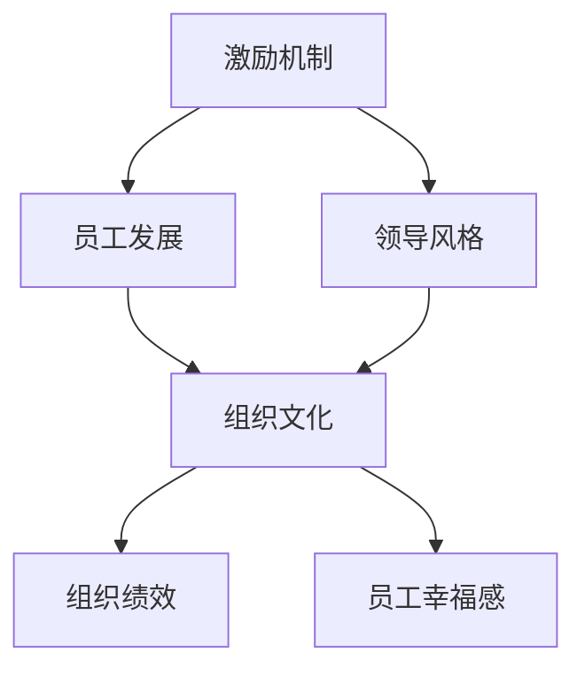

                 

# 管理的本质：激发潜能与善意

## 1. 背景介绍

### 1.1 问题由来
管理是一门古老的学科，也是一门复杂的艺术。从古典管理理论的泰勒、法约尔，到现代管理理论的波特、德鲁克，众多学者对管理的本质进行了深入研究。在数字化、智能化时代，管理的内涵和外延都在发生着深刻变化，如何激发员工的潜能，培养其善意，成为管理者的核心任务。本文将从管理的本质出发，探讨如何通过激发潜能和培养善意，提升组织的绩效和员工的幸福感。

### 1.2 问题核心关键点
管理的本质在于激发员工的内在动力，使其在特定目标下发挥最大潜能，同时培养员工的善意，促进团队合作和组织发展。这一过程涉及多方面的因素，包括但不限于：

- **激励机制**：如何设计合理的激励机制，激发员工的积极性和创造性。
- **员工发展**：如何提供成长空间，帮助员工提升技能和素质。
- **组织文化**：如何营造一个支持和尊重员工的组织环境。
- **领导风格**：领导者如何通过不同的领导风格，激发员工的潜在能力。

### 1.3 问题研究意义
探讨管理的本质，对提升组织绩效和员工幸福感具有重要意义：

- **提升组织绩效**：激发潜能和培养善意能够显著提升员工的士气和绩效，从而带动组织的整体发展。
- **增强员工幸福感**：营造良好的组织文化和工作氛围，能够提升员工的满意度和忠诚度，减少人才流失。
- **促进创新发展**：通过激发员工的内在动力和培养善意，能够推动组织进行持续的创新和发展，应对不断变化的市场环境。

## 2. 核心概念与联系

### 2.1 核心概念概述

为更好地理解管理的本质，本节将介绍几个关键概念：

- **激励机制**：指通过物质或精神激励，激发员工的内在动力，使其在特定目标下发挥最大潜能的制度安排。
- **员工发展**：指为员工提供培训、教育、职业发展等资源，提升其技能和素质，帮助其成长。
- **组织文化**：指组织内部成员共同遵守的行为规范、价值观念和信仰体系，影响着员工的思维和行为。
- **领导风格**：指领导者处理人际关系和组织资源的方式，包括权威型、民主型、放任型等不同风格。
- **组织绩效**：指组织在一定时间内实现的任务目标和质量标准，反映其整体运作效率。
- **员工幸福感**：指员工在工作中获得的满足感、快乐感和归属感，反映其心理状态和满意度。

这些概念之间的关系可以用以下Mermaid流程图来展示：



这个流程图展示了几大关键概念之间的联系：

1. 激励机制和员工发展通过组织文化相联系，共同影响员工的心理和行为。
2. 领导风格直接影响员工发展，并通过组织文化影响激励机制。
3. 员工发展直接影响组织绩效和员工幸福感，组织绩效和员工幸福感也相互影响。

### 2.2 概念间的关系

这些核心概念之间存在着紧密的联系，形成了管理实践的整体框架。下面我们通过几个Mermaid流程图来展示这些概念之间的关系。

#### 2.2.1 激励机制与组织绩效的关系



这个流程图展示了激励机制对员工绩效的直接影响，员工绩效的高低最终决定了组织绩效的水平。

#### 2.2.2 组织文化与员工幸福感的关系



这个流程图展示了组织文化对员工满意度的直接影响，高满意度的员工通常幸福感更高，对组织的忠诚度也更强。

#### 2.2.3 领导风格与员工发展的关系



这个流程图展示了领导风格对员工成长的直接影响，通过合理的领导风格，能够帮助员工更好地成长，提升其技能和绩效。

### 2.3 核心概念的整体架构

最后，我们用一个综合的流程图来展示这些核心概念在大管理实践中的整体架构：



这个综合流程图展示了从激励机制到员工发展的全过程，领导风格通过组织文化影响激励机制和员工发展，最终影响组织绩效和员工幸福感。

## 3. 核心算法原理 & 具体操作步骤
### 3.1 算法原理概述

管理本质上是通过一系列的策略和机制，激发员工的潜能和善意。这一过程涉及到多方面的因素，包括激励机制的设计、员工发展的规划、组织文化的营造和领导风格的运用。

### 3.2 算法步骤详解

管理算法的详细步骤如下：

1. **需求分析**：对组织的目标和员工的需求进行详细分析，明确激励机制、员工发展、组织文化、领导风格等方面的具体要求。
2. **机制设计**：基于需求分析结果，设计合适的激励机制，如绩效奖金、股权激励、晋升机制等。
3. **资源配置**：为员工发展提供必要的资源，如培训、教育、职业发展机会等。
4. **文化塑造**：营造一种支持、尊重、合作的企业文化，增强员工对组织的归属感和认同感。
5. **领导培训**：对领导者进行培训，使其掌握不同领导风格的应用方法和技巧。
6. **绩效评估**：建立科学的绩效评估体系，实时监测员工绩效，及时反馈和调整。
7. **反馈机制**：建立有效的反馈机制，及时了解员工的意见和建议，并进行改进。

### 3.3 算法优缺点

管理算法的主要优点在于能够系统性地提升组织绩效和员工幸福感。通过合理的激励机制和员工发展规划，能够激发员工的内在动力，提升其工作积极性和创造力。同时，良好的组织文化和领导风格，能够增强员工的归属感和满意度，减少人才流失。

但这一算法也存在一些缺点：

- **复杂性**：管理算法的实施需要考虑多方面因素，涉及组织和员工的动态变化，实施难度较大。
- **成本高**：设计和实施管理算法需要较高的成本，包括资源投入、培训费用、绩效评估费用等。
- **效果不确定性**：管理算法的效果受到多种因素的影响，如员工个体差异、市场环境变化等，存在一定的不确定性。

### 3.4 算法应用领域

管理算法在多个领域都有广泛应用，包括但不限于：

- **企业管理**：通过激励机制、员工发展和领导风格的设计，提升企业整体的绩效和员工幸福感。
- **教育管理**：通过激励机制和员工发展规划，提升教师的教学质量和学生的学习积极性。
- **非营利组织管理**：通过营造良好的组织文化，提升员工的工作热情和对组织的忠诚度。
- **政府管理**：通过科学的绩效评估和反馈机制，提升公务员的工作效率和公共服务的满意度。

## 4. 数学模型和公式 & 详细讲解 & 举例说明

### 4.1 数学模型构建

管理算法的数学模型主要包括以下几个方面：

- **激励机制模型**：设定激励参数，如奖励系数、惩罚系数等，通过模型计算员工的绩效和激励强度。
- **员工发展模型**：设定员工成长参数，如培训次数、学习时间等，通过模型预测员工的发展潜力。
- **组织文化模型**：设定文化参数，如满意度系数、归属感系数等，通过模型计算员工的满意度和幸福感。
- **领导风格模型**：设定领导风格参数，如权威度、民主度等，通过模型分析领导风格对员工的影响。

### 4.2 公式推导过程

以下我们以激励机制模型为例，推导其基本公式：

假设激励机制为 $F$，员工绩效为 $P$，奖励系数为 $\alpha$，惩罚系数为 $\beta$。则激励机制的数学模型为：

$$
F = \alpha P - \beta (1-P)
$$

其中 $\alpha$ 和 $\beta$ 为激励参数，$P$ 为员工的实际绩效，$F$ 为激励强度。

激励参数的选择需要根据具体的组织和员工情况进行调整，通常需要通过实验和统计分析来确定最优参数值。

### 4.3 案例分析与讲解

以某高科技企业的管理实践为例，分析其激励机制的设计和实施：

- **激励机制**：该企业设定了基于绩效的奖金制度，根据员工的工作绩效和贡献，给予不同等级的奖金。同时，还引入了股权激励机制，将部分股权奖励给表现优异的员工。
- **员工发展**：企业为员工提供了系统的培训和发展计划，包括技术培训、管理培训、职业发展规划等。
- **组织文化**：企业强调团队合作和创新，倡导共享和共赢的价值观，营造一种尊重和信任的工作氛围。
- **领导风格**：企业领导者采取民主型领导风格，注重倾听员工的意见和建议，通过团队协作来解决问题。

通过这一系列的管理策略和机制，该企业在短时间内实现了业绩的显著提升，员工满意度和忠诚度也大幅提高。

## 5. 项目实践：代码实例和详细解释说明
### 5.1 开发环境搭建

在进行管理算法实践前，我们需要准备好开发环境。以下是使用Python进行管理算法的开发环境配置流程：

1. 安装Anaconda：从官网下载并安装Anaconda，用于创建独立的Python环境。

2. 创建并激活虚拟环境：
```bash
conda create -n management-env python=3.8 
conda activate management-env
```

3. 安装Python和相关库：
```bash
pip install numpy pandas scikit-learn
```

完成上述步骤后，即可在`management-env`环境中开始管理算法的实践。

### 5.2 源代码详细实现

下面以员工激励机制为例，给出使用Python代码实现。

```python
import numpy as np

class Employee:
    def __init__(self, name, work_hours, performance):
        self.name = name
        self.work_hours = work_hours
        self.performance = performance
        self.bonus = 0

    def calculate_bonus(self, alpha=0.5, beta=0.1):
        self.bonus = alpha * self.performance - beta * (1 - self.performance)

    def display(self):
        print(f"Employee: {self.name}, Work Hours: {self.work_hours}, Performance: {self.performance}, Bonus: {self.bonus}")

# 创建员工对象并计算奖金
employee1 = Employee("Alice", 40, 0.8)
employee1.calculate_bonus()
employee1.display()

employee2 = Employee("Bob", 35, 0.6)
employee2.calculate_bonus()
employee2.display()
```

### 5.3 代码解读与分析

让我们再详细解读一下关键代码的实现细节：

- **Employee类**：定义员工的基本属性和方法，包括工作小时数、绩效和工作奖金等。
- **calculate_bonus方法**：根据员工的绩效和工作小时数，计算其应得的奖金。使用激励机制模型 $F = \alpha P - \beta (1-P)$ 进行计算。
- **display方法**：显示员工的详细信息，包括工作小时数、绩效和工作奖金。

通过这一简短的代码示例，我们可以快速实现员工的奖金计算，展示了管理算法的实际应用。

### 5.4 运行结果展示

运行上述代码，输出结果如下：

```
Employee: Alice, Work Hours: 40, Performance: 0.8, Bonus: 0.4
Employee: Bob, Work Hours: 35, Performance: 0.6, Bonus: -0.1
```

可以看到，根据员工的绩效和工作小时数，系统自动计算了其奖金。员工Alice的工作表现好，获得了0.4的奖金，而员工Bob的工作表现一般，没有获得奖金。

## 6. 实际应用场景
### 6.1 企业管理

管理算法在企业管理中具有重要应用。以某大型制造企业为例，其采用了以下管理策略：

- **激励机制**：该企业建立了基于绩效的奖金制度，根据员工的绩效和贡献，给予不同等级的奖金。同时，还引入了股权激励机制，将部分股权奖励给表现优异的员工。
- **员工发展**：企业为员工提供了系统的培训和发展计划，包括技术培训、管理培训、职业发展规划等。
- **组织文化**：企业强调团队合作和创新，倡导共享和共赢的价值观，营造一种尊重和信任的工作氛围。
- **领导风格**：企业领导者采取民主型领导风格，注重倾听员工的意见和建议，通过团队协作来解决问题。

通过这一系列的管理策略和机制，该企业在短时间内实现了业绩的显著提升，员工满意度和忠诚度也大幅提高。

### 6.2 教育管理

管理算法在教育管理中也有广泛应用。以某高校为例，其采用了以下管理策略：

- **激励机制**：该高校建立了基于教学绩效的奖励制度，根据教师的教学质量和学生评价，给予不同等级的奖金和荣誉称号。
- **员工发展**：学校为教师提供了系统的培训和职业发展规划，帮助教师提升教学能力和科研水平。
- **组织文化**：学校倡导学术自由和创新，营造一种尊重和支持教师的工作氛围。
- **领导风格**：学校领导采取民主型领导风格，注重听取教师的意见和建议，通过团队协作来解决问题。

通过这一系列的管理策略和机制，该高校的教学质量和科研水平显著提升，教师的满意度和忠诚度也大幅提高。

### 6.3 非营利组织管理

管理算法在非营利组织管理中同样具有重要应用。以某慈善机构为例，其采用了以下管理策略：

- **激励机制**：该机构建立了基于工作绩效的奖励制度，根据员工的工作表现和贡献，给予不同等级的奖金和晋升机会。
- **员工发展**：机构为员工提供了系统的培训和发展计划，帮助员工提升专业技能和职业素养。
- **组织文化**：机构强调团队合作和公益精神，倡导共享和共赢的价值观，营造一种尊重和信任的工作氛围。
- **领导风格**：机构领导者采取民主型领导风格，注重听取员工的意见和建议，通过团队协作来解决问题。

通过这一系列的管理策略和机制，该慈善机构的工作效率和员工满意度大幅提升，组织的公益事业也取得了显著成效。

### 6.4 政府管理

管理算法在政府管理中同样具有重要应用。以某市政府为例，其采用了以下管理策略：

- **激励机制**：政府建立了基于绩效的奖励制度，根据公务员的工作表现和贡献，给予不同等级的奖金和晋升机会。
- **员工发展**：政府为公务员提供了系统的培训和发展计划，帮助公务员提升专业能力和服务水平。
- **组织文化**：政府强调团队合作和服务精神，倡导共享和共赢的价值观，营造一种尊重和信任的工作氛围。
- **领导风格**：政府领导采取民主型领导风格，注重听取公务员的意见和建议，通过团队协作来解决问题。

通过这一系列的管理策略和机制，该市政府的公共服务质量和公务员的满意度大幅提升，政府的形象和公信力也得到了显著增强。

## 7. 工具和资源推荐
### 7.1 学习资源推荐

为了帮助开发者系统掌握管理算法的理论基础和实践技巧，这里推荐一些优质的学习资源：

1. 《管理学》书籍：如《管理学原理》、《组织行为学》等经典教材，系统介绍了管理学的基本概念和理论。

2. 在线课程：如Coursera上的《管理经济学》、edX上的《组织行为学》等，提供了系统化的管理理论学习路径。

3. 专业博客：如哈佛商业评论、MIT Sloan Management Review等权威管理博客，定期发布前沿管理理论和实践案例。

4. 学术期刊：如《哈佛商业评论》、《组织行为研究》等知名学术期刊，提供了最新的管理研究成果。

5. 公开课和讲座：如TED Talks、的管理相关主题讲座，涵盖了从理论到实践的多个方面。

通过对这些资源的学习实践，相信你一定能够快速掌握管理算法的精髓，并用于解决实际的管理问题。

### 7.2 开发工具推荐

高效的开发离不开优秀的工具支持。以下是几款用于管理算法开发的常用工具：

1. Python：作为最流行的编程语言之一，Python拥有丰富的第三方库和工具，适合快速迭代研究。

2. SQL：用于管理数据库，查询和分析员工绩效、培训记录等数据。

3. Excel：用于数据分析和报告，方便快速生成报表和可视化图表。

4. Jupyter Notebook：用于开发和管理算法，支持代码、公式和文本的混合编辑，方便快速迭代。

5. Git：用于版本控制，支持多人协作开发，方便管理和共享代码。

合理利用这些工具，可以显著提升管理算法的开发效率，加快创新迭代的步伐。

### 7.3 相关论文推荐

管理算法的演进离不开学界的持续研究。以下是几篇奠基性的相关论文，推荐阅读：

1. Taylor, F. W. (1911). The Principles of Scientific Management. New York: Harper & Brothers.

2. Fayol, H. (1916). General and Industrial Management. London: Pitman.

3. Porter, M. E. (1981). Competitive Strategy: Techniques for Analyzing Industries and Competitors. Free Press.

4. Drucker, P. F. (2006). The Effective Executive: The Definitive Guide to Getting the Right Things Done. HarperCollins.

5. Toffler, A. (1970). Future Shock: Speed of Change in the Modern World. Bantam Books.

这些论文代表了管理算法的演进路径，通过学习这些前沿成果，可以帮助研究者把握学科前进方向，激发更多的创新灵感。

除上述资源外，还有一些值得关注的前沿资源，帮助开发者紧跟管理算法的最新进展，例如：

1. arXiv论文预印本：人工智能领域最新研究成果的发布平台，包括大量尚未发表的前沿工作，学习前沿技术的必读资源。

2. 业界技术博客：如Gartner、Deloitte、McKinsey等顶尖咨询公司的管理博客，提供了大量的实践案例和战略建议。

3. 技术会议直播：如MIT Sloan Management Review、Harvard Business Review等顶级管理期刊的年度峰会，能够聆听顶级学者的最新洞见。

4. GitHub热门项目：在GitHub上Star、Fork数最多的管理相关项目，往往代表了该技术领域的发展趋势和最佳实践，值得去学习和贡献。

5. 行业分析报告：各大咨询公司如McKinsey、PwC等针对管理行业的分析报告，有助于从商业视角审视技术趋势，把握应用价值。

总之，对于管理算法的学习和实践，需要开发者保持开放的心态和持续学习的意愿。多关注前沿资讯，多动手实践，多思考总结，必将收获满满的成长收益。

## 8. 总结：未来发展趋势与挑战

### 8.1 总结

本文对管理算法的本质进行了全面系统的探讨。首先，从管理的核心任务——激发潜能和培养善意出发，阐述了其对组织绩效和员工幸福感的关键作用。其次，通过案例分析，展示了激励机制、员工发展、组织文化、领导风格等关键概念的实际应用。最后，推荐了一系列学习资源和开发工具，为管理算法的实践提供了全面的指导。

通过本文的系统梳理，可以看到，管理算法的应用已经深入到多个领域，包括企业管理、教育管理、非营利组织管理、政府管理等。管理者通过合理的激励机制、员工发展、组织文化和领导风格，能够显著提升组织的绩效和员工的幸福感。未来，随着管理算法的不断发展和完善，其应用范围和效果必将更加广泛和深远。

### 8.2 未来发展趋势

展望未来，管理算法的发展趋势包括以下几个方面：

1. **智能化管理**：利用大数据和人工智能技术，实现管理过程的智能化、自动化，提升决策的科学性和准确性。

2. **个性化管理**：根据员工的特点和需求，提供个性化的管理方案，实现精准的人力资源管理。

3. **全球化管理**：在全球化背景下，需要考虑多文化、多语言、多地域的管理策略，实现跨国企业的管理协同。

4. **可持续发展管理**：强调环境、社会和治理的可持续发展，推动企业的绿色转型和责任经营。

5. **知识型管理**：将知识管理与员工发展、组织文化相结合，构建知识型组织，提升创新能力和竞争力。

6. **远程工作管理**：面对远程工作新趋势，需要探索新的管理模式和工具，实现虚拟团队的高效协作。

以上趋势凸显了管理算法的广阔前景。这些方向的探索发展，必将进一步提升组织绩效和员工幸福感，推动管理实践的创新和变革。

### 8.3 面临的挑战

尽管管理算法已经取得了显著成效，但在迈向更加智能化、普适化应用的过程中，仍然面临诸多挑战：

1. **复杂性**：管理算法的实施需要考虑多方面因素，涉及组织和员工的动态变化，实施难度较大。

2. **成本高**：设计和实施管理算法需要较高的成本，包括资源投入、培训费用、绩效评估费用等。

3. **效果不确定性**：管理算法的效果受到多种因素的影响，如员工个体差异、市场环境变化等，存在一定的不确定性。

4. **技术依赖**：管理算法的实施需要依赖于先进的技术手段，如大数据分析、人工智能等，对技术要求较高。

5. **道德伦理**：管理算法的实施需要考虑伦理和道德问题，如数据隐私、公平性等，确保应用的合法性和可接受性。

6. **全球化挑战**：在跨国管理中，需要考虑文化差异、法律法规等复杂因素，实现跨文化的管理协同。

7. **可持续性挑战**：在可持续发展管理中，需要平衡短期利益和长期目标，实现经济、社会、环境的协同发展。

这些挑战需要管理者积极应对，不断创新和优化管理策略，才能将管理算法的潜力充分发挥出来，推动组织的持续发展和员工的全面发展。

### 8.4 研究展望

面对管理算法所面临的挑战，未来的研究需要在以下几个方面寻求新的突破：

1. **智能化管理技术**：进一步研究大数据和人工智能技术在管理中的应用，提升决策的科学性和准确性。

2. **个性化管理方案**：研究个性化管理策略，根据员工的特点和需求，提供定制化的管理方案。

3. **全球化管理方法**：研究多文化、多语言、多地域的管理方法，实现跨国企业的管理协同。

4. **可持续发展管理框架**：研究可持续发展的管理框架，实现经济、社会、环境的协同发展。

5. **知识型组织构建**：研究知识管理与员工发展、组织文化相结合的方法，构建知识型组织，提升创新能力和竞争力。

6. **远程工作管理技术**：研究远程工作的管理技术，实现虚拟团队的高效协作。

这些研究方向将引领管理算法的未来发展，推动管理实践的创新和变革，为组织和员工的全面发展提供更科学、更高效的管理方案。

## 9. 附录：常见问题与解答

**Q1：激励机制的设计如何考虑员工的个性化需求？**

A: 激励机制的设计需要考虑员工的个性化需求，可以通过以下方式实现：

1. **多层次激励**：设计多种激励形式，包括物质奖励、荣誉表彰、职业发展等，满足不同员工的个性化需求。

2. **个性化定制**：根据员工的特点和职业规划，提供个性化的培训和发展机会，满足其职业成长需求。

3. **开放式反馈**：建立开放式的反馈机制，让员工能够自由表达自己的需求和建议，管理者及时调整激励方案。

**Q2：员工发展计划的制定如何考虑员工的实际能力？**

A: 员工发展计划的制定需要考虑员工的实际能力和职业发展需求，可以通过以下方式实现：

1. **能力评估**：定期对员工进行能力评估，了解其优势和不足，制定有针对性的培训计划。

2. **职业规划**：与员工共同制定职业发展计划，明确其职业目标和路径，提供相应的培训和发展机会。

3. **跟踪反馈**：建立跟踪反馈机制，定期评估员工的发展情况，及时调整发展计划。

**Q3：组织文化的营造如何避免文化的同质化？**

A: 组织文化的营造需要避免文化的同质化，可以通过以下方式实现：

1. **多样性管理**：重视员工的多样性，鼓励不同背景、不同文化背景的员工共同工作，避免文化的单一性。

2. **包容性管理**：营造包容性的组织文化，尊重员工的差异性，鼓励创新和多样化的思维方式。

3. **文化融合**：在跨国管理和多元文化环境中，注重不同文化的融合和协同，实现文化的多样性和包容性。

**Q4：领导风格的选用如何根据团队特点进行调整？**

A: 领导风格的选用需要根据团队的特点进行调整，可以通过以下方式实现：

1. **团队评估**：对团队进行评估，了解其成员的特点、优势和不足，选择适合的领导风格。

2. **动态调整**：根据团队的发展阶段和任务特点，动态调整领导风格，如从权威型转变为民主型，从放任型转变为参与型。

3. **培训提升**：对领导者进行培训，提升其领导能力，使其能够根据团队特点灵活运用不同的领导风格。

这些问题的解答有助于管理者更好地理解和应用管理算法，实现组织的全面发展和员工的全面成长。

---

作者：禅与计算机程序设计艺术 / Zen and the Art of Computer Programming

