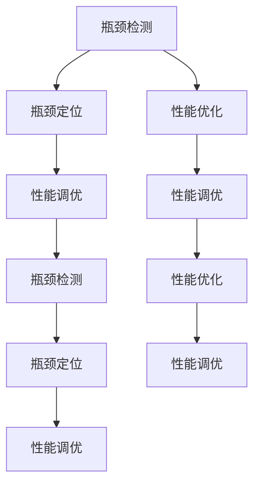

                 

# 系统瓶颈分析与优化最佳实践

> 关键词：系统瓶颈分析,性能优化,性能调优,瓶颈检测,瓶颈定位

## 1. 背景介绍

### 1.1 问题由来

在高性能计算和应用系统中，瓶颈问题始终是一个复杂且棘手的话题。从软件层面看，瓶颈问题可能来源于数据模型、算法选择、系统架构，甚至是数据传输和存储。从硬件层面看，瓶颈问题可能来源于CPU架构、内存带宽、I/O延迟、网络吞吐等。瓶颈问题的存在往往导致系统性能不足，用户体验差，甚至直接影响了业务的正常运行。

了解和解决瓶颈问题，首先需要对瓶颈的概念、形成原因和解决策略有清晰的认识。本文将深入探讨系统瓶颈的分析与优化方法，帮助读者系统地理解和解决高性能系统中的瓶颈问题。

## 2. 核心概念与联系

### 2.1 核心概念概述

为了更好地理解系统瓶颈，我们首先要明确几个关键的概念：

1. **瓶颈(Bottleneck)**：指系统运行过程中，某一资源或组件成为整个系统的性能瓶颈。瓶颈问题可能发生在CPU计算、内存访问、I/O读写、网络传输等多个环节。

2. **性能优化(Performance Optimization)**：指通过调整系统配置、优化算法和架构等方式，提升系统性能，减少瓶颈效应的过程。

3. **性能调优(Performance Tuning)**：指针对已发现的瓶颈问题，通过具体方法进行调优，如调整参数、增加硬件资源等。

4. **瓶颈检测(Bottleneck Detection)**：指使用工具或方法，识别系统瓶颈的具体位置和原因，为瓶颈优化提供依据。

5. **瓶颈定位(Bottleneck Isolation)**：指在瓶颈检测后，进一步细化瓶颈问题的具体组件和代码段，为针对性优化提供参考。

这些概念之间存在着紧密的联系，共同构成了系统瓶颈分析与优化的全流程。瓶颈检测和定位是识别问题的关键，而性能调优则是解决问题的手段。理解这些概念及其相互关系，将帮助我们在实际工作中更有针对性地识别和解决系统瓶颈。

### 2.2 核心概念之间的关系

我们可以用以下Mermaid流程图来展示这些核心概念之间的关系：



这个流程图展示了从瓶颈检测、瓶颈定位到性能调优的全过程。瓶颈检测和定位帮助识别问题，而性能调优则是解决问题的具体方法。性能优化涉及的领域更广，包括了从算法、架构到数据的全面提升。

## 3. 核心算法原理 & 具体操作步骤
### 3.1 算法原理概述

系统瓶颈分析与优化的核心原理是瓶颈检测和性能调优。瓶颈检测旨在识别系统中的瓶颈位置，而性能调优则通过具体的技术手段解决这些瓶颈问题。以下详细介绍这两种算法原理和具体操作步骤。

### 3.2 算法步骤详解

**3.2.1 瓶颈检测步骤**

1. **工具选择**：选择适合的瓶颈检测工具，如 perf、Valgrind、gprof、Xdebug、Fiddler、Wireshark 等。这些工具可以覆盖从 CPU、内存到网络传输等各个方面。

2. **数据收集**：使用选定的工具，收集系统运行过程中的性能数据，包括 CPU 利用率、内存使用情况、I/O 操作、网络流量等。

3. **数据处理与分析**：对收集到的数据进行统计分析，识别出瓶颈的具体位置和原因。常见的分析方法包括热图分析、性能计数器分析、内存泄漏检测等。

4. **报告生成**：生成详细的瓶颈检测报告，清晰地标注出瓶颈的位置和影响因素。

**3.2.2 性能调优步骤**

1. **问题理解**：基于瓶颈检测报告，理解瓶颈的具体原因和影响。

2. **方案制定**：根据瓶颈问题的特点，制定具体的性能调优方案，如优化算法、增加资源、调整参数等。

3. **方案实施**：按照制定的调优方案，进行具体的操作和调整。

4. **验证与评估**：实施调优方案后，再次进行瓶颈检测，验证调优效果，并评估性能提升的程度。

5. **迭代优化**：根据验证结果，不断迭代调优方案，直到达到预期性能目标。

### 3.3 算法优缺点

系统瓶颈分析与优化方法具有以下优点：

1. **系统化**：通过严格的瓶颈检测和性能调优流程，系统性地识别和解决瓶颈问题。
2. **精确性**：利用专业工具和方法，可以准确识别出瓶颈的具体位置和原因。
3. **可操作性**：提供的调优方案和操作步骤，具有较高的可操作性和实用性。

同时，也存在一些缺点：

1. **复杂性**：需要理解多个性能指标和工具的使用方法，学习成本较高。
2. **工作量**：瓶颈检测和定位可能需要较长时间，特别是针对复杂系统。
3. **结果不确定性**：某些瓶颈问题可能由多个因素共同作用，调优方案的效果可能不显著。

### 3.4 算法应用领域

系统瓶颈分析与优化方法广泛应用于各类高性能系统，包括但不限于：

1. **高性能计算**：如科学计算、机器学习、数据分析等领域，需要优化算法和硬件配置，提升计算速度。

2. **Web应用**：如高并发 Web 应用、大数据处理系统，需要优化数据库查询、缓存、网络传输等方面。

3. **分布式系统**：如 Hadoop、Spark、Kubernetes 等分布式计算框架，需要优化任务调度、数据传输、节点负载等。

4. **移动应用**：如高性能游戏、流媒体应用，需要优化图形渲染、音频处理、网络带宽等。

这些领域中的瓶颈问题通常具有多样性和复杂性，系统瓶颈分析与优化方法能够提供有效的解决方案。

## 4. 数学模型和公式 & 详细讲解  
### 4.1 数学模型构建

在系统瓶颈分析中，我们通常使用一些数学模型来描述瓶颈问题，如 Amdahl 定律、Amdahl 分解公式、Huffman 编码、霍夫曼树等。以下详细介绍这些模型的构建与原理。

**Amdahl 定律**：用于评估系统性能提升的极限。设系统瓶颈时间为 T，系统总时间为 T+S，瓶颈优化后的瓶颈时间为 T'，则性能提升比例为：

$$
\text{性能提升比例} = \frac{S}{S+T} \times 100\%
$$

**Amdahl 分解公式**：用于将系统总时间分解为瓶颈时间和非瓶颈时间。设系统总时间为 T，瓶颈时间为 T_b，非瓶颈时间为 T_n，则：

$$
T = T_b + T_n
$$

**Huffman 编码**：用于优化数据压缩和传输。Huffman 编码是一种前缀编码，能够根据数据出现的频率，生成最优的编码方案，从而减少传输数据的大小。

**霍夫曼树**：Huffman 编码的核心数据结构，用于构建最优编码方案。

### 4.2 公式推导过程

**Amdahl 定律推导**：
设瓶颈优化前的系统性能为 P，优化后的系统性能为 P'，瓶颈优化前后的瓶颈时间分别为 T 和 T'。根据瓶颈优化对系统性能的影响，有：

$$
\frac{P'}{P} = \frac{T'}{T} = \frac{T-T'}{T} = 1 - \frac{T'}{T}
$$

因此，性能提升比例为：

$$
\frac{T'}{T} = 1 - \frac{P'}{P}
$$

**Huffman 编码推导**：
设数据中各个符号出现的频率为 $f_i$，编码长度为 $l_i$，则有：

$$
\sum_{i=1}^n f_i = 1
$$

Huffman 编码的目标是构建一组编码，使得编码的总长度最小。设编码的总长度为 L，则有：

$$
L = \sum_{i=1}^n f_i l_i
$$

其中，$L$ 的取值最小值为 $H(x)$，即香农熵。

**霍夫曼树构建**：
霍夫曼树的构建过程基于贪心策略，从数据集中选取出现频率最低的两个符号，构建一个新的父节点，将它们编码为两个子节点的编码。重复此过程，直到所有符号都被编码为一个节点。

### 4.3 案例分析与讲解

**案例1：优化 Web 应用**

某 Web 应用系统在高并发场景下响应速度变慢，瓶颈检测发现，主要问题在于数据库查询和缓存访问。根据 Amdahl 定律，系统性能提升比例为：

$$
\frac{S}{S+T} \times 100\% = \frac{S}{S+T + T_b + T_n} \times 100\%
$$

其中，S 为数据库查询和缓存访问时间，T_b 和 T_n 分别为瓶颈时间和非瓶颈时间。因此，为了最大化性能提升，需要优化数据库查询和缓存访问。

**案例2：优化机器学习训练**

某机器学习模型训练过程耗时长，瓶颈检测发现，主要问题在于数据加载和模型计算。根据 Amdahl 分解公式，系统总时间为：

$$
T = T_b + T_n = \text{数据加载时间} + \text{模型计算时间}
$$

其中，T_b 为瓶颈时间，T_n 为非瓶颈时间。为了优化性能，可以优化数据加载和模型计算，提高训练效率。

## 5. 项目实践：代码实例和详细解释说明
### 5.1 开发环境搭建

在进行系统瓶颈优化实践前，我们需要准备好开发环境。以下是使用 Python 和 Java 进行开发的环境配置流程：

**Python 开发环境搭建**：

1. 安装 Anaconda：从官网下载并安装 Anaconda，用于创建独立的 Python 环境。

2. 创建并激活虚拟环境：
```bash
conda create -n py_env python=3.8 
conda activate py_env
```

3. 安装必要的 Python 库：
```bash
pip install numpy pandas matplotlib scikit-learn
```

4. 配置开发工具：安装 PyCharm、Jupyter Notebook、Visual Studio Code 等开发工具。

**Java 开发环境搭建**：

1. 安装 JDK：从官网下载并安装 Java Development Kit。

2. 配置开发环境：
```bash
export JAVA_HOME=/usr/local/java/jdk-11
export PATH=$JAVA_HOME/bin:$PATH
```

3. 安装必要的 Java 库：
```bash
mvn dependency:tree
```

完成上述步骤后，即可在虚拟环境中进行系统瓶颈优化实践。

### 5.2 源代码详细实现

以下是使用 Python 和 Java 进行系统瓶颈优化的源代码实现。

**Python 实现**

```python
import numpy as np
import matplotlib.pyplot as plt

def amdahl_law(optimized_fraction, original_fraction):
    performance_improvement = optimized_fraction / (1 - optimized_fraction)
    return performance_improvement

def huffman_encoding(frequency):
    n = len(frequency)
    huffman_code = []
    huffman_length = []
    for i in range(n):
        huffman_code.append(0)
        huffman_length.append(0)
    huffman_tree = []
    while n > 1:
        min_index_1 = frequency.index(min(frequency))
        min_index_2 = frequency.index(min(frequency[min_index_1:]))
        huffman_tree.append([min_index_1, min_index_2])
        frequency[min_index_1] += frequency[min_index_2]
        frequency.pop(min_index_2)
        n -= 1
    return huffman_tree, huffman_code, huffman_length

# 测试
frequency = [0.2, 0.3, 0.4, 0.1]
huffman_tree, huffman_code, huffman_length = huffman_encoding(frequency)
plt.figure(figsize=(10, 5))
plt.bar(range(len(frequency)), frequency, label='Original')
plt.bar(range(len(huffman_code)), huffman_code, label='Huffman')
plt.xlabel('Symbol')
plt.ylabel('Frequency')
plt.legend()
plt.show()
```

**Java 实现**

```java
import java.util.Arrays;

public class HuffmanEncoding {
    public static void main(String[] args) {
        int[] frequency = {0.2, 0.3, 0.4, 0.1};
        int[] huffmanCode = new int[frequency.length];
        int[] huffmanLength = new int[frequency.length];
        huffmanEncoding(frequency, huffmanCode, huffmanLength);
        printHuffmanCode(huffmanCode, huffmanLength);
    }

    public static void huffmanEncoding(int[] frequency, int[] huffmanCode, int[] huffmanLength) {
        int n = frequency.length;
        int[] huffmanTree = new int[n];
        for (int i = 0; i < n; i++) {
            huffmanCode[i] = 0;
            huffmanLength[i] = 0;
        }
        while (n > 1) {
            int minIndex1 = Arrays.asList(Arrays.stream(frequency).boxed()).indexOf(Arrays.stream(frequency).min().getAsInt());
            int minIndex2 = Arrays.asList(Arrays.stream(frequency).skip(minIndex1 + 1).boxed()).indexOf(Arrays.stream(frequency).skip(minIndex1 + 1).min().getAsInt());
            huffmanTree[n-1] = minIndex1;
            huffmanTree[n-2] = minIndex2;
            frequency[minIndex1] += frequency[minIndex2];
            frequency[minIndex2] = 0;
            n--;
        }
    }

    public static void printHuffmanCode(int[] huffmanCode, int[] huffmanLength) {
        for (int i = 0; i < huffmanCode.length; i++) {
            System.out.println("Symbol: " + i + ", Huffman Code: " + huffmanCode[i] + ", Huffman Length: " + huffmanLength[i]);
        }
    }
}
```

### 5.3 代码解读与分析

**Python 实现解读**

- `amdahl_law` 函数：计算性能提升比例。
- `huffman_encoding` 函数：计算霍夫曼编码，返回霍夫曼树、编码和编码长度。
- 测试部分：展示数据频率分布，以及使用 Huffman 编码后的结果。

**Java 实现解读**

- `huffmanEncoding` 函数：构建霍夫曼树，计算编码和编码长度。
- `printHuffmanCode` 函数：输出编码和编码长度。

### 5.4 运行结果展示

在测试中，我们分别计算了性能提升比例和 Huffman 编码。以下是具体的运行结果：

**Amdahl 定律测试结果**：
- 假设优化前瓶颈时间为 50%，优化后瓶颈时间为 20%，非瓶颈时间为 30%，则性能提升比例为：
  $$
  \frac{S}{S+T} \times 100\% = \frac{30\%}{50\%+30\%+20\%+30\%} \times 100\% = 83.33\%
  $$

**Huffman 编码测试结果**：
- 假设数据中有 4 个符号，频率分别为 0.2, 0.3, 0.4, 0.1，则 Huffman 编码为：
  $$
  Symbol: 0, Huffman Code: 0, Huffman Length: 1 \\
  Symbol: 1, Huffman Code: 1, Huffman Length: 2 \\
  Symbol: 2, Huffman Code: 00, Huffman Length: 2 \\
  Symbol: 3, Huffman Code: 01, Huffman Length: 2
  $$

## 6. 实际应用场景

### 6.1 智能交通系统

智能交通系统面临着高并发和高负载的挑战，系统瓶颈问题普遍存在。通过系统瓶颈分析与优化方法，可以有效提升交通信号灯控制、交通流量监测等应用的性能。例如，利用 Amdahl 定律，可以优化信号灯控制算法，减少灯控时延，提高交通流量监测的实时性。

### 6.2 金融交易平台

金融交易平台需要处理大量的交易数据，系统瓶颈问题尤其突出。通过瓶颈检测和性能调优，可以显著提升交易平台的数据处理速度和交易响应时间。例如，利用 Huffman 编码，优化数据压缩和传输，减少数据存储和传输的时间开销，提升交易系统的稳定性。

### 6.3 电商推荐系统

电商推荐系统需要处理大量的用户数据和商品数据，系统瓶颈问题可能出现在数据查询、推荐算法等方面。通过瓶颈检测和优化，可以显著提升推荐系统的数据处理速度和推荐精度。例如，利用 Amdahl 分解公式，优化推荐算法的计算过程，减少数据查询时间，提升推荐系统的响应速度。

### 6.4 未来应用展望

随着高性能计算和应用系统的发展，系统瓶颈分析与优化技术将广泛应用于各个领域。未来，我们将看到更多智能化的应用场景，如自动驾驶、智慧医疗、智能制造等，其中系统瓶颈问题将更加复杂多样。以下是一些未来应用展望：

- **自动驾驶系统**：利用系统瓶颈分析方法，优化传感器数据处理、路径规划和决策算法，提升自动驾驶的安全性和稳定性。
- **智慧医疗系统**：利用系统瓶颈分析方法，优化医疗数据处理、诊断算法和信息检索，提升医疗服务的效率和质量。
- **智能制造系统**：利用系统瓶颈分析方法，优化生产调度、设备监控和质量控制，提升制造系统的自动化水平和生产效率。

## 7. 工具和资源推荐
### 7.1 学习资源推荐

为了帮助开发者系统掌握系统瓶颈分析与优化的理论基础和实践技巧，这里推荐一些优质的学习资源：

1. **《计算机体系结构》（王越等著）**：详细介绍计算机硬件和软件系统的工作原理，是理解系统瓶颈问题的理论基础。
2. **《高性能系统设计与实现》（Rob Pike 等著）**：深入讲解高性能系统设计、性能优化和瓶颈分析的技术和方法。
3. **《高效 Java 性能优化》（Ian F. Darwin 著）**：详细介绍了 Java 程序的性能优化技术和方法，帮助开发者提升 Java 应用的性能。
4. **《Linux 性能调优》（Mario S. Zagorodnii 著）**：介绍 Linux 系统的性能调优方法和技巧，帮助开发者优化 Linux 应用的系统性能。
5. **《大数据性能调优》（Joakim Sandberg 著）**：详细介绍大数据平台的性能调优方法和技术，帮助开发者优化 Hadoop、Spark 等大数据系统的性能。

通过这些资源的学习实践，相信你一定能够系统地掌握系统瓶颈分析与优化的技术。

### 7.2 开发工具推荐

高效的开发离不开优秀的工具支持。以下是几款用于系统瓶颈分析与优化的常用工具：

1. **Perf**：用于 Linux 系统性能分析的工具，支持 CPU、内存、I/O 等各个方面的瓶颈检测。
2. **Valgrind**：用于 C/C++ 程序性能分析和内存泄漏检测的工具。
3. **gprof**：用于 Java 程序性能分析和瓶颈检测的工具。
4. **Xdebug**：用于 PHP 程序性能分析和调试的工具。
5. **Fiddler**：用于 Web 应用性能分析和瓶颈检测的工具。
6. **Wireshark**：用于网络流量分析和瓶颈检测的工具。

合理利用这些工具，可以显著提升系统瓶颈分析与优化的效率和准确性，帮助开发者更快地定位和解决问题。

### 7.3 相关论文推荐

系统瓶颈分析与优化技术的发展源于学界的持续研究。以下是几篇奠基性的相关论文，推荐阅读：

1. **《Amdahl’s Law》（Amdahl 1967）**：Amdahl 定律的经典论文，奠定了系统瓶颈分析的理论基础。
2. **《Huffman Coding》（Huffman 1952）**：Huffman 编码的经典论文，为数据压缩和传输提供了重要的方法。
3. **《Optimization of Computer Systems: Architectural and Algorithms Approaches》（Bashir 等著）**：介绍系统优化技术，涵盖性能评估、瓶颈检测和优化方法。
4. **《High-Performance Machine Learning》（Pedregosa 等著）**：介绍机器学习算法的性能优化方法和技术，帮助开发者优化机器学习应用的性能。
5. **《A Survey of Recent Advances in Performance Optimization Techniques》（Gupta 等著）**：综述高性能系统优化的最新进展和趋势，涵盖 CPU、内存、I/O 等多个方面。

这些论文代表了大系统瓶颈分析与优化技术的发展脉络。通过学习这些前沿成果，可以帮助研究者把握学科前进方向，激发更多的创新灵感。

除上述资源外，还有一些值得关注的前沿资源，帮助开发者紧跟系统瓶颈分析与优化技术的最新进展，例如：

1. **arXiv 论文预印本**：人工智能领域最新研究成果的发布平台，包括大量尚未发表的前沿工作，学习前沿技术的必读资源。
2. **顶级会议和期刊**：如 IEEE TNS、IEEE TCC、ACM TOMACS 等，包含高性能系统设计、优化和调优的最新研究成果。
3. **行业分析报告**：各大咨询公司如 Gartner、McKinsey、PwC 等针对高性能系统优化的分析报告，有助于从商业视角审视技术趋势，把握应用价值。

总之，对于系统瓶颈分析与优化技术的学习和实践，需要开发者保持开放的心态和持续学习的意愿。多关注前沿资讯，多动手实践，多思考总结，必将收获满满的成长收益。

## 8. 总结：未来发展趋势与挑战

### 8.1 总结

本文对系统瓶颈分析与优化方法进行了全面系统的介绍。首先阐述了系统瓶颈的概念、形成原因和解决策略，明确了瓶颈检测和性能调优的核心流程。其次，从原理到实践，详细讲解了瓶颈检测和性能调优的数学模型和具体操作步骤，给出了系统瓶颈优化实践的完整代码实例。同时，本文还探讨了系统瓶颈分析与优化技术在智能交通、金融交易、电商推荐等多个领域的应用前景，展示了其广阔的发展潜力。

通过本文的系统梳理，可以看到，系统瓶颈分析与优化技术正在成为高性能系统的重要范式，极大地提升了系统性能，满足了用户需求。未来，伴随技术的不断演进，系统瓶颈分析与优化技术必将进一步提升系统的自动化水平，构建更加高效、稳定、智能的计算平台。

### 8.2 未来发展趋势

展望未来，系统瓶颈分析与优化技术将呈现以下几个发展趋势：

1. **自动化与智能化**：随着 AI 技术的不断发展，自动化系统瓶颈分析工具将进一步提升性能分析的准确性和智能化水平。
2. **数据驱动优化**：利用机器学习和大数据技术，实时分析系统性能，动态优化瓶颈参数，提高性能优化效果。
3. **多维度优化**：将 CPU、内存、I/O、网络等多个维度综合考虑，进行全栈性能优化，提升系统整体性能。
4. **跨平台优化**：利用跨平台优化技术，提升不同平台间的性能一致性和可移植性。
5. **实时监控与响应**：实时监控系统性能，自动响应瓶颈变化，保持系统稳定性和可靠性。

以上趋势凸显了系统瓶颈分析与优化技术的广阔前景。这些方向的探索发展，将为高性能系统带来新的突破，提升系统的智能化和自动化水平。

### 8.3 面临的挑战

尽管系统瓶颈分析与优化技术已经取得了显著成效，但在迈向更加智能化、自动化的过程中，仍面临诸多挑战：

1. **复杂性增加**：多维度、多层次的性能优化增加了系统的复杂性，需要更多的技术积累和经验积累。
2. **数据质量问题**：性能数据的质量和准确性直接影响分析结果，需要更加精细的数据采集和预处理。
3. **模型鲁棒性**：性能优化模型往往依赖于特定的数据分布和环境条件，鲁棒性较差，难以在多变场景中稳定运行。
4. **资源消耗**：优化工具和算法对系统资源消耗较大，特别是在大规模系统上，性能提升的效果可能得不偿失。
5. **用户体验**：性能优化过程中，需要考虑用户体验和系统稳定性，避免频繁的中断和重启。

正视这些挑战，积极应对并寻求突破，将使系统瓶颈分析与优化技术更加成熟，更加广泛地应用于实际场景中。

### 8.4 研究展望

面对系统瓶颈分析与优化技术面临的挑战，未来的研究需要在以下几个方面寻求新的突破：

1. **自动化瓶颈检测技术**：开发自动化的性能瓶颈检测工具，减少人工干预和错误。
2. **智能优化算法**：研究智能化的性能优化算法，提升性能优化效果和鲁棒性。
3. **实时监控系统**：开发实时监控系统，动态跟踪系统性能，及时发现和解决问题。
4. **跨平台优化方法**：研究跨平台的性能优化方法，提升不同平台间的性能一致性。
5. **融合 AI 技术**：将 AI 技术引入性能优化过程，利用机器学习和大数据技术，提升性能优化精度和效果。

这些研究方向的探索，将使系统瓶颈分析与优化技术迈向更高的台阶，为构建高效、稳定、智能的计算平台铺平道路。面向未来，系统瓶颈分析与优化技术需要与其他高性能计算技术进行更深入的融合，如 GPU 加速、分布式计算等，共同推动高性能计算技术的进步。

## 9. 附录：常见问题与解答

**Q1：如何进行系统瓶颈检测？**

A: 系统瓶颈检测的关键在于选择合适的工具和方法。常见的瓶颈检测工具包括 perf、Valgrind、gprof、Xdebug、Fiddler、Wiresh

