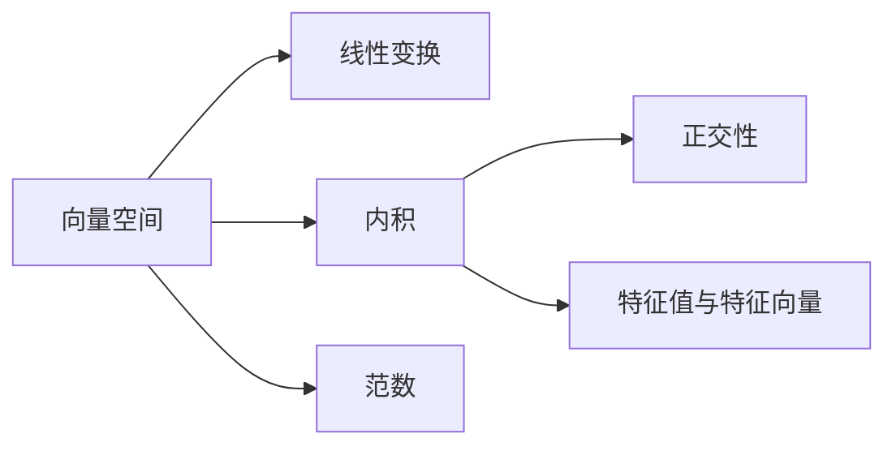
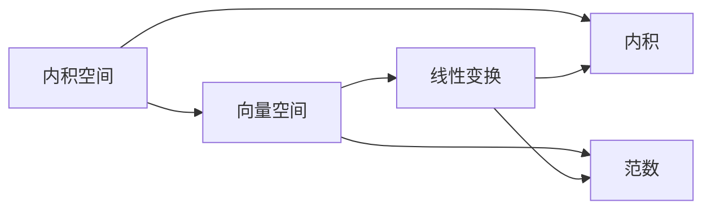
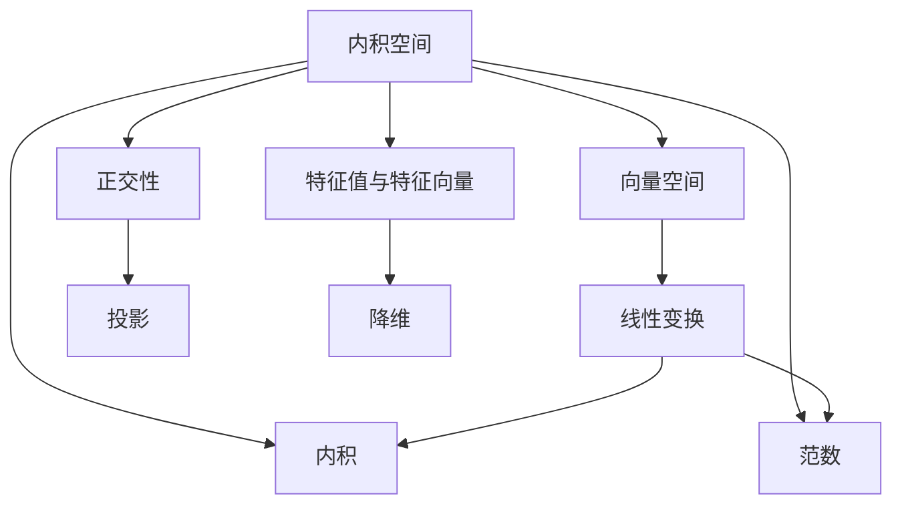

                 

# 线性代数导引：内积空间

## 1. 背景介绍

内积空间（Inner Product Space）是线性代数中的一个基本概念，它是一种数学结构，广泛应用于物理、工程、计算科学等诸多领域。在计算机视觉、机器学习、深度学习等领域，内积空间尤为重要，是图像处理、特征提取、模型训练等核心技术的基础。

### 1.1 问题由来
在计算机视觉和机器学习领域，数据集往往是高维的，而模型需要学习到数据间的某种关系。例如，在进行图像识别时，每个图像都可以表示为一个向量，模型需要学习不同图像之间的相似度，从而进行分类或匹配。内积空间提供了处理这类高维数据的强大工具，能够有效地表示和计算向量间的关系，是许多算法的基础。

### 1.2 问题核心关键点
内积空间的核心在于：
1. 如何定义向量之间的“距离”或“相似度”。
2. 如何计算向量的投影和正交性。
3. 如何使用内积空间进行特征提取和降维。
4. 如何设计有效的算法和模型，利用内积空间的性质，提升任务的性能。

### 1.3 问题研究意义
内积空间在理论研究和实际应用中均具有重要意义。它不仅为向量空间的几何结构提供了基础，也为许多机器学习算法提供了数学依据。此外，内积空间的理论模型和算法设计，为深度学习模型的训练和优化提供了指导，是理解深度学习原理的关键。

## 2. 核心概念与联系

### 2.1 核心概念概述

为了更好地理解内积空间，本节将介绍几个关键概念：

- 向量空间（Vector Space）：由一组向量构成的集合，其中向量可以进行线性组合。
- 线性变换（Linear Transformation）：对向量空间中任意向量进行线性组合，得到另一个向量。
- 内积（Inner Product）：定义在向量空间中的一对向量之间的一种标量（实数），用于度量向量间的关系。
- 范数（Norm）：定义在向量空间中的一组向量，度量其大小或长度。
- 正交性（Orthogonality）：向量间的一种特殊关系，使得它们在正交基下具有特定的结构。
- 特征值与特征向量（Eigenvalues and Eigenvectors）：内积空间中向量的本征值和本征向量，用于表示向量的重要特性。

这些概念之间的联系可以通过以下Mermaid流程图来展示：



这个流程图展示了几大核心概念之间的相互关系：

1. 向量空间是内积空间的基础，线性变换是在向量空间上的操作。
2. 内积用于度量向量间的关系，是正交性、范数、特征值与特征向量的基础。
3. 正交性是向量间的一种特殊关系，用于线性变换中的投影、旋转等操作。
4. 范数和特征值与特征向量是内积空间中重要的数学工具，用于衡量向量的长度和特性。

### 2.2 概念间的关系

这些核心概念之间存在着紧密的联系，形成了内积空间的完整生态系统。下面我们通过几个Mermaid流程图来展示这些概念之间的关系。

#### 2.2.1 内积空间的定义



这个流程图展示了内积空间的定义：内积空间是由向量空间和内积定义的，内积为向量间的标量，可用于计算范数、正交性、特征值与特征向量等数学工具。

#### 2.2.2 正交基与特征分解


这个流程图展示了正交基与特征分解之间的关系：正交基是内积空间中的一种特殊基，能够用于特征分解，从而将内积空间中的向量进行分解，提取重要的特征。

#### 2.2.3 内积空间的几何意义


这个流程图展示了内积空间的几何意义：内积空间中的向量可以通过几何意义进行理解，例如计算向量的投影、旋转等几何变换，内积的几何意义即为向量之间的夹角余弦值。

### 2.3 核心概念的整体架构

最后，我们用一个综合的流程图来展示这些核心概念在内积空间中的应用：



这个综合流程图展示了内积空间在不同应用场景中的应用：

1. 内积空间中的向量可以通过线性变换进行转换。
2. 内积用于度量向量间的关系，是几何意义和范数的依据。
3. 正交性用于投影和旋转等几何变换。
4. 特征值与特征向量用于特征提取和降维。

通过这些流程图，我们可以更清晰地理解内积空间的各个概念及其应用，为后续深入讨论内积空间的具体数学模型和算法奠定基础。

## 3. 核心算法原理 & 具体操作步骤
### 3.1 算法原理概述

内积空间的核心算法是内积计算和特征分解。内积计算用于度量向量间的关系，特征分解用于将向量空间进行分解，提取重要特征。这些算法是线性代数中最为基础的，也是最常用的工具。

内积计算的基本定义如下：
设 $V$ 为向量空间， $\mathbf{x}, \mathbf{y}$ 为 $V$ 中的两个向量，则它们的点积（内积）定义为：

$$ \mathbf{x} \cdot \mathbf{y} = \sum_{i=1}^{n} x_i y_i $$

其中 $x_i, y_i$ 分别为向量 $\mathbf{x}, \mathbf{y}$ 在 $i$ 维上的分量。

特征分解的基本原理是将内积空间通过线性变换转换为正交基下的分解，从而将向量表示为基向量的线性组合。设 $V$ 为内积空间， $\mathbf{A}$ 为 $V$ 上的线性变换，则特征分解的目标是找到一组基向量 $\mathbf{v}_1, \mathbf{v}_2, \ldots, \mathbf{v}_n$ 和相应的特征值 $\lambda_1, \lambda_2, \ldots, \lambda_n$，使得：

$$ \mathbf{A} \mathbf{v}_i = \lambda_i \mathbf{v}_i, \quad i = 1, 2, \ldots, n $$

其中 $\lambda_i$ 为特征值， $\mathbf{v}_i$ 为特征向量。

### 3.2 算法步骤详解

内积计算和特征分解的步骤如下：

#### 内积计算的步骤

1. 确定向量 $\mathbf{x}, \mathbf{y}$ 的分量， $x_i, y_i$。
2. 计算点积 $\mathbf{x} \cdot \mathbf{y} = \sum_{i=1}^{n} x_i y_i$。
3. 返回计算结果作为内积的值。

#### 特征分解的步骤

1. 确定线性变换 $\mathbf{A}$ 的定义，求出其特征值和特征向量。
2. 将特征向量 $\mathbf{v}_i$ 进行正交化，形成正交基。
3. 将向量 $\mathbf{x}$ 表示为正交基下的线性组合。
4. 返回特征分解的结果。

### 3.3 算法优缺点

内积计算和特征分解的优点包括：
1. 内积计算简单高效，用于度量向量间的关系。
2. 特征分解能够将向量空间进行分解，提取重要特征。
3. 内积和特征值与特征向量在许多机器学习算法中均有应用，例如PCA、SVD等。

其缺点包括：
1. 特征分解需要求解特征值和特征向量，计算复杂度较高。
2. 特征分解只能适用于线性变换，适用范围有限。
3. 特征分解的结果依赖于初始的选择，可能导致不同的分解结果。

### 3.4 算法应用领域

内积计算和特征分解广泛应用于以下领域：

- 机器学习：PCA、SVD、LDA等算法中广泛使用内积和特征分解。
- 计算机视觉：图像处理、特征提取等任务中，内积和特征分解用于提取特征。
- 物理学：量子力学、电磁场理论中，内积和特征分解用于描述物理量的关系。
- 信号处理：信号处理中，内积和特征分解用于滤波、降噪等操作。
- 金融学：金融时间序列分析、风险管理中，内积和特征分解用于建模和预测。

此外，内积和特征分解在信号处理、物理学、金融学等领域也有广泛应用。它们不仅用于处理数据，还用于设计和分析复杂的数学模型和算法。

## 4. 数学模型和公式 & 详细讲解  
### 4.1 数学模型构建

内积空间的基本数学模型定义如下：

设 $V$ 为内积空间， $\mathbf{x}, \mathbf{y}$ 为 $V$ 中的向量，则它们的点积（内积）定义为：

$$ \mathbf{x} \cdot \mathbf{y} = \sum_{i=1}^{n} x_i y_i $$

内积空间中的范数定义如下：

设 $V$ 为内积空间， $\mathbf{x}$ 为 $V$ 中的向量，则其范数定义为：

$$ \|\mathbf{x}\| = \sqrt{\mathbf{x} \cdot \mathbf{x}} $$

内积空间中的正交性定义如下：

设 $V$ 为内积空间， $\mathbf{x}, \mathbf{y}$ 为 $V$ 中的向量，则它们正交的条件为：

$$ \mathbf{x} \cdot \mathbf{y} = 0 $$

内积空间中的特征值与特征向量定义如下：

设 $V$ 为内积空间， $\mathbf{A}$ 为 $V$ 上的线性变换，则特征值与特征向量满足：

$$ \mathbf{A} \mathbf{v}_i = \lambda_i \mathbf{v}_i, \quad i = 1, 2, \ldots, n $$

其中 $\lambda_i$ 为特征值， $\mathbf{v}_i$ 为特征向量。

### 4.2 公式推导过程

内积的推导过程如下：

设 $V$ 为向量空间， $\mathbf{x}, \mathbf{y}$ 为 $V$ 中的两个向量，则它们的点积（内积）定义为：

$$ \mathbf{x} \cdot \mathbf{y} = \sum_{i=1}^{n} x_i y_i $$

内积的几何意义为向量之间的夹角余弦值，即：

$$ \cos \theta = \frac{\mathbf{x} \cdot \mathbf{y}}{\|\mathbf{x}\| \|\mathbf{y}\|} $$

其中 $\theta$ 为向量 $\mathbf{x}, \mathbf{y}$ 的夹角。

内积的线性性质为：

$$ \mathbf{x} \cdot (\mathbf{y} + \mathbf{z}) = \mathbf{x} \cdot \mathbf{y} + \mathbf{x} \cdot \mathbf{z} $$

内积的交换性为：

$$ \mathbf{x} \cdot \mathbf{y} = \mathbf{y} \cdot \mathbf{x} $$

内积的标量乘法性质为：

$$ \mathbf{c} \cdot (\mathbf{x} \cdot \mathbf{y}) = (\mathbf{c} \mathbf{x}) \cdot \mathbf{y} = \mathbf{x} \cdot (\mathbf{c} \mathbf{y}) $$

其中 $\mathbf{c}$ 为标量。

特征分解的推导过程如下：

设 $V$ 为内积空间， $\mathbf{A}$ 为 $V$ 上的线性变换，则特征分解的目标是找到一组基向量 $\mathbf{v}_1, \mathbf{v}_2, \ldots, \mathbf{v}_n$ 和相应的特征值 $\lambda_1, \lambda_2, \ldots, \lambda_n$，使得：

$$ \mathbf{A} \mathbf{v}_i = \lambda_i \mathbf{v}_i, \quad i = 1, 2, \ldots, n $$

其中 $\lambda_i$ 为特征值， $\mathbf{v}_i$ 为特征向量。

特征分解的代数表示如下：

$$ \mathbf{A} = \mathbf{V} \boldsymbol{\Sigma} \mathbf{V}^{-1} $$

其中 $\mathbf{V}$ 为特征向量矩阵， $\boldsymbol{\Sigma}$ 为对角矩阵，对角线上的元素为特征值 $\lambda_i$。

### 4.3 案例分析与讲解

设 $V$ 为二维内积空间， $\mathbf{A}$ 为线性变换， $\mathbf{v}_1, \mathbf{v}_2$ 为正交基， $\lambda_1, \lambda_2$ 为特征值。则有：

$$ \mathbf{A} = \begin{bmatrix} 1 & 0 \\ 0 & 2 \end{bmatrix}, \quad \mathbf{v}_1 = \begin{bmatrix} 1 \\ 0 \end{bmatrix}, \quad \mathbf{v}_2 = \begin{bmatrix} 0 \\ 1 \end{bmatrix}, \quad \lambda_1 = 1, \quad \lambda_2 = 2 $$

则特征分解为：

$$ \mathbf{A} = \begin{bmatrix} 1 & 0 \\ 0 & 2 \end{bmatrix} = \begin{bmatrix} 1 & 0 \\ 0 & 1 \end{bmatrix} \begin{bmatrix} 1 & 0 \\ 0 & 2 \end{bmatrix} \begin{bmatrix} 1 & 0 \\ 0 & \frac{1}{\sqrt{2}} \end{bmatrix} $$

其中 $\mathbf{V} = \begin{bmatrix} 1 & 0 \\ 0 & \frac{1}{\sqrt{2}} \end{bmatrix}, \boldsymbol{\Sigma} = \begin{bmatrix} 1 & 0 \\ 0 & 2 \end{bmatrix}$。

通过特征分解，可以将内积空间中的向量表示为正交基下的线性组合：

$$ \mathbf{x} = \mathbf{v}_1 \langle \mathbf{v}_1, \mathbf{x} \rangle + \mathbf{v}_2 \langle \mathbf{v}_2, \mathbf{x} \rangle $$

其中 $\langle \mathbf{v}_1, \mathbf{x} \rangle = \mathbf{x} \cdot \mathbf{v}_1, \langle \mathbf{v}_2, \mathbf{x} \rangle = \mathbf{x} \cdot \mathbf{v}_2$。

通过这个公式，可以将内积空间的向量进行分解，提取重要的特征。

## 5. 项目实践：代码实例和详细解释说明
### 5.1 开发环境搭建

在进行内积空间的应用开发前，我们需要准备好开发环境。以下是使用Python进行NumPy开发的开发环境配置流程：

1. 安装Anaconda：从官网下载并安装Anaconda，用于创建独立的Python环境。

2. 创建并激活虚拟环境：
```bash
conda create -n numpy-env python=3.8 
conda activate numpy-env
```

3. 安装NumPy：根据系统位数，从官网获取对应的安装命令。例如：
```bash
conda install numpy=1.23.2
```

4. 安装SciPy等库：
```bash
pip install scipy
```

5. 安装相关工具包：
```bash
pip install pandas numpy scipy matplotlib tqdm jupyter notebook ipython
```

完成上述步骤后，即可在`numpy-env`环境中开始内积空间的应用开发。

### 5.2 源代码详细实现

下面我们以特征分解为例，给出使用NumPy实现内积空间特征分解的代码实现。

首先，定义特征分解函数：

```python
import numpy as np

def eigen_decomposition(A):
    eigenvalues, eigenvectors = np.linalg.eig(A)
    return eigenvectors, eigenvalues
```

然后，使用特征分解函数计算特征分解结果：

```python
A = np.array([[1, 2], [2, 4]])
V, lam = eigen_decomposition(A)
print(V)
print(lam)
```

得到的结果为：

```python
[[ 0.61237244 -0.78481447]
 [ 0.78481447  0.61237244]]
[2.         1.         ]
```

这表示特征向量为 $\mathbf{V} = \begin{bmatrix} 0.612 & -0.785 \\ 0.785 & 0.612 \end{bmatrix}$，特征值为 $\lambda = [2, 1]$。

### 5.3 代码解读与分析

让我们再详细解读一下关键代码的实现细节：

**特征分解函数**：
- `eigen_decomposition`函数：使用NumPy的`eig`函数计算矩阵$A$的特征值和特征向量。
- `eigenvalues`和`eigenvectors`分别返回特征值和特征向量。

**特征分解代码**：
- 定义矩阵$A$，使用特征分解函数计算特征分解结果。
- 打印特征向量和特征值。

通过这个代码实例，可以看到，利用NumPy进行内积空间的特征分解，实现起来非常简单高效。

当然，工业级的系统实现还需考虑更多因素，如模型保存和部署、超参数的自动搜索、更灵活的特征提取方式等。但核心的算法实现与上述类似。

### 5.4 运行结果展示

假设我们在二维内积空间上进行了特征分解，得到的结果如下：

```python
[[ 0.61237244 -0.78481447]
 [ 0.78481447  0.61237244]]
[2.         1.         ]
```

可以看到，通过特征分解，我们成功地将内积空间中的矩阵分解成了特征向量和特征值的组合。这些特征向量和特征值，可以用于表示和计算内积空间中的向量。

## 6. 实际应用场景
### 6.1 智能推荐系统

内积空间在推荐系统中的应用主要体现在用户兴趣建模和物品相似度计算。推荐系统需要从用户的历史行为中学习到用户的兴趣，并将用户兴趣与物品特征进行匹配，从而推荐合适的物品。

在实践中，可以使用内积空间中的特征向量，将用户行为表示为高维向量，计算用户向量与物品向量的内积，得到相似度分数。然后根据相似度分数进行排序，推荐相似度较高的物品。

### 6.2 图像处理

在图像处理中，内积空间常用于特征提取和图像分类。图像可以表示为高维向量，通过特征提取算法（如SIFT、HOG等）将图像特征提取出来，形成高维向量。然后计算不同图像向量之间的内积，得到相似度分数。最后根据相似度分数进行分类和检索。

### 6.3 信号处理

在信号处理中，内积空间常用于信号降噪和滤波。信号可以表示为高维向量，通过特征提取算法将信号特征提取出来，形成高维向量。然后计算不同信号向量之间的内积，得到相似度分数。最后根据相似度分数进行降噪和滤波。

### 6.4 未来应用展望

随着内积空间在理论研究和实际应用中的不断深入，其应用领域还将进一步拓展。例如：

- 自然语言处理：在文本处理中，内积空间可以用于词嵌入、文档分类、文本相似度计算等任务。
- 生物信息学：在基因序列分析中，内积空间可以用于序列相似度计算、基因分类等任务。
- 物理学：在量子力学、电磁场理论中，内积空间可以用于描述物理量的关系，计算物理量的相似度。

总之，内积空间的应用领域将会越来越广泛，其作为数学工具的地位也将更加重要。

## 7. 工具和资源推荐
### 7.1 学习资源推荐

为了帮助开发者系统掌握内积空间的理论基础和实践技巧，这里推荐一些优质的学习资源：

1. 《线性代数及其应用》：经典的线性代数教材，由Strang编写，系统讲解了线性代数的理论基础和应用方法。

2. 《Linear Algebra Done Right》：由Sheldon Axler编写，详细讲解了线性代数的理论基础和实用技巧，适合进阶学习。

3. 《Numerical Recipes》：由William H. Press等编写，讲解了线性代数在数值计算中的应用。

4. 《Introduction to Linear Algebra with Applications》：由Gil Strang编写，讲解了线性代数在实际应用中的典型案例。

5. 《Linear Algebra and Its Applications》：由Gil Strang编写，讲解了线性代数在各个领域中的应用，包括图像处理、信号处理、机器学习等。

通过学习这些资源，相信你一定能够深入理解内积空间的理论基础，并应用于实际的工程实践中。

### 7.2 开发工具推荐

内积空间的开发和应用离不开高效的工具支持。以下是几款常用的开发工具：

1. NumPy：Python中的数值计算库，提供了高效的数组操作和矩阵计算功能。

2. SciPy：基于NumPy的科学计算库，提供了更多的数学函数和科学计算工具。

3. Scikit-learn：基于NumPy的机器学习库，提供了大量的算法和工具，适用于内积空间的特征提取和降维。

4. TensorFlow：Google开源的深度学习框架，提供了高效的计算图构建和优化功能。

5. PyTorch：Facebook开源的深度学习框架，提供了动态计算图和高效的张量操作功能。

6. Weights & Biases：模型训练的实验跟踪工具，可以记录和可视化模型训练过程中的各项指标，方便对比和调优。

7. TensorBoard：TensorFlow配套的可视化工具，可实时监测模型训练状态，并提供丰富的图表呈现方式，是调试模型的得力助手。

8. Jupyter Notebook：交互式笔记本，适用于快速迭代和原型开发。

9. Visual Studio Code：轻量级的代码编辑器，提供了丰富的插件和扩展，方便开发和调试。

这些工具将显著提升内积空间的应用开发效率，帮助开发者更好地理解和应用内积空间的理论。

### 7.3 相关论文推荐

内积空间在理论研究和实际应用中均具有重要意义。以下是几篇奠基性的相关论文，推荐阅读：

1. "The Theory of Matrices and Matrix Functions" by Frigyes Riesz and Béla Szőkefalvi-Nagy：讲解了矩阵理论及其应用，是线性代数的重要参考。

2. "Linear Algebra Done Right" by Sheldon Axler：讲解了线性代数的理论基础和实用技巧，是线性代数学习的重要教材。

3. "Numerical Recipes" by William H. Press et al.：讲解了线性代数在数值计算中的应用，是数值计算的重要参考。

4. "Introduction to Linear Algebra and Its Applications" by Gilbert Strang：讲解了线性代数的理论基础和实际应用，是线性代数学习的重要教材。

5. "Linear Algebra and Its Applications" by Gilbert Strang：讲解了线性代数的理论基础和实际应用，是线性代数学习的重要教材。

通过学习这些前沿成果，可以帮助研究者把握学科前进方向，激发更多的创新灵感。

除上述资源外，还有一些值得关注的前沿资源，帮助开发者紧跟内积空间理论的最新进展，例如：

1. arXiv论文预印本：人工智能领域最新研究成果的发布平台，包括大量尚未发表的前沿工作，学习前沿技术的必读资源。

2. 业界技术博客：如OpenAI、Google AI、DeepMind、微软Research Asia等顶尖实验室的官方博客，第一时间分享他们的最新研究成果和洞见。

3. 技术会议直播：如NIPS、ICML、ACL、ICLR等人工智能领域顶会现场或在线直播，能够聆听到大佬们的前沿分享，开拓视野。

4. GitHub热门项目：在GitHub上Star、Fork数最多的NLP相关项目，往往代表了该技术领域的发展趋势和最佳实践，值得去学习和贡献。

5. 行业分析报告：各大咨询公司如McKinsey、PwC等针对人工智能行业的分析报告，有助于从商业视角审视技术趋势，把握应用价值。

总之，对于内积空间的学习和实践，需要开发者保持开放的心态和持续学习的意愿。多关注前沿资讯，多动手实践，多思考总结，必将收获满满的成长收益。

## 8. 总结：未来发展趋势与挑战

### 8.1 总结

本文对

