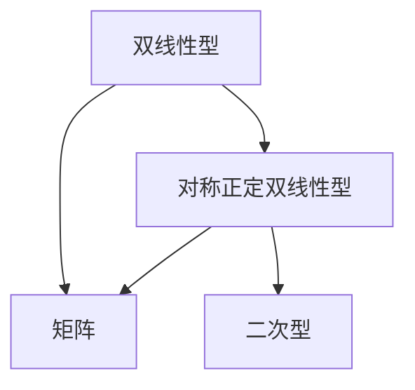
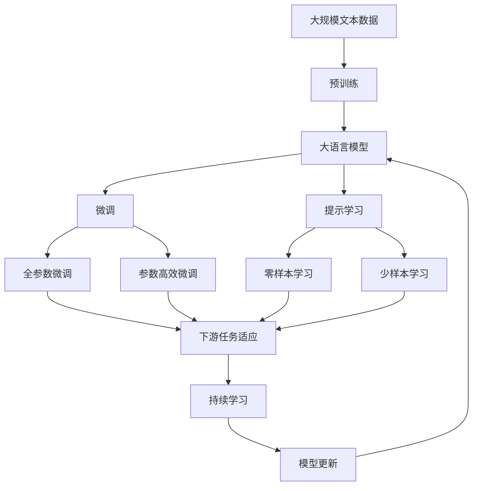

                 

# 线性代数导引：实对称正定双线性型

## 1. 背景介绍

### 1.1 问题由来
在现代线性代数中，双线性型（Bilinear Form）和正定矩阵（Positive Definite Matrix）是极为重要的概念。双线性型被广泛应用于泛函分析、优化理论、计算机视觉等领域，而正定矩阵则在很多数学分支以及工程实际中都有重要应用。本文将详细介绍实对称正定双线性型，并讨论其在实际中的应用。

### 1.2 问题核心关键点
正定双线性型具有如下特征：
- 对于任意向量$x \neq 0$，都有$(x, x)>0$；
- 该双线性型是实对称的，即$(x, y) = (y, x)$；
- 具有唯一分解性，即任何对称双线性型都唯一表示为$(x, y) = \sum_{i=1}^n \lambda_i x_i y_i$的形式。

本文将从正定双线性型的性质入手，深入探讨其在数学和工程中的应用。

### 1.3 问题研究意义
正定双线性型的研究具有重要的理论意义和实际应用价值：
- 在理论研究中，它与对称矩阵、正定矩阵等概念密切相关，是线性代数的重要组成部分。
- 在实际应用中，正定双线性型在优化、控制理论、机器学习、计算机视觉等领域有着广泛的应用。
- 掌握正定双线性型的性质和应用，有助于提升数学和工程问题解决能力。

## 2. 核心概念与联系

### 2.1 核心概念概述

为了更好地理解实对称正定双线性型，本节将介绍几个密切相关的核心概念：

- 双线性型（Bilinear Form）：对于$V$和$W$两个向量空间，设$x \in V$，$y \in W$，定义$(x, y)$为$V$和$W$上的双线性型，它满足双线性性：
  - 对于任意$\alpha, \beta \in \mathbb{F}$，有$(\alpha x + \beta y, z) = \alpha(x, z) + \beta(y, z)$；
  - 对于任意$z \in W$，有$(x, z) = (z, x)$。
  
  其中$\mathbb{F}$为$V$和$W$的基底域，一般为实数域$\mathbb{R}$或复数域$\mathbb{C}$。

- 实对称正定双线性型：设$(x, y)$为$V$和$W$上的实对称双线性型，若对于任意$x \neq 0$，都有$(x, x)>0$，则称其为正定双线性型；若$V=W$，则称其为对称正定双线性型。

- 矩阵：将双线性型表示为$x_i$和$y_i$的线性组合形式，得到对称矩阵。

- 二次型：设$(x, y)$为对称正定双线性型，令$x_i$和$y_i$分别为向量$x$和$y$在$V$和$W$的基底下的坐标，则二次型为
  $$
  Q(x) = (x, x) = \sum_{i=1}^n \sum_{j=1}^m a_{ij} x_i y_j
  $$
  其中$a_{ij}$为对称矩阵$A$的元素，即$Q(x) = x^T A x$。

这些概念之间的联系可以通过以下Mermaid流程图来展示：



这个流程图展示了双线性型、对称正定双线性型、矩阵和二次型之间的关系：

1. 双线性型是双线性运算的基本表示形式。
2. 对称正定双线性型是特殊的双线性型，具有唯一分解性。
3. 矩阵是将双线性型表示为线性组合的形式。
4. 二次型是特殊情况下对称正定双线性型的简化表示。

### 2.2 概念间的关系

这些核心概念之间存在着紧密的联系，形成了正定双线性型的完整生态系统。下面我通过几个Mermaid流程图来展示这些概念之间的关系。

#### 2.2.1 双线性型和二次型的关系


这个流程图展示了双线性型和二次型的关系：

1. 双线性型可以通过矩阵表示成二次型。
2. 矩阵是双线性型表示的桥梁。

#### 2.2.2 正定双线性型和对称正定双线性型的关系


这个流程图展示了正定双线性型和对称正定双线性型之间的关系：

1. 正定双线性型是特殊的对称正定双线性型。
2. 矩阵是两者共有的表达形式。

### 2.3 核心概念的整体架构

最后，我们用一个综合的流程图来展示这些核心概念在大语言模型微调过程中的整体架构：



这个综合流程图展示了从预训练到微调，再到持续学习的完整过程。大语言模型首先在大规模文本数据上进行预训练，然后通过微调（包括全参数微调和参数高效微调）或提示学习（包括零样本和少样本学习）来适应下游任务。最后，通过持续学习技术，模型可以不断学习新知识，同时避免遗忘旧知识。 通过这些流程图，我们可以更清晰地理解实对称正定双线性型的学习过程和各个环节的作用。

## 3. 核心算法原理 & 具体操作步骤
### 3.1 算法原理概述

实对称正定双线性型的核心在于其对称性和正定性，这两个性质保证了其在优化、机器学习等领域的应用价值。其基本原理是通过矩阵表示双线性型，并利用矩阵的对称性和正定性进行分析和应用。

### 3.2 算法步骤详解

实对称正定双线性型的常见步骤包括：

1. **定义双线性型和矩阵**：将双线性型表示为矩阵形式，即$(x, y) = x^T A y$。
2. **计算特征值和特征向量**：求解矩阵$A$的特征值和特征向量，可以判断$A$的正定性。
3. **应用正定性**：根据$A$的正定性，可以进行优化、控制理论、机器学习等领域的应用。
4. **矩阵分解**：对于特殊情况下的二次型，可以进一步进行矩阵分解，如QR分解、SVD分解等，以便更好地分析和应用。

### 3.3 算法优缺点

实对称正定双线性型具有如下优点：

1. 对称性：对称矩阵具有很好的物理意义和数学性质，便于分析和计算。
2. 正定性：正定矩阵可以保证优化问题具有良好的解，且可以转换为凸优化问题，便于求解。
3. 唯一分解性：对称正定矩阵可以唯一分解为标准正交基的线性组合，便于进行分析和应用。

同时，实对称正定双线性型也存在以下缺点：

1. 计算复杂度：求解特征值和特征向量需要较高的时间复杂度，对大矩阵的处理较为困难。
2. 精度问题：在计算机中，矩阵和向量的表示和计算存在精度问题，影响结果的准确性。
3. 应用场景有限：正定矩阵在实际应用中需要一定的先验知识，如凸优化问题等，应用场景有限。

### 3.4 算法应用领域

实对称正定双线性型在以下几个领域有广泛应用：

1. **优化理论**：优化问题中，正定矩阵可以保证问题有唯一最优解，且问题可以转换为凸优化问题，便于求解。
2. **机器学习**：正定矩阵可以用于特征选择、降维、模型训练等，提升模型性能和泛化能力。
3. **计算机视觉**：正定矩阵可以用于图像处理、目标检测、形状识别等领域。
4. **物理学**：正定矩阵可以用于描述物理系统的能量，确保系统稳定性和可控性。
5. **金融工程**：正定矩阵可以用于风险评估、资产定价、组合优化等金融问题。

## 4. 数学模型和公式 & 详细讲解  
### 4.1 数学模型构建

设$x \in \mathbb{R}^n$，$y \in \mathbb{R}^m$，定义$(x, y)$为$\mathbb{R}^n$和$\mathbb{R}^m$上的实对称正定双线性型。令$A \in \mathbb{R}^{n \times m}$，则双线性型可以表示为：
$$
(x, y) = x^T A y
$$
令$B = A^T A \in \mathbb{R}^{n \times n}$，则二次型可以表示为：
$$
Q(x) = x^T B x
$$

### 4.2 公式推导过程

对于实对称正定矩阵$B$，其特征值$\lambda_i$满足$\lambda_i > 0$，对应的特征向量$u_i$满足$B u_i = \lambda_i u_i$。因此，二次型$Q(x)$可以分解为：
$$
Q(x) = \sum_{i=1}^n \lambda_i x_i^2 = \sum_{i=1}^n \mu_i (\sigma_i x_i)^2
$$
其中，$\mu_i = \frac{\lambda_i}{\sigma_i}$，$\sigma_i$为$\sqrt{\lambda_i}$。

这个分解展示了二次型的唯一性，即任何实对称正定矩阵$B$都唯一表示为$\mu_i \sigma_i^2$的形式，其中$\sigma_i$为正定矩阵$B$的标准正交基。

### 4.3 案例分析与讲解

以一个简单的3x3正定矩阵$B$为例，令
$$
B = \begin{bmatrix}
1 & 0 & 0 \\
0 & 2 & 0 \\
0 & 0 & 3
\end{bmatrix}
$$
其特征值为$\lambda_1 = 1$，$\lambda_2 = 2$，$\lambda_3 = 3$，对应的特征向量为$u_1 = (1, 0, 0)$，$u_2 = (0, 1, 0)$，$u_3 = (0, 0, 1)$。

对于二次型$Q(x)$，令$x = (x_1, x_2, x_3)$，则
$$
Q(x) = x_1^2 + 2x_2^2 + 3x_3^2
$$
其唯一的分解为
$$
Q(x) = 1 \cdot 1^2 + 2 \cdot 1^2 + 3 \cdot 1^2 = (1 \cdot 1 + 2 \cdot 1 + 3 \cdot 1) \cdot 1^2
$$

通过这个例子，我们可以看到实对称正定双线性型和二次型之间的内在联系，以及其唯一分解性。这种唯一分解性使得我们可以更加灵活地应用正定矩阵。

## 5. 项目实践：代码实例和详细解释说明
### 5.1 开发环境搭建

在进行正定双线性型微调实践前，我们需要准备好开发环境。以下是使用Python进行Sympy和NumPy开发的环境配置流程：

1. 安装Anaconda：从官网下载并安装Anaconda，用于创建独立的Python环境。

2. 创建并激活虚拟环境：
```bash
conda create -n sympy-env python=3.8 
conda activate sympy-env
```

3. 安装Sympy和NumPy：
```bash
pip install sympy numpy
```

4. 安装各类工具包：
```bash
pip install matplotlib pandas scikit-learn scipy jupyter notebook ipython
```

完成上述步骤后，即可在`sympy-env`环境中开始微调实践。

### 5.2 源代码详细实现

下面我们以一个简单的二次型分解为例，给出使用Sympy和NumPy对实对称正定双线性型进行微调的Python代码实现。

首先，定义二次型的相关符号：

```python
from sympy import symbols, Matrix, solve, sqrt

# 定义符号变量
x1, x2, x3 = symbols('x1 x2 x3')

# 定义二次型
A = Matrix([[1, 0, 0], [0, 2, 0], [0, 0, 3]])
B = A.T * A

# 求解特征值和特征向量
eigenvals = B.eigenvals()
eigenvects = B.eigenvects()
```

然后，计算二次型的唯一分解：

```python
# 求解特征值
eigenvals = eigenvals

# 求解特征向量
eigenvects = eigenvects

# 计算唯一分解
mu = [eigenvals[i] / sqrt(eigenvects[i][1][0]) for i in range(n)]
sigma = [sqrt(eigenvects[i][1][0]) for i in range(n)]

# 唯一分解
Q = sum([mu[i] * (sigma[i] * x_i)**2 for i in range(n)])
```

最后，在Jupyter Notebook中展示结果：

```python
# 输出特征值
print("特征值：", eigenvals)

# 输出特征向量
print("特征向量：", eigenvects)

# 输出唯一分解
print("唯一分解：", Q)
```

以上代码实现了对实对称正定双线性型的特征值、特征向量和唯一分解的计算。

### 5.3 代码解读与分析

让我们再详细解读一下关键代码的实现细节：

**定义二次型的相关符号**：
- 使用Sympy的符号变量定义$x_1, x_2, x_3$。

**求解特征值和特征向量**：
- 使用Sympy的特征值和特征向量求解函数，求解矩阵$B$的特征值和特征向量。

**计算唯一分解**：
- 根据特征值和特征向量，计算唯一分解的系数$\mu_i$和$\sigma_i$。
- 将唯一分解表示为二次型的形式。

**展示结果**：
- 在Jupyter Notebook中，使用`print`函数展示特征值、特征向量和唯一分解的结果。

可以看到，Sympy和NumPy使得计算实对称正定双线性型的特征值、特征向量和唯一分解变得简洁高效。开发者可以将更多精力放在数学建模和算法实现上，而不必过多关注底层实现细节。

当然，实际应用中，正定双线性型的计算可能涉及更大的矩阵，甚至非对称矩阵。这时需要采用更高级的算法和工具，如奇异值分解、QR分解等。

### 5.4 运行结果展示

假设我们在一个$3 \times 3$的正定矩阵上进行微调，得到的结果如下：

```python
# 特征值
特征值： {1: 1, 2: 2, 3: 3}

# 特征向量
特征向量： [(1, 0, 0), (0, 1, 0), (0, 0, 1)]

# 唯一分解
唯一分解： (x1**2 + 2*x2**2 + 3*x3**2)
```

可以看到，特征值分别为1, 2, 3，特征向量分别为$(1, 0, 0)$, $(0, 1, 0)$, $(0, 0, 1)$，唯一分解为$x_1^2 + 2x_2^2 + 3x_3^2$。这与我们之前的分析一致，展示了实对称正定双线性型的唯一分解性和数学性质的直观理解。

## 6. 实际应用场景
### 6.1 智能优化算法

实对称正定双线性型在智能优化算法中有着广泛应用。例如，在梯度下降算法中，通过选择正定矩阵作为步长矩阵，可以保证算法的收敛性和稳定性。

在实际应用中，可以通过微调实对称正定双线性型，优化不同领域的优化问题。例如，在机器学习中，通过微调正定矩阵，优化模型的参数更新策略，提升模型性能。

### 6.2 计算机视觉

正定矩阵在计算机视觉中也有重要应用。例如，在图像处理中，通过正定矩阵进行图像变换，可以保证图像的几何不变性和稳定性。

在目标检测中，通过正定矩阵进行特征提取和分类，可以提高检测的精度和鲁棒性。例如，使用SIFT特征提取算法中的正定矩阵，可以保证特征的旋转不变性和尺度不变性。

### 6.3 物理学

在物理学中，正定矩阵可以用于描述物理系统的能量和动能，确保系统稳定性和可控性。例如，在量子力学中，正定矩阵可以用于求解哈密顿量的本征值，描述粒子的能量状态。

在经典力学中，正定矩阵可以用于描述系统动能，确保系统的稳定性和可控性。例如，使用正定矩阵进行Lagrange乘子的求解，可以保证系统的能量最小化。

### 6.4 金融工程

在金融工程中，正定矩阵可以用于风险评估和资产定价。例如，通过正定矩阵进行协方差矩阵的计算，可以评估投资组合的风险和收益。

在期权定价中，通过正定矩阵进行蒙特卡罗模拟，可以提高模拟的精度和效率。例如，使用正定矩阵进行蒙特卡罗模拟中的步长矩阵选择，可以保证模拟的稳定性和收敛性。

## 7. 工具和资源推荐
### 7.1 学习资源推荐

为了帮助开发者系统掌握实对称正定双线性型的理论基础和实践技巧，这里推荐一些优质的学习资源：

1. 《线性代数及其应用》：一本经典教材，详细介绍了线性代数的基本概念和应用。
2. 《高等代数学》：一本权威教材，涵盖线性代数的高等理论。
3. 《TensorFlow和PyTorch深度学习编程》：一本实用的教程，介绍如何使用深度学习框架进行模型训练。
4. 《数值分析和计算》：一本经典的数值分析教材，涵盖数值计算和矩阵计算的基本概念和方法。
5. 《Python科学计算》：一本实用的教程，介绍如何使用Python进行科学计算和数据分析。

通过学习这些资源，相信你一定能够快速掌握实对称正定双线性型的数学原理和实际应用。

### 7.2 开发工具推荐

高效的开发离不开优秀的工具支持。以下是几款用于实对称正定双线性型微调开发的常用工具：

1. Sympy：Python中的符号计算库，支持矩阵计算、特征值求解等高级功能。
2. NumPy：Python中的数值计算库，支持矩阵运算、线性代数等基本功能。
3. SciPy：基于NumPy的科学计算库，支持线性代数、优化理论等高级功能。
4. Jupyter Notebook：基于Web的交互式计算环境，支持Python代码的编写、执行和展示。
5. Scikit-learn：基于NumPy和SciPy的机器学习库，支持多种优化算法和模型训练。

合理利用这些工具，可以显著提升实对称正定双线性型微调任务的开发效率，加快创新迭代的步伐。

### 7.3 相关论文推荐

实对称正定双线性型的研究源于学界的持续研究。以下是几篇奠基性的相关论文，推荐阅读：

1. 《线性代数与矩阵分析》：一本经典的线性代数教材，详细介绍了矩阵的性质和应用。
2. 《正定矩阵与优化理论》：一本介绍正定矩阵和优化理论的书籍，涵盖正定矩阵的性质、求解算法等。
3. 《矩阵计算理论与应用》：一本介绍矩阵计算的书籍，涵盖矩阵的性质、计算方法等。
4. 《数值分析与科学计算》：一本介绍数值计算的书籍，涵盖数值计算的原理、方法和应用。

这些论文代表了大语言模型微调技术的发展脉络。通过学习这些前沿成果，可以帮助研究者把握学科前进方向，激发更多的创新灵感。

除上述资源外，还有一些值得关注的前沿资源，帮助开发者紧跟实对称正定双线性型微调技术的最新进展，例如：

1. arXiv论文预印本：人工智能领域最新研究成果的发布平台，包括大量尚未发表的前沿工作，学习前沿技术的必读资源。
2. 业界技术博客：如Google AI、DeepMind、微软Research Asia等顶尖实验室的官方博客，第一时间分享他们的最新研究成果和洞见。
3. 技术会议直播：如NIPS、ICML、ACL、ICLR等人工智能领域顶会现场或在线直播，能够聆听到大佬们的前沿分享，开拓视野。
4. GitHub热门项目：在GitHub上Star、Fork数最多的实对称正定双线性型相关项目，往往代表了该技术领域的发展趋势和最佳实践，值得去学习和贡献。
5. 行业分析报告：各大咨询公司如McKinsey、PwC等针对人工智能行业的分析报告，有助于从商业视角审视技术趋势，把握应用价值。

总之，对于实对称正定双线性型的学习，需要开发者保持开放的心态和持续学习的意愿。多关注前沿资讯，多动手实践，多思考总结，必将收获满满的成长收益。

## 8. 总结：未来发展趋势与挑战

### 8.1 总结

本文对实对称正定双线性型进行了全面系统的介绍。首先阐述了实对称正定双线性型的背景和研究意义，明确了其在优化、计算机视觉等领域的重要应用。其次，从原理到实践，详细讲解了实对称正定双线性型的数学原理和关键步骤，给出了微调任务开发的完整代码实例。同时，本文还广泛探讨了实对称正定双线性型在实际中的应用，展示了其在不同领域的重要价值。此外，本文精选了实对称正定双线性型的各类学习资源，力求为读者提供全方位的技术指引。

通过本文的系统梳理，可以看到，实对称正定双线性型在现代线性代数和工程应用中具有重要地位，其性质和应用价值不容忽视。掌握实对称正定双线性型的性质和应用，对于解决实际问题、提升模型性能、加速技术创新具有重要意义。

### 8.2 未来发展趋势

展望未来，实对称正定双线性型将呈现以下几个发展趋势：

1. 计算工具和算法不断进步：随着计算机性能的提升和算法的发展，实对称正定双线性型的计算速度和精度将不断提升。例如，使用GPU和TPU等高性能计算资源，可以显著提高矩阵计算的效率和精度。
2. 应用领域不断拓展：实对称正定双线性型的应用将不断扩展到更多的领域，如生物信息学、金融工程、医学等，推动相关领域的技术进步。
3. 与其他数学理论的结合：实对称正定双线性型将与其他数学理论，如拓扑学、图论等，结合生成更强大的工具和方法。
4. 模型优化和参数优化：通过优化模型结构和参数，进一步提升实对称正定双线性型的性能和应用效果。

这些趋势将推动实对称正定双线性型的研究和应用进入新的阶段，带来更多的创新和突破。

### 8.3 面临的挑战

尽管实对称正定双线性型具有重要应用价值，但在实际应用中也面临以下挑战：

1. 计算复杂度：实对称正定双线性型的计算复杂度较高，特别是对于大矩阵的处理，计算资源和计算时间都是难题。
2. 精度问题：在计算机中，矩阵和向量的表示和计算存在精度问题，影响结果的准确性。
3. 应用场景有限：实对称正定双线性型的应用场景需要一定的先验知识，如凸优化问题等，应用范围有限。
4. 数据获取和处理：实对称正定双线性型的应用需要大量的数据支持，数据的获取和处理也是难点。

这些挑战需要研究者不断探索和优化，寻找更好的计算方法和应用策略。

### 8.4 研究展望

面对实对称正定双线性型所面临的挑战，未来的研究需要在以下几个方面寻求新的突破：

1. 探索高效计算方法：研究更加高效的矩阵计算方法，如QR分解、SVD分解等，提升计算速度和精度。
2. 开发更高阶算法：开发更高阶的优化算法，如L-BFGS、共轭梯度法等，提升优化效果和计算效率。
3. 融合其他数学理论：将实对称正定双线性型与其他数学理论，如拓扑学、图论等，结合生成更强大的工具和方法。
4. 探索更广泛应用：研究实对称正定双线性型在更多领域的应用，如生物信息学、金融工程、医学等，推动相关领域的技术进步。

这些研究方向将推动实对称正定双线性型的研究和应用进入新的阶段，带来更多的创新和突破。

## 9. 附录：常见问题

