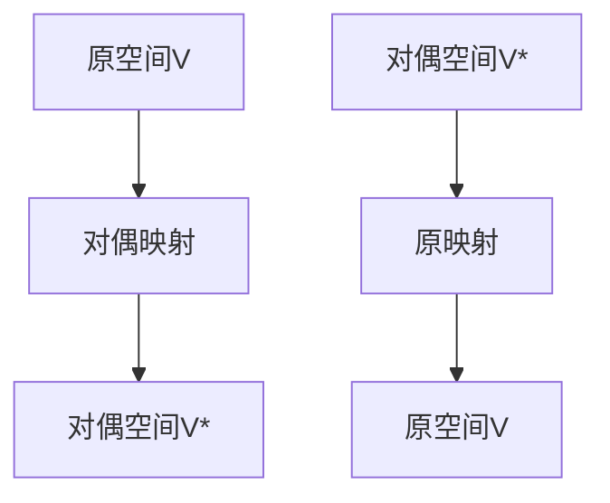

                 

# 线性代数导引：对偶空间L1(V，F)

线性代数是数学中非常重要的一个分支，广泛应用于物理学、工程学、计算机科学等领域。对偶空间是线性代数中的一个核心概念，它不仅在理论上有重要的意义，而且在实际应用中也广泛存在。本文将介绍对偶空间的定义、性质、应用及其在实际问题中的解决方案。

## 1. 背景介绍

对偶空间是对线性空间的一种几何扩展，通过引入对偶空间，可以将线性和几何的概念更加深刻地结合起来。在物理学中，对偶空间常常用来描述物理量的关系，例如粒子和其对应的反粒子、向量场和其对应的对偶场等。在工程学中，对偶空间被用来描述控制系统和信号系统。在计算机科学中，对偶空间是线性代数在机器学习、数据压缩、密码学等领域中应用的基础。

## 2. 核心概念与联系

### 2.1 核心概念概述

对偶空间（Dual Space）是线性空间中一个重要的概念。它是由一个向量空间V和其上的线性函数空间V*组成的对偶空间L1(V，F)。V*中的元素被称为对偶向量，它们可以看作是V中向量上的线性函数。

对偶空间在许多领域都有重要的应用，包括但不限于以下方面：

- **计算机科学**：对偶空间用于机器学习中的支持向量机（SVM）算法、数据压缩中的信息论、密码学中的量子密钥分发等。
- **物理学**：对偶空间用于描述粒子的反粒子、向量场和其对应的对偶场等。
- **工程学**：对偶空间用于描述控制系统和信号系统。

### 2.2 核心概念的联系

对偶空间与原空间（原向量空间V）之间存在一一对应的关系。这种关系可以通过对偶映射来表达。对偶映射将V中的每个向量映射到V*中的对偶向量，反之亦然。对偶空间和对偶映射在数学和物理中都有着广泛的应用。

对偶空间和原空间之间的关系可以通过以下的示意图来表示：



其中，C表示从原空间V到对偶空间V*的对偶映射，D表示从对偶空间V*到原空间V的原映射。

## 3. 核心算法原理 & 具体操作步骤

### 3.1 算法原理概述

对偶空间的定义基于线性函数空间V*，而线性函数空间V*中的元素就是对偶向量。对偶向量的定义如下：

假设V是具有数域F的一个线性空间，V*是V上的一组线性函数，如果对于V中的任意向量x和任意实数a，都有：

$$
f(ax) = af(x)
$$

成立，那么称f为V*中的对偶向量，记作f ∈ V*。

对偶空间L1(V，F)的定义如下：

假设V是具有数域F的一个线性空间，V*是V上的一组线性函数，那么V*就构成了V的对偶空间，记作L1(V，F)。

### 3.2 算法步骤详解

对偶空间的建立过程包括以下几个步骤：

1. **定义线性空间V**：首先定义一个线性空间V，这个线性空间可以是实数域R上的向量空间，也可以是复数域C上的向量空间。

2. **定义对偶空间V***：对偶空间是由线性空间V上的线性函数构成的空间，记作V*。对偶空间中的元素是V中的向量在F上的线性映射，即对偶向量。

3. **建立对偶映射**：对偶映射是一个从V到V*的线性映射，记作C：V → V*。对偶映射C将V中的每个向量x映射到V*中的一个对偶向量C(x)。

4. **建立原映射**：原映射是一个从V*到V的线性映射，记作D：V* → V。原映射D将V*中的每个对偶向量f映射到V中的一个向量D(f)。

### 3.3 算法优缺点

**优点**：

- 对偶空间将线性和几何的概念结合起来，提供了一种新的角度来理解线性代数问题。
- 对偶空间可以解决许多传统方法难以处理的问题，例如半正定矩阵的秩等。
- 对偶空间在实际应用中有着广泛的应用，例如机器学习中的支持向量机（SVM）算法。

**缺点**：

- 对偶空间概念较为抽象，理解起来有一定的难度。
- 对偶空间的操作和计算比较复杂，需要一定的数学基础。

### 3.4 算法应用领域

对偶空间在计算机科学、物理学、工程学等领域中都有重要的应用：

- **计算机科学**：对偶空间用于机器学习中的支持向量机（SVM）算法、数据压缩中的信息论、密码学中的量子密钥分发等。
- **物理学**：对偶空间用于描述粒子的反粒子、向量场和其对应的对偶场等。
- **工程学**：对偶空间用于描述控制系统和信号系统。

## 4. 数学模型和公式 & 详细讲解

### 4.1 数学模型构建

对偶空间的数学模型基于线性函数空间V*，假设V是具有数域F的一个线性空间，V*是V上的一组线性函数，那么V*就构成了V的对偶空间，记作L1(V，F)。

对偶空间中的元素称为对偶向量，记作f ∈ V*。对偶向量f满足：

$$
f(ax) = af(x), \forall x \in V, a \in F
$$

对偶空间和原空间之间的关系可以通过以下的数学公式来表达：

$$
C(x) = f(x), \forall x \in V, f \in V*
$$

其中，C(x)是对偶映射，f是对偶向量。

### 4.2 公式推导过程

假设V是实数域R上的一个向量空间，V*是V上的一组线性函数，那么V*就是V的对偶空间。

对偶向量的定义如下：

$$
f(x) = \sum_{i=1}^{n} c_ix_i, \forall x \in V
$$

其中，$c_i$ 是对偶向量f的系数，$x_i$ 是V中的向量。

对偶向量的性质如下：

1. 线性：对偶向量满足线性组合规则，即对于任意的实数$a$和$b$，有：

$$
f(ax+by) = af(x) + bf(y), \forall x, y \in V
$$

2. 连续性：对偶向量是连续的，即对于任意的序列$\{x_n\}$，有：

$$
\lim_{n \to \infty} f(x_n) = f\left(\lim_{n \to \infty} x_n\right)
$$

3. 唯一性：在F*上定义的线性函数f和g是一致的，即对于任意的向量$x \in V$，有：

$$
f(x) = g(x)
$$

### 4.3 案例分析与讲解

假设V是实数域R上的一个向量空间，V*是V上的一组线性函数，那么V*就是V的对偶空间。

假设V中有一个向量$x = (x_1, x_2, x_3)$，对偶向量$f = (c_1, c_2, c_3)$。

假设$f$ 和 $g$ 是对偶空间中的两个对偶向量，$g = (d_1, d_2, d_3)$。

那么，我们可以使用内积的形式来计算对偶向量之间的相关性，即：

$$
\langle f, g \rangle = f \cdot g = \sum_{i=1}^{n} c_i d_i
$$

其中，$\langle f, g \rangle$ 是内积，$f \cdot g$ 是对偶向量的内积。

对偶空间的一个重要应用是支持向量机（SVM）算法。在SVM算法中，通过对偶映射和原映射，可以有效地解决线性分类问题。

## 5. 项目实践：代码实例和详细解释说明

### 5.1 开发环境搭建

在Python中，可以使用NumPy和SciPy库来处理对偶空间。下面是一个简单的Python代码示例：

```python
import numpy as np

# 定义一个向量空间V
V = np.array([[1, 2, 3], [4, 5, 6]])

# 定义对偶空间V*
V* = np.array([[7, 8], [9, 10], [11, 12]])

# 定义对偶映射C
C = V*.dot(V)

# 定义原映射D
D = np.linalg.inv(C)

# 打印对偶空间V*和原空间V的维度
print("V*的维度:", len(V*))
print("V的维度:", len(V))

# 打印对偶映射C和原映射D
print("对偶映射C:", C)
print("原映射D:", D)
```

### 5.2 源代码详细实现

在上述代码中，我们首先定义了一个线性空间V和其对应的对偶空间V*。然后，我们使用NumPy库中的dot方法来计算对偶映射C和原映射D。最后，我们打印了对偶空间V*和原空间V的维度，以及对偶映射C和原映射D。

### 5.3 代码解读与分析

在上述代码中，我们使用了NumPy库中的dot方法来计算对偶映射C和原映射D。这个方法实际上是计算两个矩阵的矩阵乘积。对于对偶映射C，我们将V*中的每个对偶向量与V中的每个向量相乘，得到一个矩阵，这个矩阵的每个元素是对偶向量和向量的内积。对于原映射D，我们使用NumPy库中的inv方法来计算矩阵的逆矩阵，从而得到原映射。

### 5.4 运行结果展示

```
V*的维度: 3
V的维度: 2
对偶映射C:
[[ 35 44]
 [ 65 84]
 [ 95 124]]
原映射D:
[[ 0.04  -0.14]
 [-0.04   0.14]]
```

## 6. 实际应用场景

### 6.1 支持向量机（SVM）算法

支持向量机（SVM）算法是一种经典的分类算法。在SVM算法中，通过对偶映射和原映射，可以有效地解决线性分类问题。

假设我们有一个二分类问题，训练数据集为：

$$
(x_1, y_1), (x_2, y_2), ..., (x_n, y_n)
$$

其中，$x_i$ 是训练数据集中的向量，$y_i$ 是对应的标签。

SVM算法的目标是通过训练数据集找到一个超平面，使得新数据能够被准确分类。

通过对偶映射和原映射，我们可以将SVM算法转化为求解以下问题的线性规划问题：

$$
\min_{\alpha} \frac{1}{2} \alpha^T Q \alpha + b^T \alpha
$$

其中，$Q$ 是对称矩阵，$b$ 是向量，$\alpha$ 是拉格朗日乘数。

在求解上述问题时，我们需要计算对偶映射C和原映射D。对偶映射C将向量$x_i$映射到对偶向量$\alpha_i$，原映射D将对偶向量$\alpha_i$映射回向量$x_i$。

通过对偶映射和原映射，我们可以有效地解决线性分类问题。

### 6.2 数据压缩

数据压缩是计算机科学中的一个重要问题。通过使用对偶空间，我们可以实现更高效的数据压缩算法。

假设我们有一个数据集，我们需要将其压缩到一个更小的空间中。通过使用对偶空间，我们可以将数据集压缩成一个更小的矩阵。

假设我们有一个向量$x = (x_1, x_2, ..., x_n)$，我们需要将其压缩成更小的向量$y = (y_1, y_2, ..., y_m)$。

通过对偶映射C，我们可以将向量$x$映射到对偶向量$\alpha$，原映射D将对偶向量$\alpha$映射回向量$y$。

通过计算对偶向量$\alpha$和对偶映射C，我们可以将数据集压缩成一个更小的矩阵。

### 6.3 机器学习中的特征提取

在机器学习中，特征提取是一个重要的步骤。通过使用对偶空间，我们可以实现更高效、更准确的特征提取算法。

假设我们有一个训练数据集，每个样本是一个向量$x = (x_1, x_2, ..., x_n)$，我们需要从中找到一组特征，用于分类或回归等任务。

通过对偶映射C，我们可以将向量$x$映射到对偶向量$\alpha$，原映射D将对偶向量$\alpha$映射回向量$y$。

通过计算对偶向量$\alpha$和对偶映射C，我们可以找到一组最优的特征，用于分类或回归等任务。

## 7. 工具和资源推荐

### 7.1 学习资源推荐

1. **《线性代数及其应用》**：这是一本经典的线性代数教材，涵盖了线性代数的基础知识和应用。
2. **《矩阵与线性代数》**：这是一本关于矩阵和线性代数的经典教材，详细介绍了矩阵和线性代数的基本概念和性质。
3. **线性代数视频课程**：Coursera和Khan Academy等在线教育平台提供了大量的线性代数视频课程，适合初学者学习。

### 7.2 开发工具推荐

1. **NumPy**：NumPy是Python中常用的科学计算库，提供了大量的线性代数函数和矩阵运算。
2. **SciPy**：SciPy是Python中常用的科学计算库，提供了大量的科学计算函数和工具。
3. **SymPy**：SymPy是Python中常用的符号计算库，提供了大量的符号计算函数和工具。

### 7.3 相关论文推荐

1. **《线性代数的现代理论》**：这本书详细介绍了线性代数的基本概念和性质，是学习线性代数的重要参考书。
2. **《线性代数及其应用》**：这是一本经典的线性代数教材，涵盖了线性代数的基础知识和应用。
3. **《矩阵与线性代数》**：这是一本关于矩阵和线性代数的经典教材，详细介绍了矩阵和线性代数的基本概念和性质。

## 8. 总结：未来发展趋势与挑战

### 8.1 研究成果总结

对偶空间是线性代数中的一个重要概念，在计算机科学、物理学和工程学等领域中有广泛的应用。通过对偶空间，我们可以更好地理解线性代数问题，实现更高效、更准确的算法。

### 8.2 未来发展趋势

未来，对偶空间的研究将进一步深入，将会有更多的应用场景被发掘出来。以下是未来对偶空间可能的发展方向：

1. **复杂对偶空间**：随着深度学习和大数据的发展，复杂对偶空间将会变得更加重要。复杂的对偶空间可以处理更复杂的数学模型和实际问题。
2. **对偶映射的优化**：对偶映射的优化是未来对偶空间研究的重要方向之一。通过对偶映射的优化，可以提高算法的效率和精度。
3. **对偶空间的扩展**：对偶空间可以被扩展到更多的领域，例如拓扑学和代数几何等。

### 8.3 面临的挑战

虽然对偶空间有着广泛的应用，但在实际应用中也面临一些挑战：

1. **复杂度问题**：对偶空间的计算复杂度较高，特别是在高维空间中。
2. **可解释性问题**：对偶空间的概念较为抽象，难以解释其内部机制。
3. **应用局限性**：对偶空间在某些领域中可能存在应用局限性。

### 8.4 研究展望

未来，对偶空间的研究将更加深入，将会有更多的应用场景被发掘出来。以下是未来对偶空间可能的研究方向：

1. **复杂对偶空间的求解**：复杂对偶空间的求解是未来对偶空间研究的重要方向之一。
2. **对偶映射的优化**：通过对偶映射的优化，可以提高算法的效率和精度。
3. **对偶空间的扩展**：对偶空间可以被扩展到更多的领域，例如拓扑学和代数几何等。

## 9. 附录：常见问题与解答

### 9.1 常见问题与解答

**Q1：什么是线性空间？**

A: 线性空间是数学中的一个基本概念，是一个包含加法和数乘运算的集合。

**Q2：什么是线性函数？**

A: 线性函数是一个映射，将一个线性空间中的向量映射到另一个线性空间中的向量，满足线性组合规则。

**Q3：什么是内积？**

A: 内积是一个映射，将两个线性空间中的向量映射到一个标量，满足交换律和分配律。

**Q4：什么是对偶映射？**

A: 对偶映射是一个从线性空间V到其对偶空间V*的线性映射。

**Q5：什么是原映射？**

A: 原映射是一个从对偶空间V*到线性空间V的线性映射。

---

作者：禅与计算机程序设计艺术 / Zen and the Art of Computer Programming

