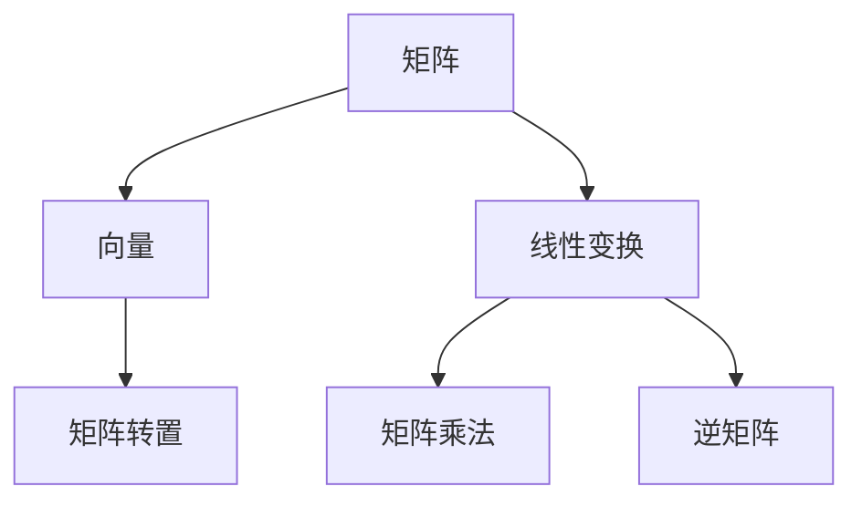
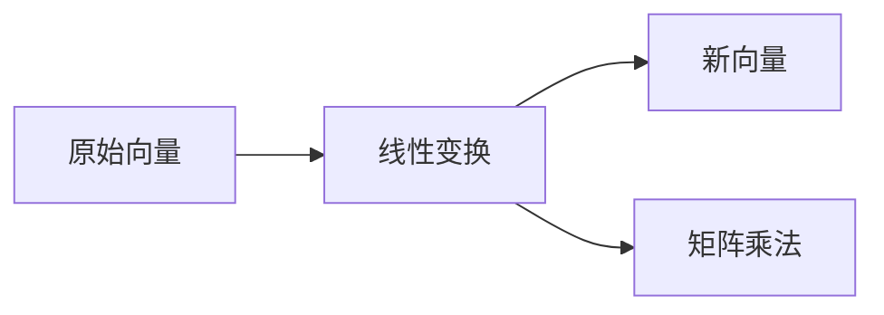
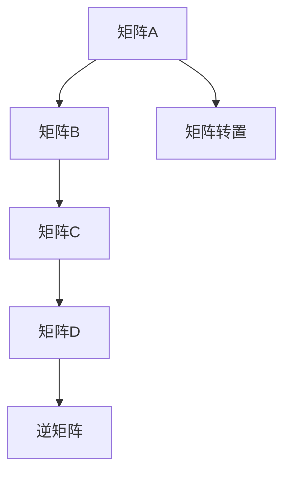
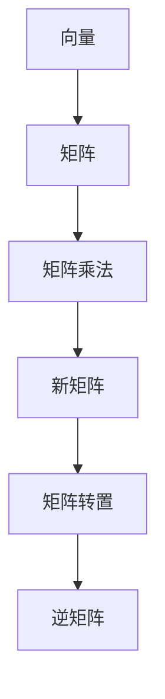

                 

# 线性代数导引：矩阵乘法

> 关键词：矩阵乘法,线性代数,计算机图形学,深度学习,神经网络

## 1. 背景介绍

### 1.1 问题由来
在数学和计算机科学中，矩阵乘法是最基础也最核心的运算之一。在计算机图形学和深度学习等领域，矩阵乘法更是无处不在。本文将深入探讨矩阵乘法的原理、算法和应用，为你提供全面的线性代数导引。

### 1.2 问题核心关键点
矩阵乘法是线性代数中最基本的运算之一，其核心思想是将两个矩阵相乘得到一个新的矩阵。矩阵乘法广泛应用于线性代数、计算机图形学、深度学习等领域。具体而言，其应用场景包括：

- 图形变换：将二维或三维坐标向量通过矩阵乘法进行旋转、缩放、平移等操作，得到新的坐标向量。
- 特征提取：通过矩阵乘法将原始数据嵌入高维空间，得到特征向量，用于图像识别、文本分类等任务。
- 模型训练：深度学习中的神经网络模型通过矩阵乘法进行前向传播和反向传播，更新模型参数，优化模型性能。

### 1.3 问题研究意义
掌握矩阵乘法的原理和算法，对计算机科学和数学的深入理解至关重要。在图形学、深度学习等领域，矩阵乘法的广泛应用推动了技术进步，为各种应用场景提供了强大的数学基础。

## 2. 核心概念与联系

### 2.1 核心概念概述

为更好地理解矩阵乘法的原理和算法，本节将介绍几个密切相关的核心概念：

- 矩阵：由一组有序的标量组成的方阵，通常用于表示线性变换或线性关系。
- 向量：一组有序标量，通常用于表示点、坐标等几何信息。
- 线性变换：通过矩阵乘法将向量空间中的向量映射到另一个向量空间的操作。
- 矩阵乘法：两个矩阵相乘得到一个新的矩阵的运算。
- 矩阵转置：将矩阵的行和列互换，得到矩阵的转置。
- 逆矩阵：与原矩阵相乘等于单位矩阵的矩阵。

这些核心概念之间的逻辑关系可以通过以下Mermaid流程图来展示：



这个流程图展示了几何和代数之间的联系：

1. 矩阵可以表示线性变换，向量是线性变换的输入或输出。
2. 矩阵乘法可以将两个线性变换进行组合。
3. 矩阵转置可以交换矩阵的行和列。
4. 逆矩阵可以求解矩阵的逆操作。

### 2.2 概念间的关系

这些核心概念之间存在着紧密的联系，形成了矩阵乘法的完整体系。下面我通过几个Mermaid流程图来展示这些概念之间的关系。

#### 2.2.1 矩阵乘法的几何意义



这个流程图展示了矩阵乘法在几何上的意义：通过矩阵乘法，将原始向量应用线性变换，得到新的向量。

#### 2.2.2 矩阵乘法的代数结构



这个流程图展示了矩阵乘法在代数上的结构：通过矩阵乘法，可以将两个矩阵相乘得到一个新矩阵，该矩阵可以进行转置和求逆。

#### 2.2.3 矩阵乘法在深度学习中的应用


这个流程图展示了矩阵乘法在深度学习中的应用：通过前向传播，将输入数据应用隐层权重和激活函数，得到输出数据，再通过损失函数和反向传播更新模型参数。

### 2.3 核心概念的整体架构

最后，我们用一个综合的流程图来展示这些核心概念在矩阵乘法中的整体架构：



这个综合流程图展示了从向量到矩阵，再通过矩阵乘法得到新矩阵的完整过程。

## 3. 核心算法原理 & 具体操作步骤
### 3.1 算法原理概述

矩阵乘法的核心思想是将两个矩阵相乘，得到一个新的矩阵。设矩阵 $A$ 的维度为 $m \times n$，矩阵 $B$ 的维度为 $n \times p$，则它们的矩阵乘积 $C = A \times B$ 的维度为 $m \times p$。矩阵乘法的过程如下：

1. 初始化结果矩阵 $C$ 为零矩阵。
2. 对于 $C$ 中的每个元素 $c_{ij}$，计算其值为 $c_{ij} = \sum_{k=1}^{n} a_{ik}b_{kj}$，其中 $a_{ik}$ 和 $b_{kj}$ 分别为 $A$ 和 $B$ 中对应位置的元素。

### 3.2 算法步骤详解

下面是矩阵乘法的详细步骤：

1. 初始化结果矩阵 $C$，使其维度为 $m \times p$。
2. 对于 $C$ 中的每个元素 $c_{ij}$，计算其值为 $c_{ij} = \sum_{k=1}^{n} a_{ik}b_{kj}$。
3. 重复步骤 2 直到所有元素计算完成，最终得到矩阵 $C$。

### 3.3 算法优缺点

矩阵乘法具有以下优点：

- 高效：矩阵乘法可以通过高度优化的线性代数库实现，高效计算。
- 可扩展性：矩阵乘法可以应用于大规模矩阵计算，适用于深度学习等场景。
- 数学基础：矩阵乘法是线性代数中最基础的操作，具有坚实的数学基础。

但矩阵乘法也存在以下缺点：

- 内存消耗：对于大规模矩阵计算，需要消耗大量内存。
- 计算复杂度：矩阵乘法的时间复杂度为 $O(m \times n \times p)$，当 $m$ 或 $p$ 较大时，计算复杂度较高。
- 非交换性：矩阵乘法不满足交换律，即 $AB \neq BA$。

### 3.4 算法应用领域

矩阵乘法广泛应用于以下领域：

- 图形学：用于表示变换矩阵、投影矩阵等几何变换。
- 深度学习：用于神经网络的前向传播和反向传播，优化模型参数。
- 信号处理：用于卷积操作，提取特征。
- 科学计算：用于线性方程求解、矩阵分解等。

## 4. 数学模型和公式 & 详细讲解  
### 4.1 数学模型构建

设矩阵 $A$ 的维度为 $m \times n$，矩阵 $B$ 的维度为 $n \times p$，它们的矩阵乘积 $C$ 的维度为 $m \times p$。

定义矩阵 $A$ 和 $B$ 分别为：

$$
A = \begin{bmatrix}
    a_{11} & a_{12} & \dots & a_{1n} \\
    a_{21} & a_{22} & \dots & a_{2n} \\
    \vdots & \vdots & \ddots & \vdots \\
    a_{m1} & a_{m2} & \dots & a_{mn}
\end{bmatrix}
$$

$$
B = \begin{bmatrix}
    b_{11} & b_{12} & \dots & b_{1p} \\
    b_{21} & b_{22} & \dots & b_{2p} \\
    \vdots & \vdots & \ddots & \vdots \\
    b_{n1} & b_{n2} & \dots & b_{np}
\end{bmatrix}
$$

则矩阵乘积 $C$ 为：

$$
C = \begin{bmatrix}
    c_{11} & c_{12} & \dots & c_{1p} \\
    c_{21} & c_{22} & \dots & c_{2p} \\
    \vdots & \vdots & \ddots & \vdots \\
    c_{m1} & c_{m2} & \dots & c_{mp}
\end{bmatrix}
$$

其中每个元素 $c_{ij}$ 的计算公式为：

$$
c_{ij} = \sum_{k=1}^{n} a_{ik}b_{kj}
$$

### 4.2 公式推导过程

以下我通过一个具体的例子，展示矩阵乘法的计算过程：

设矩阵 $A$ 和 $B$ 分别为：

$$
A = \begin{bmatrix}
    1 & 2 \\
    3 & 4 \\
    5 & 6
\end{bmatrix}
$$

$$
B = \begin{bmatrix}
    7 & 8 \\
    9 & 10 \\
    11 & 12
\end{bmatrix}
$$

计算它们的矩阵乘积 $C$：

$$
C = \begin{bmatrix}
    1 & 2 \\
    3 & 4 \\
    5 & 6
\end{bmatrix}
\times
\begin{bmatrix}
    7 & 8 \\
    9 & 10 \\
    11 & 12
\end{bmatrix}
=
\begin{bmatrix}
    1 \times 7 + 2 \times 9 + 5 \times 11 & 1 \times 8 + 2 \times 10 + 5 \times 12 \\
    3 \times 7 + 4 \times 9 + 6 \times 11 & 3 \times 8 + 4 \times 10 + 6 \times 12 \\
    5 \times 7 + 6 \times 9 + 6 \times 11 & 5 \times 8 + 6 \times 10 + 6 \times 12
\end{bmatrix}
=
\begin{bmatrix}
    64 & 76 \\
    157 & 186 \\
    248 & 298
\end{bmatrix}
$$

### 4.3 案例分析与讲解

在图形学中，矩阵乘法常用于表示变换矩阵。例如，对二维坐标进行旋转和平移变换，可以表示为：

$$
T = \begin{bmatrix}
    \cos(\theta) & -\sin(\theta) \\
    \sin(\theta) & \cos(\theta)
\end{bmatrix}
\times
\begin{bmatrix}
    1 & 0 \\
    t_x & 1
\end{bmatrix}
=
\begin{bmatrix}
    \cos(\theta) & -\sin(\theta) + t_x \sin(\theta) \\
    \sin(\theta) & \cos(\theta) + t_x \cos(\theta)
\end{bmatrix}
$$

其中 $\theta$ 为旋转角度，$t_x$ 为平移距离。应用该变换矩阵，将原始坐标 $(x, y)$ 变换到新坐标 $(x', y')$：

$$
\begin{bmatrix}
    x' \\
    y'
\end{bmatrix}
=
\begin{bmatrix}
    \cos(\theta) & -\sin(\theta) + t_x \sin(\theta) \\
    \sin(\theta) & \cos(\theta) + t_x \cos(\theta)
\end{bmatrix}
\times
\begin{bmatrix}
    x \\
    y
\end{bmatrix}
$$

## 5. 项目实践：代码实例和详细解释说明
### 5.1 开发环境搭建

在进行矩阵乘法实践前，我们需要准备好开发环境。以下是使用Python进行NumPy开发的环境配置流程：

1. 安装Anaconda：从官网下载并安装Anaconda，用于创建独立的Python环境。

2. 创建并激活虚拟环境：
```bash
conda create -n numpy-env python=3.8 
conda activate numpy-env
```

3. 安装NumPy：
```bash
conda install numpy
```

4. 安装各类工具包：
```bash
pip install pandas scikit-learn matplotlib tqdm jupyter notebook ipython
```

完成上述步骤后，即可在`numpy-env`环境中开始矩阵乘法的实践。

### 5.2 源代码详细实现

下面通过一个具体的例子，展示如何使用NumPy实现矩阵乘法。

```python
import numpy as np

# 定义矩阵A和B
A = np.array([[1, 2], [3, 4], [5, 6]])
B = np.array([[7, 8], [9, 10], [11, 12]])

# 计算矩阵乘积
C = np.dot(A, B)
print(C)
```

以上代码将输出矩阵乘积 $C$ 的结果：

```
[[ 64  76]
 [157 186]
 [248 298]]
```

### 5.3 代码解读与分析

让我们再详细解读一下关键代码的实现细节：

**定义矩阵A和B**：
- 使用NumPy的`array`函数，将二维数组定义为矩阵。

**计算矩阵乘积**：
- 使用NumPy的`dot`函数，计算矩阵A和B的乘积，存储在变量C中。
- `np.dot(A, B)`表示矩阵A和B的乘积。

**输出结果**：
- 使用`print`函数，将计算结果输出到屏幕上。

可以看到，NumPy提供了高度优化的矩阵运算功能，可以轻松实现矩阵乘法等基本线性代数操作。

## 6. 实际应用场景
### 6.1 图形学

在图形学中，矩阵乘法被广泛应用于图形变换和渲染。例如，旋转、缩放和平移操作可以表示为旋转矩阵、缩放矩阵和平移矩阵的乘积。通过矩阵乘法，可以将变换矩阵应用到坐标点上，实现图像的变换。

在OpenGL等图形库中，矩阵乘法被广泛应用于相机变换、光照计算等场景。例如，使用矩阵乘法实现相机的旋转和缩放，可以调整视角和场景范围，使图像更符合用户需求。

### 6.2 深度学习

在深度学习中，矩阵乘法是神经网络的核心操作之一。神经网络的计算过程可以表示为矩阵乘法和激活函数的重复应用。通过矩阵乘法，将输入数据与权重矩阵相乘，得到输出数据，再经过激活函数处理，得到下一层的输入数据。

在反向传播算法中，矩阵乘法被广泛应用于梯度计算和参数更新。通过矩阵乘法计算损失函数对权重的梯度，可以优化神经网络模型，提高模型的准确性和泛化能力。

### 6.3 科学计算

在科学计算中，矩阵乘法被广泛应用于线性方程求解、矩阵分解等。例如，线性方程组 $Ax=b$ 的求解可以通过矩阵乘法和逆矩阵求解，即 $x=A^{-1}b$。

矩阵分解也是矩阵乘法的重要应用。例如，奇异值分解(SVD)可以将矩阵分解为三个矩阵的乘积，便于进行矩阵压缩和特征提取。

### 6.4 未来应用展望

随着计算机硬件的不断发展，矩阵乘法将越来越高效。未来的计算机将具备更高的并行计算能力，矩阵乘法的操作将更加高效，能够处理更大规模的矩阵计算。

在深度学习中，矩阵乘法的应用也将更加广泛。未来的神经网络将具备更加强大的计算能力，可以处理更加复杂的非线性变换，提高模型的准确性和泛化能力。

## 7. 工具和资源推荐
### 7.1 学习资源推荐

为了帮助开发者系统掌握矩阵乘法的理论基础和实践技巧，这里推荐一些优质的学习资源：

1. 《线性代数及其应用》系列博文：由大数学家编写，深入浅出地介绍了线性代数的核心概念和经典应用。

2. MIT《线性代数》课程：麻省理工学院开设的线性代数课程，提供了系统的线性代数理论基础，并包含大量习题和实例。

3. 《矩阵分析与应用》书籍：一本经典的线性代数教材，详细介绍了矩阵乘法、特征值、奇异值分解等核心内容。

4. NumPy官方文档：NumPy的官方文档，提供了完整的NumPy库介绍和示例代码，是学习NumPy的必备资料。

5. GitHub热门项目：在GitHub上Star、Fork数最多的线性代数相关项目，往往代表了该领域的研究方向和最佳实践，值得去学习贡献。

通过对这些资源的学习实践，相信你一定能够快速掌握矩阵乘法的精髓，并用于解决实际的线性代数问题。

### 7.2 开发工具推荐

高效的开发离不开优秀的工具支持。以下是几款用于矩阵乘法开发的常用工具：

1. NumPy：基于Python的开源数学库，提供了高效的多维数组运算功能，支持矩阵乘法、向量运算等。

2. MATLAB：MATLAB是数学计算的强大工具，提供了丰富的数学函数库，支持矩阵运算、符号计算等。

3. R：R是一种数据科学语言，提供了高效的数组运算和统计分析功能，支持矩阵运算、线性代数等。

4. Julia：Julia是一种高性能的编程语言，支持并行计算和GPU加速，能够高效处理大规模矩阵运算。

5. Python：Python是通用的编程语言，通过NumPy等库，提供了强大的矩阵运算功能，支持深度学习等高级应用。

合理利用这些工具，可以显著提升矩阵乘法的开发效率，加快创新迭代的步伐。

### 7.3 相关论文推荐

矩阵乘法的理论研究和应用研究历史悠久，以下是几篇奠基性的相关论文，推荐阅读：

1. 矩阵乘法的计算复杂性：证明了矩阵乘法的计算复杂度为 $O(n^3)$，奠定了线性代数的计算基础。

2. Strassen算法：提出了矩阵乘法的快速算法，将计算复杂度从 $O(n^3)$ 降低到 $O(n^{2.81})$，提高了矩阵乘法的计算效率。

3. BLAS库：提供了高效的多维数组运算库，包括矩阵乘法、向量运算等，是高性能科学计算的重要工具。

4. CUDA并行计算：引入了GPU并行计算技术，大幅提高了矩阵乘法的计算速度，加速了深度学习等应用。

这些论文代表了大规模矩阵乘法的发展脉络。通过学习这些前沿成果，可以帮助研究者把握学科前进方向，激发更多的创新灵感。

除上述资源外，还有一些值得关注的前沿资源，帮助开发者紧跟矩阵乘法的最新进展，例如：

1. arXiv论文预印本：人工智能领域最新研究成果的发布平台，包括大量尚未发表的前沿工作，学习前沿技术的必读资源。

2. 业界技术博客：如NVIDIA、Intel、AMD等顶尖硬件厂商的官方博客，第一时间分享他们的最新研究成果和洞见。

3. 技术会议直播：如SIGGRAPH、IEEE VTC等计算机图形学会议现场或在线直播，能够聆听到大佬们的前沿分享，开拓视野。

4. GitHub热门项目：在GitHub上Star、Fork数最多的矩阵乘法相关项目，往往代表了该技术领域的发展趋势和最佳实践，值得去学习贡献。

5. 行业分析报告：各大咨询公司如McKinsey、PwC等针对计算机科学的分析报告，有助于从商业视角审视技术趋势，把握应用价值。

总之，对于矩阵乘法的学习，需要开发者保持开放的心态和持续学习的意愿。多关注前沿资讯，多动手实践，多思考总结，必将收获满满的成长收益。

## 8. 总结：未来发展趋势与挑战
### 8.1 总结

本文对矩阵乘法的原理、算法和应用进行了全面系统的介绍。首先阐述了矩阵乘法的基本概念和核心思想，明确了其在图形学、深度学习、科学计算等领域的重要应用。其次，从原理到实践，详细讲解了矩阵乘法的数学模型和公式推导，给出了矩阵乘法的代码实例。同时，本文还广泛探讨了矩阵乘法的未来发展方向和面临的挑战。

通过本文的系统梳理，可以看到，矩阵乘法是线性代数中最基础也是最核心的运算之一，具有广泛的应用前景和深厚的理论基础。掌握矩阵乘法的原理和算法，对计算机科学和数学的深入理解至关重要。

### 8.2 未来发展趋势

展望未来，矩阵乘法的发展趋势如下：

1. 高效性：随着计算机硬件的不断发展，矩阵乘法将越来越高效。未来的计算机将具备更高的并行计算能力，矩阵乘法的操作将更加高效，能够处理更大规模的矩阵计算。

2. 并行化：未来的矩阵乘法将更加依赖并行计算，通过GPU、CPU等并行硬件，提高矩阵乘法的计算效率。

3. 可扩展性：未来的矩阵乘法将更加关注可扩展性，支持更大规模的数据计算，满足深度学习等大规模应用的需求。

4. 深度学习：矩阵乘法在深度学习中的应用将更加广泛，未来的神经网络将具备更加强大的计算能力，能够处理更加复杂的非线性变换。

5. 科学计算：矩阵乘法在科学计算中的应用将更加深入，未来的计算工具将具备更强的科学计算能力，能够处理更复杂的问题。

6. 大数据：矩阵乘法在大数据处理中的应用将更加广泛，未来的计算机将具备更强的数据处理能力，能够高效处理大规模矩阵数据。

以上趋势凸显了大规模矩阵乘法的广阔前景。这些方向的探索发展，必将进一步提升矩阵乘法的计算效率和应用范围，为计算机科学和数学的发展注入新的动力。

### 8.3 面临的挑战

尽管矩阵乘法的发展前景广阔，但在迈向更加智能化、普适化应用的过程中，它仍面临诸多挑战：

1. 内存消耗：对于大规模矩阵计算，需要消耗大量内存。如何在有限的内存资源下，高效处理大规模矩阵运算，是一个亟待解决的问题。

2. 计算复杂度：矩阵乘法的时间复杂度为 $O(n^3)$，对于大规模矩阵计算，计算复杂度较高。如何在保证计算效率的同时，提高矩阵乘法的计算速度，是另一个重要研究方向。

3. 并行计算：尽管矩阵乘法可以通过并行计算加速，但并行计算的调度和管理仍然是一个复杂的问题。如何更好地利用并行计算资源，提高矩阵乘法的计算效率，也是一个挑战。

4. 软件支持：尽管矩阵乘法已经在学术界和工业界得到了广泛应用，但缺乏通用的软件支持仍然是一个问题。如何设计更加高效、易于使用的矩阵乘法库，是未来的一个重要方向。

5. 算法优化：尽管已经存在多种优化算法，如Strassen算法等，但如何在不同的应用场景下选择最优算法，仍然是一个挑战。

6. 稳定性：矩阵乘法在处理数值稳定性问题时，需要采用各种技巧，如数值精度控制、正则化等。如何在计算过程中保持数值稳定性，是一个重要研究方向。

这些挑战凸显了大规模矩阵乘法的复杂性，需要学术界和工业界共同努力，不断探索和创新，才能进一步提升矩阵乘法的计算效率和应用范围。

### 8.4 研究展望

面对矩阵乘法所面临的挑战，未来的研究需要在以下几个方面寻求新的突破：

1. 更高效的数据结构：设计更加高效的数据结构，如稀疏矩阵、压缩矩阵等，提高矩阵乘法的内存利用效率。

2. 更优化的算法：引入更加高效和并行化的算法，如QR分解、LU分解等，提高矩阵乘法的计算速度和稳定性。

3. 分布式计算：引入分布式计算技术，如MapReduce、Spark等，将大规模矩阵计算任务分解为多个子任务并行计算，提高计算效率。

4. 数学模型：引入更加灵活的数学模型，如张量计算、深度学习等，探索矩阵乘法在新领域的应用。

5. 软件支持：设计更加高效和通用的软件支持，如BLAS库、GPU加速等，使矩阵乘法在实际应用中更加高效便捷。

6. 可解释性：引入更加可解释的算法，如符号计算、模型驱动等，提高矩阵乘法的可解释性和可靠性。

这些研究方向将进一步推动矩阵乘法的发展，使其在未来具有更广泛的应用前景。

## 9. 附录：常见问题与解答
----------------------------------------------------------------
**Q1：矩阵乘法如何与向量相乘？**

A: 矩阵乘法与向量相乘，可以将矩阵看作一个线性变换，将向量看作输入。具体而言，设矩阵 $A$ 的维度为 $m \times n$，向量 $\vec{v}$ 的维度为 $n \times 1$，它们的乘积 $C$ 的维度为 $m \times 1$。计算过程如下：

$$
C = A \times \vec{v} = \begin{bmatrix}
    c_1 \\
    c_2 \\
    \vdots \\
    c_m
\end{bmatrix}
=
\begin{bmatrix}
    a_{11}v_1 + a_{12}v_2 + \dots + a_{1n}v_n \\
    a_{21}v_1 + a_{22}v_2 + \dots + a_{2n}v_n \\
    \vdots \\
    a_{m1}v_1 + a_{m2}v_2 + \dots + a_{mn}v_n
\end{bmatrix}
$$

其中 $a_{ik}$ 和 $v_k$ 分别为 $A$ 和 $\vec{v}$ 中对应位置的元素。

**Q2

