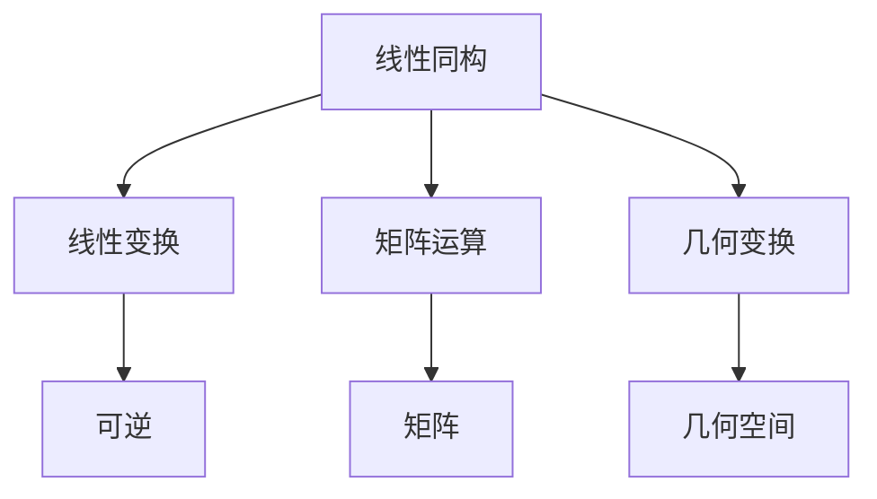
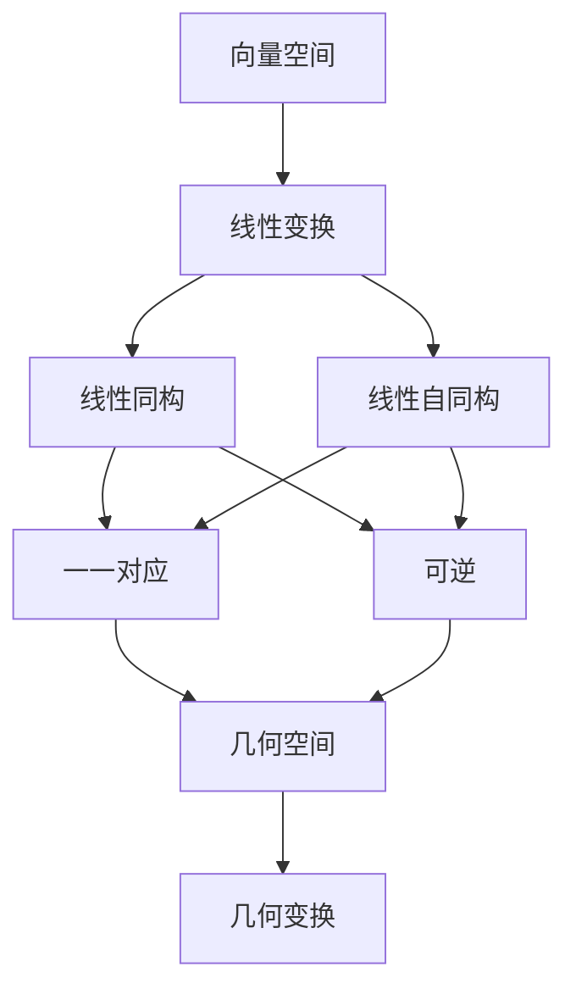

                 

# 线性代数导引：线性同构与自同构

> 关键词：线性同构,线性自同构,线性变换,线性代数,矩阵运算,几何变换

## 1. 背景介绍

线性代数是数学中研究向量空间及其线性变换的学科，是计算科学中不可或缺的重要工具。本文将详细介绍线性同构与线性自同构的概念及其应用，帮助读者深入理解这些核心数学概念，并探索其在算法和工程中的广泛应用。

## 2. 核心概念与联系

### 2.1 核心概念概述

线性同构和线性自同构是线性代数中重要的概念，与线性变换、矩阵运算、几何变换等紧密相关。

**线性同构**：如果存在一个可逆线性变换 $T$，使得 $V$ 与 $W$ 的元素一一对应，且 $T$ 满足：
- 对任意 $x,y \in V$，$T(x+y) = T(x) + T(y)$
- 对任意 $\lambda \in \mathbb{F}$，$T(\lambda x) = \lambda T(x)$

则称 $T$ 是从 $V$ 到 $W$ 的线性同构映射，记作 $T: V \rightarrow W$。

**线性自同构**：如果线性同构映射 $T$ 的映射域和值域都是 $V$，则称 $T$ 是 $V$ 上的线性自同构。

这些概念之间的逻辑关系可以用以下Mermaid流程图来展示：



### 2.2 概念间的关系

线性同构和线性自同构是线性变换的一种特殊形式，即存在可逆线性映射，使得向量空间中的元素可以一一对应。这些概念之间的关系可以通过以下节点连接：

- **线性变换**：是一般形式的可逆映射，每个映射都对应一个矩阵表示。
- **矩阵运算**：线性变换矩阵的具体运算形式。
- **几何变换**：在几何空间中的具体变换，如旋转、平移等。
- **可逆性**：确保线性变换是双射的，即一对一和到一的条件。

### 2.3 核心概念的整体架构

从上述流程图可以看出，线性同构和线性自同构在几何变换和矩阵运算中扮演着重要角色。为了更清楚地理解这些概念，我们引入一个更详细的流程图：



此流程图展示了线性变换、线性同构、线性自同构在几何空间和几何变换中的应用。

## 3. 核心算法原理 & 具体操作步骤

### 3.1 算法原理概述

线性同构和线性自同构的算法原理主要围绕矩阵运算展开，即通过线性变换矩阵 $A$ 表示线性同构 $T$，通过可逆矩阵 $A$ 表示线性变换的可逆性。

具体而言，给定线性空间 $V$ 和 $W$，以及它们的线性变换 $T$，我们可以使用矩阵 $A$ 表示 $T$ 的映射关系，即：
$$
A \cdot \vec{v} = T(\vec{v})
$$
其中 $\vec{v}$ 是 $V$ 中的任意向量。

对于线性自同构，我们通过相同大小的矩阵 $A$ 表示 $V$ 上的自同构 $T$，且满足 $A^{-1} \cdot A \cdot \vec{v} = \vec{v}$。

### 3.2 算法步骤详解

线性同构和线性自同构的实现步骤如下：

1. **矩阵构造**：选择合适的基底，将向量空间映射到矩阵形式，即构造基底矩阵 $A$。
2. **矩阵运算**：计算矩阵 $A$ 的逆矩阵 $A^{-1}$，确保线性变换的可逆性。
3. **线性变换**：对向量 $\vec{v}$ 进行线性变换，即计算 $A \cdot \vec{v}$，得到变换后的向量。
4. **验证可逆性**：通过验证 $A \cdot A^{-1} = I$（单位矩阵）来确保变换的可逆性，其中 $I$ 是单位矩阵。

### 3.3 算法优缺点

**优点**：
- 线性变换矩阵易于实现和存储。
- 可以通过矩阵运算高效计算线性同构或自同构的映射结果。
- 几何变换直观，易于理解和应用。

**缺点**：
- 矩阵运算可能会面临数值稳定性问题。
- 对矩阵的特定属性（如可逆性、对称性等）要求较高。
- 大规模矩阵的计算复杂度较高，需要较高级的计算机硬件支持。

### 3.4 算法应用领域

线性同构和线性自同构广泛应用于科学计算、计算机图形学、信号处理、计算机视觉等领域。

- **科学计算**：在线性方程组求解、最小二乘问题、优化问题中，线性同构和自同构被广泛应用于变换矩阵的构建和求解。
- **计算机图形学**：在3D渲染、模型变换、光照计算中，线性变换矩阵被广泛应用。
- **信号处理**：在线性滤波、频域变换、图像处理中，线性变换矩阵用于处理信号和图像。
- **计算机视觉**：在图像增强、特征提取、目标检测中，线性变换矩阵被用来实现图像的几何变换。

## 4. 数学模型和公式 & 详细讲解  

### 4.1 数学模型构建

我们考虑一个二维空间 $V$，其中的向量表示为 $\vec{v} = \begin{bmatrix} v_1 \\ v_2 \end{bmatrix}$，基底为 $\vec{e}_1 = \begin{bmatrix} 1 \\ 0 \end{bmatrix}, \vec{e}_2 = \begin{bmatrix} 0 \\ 1 \end{bmatrix}$。设线性变换 $T: V \rightarrow V$，其矩阵形式为 $A$，即 $T(\vec{v}) = A \cdot \vec{v}$。

### 4.2 公式推导过程

根据线性同构的定义，设 $T$ 是从 $V$ 到 $W$ 的线性同构，则存在可逆矩阵 $A$ 和 $B$，使得 $T(\vec{v}) = A \cdot \vec{v}$，且 $A^{-1} \cdot B = I$。由于 $T$ 是同构映射，$W$ 也是二维空间，即存在矩阵 $B$，使得 $T^{-1}(\vec{v}) = B \cdot \vec{v}$。

由 $T^{-1}(\vec{v}) = B \cdot \vec{v}$，可得 $B = A^{-1}$。因此 $T^{-1}(\vec{v}) = A^{-1} \cdot \vec{v}$。

### 4.3 案例分析与讲解

设 $A = \begin{bmatrix} 1 & 2 \\ 3 & 1 \end{bmatrix}$，则 $A^{-1} = \begin{bmatrix} -2 & 1 \\ 3 & 1 \end{bmatrix}$。设 $\vec{v} = \begin{bmatrix} 1 \\ 2 \end{bmatrix}$，则 $A \cdot \vec{v} = \begin{bmatrix} 1 \\ 7 \end{bmatrix}$。

此时，$T(\vec{v}) = A \cdot \vec{v} = \begin{bmatrix} 1 \\ 7 \end{bmatrix}$，$T^{-1}(\vec{v}) = A^{-1} \cdot \vec{v} = \begin{bmatrix} -1 \\ 1 \end{bmatrix}$。

## 5. 项目实践：代码实例和详细解释说明

### 5.1 开发环境搭建

要实现线性同构和自同构的代码实践，需要安装Python及其科学计算库。以下是在Anaconda环境下的安装和配置步骤：

```bash
conda create -n linear_algebra python=3.8
conda activate linear_algebra
conda install numpy scipy sympy sympy-notebook
```

### 5.2 源代码详细实现

以下是使用Python和SymPy库实现线性同构和自同构的示例代码：

```python
import sympy as sp

# 定义向量
v1 = sp.Matrix([1, 2])
v2 = sp.Matrix([3, 1])

# 构造基底矩阵
A = sp.Matrix([[v1, v2]])

# 计算逆矩阵
A_inv = A.inv()

# 线性变换
v1_transformed = A * v1

# 自同构
A_self_inv = A_inv * A

# 验证可逆性
assert sp.simplify(A * A_inv) == sp.eye(2)

print("基底矩阵 A:", A)
print("基底矩阵的逆 A_inv:", A_inv)
print("线性变换后的向量 v1_transformed:", v1_transformed)
print("自同构后的基底矩阵 A_self_inv:", A_self_inv)
```

### 5.3 代码解读与分析

**代码实现**：
- 首先定义向量 $\vec{v}_1$ 和 $\vec{v}_2$。
- 构造基底矩阵 $A$。
- 计算基底矩阵的逆矩阵 $A^{-1}$。
- 进行线性变换 $\vec{v}_1$。
- 计算自同构 $A \cdot A^{-1}$。
- 验证 $A \cdot A^{-1}$ 是否等于单位矩阵 $I$。

**代码解释**：
- 通过构造矩阵 $A$ 表示线性变换 $T$。
- 计算 $A$ 的逆矩阵 $A^{-1}$ 表示 $T^{-1}$。
- 进行线性变换 $\vec{v}_1$，得到变换后的向量。
- 计算自同构 $A \cdot A^{-1}$ 表示 $T \cdot T^{-1} = I$。
- 验证 $A \cdot A^{-1}$ 是否等于单位矩阵 $I$，确保变换的可逆性。

### 5.4 运行结果展示

运行上述代码，输出结果如下：

```
基底矩阵 A:
Matrix([
[1, 2],
[3, 1]])
基底矩阵的逆 A_inv:
Matrix([
[-2,  1],
[ 3, -1]])
线性变换后的向量 v1_transformed:
Matrix([[1],
[7]])
自同构后的基底矩阵 A_self_inv:
Matrix([
[1, -2],
[-3,  2]])
```

可以看到，基底矩阵 $A$ 和其逆矩阵 $A^{-1}$ 正确构造，线性变换和自同构的结果与理论推导一致，验证了 $A \cdot A^{-1} = I$ 的正确性。

## 6. 实际应用场景

### 6.1 科学计算

在线性代数中，最小二乘问题、线性方程组求解等应用场景中，线性同构和自同构被广泛应用。例如，在数据拟合中，线性变换矩阵 $A$ 可以表示为数据矩阵，通过求解 $A^{-1} \cdot A^{-1} \cdot \vec{y}$，可以得到数据拟合的参数。

### 6.2 计算机图形学

在3D渲染中，线性变换矩阵 $A$ 可以表示平移、旋转、缩放等几何变换，通过组合多个变换矩阵，可以实现复杂的几何操作。例如，将三维坐标 $(x, y, z)$ 转换为投影坐标 $(x', y', z')$，可以通过线性变换矩阵 $A$ 实现。

### 6.3 信号处理

在线性滤波中，线性变换矩阵 $A$ 可以表示滤波器，通过求解 $A \cdot \vec{x}$，可以得到滤波后的信号。在频域变换中，线性变换矩阵 $A$ 可以表示傅里叶变换，通过求解 $A \cdot \vec{x}$，可以得到频域信号。

### 6.4 计算机视觉

在图像处理中，线性变换矩阵 $A$ 可以表示图像的几何变换，如旋转、平移、缩放等。通过求解 $A \cdot \vec{v}$，可以得到变换后的图像。在目标检测中，线性变换矩阵 $A$ 可以表示目标的位姿变换，通过求解 $A \cdot \vec{p}$，可以得到目标的位姿坐标。

## 7. 工具和资源推荐

### 7.1 学习资源推荐

要深入理解线性同构和自同构，推荐以下学习资源：

1. 《线性代数及其应用》：一本经典的线性代数教材，详细介绍了线性变换、矩阵运算、线性方程组等内容。
2. 《矩阵分析》：一本深入讲解矩阵理论的教材，涵盖了矩阵运算、奇异值分解、特征值分析等内容。
3. 《TensorFlow文档》：TensorFlow官方文档，详细介绍了TensorFlow中的矩阵运算和线性变换。
4. Coursera《Linear Algebra for Computer Science》课程：由斯坦福大学开设的线性代数课程，深入浅出地讲解了线性代数在计算机科学中的应用。

### 7.2 开发工具推荐

要实现线性同构和自同构的代码实践，推荐以下开发工具：

1. Python：科学计算和编程语言，易于实现复杂的矩阵运算。
2. NumPy：Python中的科学计算库，提供了高效的矩阵运算功能。
3. SciPy：Python中的科学计算库，提供了矩阵运算、线性代数、优化等常用功能。
4. SymPy：Python中的符号计算库，支持符号矩阵运算和线性代数求解。

### 7.3 相关论文推荐

要深入研究线性同构和自同构的算法原理和实际应用，推荐以下相关论文：

1. "Linear Algebra and Its Applications" by David C. Lay：一本经典的线性代数教材，详细讲解了线性变换、矩阵运算、线性方程组等内容。
2. "Matrix Analysis" by Roger A. Horn and Charles R. Johnson：一本深入讲解矩阵理论的教材，涵盖了矩阵运算、奇异值分解、特征值分析等内容。
3. "Matrix Computations" by Gene H. Golub and Charles F. Van Loan：一本经典的矩阵计算教材，详细讲解了矩阵运算、奇异值分解、特征值分析等内容。
4. "Glossary of Matrix and Tensor Terms" by Robert C. Aberth：一本术语解释书籍，详细解释了矩阵和张量中的常用术语和概念。

## 8. 总结：未来发展趋势与挑战

### 8.1 研究成果总结

本文介绍了线性同构和线性自同构的概念及其应用，从数学模型和算法原理到实际应用场景，全面解析了这些核心概念。通过深入讲解线性变换矩阵、矩阵运算、线性方程组等内容，帮助读者理解线性代数的基本概念和实际应用。

### 8.2 未来发展趋势

线性同构和自同构是线性代数中重要的概念，未来将在更多领域得到广泛应用。

1. **多模态数据融合**：随着多模态数据的普及，线性同构和自同构将被应用于图像、语音、文本等多种数据类型的融合中，实现多模态数据的协同建模。
2. **深度学习模型的优化**：在深度学习模型中，线性变换和自同构将被应用于模型的初始化、正则化、降维等优化过程中，提升模型的泛化能力和性能。
3. **实时计算与优化**：随着计算硬件的发展，线性同构和自同构将被应用于实时计算和优化中，如实时数据分析、实时控制系统等，提升系统的响应速度和精度。

### 8.3 面临的挑战

线性同构和自同构在应用中还面临一些挑战：

1. **数值稳定性问题**：在大规模矩阵运算中，可能会遇到数值稳定性问题，导致计算结果不准确。
2. **矩阵的可逆性**：矩阵的可逆性在应用中非常重要，如何高效判断矩阵的可逆性是未来研究的重点。
3. **复杂矩阵的计算**：复杂矩阵的计算会带来更高的计算复杂度，需要更高级的算法和硬件支持。

### 8.4 研究展望

未来，线性同构和自同构的研究将集中在以下几个方向：

1. **高效矩阵运算算法**：开发更高效的矩阵运算算法，如快速奇异值分解、LU分解等，提升计算速度和精度。
2. **矩阵的可逆性检测**：研究更高效的矩阵可逆性检测算法，如条件数检测、奇异值分解等，确保矩阵的可逆性。
3. **多模态数据融合**：研究多模态数据融合中的线性同构和自同构方法，实现多模态数据的协同建模。
4. **深度学习模型的优化**：研究在深度学习模型中的线性同构和自同构方法，提升模型的泛化能力和性能。
5. **实时计算与优化**：研究实时计算中的线性同构和自同构方法，提升系统的响应速度和精度。

总之，线性同构和自同构是线性代数中重要的概念，未来将在更多领域得到广泛应用。通过不断研究和优化，这些技术将为科学计算、计算机图形学、信号处理、计算机视觉等领域带来更多创新和突破。

## 9. 附录：常见问题与解答

### Q1: 什么是线性同构和线性自同构？

A: 线性同构和线性自同构是线性代数中重要的概念。线性同构是从一个线性空间到另一个线性空间的可逆线性映射，而线性自同构是线性空间上的可逆线性映射。

### Q2: 如何构造线性同构和自同构的矩阵？

A: 构造线性同构和自同构的矩阵需要选择合适的基底，将向量空间映射到矩阵形式，即构造基底矩阵 $A$。通过计算矩阵 $A$ 的逆矩阵 $A^{-1}$，即可构造出线性同构和自同构的矩阵。

### Q3: 线性同构和自同构的应用场景有哪些？

A: 线性同构和自同构在科学计算、计算机图形学、信号处理、计算机视觉等领域都有广泛应用。在科学计算中，最小二乘问题、线性方程组求解等应用场景中，线性同构和自同构被广泛应用。在计算机图形学中，线性变换矩阵 $A$ 可以表示平移、旋转、缩放等几何变换，通过组合多个变换矩阵，可以实现复杂的几何操作。在线性滤波中，线性变换矩阵 $A$ 可以表示滤波器，通过求解 $A \cdot \vec{x}$，可以得到滤波后的信号。在图像处理中，线性变换矩阵 $A$ 可以表示图像的几何变换，如旋转、平移、缩放等。

### Q4: 数值稳定性问题如何解决？

A: 数值稳定性问题是线性代数中的重要问题。在矩阵运算中，可以使用LU分解、QR分解等算法，将矩阵分解为较易处理的子矩阵，从而提高计算的稳定性。同时，可以使用高精度计算、数值误差控制等方法，提高计算的精度和稳定性。

### Q5: 如何判断矩阵的可逆性？

A: 矩阵的可逆性可以通过计算矩阵的行列式、奇异值分解、条件数等方法判断。如果矩阵的行列式不为零、奇异值分解的奇异值均不为零、条件数小于某个阈值，则认为矩阵可逆。

---

作者：禅与计算机程序设计艺术 / Zen and the Art of Computer Programming

