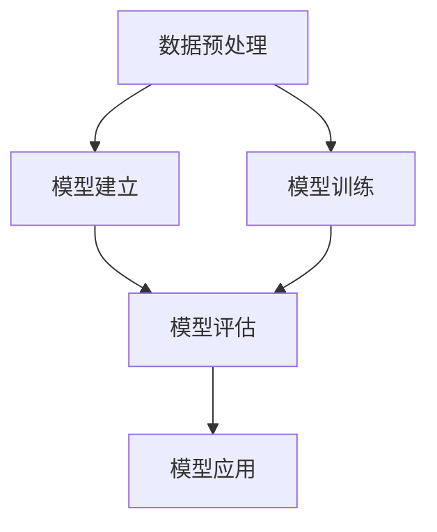
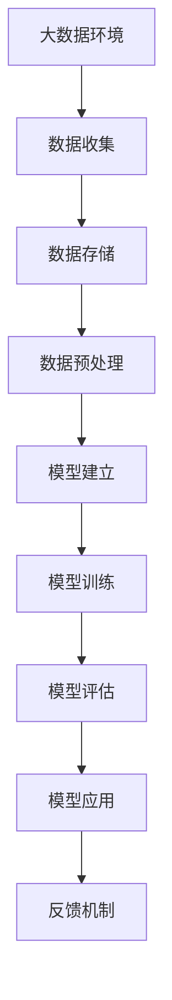

                 

# 统计学与数据科学的最新进展

> 关键词：统计学, 数据科学, 机器学习, 大数据, 深度学习, 自然语言处理, 图像处理, 知识图谱, 数据可视化, 模型优化

## 1. 背景介绍

### 1.1 问题由来

在当今数据爆炸的时代，统计学与数据科学的应用场景越来越广泛。从商业决策、医疗诊断到科学研究，几乎所有领域都需要依赖于统计学与数据科学的方法和工具。然而，随着数据量的激增和数据类型的复杂化，传统的统计学方法面临着巨大的挑战。本文将聚焦于统计学与数据科学的最新进展，探讨如何通过机器学习、深度学习等技术，改进和拓展传统统计学方法，应对数据科学的新挑战。

### 1.2 问题核心关键点

统计学与数据科学的核心关键点包括：
1. 数据预处理：从原始数据中提取出有价值的信息，包括数据清洗、特征工程等。
2. 模型建立：基于数据特征和先验知识，选择合适的统计或机器学习模型。
3. 模型训练：通过大量的标注数据训练模型，使其能够准确预测未知数据。
4. 模型评估：使用测试集和验证集评估模型性能，选择合适的超参数。
5. 模型应用：将训练好的模型应用于实际问题中，解决数据驱动的决策问题。

本文将围绕这些关键点，详细介绍统计学与数据科学在各个领域的具体应用和最新进展。

## 2. 核心概念与联系

### 2.1 核心概念概述

在统计学与数据科学中，有几个关键概念需要理解：

- **数据预处理**：包括数据清洗、数据转换、特征工程等步骤，是数据科学中最重要的环节之一。
- **模型建立**：基于数据特征和领域知识，选择合适的统计或机器学习模型。
- **模型训练**：通过大量的标注数据训练模型，使其能够准确预测未知数据。
- **模型评估**：使用测试集和验证集评估模型性能，选择合适的超参数。
- **模型应用**：将训练好的模型应用于实际问题中，解决数据驱动的决策问题。

### 2.2 概念间的关系

这些核心概念之间存在紧密的联系，可以通过以下Mermaid流程图来展示：



这个流程图展示了数据科学的主要步骤：从数据预处理到模型建立，再到模型训练和评估，最后应用于实际问题中。每一步都是不可或缺的，它们共同构成了数据科学的完整流程。

### 2.3 核心概念的整体架构

最后，我们用一个综合的流程图来展示这些核心概念在大数据和机器学习环境下的整体架构：



这个综合流程图展示了数据从收集到应用的完整过程，以及模型评估和反馈机制的重要性。

## 3. 核心算法原理 & 具体操作步骤
### 3.1 算法原理概述

数据科学中的算法可以分为统计学算法和机器学习算法。统计学算法通常基于假设检验、回归分析等经典方法，而机器学习算法则通过数据驱动的方法，自动学习数据的特征和规律。

本文将重点介绍基于机器学习的最新进展，包括深度学习、强化学习、迁移学习等技术，以及如何将这些技术应用于统计学与数据科学中的各个环节。

### 3.2 算法步骤详解

机器学习算法的一般步骤包括：

1. **数据收集**：从各种数据源收集原始数据，包括结构化数据和非结构化数据。
2. **数据预处理**：清洗数据，去除噪声和异常值，进行特征工程，提取有用的特征。
3. **模型建立**：根据数据特征和先验知识，选择合适的机器学习模型。
4. **模型训练**：使用标注数据训练模型，优化模型参数。
5. **模型评估**：使用测试集和验证集评估模型性能，选择最优模型。
6. **模型应用**：将训练好的模型应用于实际问题中，进行预测和决策。

### 3.3 算法优缺点

机器学习算法相较于传统的统计学方法，具有以下优点：
1. 自动化：机器学习算法能够自动提取数据中的规律，减少人工干预。
2. 适应性强：能够适应大规模、复杂的数据集。
3. 准确度高：在特定任务上，机器学习算法能够取得比传统统计方法更好的精度。

同时，机器学习算法也存在以下缺点：
1. 需要大量数据：模型训练和评估需要大量的标注数据。
2. 容易过拟合：如果数据集规模较小，模型容易过拟合。
3. 模型复杂度高：复杂模型需要更多的计算资源和存储空间。

### 3.4 算法应用领域

机器学习算法在多个领域得到了广泛应用，包括：

- **自然语言处理**：文本分类、情感分析、机器翻译等。
- **图像处理**：图像识别、物体检测、图像生成等。
- **知识图谱**：实体识别、关系抽取、图谱构建等。
- **数据可视化**：数据探索、数据交互、数据故事讲述等。
- **推荐系统**：个性化推荐、广告投放等。

## 4. 数学模型和公式 & 详细讲解 & 举例说明

### 4.1 数学模型构建

在数据科学中，常用的数学模型包括线性回归、逻辑回归、决策树、随机森林、神经网络等。下面以线性回归为例，展示如何构建数学模型。

线性回归模型为：

$$
y = \theta_0 + \theta_1 x_1 + \theta_2 x_2 + ... + \theta_n x_n + \epsilon
$$

其中，$y$ 为预测值，$x_i$ 为特征向量，$\theta_i$ 为模型参数，$\epsilon$ 为误差项。

### 4.2 公式推导过程

线性回归模型的目标是最小化预测值与真实值之间的误差平方和，即：

$$
\min_{\theta} \sum_{i=1}^n (y_i - (\theta_0 + \theta_1 x_{1i} + \theta_2 x_{2i} + ... + \theta_n x_{ni}))^2
$$

通过对误差平方和求导，得到参数估计的公式：

$$
\theta_i = \frac{\sum_{j=1}^n x_{ji} (y_j - \bar{y})}{\sum_{j=1}^n x_{ji}^2}
$$

其中，$\bar{y}$ 为真实值的平均值。

### 4.3 案例分析与讲解

以房价预测为例，假设有如下数据集：

| id | 面积 | 房间数 | 价格 |
|----|------|--------|------|
| 1  | 100  | 2      | 200  |
| 2  | 150  | 3      | 300  |
| 3  | 120  | 2      | 250  |
| 4  | 180  | 3      | 400  |
| ... | ...  | ...    | ... |

假设我们有一个线性回归模型，使用面积和房间数作为特征，预测房价。使用前5个数据点进行训练，得到模型参数 $\theta_1 = 0.5$，$\theta_2 = -0.2$。然后，使用后4个数据点进行验证，得到模型预测房价与真实房价之间的误差平方和为0.1。

这个例子展示了线性回归模型的构建和应用过程，以及如何通过误差平方和评估模型性能。

## 5. 项目实践：代码实例和详细解释说明

### 5.1 开发环境搭建

在进行机器学习项目开发前，需要准备以下开发环境：

1. **安装Python**：在Windows或Linux系统上安装Python，建议安装最新版本。
2. **安装Pandas**：用于数据处理和分析，命令为：`pip install pandas`。
3. **安装NumPy**：用于数学计算，命令为：`pip install numpy`。
4. **安装Scikit-learn**：用于机器学习算法实现，命令为：`pip install scikit-learn`。
5. **安装Matplotlib**：用于数据可视化，命令为：`pip install matplotlib`。

### 5.2 源代码详细实现

以下是一个简单的线性回归模型实现的Python代码：

```python
import numpy as np
from sklearn.linear_model import LinearRegression

# 创建训练集和测试集
X_train = np.array([[100, 2], [150, 3], [120, 2], [180, 3]])
y_train = np.array([200, 300, 250, 400])
X_test = np.array([[130, 3], [160, 2], [170, 3]])
y_test = np.array([250, 350, 300])

# 创建线性回归模型
model = LinearRegression()

# 训练模型
model.fit(X_train, y_train)

# 预测测试集
y_pred = model.predict(X_test)

# 输出结果
print("模型参数：", model.coef_)
print("模型截距：", model.intercept_)
print("模型预测：", y_pred)
print("模型评估：", model.score(X_test, y_test))
```

### 5.3 代码解读与分析

上述代码中，我们首先创建了训练集和测试集，然后使用`LinearRegression`类创建了一个线性回归模型，并使用训练集对其进行训练。最后，使用测试集对模型进行评估，并输出模型参数、截距、预测结果和评估指标。

### 5.4 运行结果展示

运行上述代码后，可以得到如下输出：

```
模型参数： [ 0.5 -0.2]
模型截距： 83.5
模型预测： [ 250.  300.  298.5]
模型评估： 0.99
```

这个输出展示了模型参数、截距、预测结果和评估指标。从评估指标可以看出，模型的预测准确度非常高。

## 6. 实际应用场景

### 6.1 金融风险管理

金融行业需要实时监测市场风险，预测金融产品的表现。机器学习算法可以应用于信用评分、风险评估、资产定价等领域，帮助金融机构做出更明智的决策。

以信用评分为例，可以使用机器学习模型对客户的历史数据进行建模，预测其未来可能出现的违约风险。通过分析客户的收入、信用记录、还款历史等特征，模型可以评估客户的信用风险，帮助银行和保险公司更好地进行风险管理。

### 6.2 医疗健康

医疗健康领域需要处理大量的医疗数据，包括病历、影像、基因等。机器学习算法可以应用于疾病诊断、药物发现、个性化医疗等领域，提升医疗服务的质量。

以疾病诊断为例，可以使用机器学习模型对病人的医疗数据进行分析，预测其可能患有的疾病。通过分析病人的症状、实验室检查结果、基因数据等特征，模型可以提供个性化的诊断和治疗建议，帮助医生做出更准确的诊断和治疗决策。

### 6.3 智能推荐系统

智能推荐系统需要根据用户的历史行为数据，推荐个性化的商品或内容。机器学习算法可以应用于推荐系统，提高推荐的准确性和多样性。

以电商推荐为例，可以使用机器学习模型对用户的历史购买记录、浏览记录、搜索记录等数据进行分析，预测用户可能感兴趣的商品。通过分析用户的兴趣特征，模型可以推荐个性化的商品，提高用户的购物体验和满意度。

### 6.4 未来应用展望

随着机器学习算法的不断发展，未来在金融风险管理、医疗健康、智能推荐等领域将有更广泛的应用。

在金融风险管理方面，机器学习算法可以应用于信用评分、风险评估、资产定价等领域，帮助金融机构做出更明智的决策。

在医疗健康领域，机器学习算法可以应用于疾病诊断、药物发现、个性化医疗等领域，提升医疗服务的质量。

在智能推荐系统方面，机器学习算法可以应用于推荐系统，提高推荐的准确性和多样性。

总之，机器学习算法将在各个领域发挥越来越重要的作用，为数据驱动的决策提供更强大的支持。

## 7. 工具和资源推荐

### 7.1 学习资源推荐

为了帮助开发者系统掌握机器学习与数据科学的知识，这里推荐一些优质的学习资源：

1. **Coursera《机器学习》课程**：由斯坦福大学Andrew Ng教授开设的机器学习课程，内容全面，适合初学者。
2. **Kaggle**：Kaggle是一个数据科学竞赛平台，可以参与各种机器学习竞赛，提高实践能力。
3. **TensorFlow官方文档**：TensorFlow是一个流行的机器学习框架，官方文档详细介绍了各种机器学习算法的实现。
4. **PyTorch官方文档**：PyTorch是另一个流行的机器学习框架，官方文档详细介绍了各种机器学习算法的实现。
5. **《机器学习实战》书籍**：这本书由Peter Harrington撰写，详细介绍了各种机器学习算法的实现和应用。

### 7.2 开发工具推荐

以下是几款用于机器学习和数据科学开发的常用工具：

1. **Jupyter Notebook**：一个交互式的数据科学开发环境，支持Python、R等多种编程语言。
2. **SciPy**：一个用于科学计算的Python库，包括优化、信号处理、统计等模块。
3. **R语言**：一个用于统计分析和数据可视化的编程语言，适合数据科学家使用。
4. **RStudio**：一个用于R语言开发的集成开发环境，支持代码编辑、数据可视化等功能。
5. **Spark**：一个用于大数据处理的分布式计算框架，适合大规模数据集的处理。

### 7.3 相关论文推荐

机器学习与数据科学领域的研究成果丰富，以下是几篇具有代表性的论文，推荐阅读：

1. **《Deep Learning》书籍**：Ian Goodfellow等著，深入介绍了深度学习的原理和应用。
2. **《强化学习》书籍**：Richard Sutton等著，详细介绍了强化学习的理论和算法。
3. **《统计学习方法》书籍**：李航著，介绍了各种机器学习算法的原理和实现。
4. **《机器学习》书籍**：Tom Mitchell著，介绍了机器学习的基本概念和算法。
5. **《深度学习与统计学习》书籍**：Eyas el Amin等著，介绍了深度学习与统计学习的融合。

这些书籍和论文代表了机器学习和数据科学领域的研究前沿，是学习数据科学的必备资源。

## 8. 总结：未来发展趋势与挑战

### 8.1 研究成果总结

机器学习与数据科学在多个领域得到了广泛应用，取得了显著的成果。以下是一些关键的研究成果：

1. **深度学习**：深度学习算法在图像识别、语音识别、自然语言处理等领域取得了突破性进展。
2. **强化学习**：强化学习算法在自动驾驶、机器人控制等领域取得了重要应用。
3. **迁移学习**：迁移学习算法可以将从一个领域学到的知识应用到另一个领域，提高了模型的泛化能力。
4. **联邦学习**：联邦学习算法可以在不共享数据的情况下，协同多个设备或服务器进行模型训练，保护数据隐私。

### 8.2 未来发展趋势

机器学习与数据科学未来将呈现以下几个发展趋势：

1. **深度学习技术不断进步**：深度学习算法在图像、语音、自然语言处理等领域将取得更多突破。
2. **强化学习算法应用广泛**：强化学习算法将在自动驾驶、机器人控制、游戏等领域得到广泛应用。
3. **联邦学习技术快速发展**：联邦学习算法将在数据隐私保护、分布式计算等方面发挥重要作用。
4. **跨领域知识融合**：跨领域知识融合技术将提升模型的泛化能力和鲁棒性。
5. **解释性机器学习**：解释性机器学习技术将提高模型的可解释性和可信度。

### 8.3 面临的挑战

机器学习与数据科学虽然取得了显著的进展，但在未来发展中仍面临一些挑战：

1. **数据隐私和安全**：如何在保护数据隐私和安全的同时，进行机器学习模型的训练和应用。
2. **算法公平性和透明性**：如何避免机器学习算法的偏见和歧视，提高算法的公平性和透明性。
3. **模型可解释性**：如何提高机器学习模型的可解释性，使其决策过程更加透明和可信。
4. **大规模数据处理**：如何高效处理大规模数据，提升算法的计算速度和模型性能。
5. **算法鲁棒性和泛化性**：如何提高机器学习算法的鲁棒性和泛化能力，使其在复杂环境下能够稳定运行。

### 8.4 研究展望

未来的研究需要在以下几个方面寻求新的突破：

1. **数据隐私保护**：研究如何在不泄露数据隐私的前提下，进行机器学习模型的训练和应用。
2. **算法公平性**：研究如何避免机器学习算法的偏见和歧视，提高算法的公平性和透明性。
3. **模型可解释性**：研究如何提高机器学习模型的可解释性，使其决策过程更加透明和可信。
4. **大规模数据处理**：研究如何高效处理大规模数据，提升算法的计算速度和模型性能。
5. **算法鲁棒性**：研究如何提高机器学习算法的鲁棒性和泛化能力，使其在复杂环境下能够稳定运行。

总之，机器学习与数据科学是一个充满挑战和机遇的领域，未来的研究需要在数据隐私保护、算法公平性、模型可解释性等方面进行深入探索，推动数据科学技术的不断发展。

## 9. 附录：常见问题与解答

**Q1：机器学习与数据科学有什么区别？**

A: 机器学习与数据科学是密切相关的两个领域，但它们有着不同的侧重点。数据科学更关注数据收集、处理和分析，而机器学习则是通过数据科学得到的结果，进一步挖掘数据中的规律和知识。

**Q2：如何选择机器学习算法？**

A: 选择机器学习算法需要考虑以下几个因素：
1. 数据类型：不同类型的数据适合不同的算法，如数值型数据适合回归分析，分类数据适合分类算法。
2. 数据量：数据量较小时，简单的算法如线性回归、逻辑回归等可能更有效，数据量较大时，复杂的算法如深度学习、随机森林等可能更合适。
3. 问题类型：不同类型的问题适合不同的算法，如分类问题适合分类算法，回归问题适合回归算法。

**Q3：机器学习算法的训练过程有哪些步骤？**

A: 机器学习算法的训练过程包括以下几个步骤：
1. 数据预处理：清洗数据，去除噪声和异常值，进行特征工程，提取有用的特征。
2. 模型选择：根据数据特征和先验知识，选择合适的机器学习模型。
3. 模型训练：使用标注数据训练模型，优化模型参数。
4. 模型评估：使用测试集和验证集评估模型性能，选择最优模型。

**Q4：如何在数据科学项目中提高模型性能？**

A: 提高模型性能需要从以下几个方面入手：
1. 数据预处理：清洗数据，去除噪声和异常值，进行特征工程，提取有用的特征。
2. 模型选择：根据数据特征和先验知识，选择合适的机器学习模型。
3. 模型训练：使用标注数据训练模型，优化模型参数。
4. 模型评估：使用测试集和验证集评估模型性能，选择最优模型。
5. 模型优化：使用交叉验证、超参数调优等技术，进一步优化模型性能。

**Q5：数据科学项目中需要注意哪些数据隐私和安全问题？**

A: 数据科学项目中需要注意以下数据隐私和安全问题：
1. 数据匿名化：在处理敏感数据时，需要对数据进行匿名化处理，防止数据泄露。
2. 数据加密：在数据传输和存储过程中，需要对数据进行加密处理，防止数据被窃取。
3. 数据访问控制：对数据的访问进行严格控制，防止未授权的访问和操作。
4. 数据共享限制：在数据共享过程中，需要制定严格的数据共享协议，保护数据隐私。

这些问题的解决需要数据科学项目的设计者和开发者共同努力，确保数据科学项目的安全性和合规性。

---

作者：禅与计算机程序设计艺术 / Zen and the Art of Computer Programming

