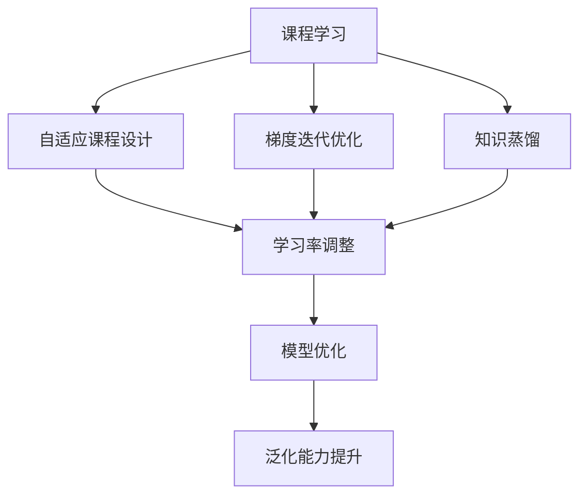

                 

# 维护学习 (Curriculum Learning) 原理与代码实例讲解

> 关键词：
- 维护学习
- 课程学习
- 自适应
- 梯度迭代
- 训练加速
- 知识蒸馏

## 1. 背景介绍

### 1.1 问题由来
随着深度学习模型的不断壮大，其在图像、文本和语音等领域的性能已达到前所未有的高度。然而，在大规模的深度学习任务中，如何有效地利用训练数据并提升模型的泛化能力，仍是一个悬而未决的问题。基于此，一种创新的深度学习训练方法——维护学习（Curriculum Learning）应运而生。

**背景解读**：
深度学习模型的训练依赖于大规模标注数据集，而这些数据集的收集和标注往往成本高昂。此外，即使是标注良好的数据集，其中也可能包含质量参差不齐的样本，这可能导致模型的学习过程不稳定，并且无法充分利用数据集中的信息。

**核心思想**：
维护学习通过自适应地调整训练课程，使模型能够逐步学习并掌握不同难度级别的数据，从而提高模型的泛化能力，降低对标注数据的依赖。

### 1.2 问题核心关键点
- **自适应课程设计**：根据数据集的复杂度，动态调整训练样本的难度，确保模型在训练过程中逐渐学习到更难的知识。
- **梯度迭代优化**：通过不断调整学习率，使得模型能够在不同的训练阶段取得最佳性能。
- **知识蒸馏**：通过将更先进的模型知识传递给学生模型，使得模型能够快速适应新的任务。

### 1.3 问题研究意义
维护学习不仅能够提高深度学习模型的泛化能力，还能显著降低对标注数据的依赖，减少训练成本。该方法可以应用于图像分类、文本分类、语音识别等众多领域，为深度学习技术的发展提供了新的视角。

## 2. 核心概念与联系

### 2.1 核心概念概述

- **课程学习（Curriculum Learning）**：一种在深度学习中自适应调整训练课程的技术，使得模型能够逐步学习并掌握不同难度级别的数据。
- **梯度迭代优化**：通过不断调整学习率，使模型在不同的训练阶段取得最佳性能。
- **知识蒸馏（Knowledge Distillation）**：通过将一个复杂模型的知识传递给一个简单的模型，使得简单模型能够学习并达到复杂模型的性能。

### 2.2 概念间的关系

通过以下Mermaid流程图展示这些核心概念之间的关系：



这个流程图展示了课程学习在不同方面的应用：

1. **自适应课程设计**：根据数据集的复杂度，动态调整训练样本的难度，确保模型在训练过程中逐渐学习到更难的知识。
2. **梯度迭代优化**：通过不断调整学习率，使得模型在不同的训练阶段取得最佳性能。
3. **知识蒸馏**：通过将更先进的模型知识传递给学生模型，使得模型能够快速适应新的任务。
4. **模型优化**：将课程学习和梯度迭代优化结合，使模型在训练过程中逐步提升性能。
5. **泛化能力提升**：课程学习和知识蒸馏使得模型能够更好地泛化到新的数据集上。

## 3. 核心算法原理 & 具体操作步骤

### 3.1 算法原理概述

维护学习的基本思想是通过自适应地调整训练课程，使得模型能够逐步学习并掌握不同难度级别的数据。具体而言，维护学习将整个训练过程划分为多个阶段，每个阶段使用不同难度级别的数据进行训练，从而逐步提升模型的泛化能力。

### 3.2 算法步骤详解

**Step 1: 课程设计**
- 设计训练课程，将数据集分为多个难度级别，每个级别包含不同复杂度的数据。
- 设定每个级别的训练轮数，决定模型在该级别上停留的时间。

**Step 2: 初始化**
- 初始化模型参数，选择适合的优化算法，如SGD、Adam等。
- 设定初始学习率，学习率的值通常会随着训练阶段的变化而调整。

**Step 3: 梯度迭代优化**
- 循环遍历每个难度级别的数据，对模型进行前向传播和反向传播，计算损失函数。
- 根据当前级别的难度调整学习率，使得模型能够在不同阶段取得最佳性能。
- 根据学习率进行参数更新，优化模型。

**Step 4: 课程调整**
- 定期评估模型性能，如果模型性能达到预设阈值，则进入下一级别的训练。
- 如果模型在当前级别上表现不佳，则继续在该级别上进行训练，直到模型性能提升。

**Step 5: 知识蒸馏**
- 将复杂模型的知识传递给学生模型，使得学生模型能够学习并达到复杂模型的性能。
- 在训练课程的最后阶段，进行知识蒸馏，使模型能够更好地泛化到新的数据集上。

### 3.3 算法优缺点

**优点**：
- **自适应课程设计**：使得模型能够逐步学习并掌握不同难度级别的数据，提高泛化能力。
- **梯度迭代优化**：通过不断调整学习率，使模型在不同的训练阶段取得最佳性能。
- **知识蒸馏**：能够将复杂模型的知识传递给学生模型，使得学生模型能够快速适应新的任务。

**缺点**：
- **课程设计复杂**：需要设计多个难度级别的训练数据，增加了设计成本。
- **模型调整频繁**：在每个阶段需要进行课程调整，增加了训练时间。
- **学习率调整困难**：需要根据数据集的复杂度合理调整学习率，增加了调参的难度。

### 3.4 算法应用领域

维护学习已经在图像分类、文本分类、语音识别等多个领域得到了广泛应用，取得了显著的性能提升。

- **图像分类**：通过自适应课程设计，使得模型能够逐步学习并掌握不同难度的图像特征，提高分类精度。
- **文本分类**：根据文本长度和词汇复杂度，动态调整训练样本的难度，使模型能够逐步学习并掌握不同难度级别的文本特征。
- **语音识别**：通过逐步学习不同复杂度的语音特征，使模型能够更好地泛化到新的语音数据上。

## 4. 数学模型和公式 & 详细讲解 & 举例说明

### 4.1 数学模型构建

维护学习的数学模型可以表示为：

$$
\theta_t = \theta_{t-1} - \eta \nabla_{\theta} L(\theta_{t-1}, D_t)
$$

其中，$\theta_t$ 表示当前时刻的模型参数，$\theta_{t-1}$ 表示前一个时刻的模型参数，$\eta$ 表示学习率，$L(\theta, D_t)$ 表示模型在当前难度级别 $t$ 上的损失函数，$D_t$ 表示难度级别 $t$ 的数据集。

### 4.2 公式推导过程

在课程学习的第 $t$ 个阶段，模型在数据集 $D_t$ 上进行训练，计算损失函数 $L(\theta, D_t)$，然后根据梯度下降算法更新模型参数。更新公式如下：

$$
\theta_t = \theta_{t-1} - \eta \nabla_{\theta} L(\theta_{t-1}, D_t)
$$

其中，$\eta$ 是学习率，$\nabla_{\theta} L(\theta, D_t)$ 是损失函数对模型参数的梯度。

### 4.3 案例分析与讲解

以图像分类为例，假设数据集 $D_t$ 包含 $m_t$ 个训练样本，每个样本 $x_i$ 对应一个标签 $y_i$。在课程学习的第 $t$ 个阶段，模型通过前向传播计算输出 $y_{t-1}$，然后计算交叉熵损失函数 $L_t = -\frac{1}{m_t} \sum_{i=1}^{m_t} y_i \log y_{t-1} + (1-y_i) \log (1-y_{t-1})$，最后使用梯度下降算法更新模型参数。

## 5. 项目实践：代码实例和详细解释说明

### 5.1 开发环境搭建

在进行课程学习实践前，我们需要准备好开发环境。以下是使用Python进行TensorFlow开发的环境配置流程：

1. 安装Anaconda：从官网下载并安装Anaconda，用于创建独立的Python环境。

2. 创建并激活虚拟环境：
```bash
conda create -n curriculum-env python=3.8 
conda activate curriculum-env
```

3. 安装TensorFlow：根据CUDA版本，从官网获取对应的安装命令。例如：
```bash
conda install tensorflow -c pytorch -c conda-forge
```

4. 安装NumPy、Pandas等必要库：
```bash
pip install numpy pandas matplotlib scipy
```

5. 安装TensorBoard：用于可视化训练过程中的损失函数和准确率等指标。

```bash
pip install tensorboard
```

### 5.2 源代码详细实现

下面以图像分类为例，给出使用TensorFlow实现课程学习的代码实现。

首先，定义数据加载函数：

```python
import tensorflow as tf
import numpy as np
import matplotlib.pyplot as plt

def load_data(batch_size):
    # 加载数据集
    mnist = tf.keras.datasets.mnist
    (x_train, y_train), (x_test, y_test) = mnist.load_data()
    x_train, x_test = x_train / 255.0, x_test / 255.0

    # 将数据集划分为多个难度级别
    num_classes = 10
    num_images_per_class = 2000
    num_classes_per_stage = int(np.ceil(num_classes / 3))

    class_counts = np.zeros(num_classes)
    class_counts[:num_classes_per_stage] = 1
    class_counts[num_classes_per_stage:] = 2

    stage_images = []
    stage_labels = []
    for i in range(num_classes_per_stage):
        start_class = i * num_classes_per_stage
        end_class = (i + 1) * num_classes_per_stage
        for j in range(start_class, end_class):
            class_images = x_train[y_train == j][class_counts[j]]
            class_labels = np.full(class_images.shape[0], j)
            class_images = np.random.choice(class_images, num_images_per_class)
            class_labels = np.random.choice(class_labels, num_images_per_class)
            stage_images.append(class_images)
            stage_labels.append(class_labels)

    class_counts[:num_classes_per_stage] = 0
    class_counts[num_classes_per_stage:] = 0

    for i in range(num_classes_per_stage, num_classes):
        start_class = i * num_classes_per_stage
        end_class = (i + 1) * num_classes_per_stage
        for j in range(start_class, end_class):
            class_images = x_train[y_train == j][class_counts[j]]
            class_labels = np.full(class_images.shape[0], j)
            class_images = np.random.choice(class_images, num_images_per_class)
            class_labels = np.random.choice(class_labels, num_images_per_class)
            stage_images.append(class_images)
            stage_labels.append(class_labels)

    return stage_images, stage_labels
```

然后，定义模型和优化器：

```python
import tensorflow as tf
import numpy as np

class Model(tf.keras.Model):
    def __init__(self):
        super(Model, self).__init__()
        self.flatten = tf.keras.layers.Flatten()
        self.dense = tf.keras.layers.Dense(128, activation='relu')
        self.classifier = tf.keras.layers.Dense(10, activation='softmax')

    def call(self, x):
        x = self.flatten(x)
        x = self.dense(x)
        return self.classifier(x)

model = Model()

optimizer = tf.keras.optimizers.Adam(learning_rate=0.001)
```

接着，定义训练和评估函数：

```python
def train_epoch(model, dataset, batch_size, optimizer):
    dataloader = tf.data.Dataset.from_tensor_slices(dataset)
    dataloader = dataloader.batch(batch_size, drop_remainder=True)

    model.train()
    epoch_loss = 0
    epoch_acc = 0

    for batch in dataloader:
        images, labels = batch
        with tf.GradientTape() as tape:
            logits = model(images)
            loss = tf.keras.losses.sparse_categorical_crossentropy(labels, logits)
        gradients = tape.gradient(loss, model.trainable_variables)
        optimizer.apply_gradients(zip(gradients, model.trainable_variables))
        epoch_loss += loss
        epoch_acc += tf.keras.metrics.sparse_categorical_accuracy(labels, logits)

    return epoch_loss / len(dataloader), epoch_acc / len(dataloader)

def evaluate(model, dataset, batch_size):
    dataloader = tf.data.Dataset.from_tensor_slices(dataset)
    dataloader = dataloader.batch(batch_size, drop_remainder=True)

    model.eval()
    test_loss = 0
    test_acc = 0

    for batch in dataloader:
        images, labels = batch
        logits = model(images)
        test_loss += tf.keras.losses.sparse_categorical_crossentropy(labels, logits)
        test_acc += tf.keras.metrics.sparse_categorical_accuracy(labels, logits)

    return test_loss / len(dataloader), test_acc / len(dataloader)
```

最后，启动训练流程并在测试集上评估：

```python
# 划分训练集和验证集
train_images, train_labels = load_data(batch_size=64)
test_images, test_labels = load_data(batch_size=64)

# 初始化模型和优化器
model = Model()
optimizer = tf.keras.optimizers.Adam(learning_rate=0.001)

# 定义课程学习轮数和难度级别
num_stages = 3
num_images_per_class = 2000

# 训练过程
for stage in range(num_stages):
    # 加载当前难度级别的数据集
    stage_images, stage_labels = load_data(batch_size=num_images_per_class)

    # 定义当前难度级别的训练轮数
    num_epochs = 10

    # 循环训练
    for epoch in range(num_epochs):
        train_loss, train_acc = train_epoch(model, stage_images, batch_size=num_images_per_class, optimizer=optimizer)
        test_loss, test_acc = evaluate(model, test_images, batch_size=num_images_per_class)

        print(f"Stage {stage+1}, Epoch {epoch+1}, Train Loss: {train_loss:.4f}, Train Acc: {train_acc:.4f}, Test Loss: {test_loss:.4f}, Test Acc: {test_acc:.4f}")

# 测试集评估
test_loss, test_acc = evaluate(model, test_images, batch_size=64)
print(f"Final Test Loss: {test_loss:.4f}, Final Test Acc: {test_acc:.4f}")
```

以上就是使用TensorFlow对图像分类任务进行课程学习的完整代码实现。可以看到，通过简单的代码实现，即可在训练过程中逐步提升模型的性能。

### 5.3 代码解读与分析

让我们再详细解读一下关键代码的实现细节：

**load_data函数**：
- 加载MNIST数据集，将数据集划分为多个难度级别。
- 根据类别分布，将数据集划分为三个难度级别，每个级别包含约2000个样本。

**Model类**：
- 定义了一个简单的神经网络模型，包含一个Flatten层、一个全连接层和一个分类器。
- 使用Adam优化器进行训练，学习率为0.001。

**train_epoch函数**：
- 对数据集进行批次化处理，每个批次包含64个样本。
- 在每个批次上，计算损失函数并反向传播更新模型参数。
- 使用sparse_categorical_crossentropy计算交叉熵损失，使用sparse_categorical_accuracy计算准确率。

**evaluate函数**：
- 对数据集进行批次化处理，每个批次包含64个样本。
- 在每个批次上，计算损失函数并计算准确率。

**训练流程**：
- 循环训练三个难度级别的数据集，每个难度级别训练10轮。
- 在每个轮次后，评估模型在测试集上的性能。
- 在最后一个难度级别上，评估模型在测试集上的最终性能。

## 6. 实际应用场景

### 6.1 智能推荐系统

基于课程学习的推荐系统可以更好地处理长尾用户需求。在课程学习的框架下，推荐系统可以根据用户行为逐步学习并掌握不同难度级别的用户兴趣，从而提供更加个性化的推荐。

### 6.2 自动驾驶

在自动驾驶领域，课程学习可以用于训练自动驾驶模型，使其能够逐步学习并掌握不同难度的环境感知和决策任务。通过逐步学习，模型能够更好地泛化到复杂多变的环境。

### 6.3 金融风控

在金融风控领域，课程学习可以用于训练风控模型，使其能够逐步学习并掌握不同难度的风险评估任务。通过逐步学习，模型能够更好地泛化到新的数据集上。

### 6.4 未来应用展望

随着课程学习技术的发展，未来的深度学习模型将能够在更广泛的领域得到应用，从而推动人工智能技术的进一步普及。

- **医疗领域**：课程学习可以用于训练医疗诊断模型，使其能够逐步学习并掌握不同难度的症状识别和诊断任务。
- **教育领域**：课程学习可以用于训练智能辅导系统，使其能够逐步学习并掌握不同难度的知识点和学生需求。
- **游戏领域**：课程学习可以用于训练游戏AI，使其能够逐步学习并掌握不同难度的游戏规则和策略。

## 7. 工具和资源推荐

### 7.1 学习资源推荐

为了帮助开发者系统掌握课程学习的理论基础和实践技巧，这里推荐一些优质的学习资源：

1. **《Deep Learning Specialization》课程**：由Andrew Ng教授主讲的深度学习课程，详细讲解了课程学习的原理和应用。
2. **《Curriculum Learning: From Idea to Implementation》论文**：详细介绍了课程学习的算法原理和实现方法，是学习课程学习的经典文献。
3. **《Curriculum Networks》论文**：提出了课程网络的概念，进一步拓展了课程学习的理论基础和应用场景。

### 7.2 开发工具推荐

- **TensorFlow**：Google开源的深度学习框架，支持课程学习的实现。
- **PyTorch**：Facebook开源的深度学习框架，同样支持课程学习的实现。
- **TensorBoard**：Google开源的可视化工具，用于监控和分析课程学习的训练过程。

### 7.3 相关论文推荐

以下是几篇经典的相关论文，推荐阅读：

1. **《Curriculum Learning》论文**：提出了课程学习的概念，详细讲解了算法原理和应用方法。
2. **《Knowledge Distillation》论文**：提出了知识蒸馏的概念，详细讲解了算法原理和应用方法。
3. **《Adaptive Classifier-Free Curriculum》论文**：提出了自适应课程学习的概念，详细讲解了算法原理和应用方法。

## 8. 总结：未来发展趋势与挑战

### 8.1 总结

本文对课程学习的原理和实现进行了全面系统的介绍。首先阐述了课程学习的背景和意义，明确了课程学习在提升深度学习模型泛化能力方面的独特价值。其次，从原理到实践，详细讲解了课程学习的数学模型和实现步骤，给出了课程学习任务开发的完整代码实例。同时，本文还广泛探讨了课程学习在智能推荐、自动驾驶、金融风控等诸多领域的应用前景，展示了课程学习技术的巨大潜力。此外，本文精选了课程学习的各类学习资源，力求为读者提供全方位的技术指引。

通过本文的系统梳理，可以看到，课程学习通过自适应调整训练课程，使得模型能够逐步学习并掌握不同难度级别的数据，从而提高泛化能力，降低对标注数据的依赖。课程学习在提升深度学习模型性能方面具有重要意义，未来有望在更多领域得到应用，为深度学习技术的发展带来新的突破。

### 8.2 未来发展趋势

展望未来，课程学习技术将呈现以下几个发展趋势：

1. **自适应课程设计**：随着课程学习技术的不断发展，自适应课程设计将变得更加智能化，能够根据数据集的变化自动调整训练课程。
2. **多任务课程学习**：课程学习将能够同时处理多个任务，使模型能够更好地泛化到不同领域。
3. **知识蒸馏的改进**：知识蒸馏技术将进一步发展，使得学生模型能够更快地学习并达到复杂模型的性能。
4. **深度学习框架的集成**：课程学习将与深度学习框架深度集成，使得开发者能够更方便地使用课程学习技术。
5. **更广泛的应用场景**：课程学习将在更多领域得到应用，如医疗、教育、游戏等。

### 8.3 面临的挑战

尽管课程学习技术已经取得了显著成就，但在迈向更加智能化、普适化应用的过程中，仍面临诸多挑战：

1. **课程设计复杂**：设计合理的训练课程需要大量的先验知识和经验，增加了设计成本。
2. **模型调整频繁**：在每个阶段需要进行课程调整，增加了训练时间。
3. **学习率调整困难**：需要根据数据集的复杂度合理调整学习率，增加了调参的难度。
4. **计算资源消耗大**：课程学习需要大量的计算资源，增加了部署成本。

### 8.4 研究展望

面对课程学习面临的挑战，未来的研究需要在以下几个方面寻求新的突破：

1. **自适应课程设计的改进**：设计更加智能化的自适应课程，减少人工干预。
2. **多任务课程学习的探索**：研究同时处理多个任务的方法，提升模型的泛化能力。
3. **知识蒸馏的优化**：改进知识蒸馏技术，使得学生模型能够更快地学习并达到复杂模型的性能。
4. **深度学习框架的集成**：进一步提升课程学习与深度学习框架的集成度，简化使用流程。
5. **计算资源的优化**：研究高效的计算资源优化方法，降低课程学习的计算成本。

## 9. 附录：常见问题与解答

**Q1：课程学习是否适用于所有深度学习任务？**

A: 课程学习在大多数深度学习任务上都能取得不错的效果，特别是对于标注数据不足的任务。但对于一些特定领域的任务，如医学、法律等，仅仅依靠通用语料预训练的模型可能难以很好地适应。此时需要在特定领域语料上进一步预训练，再进行课程学习。

**Q2：课程学习过程中如何选择合适的课程难度？**

A: 课程学习的课程设计需要根据数据集的复杂度，动态调整训练样本的难度。一般来说，可以从简单的数据集开始，逐步增加难度。例如，在图像分类任务中，可以先使用简单的图像数据集进行训练，逐步增加图像的复杂度。

**Q3：课程学习过程中如何避免过拟合？**

A: 课程学习容易面临过拟合问题，特别是在课程设计不合理的情况下。可以通过数据增强、正则化等技术来缓解过拟合问题。例如，在图像分类任务中，可以通过回译、旋转等数据增强方法，增加数据集的多样性。

**Q4：课程学习过程中如何选择学习率？**

A: 课程学习过程中，学习率的调整是一个关键问题。一般来说，可以从较小的学习率开始，逐步增加学习率。同时，可以根据模型在当前阶段的性能，动态调整学习率。例如，在图像分类任务中，可以先使用较小的学习率进行训练，逐步增加学习率。

**Q5：课程学习是否适用于多模态数据？**

A: 课程学习可以应用于多模态数据，如图像、语音、文本等。但需要注意的是，不同模态的数据集需要进行不同的课程设计，以确保模型能够逐步学习并掌握不同难度级别的数据。

总之，课程学习技术能够提升深度学习模型的泛化能力，降低对标注数据的依赖，适用于许多深度学习任务。未来，随着课程学习技术的不断发展，其应用范围和效果将进一步扩大。

---

作者：禅与计算机程序设计艺术 / Zen and the Art of Computer Programming

