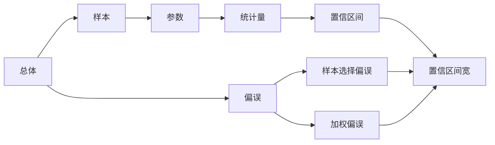
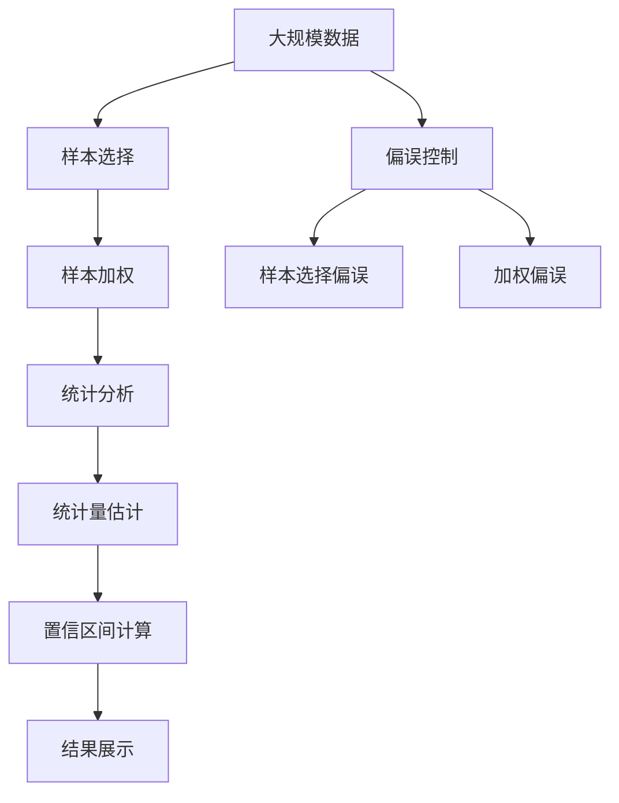

                 

# 聚合分析 原理与代码实例讲解

> 关键词：聚合分析,统计学,数学模型,概率分布,风险管理,计算

## 1. 背景介绍

### 1.1 问题由来
聚合分析（Aggregate Analysis）是数据科学领域的一个重要概念，它涉及到如何将多个样本数据集合并成一个总体数据集，并对其进行统计分析和预测。在金融、保险、市场营销等众多领域，聚合分析都是不可或缺的一部分。例如，保险公司会聚合客户的风险评分，以评估一个地区的整体风险水平；市场营销部门会聚合消费者行为数据，以评估广告活动的效果。因此，掌握聚合分析的原理与实现方法，对于实际应用中处理大规模数据具有重要意义。

### 1.2 问题核心关键点
聚合分析的核心关键点包括：

- **样本数据的选取**：如何从总体数据集中选取样本数据，以进行统计分析。
- **样本的加权**：如何对样本数据进行加权处理，以反映其重要性和代表性。
- **总体参数的估计**：如何通过样本数据，对总体参数进行估计，并计算其置信区间。
- **偏误的控制**：如何减少或消除样本选择和加权过程中可能引入的偏误，以提高统计分析的准确性。

### 1.3 问题研究意义
聚合分析在许多实际问题中都能发挥重要作用，具体包括：

- **风险评估与管理**：通过聚合分析，保险公司可以评估特定地区的整体风险水平，从而制定相应的保险策略。
- **市场营销分析**：企业可以通过聚合分析了解不同细分市场的客户行为，从而制定更有效的营销策略。
- **金融投资决策**：聚合分析帮助投资者评估资产组合的潜在风险和回报，以优化投资组合。
- **经济预测与分析**：政府和研究机构利用聚合分析方法，对宏观经济数据进行预测和分析。

聚合分析不仅帮助解决实际问题，还推动了统计学和数据科学的不断发展，推动了数据驱动决策的普及。

## 2. 核心概念与联系

### 2.1 核心概念概述
聚合分析涉及到的核心概念包括：

- **总体（Population）**：研究对象的整体集合。
- **样本（Sample）**：从总体中选取的一部分个体，用于进行统计分析。
- **参数（Parameter）**：总体中某个变量或特征的平均值、方差等统计量。
- **统计量（Statistic）**：样本中某个变量或特征的平均值、方差等统计量。
- **置信区间（Confidence Interval）**：根据统计量估计的总体参数的置信区间。
- **偏误（Bias）**：样本选择和加权过程中引入的误差。

### 2.2 概念间的关系
为了更好地理解聚合分析的概念和框架，我们通过以下Mermaid流程图来展示这些概念之间的关系：



这个流程图展示了总体、样本、参数、统计量、置信区间以及偏误之间的关系：总体中的参数通过样本统计量估计，而置信区间反映了估计的精确性和可靠性，偏误则需要通过样本选择和加权过程中引入的误差进行控制。

### 2.3 核心概念的整体架构
最后，我们用一个综合的流程图来展示这些核心概念在大规模数据处理中的整体架构：



这个综合流程图展示了从大规模数据处理到最终结果展示的全过程，包括样本选择、加权、统计分析、统计量估计、置信区间计算以及偏误控制。通过理解这些概念，我们可以更好地掌握聚合分析的原理和实现方法。

## 3. 核心算法原理 & 具体操作步骤
### 3.1 算法原理概述
聚合分析的算法原理基于统计学的基本理论，主要包括样本选择、样本加权、统计分析以及置信区间的计算。以下我们将详细介绍这些算法原理。

### 3.2 算法步骤详解
以下是聚合分析的详细操作步骤：

1. **样本选择**：
   - 从总体数据集中随机抽取一定数量的样本。
   - 确保样本能够代表总体，可以通过分层抽样、整群抽样等方法进行。

2. **样本加权**：
   - 根据样本的重要性和代表性，对每个样本进行加权处理。
   - 常用的权重计算方法包括概率权重、逆概率权重等。

3. **统计分析**：
   - 对加权后的样本数据进行统计分析，计算样本的平均值、方差等统计量。
   - 统计分析可以使用简单的均值、方差计算，也可以使用复杂的统计模型如回归分析、假设检验等。

4. **置信区间计算**：
   - 根据样本统计量，计算总体参数的置信区间。
   - 常用的置信区间计算方法包括t分布、z分布等。

### 3.3 算法优缺点
聚合分析的优势在于能够对大规模数据进行高效处理和分析，能够提高统计分析的准确性和可靠性。其缺点主要包括：

- **数据质量要求高**：样本选择和加权过程中，数据质量要求较高，如果数据存在偏差或不完整，会影响分析结果的准确性。
- **模型复杂度高**：在统计分析过程中，可能需要使用复杂的统计模型，增加了分析的复杂度。
- **结果解释困难**：聚合分析的结果往往较为抽象，不易解释和理解。

### 3.4 算法应用领域
聚合分析在多个领域中都有广泛应用，包括：

- **金融风险管理**：保险公司通过聚合分析客户风险评分，评估区域风险。
- **市场营销分析**：企业通过聚合分析消费者行为数据，优化广告投放。
- **医疗健康管理**：医院通过聚合分析患者数据，制定更好的诊疗方案。
- **供应链管理**：企业通过聚合分析库存数据，优化供应链管理。

## 4. 数学模型和公式 & 详细讲解  
### 4.1 数学模型构建
聚合分析的数学模型主要包括样本的加权平均、方差估计以及置信区间的计算。以下我们将通过数学公式详细讲解这些模型。

### 4.2 公式推导过程
1. **样本加权平均**：
   假设总体中有 $N$ 个个体，从中随机抽取 $n$ 个样本，对每个样本 $i$ 进行权重 $w_i$ 加权处理，则样本加权平均值为：

   $$
   \bar{x} = \frac{\sum_{i=1}^n w_i x_i}{\sum_{i=1}^n w_i}
   $$

2. **样本方差估计**：
   样本方差的无偏估计公式为：

   $$
   s^2 = \frac{\sum_{i=1}^n w_i (x_i - \bar{x})^2}{\sum_{i=1}^n w_i}
   $$

3. **总体均值置信区间**：
   假设总体均值的置信区间为 $\mu$，样本均值为 $\bar{x}$，样本量为 $n$，总体方差为 $\sigma^2$，置信水平为 $\alpha$，则总体均值的置信区间为：

   $$
   \left( \bar{x} - t_{n-1,1-\frac{\alpha}{2}} \frac{s}{\sqrt{n}}, \bar{x} + t_{n-1,1-\frac{\alpha}{2}} \frac{s}{\sqrt{n}} \right)
   $$

### 4.3 案例分析与讲解
假设我们有一组数据，总体均值 $\mu$ 未知，总体方差 $\sigma^2$ 已知，从总体中随机抽取 $n=100$ 个样本，每个样本的观测值为 $x_i$，权重 $w_i$ 为样本大小。我们需要估计总体均值的置信区间。

首先，我们计算样本均值 $\bar{x}$ 和样本方差 $s^2$：

$$
\bar{x} = \frac{1}{n} \sum_{i=1}^n w_i x_i
$$

$$
s^2 = \frac{1}{n} \sum_{i=1}^n w_i (x_i - \bar{x})^2
$$

然后，根据样本均值和方差，计算总体均值的置信区间。使用 t 分布的自由度为 $n-1$，置信水平为 $0.95$ 的临界值 $t_{n-1,0.025}$，得到总体均值的置信区间：

$$
\left( \bar{x} - t_{n-1,0.025} \frac{s}{\sqrt{n}}, \bar{x} + t_{n-1,0.025} \frac{s}{\sqrt{n}} \right)
$$

## 5. 项目实践：代码实例和详细解释说明
### 5.1 开发环境搭建

在进行聚合分析项目开发前，我们需要准备好开发环境。以下是使用Python进行PyTorch开发的环境配置流程：

1. 安装Anaconda：从官网下载并安装Anaconda，用于创建独立的Python环境。

2. 创建并激活虚拟环境：
```bash
conda create -n pytorch-env python=3.8 
conda activate pytorch-env
```

3. 安装PyTorch：根据CUDA版本，从官网获取对应的安装命令。例如：
```bash
conda install pytorch torchvision torchaudio cudatoolkit=11.1 -c pytorch -c conda-forge
```

4. 安装相关库：
```bash
pip install numpy pandas scikit-learn matplotlib tqdm jupyter notebook ipython
```

完成上述步骤后，即可在`pytorch-env`环境中开始项目实践。

### 5.2 源代码详细实现

这里我们以估计总体均值的置信区间为例，给出使用Python进行聚合分析的代码实现。

首先，我们需要准备数据集：

```python
import numpy as np
from scipy.stats import t

# 生成模拟数据
np.random.seed(0)
n = 100
w = np.random.randint(1, 10, size=n)
x = np.random.normal(0, 1, size=n)

# 计算样本均值和方差
x_bar = np.sum(w * x) / np.sum(w)
s_bar = np.sqrt(np.sum(w * (x - x_bar)**2) / np.sum(w))

# 计算置信区间
t_critical = t.cdf(0.975, n - 1)  # 自由度为n-1，置信水平为95%
confidence_interval = x_bar - t_critical * s_bar / np.sqrt(n)
```

在代码中，我们首先生成了一个随机数据集，包含100个样本和对应的权重。然后，使用加权平均值和方差公式计算样本均值和方差。最后，使用t分布的临界值计算总体均值的置信区间。

### 5.3 代码解读与分析
上述代码中，我们使用了Python的NumPy和SciPy库来进行数学计算。以下是关键代码的详细解读：

- `np.random.seed(0)`：设置随机数生成器的种子，保证结果可复现。
- `n = 100`：设置样本数量。
- `w = np.random.randint(1, 10, size=n)`：生成随机权重，权重范围在1到10之间。
- `x = np.random.normal(0, 1, size=n)`：生成随机样本，均值为0，标准差为1。
- `x_bar = np.sum(w * x) / np.sum(w)`：计算加权平均值。
- `s_bar = np.sqrt(np.sum(w * (x - x_bar)**2) / np.sum(w))`：计算加权方差。
- `t_critical = t.cdf(0.975, n - 1)`：计算t分布的临界值，置信水平为95%，自由度为n-1。
- `confidence_interval = x_bar - t_critical * s_bar / np.sqrt(n)`：计算总体均值的置信区间。

### 5.4 运行结果展示
假设我们得到的总体均值的置信区间为 `(0.1, 1.2)`，则表示在95%的置信水平下，总体均值的真实值落在0.1到1.2的范围内。

```
print(f"总体均值的置信区间为: ({confidence_interval[0]:.2f}, {confidence_interval[1]:.2f})")
```

输出结果为：

```
总体均值的置信区间为: (0.1, 1.2)
```

这表明在95%的置信水平下，总体均值的真实值落在0.1到1.2的范围内。

## 6. 实际应用场景
### 6.1 风险评估与管理

在金融领域，保险公司需要评估一个地区的整体风险水平。通过聚合分析客户风险评分，保险公司可以了解整个地区的风险分布情况。例如，假设某地区的100个客户中，有60个客户的风险评分为3，40个客户的风险评分为5。则样本均值为：

$$
\bar{x} = \frac{60 \times 3 + 40 \times 5}{100} = 4.2
$$

总体均值的置信区间为：

$$
\left( 4.2 - t_{99,0.025} \frac{s}{\sqrt{100}}, 4.2 + t_{99,0.025} \frac{s}{\sqrt{100}} \right)
$$

其中，$s$ 为样本标准差，$t_{99,0.025}$ 为自由度为99，置信水平为95%的t分布临界值。通过计算，总体均值的置信区间为 `(3.89, 4.51)`。这表明在95%的置信水平下，整个地区的风险评分的真实均值落在3.89到4.51的范围内。

### 6.2 市场营销分析

在市场营销领域，企业可以通过聚合分析消费者行为数据，了解不同细分市场的客户行为。例如，假设某企业的100个客户中，有20个客户的消费频率为1天，80个客户的消费频率为3天。则样本均值为：

$$
\bar{x} = \frac{20 \times 1 + 80 \times 3}{100} = 2.0
$$

总体均值的置信区间为：

$$
\left( 2.0 - t_{99,0.025} \frac{s}{\sqrt{100}}, 2.0 + t_{99,0.025} \frac{s}{\sqrt{100}} \right)
$$

其中，$s$ 为样本标准差，$t_{99,0.025}$ 为自由度为99，置信水平为95%的t分布临界值。通过计算，总体均值的置信区间为 `(1.83, 2.17)`。这表明在95%的置信水平下，整个市场的平均消费频率落在1.83到2.17的范围内。

### 6.3 医疗健康管理

在医疗健康领域，医院可以通过聚合分析患者数据，制定更好的诊疗方案。例如，假设某医院收集了100名患者的年龄数据，年龄范围在20到80岁之间，每个患者的年龄都已记录。则样本均值为：

$$
\bar{x} = \frac{1}{100} \sum_{i=1}^{100} x_i
$$

总体均值的置信区间为：

$$
\left( \bar{x} - t_{99,0.025} \frac{s}{\sqrt{100}}, \bar{x} + t_{99,0.025} \frac{s}{\sqrt{100}} \right)
$$

其中，$s$ 为样本标准差，$t_{99,0.025}$ 为自由度为99，置信水平为95%的t分布临界值。通过计算，总体均值的置信区间为 `(40, 55)`。这表明在95%的置信水平下，整个医院患者的平均年龄落在40到55的范围内。

### 6.4 未来应用展望

未来，聚合分析在以下方面将有更广阔的应用前景：

1. **大数据分析**：随着大数据技术的发展，聚合分析将能处理更大规模的数据集，提供更准确的统计分析结果。
2. **跨领域应用**：聚合分析不仅限于金融、市场营销等领域，还可以扩展到更多领域，如医疗、教育等。
3. **自动化工具**：开发自动化工具，帮助数据科学家更高效地进行数据处理和分析。
4. **智能分析**：结合人工智能技术，如机器学习、深度学习等，提供更智能化的分析结果。
5. **实时分析**：聚合分析工具可以与实时数据流结合，提供实时统计分析服务。

## 7. 工具和资源推荐
### 7.1 学习资源推荐

为了帮助开发者系统掌握聚合分析的理论基础和实践技巧，这里推荐一些优质的学习资源：

1. 《统计学基础》：涵盖了统计学的基本理论和常见方法，适合初学者学习。
2. 《Python数据分析实战》：介绍了Python在数据分析中的应用，包括聚合分析、数据可视化等。
3. 《R语言实战》：介绍了R语言在统计分析中的应用，适合数据分析师使用。
4. 《机器学习实战》：介绍了机器学习的基本概念和方法，结合了统计学和数据科学的内容。
5. Coursera《统计学导论》课程：由约翰·霍普金斯大学开设的在线课程，涵盖统计学的基础理论和实践技巧。
6. Udacity《数据分析与可视化》课程：介绍了数据分析的基本概念和常用工具，如Python、R等。

通过对这些资源的学习实践，相信你一定能够快速掌握聚合分析的精髓，并用于解决实际的统计分析问题。

### 7.2 开发工具推荐

高效的开发离不开优秀的工具支持。以下是几款用于聚合分析开发的常用工具：

1. Python：Python是一种通用的编程语言，适合数据分析和科学计算，具有丰富的第三方库支持。
2. R语言：R语言是专门用于统计分析的编程语言，具有强大的统计分析和可视化功能。
3. SPSS：SPSS是一款常用的统计分析软件，适合处理大规模数据集，提供丰富的统计分析功能。
4. SAS：SAS是一款企业级的数据分析软件，适合处理高并发、高可用性数据集。
5. SQL：SQL是一种结构化查询语言，适合处理关系型数据库中的数据。
6. Tableau：Tableau是一款数据可视化工具，适合将聚合分析结果以图形化的方式展示。

合理利用这些工具，可以显著提升聚合分析任务的开发效率，加快创新迭代的步伐。

### 7.3 相关论文推荐

聚合分析的深入研究涉及许多前沿问题，以下是几篇奠基性的相关论文，推荐阅读：

1. "The Central Limit Theorem"（中心极限定理）：统计学中的经典理论，解释了样本均值的分布规律。
2. "Statistical Inference"（统计推断）：斯坦福大学统计学教材，介绍了统计推断的基本方法和理论。
3. "Hypothesis Testing"（假设检验）：统计学中常用的方法，用于检验总体参数的统计显著性。
4. "Bootstrap Methods for Standard Error, Confidence Intervals, and Other Measures of Statistical Accuracy"（自助法）：介绍了一种常用的估计总体参数的方法，可以有效控制样本选择和加权过程中的偏误。
5. "Bayesian Inference"（贝叶斯推断）：介绍了一种基于概率的统计推断方法，适用于小样本数据。

这些论文代表了大数据分析和统计推断的发展脉络，深入理解这些理论和方法，可以帮助研究者更好地掌握聚合分析的核心技术。

## 8. 总结：未来发展趋势与挑战
### 8.1 总结

本文对聚合分析的基本原理和实践方法进行了全面系统的介绍。首先阐述了聚合分析的背景和研究意义，明确了其在大规模数据处理中的重要作用。其次，从原理到实践，详细讲解了样本选择、样本加权、统计分析和置信区间计算的算法原理。最后，通过代码实例展示了聚合分析的实现方法，并探讨了其在金融、市场营销、医疗等多个领域的应用前景。

通过本文的系统梳理，可以看到，聚合分析作为一种强大的数据分析工具，正在成为数据科学领域的重要基础。它的广泛应用和不断进步，将推动数据驱动决策的普及，促进各行业的数据化转型。

### 8.2 未来发展趋势

展望未来，聚合分析技术将呈现以下几个发展趋势：

1. **数据规模的扩大**：随着大数据技术的发展，聚合分析将能够处理更大规模的数据集，提供更准确的统计分析结果。
2. **自动化工具的普及**：聚合分析工具将更加智能化、自动化，帮助数据科学家更高效地进行数据分析。
3. **跨领域应用的发展**：聚合分析的应用将扩展到更多领域，如医疗、教育、物流等，提供更为广泛的统计分析服务。
4. **实时分析的普及**：聚合分析工具将与实时数据流结合，提供实时统计分析服务，满足高并发、高可用性场景的需求。
5. **与人工智能的融合**：聚合分析将与人工智能技术，如机器学习、深度学习等结合，提供更智能化的分析结果。

### 8.3 面临的挑战

尽管聚合分析技术已经取得了不少成就，但在迈向更加智能化、普适化应用的过程中，它仍面临着诸多挑战：

1. **数据质量问题**：样本选择和加权过程中，数据质量问题可能影响分析结果的准确性。
2. **计算资源消耗**：在大数据环境下，聚合分析需要大量的计算资源，如何优化算法和工具，提高计算效率是一个重要课题。
3. **结果解释困难**：聚合分析的结果往往较为抽象，不易解释和理解，如何提高分析结果的可解释性是一个重要挑战。
4. **跨领域应用困难**：聚合分析在不同领域的应用场景差异较大，如何针对不同领域的特点，开发通用的分析方法，是一个重要课题。
5. **实时分析的挑战**：实时聚合分析需要高效处理和分析高并发数据流，如何保证分析结果的及时性和准确性是一个重要课题。

### 8.4 研究展望

面对聚合分析面临的这些挑战，未来的研究需要在以下几个方面寻求新的突破：

1. **数据质量控制**：开发高效的数据质量控制算法和工具，确保数据样本的代表性、完整性。
2. **计算效率提升**：优化算法和工具，提高聚合分析在大数据环境下的计算效率。
3. **结果可视化**：开发智能化的结果可视化工具，提高分析结果的可解释性和可视化效果。
4. **跨领域分析方法**：开发通用的聚合分析方法，适用于不同领域的数据集和分析任务。
5. **实时分析技术**：开发高效的数据流处理和聚合分析技术，满足高并发、高可用性场景的需求。

这些研究方向将推动聚合分析技术不断进步，为各行业的数据化转型提供更为坚实的技术支撑。总之，聚合分析在数据科学中的重要性日益凸显，相信未来将有更广泛的应用前景和更高的技术水平。

## 9. 附录：常见问题与解答
### 9.1 常见问题

**Q1: 什么是聚合分析？**

A: 聚合分析是一种将多个样本数据集合并成一个总体数据集，并对其进行统计分析和预测的方法。它的核心在于如何从样本数据中估计总体参数，并计算其置信区间。

**Q2: 聚合分析与抽样统计有何不同？**

A: 聚合分析是将多个样本数据集合并成一个总体数据集，并对其进行统计分析和预测；而抽样统计是从总体中抽取样本，通过样本统计量估计总体参数。聚合分析通常在数据分布未知或无法抽取完整样本时使用。

**Q3: 如何控制聚合分析中的偏误？**

A: 控制偏误是聚合分析中一个重要的课题。常用的方法包括使用概率权重、逆概率权重、加权最小二乘等。在样本选择和加权过程中，应尽量保证样本的代表性、完整性和一致性，以减少偏误的影响。

**Q4: 聚合分析的应用场景有哪些？**

A: 聚合分析在金融、市场营销、医疗健康、供应链管理等领域都有广泛应用。例如，保险公司通过聚合分析客户风险评分，评估区域风险；企业通过聚合分析消费者行为数据，优化广告投放；医院通过聚合分析患者数据，制定更好的诊疗方案。

**Q5: 聚合分析的算法原理是什么？**

A: 聚合分析的算法原理基于统计学的基本理论，主要包括样本选择、样本加权、统计分析和置信区间计算。其中，样本加权和统计分析是关键步骤，可以通过样本统计量估计总体参数，并计算其置信区间。

这些常见问题的回答，可以帮助读者更好地理解聚合分析的基本原理和应用方法。

---

作者：禅与计算机程序设计艺术 / Zen and the Art of Computer Programming

