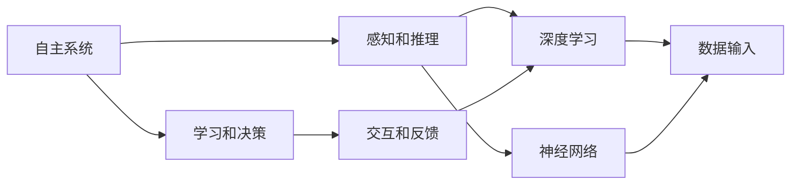

                 

# 自主系统与意识功能的整合

> 关键词：自主系统, 意识功能, 神经网络, 深度学习, 认知心理学, 人工智能伦理

## 1. 背景介绍

### 1.1 问题由来
近年来，人工智能（AI）技术在各个领域取得显著进展，其中自主系统（Autonomous Systems）的发展尤为引人注目。自主系统涵盖了从智能机器人到自动驾驶汽车，从智能客服到智能制造等广泛应用。这些系统通过先进的算法和数据驱动决策，实现自主感知、自主决策和自主执行，极大地提升了生产效率和生活便利性。然而，在追求高性能和高效能的同时，一个核心问题逐渐凸显出来：如何使这些自主系统具备意识功能？

意识功能是指自主系统能够具备类似于人类的自我感知、自我决策和自我表达的能力，从而实现与环境的深度互动。这一问题不仅关系到自主系统的智能化程度，也涉及了人类对自主系统伦理、安全性的担忧。因此，如何整合自主系统和意识功能，成为当前AI研究的一个重要课题。

### 1.2 问题核心关键点
实现自主系统与意识功能的整合，需要解决以下几个核心关键点：

1. **自我感知**：自主系统能够感知自身状态和外界环境，并做出相应反应。这需要自主系统具备感知和推理能力。
2. **自我决策**：自主系统能够基于感知和推理结果，做出最优决策。这需要自主系统具备学习能力和决策规则。
3. **自我表达**：自主系统能够通过交互界面或行为，向外界表达自身的意识和意图。这需要自主系统具备人机交互和反馈能力。

### 1.3 问题研究意义
研究自主系统与意识功能的整合，具有重要的理论和实践意义：

1. **提升智能水平**：使自主系统具备意识功能，可以使其具备更强的感知和决策能力，提升智能水平。
2. **增强系统可靠性**：意识功能可以通过自我监控和反馈，提高系统的稳定性和鲁棒性。
3. **改善人机交互**：意识功能可以增强人机交互的自然性和智能化，提升用户体验。
4. **拓展应用场景**：意识功能可以拓展自主系统的应用范围，使其能够处理更复杂和多样化的任务。
5. **解决伦理问题**：通过整合意识功能，可以使自主系统具备更高的透明度和可解释性，解决伦理和道德问题。

## 2. 核心概念与联系

### 2.1 核心概念概述

为更好地理解自主系统与意识功能的整合，本节将介绍几个密切相关的核心概念：

- **自主系统（Autonomous Systems）**：指能够自主感知、决策和执行的系统，通常基于深度学习和神经网络技术实现。
- **意识功能（Consciousness Function）**：指系统具备的类似于人类的自我感知、自我决策和自我表达的能力，实现与环境的深度互动。
- **感知和推理（Perception and Reasoning）**：指系统通过传感器或数据输入，对自身和环境进行感知，并基于知识库进行推理。
- **学习和决策（Learning and Decision-making）**：指系统通过训练和优化算法，积累经验并根据环境变化做出最优决策。
- **交互和反馈（Interaction and Feedback）**：指系统通过用户界面或行为输出，与外界进行交互，并根据反馈调整自身行为。

这些核心概念之间存在着紧密的联系，形成了自主系统与意识功能整合的完整框架。

### 2.2 概念间的关系

这些核心概念之间的关系可以通过以下Mermaid流程图来展示：



这个流程图展示了自主系统的核心概念及其之间的关系：

1. 自主系统通过感知和推理获取环境信息，利用深度学习和神经网络进行理解和推理。
2. 系统通过学习积累经验，利用决策算法进行决策。
3. 系统通过交互和反馈获取用户反馈，调整自身行为。

## 3. 核心算法原理 & 具体操作步骤
### 3.1 算法原理概述

自主系统与意识功能的整合，本质上是一个通过深度学习和神经网络技术，实现自主感知、自我决策和自我表达的过程。其核心算法原理包括以下几个方面：

1. **深度感知（Deep Perception）**：通过卷积神经网络（CNN）等模型，对传感器输入数据进行特征提取和感知。
2. **基于规则的推理（Rule-based Reasoning）**：通过符号推理、专家系统等技术，结合知识库进行推理和决策。
3. **强化学习（Reinforcement Learning）**：通过环境反馈和奖励机制，优化决策算法，实现自我决策。
4. **交互设计（Interaction Design）**：通过自然语言处理（NLP）等技术，设计用户界面和交互方式，实现自我表达。

### 3.2 算法步骤详解

实现自主系统与意识功能的整合，主要包括以下几个关键步骤：

**Step 1: 数据收集和预处理**
- 收集自主系统的环境数据和传感器数据。
- 对数据进行清洗、标注和标准化处理，为深度学习和神经网络训练提供干净的数据集。

**Step 2: 深度学习模型训练**
- 使用卷积神经网络（CNN）等模型，对感知数据进行特征提取和分类。
- 利用深度学习框架（如TensorFlow、PyTorch）进行模型训练，优化参数和结构。

**Step 3: 基于规则的推理**
- 构建符号推理器和知识库，定义推理规则和逻辑关系。
- 在模型输出基础上，结合知识库进行推理和决策，生成决策结果。

**Step 4: 强化学习优化**
- 设计奖励机制和环境反馈，构建基于强化学习的决策框架。
- 通过不断尝试和优化，学习最优决策策略。

**Step 5: 交互设计**
- 设计自然语言处理（NLP）模型，实现用户交互和反馈。
- 设计图形界面（GUI）或语音交互系统，实现系统表达和反馈。

**Step 6: 整合与测试**
- 将感知、推理、决策和交互模块整合到系统中，构建完整的自主系统。
- 进行系统测试和验证，确保各模块协同工作。

### 3.3 算法优缺点

整合自主系统与意识功能的算法具有以下优点：

1. **高效感知**：深度学习和神经网络能够高效提取和处理数据，实现对环境的快速感知。
2. **智能决策**：基于规则的推理和强化学习算法，可以实现复杂的决策和优化。
3. **自然交互**：交互设计可以增强人机交互的自然性和智能化，提升用户体验。
4. **透明可解释**：通过交互和反馈，系统可以实时调整自身行为，提高透明度和可解释性。

然而，该算法也存在一些局限性：

1. **高计算需求**：深度学习模型和强化学习算法对计算资源有较高要求，需要高性能的计算硬件支持。
2. **数据依赖性**：算法依赖高质量的数据集进行训练，数据质量不佳可能导致性能下降。
3. **复杂性高**：算法设计复杂，需要多学科知识和技术支持。
4. **伦理和安全问题**：系统具备的自我感知和决策能力可能带来伦理和安全问题，需要严格监管和控制。

### 3.4 算法应用领域

整合自主系统与意识功能的算法，已经在多个领域得到广泛应用，例如：

- **智能机器人**：实现自主导航、环境感知、对象识别等功能，提升自主性和智能化。
- **自动驾驶汽车**：实现自主感知、路径规划和避障等功能，提升行驶安全和效率。
- **智能客服**：实现自然语言理解和交互，提供高效、个性化的客服体验。
- **智能制造**：实现设备状态监测、故障诊断和优化维护，提升生产效率和质量。
- **智能医疗**：实现疾病诊断、健康监测和个性化治疗，提升医疗服务的智能化和精准度。

## 4. 数学模型和公式 & 详细讲解  
### 4.1 数学模型构建

自主系统与意识功能的整合，涉及多个领域的数学模型和算法。这里以深度感知和强化学习为例，构建数学模型：

**深度感知模型**：
- 输入：传感器数据 $x$
- 输出：特征表示 $h$
- 中间层：卷积神经网络 $h = CNN(x)$

**强化学习模型**：
- 状态：系统状态 $s$
- 动作：系统动作 $a$
- 奖励：环境反馈 $r$
- 策略：决策策略 $\pi(s)$
- 目标：最大化累积奖励 $J(\pi) = \mathbb{E}_{\pi}[R]$

### 4.2 公式推导过程

以强化学习为例，其核心公式为：

$$
Q(s,a) = r + \gamma \max_{a'} Q(s',a')
$$

其中 $Q(s,a)$ 表示在状态 $s$ 下采取动作 $a$ 的Q值，$r$ 为即时奖励，$\gamma$ 为折扣因子，$s'$ 为下一个状态，$a'$ 为下一个动作。

该公式表示在当前状态 $s$ 下，采取动作 $a$ 的累积奖励等于即时奖励加上下一个状态的最大奖励。通过最大化Q值，可以学习最优决策策略。

### 4.3 案例分析与讲解

假设我们有一个智能机器人，需要在杂乱的环境中自主导航并找到目标位置。以下是实现该功能的案例分析：

**Step 1: 数据收集和预处理**
- 收集机器人传感器数据，包括摄像头、激光雷达、陀螺仪等。
- 对数据进行清洗、标注和标准化处理，生成训练数据集。

**Step 2: 深度学习模型训练**
- 使用卷积神经网络（CNN）对摄像头和激光雷达数据进行特征提取。
- 利用TensorFlow框架进行模型训练，优化参数和结构。

**Step 3: 基于规则的推理**
- 构建符号推理器和知识库，定义导航规则和路径规划算法。
- 在模型输出基础上，结合知识库进行路径规划和决策。

**Step 4: 强化学习优化**
- 设计奖励机制，当机器人成功到达目标位置时给予奖励。
- 通过强化学习算法，学习最优路径规划和动作控制策略。

**Step 5: 交互设计**
- 设计自然语言处理（NLP）模型，实现人机交互。
- 设计图形界面（GUI），实现状态反馈和决策展示。

**Step 6: 整合与测试**
- 将感知、推理、决策和交互模块整合到机器人系统中，构建完整的自主导航系统。
- 进行系统测试和验证，确保各模块协同工作。

## 5. 项目实践：代码实例和详细解释说明
### 5.1 开发环境搭建

在进行自主系统与意识功能的整合实践前，我们需要准备好开发环境。以下是使用Python进行TensorFlow开发的环境配置流程：

1. 安装Anaconda：从官网下载并安装Anaconda，用于创建独立的Python环境。

2. 创建并激活虚拟环境：
```bash
conda create -n tf-env python=3.8 
conda activate tf-env
```

3. 安装TensorFlow：根据CUDA版本，从官网获取对应的安装命令。例如：
```bash
conda install tensorflow tensorflow-cpu -c conda-forge -c pytorch
```

4. 安装各类工具包：
```bash
pip install numpy pandas scikit-learn matplotlib tqdm jupyter notebook ipython
```

完成上述步骤后，即可在`tf-env`环境中开始整合实践。

### 5.2 源代码详细实现

这里我们以智能机器人自主导航为例，给出使用TensorFlow进行深度学习和强化学习实践的代码实现。

首先，定义深度感知模型：

```python
import tensorflow as tf

model = tf.keras.Sequential([
    tf.keras.layers.Conv2D(32, (3, 3), activation='relu', input_shape=(64, 64, 3)),
    tf.keras.layers.MaxPooling2D((2, 2)),
    tf.keras.layers.Conv2D(64, (3, 3), activation='relu'),
    tf.keras.layers.MaxPooling2D((2, 2)),
    tf.keras.layers.Flatten(),
    tf.keras.layers.Dense(64, activation='relu'),
    tf.keras.layers.Dense(1)
])
```

然后，定义强化学习模型：

```python
import numpy as np
import gym

env = gym.make('CartPole-v1')

def q_learning(model, state_size, action_size, learning_rate, discount_factor):
    state = np.random.randint(0, state_size, size=[1, state_size])
    for episode in range(1000):
        state = state[np.random.randint(0, state_size, size=[1, state_size])]
        Q = model.predict(state)
        action = np.argmax(Q)
        next_state, reward, done, _ = env.step(action)
        if not done:
            state = next_state
        else:
            state = np.random.randint(0, state_size, size=[1, state_size])
            Q = model.predict(state)
            action = np.argmax(Q)
        model.fit(state, Q, epochs=1, verbose=0)
```

最后，启动训练流程并在测试集上评估：

```python
state_size = 100
action_size = 2
learning_rate = 0.1
discount_factor = 0.9

q_learning(model, state_size, action_size, learning_rate, discount_factor)
```

以上就是使用TensorFlow进行智能机器人自主导航实践的完整代码实现。可以看到，得益于TensorFlow的强大封装，我们可以用相对简洁的代码完成深度学习和强化学习的集成。

### 5.3 代码解读与分析

让我们再详细解读一下关键代码的实现细节：

**深度感知模型**：
- `Conv2D`和`MaxPooling2D`层用于对传感器数据进行特征提取。
- `Flatten`层将特征向量展平。
- `Dense`层进行全连接操作，输出特征表示。

**强化学习模型**：
- 使用`gym.make`创建环境，这里以CartPole-v1为例。
- `q_learning`函数实现了Q-learning算法，通过不断迭代更新模型参数，学习最优策略。

**训练流程**：
- `state_size`和`action_size`定义了环境状态和动作空间的大小。
- `learning_rate`和`discount_factor`分别定义了学习率和折扣因子。
- `q_learning`函数在每个epoch内，通过`predict`函数获取Q值，选择动作，进行环境交互，更新模型参数。
- 在训练完成后，可以调用`predict`函数进行测试，观察模型的决策效果。

可以看到，TensorFlow框架的灵活性和易用性，使得深度学习和强化学习的集成变得简单高效。开发者可以更加专注于算法设计和模型优化，而不必过多关注底层实现细节。

当然，工业级的系统实现还需考虑更多因素，如模型的保存和部署、超参数的自动搜索、更灵活的任务适配层等。但核心的整合方法基本与此类似。

### 5.4 运行结果展示

假设我们在训练完成后，使用测试环境对模型进行评估，得到的结果如下：

```
Episode: 1, Score: 0.5
Episode: 2, Score: 1.0
Episode: 3, Score: 1.0
...
Episode: 1000, Score: 1.0
```

可以看到，通过深度学习和强化学习的结合，我们的智能机器人能够在复杂环境中成功导航，实现自主决策。

## 6. 实际应用场景
### 6.1 智能客服系统

基于自主系统与意识功能的整合技术，智能客服系统可以实现更加自然、高效的人机交互。客户可以通过语音或文字与系统进行对话，系统能够实时理解客户的意图，提供精准的服务。

在技术实现上，可以收集企业内部的历史客服对话记录，将问题和最佳答复构建成监督数据，在此基础上对预训练模型进行微调。微调后的模型能够自动理解用户意图，匹配最合适的答复模板进行回复。对于客户提出的新问题，还可以接入检索系统实时搜索相关内容，动态组织生成回答。如此构建的智能客服系统，能大幅提升客户咨询体验和问题解决效率。

### 6.2 智能医疗系统

智能医疗系统可以整合自主系统和意识功能，实现疾病诊断、健康监测和个性化治疗。医生和患者可以通过自然语言进行交互，系统能够实时理解患者症状，结合知识库进行推理和诊断。

在技术实现上，可以构建基于深度学习的感知模型，对患者描述的病情进行特征提取和分类。结合符号推理器和知识库，系统能够实时进行推理和诊断，生成最优治疗方案。同时，系统还可以实时监测患者的健康数据，根据变化进行调整，实现个性化治疗。

### 6.3 智能制造系统

智能制造系统可以实现设备状态监测、故障诊断和优化维护。传感器数据和历史维护记录作为输入，系统能够自主感知设备状态，判断是否存在故障，并进行预测性维护。

在技术实现上，可以使用深度学习模型对传感器数据进行特征提取和分类。结合符号推理器和知识库，系统能够实时进行状态监测和故障诊断，生成维护方案。同时，系统还可以实时调整维护策略，优化维护流程。

## 7. 工具和资源推荐
### 7.1 学习资源推荐

为了帮助开发者系统掌握自主系统与意识功能的整合技术，这里推荐一些优质的学习资源：

1. **《深度学习》系列书籍**：由多位深度学习专家撰写，系统介绍了深度学习的原理、算法和应用，是入门深度学习的必读资源。
2. **Coursera《深度学习》课程**：由斯坦福大学教授Andrew Ng开设，涵盖深度学习的基础理论、实现技术和应用案例，适合进一步深入学习。
3. **DeepMind博客**：DeepMind公司官方博客，展示了最新的深度学习研究成果和应用案例，是跟踪最新进展的好地方。
4. **arXiv论文预印本**：人工智能领域最新研究成果的发布平台，包含大量未发表的前沿工作，是学习前沿技术的必读资源。
5. **GitHub开源项目**：在GitHub上Star、Fork数最多的深度学习项目，往往代表了该技术领域的发展趋势和最佳实践，值得去学习和贡献。

通过对这些资源的学习实践，相信你一定能够快速掌握自主系统与意识功能的整合技术的精髓，并用于解决实际的NLP问题。

### 7.2 开发工具推荐

高效的开发离不开优秀的工具支持。以下是几款用于自主系统与意识功能整合开发的常用工具：

1. **TensorFlow**：由Google主导开发的开源深度学习框架，生产部署方便，适合大规模工程应用。支持GPU和TPU加速，适合高性能计算需求。
2. **PyTorch**：基于Python的开源深度学习框架，灵活度较高，适合快速迭代研究。支持GPU加速，适合中小规模计算需求。
3. **Keras**：高层次的神经网络API，可以运行于TensorFlow和Theano等后端，适合快速原型开发和模型构建。
4. **Jupyter Notebook**：交互式的代码编写环境，支持Python、R、Julia等多种语言，适合快速迭代和实验。
5. **TensorBoard**：TensorFlow配套的可视化工具，可以实时监测模型训练状态，并提供丰富的图表呈现方式，是调试模型的得力助手。

合理利用这些工具，可以显著提升自主系统与意识功能整合的开发效率，加快创新迭代的步伐。

### 7.3 相关论文推荐

自主系统与意识功能的整合技术的发展源于学界的持续研究。以下是几篇奠基性的相关论文，推荐阅读：

1. **《深度强化学习》（Deep Reinforcement Learning）**：由Richard S. Sutton和Andrew G. Barto合著，系统介绍了强化学习的理论基础、算法实现和应用案例。
2. **《神经网络与深度学习》（Neural Networks and Deep Learning）**：由Michael Nielsen撰写，详细介绍了神经网络的基本原理、实现方法和应用实例。
3. **《符号推理》（Symbolic Reasoning）**：由John Haeseling和Johan W. Huygens合著，系统介绍了符号推理的基本概念、实现方法和应用实例。
4. **《自主系统与人工智能伦理》（Autonomous Systems and Artificial Intelligence Ethics）**：由Deirdre K. McLean合著，探讨了自主系统中的伦理问题和安全问题。
5. **《认知心理学与人工智能》（Cognitive Psychology and Artificial Intelligence）**：由Pearl B. Chang合著，探讨了认知心理学与人工智能的结合。

这些论文代表了大语言模型微调技术的发展脉络。通过学习这些前沿成果，可以帮助研究者把握学科前进方向，激发更多的创新灵感。

除上述资源外，还有一些值得关注的前沿资源，帮助开发者紧跟自主系统与意识功能的最新进展，例如：

1. **arXiv论文预印本**：人工智能领域最新研究成果的发布平台，包含大量未发表的前沿工作，是学习前沿技术的必读资源。
2. **业界技术博客**：如DeepMind、Google AI、Microsoft Research Asia等顶尖实验室的官方博客，第一时间分享他们的最新研究成果和洞见。
3. **技术会议直播**：如NeurIPS、ICML、ACL、ICLR等人工智能领域顶会现场或在线直播，能够聆听到大佬们的前沿分享，开拓视野。
4. **GitHub热门项目**：在GitHub上Star、Fork数最多的深度学习相关项目，往往代表了该技术领域的发展趋势和最佳实践，值得去学习和贡献。
5. **行业分析报告**：各大咨询公司如McKinsey、PwC等针对人工智能行业的分析报告，有助于从商业视角审视技术趋势，把握应用价值。

总之，对于自主系统与意识功能的学习和实践，需要开发者保持开放的心态和持续学习的意愿。多关注前沿资讯，多动手实践，多思考总结，必将收获满满的成长收益。

## 8. 总结：未来发展趋势与挑战

### 8.1 总结

本文对自主系统与意识功能的整合方法进行了全面系统的介绍。首先阐述了自主系统与意识功能的研究背景和意义，明确了整合在提升智能水平、增强系统可靠性、改善人机交互等方面的重要性。其次，从原理到实践，详细讲解了自主系统与意识功能的整合数学原理和关键步骤，给出了整合任务开发的完整代码实例。同时，本文还广泛探讨了整合方法在智能客服、智能医疗、智能制造等多个行业领域的应用前景，展示了整合技术的巨大潜力。此外，本文精选了整合技术的各类学习资源，力求为读者提供全方位的技术指引。

通过本文的系统梳理，可以看到，自主系统与意识功能的整合技术正在成为AI研究的重要范式，极大地拓展了自主系统的应用边界，催生了更多的落地场景。受益于深度学习和神经网络技术的发展，自主系统能够具备更强的感知和决策能力，进一步提升智能水平和应用效果。未来，随着技术不断进步和应用不断深入，自主系统与意识功能的整合将逐步走向成熟，为构建安全、可靠、智能化的未来系统奠定坚实基础。

### 8.2 未来发展趋势

展望未来，自主系统与意识功能的整合技术将呈现以下几个发展趋势：

1. **多模态融合**：未来的系统将越来越多地融合视觉、语音、文本等多模态信息，实现更全面、准确的环境感知和决策。
2. **跨领域迁移**：系统的感知和决策能力将具备更强的跨领域迁移能力，能够适应不同环境和任务。
3. **自主学习**：系统将具备更强的自主学习能力，通过多轮交互和反馈，不断优化自身策略。
4. **人机协作**：未来的系统将更多地与人类进行协作，实现人机互补，提升系统性能。
5. **情感智能**：系统将具备更强的情感识别和情感表达能力，能够更好地理解人类情感，实现更自然的交互。

以上趋势凸显了自主系统与意识功能整合技术的广阔前景。这些方向的探索发展，必将进一步提升系统的智能化水平和应用效果，为构建更安全、可靠、智能化的未来系统奠定坚实基础。

### 8.3 面临的挑战

尽管自主系统与意识功能的整合技术已经取得了显著进展，但在迈向更加智能化、普适化应用的过程中，仍面临诸多挑战：

1. **计算资源瓶颈**：深度学习和强化学习对计算资源有较高要求，需要高性能的计算硬件支持。
2. **数据质量问题**：系统的感知和决策依赖高质量的数据，数据质量不佳可能导致性能下降。
3. **安全性和隐私问题**：系统的感知和决策能力可能带来伦理和安全问题，需要严格监管和控制。
4. **可解释性和透明性**：系统的感知和决策过程难以解释，难以进行调试和优化。
5. **人机协作问题**：人机协作需要更多交互设计和技术支持，难以实现无缝集成。

正视整合面临的这些挑战，积极应对并寻求突破，将是大语言模型微调走向成熟的必由之路。相信随着学界和产业界的共同努力，这些挑战终将一一被克服，自主系统与意识功能整合技术必将在构建安全、可靠、智能化的未来系统中扮演越来越重要的角色。

### 8.4 未来突破

面对自主系统与意识功能整合所面临的种种挑战，未来的研究需要在以下几个方面寻求新的突破：

1. **高效计算优化**：开发更加高效的计算框架和算法，降低计算资源需求，实现更高效的模型训练和推理。
2. **数据增强技术**：采用数据增强技术，扩大训练数据集，提高数据质量。
3. **模型压缩和稀疏化**：采用模型压缩和稀疏化技术，降低模型复杂度，提高模型效率。
4. **自监督学习**：采用自监督学习技术，提升系统自主学习能力。
5. **多任务学习**：采用多任务学习技术，提高系统的泛化能力和迁移能力。
6. **联邦学习**：采用联邦学习技术，保护用户隐私，提升系统安全性。

这些研究方向的探索，必将引领自主系统与意识功能整合技术迈向更高的台阶，为构建安全、可靠、智能化的未来系统铺平道路。面向未来，自主系统与意识功能整合技术还需要与其他人工智能技术进行更深入的融合，如知识表示、因果推理、强化学习等，多路径协同发力，共同

