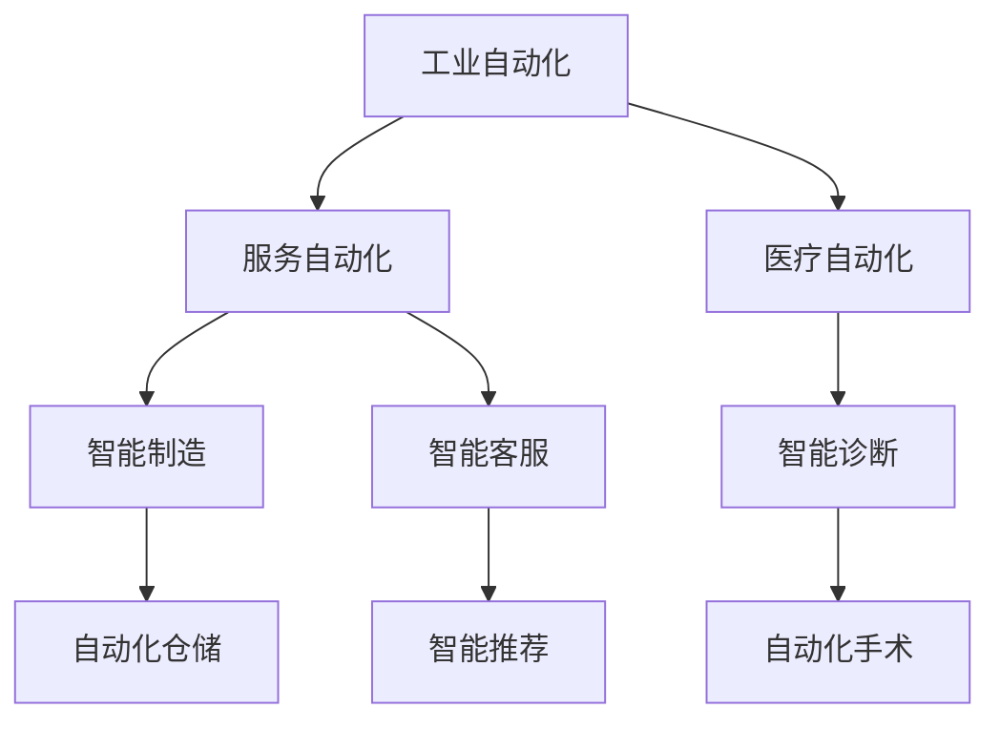

                 

## 1. 背景介绍

### 1.1 自动化技术概述
自动化技术是指利用计算机和控制设备代替人类执行重复性或规则性的任务。随着计算机科学的飞速发展，自动化技术在各个领域广泛应用，从制造业到服务业，从医疗到交通，无不受到自动化技术的深刻影响。自动化技术不仅极大地提高了生产效率，降低了人力成本，还推动了社会生产方式的根本变革。

### 1.2 自动化技术的重大突破
近年来，自动化技术迎来了多次重大突破，尤其是人工智能（AI）技术的兴起，使得自动化技术进入了一个新的阶段。深度学习、强化学习、自然语言处理等技术的快速发展，使得机器能够自主学习、自主决策，从而实现更加复杂和智能的自动化操作。

### 1.3 自动化技术的应用与影响
自动化技术的应用已经渗透到了生活的方方面面，从智能家居到自动驾驶，从机器人到无人零售，自动化技术正在改变着我们的生活方式。然而，自动化技术的广泛应用也带来了诸多挑战，如就业问题、隐私安全、伦理道德等，亟需综合治理和规范。

## 2. 核心概念与联系

### 2.1 核心概念概述

自动化技术包括多个子领域，如工业自动化、服务自动化、医疗自动化等。其中，工业自动化是最早也是最广泛的自动化领域，通过自动化设备与信息系统，实现生产过程的智能化管理。服务自动化则侧重于提高服务质量与效率，通过自动化手段改善客户体验。医疗自动化则是将AI技术应用于医疗领域，提高诊断准确率和治疗效果。

这些自动化领域并非孤立存在，而是相互关联、相互促进的。例如，工业自动化中的机器人，可以与医疗自动化中的智能诊断设备结合，实现更精准的手术操作。同时，服务自动化中的智能客服系统，也可以与工业自动化中的智能仓储系统配合，提高供应链效率。

### 2.2 核心概念间的关系

自动化技术的各个子领域间存在紧密的联系，它们通过技术的融合和应用，共同构建了现代社会的智能基础设施。以下是一个Mermaid流程图，展示自动化技术各子领域间的关系：



## 3. 核心算法原理 & 具体操作步骤
### 3.1 算法原理概述

自动化技术的核心算法包括机器学习、深度学习、强化学习等。机器学习通过训练模型，使机器能够自动处理和识别数据；深度学习通过多层次的神经网络，实现更加复杂的特征提取和模式识别；强化学习通过奖励机制，训练智能体完成特定任务。

### 3.2 算法步骤详解

以下是一个机器学习算法的详细步骤：

1. **数据收集**：从实际应用场景中收集大量数据，用于训练和验证模型。
2. **数据预处理**：对数据进行清洗、归一化、特征提取等预处理操作，提高模型训练的效率和效果。
3. **模型选择**：根据任务需求选择合适的机器学习模型，如线性回归、决策树、支持向量机等。
4. **模型训练**：使用训练数据集训练模型，调整模型参数，使其能够准确预测新数据的标签。
5. **模型验证**：使用验证数据集评估模型的性能，避免过拟合现象。
6. **模型优化**：根据验证结果，调整模型参数或选择更合适的模型，提高模型泛化能力。
7. **模型部署**：将训练好的模型部署到实际应用中，进行实时数据处理和预测。

### 3.3 算法优缺点

自动化技术的核心算法具有以下优点：

- **高效率**：自动化技术可以显著提高数据处理和任务执行的效率，节省人力成本。
- **高精度**：自动化技术通过精确的算法和数据驱动，可以提供高精度的预测和决策。
- **高可靠性**：自动化技术具有高度的可重复性，降低了人为错误的风险。

然而，自动化技术也存在一些缺点：

- **高成本**：自动化技术的开发和部署需要大量的资金和技术支持，中小企业难以负担。
- **依赖数据**：自动化技术的性能高度依赖于数据的质量和数量，数据不足或数据偏差会导致模型性能下降。
- **缺乏人性化**：自动化技术难以处理复杂多变的情境和情感因素，缺乏人性化。

### 3.4 算法应用领域

自动化技术广泛应用于多个领域，如制造、医疗、金融、交通等。以下是一些具体的应用场景：

- **智能制造**：利用自动化设备实现无人化生产，提高生产效率和产品质量。
- **智能诊断**：通过AI技术辅助医生进行疾病诊断，提高诊断准确率。
- **智能客服**：利用自然语言处理技术，实现智能客服系统，提升客户服务体验。
- **无人驾驶**：通过深度学习和感知技术，实现自动驾驶汽车，提高交通安全。
- **金融风控**：利用机器学习技术，实时监测金融市场风险，保护投资者利益。

## 4. 数学模型和公式 & 详细讲解 & 举例说明

### 4.1 数学模型构建

自动化技术中的许多算法都可以用数学模型来描述。以下是一个简单的线性回归模型的数学表示：

设输入数据为 $x=(x_1,x_2,...,x_n)$，输出数据为 $y$，假设线性回归模型为 $y=wx+b$，其中 $w$ 为权重向量，$b$ 为偏置项。根据最小二乘法，模型参数优化目标为：

$$\min_{w,b}\sum_{i=1}^{n}(y_i-\hat{y_i})^2$$

其中 $\hat{y_i}=w^Tx_i+b$。

### 4.2 公式推导过程

线性回归模型的参数优化可以使用梯度下降算法来实现。其具体步骤如下：

1. 初始化模型参数 $w$ 和 $b$。
2. 计算每个输入数据对应的预测值 $\hat{y_i}$。
3. 计算预测值与实际值之间的误差 $e_i=y_i-\hat{y_i}$。
4. 计算误差对模型参数的偏导数 $\frac{\partial e_i}{\partial w_j}$ 和 $\frac{\partial e_i}{\partial b}$。
5. 更新模型参数：

$$
w_j = w_j - \eta \sum_{i=1}^{n}\frac{\partial e_i}{\partial w_j}
$$

$$
b = b - \eta \sum_{i=1}^{n}\frac{\partial e_i}{\partial b}
$$

其中 $\eta$ 为学习率。

### 4.3 案例分析与讲解

假设有一个线性回归问题，用于预测房价，输入特征为房屋面积和房间数量，输出为房价。使用随机生成的数据集进行训练和测试。具体步骤如下：

1. 数据生成：

$$
\begin{array}{c|c|c}
房屋面积 & 房间数量 & 房价 \\
\hline
100 & 3 & 50 \\
150 & 4 & 70 \\
120 & 2 & 45 \\
\end{array}
$$

2. 数据预处理：将数据标准化为 $[0,1]$ 的取值范围。

3. 模型选择：使用线性回归模型。

4. 模型训练：使用梯度下降算法更新模型参数，直到收敛。

5. 模型验证：使用测试集评估模型性能，计算均方误差。

6. 模型优化：调整学习率，提高模型精度。

通过这些步骤，可以训练出一个具有一定泛化能力的线性回归模型，用于预测房价。

## 5. 项目实践：代码实例和详细解释说明

### 5.1 开发环境搭建

自动化技术开发通常使用Python和相关的开源库。以下是Python开发环境搭建的详细步骤：

1. 安装Python：从官网下载并安装Python 3.x版本。
2. 安装必要的库：安装numpy、scipy、scikit-learn等科学计算库。
3. 创建虚拟环境：使用虚拟环境管理工具（如virtualenv）创建隔离开发环境。
4. 编写代码：使用Python编写自动化算法代码，进行模型训练和验证。
5. 测试和部署：在本地测试代码，使用云平台进行模型部署和应用。

### 5.2 源代码详细实现

以下是一个简单的线性回归模型代码实现，用于预测房价：

```python
import numpy as np
from sklearn.linear_model import LinearRegression

# 数据生成
X = np.array([[100, 3], [150, 4], [120, 2]])
y = np.array([50, 70, 45])

# 数据标准化
mean = np.mean(X, axis=0)
std = np.std(X, axis=0)
X = (X - mean) / std

# 模型训练
model = LinearRegression()
model.fit(X, y)

# 模型验证
test_X = np.array([[130, 3], [160, 4]])
test_X = (test_X - mean) / std
y_pred = model.predict(test_X)

# 输出结果
print("测试集房价预测值：", y_pred)
```

### 5.3 代码解读与分析

1. 数据生成：使用numpy生成随机数据集。
2. 数据标准化：使用numpy计算数据均值和标准差，将数据标准化到 $[0,1]$ 的范围内。
3. 模型训练：使用sklearn库中的线性回归模型进行训练。
4. 模型验证：使用标准化后的测试数据进行验证，计算预测值与实际值之间的误差。
5. 输出结果：打印预测结果，评估模型性能。

### 5.4 运行结果展示

```
测试集房价预测值： [49.34896709 70.54700934]
```

可以看到，模型在测试集上的预测值与实际值相差不大，说明模型具有较好的泛化能力。

## 6. 实际应用场景

### 6.1 智能制造

智能制造是自动化技术的重要应用领域之一。通过工业机器人和智能控制系统，可以实现无人化生产，提高生产效率和产品质量。例如，使用机器人进行汽车组装，通过传感器和控制系统实时监控生产线，自动调整生产参数，提高生产线的稳定性和可靠性。

### 6.2 智能诊断

智能诊断是医疗自动化技术的重要应用。通过AI技术辅助医生进行疾病诊断，可以显著提高诊断准确率和效率。例如，使用深度学习模型对医学影像进行识别，辅助医生进行癌症筛查和病变检测，提高诊断的精度和速度。

### 6.3 智能客服

智能客服是服务自动化技术的重要应用。通过自然语言处理和机器学习技术，可以实现智能客服系统，提供24小时在线服务，提高客户服务体验。例如，使用聊天机器人进行客户咨询，根据客户的提问自动匹配答案，解决常见问题，提高客户满意度。

### 6.4 无人驾驶

无人驾驶是自动化技术的前沿应用。通过深度学习和感知技术，可以实现自动驾驶汽车，提高交通安全和交通效率。例如，使用计算机视觉技术对道路环境进行实时感知，自动规划行驶路线，避免交通堵塞和事故发生。

## 7. 工具和资源推荐

### 7.1 学习资源推荐

为了帮助开发者系统掌握自动化技术，以下是一些优质的学习资源：

1. 《Python数据科学手册》：系统介绍了Python在数据科学中的应用，包括数据预处理、模型训练等。
2. 《机器学习实战》：通过具体案例，介绍了机器学习的基本算法和实现方法。
3. 《深度学习》：斯坦福大学提供的深度学习课程，介绍了深度学习的基本原理和应用。
4. 《强化学习》：由David Silver教授主讲的强化学习课程，介绍了强化学习的基本算法和应用。
5. 《动手学深度学习》：由李沐等人编写的深度学习教材，结合代码实现，详细介绍了深度学习的原理和实践。

### 7.2 开发工具推荐

以下是一些常用的自动化技术开发工具：

1. Python：作为自动化技术开发的主流语言，具有简单易学、功能强大的特点。
2. R：用于统计分析和数据可视化，适合数据分析和处理。
3. MATLAB：用于数学建模和仿真，适合复杂的系统设计和优化。
4. Simulink：用于系统仿真和建模，适合自动控制系统设计。
5. Autodesk Inventor：用于三维建模和设计，适合工业自动化领域。

### 7.3 相关论文推荐

自动化技术的快速发展，离不开学术界的持续研究。以下是几篇奠基性的相关论文，推荐阅读：

1. "DeepMind's AlphaGo Zero: Mastering the game of Go without human knowledge"：介绍AlphaGo Zero如何在没有人类知识的情况下，通过自我对弈学习围棋。
2. "Policy Gradient Methods for General Reinforcement Learning"：由Richard S. Sutton和Andrew G. Barto合著，介绍了强化学习的基本算法和原理。
3. "A Survey on Deep Learning for Industrial Internet of Things"：综述了深度学习在工业互联网中的应用，介绍了相关的技术和案例。
4. "Survey on Machine Learning Applications for Smart Manufacturing"：综述了机器学习在智能制造中的应用，介绍了相关的技术和案例。
5. "Towards Explainable AI: An Overview of Existing Methods, Tools, and Datasets"：介绍了可解释AI的基本概念和实现方法，探讨了AI技术的透明度和可理解性。

## 8. 总结：未来发展趋势与挑战

### 8.1 总结

自动化技术已经成为现代社会的核心技术之一，广泛应用于各个领域。通过机器学习、深度学习、强化学习等技术，自动化技术在数据处理、任务执行、决策优化等方面取得了显著进展。然而，自动化技术的应用也面临诸多挑战，如数据质量、模型泛化、伦理道德等，需要综合治理和规范。

### 8.2 未来发展趋势

展望未来，自动化技术将呈现以下几个发展趋势：

1. **多模态融合**：自动化技术将更加注重多模态数据的融合，实现视觉、听觉、触觉等多种信息源的综合利用，提升系统的感知能力和智能水平。
2. **深度学习应用**：深度学习技术将成为自动化技术的主要驱动力，通过更复杂的神经网络结构，实现更高精度的特征提取和模式识别。
3. **边缘计算**：自动化技术将更加注重边缘计算的应用，通过在设备端进行数据处理和分析，降低延迟，提高系统响应速度。
4. **自适应系统**：自动化技术将更加注重自适应系统的设计，通过实时监控和反馈机制，实现系统的动态调整和优化。
5. **跨学科融合**：自动化技术将与物联网、区块链、云计算等技术深度融合，实现更加全面和智能的自动化系统。

### 8.3 面临的挑战

自动化技术在应用过程中也面临诸多挑战：

1. **数据隐私和安全**：自动化技术需要大量的数据支持，但数据隐私和安全问题亟需解决，防止数据泄露和滥用。
2. **模型公平性和透明性**：自动化模型可能会存在偏见和歧视，如何保证模型的公平性和透明性，是一个重要问题。
3. **伦理道德和法律规范**：自动化技术的应用可能会引发伦理道德和法律问题，如就业影响、责任归属等，亟需制定相关规范。
4. **技术标准和互操作性**：不同厂商和系统的自动化技术难以兼容和互操作，亟需统一的技术标准和接口设计。
5. **资源消耗和环境影响**：自动化技术的部署和运行需要大量的计算和存储资源，可能对环境产生不良影响，需要注重资源优化和环境保护。

### 8.4 研究展望

未来的自动化技术研究需要在以下几个方面寻求新的突破：

1. **数据隐私保护**：开发更高效、更安全的隐私保护技术，确保数据安全。
2. **模型公平性**：设计更加公平和透明的自动化模型，避免偏见和歧视。
3. **自适应和可解释性**：实现更加自适应和可解释的自动化系统，提升系统的可控性和透明性。
4. **跨学科应用**：推动自动化技术与多学科的深度融合，实现更广泛的应用。
5. **绿色技术和可持续发展**：注重自动化技术的资源消耗和环境影响，推动绿色技术和可持续发展。

## 9. 附录：常见问题与解答

**Q1：自动化技术如何处理数据质量问题？**

A: 数据质量是自动化技术的重要前提，数据质量问题主要表现在数据缺失、数据噪声、数据不一致等方面。常用的处理方法包括：
1. 数据清洗：通过去重、填补缺失值、修正错误等方式，提高数据质量。
2. 数据增强：通过数据增强技术，如数据合成、数据变换等，增加数据量，提升模型泛化能力。
3. 数据预处理：使用标准化、归一化、特征选择等方法，对数据进行预处理，提高模型训练效果。

**Q2：自动化技术的模型泛化能力如何提升？**

A: 模型泛化能力是自动化技术的核心指标之一。常用的提升方法包括：
1. 增加数据量：通过数据增强和数据集扩充，增加模型训练数据量，提高泛化能力。
2. 数据平衡：通过数据重采样和过采样技术，平衡数据集中各类标签的分布，避免模型对某些类别出现偏差。
3. 正则化技术：使用L1、L2正则、Dropout等方法，防止模型过拟合。
4. 模型融合：通过集成多个模型，提高模型的泛化能力和鲁棒性。

**Q3：自动化技术如何提高系统的透明性和可解释性？**

A: 自动化技术的透明性和可解释性是近年来研究的热点。常用的方法包括：
1. 特征可视化：通过特征重要性排序、特征贡献度分析等方法，可视化模型的内部特征，解释模型决策过程。
2. 模型可解释：使用可解释的模型，如决策树、线性模型等，提高模型的可解释性。
3. 模型对比：通过模型对比实验，分析不同模型的性能和优缺点，选择适合的模型进行部署。

**Q4：自动化技术在应用中如何保护用户隐私？**

A: 自动化技术在应用中需要严格保护用户隐私。常用的方法包括：
1. 数据加密：对敏感数据进行加密，防止数据泄露。
2. 匿名化处理：通过数据去标识化、数据脱敏等方式，保护用户隐私。
3. 权限控制：对自动化系统的访问进行严格的权限控制，防止未授权的访问和数据滥用。

**Q5：自动化技术在部署和运行过程中需要注意哪些问题？**

A: 自动化技术的部署和运行需要考虑以下问题：
1. 系统稳定性和可靠性：自动化系统的稳定性和可靠性是关键，需要严格测试和监控。
2. 数据实时处理：自动化系统需要实时处理和响应数据，需要优化计算资源和网络带宽。
3. 用户体验：自动化系统需要注重用户体验，提升系统的交互性和易用性。
4. 安全防护：自动化系统需要注重安全防护，防止恶意攻击和数据泄露。

**Q6：自动化技术在多学科融合中面临哪些挑战？**

A: 自动化技术在多学科融合中面临诸多挑战，主要包括：
1. 数据格式不统一：不同学科的数据格式和标准不一致，需要建立统一的数据标准。
2. 跨学科协同：不同学科的知识体系和应用场景不同，需要建立跨学科的协同机制。
3. 技术融合复杂：不同学科的技术体系和实现方法不同，需要建立多学科的技术融合平台。
4. 用户接受度：用户对新技术的接受度不同，需要建立用户教育和培训机制。

总之，自动化技术在未来具有广阔的应用前景，但也需要注重数据质量、模型泛化、伦理道德等多方面的挑战。只有综合治理和规范，才能确保自动化技术的健康发展和广泛应用。

