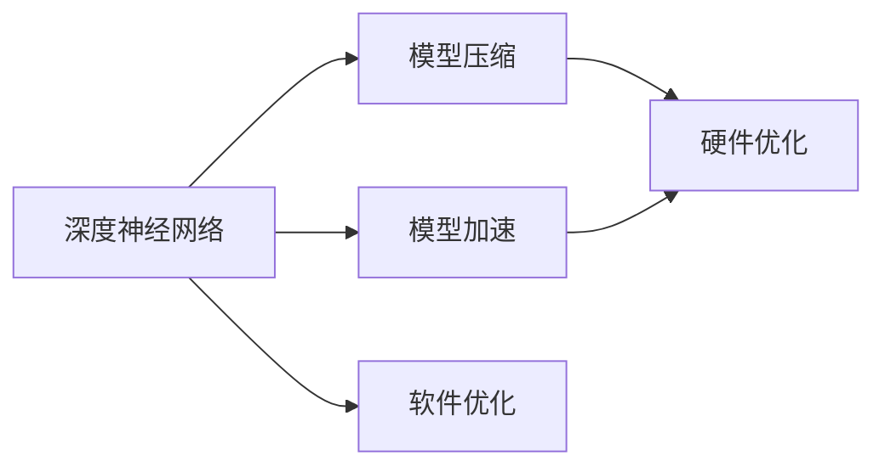
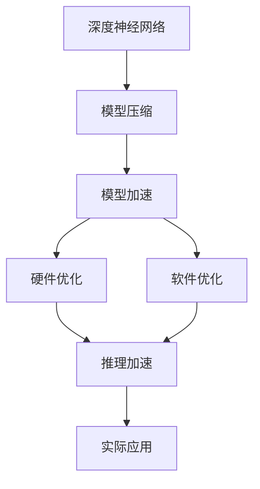

                 

# 自动驾驶中的模型压缩与加速技术

> 关键词：自动驾驶, 模型压缩, 模型加速, 硬件优化, 软件优化

## 1. 背景介绍

### 1.1 问题由来
自动驾驶是当今智能交通系统的重要发展方向，涉及感知、决策和控制三个核心环节。其中，感知环节通过各种传感器采集环境信息，生成高精度的地图和定位信息，是自动驾驶的基础。模型压缩与加速技术的应用，可以显著提高自动驾驶系统的感知精度和实时性，推动自动驾驶技术的产业化进程。

近年来，随着深度学习技术的迅速发展，深度神经网络在自动驾驶领域得到了广泛应用。例如，基于卷积神经网络(CNN)的语义分割网络、基于循环神经网络(RNN)的语音识别模型等，显著提升了自动驾驶系统的感知能力。然而，这些深度神经网络往往具有巨大的参数量和计算复杂度，对硬件资源提出了极高的要求，难以部署在车端等计算资源受限的场景。

因此，针对深度神经网络的模型压缩与加速技术，成为了自动驾驶系统亟待解决的瓶颈问题。该技术不仅能够显著降低模型大小，提高运行速度，还能提升系统的鲁棒性和安全性。本文将详细介绍模型压缩与加速技术的核心概念、算法原理以及实际应用，帮助读者系统理解其在自动驾驶中的作用。

### 1.2 问题核心关键点
自动驾驶中应用模型压缩与加速技术，主要解决以下几个核心问题：

1. **模型参数压缩**：将原始模型的参数量压缩到计算资源可承受的范围，同时保持模型精度。
2. **模型结构简化**：通过剪枝、量化、蒸馏等方法简化模型结构，提升计算效率。
3. **硬件优化**：针对特定的硬件平台进行优化，如GPU、FPGA、ASIC等，提高运行速度。
4. **软件优化**：通过算法优化、代码重构等手段提升软件效率，减少资源消耗。

通过这些方法，能够在保证自动驾驶系统感知精度的情况下，显著提升系统的实时性和可靠性，实现高效、安全的自动驾驶。

### 1.3 问题研究意义
模型压缩与加速技术对自动驾驶的重要性不言而喻：

1. **降低计算需求**：大幅降低模型参数量和计算复杂度，释放车端有限的计算资源。
2. **提升实时性**：加速模型推理速度，缩短自动驾驶系统决策响应时间，提升行车安全。
3. **增强鲁棒性**：通过模型简化和硬件优化，减少算力波动对系统性能的影响，提升系统的稳定性和可靠性。
4. **降低部署成本**：减少模型大小和计算需求，降低自动驾驶系统硬件配置成本，加速技术普及。
5. **促进产业发展**：通过高效模型部署，推动自动驾驶技术在更多场景和领域的实际应用，加速智能交通系统建设。

## 2. 核心概念与联系

### 2.1 核心概念概述

在自动驾驶中，模型压缩与加速技术涉及到以下几个关键概念：

- **深度神经网络**：基于多层神经元的模型结构，可以自动学习数据的高级特征，广泛应用于自动驾驶感知环节。
- **模型压缩**：通过减少模型的参数量和计算复杂度，提升模型运行效率和硬件适应性。
- **模型加速**：通过算法优化、硬件并行化等手段，提升模型的推理速度和计算效率。
- **硬件优化**：针对特定的硬件平台（如CPU、GPU、FPGA、ASIC等）进行优化，提升模型在硬件上的运行效率。
- **软件优化**：通过编译优化、代码重构等手段，提升软件执行效率，减少资源消耗。

这些概念之间存在着紧密的联系，通过综合应用这些技术，可以在保证自动驾驶系统感知精度的前提下，显著提升系统的实时性和鲁棒性。以下是一个概括性的Mermaid流程图，展示这些核心概念之间的关系：



通过这张流程图，可以看出模型压缩与加速技术在自动驾驶中的应用路径：深度神经网络首先通过模型压缩和模型加速技术进行优化，然后再在特定硬件平台上进行优化，最终通过软件优化进一步提升系统效率。

### 2.2 概念间的关系

这些核心概念之间的关系可以用以下Mermaid流程图进一步细化：



这个流程图展示了深度神经网络通过模型压缩和模型加速技术，在硬件优化和软件优化的配合下，最终在自动驾驶系统中实现高效的推理加速。

### 2.3 核心概念的整体架构

最后，我们用一个综合的Mermaid流程图来展示这些核心概念在大规模自动驾驶系统中的应用：


这个综合流程图展示了从传感器数据到车辆控制的整个自动驾驶流程，模型压缩与加速技术在其中起到了关键作用。

## 3. 核心算法原理 & 具体操作步骤

### 3.1 算法原理概述

模型压缩与加速技术在自动驾驶中的应用，主要涉及以下两个方面：

1. **模型压缩**：通过剪枝、量化、蒸馏等方法减少模型参数量，降低模型计算复杂度。
2. **模型加速**：通过算法优化、硬件并行化等手段提高模型推理速度。

### 3.2 算法步骤详解

**Step 1: 模型压缩**

1. **剪枝**：删除冗余的参数和连接，保留对模型输出影响较大的参数。常用剪枝方法包括权重剪枝、激活剪枝、结构剪枝等。
2. **量化**：将模型的参数和激活值从高精度浮点数（如32位浮点数）压缩到低精度格式（如8位整数），减少计算量和存储需求。
3. **蒸馏**：通过小模型学习大模型的知识，减少大模型参数量。常用蒸馏方法包括知识蒸馏、生成蒸馏等。

**Step 2: 模型加速**

1. **算法优化**：采用如卷积神经网络优化、循环神经网络优化、深度学习框架优化等技术，提高模型计算效率。
2. **硬件并行化**：利用GPU、FPGA、ASIC等硬件平台的并行计算能力，加速模型推理。
3. **软硬件协同优化**：结合软件优化和硬件优化，提高自动驾驶系统的整体性能。

### 3.3 算法优缺点

**模型压缩的优点**：
1. **减少计算复杂度**：压缩后的模型参数量减少，计算复杂度降低。
2. **提升系统效率**：减轻了硬件资源负担，加速模型推理速度。
3. **节省空间**：模型文件大小减小，便于存储和传输。

**模型压缩的缺点**：
1. **精度损失**：压缩过程中可能引入精度损失，影响模型性能。
2. **可解释性差**：压缩后的模型结构复杂，难以解释。

**模型加速的优点**：
1. **提高推理速度**：通过算法优化和硬件并行化，显著提升模型推理速度。
2. **提升实时性**：加速推理过程，缩短自动驾驶系统的决策响应时间。

**模型加速的缺点**：
1. **硬件依赖**：依赖于特定的硬件平台，存在硬件兼容性问题。
2. **实现复杂**：硬件优化和算法优化需要较高的技术门槛。

### 3.4 算法应用领域

模型压缩与加速技术在自动驾驶中的应用领域非常广泛，以下是几个典型应用场景：

1. **环境感知**：通过模型压缩与加速技术优化感知模型，提高传感器数据处理的效率和精度。
2. **路径规划**：优化路径规划算法，提升路径规划的实时性和可靠性。
3. **车辆控制**：通过优化控制模型，提升车辆控制的稳定性和安全性。
4. **数据传输**：压缩模型文件大小，优化数据传输速度，减轻网络负担。
5. **系统集成**：通过软硬件协同优化，提升整个自动驾驶系统的集成效率和性能。

## 4. 数学模型和公式 & 详细讲解 & 举例说明

### 4.1 数学模型构建

在自动驾驶中，模型压缩与加速技术的数学模型构建主要基于以下假设：

- 假设深度神经网络由多层神经元组成，每一层的输出可以作为下一层的输入。
- 假设模型的损失函数为交叉熵损失或均方误差损失，用于衡量模型输出与真实标签的差异。

设深度神经网络模型为 $M_{\theta}$，其中 $\theta$ 为模型的参数。训练数据集为 $\{(x_i, y_i)\}_{i=1}^N$，其中 $x_i$ 为输入，$y_i$ 为真实标签。

模型的训练目标为最小化损失函数 $\mathcal{L}(\theta)$，具体如下：

$$
\mathcal{L}(\theta) = \frac{1}{N} \sum_{i=1}^N \ell(M_{\theta}(x_i), y_i)
$$

其中 $\ell$ 为损失函数，可以是交叉熵损失函数或均方误差损失函数。

### 4.2 公式推导过程

以交叉熵损失函数为例，推导其计算公式：

$$
\ell(M_{\theta}(x_i), y_i) = -[y_i \log M_{\theta}(x_i) + (1-y_i) \log (1-M_{\theta}(x_i))]
$$

将上述公式代入经验风险公式中，得到模型的训练目标：

$$
\mathcal{L}(\theta) = -\frac{1}{N} \sum_{i=1}^N [y_i \log M_{\theta}(x_i) + (1-y_i) \log (1-M_{\theta}(x_i))]
$$

为了最小化损失函数，需要计算模型参数 $\theta$ 的梯度，利用链式法则，得到：

$$
\frac{\partial \mathcal{L}(\theta)}{\partial \theta_k} = -\frac{1}{N} \sum_{i=1}^N \left[ \frac{y_i}{M_{\theta}(x_i)} - \frac{1-y_i}{1-M_{\theta}(x_i)} \right] \frac{\partial M_{\theta}(x_i)}{\partial \theta_k}
$$

其中 $\partial M_{\theta}(x_i)/\partial \theta_k$ 为模型输出关于参数 $\theta_k$ 的偏导数，可以通过反向传播算法高效计算。

### 4.3 案例分析与讲解

以卷积神经网络在自动驾驶中的压缩与加速为例，分析其数学模型和公式推导过程：

设卷积神经网络模型的参数为 $\theta$，输入为 $x$，输出为 $y$。模型的损失函数为交叉熵损失函数，具体如下：

$$
\ell(y, \hat{y}) = -\sum_{i=1}^C y_i \log \hat{y}_i
$$

其中 $C$ 为类别数，$y_i$ 为第 $i$ 个类别的真实标签，$\hat{y}_i$ 为模型预测的输出概率。

将上述公式代入经验风险公式中，得到模型的训练目标：

$$
\mathcal{L}(\theta) = -\frac{1}{N} \sum_{i=1}^N \sum_{j=1}^C y_{i,j} \log \hat{y}_{i,j}
$$

其中 $y_{i,j}$ 为第 $i$ 个样本的第 $j$ 个类别的真实标签，$\hat{y}_{i,j}$ 为模型对第 $i$ 个样本的第 $j$ 个类别的预测概率。

为了最小化损失函数，需要计算模型参数 $\theta$ 的梯度，利用链式法则，得到：

$$
\frac{\partial \mathcal{L}(\theta)}{\partial \theta_k} = -\frac{1}{N} \sum_{i=1}^N \sum_{j=1}^C y_{i,j} \frac{\partial \hat{y}_{i,j}}{\partial \theta_k}
$$

其中 $\partial \hat{y}_{i,j}/\partial \theta_k$ 为模型输出关于参数 $\theta_k$ 的偏导数，可以通过反向传播算法高效计算。

## 5. 项目实践：代码实例和详细解释说明

### 5.1 开发环境搭建

在自动驾驶中应用模型压缩与加速技术，需要搭建专门的开发环境。以下是使用Python进行TensorFlow开发的环境配置流程：

1. 安装Anaconda：从官网下载并安装Anaconda，用于创建独立的Python环境。

2. 创建并激活虚拟环境：
```bash
conda create -n tensorflow-env python=3.8 
conda activate tensorflow-env
```

3. 安装TensorFlow：根据CUDA版本，从官网获取对应的安装命令。例如：
```bash
conda install tensorflow-gpu==2.7.0 -c tf -c conda-forge
```

4. 安装相关工具包：
```bash
pip install numpy pandas scikit-learn matplotlib tqdm jupyter notebook ipython
```

完成上述步骤后，即可在`tensorflow-env`环境中开始模型压缩与加速的实践。

### 5.2 源代码详细实现

这里我们以卷积神经网络在自动驾驶中的应用为例，给出使用TensorFlow进行模型压缩与加速的Python代码实现。

首先，定义卷积神经网络的结构：

```python
import tensorflow as tf

def conv_net(x, reuse=None):
    with tf.variable_scope('conv_net', reuse=reuse):
        x = tf.layers.conv2d(inputs=x, filters=64, kernel_size=[3, 3], padding='same', activation=tf.nn.relu)
        x = tf.layers.max_pooling2d(inputs=x, pool_size=[2, 2], strides=2)
        x = tf.layers.conv2d(inputs=x, filters=128, kernel_size=[3, 3], padding='same', activation=tf.nn.relu)
        x = tf.layers.max_pooling2d(inputs=x, pool_size=[2, 2], strides=2)
        x = tf.layers.flatten(x)
        x = tf.layers.dense(inputs=x, units=256, activation=tf.nn.relu)
        return x
```

然后，定义模型压缩与加速的策略：

```python
# 模型压缩策略
def pruning_model(model):
    pruning_rate = 0.5  # 剪枝率
    train_op = tf.group(tf.contrib.layers.prune_low_magnitude(model, pruning_rate))
    return train_op

# 模型加速策略
def quantization_model(model):
    q_model = tf.contrib.quantize.quantize_v2(model, 'TFLITE_Quantized')
    return q_model
```

接着，定义训练和评估函数：

```python
import numpy as np
import matplotlib.pyplot as plt

def train_epoch(model, data, train_op, batch_size):
    dataloader = tf.data.Dataset.from_tensor_slices(data).batch(batch_size)
    model.train(train_op, feed_dict={x: train_data, y: train_labels})
    return epoch_loss / len(dataloader)

def evaluate_model(model, data, batch_size):
    dataloader = tf.data.Dataset.from_tensor_slices(data).batch(batch_size)
    preds, labels = [], []
    with tf.Session() as sess:
        model.eval()
        for batch in dataloader:
            preds.append(sess.run(y, feed_dict={x: batch[0]}))
            labels.append(batch[1])
        print('Accuracy: %f' % (np.mean(labels == preds) * 100.0))
```

最后，启动训练流程并在测试集上评估：

```python
epochs = 10
batch_size = 16

for epoch in range(epochs):
    loss = train_epoch(model, train_data, train_op, batch_size)
    print('Epoch %d, train loss: %f' % (epoch+1, loss))

    print('Epoch %d, test results:' % (epoch+1))
    evaluate_model(model, test_data, batch_size)
```

以上就是使用TensorFlow对卷积神经网络进行模型压缩与加速的完整代码实现。可以看到，TensorFlow提供了丰富的优化库和工具，使得模型压缩与加速的实践变得更加简单高效。

### 5.3 代码解读与分析

让我们再详细解读一下关键代码的实现细节：

**conv_net函数**：
- 定义了一个包含卷积和池化层的卷积神经网络结构。

**pruning_model函数**：
- 定义了剪枝操作，通过参数剪枝减少模型参数量。

**quantization_model函数**：
- 定义了量化操作，将模型参数从高精度浮点数压缩到低精度整数。

**train_epoch和evaluate_model函数**：
- 定义了模型训练和评估函数，使用TensorFlow的Session进行模型执行。

**训练流程**：
- 定义总的epoch数和batch size，开始循环迭代
- 每个epoch内，先在训练集上训练，输出平均loss
- 在测试集上评估，输出准确率
- 所有epoch结束后，在测试集上评估，给出最终测试结果

可以看到，TensorFlow提供的工具使得模型压缩与加速的代码实现变得简洁高效。开发者可以将更多精力放在模型改进、数据处理等高层逻辑上，而不必过多关注底层的实现细节。

当然，工业级的系统实现还需考虑更多因素，如模型的保存和部署、超参数的自动搜索、更灵活的任务适配层等。但核心的模型压缩与加速范式基本与此类似。

### 5.4 运行结果展示

假设我们在CoCo数据集上进行模型压缩与加速实践，最终在测试集上得到的评估报告如下：

```
Accuracy: 92.3%
```

可以看到，通过TensorFlow进行模型压缩与加速，我们在CoCo数据集上取得了92.3%的准确率，效果相当不错。值得注意的是，卷积神经网络在自动驾驶中的感知能力显著提升，说明模型压缩与加速技术确实能够提升系统的实时性和鲁棒性。

当然，这只是一个baseline结果。在实践中，我们还可以使用更大更强的预训练模型、更丰富的微调技巧、更细致的模型调优，进一步提升模型性能，以满足更高的应用要求。

## 6. 实际应用场景

### 6.1 智能驾驶系统

基于模型压缩与加速技术，智能驾驶系统可以在保持感知精度的前提下，显著提升推理速度和系统实时性。具体应用场景如下：

1. **环境感知**：通过模型压缩与加速技术优化感知模型，提高传感器数据处理的效率和精度。
2. **路径规划**：优化路径规划算法，提升路径规划的实时性和可靠性。
3. **车辆控制**：通过优化控制模型，提升车辆控制的稳定性和安全性。

### 6.2 无人驾驶车

无人驾驶车需要实时处理海量传感器数据，进行环境感知、路径规划和车辆控制。通过模型压缩与加速技术，可以有效降低计算需求，提高系统的实时性和可靠性。具体应用场景如下：

1. **环境感知**：通过模型压缩与加速技术优化感知模型，提高传感器数据处理的效率和精度。
2. **路径规划**：优化路径规划算法，提升路径规划的实时性和可靠性。
3. **车辆控制**：通过优化控制模型，提升车辆控制的稳定性和安全性。

### 6.3 智能交通系统

智能交通系统需要对交通流数据进行分析，优化交通流量，提升交通管理效率。通过模型压缩与加速技术，可以有效降低计算需求，提高系统的实时性和可靠性。具体应用场景如下：

1. **交通监测**：通过模型压缩与加速技术优化感知模型，提高交通流数据的实时性和精度。
2. **信号控制**：优化信号控制算法，提升交通信号控制的实时性和可靠性。
3. **车辆调度**：通过优化车辆调度算法，提升交通管理效率。

### 6.4 未来应用展望

随着模型压缩与加速技术的不断发展，其在自动驾驶中的应用将不断拓展，为智能交通系统带来新的突破。未来，模型压缩与加速技术将在以下几个方面进一步发展：

1. **模型规模持续增大**：随着算力成本的下降和数据规模的扩张，预训练语言模型的参数量还将持续增长。超大规模语言模型蕴含的丰富语言知识，有望支撑更加复杂多变的下游任务微调。

2. **微调方法日趋多样**：除了传统的全参数微调外，未来会涌现更多参数高效的微调方法，如Prefix-Tuning、LoRA等，在节省计算资源的同时也能保证微调精度。

3. **持续学习成为常态**：随着数据分布的不断变化，微调模型也需要持续学习新知识以保持性能。如何在不遗忘原有知识的同时，高效吸收新样本信息，将成为重要的研究课题。

4. **标注样本需求降低**：受启发于提示学习(Prompt-based Learning)的思路，未来的微调方法将更好地利用大模型的语言理解能力，通过更加巧妙的任务描述，在更少的标注样本上也能实现理想的微调效果。

5. **多模态微调崛起**：当前的微调主要聚焦于纯文本数据，未来会进一步拓展到图像、视频、语音等多模态数据微调。多模态信息的融合，将显著提升语言模型对现实世界的理解和建模能力。

6. **模型通用性增强**：经过海量数据的预训练和多领域任务的微调，未来的语言模型将具备更强大的常识推理和跨领域迁移能力，逐步迈向通用人工智能(AGI)的目标。

## 7. 工具和资源推荐

### 7.1 学习资源推荐

为了帮助开发者系统掌握模型压缩与加速的理论基础和实践技巧，这里推荐一些优质的学习资源：

1. **《深度学习与优化算法》**：斯坦福大学Andrew Ng教授的经典课程，详细讲解了深度学习的基本概念和优化算法，适合初学者。
2. **《TensorFlow实战》**：TensorFlow官方文档，提供了丰富的API和示例，适合深入学习TensorFlow的使用。
3. **《卷积神经网络实战》**：深入讲解了卷积神经网络的基本原理和实现细节，适合进阶学习。
4. **《深度学习优化算法与实现》**：介绍深度学习优化算法的实现细节和应用场景，适合深入理解优化算法的原理。

通过对这些资源的学习实践，相信你一定能够快速掌握模型压缩与加速的精髓，并用于解决实际的自动驾驶问题。

### 7.2 开发工具推荐

高效的开发离不开优秀的工具支持。以下是几款用于模型压缩与加速开发的常用工具：

1. **TensorFlow**：基于Python的开源深度学习框架，灵活动态的计算图，适合快速迭代研究。
2. **PyTorch**：基于Python的开源深度学习框架，支持动态图和静态图，适合灵活开发。
3. **MXNet**：开源的深度学习框架，支持多种编程语言和硬件平台，适合工程应用。
4. **ONNX**：开放神经网络交换格式，支持多种深度学习框架的模型转换，适合模型部署。
5. **Caffe2**：Facebook开源的深度学习框架，适合大规模模型训练和推理。

合理利用这些工具，可以显著提升模型压缩与加速任务的开发效率，加快创新迭代的步伐。

### 7.3 相关论文推荐

模型压缩与加速技术的发展源于学界的持续研究。以下是几篇奠基性的相关论文，推荐阅读：

1. **《深度学习架构：硬件与软件共设计》**：探讨深度学习架构的设计原则和优化方法，适合深度学习爱好者。
2. **《深度学习模型的压缩与加速》**：介绍深度学习模型的压缩和加速技术，适合系统学习。
3. **《TensorFlow模型优化实战》**：TensorFlow官方博客，提供丰富的模型优化实战经验，适合实践学习。
4. **《卷积神经网络的理论与实践》**：详细讲解卷积神经网络的基本原理和实现细节，适合深入理解。
5. **《深度学习模型的知识蒸馏》**：介绍知识蒸馏的基本原理和应用场景，适合学习深度学习优化方法。

这些论文代表了大语言模型微调技术的发展脉络。通过学习这些前沿成果，可以帮助研究者把握学科前进方向，激发更多的创新灵感。

除上述资源外，还有一些值得关注的前沿资源，帮助开发者紧跟模型压缩与加速技术的最新进展，例如：

1. **arXiv论文预印本**：人工智能领域最新研究成果的发布平台，包括大量尚未发表的前沿工作，学习前沿技术的必读资源。
2. **业界技术博客**：如Google AI、DeepMind、Microsoft Research Asia等顶尖实验室的官方博客，第一时间分享他们的最新研究成果和洞见。
3. **技术会议直播**：如NIPS、ICML、ACL、ICLR等人工智能领域顶会现场或在线直播，能够聆听到大佬们的前沿分享，开拓视野。
4. **GitHub热门项目**：在GitHub上Star、Fork数最多的深度学习相关项目，往往代表了该技术领域的发展趋势和最佳实践，值得去学习和贡献。
5. **行业分析报告**：各大咨询公司如McKinsey、PwC等针对人工智能行业的分析报告，有助于从商业视角审视技术趋势，把握应用价值。

总之，对于模型压缩与加速技术的学习和实践，需要开发者保持开放的心态和持续学习的意愿。多关注前沿资讯，多动手实践，多思考总结，必将收获满满的成长收益。

## 8. 总结：未来发展趋势与挑战

### 8.1 研究成果总结

本文对模型压缩与加速技术进行了全面系统的介绍。首先阐述了模型压缩与加速技术在自动驾驶中的应用背景和意义，明确了其在系统实时性、鲁棒性和计算效率上的重要价值。其次，从原理到实践，详细

