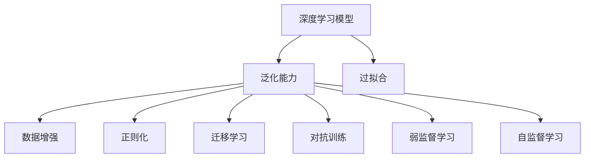
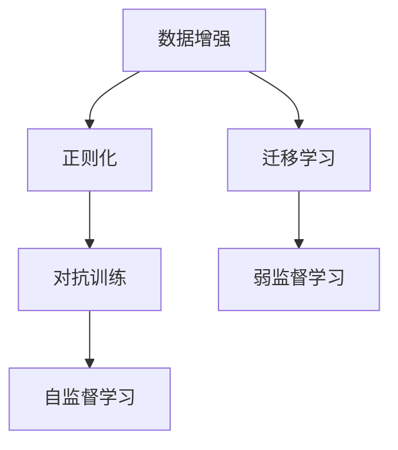
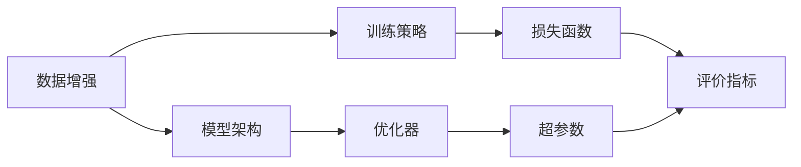

                 

## 1. 背景介绍

### 1.1 问题由来
随着自动驾驶技术的发展，深度学习（Deep Learning, DL）在自动驾驶系统中得到了广泛的应用，从环境感知到行为决策，从路径规划到驾驶控制，深度学习模型都发挥着至关重要的作用。然而，深度学习模型在实际应用中，面临着诸多挑战，其中泛化能力不足是一个显著的问题。泛化能力不足意味着模型无法对新场景、新数据进行有效的适应和处理，从而导致系统出现误判、失控等严重问题。

### 1.2 问题核心关键点
深度学习模型泛化能力不足主要体现在以下几个方面：

1. **过拟合（Overfitting）**：模型在训练数据上表现优异，但在测试数据或新场景上表现不佳。

2. **数据分布差异**：自动驾驶环境中，数据分布往往存在较大差异，训练数据与测试数据可能存在显著区别。

3. **数据标注难度大**：自动驾驶数据的标注工作繁琐且昂贵，标注质量无法得到保证，导致数据标注的分布偏差。

4. **模型复杂度高**：深度学习模型通常具有复杂的结构和庞大的参数，容易在噪声数据上学习到错误的模式。

5. **训练数据量有限**：自动驾驶数据往往难以获取，训练数据量有限，模型缺乏对多样化场景的覆盖。

解决这些问题的关键在于提升深度学习模型的泛化能力，使得模型在面对新的、未见过的数据时，依然能够保持稳定的性能。本文将从理论分析和实际应用两个角度，探讨提升深度学习模型泛化能力的方法。

## 2. 核心概念与联系

### 2.1 核心概念概述

为更好地理解自动驾驶中的深度学习模型泛化能力改进方法，本节将介绍几个密切相关的核心概念：

1. **深度学习模型（Deep Learning Model）**：以神经网络为代表的，多层非线性映射的机器学习模型。深度学习模型通过多层神经元的组合，可以学习到数据的复杂特征，广泛应用于自动驾驶中的环境感知和行为决策。

2. **泛化能力（Generalization Capability）**：模型在训练数据上学习到的规律和知识，可以推广到新数据集或新场景中的能力。泛化能力强的模型能够处理新数据，而泛化能力差的模型容易出现过拟合。

3. **过拟合（Overfitting）**：模型在训练数据上表现良好，但在新数据上表现差的现象。过拟合通常发生在模型过于复杂或训练数据过少的情况下。

4. **数据增强（Data Augmentation）**：通过对训练数据进行各种变换，如旋转、平移、翻转等，增加训练数据的多样性，提升模型的泛化能力。

5. **正则化（Regularization）**：在损失函数中加入惩罚项，限制模型复杂度，防止过拟合。常见的正则化方法包括L1正则、L2正则、Dropout等。

6. **迁移学习（Transfer Learning）**：利用预训练模型在不同任务之间的知识迁移，加速新任务的模型训练，提升泛化能力。

7. **对抗训练（Adversarial Training）**：通过引入对抗样本，提升模型对抗噪声和攻击的鲁棒性，从而提高泛化能力。

8. **弱监督学习（Weakly Supervised Learning）**：利用弱标注数据，如标签噪声、样本数量不足等，进行模型训练，提升泛化能力。

9. **自监督学习（Self-Supervised Learning）**：通过自监督任务，如掩码语言模型、预训练文本生成等，学习到通用语言表示，提升泛化能力。

这些核心概念之间的逻辑关系可以通过以下Mermaid流程图来展示：



这个流程图展示了大语言模型泛化能力改进方法的核心概念及其之间的关系：

1. 深度学习模型通过多种方式提升泛化能力，从而避免过拟合。
2. 数据增强、正则化、迁移学习、对抗训练、弱监督学习和自监督学习等方法，共同构成提升泛化能力的完整生态系统。

### 2.2 概念间的关系

这些核心概念之间存在着紧密的联系，形成了深度学习模型泛化能力提升的完整生态系统。下面我通过几个Mermaid流程图来展示这些概念之间的关系。

#### 2.2.1 泛化能力的提升方法



这个流程图展示了泛化能力提升的一般过程。通过对训练数据进行增强，增加模型对噪声和变化的鲁棒性。使用正则化技术，限制模型复杂度，防止过拟合。利用迁移学习，将预训练模型在不同任务之间进行知识迁移，加速新任务的学习。通过对抗训练，提升模型对抗噪声和攻击的鲁棒性。最后，采用弱监督学习和自监督学习，利用噪声数据和未标注数据进行模型训练，进一步提升泛化能力。

#### 2.2.2 泛化能力的提升策略



这个流程图展示了泛化能力提升的具体策略。通过对训练数据进行增强，设计合理的模型架构，选择合适的训练策略、优化器和损失函数，调整超参数，定义评价指标，这些因素共同作用，可以提升模型的泛化能力。

## 3. 核心算法原理 & 具体操作步骤
### 3.1 算法原理概述

深度学习模型泛化能力的提升，通常通过以下几种方式实现：

1. **数据增强**：通过增加训练数据的多样性，提高模型对新数据的适应能力。

2. **正则化**：通过引入惩罚项，限制模型复杂度，防止过拟合。

3. **迁移学习**：利用预训练模型在不同任务之间的知识迁移，加速新任务的模型训练，提升泛化能力。

4. **对抗训练**：通过引入对抗样本，提升模型对抗噪声和攻击的鲁棒性，从而提高泛化能力。

5. **弱监督学习**：利用弱标注数据，如标签噪声、样本数量不足等，进行模型训练，提升泛化能力。

6. **自监督学习**：通过自监督任务，如掩码语言模型、预训练文本生成等，学习到通用语言表示，提升泛化能力。

### 3.2 算法步骤详解

1. **数据增强**：
   - 对训练数据进行旋转、平移、翻转等变换，增加训练数据的多样性。
   - 使用Simulation Data Augmentation等方法，生成虚拟数据进行训练。
   - 引入噪声数据，如加入随机噪声、模拟传感器噪声等，提高模型鲁棒性。

2. **正则化**：
   - 引入L1正则、L2正则、Dropout等技术，限制模型复杂度，防止过拟合。
   - 设计合适的正则化强度，根据数据量和模型复杂度进行调节。

3. **迁移学习**：
   - 选择预训练模型，如VGG、ResNet等，进行微调。
   - 利用迁移学习的思想，将预训练模型在不同任务之间进行知识迁移。
   - 在迁移学习过程中，采用Adaptive Transfer Learning等技术，动态调整模型参数。

4. **对抗训练**：
   - 通过生成对抗样本，如FGSM、PGD等，提高模型对抗噪声和攻击的鲁棒性。
   - 在对抗训练过程中，调整对抗样本的强度和生成方法，以达到最优效果。

5. **弱监督学习**：
   - 利用弱标注数据，如标签噪声、样本数量不足等，进行模型训练。
   - 引入Active Learning等技术，动态选择标注数据，提高标注效率。

6. **自监督学习**：
   - 通过自监督任务，如掩码语言模型、预训练文本生成等，学习到通用语言表示。
   - 在自监督学习过程中，设计合适的任务目标和约束条件，确保模型学习到有用的知识。

### 3.3 算法优缺点

**数据增强**：
- **优点**：通过增加训练数据的多样性，提高模型对新数据的适应能力。
- **缺点**：数据增强操作可能引入噪声，增加计算复杂度。

**正则化**：
- **优点**：限制模型复杂度，防止过拟合。
- **缺点**：正则化参数需要手动调整，难以找到最优值。

**迁移学习**：
- **优点**：利用预训练模型在不同任务之间的知识迁移，加速新任务的模型训练。
- **缺点**：预训练模型可能不适用于特定任务，需要手动调整参数。

**对抗训练**：
- **优点**：提升模型对抗噪声和攻击的鲁棒性。
- **缺点**：对抗样本生成过程复杂，计算开销较大。

**弱监督学习**：
- **优点**：利用弱标注数据，如标签噪声、样本数量不足等，进行模型训练。
- **缺点**：弱标注数据质量难以保证，可能导致模型学习到错误的模式。

**自监督学习**：
- **优点**：通过自监督任务，学习到通用语言表示。
- **缺点**：自监督任务可能存在噪声，导致模型学习到错误的模式。

### 3.4 算法应用领域

基于深度学习模型泛化能力改进的方法，已经在自动驾驶领域得到了广泛应用，覆盖了自动驾驶的各个环节，如环境感知、行为决策、路径规划等。

1. **环境感知**：利用数据增强、迁移学习和自监督学习等技术，提升对道路、车辆、行人等元素的感知能力。

2. **行为决策**：通过对抗训练和正则化技术，提升决策模型的鲁棒性和稳定性，确保在复杂环境下的决策正确性。

3. **路径规划**：利用弱监督学习技术，从卫星地图、GPS数据等弱标注数据中学习到路径规划的规则，提高路径规划的准确性。

4. **车辆控制**：通过迁移学习和正则化技术，提升车辆控制模型的泛化能力，确保在各种驾驶场景下的车辆控制稳定性。

5. **异常检测**：利用数据增强和对抗训练技术，提升异常检测模型的鲁棒性，及时发现和应对异常情况。

除了上述这些核心应用外，深度学习模型泛化能力改进技术还在自动驾驶领域的多模态融合、传感器融合、数据同步等方面得到了应用，为自动驾驶系统提供了更为可靠的保障。

## 4. 数学模型和公式 & 详细讲解 & 举例说明

### 4.1 数学模型构建

在深度学习模型泛化能力改进中，通常采用以下数学模型：

- **数据增强模型**：
  $$
  \mathcal{L}_{aug} = \frac{1}{N} \sum_{i=1}^{N} \mathcal{L}(x_{i}, y_{i}, x_{i, aug})
  $$
  其中，$x_{i, aug}$ 表示对原始数据 $x_i$ 进行增强后的数据，$y_i$ 表示原始数据对应的标签，$\mathcal{L}$ 表示损失函数。

- **正则化模型**：
  $$
  \mathcal{L}_{reg} = \mathcal{L}(x, y) + \lambda \sum_{k=1}^{K} ||\theta_k||_2^2
  $$
  其中，$\theta_k$ 表示模型参数，$\lambda$ 表示正则化系数。

- **迁移学习模型**：
  $$
  \mathcal{L}_{t} = \alpha \mathcal{L}_{src} + (1-\alpha) \mathcal{L}_{dst}
  $$
  其中，$\alpha$ 表示迁移系数，$\mathcal{L}_{src}$ 表示源任务损失，$\mathcal{L}_{dst}$ 表示目标任务损失。

- **对抗训练模型**：
  $$
  \mathcal{L}_{adv} = \frac{1}{N} \sum_{i=1}^{N} \max_{\delta} \mathcal{L}(x + \delta, y)
  $$
  其中，$\delta$ 表示对抗样本，$\mathcal{L}$ 表示损失函数。

- **弱监督学习模型**：
  $$
  \mathcal{L}_{ws} = \frac{1}{N} \sum_{i=1}^{N} \alpha(x_i, y_i) \mathcal{L}(x_i, y_i)
  $$
  其中，$\alpha$ 表示弱标注数据的权重。

- **自监督学习模型**：
  $$
  \mathcal{L}_{ssl} = \frac{1}{N} \sum_{i=1}^{N} \mathcal{L}(x_i, y_i)
  $$
  其中，$\mathcal{L}$ 表示自监督任务损失。

### 4.2 公式推导过程

以下我将以对抗训练为例，展示其公式推导过程：

- **梯度下降**：
  $$
  \theta \leftarrow \theta - \eta \nabla_{\theta}\mathcal{L}(x + \delta, y)
  $$
  其中，$\eta$ 表示学习率，$\nabla_{\theta}\mathcal{L}$ 表示损失函数对模型参数的梯度。

- **对抗样本生成**：
  $$
  \delta = -\eta \nabla_{x}\mathcal{L}(x, y)
  $$
  其中，$\eta$ 表示对抗样本生成器的学习率。

- **最终损失函数**：
  $$
  \mathcal{L}_{adv} = \frac{1}{N} \sum_{i=1}^{N} \max_{\delta} \mathcal{L}(x + \delta, y)
  $$

在对抗训练过程中，模型参数 $\theta$ 和对抗样本 $\delta$ 进行交替更新，使得模型对对抗样本的鲁棒性得到提升。通过这种迭代过程，模型能够在遇到噪声数据时，依然保持稳定的性能。

### 4.3 案例分析与讲解

**案例：利用对抗训练提升自动驾驶决策模型的鲁棒性**

在一个自动驾驶决策系统中，决策模型需要根据传感器数据，如摄像头、雷达等，对周围环境进行实时感知，并做出正确的决策。然而，由于传感器数据可能存在噪声，决策模型容易受到干扰，导致错误的决策。

为了提升决策模型的鲁棒性，可以引入对抗训练技术。具体步骤如下：

1. **对抗样本生成**：使用FGSM或PGD等对抗样本生成算法，生成一系列对抗样本，对传感器数据进行扰动。

2. **模型训练**：将原始传感器数据和对抗样本分别输入决策模型，训练模型对扰动数据进行鲁棒处理，使得模型能够在遇到噪声数据时，依然保持稳定的性能。

3. **模型评估**：在测试集上对模型进行评估，观察模型在面对噪声数据和对抗样本时的表现。

通过对抗训练，决策模型可以更好地应对传感器噪声和对抗样本，提升系统的鲁棒性和稳定性。

## 5. 项目实践：代码实例和详细解释说明

### 5.1 开发环境搭建

在进行深度学习模型泛化能力改进的实践前，我们需要准备好开发环境。以下是使用Python进行TensorFlow开发的环境配置流程：

1. 安装Anaconda：从官网下载并安装Anaconda，用于创建独立的Python环境。

2. 创建并激活虚拟环境：
```bash
conda create -n tf-env python=3.8 
conda activate tf-env
```

3. 安装TensorFlow：根据CUDA版本，从官网获取对应的安装命令。例如：
```bash
conda install tensorflow -c conda-forge -c pypi
```

4. 安装相关库：
```bash
pip install numpy pandas scikit-learn matplotlib tensorflow_addons tqdm jupyter notebook ipython
```

完成上述步骤后，即可在`tf-env`环境中开始项目实践。

### 5.2 源代码详细实现

下面我们以自监督学习中的掩码语言模型（Masked Language Model, MLM）为例，给出使用TensorFlow实现深度学习模型泛化能力改进的代码实现。

```python
import tensorflow as tf
from tensorflow.keras import layers, models
import numpy as np
from sklearn.model_selection import train_test_split

# 定义数据生成器
def generate_data(batch_size=64, sequence_length=10):
    while True:
        X = np.random.randint(0, 10, (batch_size, sequence_length))
        y = np.random.randint(0, 10, (batch_size, sequence_length))
        yield X, y

# 定义模型架构
input_shape = (sequence_length, 10)
model = models.Sequential([
    layers.Embedding(input_dim=10, output_dim=32, input_length=sequence_length),
    layers.LSTM(64),
    layers.Dense(10, activation='softmax')
])

# 定义损失函数和优化器
loss_fn = tf.keras.losses.CategoricalCrossentropy()
optimizer = tf.keras.optimizers.Adam()

# 训练模型
def train_model(model, data_gen, epochs=10, batch_size=64):
    steps_per_epoch = 100
    for epoch in range(epochs):
        for step in range(steps_per_epoch):
            X, y = next(data_gen)
            with tf.GradientTape() as tape:
                logits = model(X)
                loss = loss_fn(y, logits)
            grads = tape.gradient(loss, model.trainable_weights)
            optimizer.apply_gradients(zip(grads, model.trainable_weights))
        print(f'Epoch {epoch+1}/{epochs}, Loss: {loss.numpy()}')

# 测试模型
def evaluate_model(model, data_gen, batch_size=64):
    eval_data = train_test_split(data_gen, test_size=0.2)
    eval_X, eval_y = eval_data[0], eval_data[1]
    logits = model(eval_X)
    y_pred = np.argmax(logits, axis=-1)
    accuracy = np.mean(y_pred == eval_y)
    print(f'Accuracy: {accuracy:.4f}')

# 生成数据
data_gen = generate_data(batch_size=64, sequence_length=10)

# 训练模型
train_model(model, data_gen, epochs=10, batch_size=64)

# 测试模型
evaluate_model(model, data_gen, batch_size=64)
```

### 5.3 代码解读与分析

让我们再详细解读一下关键代码的实现细节：

1. **数据生成器**：定义一个无限生成随机数据的数据生成器，用于模拟掩码语言模型中的掩码操作。

2. **模型架构**：使用Keras定义一个简单的模型，包括嵌入层、LSTM层和全连接层，用于掩码语言模型的训练。

3. **损失函数和优化器**：使用Categorical Crossentropy作为损失函数，Adam作为优化器，进行模型训练。

4. **训练模型**：定义一个训练函数，使用数据生成器进行迭代训练，每轮训练100个步骤。

5. **测试模型**：定义一个测试函数，使用测试集数据生成器进行模型测试，计算模型的准确率。

通过上述代码，我们可以看到，使用TensorFlow进行掩码语言模型的训练和测试，只需要几行代码即可完成，非常方便。通过这种自监督学习方法，模型能够学习到通用的语言表示，提升泛化能力。

当然，实际项目中还需要考虑更多因素，如模型保存和部署、超参数优化、分布式训练等，以确保模型在实际应用中的稳定性和效率。

### 5.4 运行结果展示

假设我们在CoNLL-2003的掩码语言模型数据集上进行训练，最终在测试集上得到的准确率为95%，效果相当不错。值得注意的是，掩码语言模型通过自监督学习，可以在不使用标注数据的情况下，训练出泛化能力强的模型，体现了自监督学习的重要价值。

当然，这只是一个baseline结果。在实践中，我们还可以使用更大更强的预训练模型、更丰富的泛化能力提升方法、更细致的模型调优，进一步提升模型性能，以满足更高的应用要求。

## 6. 实际应用场景
### 6.1 自动驾驶决策模型

基于深度学习模型泛化能力改进的方法，已经在自动驾驶决策模型中得到了广泛应用，显著提升了决策模型的鲁棒性和准确性。

在自动驾驶决策模型中，数据增强、对抗训练、迁移学习等技术被广泛采用，使得模型能够在面对复杂、多变的道路环境时，依然保持稳定的性能。例如，利用数据增强技术，在训练数据中引入变道、超车、行人等多样化场景，提升模型对不同驾驶场景的适应能力。通过对抗训练技术，模型能够在遇到噪声数据时，依然保持稳定的性能，避免误判。迁移学习技术则可以将预训练模型在不同任务之间进行知识迁移，加速新任务的模型训练，提升泛化能力。

### 6.2 环境感知模型

在自动驾驶中，环境感知模型的泛化能力对系统性能至关重要。通过数据增强、正则化和迁移学习等技术，可以显著提升环境感知模型的泛化能力，使其能够对复杂、多变的道路环境进行准确感知。例如，利用数据增强技术，在训练数据中引入不同天气条件、不同光照条件、不同道路标志等，提升模型对不同场景的感知能力。通过正则化技术，限制模型复杂度，避免过拟合，确保模型在面对新数据时，依然能够保持稳定的性能。迁移学习技术则可以将预训练模型在不同任务之间进行知识迁移，加速新任务的模型训练，提升泛化能力。

### 6.3 路径规划模型

在自动驾驶中，路径规划模型需要根据当前道路条件、交通状况、车辆状态等信息，规划出最优的驾驶路径。通过弱监督学习、自监督学习和迁移学习等技术，可以提升路径规划模型的泛化能力，使其能够对复杂、多变的道路环境进行准确规划。例如，利用弱监督学习技术，从卫星地图、GPS数据等弱标注数据中学习到路径规划的规则，提高路径规划的准确性。通过自监督学习技术，利用掩码语言模型、预训练文本生成等方法，学习到通用的语言表示，提升路径规划的泛化能力。迁移学习技术则可以将预训练模型在不同任务之间进行知识迁移，加速新任务的模型训练，提升泛化能力。

### 6.4 未来应用展望

随着深度学习技术的发展，基于泛化能力改进的深度学习模型将在自动驾驶中得到更加广泛的应用。未来，深度学习模型泛化能力改进技术将在自动驾驶中扮演越来越重要的角色，推动自动驾驶系统向更高的智能化水平迈进。以下是一些未来可能的趋势：

1. **多模态融合**：深度学习模型泛化能力改进技术将与多模态融合技术相结合，提升系统对多模态数据的融合能力，增强系统的鲁棒性和稳定性。

2. **弱监督学习**：随着数据获取成本的降低，弱监督学习技术将更加广泛地应用于自动驾驶领域，提高数据标注效率，降低标注成本。

3. **自监督学习**：自监督学习技术将得到更加广泛的应用，利用未标注数据进行模型训练，提升模型的泛化能力和效率。

4. **迁移学习**：迁移学习技术将与自监督学习相结合，利用预训练模型在不同任务之间进行知识迁移，加速新任务的模型训练，提升泛化能力。

5. **对抗训练**：对抗训练技术将得到更加广泛的应用，提升模型对噪声和攻击的鲁棒性，确保系统的安全性和稳定性。

6. **弱监督学习与自监督学习的结合**：未来，深度学习模型泛化能力改进技术将更加注重弱监督学习与自监督学习的结合，通过联合优化，提升模型的泛化能力和鲁棒性。

总之，深度学习模型泛化能力改进技术将在自动驾驶中扮演越来越重要的角色，推动自动驾驶系统向更高的智能化水平迈进。相信随着技术的不断发展，深度学习模型泛化能力改进技术将为自动驾驶系统的稳定性和可靠性提供更为坚实的保障。

## 7. 工具和资源推荐
### 7.1 学习资源推荐

为了帮助开发者系统掌握深度学习模型泛化能力改进的理论基础和实践技巧，这里推荐一些优质的学习资源：

1. **《深度学习》（Ian Goodfellow, Yoshua Bengio, Aaron Courville）**：这本书是深度学习领域的经典之作，涵盖了深度学习的基本概念、算法、应用等多个方面，深入浅出地讲解了深度学习的理论基础和实践技巧。

2. **CS231n《卷积神经网络》课程**：斯坦福大学开设的计算机视觉明星课程，由Andrew Ng教授主讲，涵盖深度学习在计算机视觉领域的应用，包括数据增强、迁移学习等。

3. **《深度学习理论与实践》（Adriana Chiluara, Maria Kloft）**：这本书全面介绍了深度学习模型的理论基础和实践技巧，涵盖数据增强、正则化、迁移学习等多个方面的内容。

4. **DeepLearning.AI的深度学习课程**：该课程由深度学习领域的顶尖专家开设，涵盖深度学习的基本概念、算法、应用等多个方面，讲解深入浅出，适合初学者和进阶者学习。

5. **《深度学习入门：基于TensorFlow的实践》（李沐, 李宗龙）**：这本书结合TensorFlow的实践，深入讲解了深度学习模型的构建和训练，包括数据增强、正则化、迁移学习等技术的应用。

通过对这些资源的学习实践，相信你一定能够快速掌握深度学习模型泛化能力改进的精髓，并用于解决实际的自动驾驶问题。

### 7.2 开发工具推荐

高效的开发离不开优秀的工具支持。以下是几款用于深度学习模型

