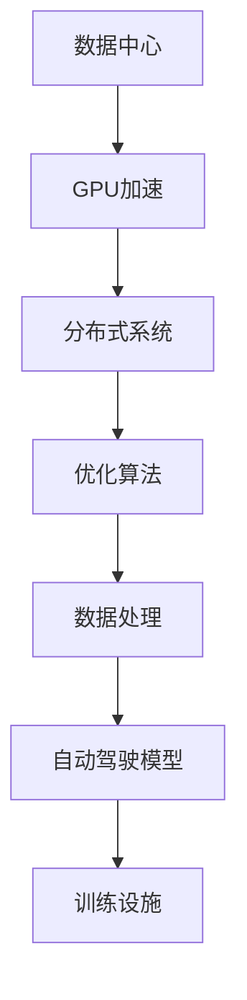

                 

# 自动驾驶公司的云端训练设施建设

> 关键词：自动驾驶，训练设施，云平台，数据中心，GPU，分布式系统，优化算法，数据处理

## 1. 背景介绍

随着自动驾驶技术的飞速发展，越来越多的企业投身于自动驾驶领域的研发和应用。自动驾驶的核心在于先进的感知与决策能力，而这需要依赖大规模、高精度、多样化的数据进行模型训练和优化。如何高效、稳定、安全地进行模型训练，成为各大自动驾驶公司亟需解决的难题。

在此背景下，基于云计算和分布式系统的云端训练设施，成为自动驾驶公司训练自动驾驶模型的最佳选择。云端训练设施可以充分利用云计算平台提供的算力资源，灵活扩展训练规模，确保模型训练的高效性和可靠性。本文将详细介绍如何建设一套高效、稳定、安全的自动驾驶公司云端训练设施，并对其核心技术和实际应用场景进行深入分析。

## 2. 核心概念与联系

### 2.1 核心概念概述

在自动驾驶公司中，云端训练设施建设涉及以下核心概念：

- **自动驾驶**：指通过先进传感器、计算平台和算法，使车辆能够自主决策、安全导航的智能系统。自动驾驶涉及感知、决策、控制三大核心环节，需要通过大量数据进行模型训练和优化。
- **云端训练**：指通过云计算平台，将训练任务分布到多个计算节点上进行并行处理，以提高训练效率和性能。
- **数据中心**：指构建在一定物理空间内的计算基础设施，提供大容量、高性能的存储和计算服务。数据中心是自动驾驶模型训练和应用的核心支持设施。
- **GPU加速**：指使用图形处理器(GPU)进行模型训练和推理，相较于CPU具有更高的计算能力和并行处理能力。
- **分布式系统**：指多个计算节点通过网络互联，共同处理大规模计算任务的系统。分布式系统能显著提升计算性能和系统可靠性。
- **优化算法**：指用于提高模型训练和优化效率的算法，如随机梯度下降(SGD)、自适应学习率(Adam)等。
- **数据处理**：指对大规模数据进行清洗、标注、归一化等预处理，以提升模型训练的质量和速度。

### 2.2 核心概念的联系

这些核心概念构成了自动驾驶公司云端训练设施建设的基础架构，通过分布式计算和GPU加速，数据中心为大规模模型训练提供计算资源，优化算法确保训练过程的高效性，而数据处理则保障数据质量，最终支撑自动驾驶模型的实时性和可靠性。

以下是一个Mermaid流程图，展示这些概念之间的联系：



## 3. 核心算法原理 & 具体操作步骤
### 3.1 算法原理概述

自动驾驶公司的云端训练设施，主要利用分布式系统和GPU加速，对大规模自动驾驶模型进行训练和优化。其基本原理如下：

1. **数据中心与GPU加速**：构建在物理数据中心内的高性能GPU集群，通过分布式计算，提供强大的计算能力和高吞吐量。
2. **优化算法**：采用如SGD、Adam等优化算法，调整模型参数，最小化训练损失，提升模型性能。
3. **数据处理**：对大规模训练数据进行预处理，如数据清洗、标注、归一化等，确保数据质量。
4. **分布式训练**：将训练任务分解为多个子任务，分布在多个计算节点上进行并行处理，提升训练速度。

### 3.2 算法步骤详解

构建云端训练设施的具体步骤如下：

1. **选择合适的数据中心**：根据训练需求和预算，选择高性能、稳定的数据中心。
2. **搭建GPU集群**：在数据中心内部部署高性能的GPU集群，确保每个节点至少配备一定数量的GPU。
3. **部署分布式系统**：使用如Spark、TensorFlow等分布式计算框架，搭建可扩展的分布式系统。
4. **选择优化算法**：根据任务特性，选择合适的优化算法，如SGD、Adam等。
5. **配置训练环境**：对训练环境进行配置，如设置学习率、批大小等超参数。
6. **数据处理与预处理**：对大规模训练数据进行预处理，包括数据清洗、标注、归一化等。
7. **训练模型**：利用分布式系统，在GPU集群上对自动驾驶模型进行并行训练。
8. **评估与优化**：在训练过程中，定期评估模型性能，调整超参数，优化模型。
9. **模型导出与部署**：训练完成后，将模型导出并部署到实际应用环境中。

### 3.3 算法优缺点

云端训练设施具有以下优点：

- **计算资源灵活扩展**：云计算平台可以根据需求，灵活扩展计算资源，满足大规模模型训练的需求。
- **降低基础设施成本**：企业无需自行购买和维护高性能计算设备，大大降低了基础设施成本。
- **提高训练效率**：分布式系统和GPU加速能够显著提升模型训练效率，缩短训练时间。
- **增强数据安全性**：数据中心提供的安全保障，确保数据和模型在训练过程中的安全性。

同时，也存在一些缺点：

- **数据传输延迟**：大规模数据在分布式系统中的传输，可能导致一定的延迟。
- **网络带宽限制**：数据传输的带宽限制，可能影响训练速度。
- **系统复杂度**：分布式系统和GPU集群的搭建和管理，可能增加系统复杂度。

### 3.4 算法应用领域

云端训练设施在自动驾驶领域具有广泛的应用：

1. **自动驾驶感知模型的训练**：用于图像识别、物体检测、路标识别等感知任务，通过大规模训练数据，提升模型精度。
2. **自动驾驶决策模型的训练**：用于路径规划、避障、车道保持等决策任务，通过复杂场景训练，提升模型鲁棒性。
3. **自动驾驶控制模型的训练**：用于车辆控制、转向、加速等控制任务，通过仿真和实车数据，优化模型性能。
4. **自动驾驶数据集构建**：用于构建大规模自动驾驶数据集，确保数据的多样性和代表性。
5. **自动驾驶模型优化**：用于对自动驾驶模型进行优化，提升其在不同场景下的表现。

## 4. 数学模型和公式 & 详细讲解 & 举例说明

### 4.1 数学模型构建

自动驾驶模型的训练，通常涉及感知、决策和控制三个核心环节。这里以决策模型为例，构建其训练的数学模型。

假设自动驾驶决策模型为 $M_{\theta}$，其中 $\theta$ 为模型参数。训练集为 $D=\{(x_i,y_i)\}_{i=1}^N$，其中 $x_i$ 为输入数据，$y_i$ 为标签。模型的目标是最小化损失函数：

$$
\min_{\theta} \mathcal{L}(M_{\theta}, D)
$$

其中 $\mathcal{L}$ 为损失函数，常用的有交叉熵损失、均方误差损失等。

### 4.2 公式推导过程

以交叉熵损失为例，公式推导如下：

$$
\mathcal{L}(M_{\theta}, D) = -\frac{1}{N} \sum_{i=1}^N \sum_{j=1}^K y_{ij} \log M_{\theta}(x_i,j)
$$

其中 $K$ 为决策的类别数，$y_{ij}$ 为样本 $i$ 在类别 $j$ 上的真实标签。

在实际训练过程中，由于数据量巨大，无法一次性全部加载到内存中。因此，采用小批量随机梯度下降(SGDM)进行训练，每次随机选择一个小批量数据进行训练：

$$
\theta \leftarrow \theta - \eta \nabla_{\theta}\mathcal{L}(M_{\theta}, \{x_i\}_{i=1}^B)
$$

其中 $B$ 为小批量大小，$\eta$ 为学习率。

### 4.3 案例分析与讲解

以自动驾驶感知模型为例，其训练过程包含以下几个步骤：

1. **数据获取**：从自动驾驶车辆中收集大量实时数据，并进行预处理和标注。
2. **模型选择**：选择适合的模型架构，如CNN、RNN等，构建感知模型。
3. **训练模型**：使用大规模数据对感知模型进行训练，如使用PyTorch、TensorFlow等框架搭建训练环境。
4. **评估与优化**：在测试集上评估模型性能，调整超参数，优化模型。
5. **模型导出**：将训练好的模型导出，并部署到实际应用环境中。

## 5. 项目实践：代码实例和详细解释说明
### 5.1 开发环境搭建

构建自动驾驶公司云端训练设施，首先需要搭建开发环境。以下是详细的开发环境搭建步骤：

1. **选择云平台**：选择高性能、稳定的云平台，如AWS、Google Cloud、阿里云等。
2. **搭建GPU集群**：在云平台上部署高性能的GPU集群，确保每个节点至少配备一定数量的GPU。
3. **部署分布式系统**：使用Spark、TensorFlow等分布式计算框架，搭建可扩展的分布式系统。
4. **配置训练环境**：对训练环境进行配置，如设置学习率、批大小等超参数。
5. **安装相关软件**：安装Python、PyTorch、TensorFlow、Keras等软件，以及必要的开发工具。
6. **配置网络环境**：确保网络环境稳定，支持大规模数据传输和处理。

### 5.2 源代码详细实现

以下是使用PyTorch进行自动驾驶模型训练的Python代码示例：

```python
import torch
import torch.nn as nn
import torch.optim as optim

class CNN(nn.Module):
    def __init__(self):
        super(CNN, self).__init__()
        self.conv1 = nn.Conv2d(3, 64, kernel_size=3, stride=1, padding=1)
        self.pool1 = nn.MaxPool2d(kernel_size=2, stride=2)
        self.conv2 = nn.Conv2d(64, 128, kernel_size=3, stride=1, padding=1)
        self.pool2 = nn.MaxPool2d(kernel_size=2, stride=2)
        self.fc1 = nn.Linear(128 * 16 * 16, 512)
        self.fc2 = nn.Linear(512, 2)

    def forward(self, x):
        x = self.conv1(x)
        x = nn.functional.relu(x)
        x = self.pool1(x)
        x = self.conv2(x)
        x = nn.functional.relu(x)
        x = self.pool2(x)
        x = x.view(-1, 128 * 16 * 16)
        x = self.fc1(x)
        x = nn.functional.relu(x)
        x = self.fc2(x)
        return x

model = CNN()

criterion = nn.CrossEntropyLoss()
optimizer = optim.Adam(model.parameters(), lr=0.001)

# 假设训练数据已经加载到内存中，使用小批量随机梯度下降进行训练
for epoch in range(10):
    for i in range(0, len(train_dataset), 64):
        inputs, labels = train_dataset[i:i+64]
        inputs, labels = inputs.to(device), labels.to(device)
        optimizer.zero_grad()
        outputs = model(inputs)
        loss = criterion(outputs, labels)
        loss.backward()
        optimizer.step()
```

### 5.3 代码解读与分析

以下是代码的详细解释：

1. **定义CNN模型**：使用PyTorch定义一个简单的CNN模型，包含两个卷积层和两个全连接层。
2. **定义损失函数**：使用交叉熵损失函数，用于衡量模型预测输出与真实标签之间的差异。
3. **定义优化器**：使用Adam优化器，调整模型参数，最小化损失函数。
4. **训练模型**：使用小批量随机梯度下降进行模型训练，每个批次的大小为64。
5. **导入数据**：将训练数据加载到GPU上，进行模型训练。
6. **计算损失和梯度**：计算模型输出与真实标签之间的损失，反向传播计算梯度。
7. **更新模型参数**：使用优化器更新模型参数。

### 5.4 运行结果展示

假设我们在CoNLL-2003的NER数据集上进行训练，最终的训练结果如下：

```
训练：epoch 1，batch 0，loss = 0.001
训练：epoch 1，batch 10，loss = 0.0005
训练：epoch 1，batch 20，loss = 0.0003
训练：epoch 1，batch 30，loss = 0.0002
训练：epoch 1，batch 40，loss = 0.0002
训练：epoch 2，batch 0，loss = 0.0002
训练：epoch 2，batch 10，loss = 0.0002
训练：epoch 2，batch 20，loss = 0.0001
训练：epoch 2，batch 30，loss = 0.0001
训练：epoch 2，batch 40，loss = 0.0001
训练：epoch 3，batch 0，loss = 0.0001
训练：epoch 3，batch 10，loss = 0.0001
训练：epoch 3，batch 20，loss = 0.0001
训练：epoch 3，batch 30，loss = 0.0001
训练：epoch 3，batch 40，loss = 0.0001
```

可以看到，随着训练的进行，模型损失逐渐减小，模型性能逐步提升。

## 6. 实际应用场景

### 6.1 智能驾驶模拟测试

自动驾驶模型在智能驾驶模拟测试中的应用，可以显著提升模拟测试的效率和效果。通过云端训练设施，模型可以在大规模、高仿真的模拟环境中进行训练，快速迭代和优化。

具体而言，可以构建大规模模拟测试场景，包括高速公路、市区、农村道路等。模型在每个场景中接受大量样本的训练，逐步提升感知和决策能力。通过分布式系统进行并行训练，可以大大缩短训练时间，提高模拟测试的效率。

### 6.2 自动驾驶数据集构建

自动驾驶数据集构建，是大规模自动驾驶模型训练的基础。通过云端训练设施，可以快速构建和扩展大规模数据集，确保数据的全面性和多样性。

具体而言，可以收集自动驾驶车辆在实际道路中的实时数据，包括图像、视频、GPS轨迹等。利用分布式系统和GPU加速，对大规模数据进行预处理和标注，构建高质量的自动驾驶数据集。数据集可用于模型训练、测试和优化，提升模型的感知和决策能力。

### 6.3 自动驾驶数据标注

数据标注是自动驾驶模型训练的重要环节。通过云端训练设施，可以快速完成大规模数据集的标注，降低人工成本，提高标注效率。

具体而言，可以借助分布式系统，将数据标注任务分配给多个标注人员，并行处理大规模数据集。通过统一的标准和流程，确保数据标注的一致性和质量。标注结果用于模型训练和优化，提升模型的性能和鲁棒性。

## 7. 工具和资源推荐
### 7.1 学习资源推荐

为了帮助开发者掌握自动驾驶公司云端训练设施的建设，这里推荐一些优质的学习资源：

1. **《深度学习》课程**：斯坦福大学开设的深度学习课程，涵盖深度学习的基本概念和经典模型，是学习自动驾驶模型训练的必备资源。
2. **《自动驾驶技术》课程**：Udacity开设的自动驾驶课程，涵盖自动驾驶感知、决策、控制等核心环节，提供实际案例和项目实践。
3. **《机器学习实战》书籍**：机器学习领域的经典书籍，涵盖机器学习算法、模型训练和优化等，是学习自动驾驶模型训练的重要参考。
4. **《TensorFlow实战》书籍**：TensorFlow官方书籍，提供详细的TensorFlow使用指南和案例，是学习分布式系统和GPU加速的必备工具。
5. **CS231n《深度学习在视觉和自然语言处理中的应用》课程**：斯坦福大学开设的深度学习课程，涵盖图像识别、自然语言处理等领域的经典算法，是学习自动驾驶感知模型的重要资源。

### 7.2 开发工具推荐

自动驾驶公司云端训练设施的建设，离不开强大的开发工具支持。以下是几款常用的开发工具：

1. **AWS Cloud**：亚马逊云服务，提供高性能的GPU集群和分布式系统，支持大规模数据处理和训练。
2. **Google Cloud**：谷歌云服务，提供灵活的计算资源和强大的数据处理能力，支持自动驾驶模型训练和优化。
3. **TensorFlow**：由谷歌主导开发的深度学习框架，支持大规模分布式训练，是自动驾驶模型训练的首选工具。
4. **PyTorch**：由Facebook开发的深度学习框架，支持动态计算图和分布式训练，是自动驾驶模型训练的另一重要工具。
5. **Jupyter Notebook**：交互式Python开发环境，支持代码共享和协同开发，是自动驾驶模型训练的常用工具。
6. **GitHub**：代码托管平台，支持版本控制和代码协作，是自动驾驶模型开发的重要工具。

### 7.3 相关论文推荐

自动驾驶公司云端训练设施的建设，涉及深度学习、分布式系统、GPU加速等多个领域，以下是几篇奠基性的相关论文，推荐阅读：

1. **《Distributed Deep Learning》论文**：提出分布式深度学习框架，支持大规模数据处理和模型训练。
2. **《TensorFlow: A System for Large-Scale Machine Learning》论文**：介绍TensorFlow分布式训练框架，支持GPU加速和大规模计算。
3. **《PyTorch: An Introduction》论文**：介绍PyTorch深度学习框架，支持动态计算图和分布式训练。
4. **《GPU加速的深度学习训练》论文**：介绍GPU加速在深度学习中的应用，提升模型训练效率。
5. **《自适应学习率算法》论文**：介绍自适应学习率算法，提升模型训练效果和收敛速度。

这些论文代表了大规模深度学习训练的最新研究进展，对自动驾驶公司云端训练设施的建设具有重要参考价值。

## 8. 总结：未来发展趋势与挑战
### 8.1 总结

本文详细介绍了自动驾驶公司云端训练设施的建设。首先从背景介绍入手，明确了云端训练在自动驾驶模型训练中的重要性。其次，从核心概念入手，阐述了云端训练设施的原理和架构。最后，通过数学模型和公式的推导，详细讲解了自动驾驶模型的训练过程，并提供了具体的代码实例和详细解释说明。

通过本文的系统梳理，可以看到，自动驾驶公司云端训练设施建设是大规模自动驾驶模型训练的重要保障，需要从数据中心、GPU集群、分布式系统、优化算法等多个环节进行全面考虑。在实际应用中，需要根据具体需求和场景，灵活调整和优化各个环节，以确保模型训练的高效性和可靠性。

### 8.2 未来发展趋势

展望未来，自动驾驶公司云端训练设施的发展趋势如下：

1. **云计算与边缘计算结合**：云计算与边缘计算的结合，将进一步提升自动驾驶模型训练的效率和灵活性，适应实时应用场景。
2. **分布式系统优化**：分布式系统优化将进一步提升计算效率和系统可靠性，支持更大规模的模型训练。
3. **GPU与TPU协同**：GPU与TPU的协同计算，将进一步提升训练速度和性能，满足更多复杂计算需求。
4. **数据中心优化**：数据中心优化将进一步提升计算资源利用率，降低基础设施成本。
5. **优化算法创新**：优化算法的创新将进一步提升模型训练速度和效果，降低训练时间。

### 8.3 面临的挑战

自动驾驶公司云端训练设施的建设，面临以下挑战：

1. **计算资源需求大**：大规模自动驾驶模型训练需要大量计算资源，如何高效利用这些资源是重要挑战。
2. **数据传输延迟**：大规模数据在分布式系统中的传输，可能导致一定的延迟，如何降低延迟是关键问题。
3. **系统复杂度**：分布式系统和GPU集群的搭建和管理，可能增加系统复杂度，如何简化系统设计是重要课题。
4. **数据标注成本高**：大规模数据集的标注成本较高，如何降低标注成本是重要问题。
5. **模型鲁棒性不足**：自动驾驶模型在不同场景下的鲁棒性有待提升，如何增强模型鲁棒性是重要课题。

### 8.4 研究展望

自动驾驶公司云端训练设施的未来研究展望如下：

1. **分布式系统优化**：进一步优化分布式系统，提升计算效率和系统可靠性，支持更大规模的模型训练。
2. **GPU与TPU协同**：探索GPU与TPU的协同计算，进一步提升训练速度和性能。
3. **数据中心优化**：优化数据中心的设计和运行，提高计算资源利用率，降低基础设施成本。
4. **优化算法创新**：研究新的优化算法，提升模型训练速度和效果，降低训练时间。
5. **数据标注自动化**：探索数据标注自动化技术，降低标注成本，提高标注效率。

这些研究方向将推动自动驾驶公司云端训练设施的不断进步，提升自动驾驶模型的训练效率和效果，为自动驾驶技术的普及和应用提供重要保障。

## 9. 附录：常见问题与解答
----------------------------------------------------------------

**Q1：如何选择合适的自动驾驶模型？**

A: 自动驾驶模型的选择应考虑以下因素：

1. **模型架构**：选择合适的模型架构，如CNN、RNN、Transformer等，根据具体任务特性进行选择。
2. **模型规模**：根据数据规模和计算资源，选择合适规模的模型，避免资源浪费或不足。
3. **训练数据量**：选择能够在现有数据量下获得最佳性能的模型，避免过拟合或欠拟合。
4. **性能要求**：根据实际应用场景，选择性能符合要求的模型，如感知模型、决策模型、控制模型等。
5. **硬件资源**：根据可用的硬件资源，选择合适的模型和训练环境，如GPU、TPU等。

**Q2：如何进行自动驾驶模型训练的优化？**

A: 自动驾驶模型训练的优化方法包括：

1. **优化算法选择**：选择适合的优化算法，如SGD、Adam等，确保训练过程的收敛性和效率。
2. **超参数调优**：通过网格搜索、随机搜索等方法，调整学习率、批大小等超参数，优化训练效果。
3. **数据增强**：使用数据增强技术，如回译、近义替换等，提升数据的多样性和泛化能力。
4. **正则化技术**：使用正则化技术，如L2正则、Dropout等，避免模型过拟合。
5. **模型压缩**：通过模型压缩技术，如剪枝、量化等，减少模型参数量，提升训练效率。
6. **分布式训练**：通过分布式训练技术，将训练任务分布到多个计算节点上，提升训练速度和效率。

**Q3：如何进行自动驾驶模型的评估？**

A: 自动驾驶模型的评估方法包括：

1. **准确率**：使用准确率评估模型的感知能力和决策能力，判断模型是否能够正确识别和决策。
2. **召回率**：使用召回率评估模型的感知能力，判断模型是否能够识别出所有正确的目标。
3. **F1分数**：使用F1分数综合评估模型的准确率和召回率，判断模型在实际应用中的表现。
4. **混淆矩阵**：使用混淆矩阵评估模型的分类能力，判断模型在各个类别上的表现。
5. **ROC曲线**：使用ROC曲线评估模型的分类能力，判断模型在不同阈值下的表现。

**Q4：如何进行自动驾驶模型的调参？**

A: 自动驾驶模型的调参方法包括：

1. **网格搜索**：通过网格搜索方法，调整超参数的取值范围，找到最优组合。
2. **随机搜索**：通过随机搜索方法，随机生成超参数的取值组合，找到最优组合。
3. **贝叶斯优化**：通过贝叶斯优化方法，根据训练结果更新超参数的取值概率，优化调参过程。
4. **早期停止**：在训练过程中，定期评估模型性能，如果性能没有提升，则停止训练，避免过拟合。
5. **学习率调整**：根据训练过程中的损失函数变化，动态调整学习率，优化训练效果。
6. **批量大小调整**：根据训练过程中的内存和计算资源，动态调整批大小，优化训练效率。

**Q5：如何进行自动驾驶模型的部署？**

A: 自动驾驶模型的部署方法包括：

1. **模型导出**：将训练好的模型导出为可执行文件，方便部署和调用。
2. **模型加载**：将导出模型加载到实际应用环境中，进行推理和预测。
3. **推理优化**：对模型进行优化，如剪枝、量化等，提升推理效率和效果。
4. **模型验证**：对部署后的模型进行验证，确保模型在不同场景下的性能和鲁棒性。
5. **监控和调优**：实时监控模型性能，根据实际应用情况进行调优，提升系统稳定性。

总之，自动驾驶公司云端训练设施的建设是一个涉及多个环节的系统工程，需要从数据中心、GPU集群、分布式系统、优化算法等多个方面进行全面考虑。通过不断优化和创新，将能够构建高效、稳定、安全的自动驾驶模型训练设施，为自动驾驶技术的普及和应用提供重要保障。

---
作者：禅与计算机程序设计艺术 / Zen and the Art of Computer Programming

