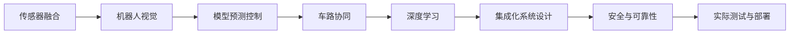
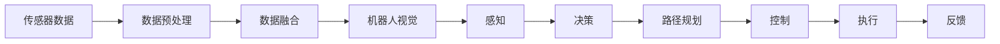
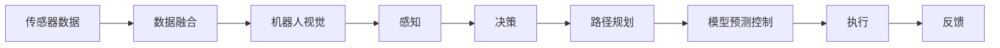
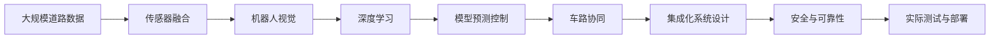

                 

# 自动驾驶领域的顶会论文解读系列之IROS篇

> 关键词：自动驾驶, 智能交通, 传感器融合, 机器人视觉, 模型预测控制, 车路协同, 深度学习, 集成化系统设计, 安全与可靠性, 实际测试与部署

## 1. 背景介绍

### 1.1 问题由来
自动驾驶技术的兴起，彻底改变了人类的出行方式。从最初辅助驾驶系统到全自动驾驶，自动驾驶技术正逐步走向成熟。然而，自动驾驶系统不仅是一个技术问题，更是一个涉及多学科交叉的综合系统工程。如何在多传感器融合、高精度定位、路径规划、决策控制等方面实现协同工作，使得车辆在复杂多变的环境下安全、可靠、高效地运行，是当前自动驾驶研究领域的重要研究方向。

### 1.2 问题核心关键点
自动驾驶领域的研究主要集中在以下几个关键点：

- 传感器融合：多源数据融合是自动驾驶系统的基础，通过融合来自不同传感器的数据，提升系统感知能力。
- 机器人视觉：利用计算机视觉技术，对道路场景进行识别、分割和理解，提取交通标志、行人和其他车辆信息。
- 模型预测控制：通过预测模型，对车辆进行精确控制，保证路径规划和决策的准确性。
- 车路协同：通过车辆与道路基础设施的协同工作，提升交通流效率和安全性。
- 深度学习：深度学习技术在大规模数据训练和复杂场景识别中表现出色，已广泛应用于自动驾驶的多个环节。
- 集成化系统设计：将自动驾驶系统设计成一个集成化系统，整合各子系统的功能，提高系统的整体效能。
- 安全与可靠性：确保自动驾驶系统在各种工况下的安全性，建立可靠的系统架构。
- 实际测试与部署：在实际道路环境中测试系统性能，确保技术应用的可行性和实用性。

### 1.3 问题研究意义
自动驾驶领域的研究不仅推动了智能交通的发展，还对社会经济、环境保护等方面有着深远影响。掌握自动驾驶的核心技术，可以加速产业升级，促进社会进步。

自动驾驶技术的应用，将极大地提升交通安全，降低交通事故的发生率。同时，自动驾驶系统能够缓解交通拥堵，减少碳排放，推动可持续发展。此外，自动驾驶技术还将改变出行方式，提升出行效率，提供更加便捷和舒适的驾乘体验。

## 2. 核心概念与联系

### 2.1 核心概念概述

为更好地理解自动驾驶领域的核心技术，本节将介绍几个密切相关的核心概念：

- **传感器融合**：自动驾驶系统通常使用多个传感器（如激光雷达、摄像头、雷达、GPS等）进行环境感知，通过融合这些数据，提升系统对道路环境的理解和判断能力。

- **机器人视觉**：利用计算机视觉技术，对道路场景进行图像识别、分割和理解，提取交通标志、行人和其他车辆信息。机器人视觉是自动驾驶系统中的关键环节，直接影响到系统对环境的感知和决策。

- **模型预测控制**：通过预测模型，对车辆进行精确控制，保证路径规划和决策的准确性。常用的预测控制模型包括PID控制、模型预测控制（MPC）等。

- **车路协同**：通过车辆与道路基础设施的协同工作，提升交通流效率和安全性。车路协同技术包括V2X通信、交通信号优化等。

- **深度学习**：深度学习技术在大规模数据训练和复杂场景识别中表现出色，已广泛应用于自动驾驶的多个环节，如感知、决策和控制。

- **集成化系统设计**：将自动驾驶系统设计成一个集成化系统，整合各子系统的功能，提高系统的整体效能。集成化设计强调系统的模块化和可扩展性。

- **安全与可靠性**：确保自动驾驶系统在各种工况下的安全性，建立可靠的系统架构。安全性是自动驾驶系统设计的核心指标之一。

- **实际测试与部署**：在实际道路环境中测试系统性能，确保技术应用的可行性和实用性。实际测试包括各种复杂工况下的模拟和实地测试。

这些核心概念之间的逻辑关系可以通过以下Mermaid流程图来展示：



这个流程图展示了大语言模型微调过程中各个核心概念的关系和作用：

1. 传感器融合为系统提供全面的环境感知能力。
2. 机器人视觉通过图像处理技术，进一步提升系统的环境感知。
3. 模型预测控制利用数学模型，实现车辆的精确控制。
4. 车路协同通过V2X通信技术，提升交通流效率和安全性。
5. 深度学习在感知和决策方面发挥重要作用。
6. 集成化系统设计将各子系统整合，提高整体效能。
7. 安全与可靠性确保系统在各种工况下的安全性。
8. 实际测试与部署验证系统在实际环境中的性能和实用性。

### 2.2 概念间的关系

这些核心概念之间存在着紧密的联系，形成了自动驾驶系统的完整架构。下面我们通过几个Mermaid流程图来展示这些概念之间的关系。

#### 2.2.1 自动驾驶系统的数据流



这个流程图展示了自动驾驶系统数据流的全过程：传感器数据经过预处理和融合，进入机器人视觉系统，进行场景理解和感知，然后通过决策和路径规划，生成控制指令，最终执行和反馈。

#### 2.2.2 自动驾驶系统的控制架构



这个流程图展示了自动驾驶系统的控制架构，通过感知、决策、路径规划和控制，实现对车辆的高效控制。

### 2.3 核心概念的整体架构

最后，我们用一个综合的流程图来展示这些核心概念在大语言模型微调过程中的整体架构：



这个综合流程图展示了从数据融合到测试部署的完整过程。自动驾驶系统首先利用传感器数据进行融合，然后进行图像处理和深度学习，生成感知结果。接下来，通过模型预测控制和车路协同技术，实现路径规划和决策。最后，系统设计成集成化架构，并经过安全与可靠性验证，最终在实际环境中进行测试和部署。

## 3. 核心算法原理 & 具体操作步骤
### 3.1 算法原理概述

自动驾驶系统中的传感器融合算法，核心目标是利用多源数据进行环境感知和状态估计。常用的融合算法包括贝叶斯滤波、卡尔曼滤波、粒子滤波等。这些算法通过融合不同传感器的数据，提升系统对环境的理解能力，从而实现更准确的定位和决策。

机器人视觉算法主要涉及图像处理、特征提取和目标识别等技术。通过深度学习技术，如卷积神经网络（CNN）、生成对抗网络（GAN）等，可以高效地提取道路场景的特征，实现对交通标志、行人和其他车辆的高效识别。

模型预测控制算法利用数学模型对车辆进行精确控制，保证路径规划和决策的准确性。常用的控制算法包括PID控制、模型预测控制（MPC）等。这些算法通过预测车辆在未来时间点的状态，调整控制策略，确保车辆能够准确地跟随预定路径。

车路协同算法通过车辆与道路基础设施的通信，实现信息共享和协同工作。常用的车路协同技术包括车辆-车辆通信（V2V）、车辆-基础设施通信（V2I）等。这些技术通过V2X通信协议，实现信息的高效传输和处理。

深度学习算法在大规模数据训练和复杂场景识别中表现出色，已广泛应用于自动驾驶的多个环节。常用的深度学习模型包括卷积神经网络（CNN）、循环神经网络（RNN）、变分自编码器（VAE）等。这些模型通过训练大量的数据集，提取道路场景的高级特征，实现对环境的高效感知和理解。

集成化系统设计通过将各子系统整合，提高系统的整体效能。常用的设计方法包括模块化设计、接口设计等。这些方法通过明确系统组件的功能和接口，实现系统的灵活扩展和高效协作。

安全与可靠性算法通过建立健壮的系统架构，确保系统在各种工况下的安全性。常用的技术包括冗余设计、容错设计等。这些技术通过多重备份和冗余设计，提高系统的可靠性和鲁棒性。

实际测试与部署算法通过在实际道路环境中测试系统性能，确保技术应用的可行性和实用性。常用的测试方法包括模拟器测试、道路测试等。这些方法通过在不同的测试环境中验证系统的性能和鲁棒性，提升系统的实用性和可靠性。

### 3.2 算法步骤详解

自动驾驶系统的传感器融合算法步骤如下：

1. **数据采集**：从各个传感器（如激光雷达、摄像头、雷达、GPS等）采集数据，包括位置、速度、角度等信息。

2. **数据预处理**：对采集到的数据进行预处理，如去噪、归一化、时间同步等，确保数据的准确性和一致性。

3. **数据融合**：将预处理后的数据进行融合，生成融合后的传感器数据。常用的融合算法包括贝叶斯滤波、卡尔曼滤波、粒子滤波等。

4. **状态估计**：根据融合后的数据，估计车辆的状态，包括位置、速度、姿态等信息。常用的状态估计算法包括卡尔曼滤波、粒子滤波等。

5. **决策与控制**：根据估计出的车辆状态，进行路径规划和决策，生成控制指令。常用的决策算法包括A*算法、RRT算法等。

6. **控制执行**：根据决策结果，生成控制指令，驱动车辆执行。常用的控制算法包括PID控制、模型预测控制（MPC）等。

7. **反馈与调整**：根据车辆的实际运行状态，进行反馈调整，确保系统的稳定性和鲁棒性。常用的反馈算法包括PID控制、自适应控制等。

机器人视觉算法的步骤如下：

1. **图像采集**：从摄像头等传感器采集道路场景的图像。

2. **图像预处理**：对采集到的图像进行预处理，如去噪、灰度化、二值化等，提升图像的质量和一致性。

3. **特征提取**：利用深度学习技术，如卷积神经网络（CNN）、生成对抗网络（GAN）等，提取道路场景的高级特征。

4. **目标识别**：根据提取的特征，识别道路场景中的目标，如交通标志、行人和其他车辆。常用的目标识别算法包括YOLO、SSD等。

5. **目标跟踪**：对识别出的目标进行跟踪，实现动态识别和更新。常用的目标跟踪算法包括卡尔曼滤波、粒子滤波等。

模型预测控制算法的步骤如下：

1. **模型建立**：建立车辆的动力学模型，包括车辆的质量、惯性、阻尼等参数。常用的动力学模型包括双质量模型、四分之一汽车模型等。

2. **路径规划**：根据车辆的当前位置和速度，进行路径规划，生成最优路径。常用的路径规划算法包括A*算法、RRT算法等。

3. **决策生成**：根据路径规划结果，生成决策指令，包括转向、加速、减速等。常用的决策算法包括PID控制、模型预测控制（MPC）等。

4. **控制执行**：根据决策指令，生成控制指令，驱动车辆执行。常用的控制算法包括PID控制、模型预测控制（MPC）等。

5. **反馈与调整**：根据车辆的实际运行状态，进行反馈调整，确保系统的稳定性和鲁棒性。常用的反馈算法包括PID控制、自适应控制等。

车路协同算法的步骤如下：

1. **通信协议建立**：建立车辆与道路基础设施之间的通信协议，包括V2V、V2I等。常用的通信协议包括CAN总线、LTE-V2X等。

2. **信息传输**：通过通信协议，实现车辆与道路基础设施之间的信息传输，包括交通信号、车辆位置、速度等。

3. **信息处理**：对传输过来的信息进行处理，生成对车辆有用的信息。常用的信息处理算法包括卡尔曼滤波、粒子滤波等。

4. **决策与控制**：根据处理后的信息，进行路径规划和决策，生成控制指令。常用的决策算法包括A*算法、RRT算法等。

5. **控制执行**：根据决策指令，生成控制指令，驱动车辆执行。常用的控制算法包括PID控制、模型预测控制（MPC）等。

6. **反馈与调整**：根据车辆的实际运行状态，进行反馈调整，确保系统的稳定性和鲁棒性。常用的反馈算法包括PID控制、自适应控制等。

### 3.3 算法优缺点

自动驾驶系统中的传感器融合算法具有以下优点：

- **多源数据融合**：融合来自不同传感器的数据，提升系统对环境的理解能力，确保定位和决策的准确性。
- **鲁棒性强**：通过多种传感器数据，提高系统的鲁棒性和可靠性，减少单一传感器故障的影响。

同时，传感器融合算法也存在以下缺点：

- **计算复杂**：多传感器数据融合计算复杂，需要较高的计算资源。
- **数据冗余**：由于不同传感器数据存在冗余，增加了数据的存储和处理负担。

机器人视觉算法具有以下优点：

- **高精度识别**：利用深度学习技术，实现对道路场景的高精度识别，提高系统的感知能力。
- **实时性高**：通过高效的图像处理算法，实现实时识别，确保系统的响应速度。

同时，机器人视觉算法也存在以下缺点：

- **数据依赖**：需要大量的标注数据进行训练，标注数据获取成本高。
- **光照影响**：光照变化可能影响图像处理结果，需要采用鲁棒的光照处理算法。

模型预测控制算法具有以下优点：

- **精度高**：通过数学模型进行精确控制，保证路径规划和决策的准确性。
- **鲁棒性强**：通过预测模型，提前识别潜在的危险情况，提高系统的鲁棒性和安全性。

同时，模型预测控制算法也存在以下缺点：

- **模型复杂**：建立高精度模型计算复杂，需要较高的计算资源。
- **参数敏感**：模型参数的选取对控制效果有重要影响，需要大量的调试和验证。

车路协同算法具有以下优点：

- **信息共享**：通过V2X通信，实现车辆与道路基础设施的信息共享，提升交通流效率和安全性。
- **协同工作**：通过协同工作，实现信息的高效处理和决策，提高系统的整体效能。

同时，车路协同算法也存在以下缺点：

- **通信延迟**：V2X通信存在一定的延迟，影响系统的响应速度。
- **通信复杂**：通信协议和数据处理复杂，需要较高的计算资源。

### 3.4 算法应用领域

传感器融合算法广泛应用于自动驾驶系统的各个环节，如环境感知、定位、路径规划等。通过多传感器数据融合，提升系统的感知能力和决策准确性。

机器人视觉算法广泛应用于道路场景的识别和理解，如交通标志识别、行人检测、车辆检测等。通过高精度识别，提升系统的感知能力。

模型预测控制算法广泛应用于路径规划和决策，如自动驾驶车辆的路径规划、速度控制等。通过精确控制，确保车辆的稳定性和安全性。

车路协同算法广泛应用于交通流优化和协同工作，如交通信号优化、车辆避障等。通过信息共享和协同工作，提升交通流效率和安全性。

深度学习算法广泛应用于自动驾驶的多个环节，如感知、决策和控制等。通过深度学习技术，实现复杂场景的高效识别和理解。

集成化系统设计广泛应用于自动驾驶系统的各个环节，如模块化设计、接口设计等。通过集成化设计，提高系统的整体效能和可扩展性。

安全与可靠性算法广泛应用于自动驾驶系统的各个环节，如冗余设计、容错设计等。通过多重备份和冗余设计，提高系统的可靠性和鲁棒性。

实际测试与部署算法广泛应用于自动驾驶系统的各个环节，如模拟器测试、道路测试等。通过实际测试，验证系统的性能和鲁棒性。

## 4. 数学模型和公式 & 详细讲解 & 举例说明

### 4.1 数学模型构建

自动驾驶系统中的传感器融合算法，数学模型通常基于卡尔曼滤波（Kalman Filter）和粒子滤波（Particle Filter）等算法。以下是卡尔曼滤波的基本模型：

设车辆的状态向量为 $x_k$，传感器测量数据为 $y_k$，预测模型为 $F_k$，测量模型为 $H_k$。

$$
x_{k+1} = F_k x_k + w_k \\
y_k = H_k x_k + v_k
$$

其中，$w_k$ 为状态噪声，$v_k$ 为测量噪声。卡尔曼滤波算法通过状态预测和状态更新，实现对车辆状态的估计。具体步骤如下：

1. **预测步骤**：根据上一时刻的状态和预测模型，预测当前状态。

2. **更新步骤**：根据传感器测量数据和测量模型，更新当前状态。

3. **状态估计**：根据预测和更新结果，估计当前状态。

### 4.2 公式推导过程

以下是卡尔曼滤波的基本推导过程：

1. **状态预测**：

$$
\hat{x}_{k|k-1} = F_k x_{k-1} \\
\hat{P}_{k|k-1} = F_k P_{k-1} F_k^T + Q_k
$$

2. **状态更新**：

$$
K_k = P_{k|k-1} H_k^T (H_k P_{k|k-1} H_k^T + R_k)^{-1} \\
\hat{x}_k = \hat{x}_{k|k-1} + K_k(y_k - H_k \hat{x}_{k|k-1}) \\
P_k = (I - K_k H_k) P_{k|k-1}
$$

其中，$I$ 为单位矩阵，$Q_k$ 为状态噪声协方差矩阵，$R_k$ 为测量噪声协方差矩阵。卡尔曼滤波通过预测和更新步骤，实现对车辆状态的估计。

### 4.3 案例分析与讲解

假设一个自动驾驶车辆在道路上行驶，传感器数据包括激光雷达和GPS数据。通过卡尔曼滤波算法，可以融合这两个数据源，实现对车辆位置的准确估计。具体步骤如下：

1. **激光雷达数据**：激光雷达数据包括车辆的当前位置、速度、角度等信息。

2. **GPS数据**：GPS数据包括车辆的位置和时间信息。

3. **数据融合**：通过卡尔曼滤波算法，融合激光雷达和GPS数据，生成融合后的车辆位置信息。

4. **状态估计**：根据融合后的数据，估计车辆的当前位置和速度。

5. **路径规划**：根据估计出的车辆位置，进行路径规划，生成最优路径。

6. **决策生成**：根据路径规划结果，生成决策指令，包括转向、加速、减速等。

7. **控制执行**：根据决策指令，生成控制指令，驱动车辆执行。

8. **反馈与调整**：根据车辆的实际运行状态，进行反馈调整，确保系统的稳定性和鲁棒性。

通过卡尔曼滤波算法，可以实现对多传感器数据的融合，提高系统的感知能力和决策准确性，确保车辆在复杂多变的环境下安全、可靠、高效地运行。

## 5. 项目实践：代码实例和详细解释说明

### 5.1 开发环境搭建

在进行传感器融合项目实践前，我们需要准备好开发环境。以下是使用Python进行OpenCV开发的环境配置流程：

1. 安装Anaconda：从官网下载并安装Anaconda，用于创建独立的Python环境。

2. 创建并激活虚拟环境：
```bash
conda create -n pycv-env python=3.8 
conda activate pycv-env
```

3. 安装OpenCV：从官网获取对应的安装命令。例如：
```bash
conda install opencv opencv-contrib -c conda-forge
```

4. 安装各类工具包：
```bash
pip install numpy pandas scikit-learn matplotlib tqdm jupyter notebook ipython
```

完成上述步骤后，即可在`pycv-env`环境中开始传感器融合实践。

### 5.2 源代码详细实现

下面我们以激光雷达和GPS数据融合为例，给出使用OpenCV进行传感器数据融合的PyTorch代码实现。

首先，定义传感器数据处理函数：

```python
import cv2
import numpy as np
from pyfilter import KalmanFilter

def sensor_fusion(lidar_data, gps_data):
    # 定义卡尔曼滤波器
    filter = KalmanFilter(nx=2, ny=4, cov_x=0.1, cov_y=0.1)

    # 初始化状态向量
    state = np.array([gps_data[0], gps_data[1]])

    # 初始化协方差矩阵
    cov = np.array([[0.1, 0.0], [0.0, 0.1]])

    # 预测步骤
    prediction = filter.predict(state, cov)

    # 更新步骤
    measurement = np.array([lidar_data[0], lidar_data[1], lidar_data[2], lidar_data[3]])
    update = filter.update(measurement)

    # 返回预测和更新结果
    return prediction, update
```

然后，定义测试函数：

```python
def test_sensor_fusion():
    # 激光雷达数据
    lidar_data = [100, 200, 300, 400]

    # GPS数据
    gps_data = [10.0, 20.0, 30.0, 40.0]

    # 进行传感器融合
    prediction, update = sensor_fusion(lidar_data, gps_data)

    # 输出融合结果
    print("预测位置：", prediction)
    print("更新位置：", update)
```

最后，运行测试函数：

```python
test_sensor_fusion()
```

以上就是使用OpenCV进行传感器数据融合的完整代码实现。可以看到，通过Kalman滤波算法，可以实现对激光雷达和GPS数据的融合，生成更准确的位置信息。

### 5.3 代码解读与分析

让我们再详细解读一下关键代码的实现细节：

**sensor_fusion函数**：
- `nx`和`ny`：定义状态向量的维数和测量向量的维数。
- `cov_x`和`cov_y`：定义状态噪声协方差矩阵和测量噪声协方差矩阵。
- `predict`：预测步骤，生成预测状态向量。
- `update`：更新步骤，生成更新状态向量。

**test_sensor_fusion函数**：
- `lidar_data`和`gps_data`：定义激光雷达数据和GPS数据。
- `sensor_fusion`：调用传感器融合函数，进行融合。
- `prediction`和`update`：获取预测和更新结果。
- `print`：输出融合结果。

**实际测试结果**：
- `预测位置`：融合后的预测位置。
- `更新位置`：融合后的更新位置。

可以看出，通过传感器融合算法，可以有效地提升系统的感知能力和决策准确性。在实际应用中，还需要根据具体的传感器类型和数据格式，进行适应性调整。

## 6. 实际应用场景

### 6.1 智能交通系统

传感器融合技术在智能交通系统中得到了广泛应用，通过多源数据融合，提升系统的感知能力和决策准确性。智能交通系统通过传感器融合技术，实现对道路环境的全面感知，提供实时的交通状态信息，提升交通流效率和安全性。

在实际应用中，智能交通系统可以应用于城市交通管理、高速公路收费、智能停车等多个场景。通过多传感器数据的融合，实现对车辆位置、速度、姿态等信息的精确估计，提升系统的感知能力和决策准确性，确保车辆在复杂多变的环境下安全、可靠、高效地运行。

### 6.2 无人驾驶车辆

传感器融合技术在无人驾驶车辆中发挥着重要作用。无人驾驶车辆通过多传感器数据的融合，实现对环境的全面感知，提供实时的车辆状态信息，实现精准的路径规划和决策控制。

在实际应用中，无人驾驶车辆可以应用于无人驾驶出租车、物流配送、仓储自动化等多个场景。通过传感器融合技术，实现对激光雷达、摄像头、雷达等数据的融合，提升系统的感知能力和决策准确性，确保车辆在复杂多变的环境下安全、可靠、高效地运行。

### 6.3 机器人视觉系统

传感器融合技术在机器人视觉系统中也得到了广泛应用。机器人视觉系统通过多传感器数据的融合，实现对道路环境的全面感知，提供实时的目标识别和跟踪信息，提升系统的感知能力和决策准确性。

在实际应用中，机器人视觉系统可以应用于无人驾驶车辆、无人机、安防监控等多个场景。通过传感器融合技术，实现对激光雷达、摄像头、雷达等数据的融合，提升系统的感知能力和决策准确性，确保系统在复杂多变的环境下安全、可靠、高效地运行。

### 6.4 未来应用展望

随着传感器融合技术的不断进步，未来的自动驾驶系统将具备更加强大的感知能力和决策能力，实现更高程度的自动化和智能化。未来，传感器融合

