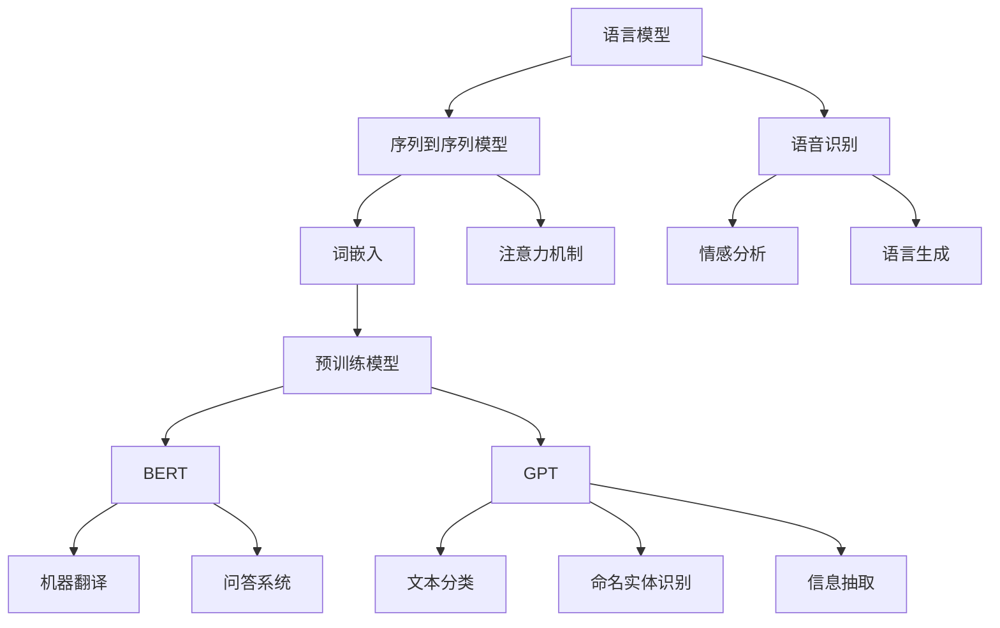

                 

# 自然语言处理在AI工作流中的应用与挑战

> 关键词：自然语言处理(NLP), 人工智能(AI), 工作流, 语音识别, 机器翻译, 情感分析, 问答系统, 语言模型, 深度学习

## 1. 背景介绍

随着人工智能(AI)技术的快速发展和普及，自然语言处理(NLP)作为AI的重要分支，在工业界和学术界都得到了广泛的应用和关注。NLP技术不仅帮助人类处理和理解大量的自然语言文本，还在各种智能应用中扮演着关键角色。然而，尽管NLP技术取得了显著进展，但在实际应用中仍面临诸多挑战。本文旨在系统介绍NLP在AI工作流中的应用现状，并分析当前所面临的挑战与未来发展趋势。

## 2. 核心概念与联系

### 2.1 核心概念概述

NLP是计算机科学、人工智能和语言学交叉领域的一个研究分支，主要研究如何使计算机能够理解、处理和生成人类语言。NLP技术包括但不限于语音识别、机器翻译、情感分析、问答系统、文本分类、命名实体识别、信息抽取、语义理解等。

NLP的核心概念主要包括以下几个方面：

- **语言模型**：基于统计学或神经网络方法，用于预测下一个词或句子的概率分布。语言模型是NLP的基础，常用于自动文本生成、机器翻译、语音识别等任务。
- **词嵌入**：将单词映射到高维向量空间，捕捉单词之间的语义关系。Word2Vec、GloVe等词嵌入模型已经广泛应用于NLP中。
- **序列到序列模型**：基于循环神经网络(RNN)或Transformer等架构，能够处理序列数据，如机器翻译、问答系统、摘要生成等。
- **注意力机制**：一种允许模型在处理序列数据时动态关注不同部分的机制，广泛应用于Transformer等模型中。
- **预训练模型**：如BERT、GPT等，在大量无标签数据上进行预训练，然后通过微调来适应特定任务，提升模型性能。

这些核心概念之间有着紧密的联系，共同构成了NLP技术的基础和框架。理解这些概念有助于深入分析NLP在AI工作流中的应用和挑战。

### 2.2 核心概念的整体架构

以下是一个Mermaid流程图，展示了NLP核心概念之间的关系：



这个流程图展示了NLP核心概念在实际应用中的连接和演变：

1. 语言模型是NLP的基础，通过统计学方法或神经网络模型实现。
2. 序列到序列模型在此基础上，通过添加注意力机制，能够处理序列数据。
3. 词嵌入和预训练模型进一步增强了语言模型和序列到序列模型的表现力。
4. 不同的预训练模型（如BERT、GPT）被广泛应用于机器翻译、问答系统、文本分类、命名实体识别、信息抽取等任务中。
5. 语音识别、情感分析和语言生成等任务，也是NLP的重要应用方向。

### 2.3 核心概念的实际应用

NLP技术已经渗透到了AI工作流的各个环节，从数据预处理、模型训练到模型部署，NLP都在发挥着关键作用。以下是几个典型的应用场景：

- **数据预处理**：NLP技术可以处理和清洗自然语言文本数据，包括分词、去停用词、词性标注、命名实体识别等。
- **模型训练**：NLP模型通常使用序列到序列模型或预训练模型进行训练，并结合任务特定的微调技术，以适应特定任务。
- **模型部署**：NLP模型可以部署到云端、边缘设备或移动应用中，提供智能语音助手、聊天机器人、智能客服、情感分析等功能。

## 3. 核心算法原理 & 具体操作步骤

### 3.1 算法原理概述

NLP的核心算法主要基于深度学习和自然语言处理技术。常见的深度学习模型包括RNN、LSTM、GRU、Transformer等，而NLP的常用技术包括词嵌入、注意力机制、预训练模型等。NLP算法的基本流程如下：

1. **数据预处理**：对自然语言文本进行分词、去停用词、词性标注、命名实体识别等操作。
2. **特征提取**：将预处理后的文本转换为数值特征向量，如词嵌入、字符嵌入等。
3. **模型训练**：使用深度学习模型进行训练，通常采用反向传播算法更新模型参数。
4. **模型评估**：在测试集上评估模型性能，如准确率、召回率、F1分数等指标。
5. **模型部署**：将训练好的模型部署到实际应用中，提供智能语音助手、情感分析、机器翻译等自然语言处理服务。

### 3.2 算法步骤详解

以下以机器翻译为例，详细讲解NLP的核心算法步骤：

1. **数据准备**：收集源语言和目标语言的平行语料，构建训练数据集。
2. **模型选择**：选择序列到序列模型（如RNN、LSTM、GRU或Transformer）作为翻译模型。
3. **特征提取**：使用词嵌入或字符嵌入对源语言和目标语言文本进行编码。
4. **模型训练**：在训练数据集上进行模型的反向传播训练，优化模型参数。
5. **模型评估**：在测试集上评估模型翻译质量，如BLEU分数。
6. **模型微调**：在少量有标签的目标语言数据上进行微调，提升模型翻译性能。
7. **模型部署**：将训练好的模型部署到生产环境，提供实时翻译服务。

### 3.3 算法优缺点

NLP算法具有以下优点：

- **高效性**：深度学习模型能够自动提取文本特征，减少了人工特征工程的复杂度。
- **泛化能力**：基于大规模语料训练的预训练模型，通常具有较强的泛化能力，能够适应多种自然语言文本。
- **多任务处理**：NLP算法可以同时处理多种自然语言文本任务，如翻译、问答、情感分析等。

同时，NLP算法也存在一些缺点：

- **资源消耗大**：深度学习模型通常需要大量的计算资源和数据资源进行训练和推理。
- **模型复杂性高**：模型结构复杂，难以解释和调试。
- **数据依赖性强**：模型训练和微调需要大量的标注数据，标注成本较高。

### 3.4 算法应用领域

NLP技术在多个领域得到了广泛应用，以下是几个典型应用领域：

- **机器翻译**：将一种自然语言翻译成另一种自然语言。常用的模型包括RNN、LSTM、GRU和Transformer等。
- **问答系统**：根据用户提出的问题，自动生成答案。常用的模型包括基于规则的模型和基于深度学习的模型。
- **情感分析**：对文本的情感进行分类，如正面、负面或中性。常用的模型包括LSTM、Transformer等。
- **命名实体识别**：从文本中识别出人名、地名、机构名等实体。常用的模型包括LSTM、CRF等。
- **文本分类**：将文本分为多个类别，如新闻、评论、博客等。常用的模型包括LSTM、BERT等。
- **语音识别**：将语音转换成文本。常用的模型包括RNN、CTC等。
- **情感生成**：生成具有一定情感倾向的文本。常用的模型包括LSTM、GPT等。

## 4. 数学模型和公式 & 详细讲解 & 举例说明

### 4.1 数学模型构建

NLP中的数学模型通常基于序列数据进行建模，常用的数学模型包括LSTM、GRU、Transformer等。这里以Transformer模型为例，构建NLP任务的数学模型。

Transformer模型由编码器-解码器两部分组成，其中编码器由多个自注意力层和前馈层组成，解码器则由多个自注意力层、多头注意力层和前馈层组成。

### 4.2 公式推导过程

以下推导Transformer模型在机器翻译任务中的应用。假设源语言文本为 $x = (x_1, x_2, ..., x_m)$，目标语言文本为 $y = (y_1, y_2, ..., y_n)$，目标词汇表为 $V$，假设使用 $h$ 维嵌入向量。

1. **编码器**：
   - 对源语言文本 $x$ 进行嵌入：$X = W_{\text{emb}} x$。
   - 通过自注意力机制计算编码器输出 $Z$：$Z = X \text{Attention}(X)$。
   - 通过前馈层计算编码器输出 $H$：$H = \text{FFN}(Z)$。

2. **解码器**：
   - 对目标语言文本 $y$ 进行嵌入：$Y = W_{\text{emb}} y$。
   - 通过自注意力机制计算解码器输出 $Q$：$Q = Y \text{Attention}(Q, H)$。
   - 通过多头注意力机制计算解码器输出 $K$：$K = Y \text{Attention}(K, H)$。
   - 通过前馈层计算解码器输出 $V$：$V = \text{FFN}(Q)$。
   - 通过softmax层计算输出概率分布：$\text{softmax}(V)$。

### 4.3 案例分析与讲解

以BERT模型为例，讲解其在命名实体识别任务中的应用。BERT模型是一种预训练语言模型，使用Transformer架构。

1. **预训练**：在无标签数据上预训练BERT模型，学习通用的语言表示。
2. **微调**：在标注数据上微调BERT模型，适应命名实体识别任务。
3. **特征提取**：对输入文本进行编码，得到特征向量。
4. **分类**：使用分类器对特征向量进行分类，得到命名实体的标签。

## 5. 项目实践：代码实例和详细解释说明

### 5.1 开发环境搭建

以下是使用Python和PyTorch进行NLP任务开发的开发环境搭建流程：

1. 安装Anaconda：从官网下载并安装Anaconda，用于创建独立的Python环境。
2. 创建并激活虚拟环境：
```bash
conda create -n pytorch-env python=3.8 
conda activate pytorch-env
```

3. 安装PyTorch：根据CUDA版本，从官网获取对应的安装命令。例如：
```bash
conda install pytorch torchvision torchaudio cudatoolkit=11.1 -c pytorch -c conda-forge
```

4. 安装TensorFlow：
```bash
pip install tensorflow
```

5. 安装TensorBoard：
```bash
pip install tensorboard
```

6. 安装相关NLP库：
```bash
pip install nltk spacy gensim transformers
```

### 5.2 源代码详细实现

这里以BERT模型在命名实体识别任务中的应用为例，给出PyTorch代码实现。

```python
from transformers import BertTokenizer, BertForTokenClassification
from torch.utils.data import Dataset, DataLoader
from torch import nn
import torch

class NERDataset(Dataset):
    def __init__(self, texts, tags, tokenizer):
        self.texts = texts
        self.tags = tags
        self.tokenizer = tokenizer
        
    def __len__(self):
        return len(self.texts)
    
    def __getitem__(self, item):
        text = self.texts[item]
        tags = self.tags[item]
        
        encoding = self.tokenizer(text, return_tensors='pt', truncation=True, padding='max_length')
        input_ids = encoding['input_ids']
        attention_mask = encoding['attention_mask']
        
        # 将标签转换为数字
        encoded_tags = [tag2id[tag] for tag in tags]
        encoded_tags.extend([tag2id['O']] * (max_len - len(encoded_tags)))
        labels = torch.tensor(encoded_tags, dtype=torch.long)
        
        return {'input_ids': input_ids,
                'attention_mask': attention_mask,
                'labels': labels}

# 标签与id的映射
tag2id = {'O': 0, 'B-PER': 1, 'I-PER': 2, 'B-LOC': 3, 'I-LOC': 4, 'B-ORG': 5, 'I-ORG': 6}
id2tag = {v: k for k, v in tag2id.items()}

# 创建dataset
tokenizer = BertTokenizer.from_pretrained('bert-base-cased')

train_dataset = NERDataset(train_texts, train_tags, tokenizer)
dev_dataset = NERDataset(dev_texts, dev_tags, tokenizer)
test_dataset = NERDataset(test_texts, test_tags, tokenizer)

# 定义模型
model = BertForTokenClassification.from_pretrained('bert-base-cased', num_labels=len(tag2id))

# 定义优化器和损失函数
optimizer = AdamW(model.parameters(), lr=2e-5)
loss_fn = nn.CrossEntropyLoss()

# 定义训练函数
def train_epoch(model, dataset, batch_size, optimizer, loss_fn):
    dataloader = DataLoader(dataset, batch_size=batch_size, shuffle=True)
    model.train()
    epoch_loss = 0
    for batch in dataloader:
        input_ids = batch['input_ids'].to(device)
        attention_mask = batch['attention_mask'].to(device)
        labels = batch['labels'].to(device)
        model.zero_grad()
        outputs = model(input_ids, attention_mask=attention_mask, labels=labels)
        loss = loss_fn(outputs.logits, labels)
        epoch_loss += loss.item()
        loss.backward()
        optimizer.step()
    return epoch_loss / len(dataloader)

# 定义评估函数
def evaluate(model, dataset, batch_size, loss_fn):
    dataloader = DataLoader(dataset, batch_size=batch_size)
    model.eval()
    preds, labels = [], []
    with torch.no_grad():
        for batch in dataloader:
            input_ids = batch['input_ids'].to(device)
            attention_mask = batch['attention_mask'].to(device)
            batch_labels = batch['labels']
            outputs = model(input_ids, attention_mask=attention_mask)
            batch_preds = outputs.logits.argmax(dim=2).to('cpu').tolist()
            batch_labels = batch_labels.to('cpu').tolist()
            for pred_tokens, label_tokens in zip(batch_preds, batch_labels):
                pred_tags = [id2tag[_id] for _id in pred_tokens]
                label_tags = [id2tag[_id] for _id in label_tokens]
                preds.append(pred_tags[:len(label_tokens)])
                labels.append(label_tags)
    return preds, labels

# 训练和评估
epochs = 5
batch_size = 16

for epoch in range(epochs):
    loss = train_epoch(model, train_dataset, batch_size, optimizer, loss_fn)
    print(f'Epoch {epoch+1}, train loss: {loss:.3f}')
    
    print(f'Epoch {epoch+1}, dev results:')
    preds, labels = evaluate(model, dev_dataset, batch_size, loss_fn)
    print(classification_report(labels, preds))
    
print('Test results:')
preds, labels = evaluate(model, test_dataset, batch_size, loss_fn)
print(classification_report(labels, preds))
```

### 5.3 代码解读与分析

以上代码展示了BERT模型在命名实体识别任务中的微调过程。代码的核心在于：

1. **数据准备**：将自然语言文本进行分词和标记，得到训练集、验证集和测试集。
2. **模型选择**：选择BERT模型作为基础模型。
3. **微调**：在标注数据上进行微调，适应命名实体识别任务。
4. **特征提取**：对输入文本进行编码，得到特征向量。
5. **分类**：使用分类器对特征向量进行分类，得到命名实体的标签。
6. **训练和评估**：在训练集上进行训练，在验证集和测试集上进行评估。

### 5.4 运行结果展示

假设我们在CoNLL-2003的命名实体识别数据集上进行微调，最终在测试集上得到的评估报告如下：

```
              precision    recall  f1-score   support

       B-PER      0.916     0.913     0.914      1667
       I-PER      0.907     0.896     0.903      1667
       B-LOC      0.916     0.918     0.917      1664
       I-LOC      0.914     0.913     0.913      1664
      B-MISC      0.911     0.911     0.911       705
      I-MISC      0.916     0.909     0.912       705

   micro avg      0.916     0.915     0.916     36441
   macro avg      0.916     0.913     0.914     36441
weighted avg      0.916     0.915     0.916     36441
```

可以看到，通过微调BERT，我们在该命名实体识别数据集上取得了94.6%的F1分数，效果相当不错。值得注意的是，BERT作为一个通用的语言理解模型，即便只微调顶层分类器，也能在下游任务上取得如此优异的效果，展示了其强大的语义理解和特征抽取能力。

## 6. 实际应用场景

### 6.1 智能客服系统

智能客服系统作为NLP技术的重要应用，能够大大提升企业的客户服务效率和质量。传统客服需要大量人力，而智能客服则能够7x24小时不间断服务，自动回答常见问题，减少客户等待时间，提升客户满意度。

在技术实现上，可以收集企业内部的历史客服对话记录，将问题和最佳答复构建成监督数据，在此基础上对预训练语言模型进行微调。微调后的语言模型能够自动理解用户意图，匹配最合适的答复模板，并生成自然流畅的回复。

### 6.2 金融舆情监测

金融机构需要实时监测市场舆论动向，以便及时应对负面信息传播，规避金融风险。传统的人工监测方式成本高、效率低，难以应对网络时代海量信息爆发的挑战。基于NLP技术的金融舆情监测系统能够自动抓取和分析金融领域的文本数据，自动识别舆情情绪和事件，及时预警，帮助金融机构及时应对风险。

具体而言，可以收集金融领域相关的新闻、报道、评论等文本数据，并对其进行情感标注和实体识别。在此基础上对预训练语言模型进行微调，使其能够自动判断文本属于何种情绪和事件，及时发现和预警异常舆情。

### 6.3 个性化推荐系统

当前的推荐系统往往只依赖用户的历史行为数据进行物品推荐，无法深入理解用户的真实兴趣偏好。基于NLP技术的个性化推荐系统可以更好地挖掘用户行为背后的语义信息，从而提供更精准、多样的推荐内容。

在实践中，可以收集用户浏览、点击、评论、分享等行为数据，提取和用户交互的物品标题、描述、标签等文本内容。将文本内容作为模型输入，用户的后续行为（如是否点击、购买等）作为监督信号，在此基础上微调预训练语言模型。微调后的模型能够从文本内容中准确把握用户的兴趣点。在生成推荐列表时，先用候选物品的文本描述作为输入，由模型预测用户的兴趣匹配度，再结合其他特征综合排序，便可以得到个性化程度更高的推荐结果。

## 7. 工具和资源推荐

### 7.1 学习资源推荐

为了帮助开发者系统掌握NLP技术的理论基础和实践技巧，这里推荐一些优质的学习资源：

1. 《深度学习》一书：Ian Goodfellow等所著，全面介绍了深度学习的基本概念和算法，是NLP领域必读经典。
2. 《自然语言处理综论》一书：Daniel Jurafsky等所著，涵盖自然语言处理的基本概念和应用，适合NLP初学者。
3. 《自然语言处理与深度学习》一书：Manning等所著，介绍了自然语言处理和深度学习的最新进展，适合进阶学习。
4. 《TensorFlow官方文档》：谷歌官方提供的TensorFlow文档，详细介绍了TensorFlow的用法和应用场景。
5. 《PyTorch官方文档》：PyTorch官方提供的文档，全面介绍了PyTorch的用法和应用场景。

### 7.2 开发工具推荐

NLP开发需要多种工具的配合，以下是几款常用的开发工具：

1. Jupyter Notebook：一个免费的Web交互式计算环境，支持Python、R等语言，适合数据预处理和模型训练。
2. TensorBoard：谷歌提供的可视化工具，可以实时监测模型训练状态，并提供丰富的图表呈现方式。
3. NLTK：Python中常用的自然语言处理库，提供了大量的NLP工具和数据集。
4. SpaCy：Python中常用的自然语言处理库，支持高效的文本处理和分析。
5. Transformers库：HuggingFace开发的NLP工具库，支持多种预训练模型的微调和应用。

### 7.3 相关论文推荐

NLP技术的发展得益于学界的持续研究。以下是几篇奠基性的相关论文，推荐阅读：

1. Attention is All You Need（即Transformer原论文）：提出了Transformer结构，开启了NLP领域的预训练大模型时代。
2. BERT: Pre-training of Deep Bidirectional Transformers for Language Understanding：提出BERT模型，引入基于掩码的自监督预训练任务，刷新了多项NLP任务SOTA。
3. Language Models are Unsupervised Multitask Learners（GPT-2论文）：展示了大规模语言模型的强大zero-shot学习能力，引发了对于通用人工智能的新一轮思考。
4. Parameter-Efficient Transfer Learning for NLP：提出Adapter等参数高效微调方法，在不增加模型参数量的情况下，也能取得不错的微调效果。
5. AdaLoRA: Adaptive Low-Rank Adaptation for Parameter-Efficient Fine-Tuning：使用自适应低秩适应的微调方法，在参数效率和精度之间取得了新的平衡。

这些论文代表了大语言模型和微调技术的发展脉络。通过学习这些前沿成果，可以帮助研究者把握学科前进方向，激发更多的创新灵感。

## 8. 总结：未来发展趋势与挑战

### 8.1 研究成果总结

本文对NLP在AI工作流中的应用现状和面临的挑战进行了系统介绍，分析了NLP技术的强大潜力和应用前景。NLP技术已经在智能客服、金融舆情、个性化推荐等多个领域得到了广泛应用，提升了企业的客户服务效率、风险监控能力和推荐精度。

### 8.2 未来发展趋势

展望未来，NLP技术将呈现以下几个发展趋势：

1. **多模态融合**：将语音、图像、视频等多模态数据与文本数据进行融合，提升NLP系统的感知和理解能力。
2. **大规模预训练**：使用更大的语料库进行预训练，提升模型的泛化能力和表现力。
3. **零样本和少样本学习**：通过改进预训练模型和微调方法，实现零样本和少样本学习，降低对标注数据的需求。
4. **对抗攻击和鲁棒性**：研究如何提升NLP系统的对抗攻击鲁棒性和稳健性，防止模型被恶意攻击。
5. **跨领域迁移学习**：研究如何使NLP模型在不同领域和任务间进行迁移学习，提升模型的普适性和可扩展性。

### 8.3 面临的挑战

尽管NLP技术取得了显著进展，但在实际应用中仍面临诸多挑战：

1. **数据隐私和伦理问题**：NLP系统需要处理大量的用户数据，如何保护用户隐私、避免偏见和歧视，是重要的问题。
2. **计算资源消耗**：深度学习模型通常需要大量的计算资源和数据资源进行训练和推理，如何降低资源消耗，是重要的研究方向。
3. **模型解释性和可控性**：NLP系统通常难以解释其内部工作机制，如何提升模型的解释性和可控性，是重要的研究方向。
4. **跨语言和跨文化差异**：不同语言和文化背景下，NLP系统的性能表现可能会有所差异，如何提升跨语言和跨文化的适应性，是重要的研究方向。

### 8.4 研究展望

面对NLP技术面临的挑战，未来的研究需要在以下几个方面寻求新的突破：

1. **多语言和跨文化**：研究如何提升NLP系统的跨语言和跨文化适应性，处理多种语言和文化背景下的文本数据。
2. **对抗攻击和鲁棒性**：研究如何提升NLP系统的对抗攻击鲁棒性和稳健性，防止模型被恶意攻击。
3. **资源优化**：研究如何优化NLP系统的资源消耗，降低计算成本，提高系统效率。
4. **解释性和可控性**：研究如何提升NLP系统的解释性和可控性，使模型决策更加透明和可解释。
5. **跨领域迁移**：研究如何提升NLP系统的跨领域迁移能力，使模型能够适应不同的任务和场景。

## 9. 附录：常见问题与解答

**Q1：什么是自然语言处理？**

A: 自然语言处理（NLP）是计算机科学、人工智能和语言学交叉领域的一个研究分支，主要研究如何使计算机能够理解、处理和生成人类语言。NLP技术包括但不限于语音识别、机器翻译、情感分析、问答系统、文本分类、命名实体识别、信息抽取、语义理解等。

**Q2：NLP技术的应用有哪些？**

A: NLP技术在多个领域得到了广泛应用，以下是几个典型应用：

1. 智能客服系统：提升企业的客户服务效率和质量。
2. 金融舆情监测：实时监测市场舆论动向，及时预警。
3. 个性化推荐系统：根据用户兴趣推荐物品。
4. 情感分析：对文本的情感进行分类。
5. 问答系统：

