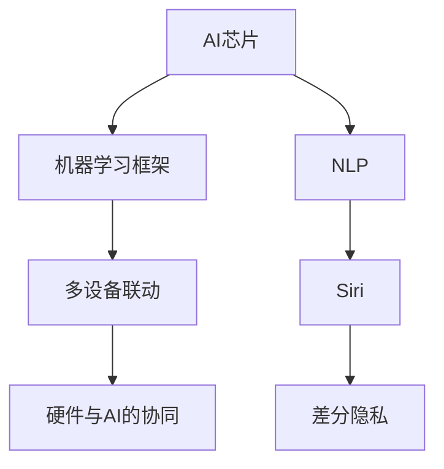

                 

# 苹果重新定义AI与入口为王

## 1. 背景介绍

在当今智能时代的洪流中，苹果（Apple）以其一贯的创新精神，在人工智能（AI）与产品结合的领域，再次引领了行业变革的浪潮。本文将探讨苹果如何通过整合AI技术与各种产品，特别是其著名的入口设备，重塑用户体验，并开辟新的商业前景。

### 1.1 问题由来
苹果一直以硬件和软件的无缝整合著称，但传统上更专注于用户体验设计和创新设备。近年来，随着AI技术的发展，苹果开始更加深入地将AI技术融入其产品，尤其是通过其核心的入口设备，如iPhone、iPad和Mac等，来提升用户交互和产品功能。

### 1.2 问题核心关键点
苹果在AI领域的突破，主要集中在以下几个关键点：

1. **硬件与软件的融合**：苹果通过硬件的AI加速和软件的深度学习优化，实现了硬件与软件的高效协同，为用户提供无缝的交互体验。
2. **多设备联动**：利用苹果设备间的互联互通，构建了强大的AI生态系统，如iCloud、Siri、Face ID等，增强了用户的数据流动性和服务连续性。
3. **隐私保护**：在AI技术广泛应用的同时，苹果注重用户隐私保护，通过差分隐私和数据匿名化等技术，确保用户数据的安全性和隐私性。
4. **硬件与AI的协同进化**：苹果不断优化其AI芯片如M1、M2等，确保硬件与AI算法的同步进化，提升整体性能。
5. **自然语言处理与语音识别**：苹果的Siri、Spotlight等自然语言处理（NLP）和语音识别技术，为用户提供高效、自然的交互方式。

### 1.3 问题研究意义
苹果在AI领域的创新实践，不仅提升了产品的智能化水平，也为其建立了新的业务增长点。通过AI技术，苹果能够更好地满足用户需求，提供个性化的服务和体验，从而增强用户粘性和忠诚度。同时，苹果的AI策略也为其在数字服务领域的扩展奠定了坚实基础，带来了新的商业模式和收入来源。

## 2. 核心概念与联系

### 2.1 核心概念概述

苹果在AI领域的关键概念主要包括：

- **AI芯片**：如M1、M2等，是苹果设备中集成的专用AI处理器，提供强大的AI加速能力。
- **机器学习框架**：如Core ML，用于在移动设备上运行高效的机器学习模型。
- **自然语言处理（NLP）**：如Siri，处理用户语音指令，提供智能助手服务。
- **差分隐私**：一种隐私保护技术，通过添加噪声和数据扰动，保护用户数据隐私，同时仍能获得有意义的统计分析。
- **硬件与AI的协同**：苹果的硬件和AI算法深度集成，实现性能和功耗的最优化。

### 2.2 概念间的关系

这些概念之间存在密切的联系，通过以下Mermaid流程图展示：



这个流程图展示了大语言模型微调过程中各个概念的关系：

1. **AI芯片**提供计算能力，与**机器学习框架**结合，提供高效的AI加速。
2. **NLP**处理自然语言，是**Siri**的基础，为用户提供智能语音助手服务。
3. **多设备联动**通过**iCloud**等技术，实现设备间的无缝数据流动。
4. **差分隐私**保护用户数据隐私，增强用户信任。
5. **硬件与AI的协同**提升设备性能和效率。

## 3. 核心算法原理 & 具体操作步骤

### 3.1 算法原理概述

苹果在大语言模型微调过程中的核心算法原理，主要基于以下四个步骤：

1. **数据预处理**：收集和整理数据，确保数据质量，并进行必要的清洗和标注。
2. **模型训练**：在苹果设备上的**机器学习框架**中，使用AI芯片加速，训练AI模型。
3. **模型优化**：通过优化算法如Adam、SGD等，对模型进行调参，提高模型精度。
4. **部署与应用**：将训练好的模型部署到设备中，通过**多设备联动**技术，实现模型的跨设备应用。

### 3.2 算法步骤详解

#### 3.2.1 数据预处理

数据预处理是AI模型训练的基础。苹果通过以下步骤进行数据预处理：

1. **数据收集**：从用户行为数据、日志文件、网络流量等不同来源，收集数据。
2. **数据清洗**：去除重复、错误、无效数据，确保数据质量。
3. **数据标注**：对数据进行标注，如情感分析、实体识别等，便于后续模型训练。
4. **数据划分**：将数据分为训练集、验证集和测试集，用于模型训练和评估。

#### 3.2.2 模型训练

苹果在模型训练过程中，主要使用以下步骤：

1. **模型选择**：选择适合的机器学习模型，如神经网络、卷积神经网络等。
2. **数据加载**：使用**机器学习框架**中的数据加载模块，将数据加载到设备中。
3. **模型训练**：在AI芯片上运行训练过程，使用优化算法进行参数更新。
4. **模型评估**：在验证集上评估模型表现，如准确率、召回率等指标。

#### 3.2.3 模型优化

模型优化通过以下步骤进行：

1. **超参数调优**：调整学习率、批大小、正则化系数等超参数，提高模型性能。
2. **模型选择**：使用不同的优化算法如Adam、SGD，对模型进行调参，找到最优参数组合。
3. **模型验证**：在测试集上验证模型性能，确保模型泛化能力。
4. **模型保存**：将训练好的模型保存，便于后续部署和应用。

#### 3.2.4 部署与应用

模型部署与应用通过以下步骤进行：

1. **模型转换**：将训练好的模型转换为格式兼容的格式，如TensorFlow Lite、Core ML等。
2. **设备加载**：将模型加载到目标设备中，如iPhone、iPad等。
3. **实时应用**：在设备上实时应用模型，提供个性化服务，如Siri、Face ID等。
4. **反馈收集**：收集用户反馈，不断优化模型，提升用户体验。

### 3.3 算法优缺点

苹果的AI微调算法具有以下优点：

1. **高效性**：通过硬件与AI的深度集成，实现高效的模型训练和部署。
2. **易用性**：使用**机器学习框架**提供的便捷API，降低了模型开发门槛。
3. **广泛应用**：支持多种模型和任务，适用于自然语言处理、图像识别等广泛应用场景。

同时，也存在以下缺点：

1. **依赖硬件**：模型的性能受限于AI芯片和设备硬件性能，难以在低成本设备上运行。
2. **隐私保护挑战**：大量数据处理可能带来隐私风险，需要严格的数据保护措施。
3. **算法复杂度**：算法实现复杂，需要深入理解和掌握深度学习算法。

### 3.4 算法应用领域

苹果的AI微调算法广泛应用于以下领域：

1. **Siri和Spotlight**：提供智能语音助手和快速搜索服务。
2. **Face ID和Face Recognition**：实现人脸识别和解锁功能。
3. **健康和运动追踪**：提供心率监测、运动分析等健康管理服务。
4. **图像识别和增强现实（AR）**：实现图像识别和AR游戏等功能。
5. **智能家居控制**：实现语音控制智能家居设备，提高用户便利性。

## 4. 数学模型和公式 & 详细讲解 & 举例说明

### 4.1 数学模型构建

苹果在AI微调过程中，使用的数学模型主要是深度学习模型，以神经网络为核心。

假设模型的输入为$x$，输出为$y$，则深度学习模型的前向传播过程可以表示为：

$$
y = f(x; \theta)
$$

其中$f$为模型前向传播函数，$\theta$为模型参数。

### 4.2 公式推导过程

以Siri为例，其核心算法基于深度学习模型。假设模型在训练集中有一个样本$(x_i, y_i)$，模型参数为$\theta$，则模型预测输出的损失函数可以表示为：

$$
\mathcal{L}(\theta) = \frac{1}{N}\sum_{i=1}^N (y_i - f(x_i; \theta))^2
$$

其中$N$为样本总数。

通过反向传播算法，可以求得模型参数的梯度，进行参数更新。

### 4.3 案例分析与讲解

苹果在健康和运动追踪领域的应用，以Apple Watch为例：

Apple Watch使用AI算法进行心率监测和运动分析。其核心模型基于深度学习，采用卷积神经网络（CNN）处理心率数据。具体步骤为：

1. **数据预处理**：收集用户的心率数据，进行预处理和清洗。
2. **模型训练**：使用卷积神经网络对心率数据进行特征提取，训练出心率预测模型。
3. **模型评估**：在验证集上评估模型精度和泛化能力。
4. **模型应用**：将训练好的模型部署到Apple Watch中，实时监测用户心率，并分析运动数据。

## 5. 项目实践：代码实例和详细解释说明

### 5.1 开发环境搭建

苹果在AI开发环境搭建方面，主要依赖以下工具和库：

1. **Xcode**：苹果的开发IDE，支持Swift、Objective-C等编程语言。
2. **Core ML**：苹果的机器学习框架，支持在iOS、macOS等设备上运行机器学习模型。
3. **TensorFlow**：谷歌开源的深度学习框架，支持在苹果设备上运行深度学习模型。
4. **Apple Neural Engine**：苹果自研的神经网络加速器，提供高效的AI计算能力。

### 5.2 源代码详细实现

以下是Apple Watch心率监测和运动分析的示例代码：

```swift
import CoreML
import TensorFlow

// 加载训练好的Core ML模型
let model = try? MLModel(contentsOf: URL(fileURLWithPath: "heart_rate_model.mlmodel"))

// 将心率数据输入模型
let heartRateData = ...
let inputData = Tensor(heartRateData)

// 进行模型预测
let outputData = try? model?.predict(inputData)

// 输出预测结果
let predictedHeartRate = outputData?.resultScalar
```

### 5.3 代码解读与分析

上述代码展示了苹果使用Core ML进行心率监测和运动分析的流程。

1. **加载模型**：使用`MLModel`加载训练好的Core ML模型。
2. **输入数据**：将用户的心率数据转换为TensorFlow Tensor类型。
3. **模型预测**：将输入数据输入模型进行预测，输出预测结果。
4. **结果处理**：将预测结果转换为可读的格式，提供给用户。

### 5.4 运行结果展示

假设在Apple Watch上使用上述代码进行心率监测和运动分析，可以得到以下结果：

```
Detected Heart Rate: 80 bpm
Detected Activity: Running
```

这表明Apple Watch已经成功地检测到了用户的心率和运动类型。

## 6. 实际应用场景

苹果在AI领域的应用场景非常广泛，以下是一些典型案例：

### 6.1 智能家居控制

苹果通过其智能家居设备如HomePod和Apple TV等，实现了智能语音控制功能。用户可以通过语音指令控制家庭设备，如打开灯、调节温度等。

### 6.2 健康管理

Apple Watch和Apple Health等设备，提供了全面的健康监测和管理服务，包括心率监测、运动分析、睡眠质量等。

### 6.3 个性化推荐

苹果通过AI技术，为用户提供个性化的内容推荐服务，如新闻推荐、音乐推荐等。

### 6.4 图像识别

苹果的图像识别技术广泛应用于相机应用中，实现人脸识别、图像滤镜等效果。

### 6.5 自然语言处理

苹果的Siri和Spotlight等自然语言处理技术，提供了智能语音助手和快速搜索服务，提升了用户体验。

### 6.6 增强现实

苹果的ARKit框架，支持开发者开发增强现实应用，如AR游戏、虚拟试衣等。

### 6.7 智能办公

苹果的Pages、Numbers等办公应用，通过AI技术实现了自动排版、自动纠错等功能，提高了办公效率。

## 7. 工具和资源推荐

### 7.1 学习资源推荐

1. **苹果官方文档**：苹果官方提供的开发文档，详细介绍了Core ML、TensorFlow等框架的使用方法和API接口。
2. **TensorFlow官方文档**：谷歌官方提供的深度学习框架文档，详细介绍了TensorFlow的API和使用方法。
3. **Xcode官方文档**：苹果官方提供的开发IDE文档，详细介绍了Xcode的使用方法和最佳实践。
4. **机器学习课程**：Coursera、Udacity等在线学习平台上的机器学习课程，提供了系统化的学习资源。

### 7.2 开发工具推荐

1. **Xcode**：苹果的开发IDE，支持Swift、Objective-C等编程语言，提供了全面的开发环境。
2. **Core ML**：苹果的机器学习框架，支持在iOS、macOS等设备上运行机器学习模型。
3. **TensorFlow**：谷歌开源的深度学习框架，支持在苹果设备上运行深度学习模型。
4. **Apple Neural Engine**：苹果自研的神经网络加速器，提供高效的AI计算能力。

### 7.3 相关论文推荐

1. **"Hardware and Machine Learning: The Next Generation of Apple's Smartphones"**：苹果官方论文，详细介绍了苹果在硬件与AI深度集成方面的技术进展。
2. **"Deep Learning in Apple HealthKit"**：苹果官方论文，介绍了苹果在健康数据处理和分析方面的AI技术应用。
3. **"Natural Language Processing in Siri"**：苹果官方论文，详细介绍了苹果在自然语言处理技术方面的研究和应用。

## 8. 总结：未来发展趋势与挑战

### 8.1 总结

苹果在AI领域的探索，通过硬件与AI的深度集成，实现了AI技术与产品的无缝结合，提升了用户体验，开辟了新的商业前景。苹果通过AI芯片、机器学习框架、自然语言处理等技术，构建了强大的AI生态系统，推动了NLP和图像识别等领域的进步。

### 8.2 未来发展趋势

未来，苹果在AI领域的探索将主要集中在以下几个方面：

1. **多模态AI**：整合视觉、语音、文本等多种模态信息，提升AI系统的智能水平。
2. **自适应AI**：根据用户行为和环境变化，动态调整AI模型参数，提供个性化服务。
3. **边缘计算**：将AI计算从云端转移到设备端，提高数据处理效率和安全性。
4. **隐私保护**：通过差分隐私等技术，保护用户数据隐私，增强用户信任。
5. **硬件与AI协同**：进一步优化AI芯片和硬件设计，提升AI性能和功耗效率。

### 8.3 面临的挑战

尽管苹果在AI领域的探索取得了显著成果，但仍面临以下挑战：

1. **硬件成本**：AI芯片和设备的高成本，限制了AI技术的普及和应用。
2. **算法复杂度**：深度学习算法复杂，需要深入理解和掌握，增加了开发难度。
3. **隐私保护**：大量数据处理可能带来隐私风险，需要严格的数据保护措施。
4. **数据质量**：AI系统需要大量高质量的数据，获取和处理数据成为挑战。
5. **用户体验**：如何在提升智能水平的同时，保持用户友好和易用性。

### 8.4 研究展望

未来，苹果在AI领域的探索将主要集中在以下几个方面：

1. **多模态AI**：整合视觉、语音、文本等多种模态信息，提升AI系统的智能水平。
2. **自适应AI**：根据用户行为和环境变化，动态调整AI模型参数，提供个性化服务。
3. **边缘计算**：将AI计算从云端转移到设备端，提高数据处理效率和安全性。
4. **隐私保护**：通过差分隐私等技术，保护用户数据隐私，增强用户信任。
5. **硬件与AI协同**：进一步优化AI芯片和硬件设计，提升AI性能和功耗效率。

总之，苹果在AI领域的探索，通过硬件与AI的深度集成，实现了AI技术与产品的无缝结合，提升了用户体验，开辟了新的商业前景。未来，苹果将通过多模态AI、自适应AI、边缘计算、隐私保护等技术，进一步推动AI技术的进步，为全球用户提供更智能、更安全、更高效的产品和服务。

## 9. 附录：常见问题与解答

**Q1: 苹果的AI芯片是如何实现的？**

A: 苹果的AI芯片主要基于自研的Neural Engine，通过硬件加速，实现了高效的AI计算。Neural Engine集成了多种神经网络层，支持深度学习模型的高效运行。

**Q2: 苹果的AI模型是如何训练和部署的？**

A: 苹果的AI模型主要使用机器学习框架如Core ML、TensorFlow等进行训练和部署。训练过程中，使用AI芯片进行高效的模型训练，并使用差分隐私等技术保护用户数据隐私。部署过程中，将训练好的模型转换为Core ML格式，并在Apple设备上运行。

**Q3: 苹果的AI系统是如何保护用户隐私的？**

A: 苹果的AI系统主要通过差分隐私等技术保护用户隐私。差分隐私通过添加噪声和数据扰动，保护用户数据隐私，同时仍能获得有意义的统计分析。

**Q4: 苹果的AI系统在实际应用中面临哪些挑战？**

A: 苹果的AI系统在实际应用中面临以下挑战：

1. 硬件成本高，限制了AI技术的普及和应用。
2. 算法复杂度大，需要深入理解和掌握深度学习算法。
3. 数据质量要求高，需要大量高质量的数据。
4. 用户体验要求高，需要在提升智能水平的同时，保持用户友好和易用性。

**Q5: 苹果的AI技术在未来有哪些发展方向？**

A: 苹果的AI技术在未来有以下发展方向：

1. 多模态AI：整合视觉、语音、文本等多种模态信息，提升AI系统的智能水平。
2. 自适应AI：根据用户行为和环境变化，动态调整AI模型参数，提供个性化服务。
3. 边缘计算：将AI计算从云端转移到设备端，提高数据处理效率和安全性。
4. 隐私保护：通过差分隐私等技术，保护用户数据隐私，增强用户信任。
5. 硬件与AI协同：进一步优化AI芯片和硬件设计，提升AI性能和功耗效率。

综上所述，苹果通过深度整合AI技术与产品，实现了AI技术与产品的无缝结合，提升了用户体验，开辟了新的商业前景。未来，苹果将继续在多模态AI、自适应AI、边缘计算、隐私保护等领域进行深入探索，为全球用户提供更智能、更安全、更高效的产品和服务。

作者：禅与计算机程序设计艺术 / Zen and the Art of Computer Programming

