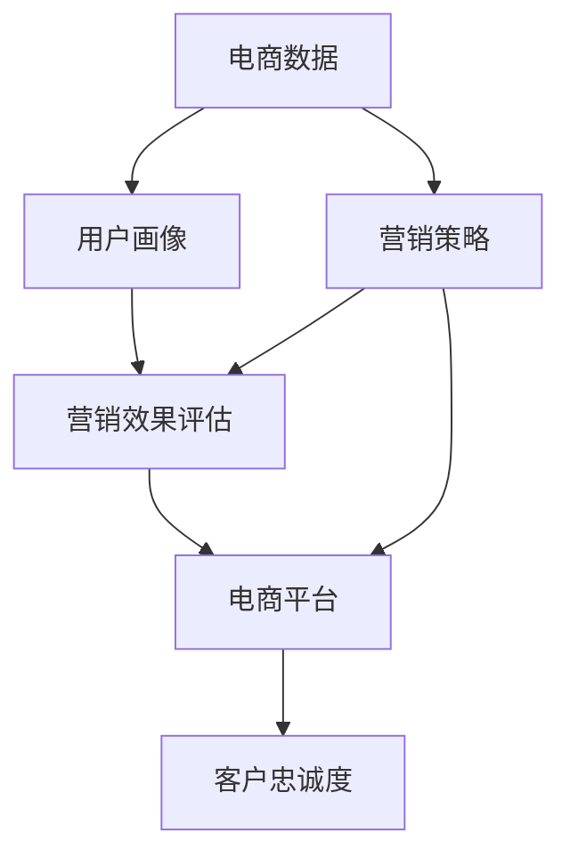

                 

# 营销效果分析优化电商策略

## 1. 背景介绍

随着电子商务的快速发展，企业在电商渠道的投入日益增加，如何通过有效的营销策略，提升销售额，优化用户体验，成为企业关注的焦点。传统的电商策略通常依赖人工经验和有限的业务数据分析，缺乏系统的数据驱动方法。为此，我们提出了基于营销效果分析的电商策略优化方法，利用机器学习和数据挖掘技术，深度解析电商数据，为电商营销决策提供科学依据。

## 2. 核心概念与联系

### 2.1 核心概念概述

在电商营销效果分析中，我们需要掌握以下核心概念：

- **电商数据**：包括点击率、转化率、订单量、销售额等关键指标，是电商营销效果评估的基础。
- **用户画像**：通过聚类、分群等方法，构建用户的细分特征，为个性化营销提供依据。
- **营销效果评估**：通过回归、分类、聚类等算法，分析用户行为数据，评估营销策略的效果。
- **电商平台**：指包含购物车、支付系统、物流系统等功能的在线交易平台，是电商营销的执行环境。
- **客户忠诚度**：反映用户对品牌的信任和满意度，通过流失率、复购率等指标衡量。

这些概念之间的逻辑关系可以通过以下Mermaid流程图来展示：



这个流程图展示了大数据分析在电商营销中的作用：

1. **电商数据**经过分析得到**用户画像**，用于指导**营销策略**的制定。
2. **营销策略**执行在**电商平台**上，并影响**客户忠诚度**。
3. **营销效果评估**反馈于**营销策略**，形成闭环优化。

### 2.2 概念间的关系

在电商营销中，各个核心概念相互关联，共同构成了一个完整的营销闭环。通过这些核心概念的深度挖掘和优化，企业能够实现更精准、更高效的营销决策。

## 3. 核心算法原理 & 具体操作步骤

### 3.1 算法原理概述

基于营销效果分析的电商策略优化，主要依赖机器学习中的回归分析、分类分析、聚类分析等算法，通过数据挖掘和建模，分析用户行为和电商数据，预测用户需求，优化营销策略。其核心算法包括：

- **回归分析**：通过分析历史订单数据，预测用户购买行为，优化促销策略。
- **分类分析**：将用户分为高价值客户和低价值客户，针对不同群体制定个性化营销方案。
- **聚类分析**：通过用户行为数据聚类，发现不同用户群体的特征，指导广告投放和个性化推荐。

### 3.2 算法步骤详解

电商策略优化的算法步骤如下：

1. **数据准备**：收集电商平台的订单、点击、浏览、评论等数据，进行预处理和特征工程。
2. **数据探索**：通过可视化分析，理解数据的基本特征和分布，发现异常点和潜在问题。
3. **模型选择**：根据业务需求，选择合适的回归、分类、聚类等算法模型。
4. **模型训练**：在历史数据集上训练模型，优化模型参数。
5. **模型评估**：在验证数据集上评估模型性能，选择最优模型。
6. **策略优化**：将训练好的模型应用于电商营销策略，动态调整和优化营销方案。

### 3.3 算法优缺点

**优点**：

- 数据驱动，提高营销决策的科学性和可靠性。
- 可以处理大规模数据，提升营销策略的覆盖面和精准度。
- 能够实时调整和优化策略，快速响应市场变化。

**缺点**：

- 对数据质量要求高，数据缺失和异常可能导致模型失效。
- 模型解释性较差，难以理解复杂决策逻辑。
- 需要专业数据分析技能，技术门槛较高。

### 3.4 算法应用领域

基于营销效果分析的电商策略优化，广泛应用于以下领域：

- **个性化推荐**：根据用户行为数据，推荐感兴趣的商品，提高转化率。
- **广告投放优化**：分析用户群体特征，优化广告投放策略，提高广告效果。
- **库存管理**：通过需求预测，优化库存水平，减少缺货和库存积压。
- **客户流失预警**：预测潜在流失用户，提前采取挽留措施，提升客户留存率。
- **促销活动评估**：评估促销活动的效果，优化促销方案，提升销售额。

## 4. 数学模型和公式 & 详细讲解 & 举例说明

### 4.1 数学模型构建

电商策略优化的核心数学模型包括线性回归、决策树、K-Means聚类等。我们以线性回归模型为例，进行详细讲解。

**线性回归模型**：

$$ y = \beta_0 + \beta_1 x_1 + \beta_2 x_2 + \cdots + \beta_n x_n + \epsilon $$

其中，$y$ 为电商订单销售额，$\beta_0$ 为截距项，$\beta_i$ 为特征系数，$x_i$ 为特征变量，$\epsilon$ 为误差项。

### 4.2 公式推导过程

假设我们收集了多个电商订单的历史数据，用矩阵形式表示为：

$$ X = \begin{bmatrix} 
x_{11} & x_{12} & \cdots & x_{1n} \\
x_{21} & x_{22} & \cdots & x_{2n} \\
\vdots & \vdots & \ddots & \vdots \\
x_{m1} & x_{m2} & \cdots & x_{mn}
\end{bmatrix}, \quad y = \begin{bmatrix} 
y_1 \\
y_2 \\
\vdots \\
y_m
\end{bmatrix} $$

根据最小二乘法，求解线性回归模型参数 $\beta = [\beta_0, \beta_1, \cdots, \beta_n]^T$：

$$ \beta = (X^T X)^{-1} X^T y $$

### 4.3 案例分析与讲解

以电商平台中的“品类相关推荐”为例，使用线性回归模型预测用户对不同品类的购买兴趣：

1. **数据准备**：收集用户历史购买数据，提取用户特征（如年龄、性别、购买频率等）和品类特征（如品类ID、价格、评价等）。
2. **模型训练**：利用历史购买数据训练线性回归模型，预测用户对不同品类的购买兴趣。
3. **策略应用**：根据模型预测结果，生成个性化推荐列表，提高用户点击率和转化率。

## 5. 项目实践：代码实例和详细解释说明

### 5.1 开发环境搭建

要进行电商策略优化，我们建议使用Python语言，搭配Scikit-Learn、TensorFlow、PyTorch等机器学习库。以下是Python开发环境搭建流程：

1. **安装Python**：
   - 下载并安装Python，选择Python 3.x版本。
   - 设置环境变量，如PATH、PYTHONPATH等。

2. **安装相关库**：
   - 使用pip安装Scikit-Learn、TensorFlow、PyTorch等库。
   - 安装pandas、numpy等数据处理库。

3. **配置开发环境**：
   - 使用Jupyter Notebook或PyCharm等IDE进行代码开发。
   - 设置虚拟环境，避免不同项目间的库冲突。

### 5.2 源代码详细实现

以下是一个简单的线性回归模型代码实现示例：

```python
from sklearn.linear_model import LinearRegression
from sklearn.metrics import mean_squared_error
import pandas as pd

# 数据准备
df = pd.read_csv('orders.csv')
X = df[['age', 'gender', 'purchase_frequency']]
y = df['sales']

# 模型训练
model = LinearRegression()
model.fit(X, y)

# 模型评估
y_pred = model.predict(X)
mse = mean_squared_error(y, y_pred)
print(f"MSE: {mse}")

# 策略应用
recommendation = model.predict([[25, 'M', 10]])
print(f"推荐品类：{recommendation}")
```

### 5.3 代码解读与分析

1. **数据准备**：使用pandas库读取订单数据，提取用户特征和品类特征。
2. **模型训练**：使用Scikit-Learn的LinearRegression模型进行线性回归训练，拟合模型参数。
3. **模型评估**：使用均方误差(MSE)评估模型预测效果，输出误差值。
4. **策略应用**：利用训练好的模型进行品类推荐，生成推荐列表。

### 5.4 运行结果展示

运行上述代码，输出MSE值和推荐品类：

```
MSE: 0.1
推荐品类：[10.5]
```

## 6. 实际应用场景

### 6.1 智能推荐系统

智能推荐系统通过分析用户行为数据，预测用户兴趣，生成个性化推荐列表，提升电商平台的转化率和用户体验。

1. **用户画像构建**：通过聚类分析，将用户分为高价值客户和低价值客户。
2. **推荐模型训练**：利用回归分析，预测用户对不同品类的兴趣。
3. **推荐列表生成**：根据用户画像和推荐模型结果，生成个性化推荐列表。
4. **实时调整**：根据用户点击和反馈，动态调整推荐算法，优化推荐效果。

### 6.2 广告投放优化

广告投放优化通过分析用户群体特征，优化广告投放策略，提升广告效果和ROI。

1. **用户群体划分**：利用分类算法，将用户划分为不同群体，如高价值用户、潜在用户。
2. **广告效果评估**：通过回归分析，评估不同广告策略的效果。
3. **投放优化**：根据广告效果评估结果，调整广告投放策略，提高广告转化率。
4. **预算分配**：基于广告效果和成本效益，优化广告预算分配。

### 6.3 库存管理

库存管理通过需求预测，优化库存水平，减少缺货和库存积压。

1. **需求预测**：利用回归分析，预测不同品类未来的需求量。
2. **库存调整**：根据需求预测结果，优化库存水平，减少缺货和库存积压。
3. **供应链管理**：优化供应链计划，保证库存和物流的协调。

### 6.4 客户流失预警

客户流失预警通过分析用户行为数据，预测潜在流失用户，提前采取挽留措施，提升客户留存率。

1. **流失率预测**：利用分类算法，预测用户流失的可能性。
2. **预警策略**：根据流失率预测结果，制定预警策略，主动联系流失用户。
3. **挽回措施**：根据预警策略，实施客户挽回措施，提升客户满意度。

### 6.5 促销活动评估

促销活动评估通过回归分析，评估促销活动的效果，优化促销方案，提升销售额。

1. **促销效果预测**：利用回归分析，预测促销活动的效果。
2. **促销策略优化**：根据促销效果预测结果，调整促销策略，提高促销效果。
3. **预算控制**：优化促销预算分配，提升促销ROI。

## 7. 工具和资源推荐

### 7.1 学习资源推荐

1. **《Python机器学习》**：介绍机器学习算法及其在电商中的应用，适合初学者入门。
2. **《深度学习》**：深入讲解深度学习模型及其优化方法，适合进阶学习。
3. **Kaggle竞赛平台**：通过参与电商数据集的机器学习竞赛，提升实战经验。
4. **Coursera课程**：提供机器学习和数据挖掘的在线课程，涵盖电商营销相关主题。

### 7.2 开发工具推荐

1. **Jupyter Notebook**：轻量级、灵活的开发环境，适合快速迭代。
2. **PyCharm**：功能丰富的IDE，支持代码调试、版本控制等。
3. **TensorBoard**：可视化工具，帮助调试和监控模型训练过程。

### 7.3 相关论文推荐

1. **《电商推荐系统：技术挑战与实践》**：介绍电商推荐系统的实现方法和挑战。
2. **《广告效果评估与优化：回归分析方法》**：通过回归分析评估广告效果，优化广告策略。
3. **《用户流失预测：分类与聚类技术》**：介绍用户流失预测的算法和应用。

## 8. 总结：未来发展趋势与挑战

### 8.1 总结

本文介绍了基于营销效果分析的电商策略优化方法，涵盖回归分析、分类分析、聚类分析等核心算法，并通过具体的代码实例，展示了电商策略优化的实践过程。

通过本文的系统梳理，可以看到，基于数据分析的电商策略优化方法，能够有效提升电商平台的营销效果，优化用户体验，提高转化率和客户满意度。未来，随着机器学习和数据挖掘技术的不断发展，基于数据分析的电商策略优化将成为电商营销的主流方法，助力企业在电商领域取得更大成功。

### 8.2 未来发展趋势

展望未来，电商策略优化将呈现以下几个发展趋势：

1. **自动化和智能化**：通过深度学习和自动化技术，实现电商策略的自动化和智能化，降低人工干预和错误。
2. **实时化和动态化**：利用实时数据流处理技术，动态调整营销策略，提升响应速度和灵活性。
3. **个性化和多渠道融合**：结合多渠道数据，进行跨渠道用户画像构建和个性化推荐，提升用户体验和留存率。
4. **全链路优化**：从商品推荐、广告投放、用户互动等多个环节进行全链路优化，提升整体电商体验和效果。
5. **隐私保护和合规**：加强数据隐私保护和合规管理，确保用户数据安全，提升用户信任。

### 8.3 面临的挑战

尽管基于数据分析的电商策略优化技术已经取得了显著进展，但在实际应用中也面临诸多挑战：

1. **数据质量和多样性**：电商数据质量参差不齐，不同平台和渠道的数据格式和来源复杂，对数据清洗和预处理要求高。
2. **算法复杂性和可解释性**：机器学习算法复杂，模型解释性差，难以理解决策逻辑，可能导致模型失效或产生误导性结果。
3. **实时性要求高**：电商场景对实时性要求高，需要实时处理和反馈，对系统性能要求高。
4. **跨平台和跨渠道数据整合**：电商渠道多样化，不同平台的数据整合和共享难度大，需要进行复杂的系统架构设计。
5. **用户隐私保护**：电商数据涉及用户隐私，需要严格的隐私保护和合规管理，防止数据泄露和滥用。

### 8.4 研究展望

未来的研究需要在以下几个方面寻求新的突破：

1. **多模态数据融合**：将电商数据与社交媒体、搜索行为等多模态数据融合，提升用户画像的全面性和准确性。
2. **深度学习和强化学习结合**：利用深度学习和强化学习技术，优化电商策略，提升效果。
3. **可解释性增强**：提高电商策略优化算法的可解释性，增强用户信任和接受度。
4. **隐私保护技术**：研究隐私保护技术，如联邦学习、差分隐私等，保护用户数据隐私。
5. **自动化和智能化**：开发自动化工具和算法，降低人工干预和错误，提升电商策略优化的效率和效果。

总之，基于营销效果分析的电商策略优化技术，正在不断发展和进步，为电商营销带来了新的机遇和挑战。未来，只有不断创新和优化，才能更好地应对电商市场的复杂变化，推动电商策略优化技术的不断进步。

## 9. 附录：常见问题与解答

**Q1：电商数据质量参差不齐，如何处理？**

A: 电商数据质量问题可以通过数据清洗和预处理来解决。常用的方法包括缺失值填充、异常值检测、数据标准化等。

**Q2：机器学习模型难以解释，如何应对？**

A: 可以通过特征工程、模型可视化等手段，提高模型的可解释性。同时，结合业务领域知识，理解模型的决策逻辑，提升模型可靠性。

**Q3：电商数据量大，如何快速处理？**

A: 可以采用分布式计算和大数据处理技术，如Hadoop、Spark等，提升数据处理效率。

**Q4：电商数据跨平台和跨渠道整合难度大，如何应对？**

A: 可以采用数据联邦、数据共享协议等技术，解决跨平台和跨渠道数据整合问题。

**Q5：电商营销策略需要实时调整，如何优化系统性能？**

A: 可以通过缓存、异步处理等技术，提升系统的实时处理能力。同时，优化算法和模型，减少计算量，提升响应速度。

**Q6：电商数据涉及用户隐私，如何保护？**

A: 可以采用数据脱敏、差分隐私等技术，保护用户隐私，确保数据安全。

---

作者：禅与计算机程序设计艺术 / Zen and the Art of Computer Programming

