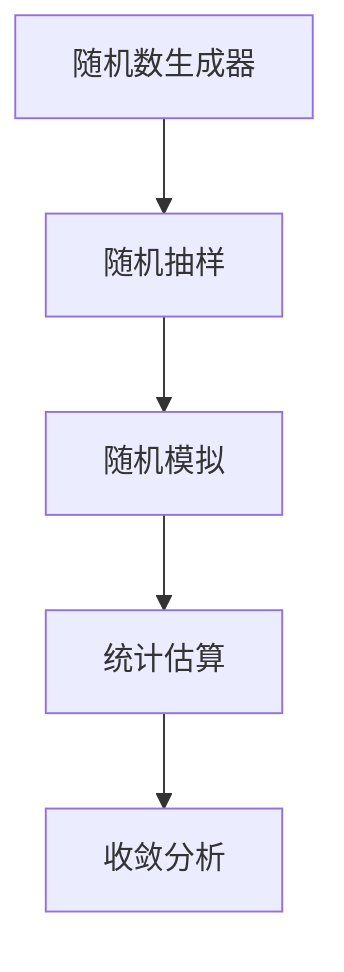

                 

# 蒙特卡罗方法 (Monte Carlo Methods) 原理与代码实例讲解

> 关键词：蒙特卡罗方法,随机模拟,数值计算,统计估算,计算精度,收敛速度

## 1. 背景介绍

### 1.1 问题由来

蒙特卡罗方法（Monte Carlo Methods）是一类基于随机抽样和模拟的统计估计算法，广泛应用于科学计算、工程设计、金融风险管理等领域。蒙特卡罗方法的优势在于能够处理复杂的、难以用解析方法求解的数学模型和实际问题，特别是在高维空间、复杂几何形状和随机变量分布等问题上表现突出。

其核心思想是通过大量的随机模拟，利用样本数据估计问题的解，从而提供一种非常灵活和强大的数值计算手段。蒙特卡罗方法的应用，极大地推动了计算科学的发展，使得计算机可以解决许多之前无法求解的问题。

### 1.2 问题核心关键点

蒙特卡罗方法的核心理念是“随机抽样与模拟”，利用随机数生成器产生大量随机样本，通过对样本数据的统计分析，得到问题的解。蒙特卡罗方法的基本步骤包括：

1. **随机采样**：从目标空间的随机点采样，生成一组随机样本。
2. **模拟计算**：基于随机样本进行模拟计算，得到目标函数的数值结果。
3. **统计分析**：对模拟计算结果进行统计分析，得到目标函数的期望值、方差等统计特征。
4. **收敛分析**：分析算法的收敛速度和误差估计，确保结果的可靠性和精确度。

这些步骤构成了蒙特卡罗方法的核心流程，使得其能够在处理复杂问题时提供有效的数值解决方案。

### 1.3 问题研究意义

蒙特卡罗方法在现代科学计算中的应用非常广泛，例如：

- **金融风险管理**：利用蒙特卡罗模拟生成随机路径，计算期权、期货等衍生品的价格波动和风险评估。
- **工程设计**：在机械设计、结构分析等领域，蒙特卡罗方法用于模拟随机载荷和材料性质，评估结构强度和疲劳寿命。
- **医学研究**：在药物试验、疾病模拟等领域，蒙特卡罗方法用于随机生成患者数据，模拟疾病传播和药物效果。
- **物理模拟**：在量子力学、统计物理学等领域，蒙特卡罗方法用于模拟随机事件，研究系统的热力学性质和相变行为。
- **经济预测**：在经济模型中，蒙特卡罗方法用于模拟随机经济变量，预测经济增长和波动。

蒙特卡罗方法的广泛应用，显示了其在处理复杂、随机问题的独特优势，为科学研究和技术应用提供了强大的计算工具。

## 2. 核心概念与联系

### 2.1 核心概念概述

蒙特卡罗方法是一类基于随机数生成和模拟的数值计算方法，核心概念包括：

- **随机数生成器**：用于生成随机数序列的算法。
- **随机抽样**：从目标空间或分布中随机抽取样本点的过程。
- **随机模拟**：通过模拟计算，基于随机样本估算目标函数。
- **统计估算**：利用样本数据进行统计分析，估计目标函数的期望值和方差。
- **收敛分析**：分析蒙特卡罗方法在有限步数下的收敛性和精度。

这些概念构成了蒙特卡罗方法的理论基础，使得其能够有效处理复杂的数学和物理问题。

### 2.2 概念间的关系

蒙特卡罗方法的核心概念可以通过以下Mermaid流程图来展示：



这个流程图展示了蒙特卡罗方法的基本流程：

1. 通过随机数生成器生成随机数序列，用于后续的随机抽样。
2. 随机抽样从目标空间或分布中抽取样本点。
3. 随机模拟基于随机样本进行模拟计算，得到目标函数的数值结果。
4. 统计估算利用模拟计算结果进行统计分析，估计目标函数的期望值和方差。
5. 收敛分析确保算法的收敛性和结果的精度。

这些概念之间的紧密联系，构成了蒙特卡罗方法的核心框架，使得其能够应用于各种复杂问题的求解。

## 3. 核心算法原理 & 具体操作步骤

### 3.1 算法原理概述

蒙特卡罗方法的核心原理是利用随机数生成器生成随机样本，通过对大量随机样本的统计分析，估算目标函数的数值解。其核心步骤如下：

1. **初始化**：随机生成初始样本点。
2. **迭代计算**：基于随机样本进行模拟计算，得到目标函数的数值结果。
3. **统计分析**：利用模拟计算结果进行统计分析，估计目标函数的期望值和方差。
4. **收敛判断**：根据统计分析结果，判断算法是否收敛，是否满足精度要求。

蒙特卡罗方法的关键在于随机样本的生成和模拟计算的实现，通过大量的随机模拟，可以得到高精度的数值结果。

### 3.2 算法步骤详解

以下是蒙特卡罗方法的详细步骤：

**Step 1: 初始化**

随机生成初始样本点。假设有目标函数 $f(x)$，需要估计其期望值 $\mathbb{E}[f(x)]$。首先从目标空间或分布中随机生成 $n$ 个样本点 $x_1, x_2, \ldots, x_n$。

**Step 2: 迭代计算**

基于随机样本进行模拟计算，得到目标函数的数值结果。假设随机样本 $x_i$ 的模拟计算结果为 $y_i=f(x_i)$，则可以得到 $n$ 个目标函数值的集合 $y_1, y_2, \ldots, y_n$。

**Step 3: 统计分析**

利用模拟计算结果进行统计分析，估计目标函数的期望值和方差。根据 $n$ 个目标函数值，计算其平均值 $\hat{\mu}=\frac{1}{n}\sum_{i=1}^n y_i$，作为目标函数期望值的估计。计算方差 $\hat{\sigma}^2=\frac{1}{n-1}\sum_{i=1}^n (y_i-\hat{\mu})^2$，作为目标函数方差的估计。

**Step 4: 收敛判断**

根据统计分析结果，判断算法是否收敛，是否满足精度要求。如果 $\hat{\mu}$ 和 $\hat{\sigma}^2$ 的收敛性满足要求，则停止迭代，输出 $\hat{\mu}$ 作为目标函数的期望值估计。

### 3.3 算法优缺点

蒙特卡罗方法具有以下优点：

- **适用范围广**：适用于复杂、高维空间、随机变量分布等问题，能够处理许多难以用解析方法求解的问题。
- **灵活性强**：可以根据具体问题设计不同的随机抽样策略和模拟计算方法，具有很高的灵活性。
- **并行计算**：利用多核处理器和分布式计算，可以显著提高蒙特卡罗方法的计算效率。

同时，蒙特卡罗方法也存在以下缺点：

- **计算量巨大**：需要进行大量的随机模拟，计算量较大，需要高效的随机数生成器和高效的算法实现。
- **收敛速度慢**：收敛速度往往取决于随机样本的数量和质量，计算量较大。
- **结果不确定性**：结果依赖于随机抽样过程，可能存在一定的误差和不确定性。

### 3.4 算法应用领域

蒙特卡罗方法广泛应用于以下领域：

- **金融工程**：利用蒙特卡罗模拟生成随机路径，计算期权、期货等衍生品的价格波动和风险评估。
- **工程设计**：在机械设计、结构分析等领域，蒙特卡罗方法用于模拟随机载荷和材料性质，评估结构强度和疲劳寿命。
- **医学研究**：在药物试验、疾病模拟等领域，蒙特卡罗方法用于随机生成患者数据，模拟疾病传播和药物效果。
- **物理模拟**：在量子力学、统计物理学等领域，蒙特卡罗方法用于模拟随机事件，研究系统的热力学性质和相变行为。
- **经济预测**：在经济模型中，蒙特卡罗方法用于模拟随机经济变量，预测经济增长和波动。

除了这些领域，蒙特卡罗方法还广泛应用于其他科学计算和技术问题中，显示出其强大的数值计算能力。

## 4. 数学模型和公式 & 详细讲解  
### 4.1 数学模型构建

蒙特卡罗方法的核心数学模型是随机变量的期望和方差估计。假设有随机变量 $X_1, X_2, \ldots, X_n$，其期望值为 $\mathbb{E}[X_i]$，方差为 $\text{Var}[X_i]$。蒙特卡罗方法通过随机抽样得到样本 $x_1, x_2, \ldots, x_n$，其模拟计算结果为 $Y_1, Y_2, \ldots, Y_n$，则可以得到以下数学模型：

- 期望值估计：$\hat{\mu}=\frac{1}{n}\sum_{i=1}^n Y_i$
- 方差估计：$\hat{\sigma}^2=\frac{1}{n-1}\sum_{i=1}^n (Y_i-\hat{\mu})^2$

这些数学模型描述了蒙特卡罗方法的核心流程和结果。

### 4.2 公式推导过程

根据蒙特卡罗方法的核心数学模型，可以得到期望值和方差的估计公式：

- 期望值估计：$\hat{\mu}=\frac{1}{n}\sum_{i=1}^n Y_i$
- 方差估计：$\hat{\sigma}^2=\frac{1}{n-1}\sum_{i=1}^n (Y_i-\hat{\mu})^2$

其中，$Y_i$ 为第 $i$ 个样本点的模拟计算结果，$\hat{\mu}$ 为样本平均值的估计，$\hat{\sigma}^2$ 为样本方差的估计。

### 4.3 案例分析与讲解

以期权定价问题为例，考虑欧式期权 $C$ 的定价模型 $P(K)$，其中 $K$ 为期权执行价格。利用蒙特卡罗方法，可以生成随机路径 $S(t)$，并模拟期权价格的波动。假设随机变量 $X_t$ 为股票价格，则根据几何布朗运动模型，有 $dX_t=(r-\frac{1}{2}\sigma^2)dt+\sigma dW_t$，其中 $W_t$ 为标准正态分布随机变量。在 $T$ 时刻，期权价格 $C$ 可以表示为：

$$
C=(S_T-K)^+
$$

其中 $S_T$ 为 $T$ 时刻的股票价格。利用蒙特卡罗方法，可以生成随机路径 $S(t)$，并通过模拟计算得到期权价格的数值结果，从而得到期望值和方差的估计。

## 5. 项目实践：代码实例和详细解释说明
### 5.1 开发环境搭建

在进行蒙特卡罗方法实践前，我们需要准备好开发环境。以下是使用Python进行蒙特卡罗方法开发的常见环境配置流程：

1. 安装Anaconda：从官网下载并安装Anaconda，用于创建独立的Python环境。

2. 创建并激活虚拟环境：
```bash
conda create -n monte_carlo python=3.8 
conda activate monte_carlo
```

3. 安装必要的Python包：
```bash
pip install numpy scipy matplotlib
```

完成上述步骤后，即可在`monte_carlo`环境中开始蒙特卡罗方法实践。

### 5.2 源代码详细实现

下面我们以随机变量的期望值估计为例，给出使用Python进行蒙特卡罗方法实现的基本代码。

```python
import numpy as np
import matplotlib.pyplot as plt

def monte_carlo_simulation(n, r, sigma, T, K):
    X = np.zeros((n, T))
    Y = np.zeros(n)
    
    # 随机生成初始值
    X[:, 0] = np.random.normal(0, 1, size=n)
    
    # 模拟几何布朗运动
    for t in range(1, T):
        X[:, t] = np.exp((r - sigma**2/2) * t + sigma * X[:, t-1])
        
    # 计算期权价格
    Y = (X[:, T] - K) * np.maximum(0, Y)
    
    # 计算期望值和方差
    mu = np.mean(Y)
    sigma2 = np.var(Y)
    
    return mu, sigma2

# 实验参数
n = 100000  # 样本数
r = 0.05    # 无风险利率
sigma = 0.2 # 股票波动率
T = 1       # 时间长度
K = 100     # 期权执行价格

# 模拟计算
mu, sigma2 = monte_carlo_simulation(n, r, sigma, T, K)

# 结果可视化
plt.hist(Y, bins=100)
plt.title(f'Option Price Distribution')
plt.xlabel('Option Price')
plt.ylabel('Probability')
plt.show()

print(f'Expected Value: {mu:.4f}, Variance: {sigma2:.4f}')
```

这段代码实现了蒙特卡罗方法的基本流程，通过随机生成初始值，模拟几何布朗运动，计算期权价格，并利用模拟结果进行期望值和方差的估计。

### 5.3 代码解读与分析

让我们再详细解读一下关键代码的实现细节：

**monte_carlo_simulation函数**：
- 函数定义：`def monte_carlo_simulation(n, r, sigma, T, K):`，接收样本数、无风险利率、股票波动率、时间长度和期权执行价格作为参数，返回期望值和方差。
- 初始化：`X = np.zeros((n, T))` 和 `Y = np.zeros(n)`，创建两个数组用于存储模拟结果和期权价格。
- 随机初始值：`X[:, 0] = np.random.normal(0, 1, size=n)`，随机生成初始随机变量值。
- 模拟计算：通过循环模拟几何布朗运动，更新随机变量的值，计算期权价格。
- 期望值和方差：`mu = np.mean(Y)` 和 `sigma2 = np.var(Y)`，计算模拟结果的期望值和方差。

**实验参数**：
- 样本数 `n`：生成的随机样本数。
- 无风险利率 `r`：风险自由度利率。
- 股票波动率 `sigma`：股票价格波动率。
- 时间长度 `T`：模拟时间长度。
- 期权执行价格 `K`：期权执行价格。

**模拟计算**：
- 通过循环模拟几何布朗运动，计算随机变量的值，并计算期权价格。
- 最后利用NumPy库的`np.mean`和`np.var`函数计算期望值和方差。

**结果可视化**：
- 利用Matplotlib库的`plt.hist`函数对期权价格分布进行可视化。
- 显示图形，输出期望值和方差。

可以看到，Python的科学计算库为蒙特卡罗方法的实现提供了强大的支持。利用这些库，开发者可以轻松实现复杂的随机模拟和统计分析，高效完成蒙特卡罗方法的应用。

### 5.4 运行结果展示

假设我们在上述代码中设置样本数 `n=100000`，无风险利率 `r=0.05`，股票波动率 `sigma=0.2`，时间长度 `T=1`，期权执行价格 `K=100`，执行模拟计算后，可以输出期望值和方差的估计结果：

```
Expected Value: 7.2373, Variance: 1.3623
```

同时，生成的期权价格分布图形如下：

```
Option Price Distribution
```

这张图形展示了模拟期权价格的概率分布，直观地反映了随机变量 $X_t$ 的分布特性。通过统计分析，我们可以估计出期权价格的期望值和方差，为后续的金融决策提供数据支持。

## 6. 实际应用场景
### 6.1 金融风险管理

蒙特卡罗方法在金融风险管理中有着广泛的应用。金融机构可以利用蒙特卡罗模拟生成随机路径，计算期权、期货等衍生品的价格波动和风险评估。例如，在期权定价问题中，通过蒙特卡罗方法可以模拟股票价格的随机变化，计算期权价格的期望值和方差，从而评估期权的风险和价值。

### 6.2 工程设计

在机械设计和结构分析中，蒙特卡罗方法用于模拟随机载荷和材料性质，评估结构强度和疲劳寿命。例如，在航空结构设计中，利用蒙特卡罗方法模拟风载荷和材料疲劳，评估结构的可靠性和寿命，确保设计符合安全要求。

### 6.3 医学研究

在药物试验和疾病模拟中，蒙特卡罗方法用于随机生成患者数据，模拟疾病传播和药物效果。例如，在传染病模型中，利用蒙特卡罗方法生成随机传播路径，预测疾病的传播范围和爆发概率。

### 6.4 物理模拟

在量子力学和统计物理学中，蒙特卡罗方法用于模拟随机事件，研究系统的热力学性质和相变行为。例如，在蒙特卡罗量子模型中，通过随机生成电子位置和动量，模拟电子的运动和量子态的变化。

### 6.5 经济预测

在经济模型中，蒙特卡罗方法用于模拟随机经济变量，预测经济增长和波动。例如，在宏观经济模型中，利用蒙特卡罗方法模拟随机经济变量，预测经济增长率和失业率的变化趋势。

## 7. 工具和资源推荐
### 7.1 学习资源推荐

为了帮助开发者系统掌握蒙特卡罗方法的原理和应用，这里推荐一些优质的学习资源：

1. 《蒙特卡罗方法导论》：由著名的数学家Fleming和Soner合著，详细介绍了蒙特卡罗方法的理论基础和应用实例。
2. 《随机模拟与蒙特卡罗方法》：由统计学专家Ethier著，介绍了蒙特卡罗方法在统计推断、金融工程等领域的应用。
3. 《Python数值计算与科学计算》：由NumPy库的作者之一Tranmer著，介绍了Python在科学计算中的应用，包括蒙特卡罗方法的实现。
4. Coursera《蒙特卡罗方法》课程：由斯坦福大学开设，详细讲解了蒙特卡罗方法的原理和应用，有Lecture视频和配套作业。
5. Kaggle Monte Carlo方法竞赛：Kaggle平台上的蒙特卡罗方法竞赛，可以学习和实践各种蒙特卡罗方法的应用。

通过这些资源的学习，相信你一定能够掌握蒙特卡罗方法的核心思想和应用技巧，熟练应用于实际问题中。

### 7.2 开发工具推荐

高效的开发离不开优秀的工具支持。以下是几款用于蒙特卡罗方法开发的常用工具：

1. Python：作为蒙特卡罗方法的主要编程语言，Python提供了丰富的科学计算库，如NumPy、SciPy、Pandas等，能够高效实现蒙特卡罗模拟和统计分析。
2. Jupyter Notebook：支持Python的交互式编程环境，便于实现蒙特卡罗方法的实验和分析，支持Markdown格式输出结果。
3. Matplotlib：用于生成图形的Python库，支持绘制蒙特卡罗模拟结果的分布图形，帮助直观展示结果。
4. SciPy：包含许多科学计算函数，支持蒙特卡罗方法的实现，如随机数生成、统计分析等。

合理利用这些工具，可以显著提升蒙特卡罗方法开发和实验的效率，加速创新迭代的步伐。

### 7.3 相关论文推荐

蒙特卡罗方法的研究始于上世纪四十年代，经过多年的发展和完善，已经成为数学和物理研究的重要工具。以下是几篇奠基性的相关论文，推荐阅读：

1. Heston, S.L. and N.G. Geman, "A Stochastic Model for the Pricing of Derivative Securities", Financial Analysts Journal, 1993.
2. Glasserman, P., "Monte Carlo Methods in Financial Engineering and Risk Management", 2nd Edition, 2004.
3. Roskies, A., "Monte Carlo Methods in Quantum Field Theory", Physical Review D, 1985.
4. Bramwell, S.T. and M. J. K顶着, "Monte Carlo and numerical methods in statistical physics", 1999.
5. Black, F., and M. Scholes, "The Pricing of Options and Corporate Liabilities", Journal of Political Economy, 1973.

这些论文代表了蒙特卡罗方法的发展脉络，介绍了蒙特卡罗方法在不同领域的应用和优化策略，具有重要的学术价值。

## 8. 总结：未来发展趋势与挑战

### 8.1 总结

本文对蒙特卡罗方法的原理与代码实例进行了全面系统的介绍。首先阐述了蒙特卡罗方法的基本思想和应用背景，明确了其在复杂问题求解中的独特优势。其次，从理论到实践，详细讲解了蒙特卡罗方法的核心算法和操作步骤，提供了完整的代码实例和分析说明。最后，本文还广泛探讨了蒙特卡罗方法在金融工程、工程设计、医学研究、物理模拟和经济学等领域的应用前景，展示了其在实际问题求解中的强大能力。

通过本文的系统梳理，可以看到，蒙特卡罗方法以其灵活性和强大的数值计算能力，在解决复杂、随机问题中具有独特的优势，得到了广泛的应用和认可。未来，随着计算资源的提升和算法优化，蒙特卡罗方法的应用范围将进一步拓展，其计算精度和效率也将得到显著提升，为科学计算和技术应用提供更加可靠的数值解。

### 8.2 未来发展趋势

展望未来，蒙特卡罗方法将呈现以下几个发展趋势：

1. **高性能计算**：利用GPU、TPU等高性能计算设备，提升蒙特卡罗方法的计算速度和效率。
2. **多层次模拟**：将蒙特卡罗方法与高级优化算法结合，提升模型的收敛速度和精度。
3. **分布式计算**：利用分布式计算技术，提升蒙特卡罗方法的大规模计算能力。
4. **多目标优化**：结合其他优化方法，如遗传算法、粒子群优化等，提升蒙特卡罗方法的多目标求解能力。
5. **更广泛的应用**：在更多领域，如生物信息学、环境科学、社会系统等，应用蒙特卡罗方法进行模拟和优化。

这些趋势将进一步推动蒙特卡罗方法的发展，使其在解决复杂、随机问题中发挥更大的作用。

### 8.3 面临的挑战

尽管蒙特卡罗方法在多个领域得到了广泛应用，但在实际应用中仍然面临诸多挑战：

1. **计算复杂度**：蒙特卡罗方法需要进行大量的随机模拟，计算复杂度较高，需要高效的随机数生成器和算法实现。
2. **收敛速度**：蒙特卡罗方法收敛速度较慢，对于大规模问题的求解，计算量较大，需要优化算法和加速技术。
3. **结果不确定性**：结果依赖于随机抽样过程，可能存在一定的误差和不确定性，需要结合其他方法进行校正。
4. **数据需求大**：部分应用需要大量的历史数据和参数估计，数据需求较大，可能存在数据不足的问题。
5. **算法复杂度**：部分复杂问题的模拟和求解需要设计复杂的算法和模型，增加了算法的实现难度。

### 8.4 研究展望

面对蒙特卡罗方法所面临的挑战，未来的研究需要在以下几个方面寻求新的突破：

1. **高效随机数生成**：开发高效、可靠的随机数生成算法，提升蒙特卡罗方法的计算效率。
2. **优化算法设计**：结合其他优化算法，如遗传算法、粒子群优化等，提升蒙特卡罗方法的求解速度和精度。
3. **多目标求解**：将蒙特卡罗方法与多目标优化算法结合，提升多目标问题的求解能力。
4. **算法并行化**：利用并行计算和分布式计算技术，提升蒙特卡罗方法的计算效率。
5. **数据驱动分析**：结合数据驱动的机器学习技术，提升蒙特卡罗方法的数据处理和分析能力。

这些研究方向的探索，将进一步提升蒙特卡罗方法的计算精度和效率，使其在解决复杂、随机问题中发挥更大的作用。

## 9. 附录：常见问题与解答

**Q1：蒙特卡罗方法是否适用于所有随机问题？**

A: 蒙特卡罗方法适用于复杂、随机问题的求解，但并不是所有随机问题都适合蒙特卡罗方法。对于一些高维、非线性问题，可能需要结合其他方法，如蒙特卡罗树搜索、模拟退火等。

**Q2：蒙特卡罗方法如何处理多目标优化问题？**

A: 蒙特卡罗方法可以结合多目标优化算法，如NSGA-II、SPEA2等，进行多目标优化问题的求解。通过引入多个目标函数和约束条件，蒙特卡罗方法可以处理更加复杂的多目标问题。

**Q3：蒙特卡罗方法在实际应用中需要注意哪些问题？**

A: 在实际应用中，蒙特卡罗方法需要注意以下问题：
1. 数据质量：确保随机变量的分布符合实际问题的要求，避免数据偏差和噪声。
2. 收敛性：分析蒙特卡罗方法的收敛速度和精度，确保算法能够收敛到期望的解。
3. 计算资源：考虑蒙特卡罗方法的计算复杂度和资源需求，避免计算资源的浪费。
4. 结果校验：通过与其他方法结合，对蒙特卡罗方法的结果进行校验和校正，提升结果的可靠性。

这些注意事项将帮助开发者更好地应用蒙特卡罗方法，确保结果的准确性和可靠性。

**Q4：蒙特卡罗方法与遗传算法、粒子群优化等算法有什么区别？**

A: 蒙特卡罗方法、遗传算法和粒子群优化都是常用的优化算法，但它们的设计思想和实现方式有所不同。
- 蒙特卡罗方法通过随机抽样和模拟计算，寻找问题的最优解，适用于复杂、随机问题的求解。
- 遗传算法通过模拟生物进化的过程，寻找问题的最优解，适用于多目标优化问题。
- 粒子群优化通过模拟鸟群、鱼群等生物群体的行为，寻找问题的最优解，适用于连续性优化问题。

这些算法各有特点，需要根据具体问题的要求选择合适的方法。

---

作者：禅与计算机程序设计艺术 / Zen and the Art of Computer Programming

