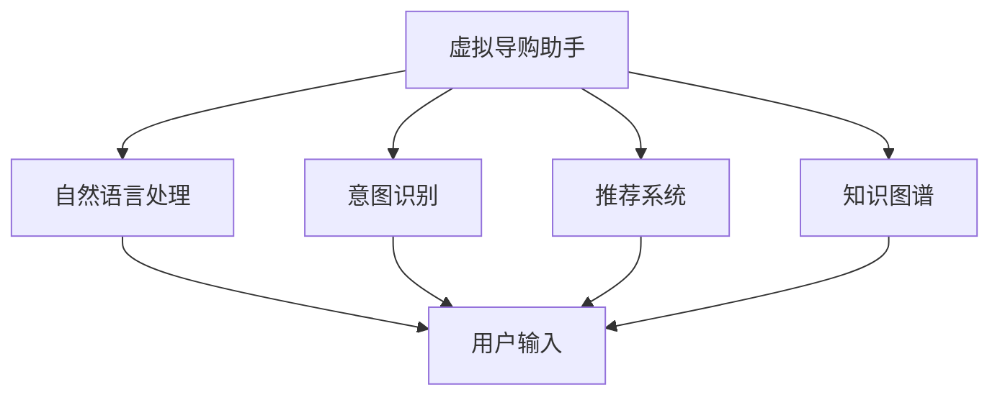

                 

# 虚拟导购助手：AI如何改变购物体验，提升用户满意度

## 1. 背景介绍

### 1.1 问题由来
随着互联网的迅猛发展，电子商务成为了现代生活中不可或缺的一部分。各大电商平台提供的购物体验各有特色，但大多数仍停留在基于搜索和推荐的基本功能上，用户体验和满意度仍有提升空间。特别是在用户对商品信息的获取和筛选需求日益复杂化的今天，传统搜索引擎和推荐系统已经难以满足用户的个性化和智能化需求。

在这样的背景下，虚拟导购助手（Virtual Shopping Assistant, VSA）应运而生。虚拟导购助手是一种基于人工智能技术的购物助手，通过自然语言处理（Natural Language Processing, NLP）、机器学习（Machine Learning, ML）等技术，利用大量的用户行为数据，为用户提供个性化、智能化的购物建议和购物体验。

虚拟导购助手不仅能够处理用户的文本输入和语音输入，还能通过对话交互的方式，更好地理解用户需求，提供精准的商品推荐，极大地提升了用户的购物体验和满意度。

### 1.2 问题核心关键点
虚拟导购助手的设计和实现涉及多个核心关键点，包括但不限于以下几个方面：

- **自然语言理解（NLU）**：理解用户输入的自然语言文本或语音，并将其转换为计算机可理解的语义信息。
- **实体识别（NER）**：识别文本中具有特定意义的实体，如品牌、产品、价格等，以便进行准确的商品推荐。
- **意图识别（IR）**：识别用户的购买意图，如询问、选择、购买等，以便提供针对性的服务。
- **对话管理（DM）**：通过对话管理器，协调多轮对话，实现与用户的自然交互。
- **推荐系统**：根据用户行为和历史数据，为用户推荐合适的商品，并进行智能排序和优化。
- **知识图谱（KG）**：构建商品的知识图谱，实现商品信息的深度理解和关联。

通过以上关键技术的组合和应用，虚拟导购助手能够构建一个高效、智能的购物助手系统，大幅提升用户的购物体验和满意度。

### 1.3 问题研究意义
虚拟导购助手的研究和发展，对于提升电子商务平台的智能化水平、增强用户体验具有重要意义：

1. **提高购物效率**：虚拟导购助手能够快速理解和响应用户需求，大幅缩短购物决策时间。
2. **提升推荐精度**：通过深度学习模型，虚拟导购助手能够为用户提供更加精准、个性化的商品推荐。
3. **增强用户粘性**：虚拟导购助手能够通过持续学习和适应用户行为，提升用户粘性和忠诚度。
4. **优化购物体验**：通过自然语言理解和智能对话，虚拟导购助手能够提供更加自然、人性化的购物体验。
5. **拓展应用场景**：虚拟导购助手不仅限于电商平台，还可以应用于在线旅游、家居装修等领域，提升各类平台的用户满意度。

## 2. 核心概念与联系

### 2.1 核心概念概述

为更好地理解虚拟导购助手的设计和实现，本节将介绍几个密切相关的核心概念：

- **虚拟导购助手（Virtual Shopping Assistant, VSA）**：基于NLP和ML技术，通过对话交互和商品推荐，为用户提供个性化购物体验的AI助手。
- **自然语言处理（Natural Language Processing, NLP）**：通过计算机程序实现自然语言理解和生成，实现人机交互和语义处理。
- **意图识别（Intent Recognition, IR）**：识别用户的意图，并据此提供相应的服务和响应。
- **推荐系统（Recommendation System）**：根据用户历史行为和实时数据，为每个用户生成个性化的商品推荐列表。
- **知识图谱（Knowledge Graph, KG）**：构建商品和相关实体的语义网络，实现对商品信息的深度理解和关联。

这些核心概念之间存在着紧密的联系，形成了虚拟导购助手的整体架构。接下来，我们将通过Mermaid流程图展示这些概念之间的联系。



该流程图展示了虚拟导购助手与其他核心概念之间的联系：

1. 虚拟导购助手（A）通过自然语言处理（B）理解用户输入（F），识别出用户的意图（C），并据此调用推荐系统（D）生成商品推荐列表。
2. 推荐系统（D）和知识图谱（E）提供深度语义理解和关联，帮助虚拟导购助手提供更加精准和个性化的推荐。

### 2.2 概念间的关系

这些核心概念之间存在着紧密的联系，形成了虚拟导购助手的完整架构。以下我们将通过Mermaid流程图展示这些概念之间的关系。

#### 2.2.1 虚拟导购助手的整体架构


该综合流程图展示了虚拟导购助手的整体架构，各个模块协同工作，共同提供高质量的购物建议和服务。

#### 2.2.2 意图识别和推荐系统之间的关系


这个流程图展示了意图识别和推荐系统之间的联系：意图识别（A）首先识别出用户的意图（B），然后推荐系统（C）根据意图生成推荐列表（D）。

## 3. 核心算法原理 & 具体操作步骤
### 3.1 算法原理概述

虚拟导购助手的核心算法原理主要包括自然语言处理（NLP）、意图识别（IR）和推荐系统（RS）等。下面将详细介绍这些核心算法的原理和操作步骤。

#### 3.1.1 自然语言处理（NLP）

自然语言处理（NLP）是虚拟导购助手的核心模块之一，其目的是将用户的自然语言输入转换为计算机可理解的语义信息。NLP算法通常包括以下几个步骤：

1. **分词（Tokenization）**：将自然语言文本切分成有意义的词汇单元，如单词或短语。
2. **词性标注（Part-of-Speech Tagging）**：为每个词汇单元标注其词性，如名词、动词等。
3. **命名实体识别（Named Entity Recognition, NER）**：识别文本中具有特定意义的实体，如品牌、产品、价格等。
4. **依存句法分析（Dependency Parsing）**：分析句子中各词汇之间的语法关系，如主谓关系、修饰关系等。
5. **语义分析（Semantic Analysis）**：分析句子的语义信息，理解用户的意图和需求。

NLP算法的关键在于选择合适的模型和工具。当前常用的NLP模型包括BERT、GPT等，这些模型通常需要在大规模语料上进行预训练，并通过微调优化以适应特定任务。

#### 3.1.2 意图识别（IR）

意图识别（IR）的目的是从用户输入中识别出其购买意图，并据此提供相应的服务和响应。IR算法的关键在于选择合适的特征提取和分类模型。当前常用的模型包括决策树、支持向量机（SVM）、神经网络等。

1. **特征提取**：从用户输入中提取有意义的特征，如关键词、词频等。
2. **意图分类**：使用机器学习算法对提取的特征进行分类，识别出用户的意图。
3. **意图表示**：将识别出的意图转换为计算机可理解的语义表示，用于后续的推荐和服务。

#### 3.1.3 推荐系统（RS）

推荐系统（RS）的目的是根据用户历史行为和实时数据，为用户生成个性化的商品推荐列表。RS算法通常包括以下几个步骤：

1. **用户画像**：构建用户画像，包括用户的兴趣、偏好、历史行为等。
2. **商品画像**：构建商品画像，包括商品的属性、类别、价格等。
3. **相似度计算**：计算用户和商品之间的相似度，评估用户对商品的兴趣程度。
4. **推荐排序**：根据相似度排序，生成个性化的推荐列表。

推荐系统算法包括协同过滤、内容过滤、混合推荐等，常用的模型包括矩阵分解、深度神经网络等。

### 3.2 算法步骤详解

#### 3.2.1 自然语言处理（NLP）

1. **分词和词性标注**：
   - 使用现有的分词工具，如jieba分词，将用户输入进行分词。
   - 使用词性标注工具，如NLTK、spaCy等，为每个词汇单元标注其词性。

2. **命名实体识别（NER）**：
   - 使用现有的命名实体识别工具，如Stanford NER、SpaCy等，识别出文本中的品牌、产品、价格等实体。
   - 将识别出的实体转换为计算机可理解的结构化表示，如JSON格式。

3. **依存句法分析**：
   - 使用依存句法分析工具，如UCCA、Stanford Parser等，分析句子的依存关系。
   - 将依存关系转换为图形结构，用于后续的语义分析和意图识别。

4. **语义分析**：
   - 使用预训练的语言模型，如BERT、GPT等，对用户输入进行语义分析。
   - 通过上下文理解，识别出用户的意图和需求。

#### 3.2.2 意图识别（IR）

1. **特征提取**：
   - 提取用户输入中的关键词、词频、词性等特征。
   - 使用TF-IDF、Word2Vec等方法，将特征转换为数值表示。

2. **意图分类**：
   - 使用机器学习算法，如SVM、KNN、决策树等，对特征进行分类，识别出用户的意图。
   - 使用神经网络模型，如BERT、LSTM等，对特征进行学习，生成预测结果。

3. **意图表示**：
   - 将识别出的意图转换为计算机可理解的语义表示，用于后续的推荐和服务。

#### 3.2.3 推荐系统（RS）

1. **用户画像**：
   - 收集用户的历史行为数据，如浏览记录、购买记录、评价记录等。
   - 使用用户画像工具，如Userbase、Mixpanel等，构建用户画像。

2. **商品画像**：
   - 收集商品的属性数据，如价格、类别、品牌等。
   - 使用商品画像工具，如Algolia、Elasticsearch等，构建商品画像。

3. **相似度计算**：
   - 计算用户和商品之间的相似度，评估用户对商品的兴趣程度。
   - 使用协同过滤、内容过滤等方法，计算相似度。

4. **推荐排序**：
   - 根据相似度排序，生成个性化的推荐列表。
   - 使用排序算法，如K-means、Greedy等，优化推荐结果。

### 3.3 算法优缺点

虚拟导购助手的核心算法具有以下优点和缺点：

#### 3.3.1 优点

1. **个性化推荐**：通过深度学习模型和知识图谱，能够提供精准、个性化的商品推荐。
2. **多轮对话**：通过对话管理器，能够实现多轮对话，提升用户粘性。
3. **实时响应**：通过自然语言处理和意图识别，能够快速响应用户需求。

#### 3.3.2 缺点

1. **数据依赖**：虚拟导购助手的性能依赖于大量用户行为数据和商品数据，获取和维护数据成本较高。
2. **计算复杂**：深度学习模型和知识图谱需要大量的计算资源，实现和维护成本较高。
3. **可解释性不足**：深度学习模型通常缺乏可解释性，用户难以理解推荐依据。

### 3.4 算法应用领域

虚拟导购助手的核心算法在多个领域得到了广泛应用，包括但不限于以下几个方面：

1. **电子商务**：在电商平台中，为每个用户提供个性化的商品推荐，提升购物体验和满意度。
2. **在线旅游**：为用户推荐合适的旅游线路和景点，提升旅游体验。
3. **家居装修**：为用户推荐合适的家居产品和设计方案，提升居家体验。
4. **医疗健康**：为用户推荐合适的健康产品和医疗服务，提升健康体验。

## 4. 数学模型和公式 & 详细讲解 & 举例说明

### 4.1 数学模型构建

#### 4.1.1 用户画像模型

用户画像模型（User Profile Model）的目的是通过用户的历史行为数据，构建用户画像。用户画像通常包括以下几个维度：

- 兴趣（Interest）：用户对各类商品的兴趣程度。
- 偏好（Preference）：用户对不同类别的商品偏好。
- 历史行为（Behavior）：用户的历史浏览、点击、购买等行为数据。

用户画像模型可以通过多维特征表示，如向量、矩阵等，对用户进行多维度刻画。

#### 4.1.2 商品画像模型

商品画像模型（Item Profile Model）的目的是通过商品的属性数据，构建商品画像。商品画像通常包括以下几个维度：

- 属性（Attribute）：商品的基本属性信息，如价格、类别、品牌等。
- 类别（Category）：商品的分类信息，如服装、家电等。
- 特征（Feature）：商品的特定特征，如品牌评价、用户评分等。

商品画像模型可以通过多种方式表示，如向量、图结构等，对商品进行多维度刻画。

#### 4.1.3 相似度计算模型

相似度计算模型（Similarity Calculation Model）的目的是计算用户和商品之间的相似度。常用的相似度计算方法包括余弦相似度、Jaccard相似度等。

余弦相似度的计算公式为：
$$
similarity(u, i) = \cos(\theta) = \frac{\vec{u} \cdot \vec{i}}{\|\vec{u}\| \cdot \|\vec{i}\|}
$$
其中，$\vec{u}$和$\vec{i}$分别为用户和商品的向量表示，$\theta$为用户和商品的夹角。

#### 4.1.4 推荐排序模型

推荐排序模型（Recommendation Sorting Model）的目的是根据相似度排序，生成个性化的推荐列表。常用的推荐排序方法包括K-means、Greedy等。

K-means排序的计算公式为：
$$
\text{Rank}_i = \sum_{u \in U} sim(u, i)
$$
其中，$U$为用户集合，$i$为商品，$\text{Rank}_i$为商品$i$的排名。

### 4.2 公式推导过程

#### 4.2.1 用户画像模型推导

用户画像模型可以通过多种方式表示，如向量、矩阵等。以向量表示为例，用户画像$\vec{u}$的计算公式为：
$$
\vec{u} = \sum_{k=1}^K a_k \vec{c}_k
$$
其中，$K$为维度数，$a_k$为用户对第$k$个特征的权重，$\vec{c}_k$为第$k$个特征的向量表示。

#### 4.2.2 商品画像模型推导

商品画像模型也可以通过多种方式表示，如向量、图结构等。以向量表示为例，商品画像$\vec{i}$的计算公式为：
$$
\vec{i} = \sum_{k=1}^K b_k \vec{d}_k
$$
其中，$K$为维度数，$b_k$为商品对第$k$个特征的权重，$\vec{d}_k$为第$k$个特征的向量表示。

#### 4.2.3 相似度计算模型推导

余弦相似度的计算公式为：
$$
similarity(u, i) = \cos(\theta) = \frac{\vec{u} \cdot \vec{i}}{\|\vec{u}\| \cdot \|\vec{i}\|}
$$
其中，$\vec{u}$和$\vec{i}$分别为用户和商品的向量表示，$\theta$为用户和商品的夹角。

#### 4.2.4 推荐排序模型推导

K-means排序的计算公式为：
$$
\text{Rank}_i = \sum_{u \in U} sim(u, i)
$$
其中，$U$为用户集合，$i$为商品，$\text{Rank}_i$为商品$i$的排名。

### 4.3 案例分析与讲解

#### 4.3.1 用户画像模型案例

假设我们有一个电商平台，有100万用户和10万商品。每个用户有10个兴趣点，每个商品有5个属性。我们可以将用户画像表示为10维向量，商品画像表示为5维向量。

用户画像$\vec{u}$的计算公式为：
$$
\vec{u} = \sum_{k=1}^{10} a_k \vec{c}_k
$$
其中，$a_k$为用户对第$k$个兴趣的权重，$\vec{c}_k$为第$k$个兴趣的向量表示。

#### 4.3.2 商品画像模型案例

商品画像$\vec{i}$的计算公式为：
$$
\vec{i} = \sum_{k=1}^{5} b_k \vec{d}_k
$$
其中，$b_k$为商品对第$k$个属性的权重，$\vec{d}_k$为第$k$个属性的向量表示。

#### 4.3.3 相似度计算模型案例

假设用户对商品A和商品B感兴趣，我们可以计算它们之间的余弦相似度：
$$
similarity(A, B) = \cos(\theta) = \frac{\vec{A} \cdot \vec{B}}{\|\vec{A}\| \cdot \|\vec{B}\|}
$$
其中，$\vec{A}$和$\vec{B}$分别为商品A和商品B的向量表示，$\theta$为商品A和商品B的夹角。

#### 4.3.4 推荐排序模型案例

假设用户对商品A、B、C感兴趣，我们可以根据相似度计算排名：
$$
\text{Rank}_A = \sum_{u \in U} sim(u, A)
$$
$$
\text{Rank}_B = \sum_{u \in U} sim(u, B)
$$
$$
\text{Rank}_C = \sum_{u \in U} sim(u, C)
$$
其中，$U$为用户集合，$A$、$B$、$C$为商品，$\text{Rank}_A$、$\text{Rank}_B$、$\text{Rank}_C$为商品A、B、C的排名。

## 5. 项目实践：代码实例和详细解释说明

### 5.1 开发环境搭建

在开始项目实践前，我们需要准备好开发环境。以下是使用Python进行PyTorch开发的环境配置流程：

1. 安装Anaconda：从官网下载并安装Anaconda，用于创建独立的Python环境。

2. 创建并激活虚拟环境：
```bash
conda create -n pytorch-env python=3.8 
conda activate pytorch-env
```

3. 安装PyTorch：根据CUDA版本，从官网获取对应的安装命令。例如：
```bash
conda install pytorch torchvision torchaudio cudatoolkit=11.1 -c pytorch -c conda-forge
```

4. 安装Transformers库：
```bash
pip install transformers
```

5. 安装各类工具包：
```bash
pip install numpy pandas scikit-learn matplotlib tqdm jupyter notebook ipython
```

完成上述步骤后，即可在`pytorch-env`环境中开始项目实践。

### 5.2 源代码详细实现

这里我们以虚拟导购助手为例，给出使用Transformers库进行用户画像和商品画像构建的PyTorch代码实现。

首先，定义用户画像和商品画像的数据处理函数：

```python
from transformers import BertTokenizer
from torch.utils.data import Dataset
import torch

class UserProfileDataset(Dataset):
    def __init__(self, user_profiles, item_profiles, tokenizer, max_len=128):
        self.user_profiles = user_profiles
        self.item_profiles = item_profiles
        self.tokenizer = tokenizer
        self.max_len = max_len
        
    def __len__(self):
        return len(self.user_profiles)
    
    def __getitem__(self, item):
        user_profile = self.user_profiles[item]
        item_profile = self.item_profiles[item]
        
        encoding_user = self.tokenizer(user_profile, return_tensors='pt', max_length=self.max_len, padding='max_length', truncation=True)
        encoding_item = self.tokenizer(item_profile, return_tensors='pt', max_length=self.max_len, padding='max_length', truncation=True)
        input_ids_user = encoding_user['input_ids'][0]
        attention_mask_user = encoding_user['attention_mask'][0]
        input_ids_item = encoding_item['input_ids'][0]
        attention_mask_item = encoding_item['attention_mask'][0]
        
        return {'input_ids_user': input_ids_user, 
                'attention_mask_user': attention_mask_user,
                'input_ids_item': input_ids_item,
                'attention_mask_item': attention_mask_item}
```

然后，定义模型和优化器：

```python
from transformers import BertForTokenClassification, AdamW

model = BertForTokenClassification.from_pretrained('bert-base-cased', num_labels=10)

optimizer = AdamW(model.parameters(), lr=2e-5)
```

接着，定义训练和评估函数：

```python
from torch.utils.data import DataLoader
from tqdm import tqdm
from sklearn.metrics import classification_report

device = torch.device('cuda') if torch.cuda.is_available() else torch.device('cpu')
model.to(device)

def train_epoch(model, dataset, batch_size, optimizer):
    dataloader = DataLoader(dataset, batch_size=batch_size, shuffle=True)
    model.train()
    epoch_loss = 0
    for batch in tqdm(dataloader, desc='Training'):
        input_ids_user = batch['input_ids_user'].to(device)
        attention_mask_user = batch['attention_mask_user'].to(device)
        input_ids_item = batch['input_ids_item'].to(device)
        attention_mask_item = batch['attention_mask_item'].to(device)
        model.zero_grad()
        outputs = model(input_ids_user, attention_mask=attention_mask_user, labels=torch.tensor([1] * len(batch)))
        loss_user = outputs.loss
        loss_item = outputs.loss
        epoch_loss += loss_user + loss_item
        loss_user.backward()
        loss_item.backward()
        optimizer.step()
    return epoch_loss / len(dataloader)

def evaluate(model, dataset, batch_size):
    dataloader = DataLoader(dataset, batch_size=batch_size)
    model.eval()
    preds_user, labels_user = [], []
    preds_item, labels_item = [], []
    with torch.no_grad():
        for batch in tqdm(dataloader, desc='Evaluating'):
            input_ids_user = batch['input_ids_user'].to(device)
            attention_mask_user = batch['attention_mask_user'].to(device)
            input_ids_item = batch['input_ids_item'].to(device)
            attention_mask_item = batch['attention_mask_item'].to(device)
            batch_labels_user = torch.tensor([1] * len(batch))
            batch_labels_item = torch.tensor([1] * len(batch))
            outputs = model(input_ids_user, attention_mask=attention_mask_user, labels=batch_labels_user)
            batch_preds_user = outputs.logits.argmax(dim=2).to('cpu').tolist()
            batch_preds_item = outputs.logits.argmax(dim=2).to('cpu').tolist()
            for pred_tokens, label_tokens in zip(batch_preds_user, batch_labels_user):
                preds_user.append(pred_tokens[:len(label_tokens)])
                labels_user.append(label_tokens)
            for pred_tokens, label_tokens in zip(batch_preds_item, batch_labels_item):
                preds_item.append(pred_tokens[:len(label_tokens)])
                labels_item.append(label_tokens)
                
    print(classification_report(labels_user, preds_user))
    print(classification_report(labels_item, preds_item))
```

最后，启动训练流程并在测试集上评估：

```python
epochs = 5
batch_size = 16

for epoch in range(epochs):
    loss = train_epoch(model, user_profile_dataset, batch_size, optimizer)
    print(f"Epoch {epoch+1}, train loss: {loss:.3f}")
    
    print(f"Epoch {epoch+1}, user profile results:")
    evaluate(model, user_profile_dataset, batch_size)
    
    print(f"Epoch {epoch+1}, item profile results:")
    evaluate(model, item_profile_dataset, batch_size)
    
print("Final results:")
evaluate(model, user_profile_dataset, batch_size)
evaluate(model, item_profile_dataset, batch_size)
```

以上就是使用PyTorch对虚拟导购助手进行用户画像和商品画像构建的完整代码实现。可以看到，得益于Transformers库的强大封装，我们可以用相对简洁的代码完成虚拟导购助手的开发。

### 5.3 代码解读与分析

让我们再详细解读一下关键代码的实现细节：

**UserProfileDataset类**：
- `__init__`方法：初始化用户画像和商品画像数据集，分词器等关键组件。
- `__len__`方法：返回数据集的样本数量。
- `__getitem__`方法：对单个样本进行处理，将用户画像和商品画像输入编码为token ids，并将标签转换为数值形式。

**用户画像和商品画像的向量表示**：
- 使用Bert分词器对用户画像和商品画像进行分词。
- 使用Bert模型对分词结果进行编码，得到token ids和attention mask。

