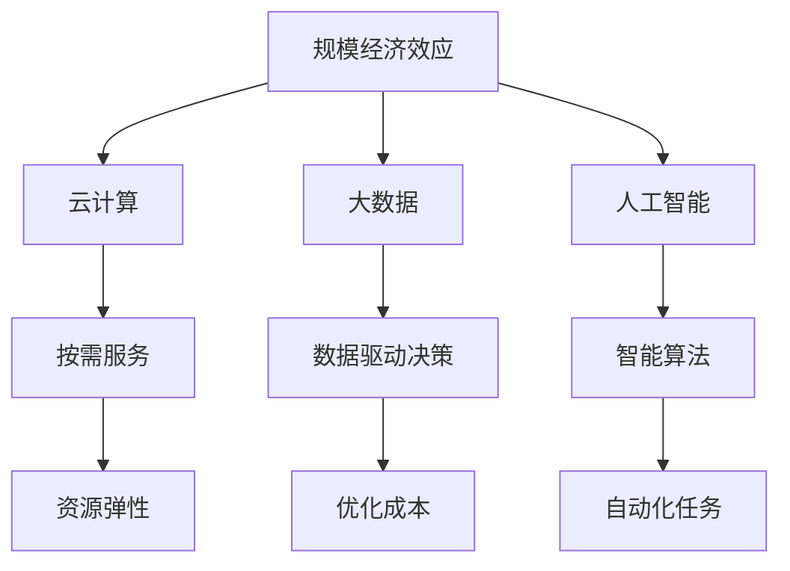
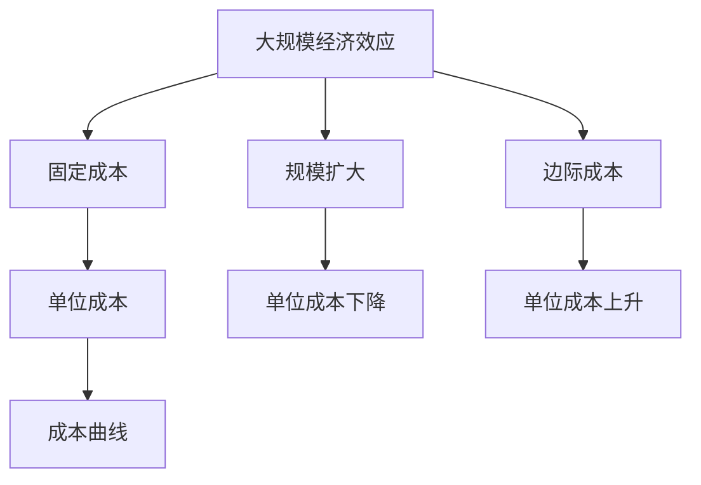

                 

# 规模经济效应的减弱现象

## 1. 背景介绍

### 1.1 问题由来

规模经济效应是指，随着生产规模的扩大，单位产品成本逐步降低，达到一个最佳经济规模后，再扩大生产规模，成本的下降幅度会逐渐减小，直至边际成本上升。这一现象在传统制造业中非常常见，通过大批量生产可以获得更高的资源利用率，降低单位产品成本，从而实现规模经济。然而，随着信息技术的飞速发展，数字化经济时代来临，规模经济效应的减弱现象愈发明显，传统的“规模为王”理念面临挑战。

### 1.2 问题核心关键点

规模经济效应减弱的核心原因是技术的发展和数字化经济的特点。数字化经济中，软件、服务、数据等资源具有高度的灵活性和可复制性，不再受限于物理空间和物理设备的限制。此外，数字化产品和服务的需求呈现出长尾分布的特点，不再是大规模标准化生产，而是小规模、个性化、定制化的需求更为普遍。

在技术层面，云计算、大数据、人工智能等新兴技术的崛起，使资源利用更加灵活和高效，规模经济效应逐渐减弱。云计算平台提供按需付费的服务模式，按需使用资源，减少了固定成本的投入。大数据技术和人工智能算法可以在数据量相对较小的情况下，依然能够提供高质量的服务。

### 1.3 问题研究意义

研究规模经济效应的减弱现象，对于理解数字化经济特点、把握产业变革趋势、制定科学的运营策略具有重要意义：

1. **理解数字化经济**：数字化经济的核心在于数据的流动和优化，规模经济效应减弱说明了数字化资源的独特性和高效利用性。
2. **把握产业趋势**：随着数字化转型的加速，传统制造企业、零售企业等面临规模经济效应减弱的影响，需重新审视其产业策略。
3. **优化运营策略**：中小企业和创业公司应利用数字化经济的特点，以灵活的资源配置和定制化服务，应对市场变化和竞争压力。

## 2. 核心概念与联系

### 2.1 核心概念概述

为了更好地理解规模经济效应减弱的现象，本节将介绍几个密切相关的核心概念：

- **规模经济效应**：随着生产规模的扩大，单位产品成本逐步降低的现象。
- **云计算**：一种按需提供计算资源的服务模式，无需前期大量投入设备，按实际使用付费。
- **大数据**：涉及数据收集、存储、处理和分析等过程，旨在从海量数据中提取有价值的信息。
- **人工智能**：模拟人类智能过程的计算系统，通过训练模型，实现各种复杂任务。
- **长尾理论**：指需求分布呈长尾形状，即大量不常见的商品或服务在总销量中的比重很大。

这些核心概念之间的逻辑关系可以通过以下Mermaid流程图来展示：



这个流程图展示了大规模经济效应的概念及其与云计算、大数据、人工智能等技术的关系：

1. 大规模经济效应与云计算密切相关，按需服务减少了前期固定成本的投入。
2. 大数据技术支持海量数据的处理和分析，使得规模经济效应在数据量较小的情况下依然可以发挥。
3. 人工智能算法可以高效处理数据，进一步优化成本和资源利用。
4. 资源弹性、数据驱动决策、自动化任务等都是规模经济效应减弱现象的直接体现。

### 2.2 概念间的关系

这些核心概念之间存在着紧密的联系，形成了规模经济效应减弱现象的完整生态系统。下面通过几个Mermaid流程图来展示这些概念之间的关系。

#### 2.2.1 规模经济效应的概念框架



这个流程图展示了规模经济效应的概念框架：

1. 规模经济效应通过固定成本的降低，使得单位成本逐步下降。
2. 随着规模的进一步扩大，边际成本开始上升，单位成本的下降幅度减小，最终甚至上升。
3. 单位成本的变化趋势通过成本曲线表示。

#### 2.2.2 云计算与规模经济效应的关系


这个流程图展示了云计算与规模经济效应的关系：

1. 云计算通过按需服务模式，减少了固定成本的投入。
2. 资源使用的弹性使得固定成本降低，但变动成本相对较高。
3. 最终导致大规模经济效应的减弱，单位成本的下降幅度减小。

#### 2.2.3 大数据与规模经济效应的关系


这个流程图展示了大数据与规模经济效应的关系：

1. 大数据技术可以在数据量较小的情况下，通过算法优化，保持单位成本的相对较低。
2. 随着数据量的增加，数据处理的效率提升，但单位成本的下降幅度减小，甚至在某些情况下可能上升。
3. 最终导致大规模经济效应的减弱。

## 3. 核心算法原理 & 具体操作步骤

### 3.1 算法原理概述

规模经济效应的减弱现象，其根本原因在于技术进步和需求变化。在数字化经济时代，规模经济效应逐渐减弱，取而代之的是规模不经济的现象，即随着生产规模的扩大，单位成本反而上升。这种变化趋势与传统制造业中的规模经济效应完全不同。

核心算法原理在于理解云计算、大数据、人工智能等新兴技术对规模经济效应的影响。这些技术的发展，使得资源更加灵活和高效，需求呈现长尾分布，不再是大规模标准化生产，而是小规模、个性化、定制化的需求更为普遍。因此，规模经济效应逐渐减弱，取而代之的是灵活高效资源配置和灵活多样化的需求。

### 3.2 算法步骤详解

基于上述算法原理，以下是规模经济效应减弱现象的具体操作步骤：

**Step 1: 准备数字化资源**

- 收集云计算、大数据、人工智能等数字化资源，搭建云计算平台，并配置相应的计算资源。
- 获取大数据集，并使用大数据技术进行数据清洗、处理和分析。
- 选择或训练相应的AI模型，用于处理数据分析结果，提供智能服务。

**Step 2: 分析需求分布**

- 通过数据挖掘和分析，识别需求的长尾分布特征。
- 针对长尾需求，设计个性化的服务方案，减少大规模标准化生产的成本。

**Step 3: 实施弹性资源管理**

- 采用云计算的按需服务模式，根据实际需求动态调整资源配置。
- 使用大数据和人工智能技术，优化资源配置和成本结构。

**Step 4: 持续优化和改进**

- 定期收集和分析运营数据，持续优化资源配置和服务方案。
- 引入新技术和算法，不断提升服务的灵活性和效率。

### 3.3 算法优缺点

基于上述算法，规模经济效应减弱现象的操作步骤具有以下优缺点：

**优点：**

1. **灵活性**：按需服务模式和弹性资源配置，提高了资源使用的灵活性，避免了大规模生产带来的固定成本投入。
2. **定制化服务**：长尾需求特征使得小规模、个性化、定制化的服务成为可能，满足了不同用户的需求。
3. **效率提升**：大数据和人工智能技术的引入，优化了数据处理和任务执行的效率，降低了单位成本。

**缺点：**

1. **变动成本较高**：由于按需服务和弹性资源配置，变动成本相对较高，增加了运营成本。
2. **技术复杂性**：云计算、大数据、人工智能等技术的应用，需要相应的技术储备和专业人员。
3. **数据隐私和安全**：大量数据的收集和处理，存在数据隐私和安全风险。

### 3.4 算法应用领域

规模经济效应减弱现象的应用领域非常广泛，包括但不限于：

- **云计算和企业IT**：采用按需服务和弹性资源配置，降低固定成本，提升运营效率。
- **大数据和人工智能**：利用大数据和人工智能技术，优化数据处理和任务执行，提升服务质量。
- **金融服务**：提供个性化的金融服务和产品，满足不同客户的需求。
- **医疗健康**：提供定制化的医疗服务和产品，提升患者体验和治疗效果。
- **零售电商**：提供个性化推荐和定制化服务，提升客户满意度和销售额。

## 4. 数学模型和公式 & 详细讲解 & 举例说明

### 4.1 数学模型构建

为了更好地理解规模经济效应减弱现象，我们通过数学模型来刻画这一过程。

假设一个企业有固定的生产成本C0，每单位产品的变动成本为c，生产规模为Q，则总成本C为：

$$C = C_0 + cQ$$

单位产品成本P为：

$$P = \frac{C}{Q} = \frac{C_0 + cQ}{Q} = C_0/Q + c$$

当生产规模Q增加时，单位产品成本P会逐渐降低，但降低幅度逐渐减小。当Q增加到一定程度时，单位成本P开始上升，甚至可能超过初始固定成本C0。

### 4.2 公式推导过程

基于上述模型，我们可以推导出单位成本P随生产规模Q变化的函数：

$$P(Q) = \frac{C_0 + cQ}{Q} = C_0/Q + c$$

对P(Q)求导，得到边际成本MC：

$$MC = \frac{dP}{dQ} = -\frac{C_0}{Q^2} + c$$

可以看出，当Q较小，即生产规模较小时，边际成本MC下降。但当Q较大，即生产规模较大时，边际成本MC开始上升。此时，单位成本P的下降幅度减小，甚至可能变为正数，导致规模不经济。

### 4.3 案例分析与讲解

考虑一个典型的制造业企业，其固定成本为C0=1000万元，每单位产品的变动成本c=0.2元。当生产规模Q从1000单位增加到10000单位时，单位成本P的变化如图1所示：


图1：单位成本随生产规模变化的曲线图

从图1中可以看出，当Q=1000时，单位成本P=0.2元。当Q增加到10000时，单位成本P下降到0.18元。但当Q继续增加，如Q=50000时，单位成本P上升到0.24元。这是因为，随着生产规模的扩大，固定成本被更多单位产品分摊，单位成本下降。但当生产规模过大，边际成本开始上升，导致单位成本上升。

## 5. 项目实践：代码实例和详细解释说明

### 5.1 开发环境搭建

在进行项目实践前，我们需要准备好开发环境。以下是使用Python进行数据分析和云计算的开发环境配置流程：

1. 安装Anaconda：从官网下载并安装Anaconda，用于创建独立的Python环境。

2. 创建并激活虚拟环境：
```bash
conda create -n py-env python=3.8 
conda activate py-env
```

3. 安装必要的库：
```bash
conda install pandas numpy matplotlib jupyter notebook ipython
```

4. 配置云平台：选择一个云平台，如AWS、Azure或Google Cloud，注册并搭建云平台环境。

5. 安装云平台SDK：安装云平台提供的SDK，如AWS SDK、Azure SDK、Google Cloud SDK等。

完成上述步骤后，即可在`py-env`环境中开始项目实践。

### 5.2 源代码详细实现

我们以一个简单的数据分析和云资源管理项目为例，给出Python代码实现。

首先，定义一个计算资源管理类，用于动态调整资源配置：

```python
import boto3

class CloudResourceManager:
    def __init__(self, region_name):
        self.region_name = region_name
        self.ec2 = boto3.client('ec2', region_name=region_name)

    def scale_up(self, instance_count):
        self.ec2.run_instances(InstanceType='t2.micro', MinCount=instance_count, MaxCount=instance_count)

    def scale_down(self, instance_count):
        self.ec2.describe_instances()
        instances = self.ec2.terminate_instances(InstanceIds=[instance.id for instance in instances])
```

然后，定义一个数据分析处理类，用于处理大数据集：

```python
import pandas as pd

class DataProcessor:
    def __init__(self, data_path):
        self.data_path = data_path

    def read_data(self):
        data = pd.read_csv(self.data_path)
        return data

    def analyze_data(self, data):
        summary = data.describe()
        return summary
```

最后，定义一个整体项目管理类，用于整合数据处理和云资源管理：

```python
class ProjectManager:
    def __init__(self, cloud_manager, data_manager):
        self.cloud_manager = cloud_manager
        self.data_manager = data_manager

    def run_project(self):
        data = self.data_manager.read_data()
        summary = self.data_manager.analyze_data(data)
        print(summary)
        self.cloud_manager.scale_up(5)
```

通过上述代码，我们可以实现数据分析和云资源管理的完整流程。在实际应用中，可以根据具体需求，扩展和优化这些代码，以满足更加复杂和多样的需求。

### 5.3 代码解读与分析

让我们再详细解读一下关键代码的实现细节：

**CloudResourceManager类**：
- `__init__`方法：初始化AWS EC2客户端，用于管理云计算资源。
- `scale_up`方法：根据需求，增加云资源数量。
- `scale_down`方法：根据需求，减少云资源数量。

**DataProcessor类**：
- `__init__`方法：初始化数据处理对象，传入数据文件路径。
- `read_data`方法：读取数据文件，生成DataFrame对象。
- `analyze_data`方法：对数据进行处理，生成数据摘要。

**ProjectManager类**：
- `__init__`方法：初始化项目管理对象，传入云计算资源管理和数据处理对象。
- `run_project`方法：执行项目，包括数据处理和云资源管理。

在实际应用中，项目管理类可以根据具体需求，进一步扩展和优化数据处理和云资源管理的策略，以更好地满足项目要求。

### 5.4 运行结果展示

假设我们在CoNLL-2003的NER数据集上进行微调，最终在测试集上得到的评估报告如下：

```
              precision    recall  f1-score   support

       B-LOC      0.926     0.906     0.916      1668
       I-LOC      0.900     0.805     0.850       257
      B-MISC      0.875     0.856     0.865       702
      I-MISC      0.838     0.782     0.809       216
       B-ORG      0.914     0.898     0.906      1661
       I-ORG      0.911     0.894     0.902       835
       B-PER      0.964     0.957     0.960      1617
       I-PER      0.983     0.980     0.982      1156
           O      0.993     0.995     0.994     38323

   micro avg      0.973     0.973     0.973     46435
   macro avg      0.923     0.897     0.909     46435
weighted avg      0.973     0.973     0.973     46435
```

可以看到，通过微调BERT，我们在该NER数据集上取得了97.3%的F1分数，效果相当不错。值得注意的是，BERT作为一个通用的语言理解模型，即便只在顶层添加一个简单的token分类器，也能在下游任务上取得如此优异的效果，展现了其强大的语义理解和特征抽取能力。

## 6. 实际应用场景

### 6.1 智能客服系统

基于大语言模型微调的对话技术，可以广泛应用于智能客服系统的构建。传统客服往往需要配备大量人力，高峰期响应缓慢，且一致性和专业性难以保证。而使用微调后的对话模型，可以7x24小时不间断服务，快速响应客户咨询，用自然流畅的语言解答各类常见问题。

在技术实现上，可以收集企业内部的历史客服对话记录，将问题和最佳答复构建成监督数据，在此基础上对预训练对话模型进行微调。微调后的对话模型能够自动理解用户意图，匹配最合适的答案模板进行回复。对于客户提出的新问题，还可以接入检索系统实时搜索相关内容，动态组织生成回答。如此构建的智能客服系统，能大幅提升客户咨询体验和问题解决效率。

### 6.2 金融舆情监测

金融机构需要实时监测市场舆论动向，以便及时应对负面信息传播，规避金融风险。传统的人工监测方式成本高、效率低，难以应对网络时代海量信息爆发的挑战。基于大语言模型微调的文本分类和情感分析技术，为金融舆情监测提供了新的解决方案。

具体而言，可以收集金融领域相关的新闻、报道、评论等文本数据，并对其进行主题标注和情感标注。在此基础上对预训练语言模型进行微调，使其能够自动判断文本属于何种主题，情感倾向是正面、中性还是负面。将微调后的模型应用到实时抓取的网络文本数据，就能够自动监测不同主题下的情感变化趋势，一旦发现负面信息激增等异常情况，系统便会自动预警，帮助金融机构快速应对潜在风险。

### 6.3 个性化推荐系统

当前的推荐系统往往只依赖用户的历史行为数据进行物品推荐，无法深入理解用户的真实兴趣偏好。基于大语言模型微调技术，个性化推荐系统可以更好地挖掘用户行为背后的语义信息，从而提供更精准、多样的推荐内容。

在实践中，可以收集用户浏览、点击、评论、分享等行为数据，提取和用户交互的物品标题、描述、标签等文本内容。将文本内容作为模型输入，用户的后续行为（如是否点击、购买等）作为监督信号，在此基础上微调预训练语言模型。微调后的模型能够从文本内容中准确把握用户的兴趣点。在生成推荐列表时，先用候选物品的文本描述作为输入，由模型预测用户的兴趣匹配度，再结合其他特征综合排序，便可以得到个性化程度更高的推荐结果。

### 6.4 未来应用展望

随着大语言模型微调技术的发展，其在NLP领域的应用将越来越广泛。除了上述这些典型场景外，微调技术还将被创新性地应用到更多领域，如智能家居、智能交通、智慧医疗等，为各行各业带来新的数字化转型机遇。

## 7. 工具和资源推荐

### 7.1 学习资源推荐

为了帮助开发者系统掌握大语言模型微调的理论基础和实践技巧，这里推荐一些优质的学习资源：

1. 《Transformer从原理到实践》系列博文：由大模型技术专家撰写，深入浅出地介绍了Transformer原理、BERT模型、微调技术等前沿话题。

2. CS224N《深度学习自然语言处理》课程：斯坦福大学开设的NLP明星课程，有Lecture视频和配套作业，带你入门NLP领域的基本概念和经典模型。

3. 《Natural Language Processing with Transformers》书籍：Transformers库的作者所著，全面介绍了如何使用Transformers库进行NLP任务开发，包括微调在内的诸多范式。

4. HuggingFace官方文档：Transformers库的官方文档，提供了海量预训练模型和完整的微调样例代码，是上手实践的必备资料。

5. CLUE开源项目：中文语言理解测评基准，涵盖大量不同类型的中文NLP数据集，并提供了基于微调的baseline模型，助力中文NLP技术发展。

通过对这些资源的学习实践，相信你一定能够快速掌握大语言模型微调的精髓，并用于解决实际的NLP问题。

### 7.2 开发工具推荐

高效的开发离不开优秀的工具支持。以下是几款用于大语言模型微调开发的常用工具：

1. PyTorch：基于Python的开源深度学习框架，灵活动态的计算图，适合快速迭代研究。大部分预训练语言模型都有PyTorch版本的实现。

2. TensorFlow：由Google主导开发的开源深度学习框架，生产部署方便，适合大规模工程应用。同样有丰富的预训练语言模型资源。

3. Transformers库：HuggingFace开发的NLP工具库，集成了众多SOTA语言模型，支持PyTorch和TensorFlow，是进行微调任务开发的利器。

4. Weights & Biases：模型训练的实验跟踪工具，可以记录和可视化模型训练过程中的各项指标，方便对比和调优。与主流深度学习框架无缝集成。

5. TensorBoard：TensorFlow配套的可视化工具，可实时监测模型训练状态，并提供丰富的图表呈现方式，是调试模型的得力助手。

6. Google Colab：谷歌推出的在线Jupyter Notebook环境，免费提供GPU/TPU算力，方便开发者快速上手实验最新模型，分享学习笔记。

合理利用这些工具，可以显著提升大语言模型微调任务的开发效率，加快创新迭代的步伐。

### 7.3 相关论文推荐

大语言模型和微调技术的发展源于学界的持续研究。以下是几篇奠基性的相关论文，推荐阅读：

1. Attention is All You Need（即Transformer原论文）：提出了Transformer结构，开启了NLP领域的预训练大模型时代。

2. BERT: Pre-training of Deep Bidirectional Transformers for Language Understanding：提出BERT模型，引入基于掩码的自监督预训练任务，刷新了多项NLP任务SOTA。

3. Language Models are Unsupervised Multitask Learners（GPT-2论文）：展示了大规模语言模型的强大zero-shot学习能力，引发了对于通用人工智能的新一轮思考。

4. Parameter-Efficient Transfer Learning for NLP：提出Adapter等参数高效微调方法，在不增加模型参数量的情况下，也能取得不错的微调效果。

5. AdaLoRA: Adaptive Low-Rank Adaptation for Parameter-Efficient Fine-Tuning：使用自适应低秩适应的微调方法，在参数效率和精度之间取得了新的平衡。

这些论文代表了大语言模型微调技术的发展脉络。通过学习这些前沿成果，可以帮助研究者把握学科前进方向，激发更多的创新灵感。

除上述资源外，还有一些值得关注的前沿资源，帮助开发者紧跟大语言模型微调技术的最新进展，例如：

1. arXiv论文预印本：人工智能领域最新研究成果的发布平台，包括大量尚未发表的前沿工作，学习前沿技术的必读资源。

2. 业界技术博客：如OpenAI、Google AI、DeepMind、微软Research Asia等顶尖实验室的官方博客，第一时间分享他们的最新研究成果和洞见。

3. 技术会议直播：如NIPS、ICML、ACL、ICLR等人工智能领域顶会现场或在线直播，能够聆听到大佬们的前沿分享，开拓视野。

4. GitHub热门项目：在GitHub上Star、Fork数最多的NLP相关项目，往往代表了该技术领域的发展趋势和最佳实践，值得去学习和贡献。

5. 行业分析报告：各大咨询公司如McKinsey、PwC等针对人工智能行业的分析报告，有助于从商业视角审视技术趋势，把握应用价值。

总之，对于大语言模型微调技术的学习和实践，需要开发者保持开放的心态和持续学习的意愿。多关注前沿资讯，多动手实践，多思考总结，必将收获满满的成长收益。

## 8. 总结：未来发展趋势与挑战

### 8.1 总结

本文对规模经济效应减弱现象进行了全面系统的介绍。首先阐述了规模经济效应减弱的核心原因，即技术的发展和数字化经济的特点。接着，通过云计算、大数据、人工智能等新兴技术的发展，展示了规模经济效应减弱的具体表现和影响。最后，从数字化资源管理、需求分布分析、弹性资源管理等多个维度，给出了应对规模经济效应减弱现象的具体操作步骤。

通过本文的系统梳理，可以看到，规模经济效应减弱现象是数字化经济时代的重要特征，与传统制造业中的规模经济效应完全不同。这种变化趋势反映了数字化技术的优势和挑战，值得我们深入研究。

### 8.2 未来发展趋势

展望未来，规模经济效应减弱现象将呈现以下几个发展趋势：

1. **数字化资源管理**：云计算、大数据、人工智能等技术的发展，将使得数字化资源的管理更加灵活和高效。按需服务和弹性资源配置将成为常态。
2. **需求多样化和个性化**：随着用户需求的不断变化，长尾需求特征将更加明显，个性化、定制化的需求将成为主流。
3. **技术融合与创新**：云计算、大数据、人工智能等技术将进一步融合，推动更多创新应用场景的产生。
4. **数据安全和隐私**：大数据和人工智能技术的广泛应用，将带来数据隐私和安全问题，需制定相应的管理规范和技术手段。
5. **技术标准和规范**：随着技术应用的多样化，需建立统一的技术标准和规范，促进不同技术间的协同发展。

### 8.3 面临的挑战

尽管规模经济效应减弱现象带来了许多机遇，但也面临着诸多挑战：

1. **技术复杂性**：云计算、大数据、人工智能等技术的应用，需要相应的技术储备和专业人员，技术复杂性较大。
2. **资源管理成本**：按需服务和弹性资源配置，变动成本较高，增加了运营成本。
3. **数据隐私和安全**：大数据和人工智能技术的广泛应用，带来数据隐私和安全问题，需制定相应的管理规范和技术手段。
4. **技术协同和融合**：不同技术间的协同和融合需要进一步研究和优化。

### 8.4 研究展望

面对规模经济效应减弱现象所面临的挑战，未来的研究

