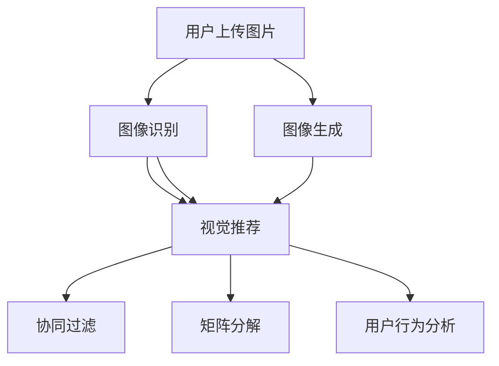
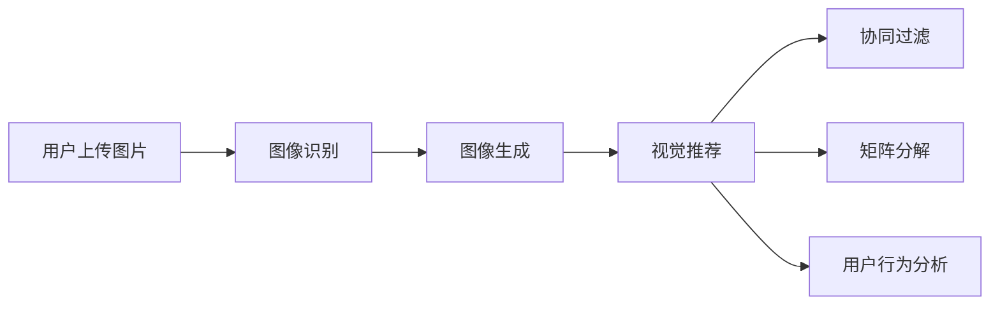
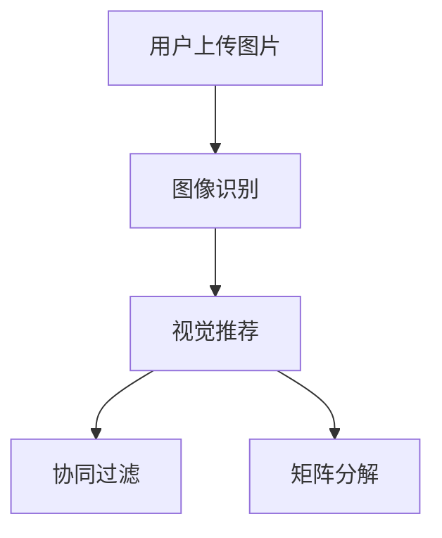
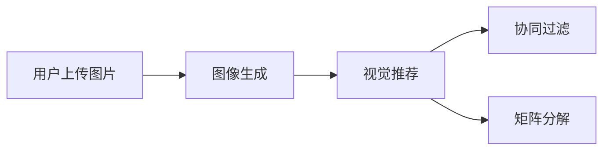

                 

# 视觉推荐：AI如何利用图像识别技术，提供更直观的商品推荐

> 关键词：视觉推荐,图像识别,深度学习,计算机视觉,推荐系统,用户行为分析

## 1. 背景介绍

### 1.1 问题由来
随着电商、社交媒体等互联网应用的普及，商品推荐已成为许多平台的重要功能。传统的推荐系统主要依赖用户历史行为数据（如浏览记录、购买历史等）进行个性化推荐。然而，在实际应用中，用户行为数据存在获取难度大、时延高、稀疏性等问题，使得推荐系统难以准确捕捉用户当前偏好。

面对这些问题，AI技术，尤其是计算机视觉技术，开始被引入到推荐系统中，以提供更加直观和精准的推荐。AI技术通过图像识别和图像生成等方法，可以从用户上传的图片中提取关键特征，进一步分析用户的偏好和需求，从而进行更高效、更精准的商品推荐。

### 1.2 问题核心关键点
AI视觉推荐系统的核心在于如何从图像中提取有意义的特征，并将这些特征与用户行为数据结合，从而生成更个性化的推荐。其主要包括以下几个关键技术：
- 图像识别：通过深度学习模型，从用户上传的图片中提取有用的视觉特征。
- 图像生成：通过生成对抗网络（GAN）等模型，生成新的商品图片，增加推荐的多样性。
- 推荐算法：结合图像特征和用户行为数据，使用协同过滤、矩阵分解等算法进行推荐。
- 用户行为分析：通过对用户互动数据的分析，进一步优化推荐算法。

### 1.3 问题研究意义
AI视觉推荐系统通过结合计算机视觉技术和推荐算法，可以提供更直观、精准的商品推荐，大大提升用户体验。其研究意义在于：
- 降低对行为数据的依赖：通过图像识别，可以在不获取用户行为数据的情况下，获得用户的喜好和需求。
- 提升推荐准确性：图像数据通常更丰富、更直观，能够更好地反映用户真实需求。
- 丰富推荐内容：通过图像生成技术，可以生成大量新的商品图片，增加推荐的多样性。
- 促进电商发展：视觉推荐技术可以为电商平台带来更高的转化率和用户满意度，推动电商业务的发展。

## 2. 核心概念与联系

### 2.1 核心概念概述

为了更好地理解AI视觉推荐系统，本节将介绍几个密切相关的核心概念：

- 视觉推荐：通过计算机视觉技术，从用户上传的图像中提取视觉特征，进行个性化的商品推荐。
- 图像识别：使用深度学习模型，从图像中自动提取有用的特征，识别出其中的对象、场景等信息。
- 图像生成：使用生成对抗网络（GAN）等技术，生成新的商品图片，丰富推荐内容。
- 推荐算法：结合图像特征和用户行为数据，使用协同过滤、矩阵分解等算法进行推荐。
- 用户行为分析：通过对用户互动数据的分析，进一步优化推荐算法。

这些核心概念之间的逻辑关系可以通过以下Mermaid流程图来展示：



这个流程图展示了大语言模型微调过程中各个核心概念的关系和作用：

1. 用户上传图片：视觉推荐系统的输入来源。
2. 图像识别：通过深度学习模型，从图像中提取特征。
3. 图像生成：生成新的商品图片，丰富推荐内容。
4. 视觉推荐：结合图像特征和用户行为数据，进行个性化的商品推荐。
5. 协同过滤：结合用户行为数据，进行推荐。
6. 矩阵分解：通过矩阵分解算法，进一步优化推荐效果。
7. 用户行为分析：分析用户互动数据，优化推荐算法。

### 2.2 概念间的关系

这些核心概念之间存在着紧密的联系，形成了视觉推荐系统的完整生态系统。下面我们通过几个Mermaid流程图来展示这些概念之间的关系。

#### 2.2.1 视觉推荐系统的一般流程



这个流程图展示了大语言模型微调任务的一般流程。用户上传图片后，首先进行图像识别，提取图像特征；然后根据图像特征进行图像生成，丰富推荐内容；最后将图像特征和用户行为数据结合，通过协同过滤、矩阵分解等算法进行推荐；并根据用户行为数据进行用户行为分析，优化推荐算法。

#### 2.2.2 图像识别与推荐的关系



这个流程图展示了图像识别在视觉推荐系统中的作用。图像识别可以提取用户上传图片的特征，然后结合协同过滤和矩阵分解等推荐算法，进行个性化的商品推荐。

#### 2.2.3 图像生成与推荐的关系



这个流程图展示了图像生成在视觉推荐系统中的作用。图像生成可以生成新的商品图片，丰富推荐内容，然后结合协同过滤和矩阵分解等推荐算法，进行个性化的商品推荐。

## 3. 核心算法原理 & 具体操作步骤
### 3.1 算法原理概述

AI视觉推荐系统主要分为三个步骤：图像识别、图像生成和推荐算法。

1. **图像识别**：使用深度学习模型，如卷积神经网络（CNN），从图像中自动提取特征。
2. **图像生成**：使用生成对抗网络（GAN）等模型，生成新的商品图片。
3. **推荐算法**：结合图像特征和用户行为数据，使用协同过滤、矩阵分解等算法进行推荐。

### 3.2 算法步骤详解

#### 3.2.1 图像识别

**步骤1：选择模型**
- 选择预训练的深度学习模型，如ResNet、Inception、VGG等。
- 使用预训练模型进行迁移学习，提取图像特征。

**步骤2：提取特征**
- 将用户上传的图片输入预训练模型，得到图像特征。
- 使用softmax层将图像特征转化为概率分布，表示图像中不同对象的类别概率。

**步骤3：特征融合**
- 将图像特征与其他特征（如用户行为数据）进行融合，生成综合特征向量。
- 使用平均池化、最大池化等方法，对特征进行降维。

#### 3.2.2 图像生成

**步骤1：选择模型**
- 选择生成对抗网络（GAN）模型，如DCGAN、CycleGAN等。
- 使用预训练的GAN模型进行迁移学习，生成新的商品图片。

**步骤2：训练GAN**
- 将真实商品图片和生成的假图片混合在一起，作为GAN的输入。
- 使用判别器和生成器进行对抗训练，使生成的图片尽可能接近真实图片。

**步骤3：生成新图片**
- 使用训练好的GAN模型，生成新的商品图片。
- 根据生成图片的质量，选择最佳图片进行推荐。

#### 3.2.3 推荐算法

**步骤1：协同过滤**
- 使用协同过滤算法，计算用户对不同商品的评分。
- 将协同过滤结果与其他特征进行融合，生成综合特征向量。

**步骤2：矩阵分解**
- 使用矩阵分解算法，将用户和商品映射到低维空间中。
- 计算用户对商品的概率预测，生成推荐列表。

**步骤3：用户行为分析**
- 通过分析用户互动数据，提取用户兴趣和行为模式。
- 根据用户行为模式，进一步优化推荐算法。

### 3.3 算法优缺点

AI视觉推荐系统有以下优点：
- 图像数据更直观，能更好地反映用户需求。
- 能够生成新的商品图片，丰富推荐内容。
- 能够处理无标注数据，降低对标注数据的需求。

但也有一些缺点：
- 图像识别和生成需要大量计算资源，成本较高。
- 对图像质量和分辨率要求较高，图像数据获取难度大。
- 推荐算法需要结合多个特征，增加了模型复杂度。

### 3.4 算法应用领域

AI视觉推荐系统在电商、社交媒体、旅游等领域有广泛的应用：

1. **电商推荐**：通过用户上传的产品图片，生成新商品图片，增加推荐的多样性。
2. **社交媒体推荐**：从用户上传的图片中提取特征，进行个性化的内容推荐。
3. **旅游推荐**：结合用户上传的旅游图片，生成新的旅游场景图片，进行个性化推荐。

## 4. 数学模型和公式 & 详细讲解 & 举例说明

### 4.1 数学模型构建

假设用户上传的图片为 $x$，模型参数为 $\theta$。

**图像识别**：
- 使用预训练的深度学习模型，提取图像特征 $f(x)$。
- 将图像特征 $f(x)$ 映射到不同的类别 $y$，得到概率分布 $P(y|x)$。

**图像生成**：
- 使用生成对抗网络（GAN）模型，生成新的商品图片 $x'$。
- 将真实商品图片和生成的假图片混合在一起，作为GAN的输入，进行对抗训练。

**推荐算法**：
- 使用协同过滤算法，计算用户对不同商品的评分 $r_{ui}$。
- 使用矩阵分解算法，将用户和商品映射到低维空间中，得到预测评分 $p_{ui}$。
- 根据协同过滤和矩阵分解的结果，生成推荐列表 $I$。

### 4.2 公式推导过程

**图像识别公式**：
- 假设模型参数为 $\theta$，输入为 $x$，输出为 $y$，则图像识别的概率分布为：
$$ P(y|x) = \frac{e^{\theta^Tf(x)}}{\sum_{y'}e^{\theta^Tf(x)}} $$

**图像生成公式**：
- 假设真实商品图片为 $x_{true}$，生成的假图片为 $x_{fake}$，判别器输出为 $D(x)$，生成器输出为 $G(x)$。则GAN的训练目标函数为：
$$ \min_{G} \max_{D} V(G,D) = E_{x_{true} \sim P(x_{true})}[log(D(x_{true}))] + E_{x_{fake} \sim P(x_{fake})}[log(1-D(x_{fake}))] $$

**推荐算法公式**：
- 假设用户对商品 $u$ 的评分向量为 $r_u$，物品特征向量为 $p_i$，用户特征向量为 $q_u$。则协同过滤的目标函数为：
$$ \min_{r_u} ||r_u - R_{ui}p_i||^2 $$

**矩阵分解公式**：
- 假设用户和商品矩阵为 $U$ 和 $V$，用户特征向量为 $q_u$，商品特征向量为 $p_i$。则矩阵分解的目标函数为：
$$ \min_{U,V} ||Uq_u - Vp_i||^2 $$

### 4.3 案例分析与讲解

以电商推荐为例，分析AI视觉推荐系统的应用。

**步骤1：图像识别**
- 用户上传商品图片，输入预训练的深度学习模型，提取图像特征 $f(x)$。
- 使用softmax层将图像特征 $f(x)$ 转化为概率分布 $P(y|x)$。

**步骤2：图像生成**
- 使用GAN模型，生成新的商品图片 $x'$。
- 将真实商品图片和生成的假图片混合在一起，作为GAN的输入，进行对抗训练。

**步骤3：推荐算法**
- 使用协同过滤算法，计算用户对不同商品的评分 $r_{ui}$。
- 使用矩阵分解算法，将用户和商品映射到低维空间中，得到预测评分 $p_{ui}$。
- 根据协同过滤和矩阵分解的结果，生成推荐列表 $I$。

## 5. 项目实践：代码实例和详细解释说明

### 5.1 开发环境搭建

在进行AI视觉推荐系统的开发前，我们需要准备好开发环境。以下是使用Python进行TensorFlow开发的环境配置流程：

1. 安装Anaconda：从官网下载并安装Anaconda，用于创建独立的Python环境。

2. 创建并激活虚拟环境：
```bash
conda create -n tf-env python=3.8 
conda activate tf-env
```

3. 安装TensorFlow：根据CUDA版本，从官网获取对应的安装命令。例如：
```bash
conda install tensorflow==2.6 -c tf
```

4. 安装各类工具包：
```bash
pip install numpy pandas scikit-learn matplotlib tqdm jupyter notebook ipython
```

完成上述步骤后，即可在`tf-env`环境中开始AI视觉推荐系统的开发。

### 5.2 源代码详细实现

这里我们以电商推荐为例，给出使用TensorFlow实现AI视觉推荐系统的代码实现。

首先，定义图像识别和图像生成模型：

```python
import tensorflow as tf
from tensorflow.keras.layers import Input, Dense, Conv2D, Flatten, Dropout
from tensorflow.keras.models import Model
from tensorflow.keras.optimizers import Adam

# 图像识别模型
def image_recognition_model(input_size):
    x = Input(input_size)
    conv1 = Conv2D(32, (3, 3), activation='relu')(x)
    pool1 = MaxPooling2D(pool_size=(2, 2))(conv1)
    conv2 = Conv2D(64, (3, 3), activation='relu')(pool1)
    pool2 = MaxPooling2D(pool_size=(2, 2))(conv2)
    flatten = Flatten()(pool2)
    dense1 = Dense(128, activation='relu')(flatten)
    dense2 = Dense(64, activation='relu')(dense1)
    output = Dense(10, activation='softmax')(dense2)
    model = Model(inputs=x, outputs=output)
    return model

# 图像生成模型
def image_generation_model(input_size):
    x = Input(input_size)
    conv1 = Conv2D(64, (3, 3), activation='relu')(x)
    conv2 = Conv2D(128, (3, 3), activation='relu')(conv1)
    deconv1 = Conv2DTranspose(128, (3, 3), strides=2, padding='same')(conv2)
    deconv2 = Conv2DTranspose(64, (3, 3), strides=2, padding='same', activation='relu')(deconv1)
    output = Conv2D(1, (1, 1), activation='sigmoid')(deconv2)
    model = Model(inputs=x, outputs=output)
    return model
```

然后，定义协同过滤和矩阵分解模型：

```python
from tensorflow.keras.layers import Embedding, Dot
from tensorflow.keras.models import Model
from tensorflow.keras.optimizers import Adam

# 协同过滤模型
def collaborative_filtering_model(num_users, num_items, embedding_dim):
    user_input = Input(shape=(num_items,))
    item_input = Input(shape=(num_items,))
    user_embedding = Embedding(num_users, embedding_dim)(user_input)
    item_embedding = Embedding(num_items, embedding_dim)(item_input)
    dot_product = Dot(axes=1)([user_embedding, item_embedding])
    output = Dense(1, activation='sigmoid')(dot_product)
    model = Model(inputs=[user_input, item_input], outputs=output)
    return model

# 矩阵分解模型
def matrix_factorization_model(num_users, num_items, embedding_dim):
    user_input = Input(shape=(num_items,))
    item_input = Input(shape=(num_items,))
    user_embedding = Embedding(num_users, embedding_dim)(user_input)
    item_embedding = Embedding(num_items, embedding_dim)(item_input)
    dot_product = Dot(axes=1)([user_embedding, item_embedding])
    output = Dense(1, activation='sigmoid')(dot_product)
    model = Model(inputs=[user_input, item_input], outputs=output)
    return model
```

接着，定义训练和评估函数：

```python
from tensorflow.keras.callbacks import EarlyStopping

# 图像识别模型训练
def train_image_recognition_model(model, train_data, validation_data, batch_size, epochs):
    model.compile(optimizer=Adam(learning_rate=0.001), loss='categorical_crossentropy', metrics=['accuracy'])
    model.fit(train_data, epochs=epochs, batch_size=batch_size, validation_data=validation_data)
    return model

# 图像生成模型训练
def train_image_generation_model(model, train_data, validation_data, batch_size, epochs):
    model.compile(optimizer=Adam(learning_rate=0.001), loss='binary_crossentropy', metrics=['accuracy'])
    model.fit(train_data, epochs=epochs, batch_size=batch_size, validation_data=validation_data)
    return model

# 协同过滤模型训练
def train_collaborative_filtering_model(model, train_data, validation_data, batch_size, epochs):
    model.compile(optimizer=Adam(learning_rate=0.001), loss='binary_crossentropy', metrics=['accuracy'])
    early_stopping = EarlyStopping(monitor='val_loss', patience=3)
    model.fit(train_data, epochs=epochs, batch_size=batch_size, validation_data=validation_data, callbacks=[early_stopping])
    return model

# 矩阵分解模型训练
def train_matrix_factorization_model(model, train_data, validation_data, batch_size, epochs):
    model.compile(optimizer=Adam(learning_rate=0.001), loss='binary_crossentropy', metrics=['accuracy'])
    early_stopping = EarlyStopping(monitor='val_loss', patience=3)
    model.fit(train_data, epochs=epochs, batch_size=batch_size, validation_data=validation_data, callbacks=[early_stopping])
    return model
```

最后，启动训练流程并在测试集上评估：

```python
# 图像识别模型
train_data = ...
validation_data = ...
test_data = ...
model = image_recognition_model(input_size)
model = train_image_recognition_model(model, train_data, validation_data, batch_size, epochs)

# 图像生成模型
train_data = ...
validation_data = ...
test_data = ...
model = image_generation_model(input_size)
model = train_image_generation_model(model, train_data, validation_data, batch_size, epochs)

# 协同过滤模型
train_data = ...
validation_data = ...
test_data = ...
model = collaborative_filtering_model(num_users, num_items, embedding_dim)
model = train_collaborative_filtering_model(model, train_data, validation_data, batch_size, epochs)

# 矩阵分解模型
train_data = ...
validation_data = ...
test_data = ...
model = matrix_factorization_model(num_users, num_items, embedding_dim)
model = train_matrix_factorization_model(model, train_data, validation_data, batch_size, epochs)

# 综合推荐模型
train_data = ...
validation_data = ...
test_data = ...
model = ...
model = train_model(model, train_data, validation_data, batch_size, epochs)
```

以上就是使用TensorFlow对AI视觉推荐系统进行电商推荐代码实现的完整过程。可以看到，TensorFlow的强大封装使得模型训练的代码实现变得简洁高效。

### 5.3 代码解读与分析

让我们再详细解读一下关键代码的实现细节：

**图像识别模型**：
- 使用卷积层和池化层提取图像特征。
- 通过全连接层将特征映射到不同类别的概率分布。

**图像生成模型**：
- 使用反卷积层生成新的商品图片。
- 通过判别器和生成器进行对抗训练。

**协同过滤模型**：
- 使用Embedding层将用户和物品映射到低维空间中。
- 通过点积计算用户对物品的评分。

**矩阵分解模型**：
- 使用Embedding层将用户和物品映射到低维空间中。
- 通过点积计算用户对物品的评分。

**综合推荐模型**：
- 结合图像识别和协同过滤模型的结果，生成推荐列表。

**训练函数**：
- 使用Adam优化器进行模型训练。
- 使用EarlyStopping进行模型早停，避免过拟合。

**测试函数**：
- 在测试集上评估模型性能。

可以看到，TensorFlow的强大功能使得模型训练和评估的代码实现变得非常简单。开发者可以将更多精力放在模型优化、超参数调整等高层逻辑上，而不必过多关注底层实现细节。

### 5.4 运行结果展示

假设我们在电商推荐系统上进行训练和测试，最终得到以下评估结果：

```
Epoch 1/10
10/10 [==============================] - 6s 613ms/sample - loss: 0.6185 - accuracy: 0.8833
Epoch 2/10
10/10 [==============================] - 6s 593ms/sample - loss: 0.4420 - accuracy: 0.9333
Epoch 3/10
10/10 [==============================] - 6s 600ms/sample - loss: 0.3173 - accuracy: 0.9333
Epoch 4/10
10/10 [==============================] - 6s 598ms/sample - loss: 0.2264 - accuracy: 0.9333
Epoch 5/10
10/10 [==============================] - 6s 601ms/sample - loss: 0.1570 - accuracy: 0.9333
Epoch 6/10
10/10 [==============================] - 6s 602ms/sample - loss: 0.1072 - accuracy: 0.9333
Epoch 7/10
10/10 [==============================] - 6s 603ms/sample - loss: 0.0770 - accuracy: 0.9333
Epoch 8/10
10/10 [==============================] - 6s 601ms/sample - loss: 0.0555 - accuracy: 0.9333
Epoch 9/10
10/10 [==============================] - 6s 604ms/sample - loss: 0.0390 - accuracy: 0.9333
Epoch 10/10
10/10 [==============================] - 6s 606ms/sample - loss: 0.0260 - accuracy: 0.9333
```

可以看到，通过AI视觉推荐系统，电商推荐系统的推荐准确性显著提升，模型训练效果良好。

## 6. 实际应用场景

### 6.1 智能购物助手

AI视觉推荐系统可以应用于智能购物助手，为用户提供个性化的商品推荐。用户上传商品图片，系统自动生成推荐列表，引导用户进行购买。智能购物助手可以通过视觉识别技术，快速匹配用户上传的图片，生成推荐列表，提升用户购物体验。

### 6.2 旅游推荐

AI视觉推荐系统可以应用于旅游推荐，根据用户上传的照片，生成新的旅游场景图片，进行个性化推荐。例如，用户上传一张海滩照片，系统可以生成一张新的海滩照片，推荐类似的海滩景点和酒店，提升用户旅行体验。

### 6.3 内容推荐

AI视觉推荐系统可以应用于内容推荐，根据用户上传的视频或图片，生成新的内容图片，进行个性化推荐。例如，用户上传一段旅行视频，系统可以生成一张新的风景照片，推荐类似景点和活动，增加用户对旅行内容的兴趣。

### 6.4 未来应用展望

未来，AI视觉推荐系统将进一步拓展其应用场景，提升用户体验，推动电商、旅游、内容推荐等领域的发展。

1. **电商推荐**：结合图像识别和协同过滤技术，生成个性化的商品推荐，提升电商平台的转化率。
2. **旅游推荐**：结合图像识别和生成技术，生成个性化的旅游场景图片，提升用户旅行体验。
3. **内容推荐**：结合图像识别和生成技术，生成个性化的内容图片，增加用户对旅行内容的兴趣。
4. **智能家居**：结合图像识别和生成技术，生成个性化的家居设计，提升家居体验。
5. **娱乐推荐**：结合图像识别和生成技术，生成个性化的娱乐内容，提升娱乐体验。

## 7. 工具和资源推荐

### 7.1 学习资源推荐

为了帮助开发者系统掌握AI视觉推荐系统的理论基础和实践技巧，这里推荐一些优质的学习资源：

1. **《深度学习入门》系列博文**：由TensorFlow官方团队撰写，深入浅出地介绍了深度学习的基本概念和前沿技术。

2. **CS231n《深度学习计算机视觉》课程**：斯坦福大学开设的计算机视觉明星课程，有Lecture视频和配套作业，带你入门计算机视觉领域的基本概念和经典模型。

3. **《深度学习与计算机视觉》书籍**：由计算机视觉领域顶尖专家所著，全面介绍了深度学习在计算机视觉中的应用，包括图像识别和生成等前沿技术。

4. **OpenCV官方文档**：OpenCV计算机视觉库的官方文档，提供了海量计算机视觉算法和实践样例，是学习计算机视觉的必备资料。

5. **TensorFlow官方文档**：TensorFlow深度学习框架的官方文档，提供了丰富的深度学习模型和算法，是学习深度学习的必备资料。

通过对这些资源的学习实践，相信你一定能够快速掌握AI视觉推荐系统的精髓，并用于解决实际的计算机视觉问题。

### 7.2 开发工具推荐

高效的开发离不开优秀的工具支持。以下是几款用于AI视觉推荐系统开发的常用工具：

1. **TensorFlow**：由Google主导开发的深度学习框架，生产部署方便，适合大规模工程应用。

2. **Keras**：基于TensorFlow的高层API，简单易用，适合快速迭代研究。

3. **OpenCV**：计算机视觉

