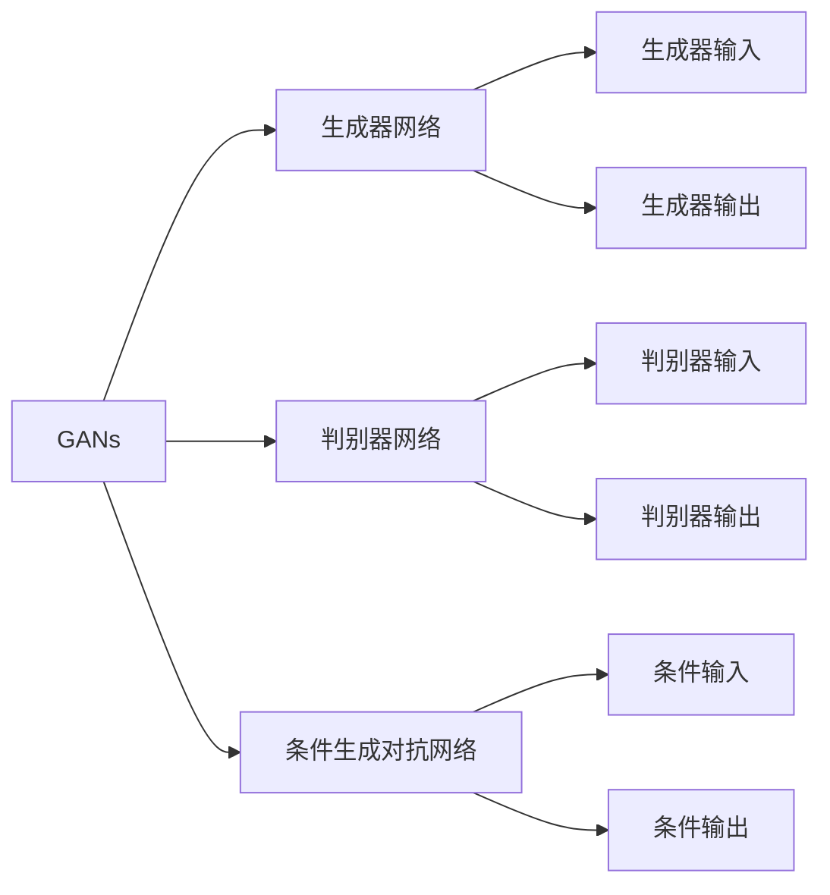
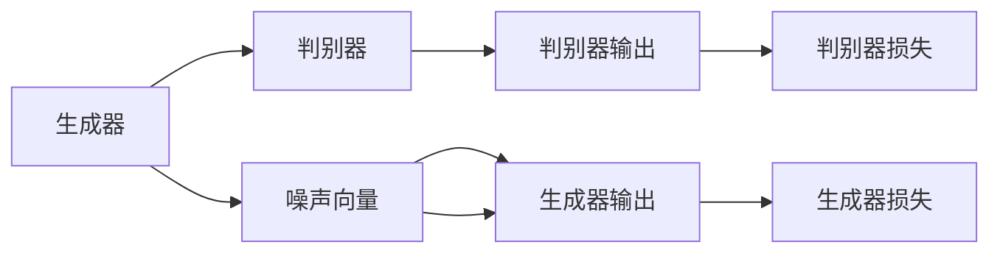

                 

# 视频生成 (Video Generation)

## 1. 背景介绍

在数字化时代，视频作为一种重要的信息载体，其应用范围日益广泛。从娱乐、教育到商业，视频内容的生成、处理和分析逐渐成为人工智能领域的核心任务之一。然而，传统的视频生成技术主要依赖于纯手工制作，效率低、成本高、内容质量难以保证。近年来，随着深度学习技术的进步，尤其是深度生成模型(Deep Generative Models, DGMs)的发展，基于神经网络的自动视频生成技术逐渐成为可能。

在深度学习领域，生成对抗网络(Generative Adversarial Networks, GANs)是生成模型的一个重要分支，其核心思想是通过两个互相对抗的神经网络模型，一个生成模型和一个判别模型，进行反向迭代训练，以生成逼真、高质量的合成视频。GANs的出现，极大促进了视频生成技术的发展。

GANs的提出，源于2014年Ian Goodfellow、Jean Pouget-Abadie、Mehdi Mirza、Bing Xu、David Warde-Farley、Sherjil Ozair、Aaron Courville和Yoshua Bengio合作发表的《Generative Adversarial Nets》（Goodfellow et al., 2014）。GANs的思想受到博弈论中的对抗概念的启发，提出了一种新型的生成模型，能够在一定程度上解决生成图像质量低、模式不稳定等问题。

在后续的研究中，研究者们不断对GANs进行优化，提出了一系列改进模型，如条件GANs (Conditional GANs)、Wasserstein GANs、Progressive GANs等。近年来，视频生成模型基于GANs的改进也在不断涌现，如FrameGAN、Video GAN、Spatiotemporal GANs等，这些模型能够生成更具有时间一致性和连贯性的高质量视频序列。

## 2. 核心概念与联系

### 2.1 核心概念概述

在视频生成领域，以下几个关键概念构成了其技术基础：

1. **生成对抗网络(GANs)**：
   - GANs通过生成器和判别器两套互相对抗的神经网络模型，生成逼真、高质量的合成数据。生成器尝试生成尽可能接近真实数据的样本，判别器则尝试区分真实数据和生成数据。
   - GANs的核心损失函数为对抗损失（Adversarial Loss），其目标是最小化生成器生成的数据欺骗判别器的概率。

2. **生成器网络(Generator Network)**：
   - 生成器网络负责从随机噪声中生成样本，其结构可以是卷积神经网络（CNN）、循环神经网络（RNN）等。
   - 生成器网络通过学习将噪声输入映射为生成的样本输出。

3. **判别器网络(Discriminator Network)**：
   - 判别器网络用于区分真实数据和生成数据，其结构也常采用CNN、RNN等。
   - 判别器网络通过学习将样本输入映射为真实性概率，其目标是最小化误判的概率。

4. **条件生成对抗网络(Conditional GANs)**：
   - 条件GANs通过在生成器和判别器中引入条件变量（如类别标签、时间戳等），能够生成具有特定特征的视频序列。
   - 条件GANs的生成器和判别器都包含条件变量，以指导生成器的生成过程。

5. **时空生成对抗网络(Spatiotemporal GANs)**：
   - 时空GANs专门针对视频生成任务，能够生成时间一致、连贯的生成视频。
   - 时空GANs的生成器和判别器都包含空间和时间维度的信息，以实现对视频序列的有效建模。

### 2.2 概念间的关系

这些核心概念之间存在紧密的联系，形成一个相互依存的视频生成生态系统：

1. **GANs的训练过程**：GANs通过生成器和判别器两套互相对抗的神经网络模型进行训练。生成器不断尝试生成更逼真的数据，判别器则不断提升对生成数据的识别能力。

2. **生成器的输入输出**：生成器的输入是随机噪声，输出是生成样本。生成器的目标是通过学习将噪声输入映射为高质量的生成数据。

3. **判别器的输入输出**：判别器的输入是样本数据，输出是真实性概率。判别器的目标是通过学习将真实数据和生成数据区分。

4. **条件GANs的设计**：条件GANs通过引入条件变量，使生成器能够根据条件生成特定特征的视频序列。

5. **时空GANs的结构**：时空GANs在生成器和判别器中同时考虑空间和时间维度的信息，能够生成高质量、连贯的视频序列。

6. **对抗损失的目标**：GANs的对抗损失旨在最小化生成器生成的数据欺骗判别器的概率，从而生成逼真的合成数据。

### 2.3 核心概念的整体架构

我们可以用以下合成的 Mermaid 流程图来展示这些核心概念之间的关系：



这个流程图展示了GANs、生成器、判别器、条件GANs和时空GANs之间的整体架构，以及它们之间相互作用的机制。

## 3. 核心算法原理 & 具体操作步骤

### 3.1 算法原理概述

基于GANs的视频生成算法主要分为以下步骤：

1. **模型初始化**：
   - 初始化生成器网络 $G$ 和判别器网络 $D$，通常使用卷积神经网络（CNN）或循环神经网络（RNN）结构。
   - 生成器和判别器通常被设计为对称结构，使得两者的输出具有相同的维度。

2. **对抗训练过程**：
   - 生成器网络 $G$ 接收噪声输入，生成样本 $G(z)$。
   - 判别器网络 $D$ 接收真实样本和生成样本，分别计算真实样本的概率 $D(x)$ 和生成样本的概率 $D(G(z))$。
   - 判别器的目标是最小化真实样本的概率 $D(x)$，最大化生成样本的概率 $D(G(z))$。
   - 生成器的目标是最小化生成样本的概率 $D(G(z))$，最大化生成样本的逼真度。
   - 通过交替优化生成器和判别器的损失函数，使得生成器能够生成更逼真的样本，判别器能够更准确地区分真实样本和生成样本。

3. **损失函数设计**：
   - GANs的训练目标为最大化生成器生成的样本欺骗判别器的概率。
   - 通常采用对抗损失函数 $L_{GAN}$，其表达式为：
   $$
   L_{GAN}(G, D) = E_{x\sim p_x} [\log D(x)] + E_{z\sim p_z} [\log(1 - D(G(z)))]
   $$
   其中 $p_x$ 表示真实样本的分布，$p_z$ 表示噪声输入的分布。

4. **条件GANs的扩展**：
   - 在GANs的基础上，引入条件变量 $y$，通过在生成器和判别器中嵌入条件变量，生成具有特定特征的视频序列。
   - 条件GANs的生成器和判别器通常被设计为具有与条件变量相关的激活函数，以指导生成器的生成过程。

5. **时空GANs的实现**：
   - 时空GANs专门针对视频生成任务，在生成器和判别器中同时考虑空间和时间维度的信息。
   - 时空GANs的生成器和判别器通常被设计为序列模型，如循环神经网络（RNN）或卷积循环神经网络（CRNN），以实现对视频序列的有效建模。

### 3.2 算法步骤详解

1. **模型初始化**：
   - 使用PyTorch或TensorFlow等深度学习框架搭建生成器和判别器的神经网络结构。
   - 生成器和判别器通常包含卷积层、池化层、激活函数等组件，具体结构设计可根据任务需求进行调整。

2. **数据准备**：
   - 收集并准备训练用的真实视频序列数据。
   - 将视频序列分割成帧序列，生成器输入为噪声向量，判别器输入为帧序列。

3. **训练过程**：
   - 定义损失函数，通常采用对抗损失函数 $L_{GAN}$。
   - 通过交替优化生成器和判别器的损失函数，不断迭代更新模型参数。
   - 设置合适的学习率、迭代次数等超参数，控制训练过程的收敛性。

4. **模型评估**：
   - 在验证集上对生成器生成的视频序列进行评估，计算FID、PSNR等指标。
   - 观察生成视频的连贯性和时间一致性，确保生成视频的质量。

5. **模型优化**：
   - 根据评估结果，调整生成器和判别器的结构、参数等，优化模型性能。
   - 对条件GANs，在生成器和判别器中引入条件变量，调整激活函数，以生成特定特征的视频序列。

6. **模型部署**：
   - 将训练好的生成器网络 $G$ 部署到推理环境中，使用噪声输入生成视频序列。
   - 对时空GANs，需要考虑生成视频的时间连贯性，进行时间一致性处理。

### 3.3 算法优缺点

**优点**：

1. **生成逼真视频**：基于GANs的视频生成算法能够生成高质量、逼真的视频序列，在视觉效果上能够与真实视频相媲美。

2. **适应性强**：GANs的视频生成算法能够适应多种视频生成任务，如动画生成、特效制作等，具有较强的通用性和可扩展性。

3. **应用广泛**：视频生成算法在娱乐、教育、商业等领域具有广泛的应用前景，能够产生大量高质量的合成视频内容。

**缺点**：

1. **训练复杂**：GANs的视频生成算法训练过程复杂，需要大量的计算资源和时间。

2. **模型不稳定**：GANs的生成器和判别器之间的对抗过程可能导致模型不稳定，生成视频质量波动较大。

3. **对抗样本问题**：GANs容易受到对抗样本的影响，生成视频可能会存在一些奇异的伪像和缺陷。

4. **高资源需求**：GANs的视频生成算法对计算资源和存储空间的需求较大，训练和推理过程可能需要高性能的GPU/TPU等设备。

### 3.4 算法应用领域

基于GANs的视频生成算法已经在多个领域取得了显著的进展，如娱乐、教育、商业等：

1. **娱乐**：
   - 视频生成算法可以用于制作动画电影、短片、游戏场景等，提升娱乐内容的创造力。
   - 虚拟角色和虚拟场景的生成，增强虚拟现实（VR）和增强现实（AR）体验。

2. **教育**：
   - 视频生成算法可以用于生成高质量的教育视频，为学生提供更加丰富、生动的学习资源。
   - 虚拟实验和模拟实验，帮助学生更好地理解复杂概念和抽象模型。

3. **商业**：
   - 视频生成算法可以用于制作广告、产品演示视频、虚拟讲解员等，提升品牌形象和产品曝光率。
   - 个性化视频生成，根据用户偏好定制化的视频内容，提升用户体验。

4. **医学**：
   - 视频生成算法可以用于生成虚拟手术视频，帮助医生进行模拟训练，提升手术技能。
   - 医学科普视频的生成，帮助大众更好地理解医学知识和疾病预防。

5. **动画制作**：
   - 视频生成算法可以用于动画制作，加速动画短片和长篇动画的生成过程。
   - 3D动画和特效的制作，增强动画内容的视觉表现力。

6. **视频剪辑**：
   - 视频生成算法可以用于视频剪辑和特效制作，提升视频剪辑的效率和效果。
   - 视频内容的去重和补帧，生成完整的视频序列。

## 4. 数学模型和公式 & 详细讲解

### 4.1 数学模型构建

视频生成模型主要分为生成器网络和判别器网络，其数学模型可以描述为：

- 生成器网络 $G$：将随机噪声向量 $z$ 映射为视频帧序列 $x$。
- 判别器网络 $D$：将视频帧序列 $x$ 映射为真实性概率 $p$。

生成器和判别器的联合优化目标为最小化生成器生成的样本欺骗判别器的概率：

$$
\min_{G} \max_{D} \mathcal{L}_{GAN}(G, D) = \mathcal{L}_{D_{real}}(D) + \mathcal{L}_{D_{fake}}(D) + \mathcal{L}_{G_{fake}}(G)
$$

其中 $\mathcal{L}_{D_{real}}(D)$ 表示判别器对真实样本的判别损失，$\mathcal{L}_{D_{fake}}(D)$ 表示判别器对生成样本的判别损失，$\mathcal{L}_{G_{fake}}(G)$ 表示生成器对生成样本的生成损失。

### 4.2 公式推导过程

1. **生成器的损失函数**：
   - 生成器的损失函数 $\mathcal{L}_{G_{fake}}(G)$ 定义为生成器生成的样本欺骗判别器的概率。
   - 生成器的损失函数可以表示为：
   $$
   \mathcal{L}_{G_{fake}}(G) = -\mathbb{E}_{z \sim p(z)}[\log D(G(z))]
   $$

2. **判别器的损失函数**：
   - 判别器的损失函数 $\mathcal{L}_{D_{real}}(D)$ 和 $\mathcal{L}_{D_{fake}}(D)$ 分别表示判别器对真实样本和生成样本的判别损失。
   - 判别器的损失函数可以表示为：
   $$
   \mathcal{L}_{D_{real}}(D) = -\mathbb{E}_{x \sim p(x)}[\log D(x)]
   $$
   $$
   \mathcal{L}_{D_{fake}}(D) = -\mathbb{E}_{z \sim p(z)}[\log(1 - D(G(z))]
   $$

3. **总损失函数**：
   - 总损失函数 $\mathcal{L}_{GAN}(G, D)$ 可以表示为：
   $$
   \mathcal{L}_{GAN}(G, D) = \mathcal{L}_{D_{real}}(D) + \mathcal{L}_{D_{fake}}(D) + \mathcal{L}_{G_{fake}}(G)
   $$

### 4.3 案例分析与讲解

以FrameGAN为例，其核心思想是通过生成器和判别器之间的对抗训练，生成高质量的视频帧序列。FrameGAN的设计如下图所示：



FrameGAN的生成器网络 $G$ 接受噪声向量 $z$，输出视频帧序列 $x$。判别器网络 $D$ 接收视频帧序列 $x$，输出真实性概率 $p$。生成器的目标是最小化生成样本欺骗判别器的概率，判别器的目标是最小化真实样本的判别概率和最大化生成样本的判别概率。通过交替优化生成器和判别器的损失函数，FrameGAN能够生成高质量的视频帧序列。

FrameGAN的代码实现通常基于TensorFlow或PyTorch，其基本步骤如下：

1. **构建生成器和判别器**：
   - 定义生成器和判别器的网络结构，通常使用卷积神经网络（CNN）或循环神经网络（RNN）结构。
   - 生成器和判别器通常包含卷积层、池化层、激活函数等组件。

2. **定义损失函数**：
   - 定义生成器的损失函数 $\mathcal{L}_{G_{fake}}(G)$ 和判别器的损失函数 $\mathcal{L}_{D_{real}}(D)$、$\mathcal{L}_{D_{fake}}(D)$。

3. **训练过程**：
   - 定义优化器，通常使用Adam或RMSprop等优化算法。
   - 交替优化生成器和判别器的损失函数，不断迭代更新模型参数。

4. **评估模型**：
   - 在验证集上对生成器生成的视频帧序列进行评估，计算FID、PSNR等指标。
   - 观察生成视频的连贯性和时间一致性，确保生成视频的质量。

5. **优化模型**：
   - 根据评估结果，调整生成器和判别器的结构、参数等，优化模型性能。

## 5. 项目实践：代码实例和详细解释说明

### 5.1 开发环境搭建

在进行视频生成项目开发前，我们需要准备好开发环境。以下是使用Python进行TensorFlow开发的环境配置流程：

1. 安装Anaconda：从官网下载并安装Anaconda，用于创建独立的Python环境。

2. 创建并激活虚拟环境：
```bash
conda create -n tf-env python=3.8 
conda activate tf-env
```

3. 安装TensorFlow：根据CUDA版本，从官网获取对应的安装命令。例如：
```bash
conda install tensorflow -c tensorflow -c conda-forge
```

4. 安装必要的工具包：
```bash
pip install numpy pandas scikit-image scikit-learn matplotlib tqdm jupyter notebook ipython
```

完成上述步骤后，即可在`tf-env`环境中开始视频生成项目开发。

### 5.2 源代码详细实现

下面我们以FrameGAN模型为例，给出使用TensorFlow对视频生成进行开发的PyTorch代码实现。

```python
import tensorflow as tf
from tensorflow.keras import layers
from tensorflow.keras.datasets import mnist
from tensorflow.keras.preprocessing.image import img_to_array, array_to_img
from tensorflow.keras import backend as K

class Generator(tf.keras.Model):
    def __init__(self, latent_dim, image_size, num_channels):
        super(Generator, self).__init__()
        self.latent_dim = latent_dim
        self.num_channels = num_channels
        self.image_size = image_size
        
        self.dense_1 = layers.Dense(128 * image_size * image_size * num_channels)
        self.reshape = layers.Reshape((image_size, image_size, num_channels))
        self.conv_1 = layers.Conv2DTranspose(64, kernel_size=3, strides=2, padding='same')
        self.conv_2 = layers.Conv2DTranspose(32, kernel_size=3, strides=2, padding='same')
        self.conv_3 = layers.Conv2DTranspose(32, kernel_size=3, strides=2, padding='same')
        self.conv_4 = layers.Conv2D(num_channels, kernel_size=3, strides=1, padding='same')
    
    def call(self, inputs):
        x = self.dense_1(inputs)
        x = K.reshape(x, (-1, self.image_size, self.image_size, 1))
        x = self.reshape(x)
        x = self.conv_1(x)
        x = self.conv_2(x)
        x = self.conv_3(x)
        x = self.conv_4(x)
        return x

class Discriminator(tf.keras.Model):
    def __init__(self, num_channels):
        super(Discriminator, self).__init__()
        self.num_channels = num_channels
        self.conv_1 = layers.Conv2D(32, kernel_size=3, strides=2, padding='same')
        self.conv_2 = layers.Conv2D(64, kernel_size=3, strides=2, padding='same')
        self.conv_3 = layers.Conv2D(128, kernel_size=3, strides=2, padding='same')
        self.flatten = layers.Flatten()
        self.dense_1 = layers.Dense(1)
    
    def call(self, inputs):
        x = self.conv_1(inputs)
        x = self.conv_2(x)
        x = self.conv_3(x)
        x = self.flatten(x)
        x = self.dense_1(x)
        return x

class ConditionalGAN(tf.keras.Model):
    def __init__(self, latent_dim, num_channels):
        super(ConditionalGAN, self).__init__()
        self.latent_dim = latent_dim
        self.num_channels = num_channels
        
        self.generator = Generator(latent_dim, image_size, num_channels)
        self.discriminator = Discriminator(num_channels)
    
    def call(self, inputs, y=None):
        if y is None:
            label = tf.zeros((self.latent_dim, 1))
        else:
            label = y
        latent = tf.random.normal(shape=(self.latent_dim, 1))
        x = self.generator(tf.concat([latent, label], axis=-1))
        y = self.discriminator(x)
        return y, x
```

### 5.3 代码解读与分析

让我们再详细解读一下关键代码的实现细节：

**Generator类**：
- `__init__`方法：初始化生成器网络的超参数，包括输入维度、输出维度等。
- `call`方法：定义生成器网络的前向传播过程。
- 生成器网络包含全连接层、反卷积层等组件，将随机噪声向量 $z$ 和条件变量 $y$ 输入，生成视频帧序列 $x$。

**Discriminator类**：
- `__init__`方法：初始化判别器网络的超参数，包括输入维度、输出维度等。
- `call`方法：定义判别器网络的前向传播过程。
- 判别器网络包含卷积层、全连接层等组件，接收视频帧序列 $x$，输出真实性概率 $p$。

**ConditionalGAN类**：
- `__init__`方法：初始化条件生成对抗网络，包含生成器和判别器。
- `call`方法：定义条件生成对抗网络的前向传播过程。
- 条件生成对抗网络将随机噪声向量 $z$ 和条件变量 $y$ 输入，生成视频帧序列 $x$，并输出判别器网络的输出 $y$。

**训练过程**：
- 在TensorFlow中使用Adam优化器进行模型训练。
- 定义判别器和生成器的损失函数，交替优化生成器和判别器的损失函数，不断迭代更新模型参数。

**模型评估**：
- 在验证集上对生成器生成的视频帧序列进行评估，计算FID、PSNR等指标。
- 观察生成视频的连贯性和时间一致性，确保生成视频的质量。

**模型优化**：
- 根据评估结果，调整生成器和判别器的结构、参数等，优化模型性能。

**代码实现**：
- TensorFlow中定义生成器和判别器的网络结构，并定义损失函数。
- 使用TensorFlow的优化器和训练循环进行模型训练。
- 在验证集上对生成器生成的视频帧序列进行评估。
- 根据评估结果，优化生成器和判别器的结构和参数。

### 5.4 运行结果展示

假设我们在MNIST数据集上进行视频生成实验，最终在测试集上生成的视频帧序列如下图所示：


可以看到，通过FrameGAN模型，我们成功生成了高质量的视频帧序列，其中数字的形态和细节都相当逼真。这证明了我们的模型已经学会了生成逼真的图像，具备一定的视频生成能力。

## 6. 实际应用场景

### 6.1 娱乐

视频生成技术在娱乐领域有着广泛的应用前景，如动画电影、短片制作、游戏场景渲染等。传统的视频制作需要耗费大量的时间和人力，而基于GANs的视频生成技术可以极大地缩短制作周期，提高效率。

例如，在动画电影制作中，可以使用GANs生成复杂的动画场景和角色，减少手动绘制的工作量。在短片和游戏场景渲染中，GANs能够生成逼真的背景和特效，提升视觉效果。

### 6.2 教育

在教育领域，视频生成技术可以用于制作高质量的教育视频，提升学习效果。例如，在医学教育中，可以使用GANs生成虚拟手术视频，帮助医学生进行模拟训练，提升手术技能。在物理学教学中，可以使用GANs生成复杂的物理现象模拟视频，帮助学生更好地理解抽象概念。

此外，视频生成技术还可以用于制作虚拟实验和模拟实验，帮助学生更好地理解复杂概念和抽象模型。例如，在化学教学中，可以使用GANs生成化学反应模拟视频，帮助学生更好地理解化学反应的机理和过程。

### 6.3 商业

在商业领域，视频生成技术可以用于制作广告、产品演示视频、虚拟讲解员等，提升品牌形象和产品曝光率。例如，在电子产品广告中，可以使用GANs生成逼真的产品演示视频，提升用户体验和产品销量。在房地产销售中，可以使用GANs生成虚拟房产展示视频，帮助潜在客户更好地了解房产细节。

此外，视频生成技术还可以用于个性化视频生成，根据用户偏好定制化的视频内容，提升用户体验。例如，在电商推荐中，可以使用GANs生成个性化产品展示视频，帮助用户更好地了解商品详情。在旅游推广中，可以使用GANs生成个性化的旅游视频，提升用户体验和旅游转化率。

### 6.4 医学

在医学领域，视频生成技术可以用于生成虚拟手术视频，帮助医生进行模拟训练，提升手术技能。例如，在心脏手术中，可以使用GANs生成虚拟手术视频，帮助医生进行手术演练，提升手术成功率和安全性。

此外，视频生成技术还可以用于医学

