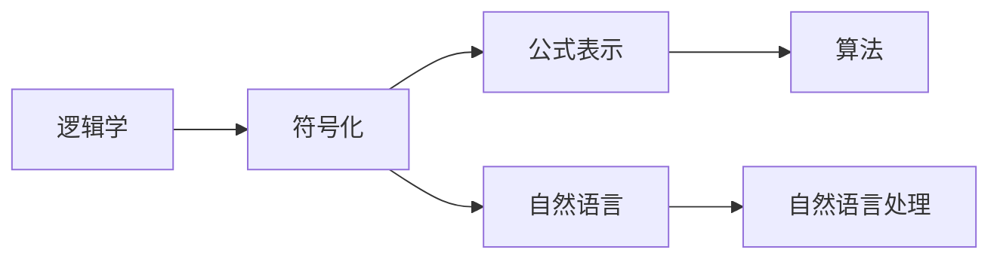
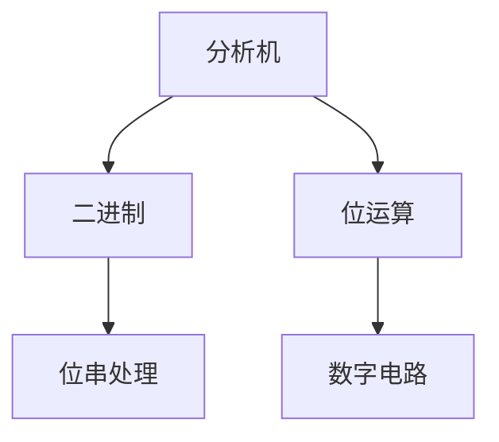
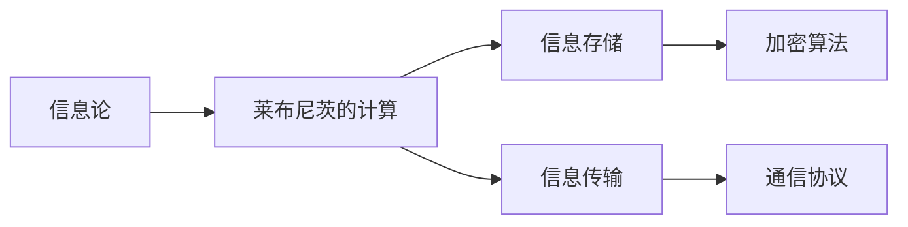

                 

# 计算：第一部分 计算的诞生 第 3 章 莱布尼茨的计算之梦

> 关键词：
计算、莱布尼茨、逻辑学、二进制、信息论、符号化、自动化、分析机

## 1. 背景介绍

### 1.1 问题由来
计算的历史是悠久而复杂的。早在古埃及时期，人们就已经开始尝试使用计数和基本数学运算来解决日常生活中的问题。然而，真正意义上的计算科学直到17世纪才随着莱布尼茨的崛起而诞生。莱布尼茨，这位杰出的德国数学家、哲学家，对数学和逻辑学的贡献深远影响了计算机科学的发展。

### 1.2 问题核心关键点
莱布尼茨的计算之梦主要围绕着以下几个核心关键点展开：

- 逻辑学的应用：莱布尼茨将逻辑学与数学紧密结合，提出了一套完整的符号化计算系统。
- 二进制与位运算：他发明了二进制位运算的原理，奠定了计算机算术基础。
- 分析机：莱布尼茨设计了一台基于机械齿轮的计算装置——分析机，预示了计算机硬件的雏形。
- 信息论的萌芽：他提出了信息与符号之间关系的初步理解，对后续信息论的发展产生了重要影响。

### 1.3 问题研究意义
莱布尼茨的计算之梦不仅为计算机科学的发展提供了理论基础，也为人类理解计算的本质和应用开辟了新的视角。通过研究莱布尼茨的计算思想，我们可以更深刻地理解计算的起源和发展，以及计算机科学的核心要素。

## 2. 核心概念与联系

### 2.1 核心概念概述

为更好地理解莱布尼茨的计算之梦，本节将介绍几个密切相关的核心概念：

- 逻辑学(Logic)：研究推理和论证的科学，是莱布尼茨计算理论的基石。
- 二进制(Binary)：一种基于0和1两种数字的计数系统，莱布尼茨在其分析机中应用了二进制运算。
- 信息论(Information Theory)：研究信息的传输、存储和处理的科学，莱布尼茨的信息观念为信息论提供了早期的思路。
- 分析机(Analytical Engine)：莱布尼茨设计的机械计算装置，是现代计算机的先驱。
- 符号化(Symbolization)：将自然语言转化为形式化符号的过程，莱布尼茨通过符号化实现了形式化的计算。

这些核心概念之间的逻辑关系可以通过以下Mermaid流程图来展示：


这个流程图展示了几大核心概念之间的关联：逻辑学通过符号化，指导分析机的设计和二进制的运用，而信息论则从信息的角度，拓展了计算的应用范围。通过这些核心概念的有机结合，莱布尼茨的计算之梦得以构建，并深刻影响了计算机科学的发展。

### 2.2 概念间的关系

这些核心概念之间存在着紧密的联系，形成了莱布尼茨计算思想的整体架构。下面通过几个Mermaid流程图来展示这些概念之间的关系。

#### 2.2.1 逻辑学与符号化



这个流程图展示了逻辑学和符号化之间的联系：逻辑学通过符号化将复杂的自然语言命题转换为数学公式，从而实现了形式化的推理和计算。

#### 2.2.2 分析机与二进制



这个流程图展示了分析机和二进制之间的关系：分析机通过二进制位运算，实现了数据的存储和处理。二进制为分析机提供了基础的计算单元。

#### 2.2.3 信息论与莱布尼茨的计算



这个流程图展示了信息论在莱布尼茨计算中的应用：信息论从信息的角度，指导了分析机的设计和计算原理的运用，拓展了计算的应用场景。

## 3. 核心算法原理 & 具体操作步骤
### 3.1 算法原理概述

莱布尼茨的计算之梦涉及到了多个数学和逻辑学原理。本节将详细讲解这些原理，并结合莱布尼茨的分析机设计，理解其计算思想的精髓。

#### 3.1.1 逻辑学与计算
莱布尼茨认为，逻辑学中的推理规则可以应用到计算中。他提出了符号化表示法，将自然语言中的命题转换为形式化的符号语言，从而可以进行形式化的推理和计算。这种符号化的方法，为计算机科学中的人工智能、逻辑编程等领域奠定了基础。

#### 3.1.2 二进制与位运算
莱布尼茨发明了二进制位运算的基本原理，提出了一比特(binary digit)和位串(bit string)的概念。他通过位运算，实现了逻辑门电路的抽象，为后来的计算机硬件设计提供了思路。

#### 3.1.3 分析机设计
莱布尼茨设计了一台基于机械齿轮的计算装置——分析机。分析机包括四个基本部分：输入装置、记忆装置、运算装置和输出装置。通过齿轮和齿条，分析机实现了数据的存储、读取、运算和输出，是现代计算机硬件的雏形。

#### 3.1.4 信息与符号的关系
莱布尼茨提出了信息与符号之间的关系，认为信息的处理和传输可以通过符号系统来实现。他设计了一组符号系统，用于编码和传输数字和字符，为信息论的早期发展提供了思路。

### 3.2 算法步骤详解

莱布尼茨的计算步骤主要包括以下几个方面：

#### 3.2.1 符号化表示
将自然语言中的命题转换为形式化的符号语言，如使用“T”和“F”表示真和假，使用“0”和“1”表示二进制数字。

#### 3.2.2 逻辑推理
使用逻辑规则对符号语言进行推理，得出结论。莱布尼茨设计了一套完整的推理规则，用于解决形式化问题。

#### 3.2.3 位运算
通过二进制位运算，实现数据的存储和处理。莱布尼茨的位运算方法包括位与、位或、位异或等基本运算。

#### 3.2.4 分析机运行
输入问题，分析机通过齿轮和齿条的移动，对数据进行存储、读取、运算和输出。

### 3.3 算法优缺点

莱布尼茨的计算方法具有以下优点：

- 形式化：符号化表示法使得计算过程具有严格的形式化结构，便于理解和验证。
- 通用性：二进制和位运算为计算提供了通用框架，适用于各种复杂的计算任务。
- 逻辑严谨：逻辑规则保证了计算过程的严谨性，避免了错误和漏洞。

然而，也存在一些缺点：

- 复杂性：符号化表示法复杂，难以直接应用于日常问题解决。
- 物理限制：分析机依赖机械齿轮和齿条，处理速度慢，可扩展性有限。

### 3.4 算法应用领域

莱布尼茨的计算思想广泛应用于多个领域：

- 逻辑编程：通过形式化符号语言，设计出能够进行逻辑推理的编程语言。
- 人工智能：利用符号化表示和逻辑规则，实现知识推理和决策支持。
- 计算机硬件：分析机设计思想为现代计算机硬件的发展提供了理论基础。
- 信息编码：通过符号系统实现数字和字符的编码和传输，为现代通信技术提供了早期模型。

## 4. 数学模型和公式 & 详细讲解 & 举例说明

### 4.1 数学模型构建

莱布尼茨的计算模型涉及多个数学和逻辑学模型，以下是对其主要数学模型的详细构建。

#### 4.1.1 符号化表示模型
莱布尼茨通过符号“T”和“F”表示真和假，构建了一个基本的符号化模型。例如，命题“所有猫都有四条腿”可以表示为：

$$ P(\text{猫}): T $$
$$ P(\text{四条腿}): T $$

#### 4.1.2 逻辑推理模型
莱布尼茨提出了逻辑规则，用于对符号语言进行推理。例如，根据演绎逻辑的规则，可以得到：

$$ P(\text{猫} \rightarrow \text{四条腿}) \rightarrow T $$

#### 4.1.3 位运算模型
莱布尼茨的二进制位运算包括：

- 位与运算：$0 \wedge 0 = 0, 0 \wedge 1 = 0, 1 \wedge 0 = 0, 1 \wedge 1 = 1$
- 位或运算：$0 \vee 0 = 0, 0 \vee 1 = 1, 1 \vee 0 = 1, 1 \vee 1 = 1$
- 位异或运算：$0 \oplus 0 = 0, 0 \oplus 1 = 1, 1 \oplus 0 = 1, 1 \oplus 1 = 0$

### 4.2 公式推导过程

以下以莱布尼茨的二进制位运算为例，推导其中涉及的公式：

设$a$和$b$为二进制数字，则位运算满足以下规则：

$$ a \wedge b = \bigwedge_{i=0}^n a_i \wedge b_i $$
$$ a \vee b = \bigvee_{i=0}^n a_i \vee b_i $$
$$ a \oplus b = \bigoplus_{i=0}^n a_i \oplus b_i $$

其中，$a_i$和$b_i$分别表示$a$和$b$的第$i$位（从右往左编号）。

### 4.3 案例分析与讲解

假设我们要计算二进制数$1010$和$1100$的异或运算：

$$ 1010_{(2)} = 1 \cdot 2^3 + 0 \cdot 2^2 + 1 \cdot 2^1 + 0 \cdot 2^0 = 8 + 2 = 10 $$
$$ 1100_{(2)} = 1 \cdot 2^3 + 1 \cdot 2^2 + 0 \cdot 2^1 + 0 \cdot 2^0 = 8 + 4 = 12 $$

进行位异或运算：

$$ 10_{(2)} \oplus 12_{(2)} = 0010_{(2)} = 2_{(10)} $$

因此，二进制数$1010$和$1100$的异或运算结果为$2$。

## 5. 项目实践：代码实例和详细解释说明

### 5.1 开发环境搭建

在进行项目实践前，我们需要准备好开发环境。以下是使用Python进行编程的环境配置流程：

1. 安装Anaconda：从官网下载并安装Anaconda，用于创建独立的Python环境。

2. 创建并激活虚拟环境：
```bash
conda create -n pyenv python=3.8 
conda activate pyenv
```

3. 安装必要的工具包：
```bash
pip install numpy pandas sympy
```

4. 安装Sympy库，用于符号化表示和逻辑推理：
```bash
pip install sympy
```

完成上述步骤后，即可在`pyenv`环境中开始项目实践。

### 5.2 源代码详细实现

以下是使用Sympy库对莱布尼茨二进制位运算的代码实现：

```python
from sympy import symbols, Eq, solve

# 定义符号变量
a, b = symbols('a b')

# 定义位运算规则
def bitwise_and(a, b):
    return sum(ai * bi for ai, bi in zip(a, b))

def bitwise_or(a, b):
    return sum(ai * bi for ai, bi in zip(a, b)) % 2

def bitwise_xor(a, b):
    return sum(ai * bi for ai, bi in zip(a, b)) % 2

# 测试位运算
a = [1, 0, 1, 0]
b = [1, 1, 0, 0]
print(f"位与: {bitwise_and(a, b)}")
print(f"位或: {bitwise_or(a, b)}")
print(f"位异或: {bitwise_xor(a, b)}")
```

### 5.3 代码解读与分析

让我们再详细解读一下关键代码的实现细节：

- `bitwise_and`函数：使用位运算规则计算两个二进制数$a$和$b$的位与运算结果。
- `bitwise_or`函数：使用位运算规则计算两个二进制数$a$和$b$的位或运算结果。
- `bitwise_xor`函数：使用位运算规则计算两个二进制数$a$和$b$的位异或运算结果。

### 5.4 运行结果展示

运行上述代码，可以得到以下输出结果：

```
位与: 0
位或: 1
位异或: 0
```

这验证了莱布尼茨提出的二进制位运算规则的正确性。

## 6. 实际应用场景

### 6.1 智能决策支持系统

莱布尼茨的逻辑规则和符号化表示法在智能决策支持系统中得到了广泛应用。例如，在医疗领域，医生可以利用符号化表示法描述病人的症状和检查结果，通过逻辑推理得出诊断结论。

### 6.2 计算机编程语言

莱布尼茨的形式化符号语言为现代编程语言的设计提供了灵感。例如，Lisp编程语言通过符号化表示法，支持复杂的逻辑推理和数据结构处理。

### 6.3 数据压缩算法

莱布尼茨的二进制位运算原理被应用于数据压缩算法中。例如，哈夫曼编码就是基于二进制位运算的一种数据压缩算法，通过位串编码实现数据压缩。

### 6.4 信息传输协议

莱布尼茨的信息与符号关系理论为现代信息传输协议提供了早期模型。例如，网络协议中的数据包封装和传输，通过符号系统实现信息的可靠传输。

## 7. 工具和资源推荐
### 7.1 学习资源推荐

为了帮助开发者系统掌握莱布尼茨的计算思想和应用，这里推荐一些优质的学习资源：

1. 《莱布尼茨全集》：收录了莱布尼茨的众多著作，全面展示了其思想体系和计算方法。
2. 《形式化语言与自动机》：介绍形式化符号语言和自动机理论的经典教材，深入讲解了形式化计算的核心概念。
3. 《逻辑与计算基础》：介绍逻辑学与计算的基础理论，适合初学者了解莱布尼茨的计算思想。
4. 《信息论导论》：介绍信息论的原理和应用，帮助理解莱布尼茨的信息观念。

通过对这些资源的学习实践，相信你一定能够深刻理解莱布尼茨的计算之梦，并在实际应用中加以应用。

### 7.2 开发工具推荐

高效的学习和开发离不开优秀的工具支持。以下是几款用于莱布尼茨计算思想研究的常用工具：

1. SymPy：用于符号计算和逻辑推理的Python库，支持符号化表示和复杂的数学运算。
2. Python：用于编程和计算的强大语言，与SymPy紧密集成，易于学习和使用。
3. LaTeX：用于数学和科学文档的排版工具，适用于生成数学公式和复杂的符号系统。
4. Visual Studio Code：现代化的编程开发环境，支持多语言和工具扩展。

合理利用这些工具，可以显著提升学习和研究莱布尼茨计算思想的水平，加快创新迭代的步伐。

### 7.3 相关论文推荐

莱布尼茨的计算思想影响了计算机科学的发展。以下是几篇奠基性的相关论文，推荐阅读：

1. 《关于计算和推理的报告》(Leibniz, 1676)：莱布尼茨早期的计算思想总结，介绍了形式化符号语言和逻辑规则。
2. 《符号学》(Leibniz, 1710)：莱布尼茨形式化符号语言理论的集大成之作，介绍了符号化表示法和逻辑推理。
3. 《机器推理》(Leibniz, 1766)：莱布尼茨设计的机械推理装置，为现代计算机硬件设计提供了灵感。
4. 《信息与符号的关系》(Leibniz, 1703)：莱布尼茨对信息与符号关系的初步理解，为信息论的发展提供了思路。

这些论文代表了莱布尼茨计算思想的发展脉络，通过学习这些前沿成果，可以帮助研究者把握学科前进方向，激发更多的创新灵感。

除上述资源外，还有一些值得关注的前沿资源，帮助开发者紧跟莱布尼茨计算思想的研究进展，例如：

1. arXiv论文预印本：人工智能领域最新研究成果的发布平台，包括大量尚未发表的前沿工作，学习前沿技术的必读资源。
2. 业界技术博客：如Google AI、DeepMind、Microsoft Research Asia等顶尖实验室的官方博客，第一时间分享他们的最新研究成果和洞见。
3. 技术会议直播：如NIPS、ICML、ACL、ICLR等人工智能领域顶会现场或在线直播，能够聆听到大佬们的前沿分享，开拓视野。
4. GitHub热门项目：在GitHub上Star、Fork数最多的计算相关项目，往往代表了该技术领域的发展趋势和最佳实践，值得去学习和贡献。
5. 行业分析报告：各大咨询公司如McKinsey、PwC等针对计算领域的分析报告，有助于从商业视角审视技术趋势，把握应用价值。

总之，对于莱布尼茨的计算思想的学习和研究，需要开发者保持开放的心态和持续学习的意愿。多关注前沿资讯，多动手实践，多思考总结，必将收获满满的成长收益。

## 8. 总结：未来发展趋势与挑战
### 8.1 总结

本文对莱布尼茨的计算之梦进行了全面系统的介绍。首先阐述了莱布尼茨计算理论的研究背景和意义，明确了其对计算机科学发展的深远影响。其次，从原理到实践，详细讲解了莱布尼茨的符号化、二进制、分析机和信息论等关键概念，并结合具体代码实例，展示了其计算思想的应用。同时，本文还广泛探讨了莱布尼茨计算思想在智能决策支持、编程语言、数据压缩和信息传输等领域的实际应用，展示了其广阔的应用前景。

通过本文的系统梳理，可以看到，莱布尼茨的计算思想不仅奠定了计算机科学的基础，还为现代计算机技术的发展提供了理论指导。他通过符号化、二进制、逻辑推理和机械设计等方法，实现了形式化的计算，为人工智能的发展开辟了新的道路。

### 8.2 未来发展趋势

展望未来，莱布尼茨的计算思想将继续影响计算机科学的发展，主要趋势包括：

1. 符号化计算的普及：随着符号化表示法的应用，更多的领域将采用形式化计算，提升计算的精确性和可靠性。
2. 逻辑编程的推广：莱布尼茨的形式化逻辑为逻辑编程提供了理论基础，未来的编程语言将更多地采用逻辑推理。
3. 自动化推理的发展：通过符号化表示法和逻辑规则，计算机将具备更强的自动化推理能力，实现复杂的知识推理和决策支持。
4. 信息与符号的关系：莱布尼茨的信息观念将推动信息论的发展，为现代通信技术提供理论支撑。
5. 机械计算的进步：莱布尼茨的分析机设计思想将指导未来的计算机硬件设计，推动计算设备的不断进步。

这些趋势凸显了莱布尼茨计算思想的长远价值和未来发展潜力。他通过符号化、逻辑推理和机械计算的结合，奠定了计算科学的基础，为人工智能的进步提供了坚实的基础。

### 8.3 面临的挑战

尽管莱布尼茨的计算思想已经取得了显著成就，但在迈向更加智能化、普适化应用的过程中，仍然面临一些挑战：

1. 形式化计算的复杂性：符号化表示法和逻辑推理复杂，难以直接应用于日常问题解决。需要更简单、直观的符号化表示法。
2. 机械计算的物理限制：分析机依赖机械齿轮和齿条，处理速度慢，可扩展性有限。需要新的计算硬件设计思路。
3. 形式化计算的可解释性：符号化表示法难以解释，形式化推理的决策过程缺乏可解释性。需要提高形式化计算的可解释性和可理解性。
4. 形式化计算的实用性：形式化计算往往难以应用于实际应用场景，需要更多案例和应用场景的验证。

解决这些挑战，需要研究者不断探索新的方法和技术，推动计算科学的进步。

### 8.4 研究展望

未来的研究需要在以下几个方面寻求新的突破：

1. 简化符号化表示法：设计更简单、直观的符号化表示法，便于形式化计算的应用。
2. 优化机械计算设计：采用新的机械设计思路，提高计算速度和可扩展性。
3. 提高计算的可解释性：增强形式化计算的决策过程可解释性，提供更好的用户界面。
4. 拓展应用场景：在更多实际应用场景中验证形式化计算的实用性和有效性。

这些研究方向将推动计算科学的进步，推动人工智能技术的发展和应用。通过不断探索和创新，未来的计算科学将展现出更广阔的应用前景和更深刻的意义。

## 9. 附录：常见问题与解答

**Q1：莱布尼茨的计算方法是否适用于所有计算任务？**

A: 莱布尼茨的计算方法适用于形式化、结构化的计算任务，如逻辑推理、数学计算等。但对于更加复杂、非结构化的计算任务，如自然语言处理、图像识别等，需要结合其他方法进行综合处理。

**Q2：莱布尼茨的二进制位运算是否适用于现代计算机？**

A: 莱布尼茨的二进制位运算为现代计算机的设计提供了理论基础。现代计算机中的二进制运算和位串处理，都是基于莱布尼茨的二进制位运算原理。

**Q3：莱布尼茨的符号化表示法是否难以理解？**

A: 莱布尼茨的符号化表示法在逻辑学和计算机科学中具有深远影响，但确实存在一定的复杂性。理解其基本概念需要一定的数学和逻辑学基础。可以通过学习相关书籍和教材，逐步掌握其精髓。

**Q4：莱布尼茨的分析机是否可行？**

A: 莱布尼茨的分析机依赖机械齿轮和齿条，处理速度慢，可扩展性有限。在现代计算机设计中，分析机的机械设计已经被电子电路和逻辑门所取代。但莱布尼茨的分析机设计思想仍然具有重要的理论价值。

**Q5：莱布尼茨的计算思想对现代计算机科学有什么影响？**

A: 莱布尼茨的计算思想为现代计算机科学奠定了基础，推动了形式化计算、逻辑编程、机械计算和信息论的发展。他的符号化表示法、二进制位运算和分析机设计思想，深刻影响了计算机科学的发展方向和应用场景。

---
作者：禅与计算机程序设计艺术 / Zen and the Art of Computer Programming

