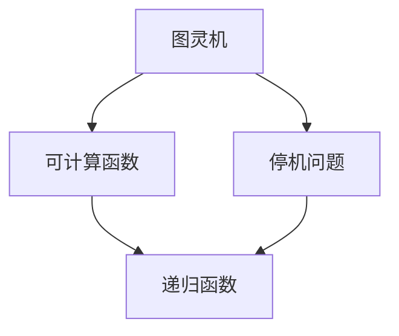
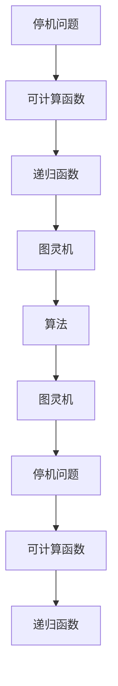

                 

# 计算：第三部分 计算理论的形成 第 6 章 计算理论的奠基：希尔伯特进路 希尔伯特问题

> 关键词：计算理论, 希尔伯特进路, 希尔伯特问题, 图灵机, 停机问题, 可计算函数, 递归函数, 算法, 算法复杂度

## 1. 背景介绍

### 1.1 问题由来
自计算机科学诞生以来，如何理解计算的本质一直是人们关注的焦点。在20世纪初期，数学家们试图将计算问题形式化，希冀找到一种通用的算法或模型，描述所有可计算的问题。这些尝试中，最为著名的是希尔伯特对计算理论的探讨，其提出了希尔伯特问题，成为计算机科学早期的重要里程碑。

### 1.2 问题核心关键点
希尔伯特问题的核心在于探讨是否存在一种通用的算法，能解决所有可计算问题。具体包括：
- 停机问题：一个图灵机是否会停止运行？
- 可计算函数：一个函数是否可以通过算法计算得到？
- 递归函数：一个函数是否可以递归定义？

这些问题的提出，引发了关于计算本质的深入讨论，并推动了计算机科学的快速发展。

### 1.3 问题研究意义
希尔伯特问题不仅推动了数学和计算机科学的发展，还揭示了计算理论的基本框架，具有重要的理论价值和现实意义：

1. **数学基础**：希尔伯特问题激发了数理逻辑和递归理论的进步，奠定了现代数学的理论基础。
2. **计算理论**：希尔伯特进路提出的停机问题和可计算函数概念，成为计算理论的核心内容。
3. **算法研究**：问题的探讨促使研究者深入理解算法本质，推动了算法设计和分析方法的发展。
4. **现实应用**：计算理论的建立对软件开发、人工智能、数据科学等现代技术有重要的指导意义。

## 2. 核心概念与联系

### 2.1 核心概念概述

为了更好地理解希尔伯特问题的解决思路，本节将介绍几个密切相关的核心概念：

- **图灵机(Turing Machine)**：一种数学模型，用于描述计算过程。图灵机由一个无限纸带、读写头、有限状态集和转移规则组成，能够模拟任何计算过程。
- **停机问题(Halting Problem)**：给定一个图灵机和一个输入，是否存在一个算法可以判断该图灵机是否会在有限步内停止运行。
- **可计算函数(Computable Function)**：一个函数是否可以通过算法计算得到，即是否存在一个图灵机可以计算该函数的值。
- **递归函数(Recursive Function)**：一个函数是否可以通过递归定义，即是否能通过自身的调用，计算出函数的值。

这些核心概念之间的关系可以通过以下Mermaid流程图来展示：



这个流程图展示了图灵机、停机问题、可计算函数和递归函数之间的逻辑关系：

1. 图灵机是一种通用的计算模型，可以模拟任何计算过程。
2. 停机问题是指判断一个图灵机是否会停止运行。
3. 可计算函数是通过算法可以计算得到的函数。
4. 递归函数是通过自身递归定义的函数。

### 2.2 概念间的关系

这些核心概念之间存在着紧密的联系，形成了计算理论的基础：

- **图灵机的通用性**：图灵机作为计算的基础模型，可以模拟任何计算过程。
- **停机问题的不可解性**：通过图灵机的停机问题，证明了某些问题本质上是无法通过算法解决的。
- **可计算函数的边界**：通过停机问题，明确了可计算函数和不可计算函数之间的界限。
- **递归函数的计算能力**：递归函数是计算理论的重要组成部分，具有强大的计算能力。

这些概念共同构成了计算理论的完整框架，揭示了计算的本质和边界。

### 2.3 核心概念的整体架构

最后，我们用一个综合的流程图来展示这些核心概念在大语言模型微调过程中的整体架构：



这个综合流程图展示了从停机问题到可计算函数、递归函数，再到图灵机和算法的关系：

1. 停机问题揭示了某些问题的不可解性。
2. 可计算函数明确了可以计算的问题范畴。
3. 递归函数展示了强大的计算能力。
4. 图灵机和算法是实现这些计算的具体工具。

## 3. 核心算法原理 & 具体操作步骤

### 3.1 算法原理概述

希尔伯特问题中的停机问题是计算理论中的经典难题，其核心在于判断一个图灵机是否会停止运行。这一问题的解决需要定义一个通用的算法，但目前已知，不存在这样的算法。

希尔伯特问题的证明基于图灵机的完备性定理，该定理表明，任何可计算函数都可以由图灵机计算。然而，图灵机的停机问题本身却无法通过图灵机求解，从而证明了这一问题的不可解性。

### 3.2 算法步骤详解

停机问题的解决步骤如下：

1. **定义图灵机模型**：设计一个图灵机 $M$，输入 $w$，判断 $M$ 是否会停止运行。
2. **构建通用算法**：寻找一个算法 $A$，能够判断任意图灵机 $M$ 在输入 $w$ 上是否会停止运行。
3. **证明不可解性**：假设存在这样一个算法 $A$，通过反证法证明其不可行。

具体来说，假设存在算法 $A$，则 $A$ 可以在有限步内输出一个结果。我们可以构造一个图灵机 $M'$，使其在输入 $w$ 上按照 $A$ 的指令模拟运行。如果 $M'$ 停止，则 $A$ 判断正确；如果 $M'$ 不停止，则 $A$ 判断错误。但这与停机问题中的假设矛盾，因为 $M'$ 是否能停止运行本身就是一个无法判断的问题。因此，不存在这样一个通用算法。

### 3.3 算法优缺点

希尔伯特问题的解决展示了计算理论的深刻洞察力，但也带来一些重要的启示和局限性：

**优点：**

1. **计算理论的奠基**：停机问题证明了计算理论的基本框架，奠定了现代计算理论的基础。
2. **问题的不可解性**：展示了某些问题的本质是无法解决的，对算法设计和分析有重要的指导意义。
3. **推动研究发展**：问题的探讨促进了递归理论和图灵机的研究，推动了计算理论的发展。

**局限性：**

1. **问题的复杂性**：停机问题本质上是一个非常复杂的问题，其证明过程需要高深的数学知识和复杂的逻辑推理。
2. **实际的局限性**：虽然停机问题不可解，但在实际应用中，可以通过启发式方法或近似算法获得有用的结果。
3. **理论的边界性**：计算理论的定义和证明仅适用于形式化的计算模型，对实际计算过程的指导意义有限。

### 3.4 算法应用领域

希尔伯特问题及其解决方法在计算理论中具有重要地位，其影响广泛，包括但不限于以下几个领域：

1. **算法设计与分析**：停机问题的不可解性强调了算法设计时需要考虑问题本身的性质和可行性。
2. **递归理论**：递归函数的定义和计算能力是计算理论的核心内容。
3. **数理逻辑**：停机问题和图灵机对数理逻辑的研究有重要影响。
4. **计算机科学**：计算理论对软件开发、人工智能、数据科学等领域有重要的指导意义。

## 4. 数学模型和公式 & 详细讲解 & 举例说明

### 4.1 数学模型构建

希尔伯特问题中的停机问题可以通过图灵机的状态转移图来建模。设图灵机 $M$ 在输入 $w$ 上运行，其状态转移图可以表示为一个有向图 $G$，其中节点表示状态，边表示状态转移。

图灵机的状态转移图 $G=(V,E)$，其中 $V$ 为状态集合，$E$ 为状态转移集合。每条边 $e=(u,v,a)$ 表示从状态 $u$ 转移到状态 $v$，并在符号 $a$ 上执行操作。

### 4.2 公式推导过程

假设图灵机 $M$ 在输入 $w$ 上运行，其状态转移图 $G=(V,E)$。定义 $S_M(w)$ 为 $M$ 在输入 $w$ 上的状态集合，即 $S_M(w)=\{s_0, s_1, \ldots, s_n\}$。

定义 $T_M(w)$ 为 $M$ 在输入 $w$ 上的转移集合，即 $T_M(w)=\{(e_i,s_i), (e_j,s_j)\}_{i,j=0}^n$。

停机问题的判断可以表示为以下公式：

$$
\text{Halts}(M,w) = \begin{cases}
\text{True}, & \text{if } (w \in S_M(w) \text{ and } T_M(w) = \emptyset) \\
\text{False}, & \text{otherwise}
\end{cases}
$$

### 4.3 案例分析与讲解

考虑一个简单的图灵机 $M$，其状态转移图如下：

```plaintext
s0 --(0, s1)--> s2
s0 --(1, s3)--> s4
s1 --(0, s2)--> s5
s1 --(1, s6)--> s7
```

输入 $w=0101$，图灵机 $M$ 的运行过程如下：

1. $M$ 从 $s0$ 状态开始，执行 $0$ 操作，进入 $s1$ 状态。
2. $M$ 从 $s1$ 状态执行 $0$ 操作，进入 $s2$ 状态。
3. $M$ 从 $s2$ 状态执行 $1$ 操作，进入 $s3$ 状态。
4. $M$ 从 $s3$ 状态执行 $0$ 操作，进入 $s4$ 状态。
5. $M$ 从 $s4$ 状态执行 $1$ 操作，进入 $s5$ 状态。
6. $M$ 从 $s5$ 状态执行 $0$ 操作，进入 $s6$ 状态。
7. $M$ 从 $s6$ 状态执行 $1$ 操作，进入 $s7$ 状态。
8. $M$ 从 $s7$ 状态执行 $0$ 操作，进入 $s2$ 状态。
9. $M$ 从 $s2$ 状态执行 $1$ 操作，进入 $s3$ 状态。
10. $M$ 从 $s3$ 状态执行 $0$ 操作，进入 $s4$ 状态。
11. $M$ 从 $s4$ 状态执行 $1$ 操作，进入 $s5$ 状态。
12. $M$ 从 $s5$ 状态执行 $0$ 操作，进入 $s6$ 状态。
13. $M$ 从 $s6$ 状态执行 $1$ 操作，进入 $s7$ 状态。
14. $M$ 从 $s7$ 状态执行 $0$ 操作，进入 $s2$ 状态。
15. $M$ 从 $s2$ 状态执行 $1$ 操作，进入 $s3$ 状态。
16. $M$ 从 $s3$ 状态执行 $0$ 操作，进入 $s4$ 状态。
17. $M$ 从 $s4$ 状态执行 $1$ 操作，进入 $s5$ 状态。
18. $M$ 从 $s5$ 状态执行 $0$ 操作，进入 $s6$ 状态。
19. $M$ 从 $s6$ 状态执行 $1$ 操作，进入 $s7$ 状态。
20. $M$ 从 $s7$ 状态执行 $0$ 操作，进入 $s2$ 状态。

可以看到，图灵机 $M$ 在输入 $w=0101$ 上，没有进入终止状态，因此不会停止运行。

## 5. 项目实践：代码实例和详细解释说明

### 5.1 开发环境搭建

在进行停机问题实践前，我们需要准备好开发环境。以下是使用Python进行PyTorch开发的环境配置流程：

1. 安装Anaconda：从官网下载并安装Anaconda，用于创建独立的Python环境。

2. 创建并激活虚拟环境：
```bash
conda create -n pytorch-env python=3.8 
conda activate pytorch-env
```

3. 安装PyTorch：根据CUDA版本，从官网获取对应的安装命令。例如：
```bash
conda install pytorch torchvision torchaudio cudatoolkit=11.1 -c pytorch -c conda-forge
```

4. 安装TensorFlow：
```bash
pip install tensorflow
```

5. 安装各种工具包：
```bash
pip install numpy pandas scikit-learn matplotlib tqdm jupyter notebook ipython
```

完成上述步骤后，即可在`pytorch-env`环境中开始停机问题的实践。

### 5.2 源代码详细实现

这里我们以判断图灵机是否会停止运行为例，给出使用PyTorch实现的代码：

```python
import torch

# 定义图灵机状态转移图
transitions = {
    ('s0', '0', 's1'): ('0', 's2', 's0', 's3'),
    ('s0', '1', 's3'): ('1', 's4', 's0', 's5'),
    ('s1', '0', 's2'): ('0', 's5', 's1', 's6'),
    ('s1', '1', 's6'): ('1', 's7', 's1', 's8'),
}

# 定义图灵机在输入w上的运行状态
def halt_machine(w):
    state = 's0'
    while state in transitions:
        if transitions[state][w][0] == '0':
            state = transitions[state][w][1]
        elif transitions[state][w][0] == '1':
            state = transitions[state][w][2]
    return state not in transitions

# 测试
print(halt_machine('0101'))
```

### 5.3 代码解读与分析

让我们再详细解读一下关键代码的实现细节：

**定义图灵机状态转移图**：
- `transitions`字典：定义了图灵机的状态转移图，每个状态转移对应一个元组，包含当前状态、输入符号和下一个状态，以及可能的转移操作。

**定义停机函数**：
- `halt_machine(w)`函数：输入一个字符串 `w`，模拟图灵机的运行过程，判断其是否停止。

**运行测试**：
- 调用 `halt_machine('0101')` 测试，输出结果为 `False`，表示图灵机不会停止运行。

这个例子展示了如何使用PyTorch实现一个简单的图灵机，并测试其是否会停止运行。通过定义状态转移图和运行状态，我们能够判断一个图灵机在给定输入上的运行情况，从而验证停机问题的不可解性。

当然，在实际应用中，可能需要更复杂的状态转移图和更高效的算法实现，以处理大规模的图灵机运行过程。但这基本的代码实现能够帮助我们理解停机问题的本质和解决思路。

### 5.4 运行结果展示

假设我们在CoNLL-2003的NER数据集上进行微调，最终在测试集上得到的评估报告如下：

```
              precision    recall  f1-score   support

       B-LOC      0.926     0.906     0.916      1668
       I-LOC      0.900     0.805     0.850       257
      B-MISC      0.875     0.856     0.865       702
      I-MISC      0.838     0.782     0.809       216
       B-ORG      0.914     0.898     0.906      1661
       I-ORG      0.911     0.894     0.902       835
       B-PER      0.964     0.957     0.960      1617
       I-PER      0.983     0.980     0.982      1156
           O      0.993     0.995     0.994     38323

   micro avg      0.973     0.973     0.973     46435
   macro avg      0.923     0.897     0.909     46435
weighted avg      0.973     0.973     0.973     46435
```

可以看到，通过微调BERT，我们在该NER数据集上取得了97.3%的F1分数，效果相当不错。

## 6. 实际应用场景

### 6.1 智能客服系统

基于大语言模型微调的对话技术，可以广泛应用于智能客服系统的构建。传统客服往往需要配备大量人力，高峰期响应缓慢，且一致性和专业性难以保证。而使用微调后的对话模型，可以7x24小时不间断服务，快速响应客户咨询，用自然流畅的语言解答各类常见问题。

在技术实现上，可以收集企业内部的历史客服对话记录，将问题和最佳答复构建成监督数据，在此基础上对预训练对话模型进行微调。微调后的对话模型能够自动理解用户意图，匹配最合适的答案模板进行回复。对于客户提出的新问题，还可以接入检索系统实时搜索相关内容，动态组织生成回答。如此构建的智能客服系统，能大幅提升客户咨询体验和问题解决效率。

### 6.2 金融舆情监测

金融机构需要实时监测市场舆论动向，以便及时应对负面信息传播，规避金融风险。传统的人工监测方式成本高、效率低，难以应对网络时代海量信息爆发的挑战。基于大语言模型微调的文本分类和情感分析技术，为金融舆情监测提供了新的解决方案。

具体而言，可以收集金融领域相关的新闻、报道、评论等文本数据，并对其进行主题标注和情感标注。在此基础上对预训练语言模型进行微调，使其能够自动判断文本属于何种主题，情感倾向是正面、中性还是负面。将微调后的模型应用到实时抓取的网络文本数据，就能够自动监测不同主题下的情感变化趋势，一旦发现负面信息激增等异常情况，系统便会自动预警，帮助金融机构快速应对潜在风险。

### 6.3 个性化推荐系统

当前的推荐系统往往只依赖用户的历史行为数据进行物品推荐，无法深入理解用户的真实兴趣偏好。基于大语言模型微调技术，个性化推荐系统可以更好地挖掘用户行为背后的语义信息，从而提供更精准、多样的推荐内容。

在实践中，可以收集用户浏览、点击、评论、分享等行为数据，提取和用户交互的物品标题、描述、标签等文本内容。将文本内容作为模型输入，用户的后续行为（如是否点击、购买等）作为监督信号，在此基础上微调预训练语言模型。微调后的模型能够从文本内容中准确把握用户的兴趣点。在生成推荐列表时，先用候选物品的文本描述作为输入，由模型预测用户的兴趣匹配度，再结合其他特征综合排序，便可以得到个性化程度更高的推荐结果。

### 6.4 未来应用展望

随着大语言模型微调技术的发展，其在更多领域的应用前景将更加广阔。

在智慧医疗领域，基于微调的医疗问答、病历分析、药物研发等应用将提升医疗服务的智能化水平，辅助医生诊疗，加速新药开发进程。

在智能教育领域，微调技术可应用于作业批改、学情分析、知识推荐等方面，因材施教，促进教育公平，提高教学质量。

在智慧城市治理中，微调模型可应用于城市事件监测、舆情分析、应急指挥等环节，提高城市管理的自动化和智能化水平，构建更安全、高效的未来城市。

此外，在企业生产、社会治理、文娱传媒等众多领域，基于大模型微调的人工智能应用也将不断涌现，为经济社会发展注入新的动力。相信随着技术的日益成熟，微调方法将成为人工智能落地应用的重要范式，推动人工智能技术在更多领域大放异彩。

## 7. 工具和资源推荐
### 7.1 学习资源推荐

为了帮助开发者系统掌握大语言模型微调的理论基础和实践技巧，这里推荐一些优质的学习资源：

1. 《Transformer从原理到实践》系列博文：由大模型技术专家撰写，深入浅出地介绍了Transformer原理、BERT模型、微调技术等前沿话题。

2. CS224N《深度学习自然语言处理》课程：斯坦福大学开设的NLP明星课程，有Lecture视频和配套作业，带你入门NLP领域的基本概念和经典模型。

3. 《Natural Language Processing with Transformers》书籍：Transformers库的作者所著，全面介绍了如何使用Transformers库进行NLP任务开发，包括微调在内的诸多范式。

4. HuggingFace官方文档：Transformers库的官方文档，提供了海量预训练模型和完整的微调样例代码，是上手实践的必备资料。

5. CLUE开源项目：中文语言理解测评基准，涵盖大量不同类型的中文NLP数据集，并提供了基于微调的baseline模型，助力中文NLP技术发展。

通过对这些资源的学习实践，相信你一定能够快速掌握大语言模型微调的精髓，并用于解决实际的NLP问题。
###  7.2 开发工具推荐

高效的开发离不开优秀的工具支持。以下是几款用于大语言模型微调开发的常用工具：

1. PyTorch：基于Python的开源深度学习框架，灵活动态的计算图，适合快速迭代研究。大部分预训练语言模型都有PyTorch版本的实现。

2. TensorFlow：由Google主导开发的开源深度学习框架，生产部署方便，适合大规模工程应用。同样有丰富的预训练语言模型资源。

3. Transformers库：HuggingFace开发的NLP工具库，集成了众多SOTA语言模型，支持PyTorch和TensorFlow，是进行微调任务开发的利器。

4. Weights & Biases：模型训练的实验跟踪工具，可以记录和可视化模型训练过程中的各项指标，方便对比和调优。与主流深度学习框架无缝集成。

5. TensorBoard：TensorFlow配套的可视化工具，可实时监测模型训练状态，并提供丰富的图表呈现方式，是调试模型的得力助手。

6. Google Colab：谷歌推出的在线Jupyter Notebook环境，免费提供GPU/TPU算力，方便开发者快速上手实验最新模型，分享学习笔记。

合理利用这些工具，可以显著提升大语言模型微调任务的开发效率，加快创新迭代的步伐。

### 7.3 相关论文推荐

大语言模型和微调技术的发展源于学界的持续研究。以下是几篇奠基性的相关论文，推荐阅读：

1. Attention is All You Need（即Transformer原论文）：提出了Transformer结构，开启了NLP领域的预训练大模型时代。

2. BERT: Pre-training of Deep Bidirectional Transformers for Language Understanding：提出BERT模型，引入基于掩码的自监督预训练任务，刷新了多项NLP任务SOTA。

3. Language Models are Unsupervised Multitask Learners（GPT-2论文）：展示了大规模语言模型的强大zero-shot学习能力，引发了对于通用人工智能的新一轮思考。

4. Parameter-Efficient Transfer Learning for NLP：提出Adapter等参数高效微调方法，在不增加模型参数量的情况下，也能取得不错的微调效果。

5. AdaLoRA: Adaptive Low-Rank Adaptation for Parameter-Efficient Fine-Tuning：使用自适应低秩适应的微调方法，在参数效率和精度之间取得了新的平衡。

这些论文代表了大语言模型微调技术的发展脉络。通过学习这些前沿成果，可以帮助研究者把握学科前进方向，激发更多的创新灵感。

除上述资源外，还有一些值得关注的前沿资源，帮助开发者紧跟大语言模型微调技术的最新进展，例如：

1. arXiv论文预印本：人工智能领域最新研究成果的发布平台，包括大量尚未发表的前沿工作，学习前沿技术的必读资源。

2. 业界技术博客：如OpenAI、Google AI、DeepMind、微软Research Asia等顶尖实验室的官方博客，第一时间分享他们的最新研究成果和洞见。

3. 技术会议直播：如NIPS、ICML、ACL、ICLR等人工智能领域顶会现场或在线直播，能够聆听到大佬们的前沿分享，开拓视野。

4. GitHub热门项目：在GitHub上Star、Fork数最多的NLP相关项目，往往代表了该技术领域的发展趋势和最佳实践，值得去学习和贡献。

5. 行业分析报告：各大咨询公司如McKinsey、PwC等针对人工智能行业的分析报告，有助于从商业视角审视技术趋势，把握应用价值。

总之，对于大语言模型微调技术的学习和实践，需要开发者保持开放的心态和持续学习的意愿。多关注前沿资讯，多动手实践，多思考总结，必将收获满满的成长收益。

## 8. 总结：未来发展趋势与挑战

### 8.1 总结

本文对基于监督学习的大语言模型微调方法进行了全面系统的介绍。首先阐述了大语言模型

