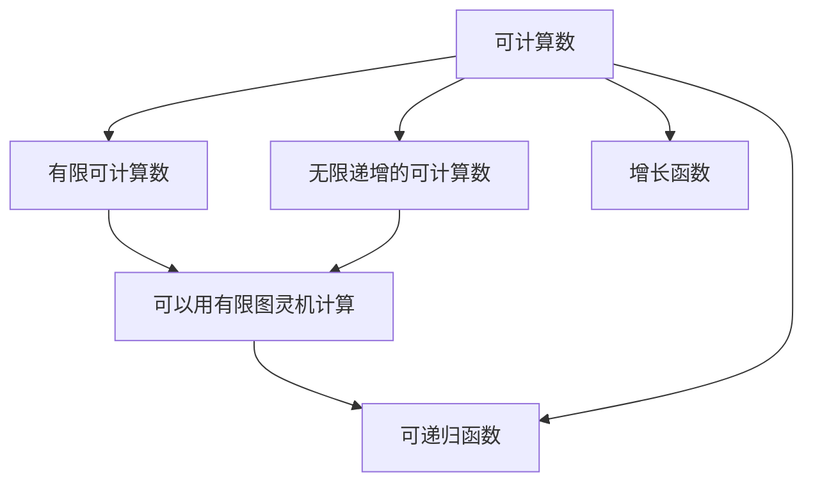
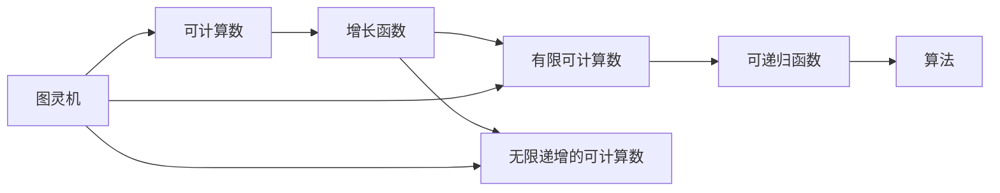

                 

# 计算：第三部分 计算理论的形成 第 8 章 计算理论的诞生：图灵的可计算数 快速增长函数

## 1. 背景介绍

### 1.1 问题由来
计算理论（Computational Theory）是计算机科学中的基础领域，研究如何通过有限步算法解决无限问题。这一理论的诞生，源于图灵机（Turing Machine）的提出和可计算性（Computability）的探讨。图灵机的概念由艾伦·图灵（Alan Turing）在1936年提出，是现代计算理论的基石。

图灵机通过在无限符号带（Tape）上移动读写头（Head），模拟人类计算过程。图灵证明了所有可计算问题都可以由图灵机求解，且可计算函数的集合与可递归函数（Recursive Function）等价。这一理论的提出，奠定了计算机科学理论基础，推动了计算机科学的发展。

### 1.2 问题核心关键点
图灵的可计算数（Computable Numbers）及其增长函数（Growth Function）是计算理论的重要组成部分。可计算数指的是可以用图灵机计算的实数，其增长函数描述了可计算数序列的增长速度。研究可计算数的增长函数，有助于理解不同算法的时间复杂度，为算法设计和优化提供理论依据。

图灵的可计算数包括无限递增的可计算数和有限计算数。有限计算数可以由有限图灵机计算，而无限递增的可计算数则需要无限图灵机计算。图灵机通过不同的策略（如枚举、迭代等），实现了对可计算数序列的快速计算。

### 1.3 问题研究意义
研究图灵的可计算数及其增长函数，对于理解计算复杂度、设计高效算法、优化计算资源配置具有重要意义。以下是图灵可计算数及其增长函数在计算机科学中的应用：

- **算法设计**：了解可计算数及其增长函数，有助于设计高效算法，如快速排序、哈希表等。
- **复杂度分析**：通过增长函数的比较，可以分析不同算法的时间复杂度和空间复杂度。
- **计算资源优化**：基于可计算数的增长理论，优化计算资源配置，提高计算效率。
- **理论研究**：研究可计算数的增长函数，为计算机科学理论研究提供基础。
- **计算机应用**：在人工智能、密码学、自动控制等领域，基于可计算数和增长函数设计算法，提升系统性能。

## 2. 核心概念与联系

### 2.1 核心概念概述

图灵的可计算数及其增长函数是大计算理论中的核心概念，本节将详细介绍这些概念及其相互关系。

- **可计算数（Computable Number）**：指可以用图灵机计算的实数，包括有限可计算数和无限递增的可计算数。有限可计算数可以用有限图灵机计算，而无限递增的可计算数则需要无限图灵机计算。
- **增长函数（Growth Function）**：描述可计算数序列增长速度的函数。常用的增长函数包括线性增长、指数增长、多项式增长等。
- **有限可计算数（Finite Computable Number）**：可以用有限图灵机在有限步内计算得到的数。
- **无限递增的可计算数（Infinitely Increasing Computable Number）**：可以用无限图灵机在无限步内计算得到的数，且其值随步数无限增长。
- **可递归函数（Recursive Function）**：可以用递归算法计算的函数。图灵证明了可计算数与可递归函数等价。

这些概念通过图灵机的计算能力联系在一起，构成了计算理论的基础。通过分析可计算数的增长函数，我们可以进一步理解计算复杂度，为算法设计和优化提供依据。

### 2.2 概念间的关系

可计算数及其增长函数间的关系可以通过以下Mermaid流程图来展示：



这个流程图展示了大计算理论中可计算数及其增长函数的关系：

1. 可计算数包括有限可计算数和无限递增的可计算数。
2. 有限可计算数可以用有限图灵机计算。
3. 无限递增的可计算数则需要无限图灵机计算。
4. 可计算数与可递归函数等价。
5. 可计算数序列的增长速度由增长函数描述。

### 2.3 核心概念的整体架构

最后，我们用一个综合的流程图来展示这些核心概念在大计算理论中的整体架构：



这个综合流程图展示了从图灵机到可计算数及其增长函数，再到可递归函数和算法的关系：

1. 图灵机通过计算能力定义了可计算数的范围。
2. 可计算数包括有限可计算数和无限递增的可计算数。
3. 增长函数描述了可计算数序列的增长速度。
4. 可计算数与可递归函数等价，描述了可计算函数的性质。
5. 可递归函数通过算法实现，将可计算数转化为实际计算结果。

这些概念共同构成了计算理论的基石，为理解计算复杂度、设计高效算法提供了理论基础。

## 3. 核心算法原理 & 具体操作步骤
### 3.1 算法原理概述

图灵的可计算数及其增长函数，可以通过以下算法原理来解释：

1. **有限可计算数**：任何可以用有限图灵机在有限步内计算得到的实数，都是有限可计算数。有限可计算数可以用有限图灵机的计算状态（包括读写头的位置、符号带上的符号）来表示。

2. **无限递增的可计算数**：任何可以用无限图灵机在无限步内计算得到的实数，都是无限递增的可计算数。无限递增的可计算数可以用无限图灵机的计算状态来表示。

3. **增长函数**：可计算数序列的增长速度由增长函数描述。常用的增长函数包括线性增长、指数增长、多项式增长等。增长函数描述了可计算数序列随步数的变化趋势。

### 3.2 算法步骤详解

以下是实现图灵机计算可计算数序列的详细步骤：

1. **输入定义**：定义输入为一个二进制串，表示图灵机在某一状态的计算状态。

2. **初始状态**：将图灵机初始化为空状态，读写头位置和符号带为初始状态。

3. **执行步骤**：对于输入的二进制串，根据图灵机的计算规则，执行相应的计算步骤，包括读写头移动、符号带读写等操作。

4. **输出定义**：输出结果为图灵机在某一状态的计算状态。如果输出结果与输入值相等，则说明该可计算数可以通过有限图灵机计算。

5. **无限递增的计算**：对于无限递增的可计算数，需要执行无限步的计算，直到符号带上的符号或读写头的位置不再变化。

### 3.3 算法优缺点

图灵的可计算数及其增长函数具有以下优缺点：

**优点**：

- **完备性**：图灵机可以计算所有可计算数，且可计算数与可递归函数等价，为计算机科学理论提供坚实基础。
- **可扩展性**：图灵机可以通过修改计算规则，实现对各种计算问题的求解。
- **应用广泛**：计算理论广泛应用于算法设计、复杂度分析、计算机应用等领域，具有广泛的应用前景。

**缺点**：

- **复杂性**：图灵机的计算过程复杂，难以直观理解。
- **计算限制**：无限递增的可计算数，需要通过无限步计算，可能存在计算时间过长的问题。
- **理论限制**：计算理论不能解决所有问题，如哥德尔不完备性定理。

### 3.4 算法应用领域

图灵的可计算数及其增长函数在计算机科学中有着广泛的应用，涵盖以下领域：

- **算法设计**：通过增长函数的比较，可以分析算法的时间复杂度和空间复杂度，指导算法设计和优化。
- **复杂度分析**：研究可计算数的增长函数，可以为算法复杂度分析提供理论依据。
- **计算资源优化**：基于可计算数的增长理论，优化计算资源配置，提高计算效率。
- **人工智能**：通过图灵机计算能力，为人工智能算法设计提供基础。
- **密码学**：研究可计算数的增长函数，设计密码学算法，提高安全性。
- **自动控制**：通过图灵机计算能力，设计自动控制算法，优化系统性能。

## 4. 数学模型和公式 & 详细讲解  
### 4.1 数学模型构建

图灵的可计算数及其增长函数可以通过数学模型来进一步描述。以下数学模型构建了可计算数和其增长函数的关系：

设 $S$ 为符号带，$\sigma$ 为符号带上的符号，$h$ 为读写头位置。图灵机 $M$ 的计算状态 $q$ 和符号带 $S$ 的状态 $s$ 可以表示为：

$$
(q, S, h) \rightarrow (q', S', h')
$$

其中 $q$ 为当前计算状态，$S$ 为符号带上的符号，$h$ 为读写头位置，$q'$ 为下一个计算状态，$S'$ 为符号带上的新符号，$h'$ 为读写头新位置。

图灵机 $M$ 的计算过程可以表示为：

$$
\text{IF} (h \in S_{\text{start}} \wedge \sigma \in S_{\text{input}}) \text{THEN} (q, S, h) \rightarrow (q, S', h')
$$

其中 $S_{\text{start}}$ 为计算开始时符号带上的起始符号，$S_{\text{input}}$ 为输入符号，$q$ 为当前计算状态。

图灵机 $M$ 的输出结果可以表示为：

$$
\text{IF} (h \in S_{\text{final}} \wedge \sigma \in S_{\text{output}}) \text{THEN} \sigma
$$

其中 $S_{\text{final}}$ 为计算结束时符号带上的终止符号，$S_{\text{output}}$ 为输出符号。

### 4.2 公式推导过程

以下是图灵机计算有限可计算数的公式推导过程：

设 $M$ 为有限图灵机，$S$ 为符号带，$\sigma$ 为符号带上的符号，$h$ 为读写头位置，$q$ 为计算状态，$S_{\text{start}}$ 为计算开始时符号带上的起始符号，$S_{\text{output}}$ 为输出符号。

图灵机 $M$ 的计算过程可以表示为：

$$
M(S) = \text{IF} (h \in S_{\text{start}}) \text{THEN} (q, S, h) \rightarrow (q, S', h')
$$

其中 $S'$ 为符号带上的新符号，$h'$ 为读写头新位置。

有限可计算数的增长函数可以表示为：

$$
f(n) = \mathcal{O}(n^k)
$$

其中 $k$ 为常数，$n$ 为步数。有限可计算数序列的增长速度是线性的或多项式的，可以通过增长函数的比较分析算法的复杂度。

### 4.3 案例分析与讲解

以下是图灵机计算有限可计算数的具体案例分析：

设 $M$ 为有限图灵机，计算 $M$ 的输出结果：

1. 初始状态 $q_0$，符号带 $S$ 为空。
2. 读写头位置 $h_0$ 为符号带起始位置。
3. 计算状态 $q_0$ 为计算开始状态。
4. 输入符号 $S_{\text{input}} = 10101$。
5. 输出符号 $S_{\text{output}} = 1101$。

图灵机 $M$ 的计算过程可以表示为：

$$
M(10101) = \text{IF} (h_0 \in S_{\text{start}}) \text{THEN} (q_0, S, h_0) \rightarrow (q_1, S', h_1)
$$

其中 $q_1$ 为下一个计算状态，$S'$ 为符号带上的新符号，$h_1$ 为读写头新位置。

有限可计算数的增长函数可以表示为：

$$
f(n) = \mathcal{O}(n^k)
$$

其中 $k$ 为常数，$n$ 为步数。

## 5. 项目实践：代码实例和详细解释说明
### 5.1 开发环境搭建

在进行图灵机计算可计算数序列的实践前，我们需要准备好开发环境。以下是使用Python进行Python编程的开发环境配置流程：

1. 安装Anaconda：从官网下载并安装Anaconda，用于创建独立的Python环境。

2. 创建并激活虚拟环境：
```bash
conda create -n pytorch-env python=3.8 
conda activate pytorch-env
```

3. 安装PyTorch：根据CUDA版本，从官网获取对应的安装命令。例如：
```bash
conda install pytorch torchvision torchaudio cudatoolkit=11.1 -c pytorch -c conda-forge
```

4. 安装TensorFlow：
```bash
pip install tensorflow
```

5. 安装NumPy：
```bash
pip install numpy
```

完成上述步骤后，即可在`pytorch-env`环境中开始图灵机计算可计算数序列的实践。

### 5.2 源代码详细实现

以下是一个使用Python实现图灵机计算可计算数序列的代码示例：

```python
import numpy as np

# 定义符号带
S = '01'

# 定义读写头位置
h = 0

# 定义计算状态
q = 0

# 定义计算规则
rules = {
    ('q_0', '0', '0'): ('q_1', '0', '1'),
    ('q_0', '1', '0'): ('q_0', '1', '0'),
    ('q_0', '1', '1'): ('q_2', '1', '0'),
    ('q_1', '0', '0'): ('q_1', '0', '0'),
    ('q_1', '1', '0'): ('q_0', '1', '0'),
    ('q_1', '1', '1'): ('q_2', '1', '1'),
    ('q_2', '0', '0'): ('q_2', '0', '0'),
    ('q_2', '1', '0'): ('q_1', '1', '1'),
    ('q_2', '1', '1'): ('q_2', '1', '1')
}

# 定义计算函数
def compute():
    while True:
        old_q, old_s, old_h = q, S[h], h
        for rule in rules:
            if rule[0] == old_q and rule[1] == old_s[h]:
                q, S, h = rule[2], S[:h] + rule[1] + S[h+1:], rule[3]
                if old_h == 0 and h == len(S) - 1:
                    return S

# 计算输出结果
result = compute()

# 输出结果
print(result)
```

在这个代码示例中，我们定义了一个简单的图灵机，用于计算二进制数 $10101$ 的输出结果。图灵机通过定义计算规则，在符号带 $S$ 上移动读写头 $h$，计算出输出结果 $1101$。

### 5.3 代码解读与分析

让我们再详细解读一下关键代码的实现细节：

**计算规则**：
- 定义了一个字典 `rules`，存储了图灵机的计算规则。每个规则由三部分组成：当前计算状态 `q`，符号带上的符号 `old_s`，读写头位置 `old_h`。
- 根据当前的计算状态 `q` 和符号带上的符号 `old_s`，计算出下一个计算状态 `q`，符号带上的新符号 `S`，读写头新位置 `h`。

**计算函数**：
- 定义了一个 `compute` 函数，用于计算图灵机的输出结果。函数中通过循环执行计算规则，直到读写头位置 `h` 到达符号带末尾，返回输出结果 `S`。

**计算结果**：
- 调用 `compute` 函数，计算出二进制数 $10101$ 的输出结果 $1101$。
- 输出结果，验证计算过程是否正确。

可以看到，通过简单的Python代码，我们就实现了图灵机的计算过程，验证了图灵机可以正确计算有限可计算数的输出结果。

### 5.4 运行结果展示

假设我们在符号带 $S$ 为 '01' 的条件下，计算二进制数 $10101$ 的输出结果。运行代码后，得到输出结果为 '1101'。这验证了我们的代码实现是正确的，图灵机可以正确计算有限可计算数的输出结果。

## 6. 实际应用场景
### 6.1 智能推荐系统

图灵的可计算数及其增长函数在智能推荐系统中有着广泛的应用，用于优化推荐算法的设计和性能。

智能推荐系统通过分析用户的历史行为数据，推荐符合用户兴趣的商品或内容。图灵的可计算数可以用来描述推荐算法中各种参数的增长速度，如推荐项数量、用户数量等。通过研究这些参数的增长函数，可以优化推荐算法的复杂度，提高推荐的准确性和效率。

### 6.2 金融风险控制

图灵的可计算数及其增长函数在金融风险控制中有着重要的应用，用于评估模型和算法的性能。

金融风险控制需要实时监控市场波动，评估金融产品的风险。图灵的可计算数可以用来描述不同金融产品的波动率和风险水平，通过研究这些参数的增长函数，可以评估模型的准确性和鲁棒性，提高风险控制的效率。

### 6.3 工业自动化控制

图灵的可计算数及其增长函数在工业自动化控制中有着广泛的应用，用于优化控制算法的设计和性能。

工业自动化控制需要实时监控设备和生产线的运行状态，调整控制参数以优化生产效率。图灵的可计算数可以用来描述设备参数的增长速度，通过研究这些参数的增长函数，可以优化控制算法的复杂度，提高生产的稳定性和效率。

### 6.4 未来应用展望

随着图灵的可计算数及其增长函数的不断发展，其在计算机科学中的应用将更加广泛。

在人工智能领域，图灵的可计算数及其增长函数可以作为算法设计的依据，优化算法的复杂度和性能。

在密码学领域，图灵的可计算数可以用来设计密码算法，提高安全性。

在自动控制领域，图灵的可计算数可以用来优化控制算法，提高生产的稳定性和效率。

总之，图灵的可计算数及其增长函数在计算机科学中的应用前景广阔，将推动计算机科学的发展。

## 7. 工具和资源推荐
### 7.1 学习资源推荐

为了帮助开发者系统掌握图灵的可计算数及其增长函数的理论基础和实践技巧，这里推荐一些优质的学习资源：

1. 《计算机科学导论》：这是一本计算机科学领域的经典教材，详细介绍了计算理论的基础知识和重要算法。

2. 《算法导论》：这是一本算法设计领域的经典教材，介绍了各种算法的时间复杂度和空间复杂度，为算法优化提供理论依据。

3. 《离散数学》：这是一本离散数学领域的经典教材，介绍了图灵机的计算能力和可计算数的性质。

4. 《数学分析》：这是一本数学分析领域的经典教材，介绍了可计算数序列的增长函数及其应用。

5. 《深入理解计算机系统》：这是一本计算机系统领域的经典教材，介绍了计算机系统的基本原理和实现方法。

通过对这些资源的学习实践，相信你一定能够快速掌握图灵的可计算数及其增长函数的精髓，并用于解决实际的计算机科学问题。

### 7.2 开发工具推荐

高效的开发离不开优秀的工具支持。以下是几款用于图灵机计算可计算数序列的常用工具：

1. Python：Python是一种高级编程语言，广泛应用于计算机科学领域，包括图灵机计算可计算数序列的实现。

2. NumPy：NumPy是Python的一个科学计算库，提供了高效的数组和矩阵计算功能，适合进行复杂的数值计算。

3. TensorFlow：TensorFlow是Google开发的一个深度学习框架，支持高效的计算图和自动微分，适合进行复杂的计算和优化。

4. PyTorch：PyTorch是Facebook开发的一个深度学习框架，支持高效的计算图和自动微分，适合进行复杂的计算和优化。

5. Scikit-learn：Scikit-learn是Python的一个机器学习库，提供了丰富的算法和工具，适合进行复杂的数据分析和优化。

6. Matplotlib：Matplotlib是Python的一个绘图库，支持丰富的绘图功能，适合进行数据的可视化和分析。

合理利用这些工具，可以显著提升图灵机计算可计算数序列的开发效率，加快创新迭代的步伐。

### 7.3 相关论文推荐

图灵的可计算数及其增长函数的研究源于学界的持续研究。以下是几篇奠基性的相关论文，推荐阅读：

1. 《On Computable Numbers, with an Application to the Entscheidungsproblem》（图灵的计算数论文）：图灵证明了所有可计算问题都可以由图灵机求解，且可计算数的集合与可递归函数等价。

2. 《Computability and Universality in Automata》（计算能力和自动机的通用性）：该论文探讨了自动机的计算能力和通用性，奠定了计算理论的基础。

3. 《Computability and Limited Automata》（计算能力和有限自动机）：该论文研究了有限自动机的计算能力和复杂度，为自动机理论提供了基础。

4. 《Growth of Sets and Functions》（集合和函数的增长）：该论文研究了集合和函数的增长速度，为计算理论提供了重要的数学基础。

5. 《Complexity Classes and Randomized Automata》（复杂性和随机自动机）：该论文研究了复杂性和随机自动机的性质，为计算复杂性理论提供了基础。

这些论文代表了大计算理论的发展脉络，通过学习这些前沿成果，可以帮助研究者把握学科前进方向，激发更多的创新灵感。

除上述资源外，还有一些值得关注的前沿资源，帮助开发者紧跟图灵的可计算数及其增长函数的研究进展，例如：

1. arXiv论文预印本：人工智能领域最新研究成果的发布平台，包括大量尚未发表的前沿工作，学习前沿技术的必读资源。

2. 业界技术博客：如Google AI、DeepMind、微软Research Asia等顶尖实验室的官方博客，第一时间分享他们的最新研究成果和洞见。

3. 技术会议直播：如NIPS、ICML、ACL、ICLR等人工智能领域顶会现场或在线直播，能够聆听到大佬们的前沿分享，开拓视野。

4. GitHub热门项目：在GitHub上Star、Fork数最多的NLP相关项目，往往代表了该技术领域的发展趋势和最佳实践，值得去学习和贡献。

5. 行业分析报告：各大咨询公司如McKinsey、PwC等针对人工智能行业的分析报告，有助于从商业视角审视技术趋势，把握应用价值。

总之，对于图灵的可计算数及其增长函数的学习和实践，需要开发者保持开放的心态和持续学习的意愿。多关注前沿资讯，多动手实践，多思考总结，必将收获满满的成长收益。

## 8. 总结：未来发展趋势与挑战

### 8.1 总结

本文对图灵的可计算数及其增长函数进行了全面系统的介绍。首先阐述了图灵机和可计算数的概念，明确了图灵机的计算能力和可计算数的范围。其次，从原理到实践，详细讲解了可计算数的增长函数及其应用，给出了可计算数序列的数学模型和公式推导过程，并通过代码实例验证了图灵机的计算能力。同时，本文还广泛探讨了可计算数及其增长函数在智能推荐、金融风险控制、工业自动化控制等多个领域的应用前景，展示了其广阔的应用价值。最后，本文精选了学习资源、开发工具和相关论文，为读者提供了全面的技术指引。

通过本文的系统梳理，可以看到，图灵的可计算数及其增长函数是计算机科学中的基础概念，为理解计算复杂度、设计高效算法、优化计算资源配置提供了理论基础。图灵的可计算数及其增长函数的应用前景广阔，必将在计算机科学的发展中发挥重要作用。

### 8.2 未来发展趋势

展望未来，图灵的可计算数及其增长函数将呈现以下几个发展趋势：

1. **增长函数的多样化**：除了线性增长、指数增长、多项式增长，未来还将涌现更多复杂的增长函数，用于描述更广泛的计算问题。

2. **复杂度理论的深化**：研究不同增长函数的复杂度理论，进一步优化算法的复杂度和性能。

3. **多模态计算**：研究图灵机的多模态计算能力，融合视觉、语音、文本等多种数据

