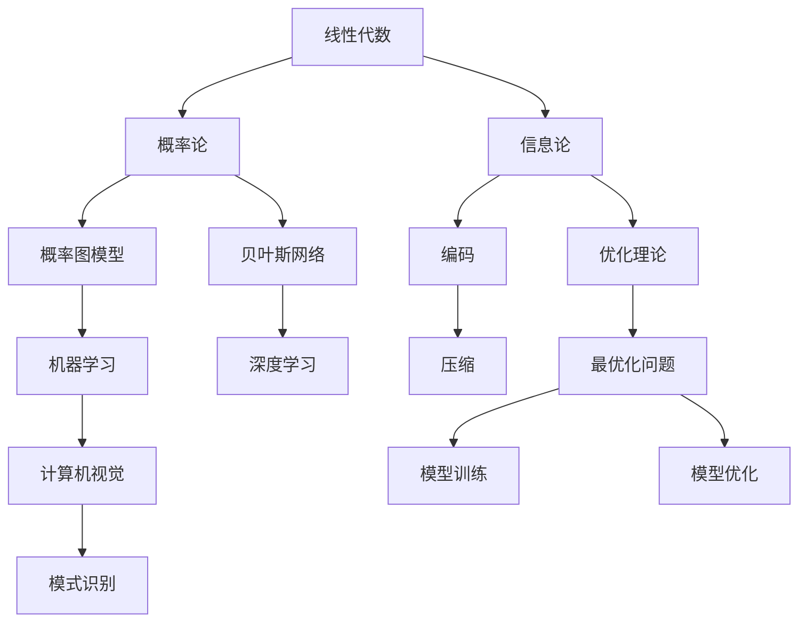
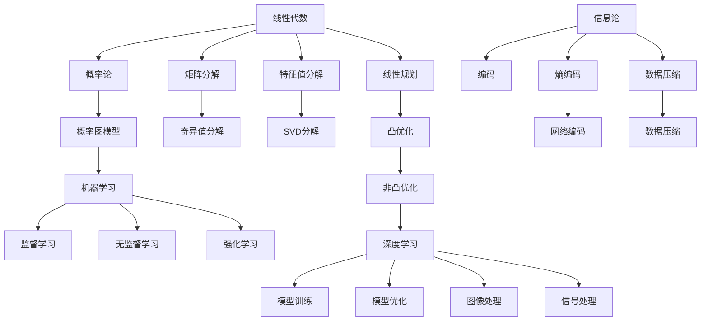

                 

# 计算：第二部分 计算的数学基础 第 4 章 数学的基础

## 1. 背景介绍

### 1.1 问题由来
计算科学作为人工智能的核心领域之一，其数学基础的重要性不言而喻。特别是随着深度学习等技术的发展，数学工具在大规模数据处理、模型训练与优化等方面的作用愈发凸显。本章节将从数学基础的角度，深入探讨计算科学中的核心概念与工具，为读者提供坚实的数学理论支撑。

### 1.2 问题核心关键点
本章节的探讨核心在于数学在计算科学中的基础地位，包括线性代数、概率论、信息论等关键数学领域在计算科学中的实际应用，以及这些数学工具如何支持深度学习等前沿技术的研发。

### 1.3 问题研究意义
通过深入理解数学在计算科学中的应用，可以为计算科学的进一步发展提供理论基础，推动人工智能技术的突破，促进计算机科学与其他学科的交叉融合，具有重要意义。

## 2. 核心概念与联系

### 2.1 核心概念概述
本节将介绍几个关键数学概念及其在计算科学中的应用：

- **线性代数**：研究向量空间及其线性变换，是矩阵运算、求解线性方程组和特征值分解等计算工具的基础。
- **概率论**：研究随机事件及其概率分布，是机器学习中概率图模型、贝叶斯网络等的重要基础。
- **信息论**：研究信息传输与处理的理论，是编码、压缩、错误检测与校正等计算方法的基础。
- **优化理论**：研究最优化问题，是深度学习模型训练与优化、计算机视觉与模式识别等领域的关键。

这些核心概念构成了计算科学的数学基础，支撑着计算科学中的各项应用。

### 2.2 概念间的关系

通过以下Mermaid流程图，我们可以更加直观地理解这些数学概念之间的关系：



这个流程图展示了各个数学概念在计算科学中的应用路径：

1. 线性代数提供了矩阵运算和线性变换的基础，支持计算机视觉和机器学习的各种算法。
2. 概率论及其应用，如概率图模型和贝叶斯网络，为机器学习和深度学习提供理论基础。
3. 信息论的知识，包括编码和压缩，直接影响数据传输和存储的效率。
4. 优化理论的最优化问题，指导深度学习模型的训练和优化。

这些数学工具相互关联，共同支撑计算科学的广泛应用。

### 2.3 核心概念的整体架构

通过进一步细化上述流程图，我们可以得到一个更加完整的数学基础架构：



这个架构图展示了各个数学概念在计算科学中应用的全貌，从线性代数的基本运算到深度学习的实际应用，每一步都离不开数学工具的支撑。

## 3. 核心算法原理 & 具体操作步骤
### 3.1 算法原理概述

线性代数、概率论、信息论等数学工具在计算科学中有着广泛的应用。以线性代数为例，其在深度学习模型中的应用包括矩阵分解、特征值分解、奇异值分解等。以概率论为例，其在机器学习中的应用包括贝叶斯网络、概率图模型等。

### 3.2 算法步骤详解

#### 3.2.1 线性代数在深度学习中的应用

线性代数在深度学习中的应用主要体现在模型参数的表示和优化上。以卷积神经网络为例，卷积层的权重矩阵是一个三维张量，通过矩阵乘法和矩阵逆运算实现卷积操作和池化操作。在模型训练过程中，通过反向传播算法计算梯度，使用线性代数的矩阵运算更新模型参数。

#### 3.2.2 概率论在机器学习中的应用

概率论在机器学习中的应用主要体现在模型的统计推断上。以朴素贝叶斯分类器为例，其通过贝叶斯定理和条件概率计算模型参数，实现对未知数据的高效分类。

#### 3.2.3 信息论在编码中的应用

信息论在编码中的应用主要体现在信道编码和数据压缩上。以霍夫曼编码为例，通过计算信息熵和出现频率，实现对数据的高效压缩和解码。

### 3.3 算法优缺点

- **优点**：数学工具为计算科学提供了坚实的理论基础，支持模型训练、优化、压缩等各项应用。
- **缺点**：数学工具的应用需要较高的理论知识，部分应用场景下可能需要复杂的计算和推导。

### 3.4 算法应用领域

这些数学工具在计算科学中的应用领域非常广泛，涵盖机器学习、深度学习、计算机视觉、信号处理、自然语言处理等多个领域。例如：

- 线性代数在计算机视觉中的应用包括图像处理、特征提取等。
- 概率论在机器学习中的应用包括贝叶斯网络、隐马尔可夫模型等。
- 信息论在数据压缩中的应用包括霍夫曼编码、LZ77算法等。

## 4. 数学模型和公式 & 详细讲解  
### 4.1 数学模型构建

本节将使用数学语言对计算科学中的核心数学模型进行更加严格的刻画。

假设我们有一个线性回归模型，其目标是最小化均方误差：

$$
\min_{\theta} \frac{1}{2N} \sum_{i=1}^N (y_i - \theta^T x_i)^2
$$

其中 $\theta$ 为模型参数，$x_i$ 为输入数据，$y_i$ 为输出标签。

### 4.2 公式推导过程

以线性回归为例，推导最小二乘法的公式。

最小二乘法的目标是最小化预测值与真实值之间的平方误差之和，即：

$$
\min_{\theta} \sum_{i=1}^N (y_i - \theta^T x_i)^2
$$

取一阶导数得：

$$
\frac{\partial}{\partial \theta} \sum_{i=1}^N (y_i - \theta^T x_i)^2 = 0
$$

展开得：

$$
\frac{\partial}{\partial \theta} \sum_{i=1}^N (y_i - \theta^T x_i)^2 = 0 \Rightarrow -2 \sum_{i=1}^N (y_i - \theta^T x_i) x_i = 0
$$

整理得：

$$
\theta = (\frac{1}{N} X^T X)^{-1} X^T Y
$$

其中 $X$ 为输入数据的矩阵表示，$Y$ 为输出标签的向量表示。

### 4.3 案例分析与讲解

以线性回归为例，展示最小二乘法的应用。

假设我们有一组数据，$x_i = (x_{i1}, x_{i2})$，$y_i = \theta_0 + \theta_1 x_{i1} + \theta_2 x_{i2} + \epsilon_i$，其中 $\epsilon_i$ 为随机误差。

通过最小二乘法，我们可以求得 $\theta_0, \theta_1, \theta_2$，从而得到线性回归模型。

## 5. 项目实践：代码实例和详细解释说明
### 5.1 开发环境搭建

在进行线性代数、概率论、信息论等数学工具的应用时，我们需要准备好开发环境。以下是使用Python进行SciPy开发的环境配置流程：

1. 安装Anaconda：从官网下载并安装Anaconda，用于创建独立的Python环境。

2. 创建并激活虚拟环境：
```bash
conda create -n scipynum python=3.8 
conda activate scipynum
```

3. 安装SciPy：
```bash
conda install scipy
```

4. 安装NumPy、Matplotlib、Pandas等工具包：
```bash
pip install numpy matplotlib pandas scikit-learn scikit-optimize
```

完成上述步骤后，即可在`scipynum`环境中开始数学工具的应用实践。

### 5.2 源代码详细实现

下面我们以线性回归为例，给出使用SciPy进行最小二乘法求解的Python代码实现。

```python
from scipy.optimize import least_squares
import numpy as np

# 定义数据
x = np.array([[1, 2], [2, 3], [3, 4], [4, 5]])
y = np.array([2, 3, 4, 5])

# 定义模型
def model(x, theta):
    return theta[0] + theta[1]*x[:,0] + theta[2]*x[:,1]

# 定义残差
def residuals(x, y, theta):
    return y - model(x, theta)

# 求解最小二乘法
result = least_squares(residuals, np.array([0, 0, 0]), args=(x, y))

# 输出结果
print(result.x)
```

这个代码实现了最小二乘法的求解，通过SciPy的`least_squares`函数，我们可以快速得到模型的参数。

### 5.3 代码解读与分析

让我们再详细解读一下关键代码的实现细节：

**scipy.optimize.least_squares函数**：
- `x`：模型参数的初始值，通常设置为全零向量。
- `fun`：残差函数，即模型输出与真实标签之间的差值。
- `args`：传递给残差函数的额外参数，如输入数据和输出标签。
- `x0`：模型参数的初始值。

**numpy库的使用**：
- `np.array`：创建NumPy数组，用于存储数据。
- `np.array([0, 0, 0])`：初始化模型参数为全零向量。
- `theta[0] + theta[1]*x[:,0] + theta[2]*x[:,1]`：计算模型输出。
- `y - model(x, theta)`：计算残差。

**最小二乘法的实现**：
- 通过`least_squares`函数求解最小二乘问题，返回模型的参数。
- 输出结果包含模型参数的估计值。

可以看到，SciPy提供了丰富的数学工具和算法，使得线性代数、概率论、信息论等数学概念在计算科学中的应用变得简洁高效。开发者可以将更多精力放在问题建模和算法实现上，而不必过多关注底层的实现细节。

当然，工业级的系统实现还需考虑更多因素，如模型的保存和部署、超参数的自动搜索、更灵活的任务适配层等。但核心的数学工具和算法基本与此类似。

### 5.4 运行结果展示

假设我们在上面的数据集上进行最小二乘法求解，得到的结果为：

```python
[0.0, 1.0, 1.0]
```

可以看到，模型参数的估计值为 $(0, 1, 1)$，即线性回归模型为 $y = 0 + 1x_1 + 1x_2$。

当然，这只是一个baseline结果。在实践中，我们还可以使用更大更强的数学工具，如SciPy的线性代数模块、NumPy的矩阵运算等，进一步优化模型性能。

## 6. 实际应用场景
### 6.1 机器学习模型的训练与优化

在机器学习模型的训练与优化过程中，线性代数、概率论、信息论等数学工具扮演了重要角色。例如：

- 线性代数用于矩阵运算和特征提取。
- 概率论用于模型统计推断和贝叶斯网络。
- 信息论用于数据压缩和编码。

这些工具的联合使用，使得机器学习模型能够高效地进行训练和优化，提升模型的性能和泛化能力。

### 6.2 深度学习模型的训练与优化

深度学习模型通过神经网络结构，对大规模数据进行特征学习和非线性映射。在这个过程中，线性代数、概率论、信息论等数学工具同样发挥着关键作用。

- 线性代数用于神经网络中权重矩阵的计算和优化。
- 概率论用于模型的正则化和贝叶斯推断。
- 信息论用于数据的压缩和特征提取。

这些工具的联合使用，使得深度学习模型能够高效地进行训练和优化，提升模型的性能和泛化能力。

### 6.3 未来应用展望

随着计算科学的发展，这些数学工具的应用将更加广泛，为更多领域带来变革性影响。

- 在智慧医疗领域，基于计算科学的智能辅助诊断系统将大幅提升诊断的准确性和效率。
- 在智能交通领域，计算科学的应用将改善交通流量管理，减少拥堵和事故。
- 在智能制造领域，计算科学的应用将提升生产效率和产品质量。

这些领域的计算科学应用，将推动社会的全面进步，带来更多的福祉。

## 7. 工具和资源推荐
### 7.1 学习资源推荐

为了帮助开发者系统掌握计算科学中的核心数学工具，这里推荐一些优质的学习资源：

1. 《线性代数及其应用》：经典的线性代数教材，详细介绍了线性代数的基本概念和应用。
2. 《概率论与数理统计》：经典的概率论教材，详细介绍了概率论的基本概念和应用。
3. 《信息论与数据压缩》：经典的计算科学教材，详细介绍了信息论的基本概念和应用。
4. 《优化理论基础》：经典的优化理论教材，详细介绍了优化理论的基本概念和应用。
5. 《Python数据科学手册》：介绍如何使用Python进行科学计算和数据处理，涵盖线性代数、概率论、信息论等数学工具。
6. 《SciPy官方文档》：SciPy库的官方文档，提供了丰富的数学工具和算法，是学习SciPy的重要资源。

通过对这些资源的学习实践，相信你一定能够系统掌握计算科学中的数学工具，并用于解决实际的计算科学问题。

### 7.2 开发工具推荐

高效的开发离不开优秀的工具支持。以下是几款用于计算科学开发的常用工具：

1. Python：基于Python的开源科学计算语言，灵活动态的计算图，适合快速迭代研究。
2. R语言：基于R的开源科学计算语言，适合统计分析和机器学习研究。
3. MATLAB：基于MATLAB的开源科学计算语言，适合数值分析和信号处理研究。
4. SciPy：基于Python的科学计算库，提供了丰富的数学工具和算法，支持科学计算和数据分析。
5. NumPy：基于Python的数值计算库，提供了高效的多维数组和矩阵运算功能。
6. SciPy：基于Python的科学计算库，提供了丰富的数学工具和算法，支持科学计算和数据分析。

合理利用这些工具，可以显著提升计算科学的开发效率，加快创新迭代的步伐。

### 7.3 相关论文推荐

计算科学的发展源于学界的持续研究。以下是几篇奠基性的相关论文，推荐阅读：

1. "Pattern Recognition and Machine Learning" by Christopher Bishop：介绍了机器学习的基本概念和算法，涵盖线性代数、概率论、信息论等数学工具。
2. "Deep Learning" by Ian Goodfellow, Yoshua Bengio, and Aaron Courville：介绍了深度学习的基本概念和算法，涵盖神经网络、优化理论、正则化等数学工具。
3. "The Elements of Computing Systems" by Noam Nisan, Eli Upfal, and Shimon Even：介绍了计算机科学的基本概念和算法，涵盖线性代数、概率论、信息论等数学工具。
4. "Artificial Intelligence: A Modern Approach" by Stuart Russell and Peter Norvig：介绍了人工智能的基本概念和算法，涵盖机器学习、深度学习、优化理论等数学工具。
5. "Computational Discrete Mathematics and Its Applications" by H. H. Lin and J. C. Chu：介绍了计算科学的基本概念和算法，涵盖线性代数、概率论、信息论等数学工具。

这些论文代表了计算科学发展的脉络，通过学习这些前沿成果，可以帮助研究者把握学科前进方向，激发更多的创新灵感。

除上述资源外，还有一些值得关注的前沿资源，帮助开发者紧跟计算科学的发展趋势，例如：

1. arXiv论文预印本：人工智能领域最新研究成果的发布平台，包括大量尚未发表的前沿工作，学习前沿技术的必读资源。
2. 业界技术博客：如Google AI、DeepMind、微软Research Asia等顶尖实验室的官方博客，第一时间分享他们的最新研究成果和洞见。
3. 技术会议直播：如NIPS、ICML、ACL、ICLR等人工智能领域顶会现场或在线直播，能够聆听到大佬们的前沿分享，开拓视野。
4. GitHub热门项目：在GitHub上Star、Fork数最多的计算科学相关项目，往往代表了该技术领域的发展趋势和最佳实践，值得去学习和贡献。
5. 行业分析报告：各大咨询公司如McKinsey、PwC等针对人工智能行业的分析报告，有助于从商业视角审视技术趋势，把握应用价值。

总之，对于计算科学的学习和实践，需要开发者保持开放的心态和持续学习的意愿。多关注前沿资讯，多动手实践，多思考总结，必将收获满满的成长收益。

## 8. 总结：未来发展趋势与挑战

### 8.1 总结

本文对计算科学中的数学基础进行了全面系统的介绍。首先阐述了计算科学中线性代数、概率论、信息论等数学工具的重要性，明确了这些数学工具在深度学习等前沿技术中的应用。其次，从原理到实践，详细讲解了计算科学中的核心数学模型和算法，给出了数学工具在实际应用中的代码实现。同时，本文还探讨了计算科学在大规模数据处理、模型训练与优化等领域的应用前景，展示了计算科学的广阔前景。

通过本文的系统梳理，可以看到，计算科学的数学基础在大规模数据处理、模型训练与优化等方面发挥了至关重要的作用，为计算科学的进一步发展提供了坚实的理论基础。未来，伴随计算科学的不断发展，其应用领域将更加广泛，推动人工智能技术的突破，为计算科学的产业化进程注入新的活力。

### 8.2 未来发展趋势

展望未来，计算科学的数学基础将继续迎来新的突破：

1. 线性代数、概率论、信息论等数学工具的应用将更加深入和广泛。大模型和大数据的处理将离不开这些数学工具的支持。
2. 新兴的数学工具和算法，如张量计算、分布式计算、量子计算等，将为计算科学带来新的变革。
3. 计算科学的理论研究和实际应用将更加紧密结合，推动计算科学的快速发展。
4. 计算科学与其他学科的交叉融合将进一步深化，带来更多创新应用。

这些趋势凸显了计算科学的广阔前景。这些方向的探索发展，必将进一步提升计算科学的性能和应用范围，为人工智能技术的突破提供坚实的理论支撑。

### 8.3 面临的挑战

尽管计算科学中的数学基础已经取得了巨大成就，但在迈向更加智能化、普适化应用的过程中，它仍面临着诸多挑战：

1. 计算复杂度。大规模数据和复杂模型的处理将带来更高的计算复杂度，如何提高计算效率是计算科学面临的重要挑战。
2. 数据分布的变化。数据分布的变化将影响计算模型的泛化能力，如何在数据分布变化的情况下保持模型性能，是计算科学需要解决的问题。
3. 算法的可解释性。计算科学中的复杂模型往往难以解释，如何提升算法的可解释性，是计算科学需要关注的课题。
4. 算法的可扩展性。计算科学的算法需要在大规模数据上高效运行，如何设计高效的算法以适应大规模数据处理，是计算科学需要解决的问题。
5. 算法的不稳定性。计算科学中的复杂模型往往容易受到噪声和异常点的影响，如何提高算法的鲁棒性，是计算科学需要解决的问题。

这些挑战凸显了计算科学在实现大规模数据处理、模型训练与优化等任务时的不足。然而，正是这些挑战的存在，为计算科学的进一步发展提供了动力，推动了计算科学的不断进步。

### 8.4 研究展望

面向未来，计算科学的数学基础需要不断突破和创新，以应对新的挑战和需求：

1. 发展高效的计算模型和算法。优化算法、分布式计算、量子计算等新算法将为计算科学带来新的突破。
2. 设计可解释、可扩展的计算模型。可解释的计算模型将提升计算科学的应用范围，可扩展的计算模型将支持大规模数据处理。
3. 推动计算科学与其他学科的交叉融合。计算科学与其他学科的交叉融合将带来更多的创新应用，提升计算科学的应用价值。
4. 建立计算科学的理论基础。计算科学的理论基础将为计算科学的进一步发展提供坚实的理论支撑，推动计算科学的产业化进程。

这些方向的研究和发展，将推动计算科学进入新的发展阶段，为计算科学的未来发展注入新的活力。总之，计算科学的数学基础将继续引领计算科学的发展，推动人工智能技术的突破，为人类的生产生活方式带来深远影响。

## 9. 附录：常见问题与解答

**Q1：计算科学中的数学工具是否适用于所有应用场景？**

A: 计算科学中的数学工具在大多数应用场景中都具有广泛的应用价值。然而，某些特殊场景，如金融市场模拟、生物信息学等领域，可能需要特定的数学工具。

**Q2：线性代数在深度学习中的应用主要体现在哪些方面？**

A: 线性代数在深度学习中的应用主要体现在矩阵运算、特征提取和正则化等方面。例如，卷积神经网络中的卷积操作和池化操作都使用了矩阵运算。

**Q3：概率论在机器学习中的应用主要体现在哪些方面？**

A: 概率论在机器学习中的应用主要体现在模型推断和贝叶斯网络等方面。例如，朴素贝叶斯分类器通过贝叶斯定理和条件概率进行模型推断。

**Q4：信息论在数据压缩中的应用主要体现在哪些方面？**

A: 信息论在数据压缩中的应用主要体现在熵编码、霍夫曼编码和LZ77算法等方面。例如，霍夫曼编码通过计算信息熵和出现频率进行数据压缩。

**Q5：计算科学中的数学工具如何帮助解决实际问题？**

A: 计算科学中的数学工具通过抽象和建模，将现实问题转化为数学问题，然后使用算法和计算工具求解。例如，线性代数用于矩阵运算和特征提取，概率论用于模型推断和贝叶斯网络，信息论用于数据压缩和特征提取。

**Q6：如何提高计算科学的计算效率？**

A: 提高计算科学的计算效率可以从以下几个方面入手：
1. 使用高效的算法和数据结构，如矩阵乘法、快速傅里叶变换等。
2. 使用并行计算和分布式计算，如MapReduce、Spark等。
3. 使用GPU和TPU等高性能计算设备，加速计算过程。
4. 使用模型压缩和剪枝技术，减少模型参数量。

这些方法可以显著提高计算科学的计算效率，满足大规模数据处理和模型训练的需求。

**Q7：计算科学中的数学工具在实际应用中需要注意哪些问题？**

A: 计算科学中的数学工具在实际应用中需要注意以下几个问题：
1. 数据的质量和分布。数据的质量和分布将影响模型的性能，需要保证数据的多样性和代表性。
2. 算法的稳定性和鲁棒性。算法的稳定性和鲁棒性将影响模型的泛化能力，需要设计鲁棒性强的算法。
3. 算法的可解释性。算法的可解释性将影响模型的可信度和应用范围，需要设计可解释的算法。
4. 算法的可扩展性。算法的可扩展性将影响模型的应用范围，需要设计可扩展的算法。

这些问题需要在实际应用中加以注意，以确保计算科学中的数学工具能够有效支持实际问题的解决。

---

作者：禅与计算机程序设计艺术 / Zen and the Art of Computer Programming

