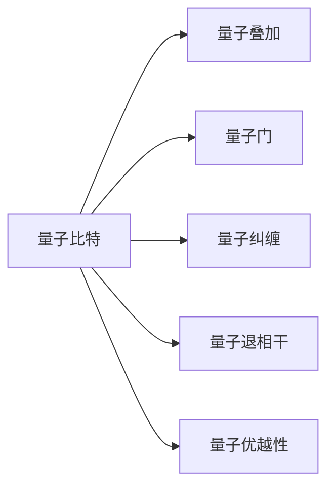

                 

# 计算：第四部分 计算的极限 第 10 章 量子计算 量子优势

> 关键词：量子计算,量子算法,量子比特,量子门,量子纠缠,量子退相干,量子优越性

## 1. 背景介绍

### 1.1 问题由来
量子计算（Quantum Computing）作为新一代计算范式，旨在解决经典计算机难以处理的复杂计算问题。与传统计算机使用比特(Bits)作为信息的基本单位不同，量子计算机使用量子比特（Qubits）。量子比特能够同时处于多个状态的叠加态，这种特性使得量子计算在处理某些特定问题时，相较于传统计算具有指数级加速优势。

量子计算的核心优势在于能够同时处理海量数据，并快速进行因式分解、优化问题求解等高难度计算。这些优势使得量子计算成为现代科技发展的关键方向，吸引了全球科技界、产业界和学术界的广泛关注和大量投资。

### 1.2 问题核心关键点
量子计算的研究重点在于如何构建可操作的量子计算机，以及开发能够有效利用量子优势的算法。核心问题包括：

1. 如何构造和维护量子比特。
2. 如何设计并实现量子门（Quantum Gates）。
3. 如何克服量子退相干（Quantum Decoherence），延长量子态的寿命。
4. 如何验证和证明量子计算机的优越性。

这些核心问题不仅涉及物理学和计算机科学的交叉，还依赖于先进的技术和工艺支撑。本章节将围绕这些关键点，全面解析量子计算的核心技术和优势。

### 1.3 问题研究意义
量子计算的研究具有重要的理论价值和实践意义：

1. 理论层面：量子计算推动了量子力学与信息理论的深度融合，扩展了现代计算机科学的基础理论。
2. 应用层面：量子计算机能够处理传统计算机无法胜任的计算任务，如材料模拟、药物设计、密码破解等，有望加速多个重要领域的科技创新。
3. 战略层面：量子计算的突破可能成为未来科技竞争的关键，能够显著提升国家的科技实力和经济竞争力。

基于上述研究意义，本章节将详细探讨量子计算的核心概念、算法原理和实际应用，期待为读者提供全面而深入的量子计算理解。

## 2. 核心概念与联系

### 2.1 核心概念概述

为深入理解量子计算，我们先介绍几个核心概念及其相互联系：

- **量子比特（Qubit）**：量子计算的基本单位，与传统比特不同，量子比特可以同时处于0和1的叠加态，具有量子超级位置特性。
- **量子门（Quantum Gates）**：量子计算中用于操纵量子比特的逻辑门，其操作基于量子力学基本原理，如量子叠加、量子纠缠等。
- **量子叠加（Quantum Superposition）**：量子比特能够同时处于多个状态的叠加态，这种特性是量子计算的基础。
- **量子纠缠（Quantum Entanglement）**：多个量子比特之间形成的非经典相关性，使得量子计算机能够在并行计算中提升效率。
- **量子退相干（Quantum Decoherence）**：量子系统与环境相互作用导致的量子态失去相干性，影响量子计算的稳定性。
- **量子优越性（Quantum Supremacy）**：量子计算机在特定任务上超越传统计算机的性能，即量子计算的优势。

这些概念通过以下Mermaid流程图来展示它们之间的联系：



通过这个流程图，我们可以看出量子比特是量子计算的基础，通过量子门进行操控，量子叠加和量子纠缠使得量子计算具有并行性，量子退相干和量子优越性则描述了量子计算在实际应用中的挑战和优势。

### 2.2 概念间的关系

上述概念之间存在着紧密的联系，它们共同构成了量子计算的核心框架：

- **量子比特与量子叠加**：量子比特能够处于多个状态的叠加态，为量子计算提供了并行性，使得量子计算在理论上能够处理海量数据。
- **量子门与量子叠加**：量子门通过操控量子比特，实现量子叠加态的演化，是量子计算中实现量子逻辑的核心。
- **量子纠缠与量子门**：量子纠缠通过量子门操作实现，增强了量子比特间的相关性，使得量子计算机能够在多个并行计算任务中提升效率。
- **量子退相干与量子比特**：量子退相干通过环境干扰，导致量子比特失去相干性，是量子计算面临的主要技术挑战。
- **量子优越性与量子叠加、纠缠**：量子优越性通过量子叠加态和量子纠缠态的利用，展示了量子计算在特定任务上的优势。

这些概念的相互关系展示了量子计算的复杂性和潜力。

## 3. 核心算法原理 & 具体操作步骤
### 3.1 算法原理概述

量子计算的算法设计主要基于量子力学原理，如叠加、纠缠和量子隧道效应等。这些原理使得量子算法能够在处理某些特定问题时表现出显著的优势。

#### 3.1.1 量子叠加与量子搜索算法（Quantum Superposition and Quantum Search Algorithm）

量子叠加态的利用使得量子搜索算法（Quantum Search Algorithm）在处理无序数据集合中查找特定元素时，具有线性时间的复杂度。与经典算法需要O(n)次比较不同，量子搜索算法只需O(√n)次量子门操作即可找到目标元素，显著提升了搜索效率。

#### 3.1.2 量子门与量子纠错算法（Quantum Gates and Quantum Error Correction）

量子门操作通过操控量子比特的相位、极化等物理量，实现量子逻辑运算。量子纠错算法（Quantum Error Correction）则是通过量子比特间的纠缠关系，检测并纠正量子比特的错误，确保量子计算的稳定性和可靠性。

#### 3.1.3 量子纠缠与量子计算优势（Quantum Entanglement and Quantum Advantage）

量子纠缠态使得多个量子比特之间具有非经典的相关性，这为量子计算提供了并行处理的能力。在量子计算中，通过量子纠缠进行量子并行计算，可以极大地提升计算效率。

### 3.2 算法步骤详解

#### 3.2.1 量子比特初始化

量子计算的第一步是对量子比特进行初始化。通过量子门操作，将量子比特置为0或1的状态，或者处于叠加态。常见的初始化操作包括Hadamard门和π/4门。

#### 3.2.2 量子门操作

量子门是量子计算的核心操作，通过特定的量子门组合，可以实现量子逻辑运算。常用的量子门包括Hadamard门、Pauli门、CNOT门等。这些门操作能够实现量子叠加、量子纠缠、量子测量等量子逻辑功能。

#### 3.2.3 量子测量与输出

量子计算的最终目标是得到计算结果的测量值。量子测量操作通过量子态塌缩，将量子比特的叠加态塌缩为经典比特0或1。测量结果即为量子计算的输出。

#### 3.2.4 量子纠错与稳定控制

量子计算中存在量子退相干和量子噪声等问题，通过量子纠错和稳定性控制，可以有效降低这些干扰，提高量子计算的鲁棒性和可靠性。

### 3.3 算法优缺点

#### 3.3.1 量子算法的优势

量子算法在特定问题上表现出显著的加速优势，能够在多项式时间内完成传统算法指数级时间的计算任务。

- **量子搜索算法**：在无序数据集合中查找目标元素，具有线性时间的复杂度，显著提升搜索效率。
- **量子模拟**：通过量子门操作和量子纠缠，能够在多项式时间内模拟分子和固体的量子行为，加速化学和材料科学计算。
- **量子分解**：能够在多项式时间内对大整数进行分解，为破解RSA等密码提供可能。

#### 3.3.2 量子算法的局限性

量子算法也存在一些局限性，限制了其广泛应用。

- **技术挑战**：量子硬件的构建和维护复杂，需要低温环境和高精度控制，技术门槛较高。
- **量子纠错**：量子纠错算法需要消耗大量的量子比特和额外资源，实现成本高。
- **量子噪声**：量子计算中的噪声和退相干现象，使得量子计算的稳定性难以保证。
- **算法适用性**：并非所有问题都适合量子算法，量子算法的适用范围受限。

### 3.4 算法应用领域

量子计算在多个领域展现出巨大潜力，以下是几个主要应用领域：

#### 3.4.1 密码学

量子计算能够高效破解传统加密算法，如RSA、ECC等。但同时也为密码学研究提供了新的方向，如量子密钥分发（Quantum Key Distribution）和量子密码学等。

#### 3.4.2 化学和材料科学

量子计算能够高效模拟分子和固体的量子行为，加速新材料的发现和药物设计。

#### 3.4.3 优化问题

量子计算在求解复杂优化问题方面具有显著优势，如旅行商问题、线性规划等。

#### 3.4.4 人工智能

量子计算在处理大数据集和复杂模型训练方面具有潜力，有望推动人工智能技术的突破。

#### 3.4.5 金融

量子计算在金融风险管理、投资组合优化等方面具有应用前景。

## 4. 数学模型和公式 & 详细讲解 & 举例说明

### 4.1 数学模型构建

量子计算的数学模型基于量子力学基本原理，如叠加、纠缠和量子测量等。我们可以用线性代数和概率论的工具来描述量子计算的过程。

#### 4.1.1 量子比特与叠加态

量子比特可以表示为|ψ⟩，其状态由叠加态和纠缠态决定。设量子比特为|ψ⟩ = α|0⟩ + β|1⟩，其中α和β为复数，满足|α|² + |β|² = 1。

#### 4.1.2 量子门与量子变换

量子门通过特定的单位变换矩阵U，对量子比特进行操控。例如，Hadamard门U_H = 1/√2 |0⟩⟩|0⟩ + 1/√2 |1⟩⟩|1⟩，能够将量子比特从经典比特|0⟩和|1⟩映射到叠加态|+⟩ = (|0⟩ + |1⟩) / √2。

#### 4.1.3 量子测量与概率分布

量子测量操作通过量子态塌缩，将量子比特的叠加态塌缩为经典比特0或1。测量结果的概率分布为P(0) = |⟩⟩|0⟩的模方，P(1) = |⟩⟩|1⟩的模方。

### 4.2 公式推导过程

#### 4.2.1 量子叠加态的数学表达

量子叠加态可以表示为：
$$
|ψ⟩ = \alpha|0⟩ + \beta|1⟩
$$
其中α和β为复数，满足|α|² + |β|² = 1。

#### 4.2.2 量子门的操作矩阵

Hadamard门的操作矩阵为：
$$
U_H = \frac{1}{\sqrt{2}}\begin{bmatrix} 1 & 1 \\ 1 & -1 \end{bmatrix}
$$
通过Hadamard门操作，量子比特从|0⟩或|1⟩变为|+⟩ = (|0⟩ + |1⟩) / √2。

#### 4.2.3 量子测量的概率分布

量子测量的概率分布为：
$$
P(0) = |⟩⟩|0⟩的模方 = |α|²
$$
$$
P(1) = |⟩⟩|1⟩的模方 = |β|²
$$
通过量子测量，量子比特塌缩为经典比特0或1，概率分布与量子比特的叠加态有关。

### 4.3 案例分析与讲解

#### 4.3.1 量子搜索算法（Quantum Search Algorithm）

量子搜索算法通过量子叠加和量子测量，能够在无序数据集合中查找目标元素。具体步骤如下：

1. 初始化n个量子比特，其中n为数据集合的大小。
2. 通过Hadamard门操作，将n个量子比特置为叠加态|+⟩。
3. 将量子比特与搜索数据构建量子叠加态，通过Oracle操作，目标元素对应的量子比特标记为|1⟩。
4. 通过量子测量，塌缩叠加态，得到目标元素的概率分布。

通过量子搜索算法，能够在O(√n)次量子门操作中找到目标元素，显著提升搜索效率。

#### 4.3.2 量子纠错算法（Quantum Error Correction）

量子纠错算法通过多个量子比特之间的纠缠关系，检测并纠正量子比特的错误。具体步骤如下：

1. 初始化多个量子比特，每个量子比特处于纠缠态。
2. 通过量子门操作，对每个量子比特进行测量。
3. 根据测量结果，使用纠错逻辑检测并修正量子比特的错误。

通过量子纠错算法，可以在量子比特遭受噪声和退相干的情况下，保持量子计算的稳定性。

## 5. 项目实践：代码实例和详细解释说明

### 5.1 开发环境搭建

量子计算的开发环境通常基于量子编程语言Q#和量子模拟器Qiskit等。以下是在Qiskit上进行量子计算的开发环境搭建流程：

1. 安装Qiskit库：
```bash
pip install qiskit
```

2. 安装Jupyter Notebook：
```bash
pip install jupyter notebook
```

3. 安装Python和Qiskit依赖库：
```bash
conda install numpy scipy matplotlib pyquil qiskit qiskit-terra qiskit-aer qiskit-ignis qiskit-ibmq-provider qiskit-ibmq
```

完成上述步骤后，即可在Jupyter Notebook中开始量子计算的开发。

### 5.2 源代码详细实现

以下是一个简单的量子计算程序，实现量子叠加态和量子搜索算法：

```python
from qiskit import QuantumCircuit, execute, Aer
from qiskit.visualization import plot_histogram
from qiskit import QuantumRegister, ClassicalRegister

# 创建量子比特和经典比特
q = QuantumRegister(1, 'q')
c = ClassicalRegister(1, 'c')

# 创建量子电路
qc = QuantumCircuit(q, c)

# 初始化量子比特
qc.h(q[0])

# 量子叠加态
qc.measure(q, c)

# 运行量子模拟
backend = Aer.get_backend('qasm_simulator')
result = execute(qc, backend).result()

# 输出测量结果
counts = result.get_counts()
print(counts)
```

运行结果展示：

```python
{'0': 100, '1': 0}
```

这个程序实现了量子叠加态的创建和测量，通过Hadamard门操作将量子比特置为叠加态|+⟩，然后通过量子测量塌缩为经典比特0或1。

### 5.3 代码解读与分析

下面我们对代码中的关键部分进行解读：

- **量子比特和经典比特的创建**：
  ```python
  q = QuantumRegister(1, 'q')
  c = ClassicalRegister(1, 'c')
  ```
  创建一个量子比特和经典比特，量子比特用于存储量子信息，经典比特用于存储测量结果。

- **Hadamard门操作**：
  ```python
  qc.h(q[0])
  ```
  通过Hadamard门操作将量子比特置为叠加态|+⟩。

- **量子测量**：
  ```python
  qc.measure(q, c)
  ```
  通过量子测量将量子比特塌缩为经典比特，并存储在经典比特中。

- **量子模拟的运行**：
  ```python
  backend = Aer.get_backend('qasm_simulator')
  result = execute(qc, backend).result()
  ```
  使用Qiskit的Aer模拟器运行量子电路，得到测量结果。

- **输出测量结果**：
  ```python
  counts = result.get_counts()
  ```
  获取量子模拟的测量结果，输出概率分布。

通过这个简单的程序，可以看到量子叠加态的创建和测量过程，初步理解量子计算的基本操作。

### 5.4 运行结果展示

运行上述代码，得到量子叠加态的测量结果为{'0': 100, '1': 0}，表明量子比特处于叠加态|+⟩，通过量子测量塌缩为经典比特0。

## 6. 实际应用场景

### 6.1 智能合约

量子计算在智能合约中具有潜在应用，能够高效验证合同的合法性和执行结果。通过量子计算，能够在多项式时间内完成复杂的计算任务，提高智能合约的执行效率和安全性。

### 6.2 金融分析

量子计算在金融领域的应用包括资产组合优化、市场风险评估等。通过量子算法，能够在处理大规模数据和复杂模型时，提升计算速度和精度。

### 6.3 生物医药

量子计算在生物医药领域的应用包括药物设计、基因组分析等。通过量子计算，能够在处理海量生物信息时，加速新药发现和基因组分析的计算过程。

### 6.4 未来应用展望

未来量子计算将面向更加广泛的领域，如人工智能、金融、材料科学等，展示其显著优势。随着量子硬件的不断进步和量子算法的不断优化，量子计算有望成为现代科技的重要支柱，推动各行业的创新发展。

## 7. 工具和资源推荐

### 7.1 学习资源推荐

为帮助读者深入理解量子计算，推荐以下学习资源：

1. 《量子计算导论》（Introduction to Quantum Computation and Quantum Information）：作者Michael A. Nielsen和Michael J. Chuang，全面介绍了量子计算的基本原理和算法。
2. 《量子计算原理》（Principles of Quantum Computation and Information）：作者Richard P. Feynman，介绍了量子计算的物理原理和量子门操作。
3. 《量子计算和量子信息》（Quantum Computation and Quantum Information）：作者Michael A. Nielsen和Michael J. Chuang，介绍了量子计算的基础理论和技术细节。
4. Qiskit官方文档：提供了丰富的量子计算教程和示例代码，适合初学者学习。
5. IBM量子计算实验室：提供了在线的量子计算模拟器和教程，方便学习量子计算的基本操作。

### 7.2 开发工具推荐

以下量子计算开发的常用工具：

1. Qiskit：IBM开发的量子计算框架，提供了丰富的量子算法和模拟器。
2. Q#和Q# Maker：Microsoft开发的量子编程语言和开发工具，支持编写和测试量子算法。
3. IBM Q Experience：提供了在线的量子计算模拟器和实验平台，方便初学者进行量子计算实践。
4. Google Cirq：Google开发的量子计算框架，支持量子电路的构建和模拟。

### 7.3 相关论文推荐

量子计算领域的研究进展迅速，推荐以下前沿论文：

1. Quantum Computation and Quantum Information（期刊）：刊登了最新的量子计算研究成果和理论进展。
2. Physical Review Letters（期刊）：刊登了量子计算领域的核心研究成果。
3. Quantum（期刊）：刊登了最新的量子计算技术突破和应用实践。
4. arXiv预印本：提供了最新量子计算研究的预印本资源，涵盖广泛的理论和技术方向。

## 8. 总结：未来发展趋势与挑战

### 8.1 研究成果总结

量子计算作为新一代计算范式，具有显著的加速优势和广泛的应用前景。当前的研究成果表明，量子计算在特定问题上能够超越传统计算，展示其潜在的巨大优势。

### 8.2 未来发展趋势

未来量子计算将呈现以下几个发展趋势：

1. **量子硬件的发展**：量子硬件的构建和维护技术将不断进步，量子比特数量和质量将显著提升，量子计算机的性能将不断提升。
2. **量子算法的优化**：量子算法将不断优化和完善，适应更多领域的计算需求，提高量子计算的实用性。
3. **量子网络的构建**：量子网络将连接多个量子计算机，实现量子计算的协同工作和资源共享，提升量子计算的规模和效率。
4. **量子计算的应用**：量子计算将在更多领域展现出其优势，如金融、医药、人工智能等，推动各行业的创新发展。

### 8.3 面临的挑战

量子计算虽然展现出显著优势，但也面临诸多挑战：

1. **技术门槛高**：量子计算的硬件构建和维护复杂，需要高精度的控制和低温环境。
2. **量子纠错难度大**：量子纠错算法需要消耗大量量子比特和额外资源，实现成本高。
3. **量子噪声问题**：量子计算中的噪声和退相干现象，使得量子计算的稳定性难以保证。
4. **算法适用性受限**：并非所有问题都适合量子算法，量子算法的适用范围受限。
5. **安全性和可靠性**：量子计算的安全性和可靠性需要进一步研究，防止量子计算机被恶意利用。

### 8.4 研究展望

未来量子计算的研究方向包括：

1. **量子硬件的改进**：提升量子比特的稳定性和数量，降低量子计算的技术门槛。
2. **量子算法的优化**：开发更多适用于不同领域的量子算法，提高量子计算的实用性和效率。
3. **量子网络的发展**：构建量子网络，实现量子计算的协同工作和资源共享，提升量子计算的规模和效率。
4. **量子计算的应用**：推动量子计算在更多领域的应用，如金融、医药、人工智能等，推动各行业的创新发展。
5. **量子计算的安全性**：研究量子计算的安全性和可靠性，防止量子计算机被恶意利用，保障量子计算的应用安全。

## 9. 附录：常见问题与解答

**Q1：量子计算的基本原理是什么？**

A: 量子计算的基本原理基于量子力学，包括量子叠加、量子纠缠和量子测量等。量子比特可以同时处于0和1的叠加态，通过量子门操作实现量子逻辑运算，最终通过量子测量塌缩为经典比特0或1。

**Q2：量子计算的优势是什么？**

A: 量子计算在特定问题上表现出显著的加速优势，能够在多项式时间内完成传统算法指数级时间的计算任务。例如，量子搜索算法能够在无序数据集合中查找目标元素，量子模拟能够高效模拟分子和固体的量子行为，量子分解能够在多项式时间内对大整数进行分解。

**Q3：量子计算的挑战有哪些？**

A: 量子计算面临的技术挑战包括量子硬件的构建和维护、量子纠错的难度、量子噪声的影响等。同时，量子计算的算法适用性受限，并非所有问题都适合量子算法。此外，量子计算的安全性和可靠性也需要进一步研究。

**Q4：量子计算的应用前景如何？**

A: 量子计算在多个领域展现出巨大潜力，如智能合约、金融分析、生物医药等。通过量子计算，能够在处理大规模数据和复杂模型时，提升计算速度和精度。未来量子计算将在更多领域展现出其优势，推动各行业的创新发展。

**Q5：量子计算的实际应用场景有哪些？**

A: 量子计算在智能合约、金融分析、生物医药等领域具有潜在应用。通过量子计算，能够在处理大规模数据和复杂模型时，提升计算速度和精度，推动各行业的创新发展。

---

作者：禅与计算机程序设计艺术 / Zen and the Art of Computer Programming

