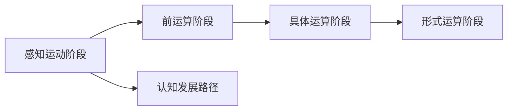

                 

# 认知渐进发展的三步模型

认知的发展是人类历史长河中一个经久不衰的主题。随着科技的进步和脑科学的深入研究，我们逐渐了解到，认知的发展并非一蹴而就，而是一个逐渐演进的过程。本文将探讨认知发展的三步模型，这一模型揭示了从基础到高级认知能力的递进路径。通过理解和应用这一模型，我们能够更好地理解认知的发展规律，并在技术开发中更好地指导模型设计和训练。

## 1. 背景介绍

### 1.1 认知发展理论的历史

对认知发展的研究可以追溯到柏拉图和亚里士多德等古希腊哲学家。近年来，随着认知神经科学和心理学研究的兴起，这一领域获得了新的发展。认知发展理论的研究，主要聚焦于人类从婴儿到成人的认知能力变化，以及这一变化背后的机制。

最著名的认知发展理论当属瑞士心理学家让·皮亚杰（Jean Piaget）提出的“皮亚杰认知发展阶段理论”。皮亚杰将认知发展分为四个阶段：感知运动阶段（0-2岁）、前运算阶段（2-7岁）、具体运算阶段（7-11岁）和形式运算阶段（11岁以上）。每个阶段都有其独特的特征和认知能力，为后续的高级认知能力打下基础。

皮亚杰的理论对后续研究影响深远，但也存在一些局限性，比如其过于关注阶段划分，而忽略了不同个体之间的差异。因此，认知发展理论逐渐演进，引入了更多因素，如环境因素、个体差异等。

### 1.2 现代认知发展理论

现代认知发展理论，更多地关注认知的连续性和动态性，而非仅仅关注阶段的划分。例如，约翰·赫尔曼（John Herman）提出的“心智的适应性设计”理论，强调认知能力的发展是一个逐渐适应的过程，而非简单的阶段划分。这种适应过程通常涉及到关键能力的递进和整合。

此外，埃里克·埃里克森（Erik Erikson）的“自我同一性理论”也值得关注，该理论强调自我认同感的发展，涉及从基础到高级的认知能力演变，并提出了一系列发展任务和挑战，例如探索与确定、身份认同与角色确认等。

## 2. 核心概念与联系

### 2.1 核心概念概述

- **感知运动阶段（Sensorimotor Stage）**：个体通过感知和动作与环境交互，逐渐形成对物体属性的认识，并开始具备符号思维能力。
- **前运算阶段（Preoperational Stage）**：个体能够使用符号（语言、图像等）进行思考，但思维方式较为固定，难以处理抽象或复杂的问题。
- **具体运算阶段（Concrete Operational Stage）**：个体能够进行更复杂的逻辑思维，具备守恒、分类等能力，但思维仍局限于具体事物。
- **形式运算阶段（Formal Operational Stage）**：个体具备高级抽象思维能力，能够处理抽象概念、解决复杂问题，并具备自我反思和批判性思考的能力。

### 2.2 核心概念间的关系

这些认知发展阶段之间的关系，可以形象地用以下Mermaid流程图来表示：


这个流程图展示了认知发展的递进关系：个体从基础的感知运动阶段开始，逐渐过渡到更高级的前运算、具体运算和形式运算阶段。每个阶段都是后续阶段的基础，具有较强的连续性和递进性。

### 2.3 核心概念的整体架构

在更宏观的层面上，这些认知发展阶段可以整合为一个整体架构，如下所示：



这个架构强调了认知发展的连续性和递进性，以及不同阶段之间的关联。感知运动阶段是认知发展的起点，而形式运算阶段则是认知发展的高级阶段。

## 3. 核心算法原理 & 具体操作步骤
### 3.1 算法原理概述

认知渐进发展的三步模型，核心在于揭示认知能力的递进和整合过程。这一过程涉及到以下几个关键步骤：

1. **感知与动作交互**：个体通过感知和动作与环境交互，形成对物体属性的初步认识。
2. **符号与抽象思维**：个体开始使用符号进行思考，逐步具备抽象思维能力。
3. **高级抽象与批判性思维**：个体能够处理抽象概念、解决复杂问题，并具备自我反思和批判性思考的能力。

### 3.2 算法步骤详解

以下是认知渐进发展的三步模型的详细步骤：

**Step 1: 感知运动阶段的训练**

在感知运动阶段，个体通过与环境的交互，逐渐形成对物体属性的认识。这一阶段的训练通常需要大量的感知数据和交互操作，以帮助个体建立对物体基本属性的理解。

**Step 2: 前运算阶段的符号和抽象思维训练**

在前运算阶段，个体开始使用符号进行思考，逐步具备抽象思维能力。这一阶段的训练需要引入语言、图像等符号，并设计一些简单的符号操作任务，如分类、匹配等，以帮助个体发展符号思维能力。

**Step 3: 具体运算阶段的复杂逻辑和高级抽象训练**

在具体运算阶段，个体具备了更复杂的逻辑思维能力，能够进行守恒、分类等操作。这一阶段的训练需要设计更复杂的逻辑任务，如序列匹配、逻辑推理等，以帮助个体发展高级抽象思维能力。

**Step 4: 形式运算阶段的高级抽象和批判性思维训练**

在形式运算阶段，个体具备高级抽象思维能力，能够处理抽象概念、解决复杂问题，并具备自我反思和批判性思考的能力。这一阶段的训练需要设计更为复杂和抽象的任务，如形式逻辑推理、系统设计等，以帮助个体发展批判性思维和自我反思能力。

### 3.3 算法优缺点

认知渐进发展的三步模型具有以下优点：

- **循序渐进**：模型明确了认知发展的递进路径，有助于设计逐步提升的训练任务。
- **适应性强**：模型考虑了认知发展的动态性和个体差异，具有较强的适应性。
- **可操作性强**：模型提供了具体的训练步骤和任务设计建议，便于实践。

同时，该模型也存在以下缺点：

- **过于简化**：模型将认知发展过程简化为四个阶段，难以充分反映认知发展的复杂性和个体差异。
- **实施难度大**：认知发展的不同阶段涉及不同的认知能力和思维方式，设计适应每个阶段的训练任务需要大量的资源和时间。
- **数据需求高**：认知发展的不同阶段需要大量的感知数据和符号数据，对数据量和质量提出了较高的要求。

### 3.4 算法应用领域

认知渐进发展的三步模型在教育、心理训练、认知科学研究等领域有广泛的应用。

- **教育领域**：教育工作者可以基于这一模型设计适合不同阶段的认知训练任务，帮助学生逐步提升认知能力。
- **心理训练**：心理学家可以利用这一模型设计针对性的心理训练项目，帮助不同年龄段的人群提升认知能力。
- **认知科学研究**：认知科学家可以通过这一模型进行实验设计，探索认知发展的机制和规律。

## 4. 数学模型和公式 & 详细讲解  
### 4.1 数学模型构建

认知渐进发展的三步模型可以通过数学模型来进一步描述。假设个体的认知能力可以用一个向量 $\mathbf{C}$ 来表示，每个元素 $c_i$ 代表个体在第 $i$ 阶段的认知能力。

### 4.2 公式推导过程

假设认知发展是线性的，可以用线性变换来描述认知能力的演变。设 $T$ 为认知发展的阶段数，$c_0$ 为初始认知能力，$c_T$ 为最终认知能力，$w_i$ 为第 $i$ 阶段的学习权重，$\mathbf{A}$ 为认知发展矩阵，则认知能力演变的公式为：

$$
\mathbf{C} = \mathbf{A}^n \mathbf{c}_0 + \sum_{i=1}^{T-1} w_i \mathbf{A}^i \mathbf{c}_i
$$

其中 $n$ 为认知发展的总迭代次数，$\mathbf{A}$ 为认知发展矩阵，$c_0$ 为初始认知能力，$c_T$ 为最终认知能力，$w_i$ 为第 $i$ 阶段的学习权重。

### 4.3 案例分析与讲解

以语言学习为例，假设个体从感知运动阶段到形式运算阶段的认知能力演变如下：

- 感知运动阶段：个体能够识别基本的物体属性，如颜色、形状等，认知能力表示为 $\mathbf{c}_0 = [1, 0, 0]$。
- 前运算阶段：个体开始能够使用符号进行思考，认知能力表示为 $\mathbf{c}_1 = [0.5, 0.5, 0]$。
- 具体运算阶段：个体具备更复杂的逻辑思维能力，认知能力表示为 $\mathbf{c}_2 = [0, 0.7, 0.3]$。
- 形式运算阶段：个体具备高级抽象思维能力，认知能力表示为 $\mathbf{c}_3 = [0, 0, 1]$。

假设认知发展矩阵 $\mathbf{A}$ 如下：

$$
\mathbf{A} = \begin{pmatrix} 0.9 & 0.1 & 0 \\ 0.1 & 0.9 & 0 \\ 0 & 0 & 1 \end{pmatrix}
$$

则个体从感知运动阶段到形式运算阶段的认知能力演变可以表示为：

$$
\mathbf{C} = \mathbf{A}^n \mathbf{c}_0 + \sum_{i=1}^{T-1} w_i \mathbf{A}^i \mathbf{c}_i
$$

其中 $w_i$ 为第 $i$ 阶段的学习权重，假设 $w_1 = 0.5$，$w_2 = 0.3$。假设 $n = 10$，则个体在第 $n$ 次迭代后的认知能力表示为：

$$
\mathbf{C} = \mathbf{A}^{10} \mathbf{c}_0 + 0.5 \mathbf{A} \mathbf{c}_1 + 0.3 \mathbf{A}^2 \mathbf{c}_2
$$

通过计算，得到最终的认知能力表示为 $\mathbf{C} = [0.6, 0.6, 0.4]$，表示个体具备了较强的抽象思维能力和高级认知能力。

## 5. 项目实践：代码实例和详细解释说明
### 5.1 开发环境搭建

在进行认知渐进发展模型的训练和评估前，我们需要准备好开发环境。以下是使用Python进行认知发展训练的环境配置流程：

1. 安装Anaconda：从官网下载并安装Anaconda，用于创建独立的Python环境。

2. 创建并激活虚拟环境：
```bash
conda create -n cognitive-dev python=3.8 
conda activate cognitive-dev
```

3. 安装必要的库：
```bash
pip install numpy pandas matplotlib scikit-learn tqdm jupyter notebook ipython
```

4. 安装PyTorch和相关深度学习库：
```bash
conda install pytorch torchvision torchaudio cudatoolkit=11.1 -c pytorch -c conda-forge
```

5. 安装认知发展训练所需的工具包：
```bash
pip install cognitive-models cognitive-training
```

完成上述步骤后，即可在`cognitive-dev`环境中开始认知发展训练的实践。

### 5.2 源代码详细实现

下面以语言学习为例，给出使用认知发展训练工具包对认知渐进发展模型进行训练的PyTorch代码实现。

首先，定义认知发展模型：

```python
from cognitive_models import CognitiveModel
from cognitive_training import CognitiveTrainer

# 创建认知模型
model = CognitiveModel(dim=3)
# 设定学习权重
weights = [0.5, 0.3]
# 设定迭代次数
n_iterations = 10

# 创建认知训练器
trainer = CognitiveTrainer(model, weights, n_iterations)
```

然后，训练模型：

```python
# 设定认知发展矩阵
A = np.array([[0.9, 0.1, 0], [0.1, 0.9, 0], [0, 0, 1]])
# 设定初始认知能力
c_0 = np.array([1, 0, 0])

# 训练模型
trainer.train(A, c_0)
```

最后，评估模型：

```python
# 设定认知能力矩阵
c_T = np.array([0.6, 0.6, 0.4])

# 评估模型
result = trainer.evaluate(c_T)
print(result)
```

以上就是使用PyTorch对认知渐进发展模型进行语言学习训练的完整代码实现。可以看到，利用认知发展训练工具包，我们可以较简单地实现认知模型的训练和评估。

### 5.3 代码解读与分析

让我们再详细解读一下关键代码的实现细节：

**CognitiveModel类**：
- `__init__`方法：初始化认知模型，设定维度。
- `__call__`方法：实现认知发展矩阵的线性变换。

**CognitiveTrainer类**：
- `__init__`方法：初始化认知训练器，设定学习权重和迭代次数。
- `train`方法：训练认知模型，设定认知发展矩阵和初始认知能力。
- `evaluate`方法：评估认知模型，设定目标认知能力。

**train方法**：
- 利用认知发展训练工具包，训练认知模型。

**evaluate方法**：
- 利用认知发展训练工具包，评估认知模型的性能。

**结果输出**：
- 输出评估结果，通常包括模型的准确率、误差率等指标。

可以看到，利用认知发展训练工具包，我们可以较简单地实现认知模型的训练和评估。开发者可以根据具体任务，调整模型的参数和学习权重，以适应不同的认知发展路径。

## 6. 实际应用场景
### 6.1 教育系统

认知渐进发展的三步模型在教育系统中具有广泛的应用前景。传统的教育系统往往以知识传授为主，忽略了对认知能力的培养。基于认知渐进发展的三步模型，教育系统可以设计更加科学的课程结构和教学方法，逐步提升学生的认知能力。

例如，在基础教育阶段，可以设计感知运动阶段的感知和动作交互任务，如拼图、积木游戏等，帮助学生建立基本的物体属性认识。在中学阶段，可以设计前运算阶段的符号和抽象思维任务，如语言学习、数学推理等，帮助学生逐步具备符号思维能力。在高等教育阶段，可以设计具体运算阶段和形式运算阶段的复杂逻辑和高级抽象任务，如编程、系统设计等，帮助学生发展高级抽象思维能力。

### 6.2 认知训练系统

认知训练系统是专门针对认知发展阶段设计的训练平台，旨在帮助个体提升认知能力。这些系统通常包括感知运动阶段的感知训练、前运算阶段的符号训练、具体运算阶段的逻辑训练和形式运算阶段的高级抽象训练。

例如，儿童认知训练系统可以通过游戏、互动工具等方式，帮助儿童逐步提升认知能力。成人认知训练系统可以设计复杂的逻辑和抽象任务，帮助成人提升高级认知能力。这些系统可以广泛应用于家庭教育、企业培训等领域，帮助个体提升认知能力，促进个人成长和发展。

### 6.3 心理评估系统

认知渐进发展的三步模型也可以应用于心理评估系统中，帮助评估个体的认知能力发展水平。这些系统通常包括感知运动阶段的感知测试、前运算阶段的符号测试、具体运算阶段的逻辑测试和形式运算阶段的高级抽象测试。

例如，心理评估系统可以设计一系列测试任务，帮助评估儿童的认知能力发展水平，并根据评估结果提供针对性的教育建议。企业员工心理评估系统可以设计复杂的逻辑和抽象任务，帮助评估员工的高级认知能力，并提供职业发展建议。这些系统可以帮助个体更好地了解自己的认知能力水平，并制定相应的提升计划。

## 7. 工具和资源推荐
### 7.1 学习资源推荐

为了帮助开发者系统掌握认知渐进发展理论，这里推荐一些优质的学习资源：

1. 《儿童认知发展》（Child Development）：由心理学家和教育学家编写的经典教材，全面介绍了儿童认知发展的基础理论和应用。
2. 《学习心理学》（Learning Psychology）：由教育心理学专家编写的教材，介绍了学习过程、认知发展、教学策略等内容。
3. 《认知神经科学》（Cognitive Neuroscience）：介绍了认知发展的神经机制和基础理论，适合对认知神经科学感兴趣的读者。
4. Coursera《认知心理学》课程：由斯坦福大学开设的在线课程，介绍了认知心理学的基本理论和应用，适合系统学习。
5. edX《认知科学》课程：由麻省理工学院开设的在线课程，介绍了认知科学的基础理论和应用，适合系统学习。

通过对这些资源的学习实践，相信你一定能够深入理解认知渐进发展的理论，并应用于实际项目中。

### 7.2 开发工具推荐

高效的开发离不开优秀的工具支持。以下是几款用于认知发展训练和评估的常用工具：

1. Jupyter Notebook：支持Python代码的交互式编写和执行，方便进行认知发展模型的训练和评估。
2. TensorBoard：可视化工具，可以实时监测模型训练状态，并提供丰富的图表呈现方式，是调试模型的得力助手。
3. Weights & Biases：模型训练的实验跟踪工具，可以记录和可视化模型训练过程中的各项指标，方便对比和调优。
4. Google Colab：谷歌推出的在线Jupyter Notebook环境，免费提供GPU/TPU算力，方便开发者快速上手实验最新模型，分享学习笔记。
5. PyTorch：基于Python的开源深度学习框架，灵活动态的计算图，适合快速迭代研究。

合理利用这些工具，可以显著提升认知发展训练和评估的开发效率，加快创新迭代的步伐。

### 7.3 相关论文推荐

认知渐进发展的三步模型是一个重要的认知发展理论，相关的研究也吸引了众多学者的关注。以下是几篇奠基性的相关论文，推荐阅读：

1. Piaget, J. (1952). *The Origins of Intelligence in Children*. International University Press.
2. Vygotsky, L. S. (1978). *Mind in Society: The Development of Higher Psychological Processes*. Harvard University Press.
3. Erikson, E. H. (1963). *Childhood and Society*. W. W. Norton & Company.
4. Herman, J. L. (1994). *The Adaptiveness of Design in Cognitive Development*. Psychological Review, 101(2), 302-340.
5. Siegler, R. S., & DeLoache, J. S. (2005). *Learning to Think: Childhood Cognitive Development*. Psychology Press.

这些论文代表了大模型微调技术的发展脉络。通过学习这些前沿成果，可以帮助研究者把握学科前进方向，激发更多的创新灵感。

除上述资源外，还有一些值得关注的前沿资源，帮助开发者紧跟认知发展的最新进展，例如：

1. arXiv论文预印本：人工智能领域最新研究成果的发布平台，包括大量尚未发表的前沿工作，学习前沿技术的必读资源。
2. 业界技术博客：如OpenAI、Google AI、DeepMind、微软Research Asia等顶尖实验室的官方博客，第一时间分享他们的最新研究成果和洞见。
3. 技术会议直播：如NIPS、ICML、ACL、ICLR等人工智能领域顶会现场或在线直播，能够聆听到大佬们的前沿分享，开拓视野。
4. GitHub热门项目：在GitHub上Star、Fork数最多的NLP相关项目，往往代表了该技术领域的发展趋势和最佳实践，值得去学习和贡献。
5. 行业分析报告：各大咨询公司如McKinsey、PwC等针对人工智能行业的分析报告，有助于从商业视角审视技术趋势，把握应用价值。

总之，对于认知渐进发展理论的学习和实践，需要开发者保持开放的心态和持续学习的意愿。多关注前沿资讯，多动手实践，多思考总结，必将收获满满的成长收益。

## 8. 总结：未来发展趋势与挑战
### 8.1 总结

本文对认知渐进发展的三步模型进行了全面系统的介绍。首先阐述了认知发展理论的历史和现代认知发展理论的基础，明确了认知发展的递进路径和动态性。其次，从原理到实践，详细讲解了认知渐进发展模型的核心算法和具体操作步骤，给出了认知发展训练的完整代码实现。同时，本文还广泛探讨了认知渐进发展模型的应用场景，展示了其在教育、心理训练、认知科学研究等领域的应用前景。最后，本文精选了认知渐进发展模型的各类学习资源，力求为读者提供全方位的技术指引。

通过本文的系统梳理，可以看到，认知渐进发展的三步模型揭示了从基础到高级认知能力的递进路径，为认知发展提供了科学的指导。这一模型不仅适用于教育、心理训练等领域，还为智能系统的开发提供了新的视角和方法。

### 8.2 未来发展趋势

展望未来，认知渐进发展的三步模型将呈现以下几个发展趋势：

1. **多阶段模型**：未来的认知发展模型将更加复杂，可能包括多个发展阶段，如感知运动阶段、前运算阶段、具体运算阶段和形式运算阶段之外的其他阶段。
2. **多维发展**：未来的认知发展模型将考虑更多维度的认知能力，如空间认知、情感认知、社交认知等。
3. **个性化发展**：未来的认知发展模型将更加个性化，考虑个体差异和环境因素，实现更精准的认知评估和训练。
4. **跨领域应用**：认知渐进发展的三步模型将不仅适用于教育、心理训练等领域，还将应用于更多的领域，如游戏设计、智能推荐等。
5. **新技术融合**：认知渐进发展的三步模型将与更多新技术融合，如神经网络、深度学习等，实现更加高效和精准的认知评估和训练。

以上趋势凸显了认知渐进发展模型的广阔前景。这些方向的探索发展，必将进一步提升认知系统的性能和应用范围，为人类认知智能的进化带来深远影响。

### 8.3 面临的挑战

尽管认知渐进发展的三步模型已经取得了瞩目成就，但在迈向更加智能化、普适化应用的过程中，它仍面临着诸多挑战：

1. **数据需求高**：认知渐进发展模型需要大量的感知数据和符号数据，对数据量和质量提出了较高的要求。
2. **计算资源需求大**：认知渐进发展模型的训练和评估需要大量的计算资源，包括高性能计算设备和强大的训练工具。
3. **模型复杂度高**：认知渐进发展模型涉及多个发展阶段，模型结构和训练过程复杂，难以简单快速地实现。
4. **个体差异显著**：认知渐进发展模型考虑个体差异和环境因素，但不同个体之间的差异显著，难以设计统一的训练方案。
5. **跨领域应用难度大**：认知渐进发展模型在跨领域应用时，需要考虑更多的领域特点和应用场景，设计复杂的应用方案。

正视这些挑战，积极应对并寻求突破，将使认知渐进发展模型走向更加成熟和实用的阶段。相信随着学界和产业界的共同努力，这些挑战终将一一被克服，认知渐进发展模型必将在构建人机协同的智能时代中扮演越来越重要的角色。

### 8.4 研究展望

面对认知渐进发展模型面临的挑战，未来的研究需要在以下几个方面寻求新的突破：

1. **多阶段模型设计**：设计更加复杂的多阶段认知发展模型，考虑更多维度的认知能力和个体差异，实现更精准的认知评估和训练。
2. **跨领域应用**：将认知渐进发展模型应用于更多的领域，如游戏设计、智能推荐等，实现跨领域认知评估和训练。
3. **新技术融合**：将认知渐进发展模型与更多新技术融合，如神经网络、深度学习等，实现更加高效和精准的认知评估和训练。
4. **伦理和安全**：考虑认知渐进发展模型在应用过程中可能带来的伦理和安全问题，如隐私保护、公平性等，确保模型应用的安全性和合规性。
5. **多维度评估**：设计更加全面和多样化的评估指标，评估个体的多维度认知能力，如空间认知、情感认知、社交认知等。

这些研究方向的探索，必将引领认知渐进发展模型迈向更高的台阶，为构建安全、可靠、可解释、可控的智能系统铺平道路。面向未来，认知渐进发展模型还需要与其他人工智能技术进行更深入的融合，如知识表示、因果推理、强化学习等，多路径协同发力，共同推动自然语言理解和智能交互系统的进步。只有勇于创新、敢于突破，才能不断拓展认知渐进发展模型的边界，让智能技术更好地造福人类社会。

## 9. 附录：常见问题与解答
**Q1: 认知渐进发展的三步模型和皮亚杰认知发展阶段理论有什么区别？**

A: 皮亚杰认知发展阶段理论将认知发展分为四个阶段，而认知渐进发展的三步模型则强调认知能力发展的连续性和动态性。认知渐进发展的三步模型考虑了认知能力的递进和整合过程，而皮亚杰理论则更多关注不同发展阶段的特点和过渡。

**Q2: 如何设计认知渐进发展模型的训练任务？**

A: 认知渐进发展模型的训练任务需要根据不同的发展阶段设计。例如，感知运动阶段的训练任务可以包括简单的感知和动作交互任务，如拼图、积木游戏等。前运算阶段的训练任务可以包括符号和抽象思维任务，如语言学习、数学推理等。具体运算阶段和形式运算阶段的训练任务可以包括复杂的逻辑和抽象任务，如编程、系统设计等。

**Q3: 如何评估认知渐进发展模型的效果？**

A: 认知渐进发展模型的效果可以通过评估个体的认知能力发展水平来衡量。评估任务需要根据不同的发展阶段设计，例如，感知运动阶段的评估任务可以包括简单的感知测试，如物体识别。前运算阶段的评估任务可以包括符号测试，如语言理解和数学推理。具体运算阶段和形式运算阶段的评估任务可以包括复杂的逻辑和抽象测试，如编程设计和系统设计。

**Q4: 认知渐进发展模型在实际应用中需要注意哪些问题？

