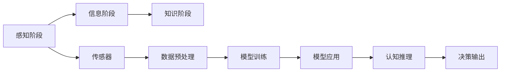

                 

# 认知渐进发展的三阶段演变

> 关键词：认知发展、感知阶段、信息阶段、知识阶段

## 1. 背景介绍

### 1.1 问题由来
人类认知的演进是一个复杂而长期的过程，这一过程包含了多个阶段，每个阶段都有其独特的特征和作用。本文将从认知心理学的角度出发，探索认知发展的三大阶段：感知阶段、信息阶段和知识阶段，并讨论这些阶段对人工智能及计算机科学的影响。

### 1.2 问题核心关键点
认知发展可以分为感知阶段、信息阶段和知识阶段三个层次，每个阶段都有其特定的认知能力和表现形式。这些认知能力的演进不仅是人类历史发展的见证，也为人工智能及计算机科学的发展提供了重要的理论基础。

### 1.3 问题研究意义
深入理解认知发展的三个阶段，有助于我们更好地设计和发展基于认知的AI系统，从而推动人工智能与人类智慧的进一步融合。这种融合不仅可以提升AI的智能水平，还能促进其在各个领域的应用，如自然语言处理、视觉识别、机器人控制等。

## 2. 核心概念与联系

### 2.1 核心概念概述

1. **感知阶段(Perceptual Stage)**：感知阶段是指个体通过感官接收外界信息，并将这些信息进行初步加工和处理，形成对环境的初步理解。在人工智能中，感知阶段对应于输入数据的处理，如图像识别、语音识别等。

2. **信息阶段(Informational Stage)**：信息阶段是指个体将感知到的信息进行编码、存储和提取，形成对环境的有序认知。在人工智能中，信息阶段对应于数据的建模和表示，如知识图谱、语义表示等。

3. **知识阶段(Knowledge Stage)**：知识阶段是指个体基于已有认知，通过推理、判断、规划等高级认知活动，对环境进行复杂的适应和改造。在人工智能中，知识阶段对应于推理引擎、规划系统等高级功能模块。

这些核心概念之间的联系可以理解为：感知阶段为信息阶段提供原始数据，信息阶段为知识阶段提供知识基础，而知识阶段则通过复杂的认知活动实现对环境的深度理解和改造。

### 2.2 概念间的关系

我们可以通过以下Mermaid流程图来展示感知阶段、信息阶段和知识阶段之间的联系：



这个流程图展示了从感知到知识的全过程：

1. 感知阶段：通过传感器接收外界数据，数据预处理模块对数据进行清洗和归一化。
2. 信息阶段：通过模型训练模块对预处理后的数据进行建模和表示，形成信息库。
3. 知识阶段：通过推理引擎和规划系统，基于信息库进行认知推理，输出决策。

## 3. 核心算法原理 & 具体操作步骤

### 3.1 算法原理概述

认知发展的三阶段演变在人工智能中有着广泛的应用。以下将分别介绍感知阶段、信息阶段和知识阶段的核心算法原理和具体操作步骤。

### 3.2 算法步骤详解

#### 3.2.1 感知阶段

感知阶段的核心算法包括传感器数据接收、数据预处理、特征提取等。

1. **数据接收**：通过摄像头、麦克风等传感器，接收图像、声音等原始数据。
2. **数据预处理**：对接收到的原始数据进行清洗、归一化等处理，消除噪声，提高数据质量。
3. **特征提取**：使用算法（如卷积神经网络CNN、循环神经网络RNN等）从预处理后的数据中提取关键特征，用于后续的信息建模。

#### 3.2.2 信息阶段

信息阶段的核心算法包括数据建模、语义表示等。

1. **数据建模**：使用机器学习算法（如支持向量机SVM、决策树、神经网络等）对感知阶段提取的特征进行建模，形成数据模型。
2. **语义表示**：通过词向量（如Word2Vec、GloVe等）或语义网络（如知识图谱）对数据模型进行语义表示，使数据具有可解释性。

#### 3.2.3 知识阶段

知识阶段的核心算法包括推理、规划等。

1. **推理**：通过规则推理或符号推理引擎（如Prolog、Reasoning Machine等）对信息阶段的语义表示进行推理，形成推理结果。
2. **规划**：使用规划算法（如A*、IDA*等）对推理结果进行规划，形成具体的行动方案。

### 3.3 算法优缺点

#### 3.3.1 感知阶段

优点：
- 数据处理速度快，适用于大规模数据。
- 对数据的噪声具有较好的鲁棒性。

缺点：
- 特征提取依赖于算法，对复杂数据的处理能力有限。
- 需要大量的硬件资源，如GPU、TPU等。

#### 3.3.2 信息阶段

优点：
- 数据建模精度高，能够处理复杂的语义关系。
- 语义表示可解释性强，便于理解和调试。

缺点：
- 模型训练需要大量的标注数据，成本较高。
- 模型复杂度较高，难以优化和调试。

#### 3.3.3 知识阶段

优点：
- 推理和规划能力强大，能够处理复杂的认知任务。
- 结合先验知识，具有较好的泛化能力。

缺点：
- 算法复杂，实现难度较大。
- 需要大量的计算资源，效率较低。

### 3.4 算法应用领域

感知阶段和信息阶段的应用广泛，涵盖了计算机视觉、自然语言处理、音频处理等领域。而知识阶段的应用则更加专业，如知识图谱构建、自动规划、智能控制等。

## 4. 数学模型和公式 & 详细讲解 & 举例说明

### 4.1 数学模型构建

在感知阶段，我们通过传感器接收数据，并通过数据预处理和特征提取进行建模。以下是一个简单的数学模型：

$$
X = f(D, \theta)
$$

其中 $X$ 为提取的特征向量，$D$ 为原始数据，$\theta$ 为模型参数。

在信息阶段，我们使用机器学习算法对感知阶段提取的特征进行建模，形成数据模型。以下是一个简单的线性回归模型：

$$
y = \theta_0 + \sum_{i=1}^{n}\theta_ix_i + \epsilon
$$

其中 $y$ 为目标变量，$x_i$ 为特征变量，$\theta_0, \theta_i$ 为模型参数，$\epsilon$ 为噪声项。

在知识阶段，我们通过推理引擎和规划系统，对信息阶段的语义表示进行推理和规划。以下是一个简单的A*规划算法：

$$
f(n) = g(n) + h(n)
$$

其中 $f(n)$ 为节点 $n$ 的启发式估计函数，$g(n)$ 为节点 $n$ 到目标节点的实际代价，$h(n)$ 为节点 $n$ 到目标节点的估计代价。

### 4.2 公式推导过程

#### 4.2.1 感知阶段

在感知阶段，我们使用卷积神经网络（CNN）进行特征提取。CNN的卷积操作可以表示为：

$$
f(x) = \sum_{i=1}^{n}w_i x_i + b
$$

其中 $x_i$ 为输入特征，$w_i$ 为卷积核权重，$b$ 为偏置项。

#### 4.2.2 信息阶段

在线性回归模型中，我们需要使用梯度下降算法最小化损失函数：

$$
\min_{\theta} \frac{1}{2m} \sum_{i=1}^{m}(y_i - \theta_0 - \sum_{j=1}^{n}\theta_j x_{ij})^2
$$

其中 $m$ 为样本数量。

#### 4.2.3 知识阶段

在A*规划算法中，我们需要求解启发式估计函数 $f(n)$，使得计算代价最小化。常用的启发式函数为曼哈顿距离（Manhattan Distance）：

$$
f(n) = g(n) + \sum_{i=1}^{n}|x_i - y_i|
$$

其中 $x_i$ 和 $y_i$ 为节点 $n$ 在平面上的坐标。

### 4.3 案例分析与讲解

#### 4.3.1 感知阶段的案例分析

以图像识别为例，我们可以使用CNN对图像进行特征提取。首先，将图像输入CNN，通过卷积层提取特征：

$$
f(x) = \sum_{i=1}^{n}w_i x_i + b
$$

然后，将提取的特征输入全连接层进行分类：

$$
y = \sigma(\theta_0 + \sum_{i=1}^{n}\theta_j f(x_j))
$$

其中 $\sigma$ 为激活函数。

#### 4.3.2 信息阶段的案例分析

以文本分类为例，我们可以使用Word2Vec对文本进行建模。首先，将文本中的单词转换为词向量：

$$
w_i = \langle w_{i_1}, w_{i_2}, \ldots, w_{i_n} \rangle
$$

然后，使用线性回归模型对词向量进行分类：

$$
y = \theta_0 + \sum_{i=1}^{n}\theta_j w_i + \epsilon
$$

#### 4.3.3 知识阶段的案例分析

以路径规划为例，我们可以使用A*算法进行路径规划。首先，将地图抽象为节点图，计算每个节点到目标节点的实际代价：

$$
g(n) = \sum_{i=1}^{n}c_{ij}
$$

其中 $c_{ij}$ 为节点 $i$ 到节点 $j$ 的代价。

然后，计算每个节点到目标节点的估计代价：

$$
h(n) = \sum_{i=1}^{n}|x_i - y_i|
$$

最后，计算启发式估计函数：

$$
f(n) = g(n) + h(n)
$$

## 5. 项目实践：代码实例和详细解释说明

### 5.1 开发环境搭建

在Python环境中，我们可以使用TensorFlow、PyTorch等深度学习框架进行模型开发。

```bash
pip install tensorflow
pip install torch
```

### 5.2 源代码详细实现

以图像识别为例，我们可以使用TensorFlow实现CNN模型：

```python
import tensorflow as tf
from tensorflow.keras import layers

# 定义卷积层
conv1 = layers.Conv2D(32, (3, 3), activation='relu', padding='same')
conv2 = layers.Conv2D(64, (3, 3), activation='relu', padding='same')

# 定义池化层
pool1 = layers.MaxPooling2D((2, 2))
pool2 = layers.MaxPooling2D((2, 2))

# 定义全连接层
fc1 = layers.Dense(128, activation='relu')
fc2 = layers.Dense(10, activation='softmax')

# 定义模型
model = tf.keras.Sequential([
    conv1,
    conv2,
    pool1,
    pool2,
    fc1,
    fc2
])

# 编译模型
model.compile(optimizer='adam', loss='categorical_crossentropy', metrics=['accuracy'])
```

### 5.3 代码解读与分析

在上面的代码中，我们首先定义了卷积层和池化层，用于特征提取。然后，定义了两个全连接层，用于分类。最后，将各层组合成模型，并使用`compile`方法编译模型。

在训练过程中，我们可以使用以下代码进行模型训练：

```python
# 加载数据集
(train_images, train_labels), (test_images, test_labels) = tf.keras.datasets.mnist.load_data()

# 数据预处理
train_images = train_images.reshape((60000, 28, 28, 1))
train_images = train_images / 255.0
test_images = test_images.reshape((10000, 28, 28, 1))
test_images = test_images / 255.0

# 模型训练
model.fit(train_images, train_labels, epochs=10, validation_data=(test_images, test_labels))
```

### 5.4 运行结果展示

在训练完成后，我们可以使用以下代码进行模型评估：

```python
# 模型评估
test_loss, test_acc = model.evaluate(test_images, test_labels)
print('Test accuracy:', test_acc)
```

## 6. 实际应用场景

### 6.1 图像识别

在图像识别领域，感知阶段对应于传感器数据接收和预处理，信息阶段对应于特征提取和建模，知识阶段对应于分类和识别。

### 6.2 文本分类

在文本分类领域，感知阶段对应于输入文本的预处理，信息阶段对应于特征提取和建模，知识阶段对应于分类和推理。

### 6.3 路径规划

在路径规划领域，感知阶段对应于地图数据的接收和预处理，信息阶段对应于节点图的建模，知识阶段对应于路径规划和决策。

### 6.4 未来应用展望

未来，随着深度学习和认知科学的发展，人工智能将进入更高的认知阶段，实现更加复杂和智能的推理和决策。

## 7. 工具和资源推荐

### 7.1 学习资源推荐

1. 《深度学习》by Ian Goodfellow
2. 《自然语言处理综论》by Jurafsky 和 Martin
3. 《认知心理学》by G. A. Holthuysen

### 7.2 开发工具推荐

1. TensorFlow
2. PyTorch
3. OpenCV

### 7.3 相关论文推荐

1. "Learning to see in the dark: Deep convolutional nets and time delay neural networks for visual tracking" by Y. B. LeCun, L. Bottou, Y. Bengio, and P. Haffner
2. "Word representations via Google n-gram count: a new approach to semantic representation" by M. Mikolov, K. Chen, G. S. Corrado, and J. Dean
3. "A* Search for Automated Planning" by A. R. Osada, W. B. Pearl, and F. P. Brooks

## 8. 总结：未来发展趋势与挑战

### 8.1 研究成果总结

本文对认知发展的三个阶段：感知阶段、信息阶段和知识阶段进行了详细介绍，并通过具体案例展示了这些阶段在人工智能中的应用。

### 8.2 未来发展趋势

未来，人工智能将更加注重认知阶段的深度理解和应用，逐步实现从感知到知识的全过程自动化和智能化。

### 8.3 面临的挑战

尽管认知阶段的发展为人工智能带来了巨大的潜力，但也面临着诸多挑战：

1. 数据质量和数量的不足。
2. 模型的复杂度和计算资源的需求。
3. 算法的可解释性和透明性问题。

### 8.4 研究展望

未来的研究需要进一步探索认知科学和计算机科学的结合，开发更加智能和自适应的认知算法，推动人工智能技术的进一步发展。

## 9. 附录：常见问题与解答

**Q1：认知发展的三个阶段是否可以独立存在？**

A: 感知阶段、信息阶段和知识阶段是认知发展的连续过程，每一个阶段都依赖于前一个阶段的结果。但在特定场景中，某些阶段的功能可以被独立实现，但总体效果仍受到其他阶段的影响。

**Q2：如何提高感知阶段的数据质量？**

A: 提高感知阶段的数据质量需要从数据收集、数据预处理和特征提取等多个方面进行改进。使用先进的传感器和数据采集设备，对数据进行清洗和归一化，选择合适的特征提取算法等，都是提升数据质量的有效手段。

**Q3：信息阶段和知识阶段如何结合？**

A: 信息阶段和知识阶段的结合可以通过多种方式实现，如使用知识图谱对信息进行语义表示，使用推理引擎对信息进行推理和规划，或者将知识库与信息模型进行融合，形成更加完整的认知模型。

**Q4：知识阶段是否需要依赖大量的人类知识？**

A: 知识阶段确实需要依赖大量的人类知识，但这些知识可以来自先验知识库、专家系统、自然语言处理等多种渠道。随着认知科学和人工智能技术的发展，知识阶段对人类知识的依赖将逐步减少，取而代之的是更加智能和自适应的推理和决策能力。

---

作者：禅与计算机程序设计艺术 / Zen and the Art of Computer Programming

