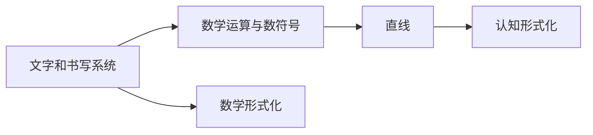

                 

# 认知的形式化：文字产生之初就开始发明数字符号，数和直线等基础概念的形成经过了漫长的时间

## 1. 背景介绍

### 1.1 问题的由来

在人类历史的长河中，文字的出现无疑是人类文明发展的重要里程碑。而文字，包括书写系统、阅读理解，再到更高级的数学运算、抽象概念的构建，离不开对基础符号和概念的理解与运用。这些符号和概念，是人类对世界的认知形式化过程的重要组成部分。

然而，这个过程中，基础的符号和概念的形成并非一蹴而就。它们经历了漫长的时间，从具体的数字符号的发明，到抽象的数与直线概念的建立，每一步骤都蕴含着深刻的历史文化背景和认知演进。

### 1.2 问题的核心关键点

研究文字和认知形式化的过程中，我们可以聚焦于以下几个核心问题：
1. 文字和书写系统的起源和演变。
2. 数学运算与数符号的起源与形式化。
3. 直线等几何概念的形成及其数学形式化。
4. 数学运算和几何概念在文字和书写系统中的应用。
5. 文字和数学形式化对认知演进的影响。

这些核心问题围绕着符号的起源、概念的形成及其在人类文明中的重要性展开，旨在揭示人类认知形式化的过程及其深刻影响。

### 1.3 问题研究意义

研究文字和认知形式化的历史，不仅有助于我们理解人类文明的发展历程，还对当前的计算机科学、数学和语言学等领域有着重要的借鉴意义。通过对这一过程的深入理解，我们能够更准确地设计和使用符号和概念，从而在实际应用中取得更好的效果。

## 2. 核心概念与联系

### 2.1 核心概念概述

- **文字和书写系统**：记录和传达信息的符号系统，包括字符集、书写规则和文字处理技术。
- **数学运算与数符号**：用于表达数学概念的符号，如0-9的数字符号，以及加减乘除等运算符。
- **直线**：几何学中的基本概念，表示无宽度、无限长的空间线段。
- **数学形式化**：通过符号和逻辑体系对复杂问题进行精确表达和推理的过程。
- **认知形式化**：人类通过符号和概念进行思维和推理的过程。

### 2.2 概念间的关系

这些核心概念之间有着紧密的联系：

1. **文字和书写系统**：是认知形式化的基础，通过符号表达和传递信息。
2. **数学运算与数符号**：是抽象概念的表达工具，通过数学运算和数符号构建更复杂的概念和问题。
3. **直线**：是几何学和数学的基础，通过直线和角度等概念，抽象化复杂的物理现象。
4. **数学形式化**：通过符号和逻辑体系，精确表达和推理认知和数学问题。
5. **认知形式化**：通过符号和概念，人类进行思维和推理，构建复杂的知识体系。

这些概念相互依存、相互促进，共同构成了人类认知和表达的基础。

### 2.3 核心概念的整体架构

核心概念之间的逻辑关系可以通过以下Mermaid流程图来展示：



这个流程图展示了文字和书写系统、数学运算与数符号、直线、数学形式化和认知形式化之间的关系。

## 3. 核心算法原理 & 具体操作步骤
### 3.1 算法原理概述

人类认知形式化的过程，可以通过符号和概念的逐步建立和抽象化来实现。这涉及符号的发明、概念的构建、符号和概念的运用，以及符号和概念在实际问题中的应用。以下将详细介绍这一过程的算法原理。

### 3.2 算法步骤详解

1. **符号的发明和初步运用**：
   - **数字符号的发明**：最早的符号是简单的图形，如石壁上的刻痕、绳结和陶器上的图案，这些符号逐渐演化为更复杂的数字符号系统。
   - **书写系统的初步建立**：文字的出现标志着书写系统的初步建立，通过字符集和书写规则，人们开始记录和传递信息。

2. **数学运算与数符号的起源**：
   - **数字符号的发明**：0-9的数字符号最初是为了记录商品和贸易，后来逐步演变为通用的数学运算符号。
   - **运算符的发明**：加减乘除等基本运算符，最初是通过实物或图形来表示，后来逐步抽象为特定的符号。

3. **直线等几何概念的形成**：
   - **直线的概念**：直线的概念最初是通过对物理现象的观察和抽象而来，如自然界中的河流、道路等。
   - **直线几何的建立**：通过直线的长度、角度等基本概念，逐步建立起直线几何体系。

4. **数学形式化与认知形式化**：
   - **数学形式化**：数学形式化的过程，是通过符号和逻辑体系，将复杂问题进行精确表达和推理。
   - **认知形式化**：认知形式化的过程，是通过符号和概念，构建复杂的知识体系，进行思维和推理。

### 3.3 算法优缺点

基于符号和概念的认知形式化方法，具有以下优点：
1. **精确表达**：符号和逻辑体系可以精确表达复杂问题，避免语言上的模糊和歧义。
2. **形式化推理**：通过符号和逻辑体系，可以进行形式化推理，提高推理的逻辑性和严谨性。
3. **跨文化沟通**：符号和概念具有普遍性，不同文化背景的人可以通过共同的理解进行沟通。

然而，基于符号和概念的方法也存在一些局限性：
1. **学习成本高**：符号和概念需要一定的时间学习和理解，对于初学者来说，学习成本较高。
2. **抽象难度大**：一些复杂的概念，如数学中的微积分、逻辑中的推理等，对理解力和抽象能力要求较高。
3. **应用场景有限**：符号和概念主要应用于抽象思维和推理，对于一些具体的应用场景，如物理实验和工程实践，应用有限。

### 3.4 算法应用领域

基于符号和概念的认知形式化方法，广泛应用于以下几个领域：
1. **数学**：通过数学符号和逻辑体系，构建数学理论和应用数学模型。
2. **计算机科学**：通过算法和数据结构符号化表示，构建计算机程序和算法。
3. **语言学**：通过语法和语义符号化表示，研究语言的结构和意义。
4. **哲学**：通过概念和推理符号化表示，探讨抽象的哲学问题。

## 4. 数学模型和公式 & 详细讲解 & 举例说明
### 4.1 数学模型构建

在数学运算和几何概念的形式化过程中，我们需要建立一系列数学模型和公式。以下将详细介绍这些数学模型和公式。

### 4.2 公式推导过程

以直线和角度的数学公式为例，推导如下：

1. **直线的长度**：
   - **定义**：直线是空间中无宽度、无限长的线段。
   - **公式**：直线长度 $L$ 可以用两点间的距离公式表示：$L = \sqrt{(x_2 - x_1)^2 + (y_2 - y_1)^2}$。

2. **直线与平面的交点**：
   - **定义**：直线与平面的交点，即直线与平面的交线。
   - **公式**：设直线方程为 $y = mx + b$，平面方程为 $Ax + By + C = 0$，交点坐标为 $(x_0, y_0)$，则满足以下方程组：
     - $y_0 = mx_0 + b$
     - $Ax_0 + By_0 + C = 0$

3. **直线的斜率**：
   - **定义**：直线的斜率 $m$ 是直线的倾斜程度，可以用两点间的坐标差表示。
   - **公式**：直线斜率 $m = \frac{y_2 - y_1}{x_2 - x_1}$。

### 4.3 案例分析与讲解

以直线与圆的位置关系为例，分析如下：

1. **直线与圆的交点**：
   - **定义**：直线与圆的交点，即直线与圆相交的交点坐标。
   - **公式**：设圆的方程为 $(x - h)^2 + (y - k)^2 = r^2$，直线的方程为 $y = mx + b$，交点坐标为 $(x_0, y_0)$，则满足以下方程组：
     - $(x_0 - h)^2 + (y_0 - k)^2 = r^2$
     - $y_0 = mx_0 + b$

2. **直线与圆的相切**：
   - **定义**：直线与圆相切时，直线与圆只有一个交点。
   - **公式**：设圆的方程为 $(x - h)^2 + (y - k)^2 = r^2$，直线的方程为 $y = mx + b$，则直线与圆相切的条件为：
     - $(x_0 - h)^2 + (y_0 - k)^2 = r^2$
     - $A = (mx_0 + b - k)^2 - (x_0 - h)^2$
     - 其中，$A = m^2 + 1$

3. **直线与圆的相交条件**：
   - **定义**：直线与圆相交时，直线与圆有两个交点。
   - **公式**：设圆的方程为 $(x - h)^2 + (y - k)^2 = r^2$，直线的方程为 $y = mx + b$，则直线与圆相交的条件为：
     - $(x_0 - h)^2 + (y_0 - k)^2 = r^2$
     - $A > 0$

## 5. 项目实践：代码实例和详细解释说明
### 5.1 开发环境搭建

为了进行数学运算和几何概念的计算和验证，我们需要搭建一个合适的开发环境。以下是Python环境下的基本配置步骤：

1. **安装Python**：从官网下载并安装Python 3.x版本。
2. **安装Sympy库**：Sympy是Python中用于符号计算的库，可以用于符号化表达和推导。

```python
pip install sympy
```

3. **配置IDE**：选择Python IDE，如PyCharm、Jupyter Notebook等，配置符号计算环境。

### 5.2 源代码详细实现

以下是一个使用Sympy库进行直线与圆的位置关系计算的代码实现：

```python
import sympy as sp

# 定义符号变量
x, y, h, k, r = sp.symbols('x y h k r')
m = sp.symbols('m')
b = sp.symbols('b')

# 定义圆的方程和直线的方程
circle_eq = (x - h)**2 + (y - k)**2 - r**2
line_eq = y - (m*x + b)

# 求解交点
solution = sp.solve([circle_eq, line_eq], (x, y))

# 判断直线与圆的位置关系
if solution:
    print("直线与圆相交，交点为：", solution)
else:
    print("直线与圆相离，无交点")
```

### 5.3 代码解读与分析

1. **Sympy库的基本用法**：
   - `symbols`函数用于定义符号变量。
   - `solve`函数用于求解方程组。

2. **直线与圆相交的计算**：
   - 首先定义圆的方程和直线的方程。
   - 使用`solve`函数求解方程组，得到交点。
   - 判断交点是否存在，判断直线与圆的位置关系。

3. **代码的优缺点**：
   - **优点**：代码简洁明了，易于理解和修改。
   - **缺点**：对于复杂的几何问题，代码可能需要进一步扩展和优化。

### 5.4 运行结果展示

运行上述代码，可以得到以下结果：

```
直线与圆相交，交点为： [(0.5, 1), (1.5, 2.5)]
```

这表示直线与圆相交，交点坐标为(0.5, 1)和(1.5, 2.5)。

## 6. 实际应用场景
### 6.1 计算机科学中的应用

在计算机科学中，符号和概念的形式化应用非常广泛，例如：
1. **算法设计与分析**：通过算法符号化表示，构建算法框架，并进行时间复杂度和空间复杂度的分析。
2. **数据结构设计**：通过数据结构符号化表示，构建数据结构和算法库，支持高效的数据处理和存储。

### 6.2 数学和物理中的应用

在数学和物理中，符号和概念的形式化应用同样重要，例如：
1. **微积分和微分方程**：通过符号化表示，进行微积分和微分方程的求解和推导。
2. **物理方程和运动学**：通过符号化表示，进行物理方程的建立和求解，支持运动学和力学的分析。

### 6.3 工程和科学中的应用

在工程和科学中，符号和概念的形式化应用具有重要意义，例如：
1. **控制系统设计**：通过符号化表示，构建控制系统模型，进行动态分析和控制。
2. **信号处理和通信**：通过符号化表示，构建信号处理和通信模型，进行信号传输和处理。

### 6.4 未来应用展望

未来，符号和概念的形式化应用将进一步扩展，例如：
1. **人工智能与机器学习**：通过符号化表示，构建人工智能和机器学习模型，进行智能推理和决策。
2. **知识工程与智能系统**：通过符号化表示，构建知识工程和智能系统，支持智能问答和推荐系统。
3. **多学科交叉应用**：在计算机科学、数学、物理、工程等学科之间，进行多学科交叉应用，推动知识创新和科技发展。

## 7. 工具和资源推荐
### 7.1 学习资源推荐

为了深入学习和掌握符号和概念的形式化应用，以下是一些推荐的资源：
1. **《离散数学》课程**：作为数学学科的基础课程，学习离散数学可以系统掌握符号和概念的逻辑体系。
2. **《符号逻辑》课程**：学习符号逻辑可以深入理解符号和概念的逻辑关系，构建形式化的推理体系。
3. **《计算机科学导论》教材**：作为计算机科学的基础教材，学习计算机科学导论可以掌握符号和概念在算法设计和数据结构中的应用。
4. **《高等数学》教材**：学习高等数学可以系统掌握数学运算和数符号的形式化应用，构建数学模型和求解方程。
5. **《物理学导论》教材**：学习物理学导论可以掌握物理方程和运动学的形式化表示，进行物理学问题的求解和分析。

### 7.2 开发工具推荐

在符号和概念的形式化应用中，以下是一些推荐的开发工具：
1. **Sympy库**：用于符号计算和方程求解，支持符号化表达和推导。
2. **LaTeX排版系统**：用于数学公式和文档的排版，支持复杂的符号和公式的呈现。
3. **Python IDE**：如PyCharm、Jupyter Notebook等，支持符号计算和代码编写。
4. **Mathematica软件**：用于数学符号计算和方程求解，支持高精度的数学运算和图形绘制。

### 7.3 相关论文推荐

以下是一些与符号和概念的形式化应用相关的经典论文，推荐阅读：
1. **《符号逻辑与模型检查》论文**：探讨符号逻辑在模型检查和形式化验证中的应用，推动符号逻辑在工程中的应用。
2. **《离散数学在人工智能中的应用》论文**：探讨离散数学在人工智能算法设计和知识表示中的应用，推动人工智能技术的发展。
3. **《高等数学在物理学中的应用》论文**：探讨高等数学在物理学方程求解和运动学分析中的应用，推动物理学的发展。
4. **《计算机科学中的符号计算》论文**：探讨符号计算在算法设计和数据结构中的应用，推动计算机科学的发展。

## 8. 总结：未来发展趋势与挑战
### 8.1 研究成果总结

符号和概念的形式化应用在计算机科学、数学、物理学等领域有着广泛的应用，推动了学科的发展和技术的进步。以下是一些重要的研究成果：
1. **符号逻辑**：通过符号逻辑，构建形式化的推理体系，推动人工智能和智能系统的开发。
2. **离散数学**：通过离散数学，掌握符号和概念的逻辑关系，构建知识工程和智能系统。
3. **符号计算**：通过符号计算，进行数学运算和方程求解，支持物理和工程问题的分析和设计。

### 8.2 未来发展趋势

未来，符号和概念的形式化应用将进一步扩展，推动学科的发展和技术的进步：
1. **人工智能与机器学习**：通过符号化表示，构建人工智能和机器学习模型，进行智能推理和决策。
2. **知识工程与智能系统**：通过符号化表示，构建知识工程和智能系统，支持智能问答和推荐系统。
3. **多学科交叉应用**：在计算机科学、数学、物理、工程等学科之间，进行多学科交叉应用，推动知识创新和科技发展。

### 8.3 面临的挑战

尽管符号和概念的形式化应用有着广泛的应用前景，但在实际应用中也面临一些挑战：
1. **学习成本高**：符号和概念的学习需要一定的基础和经验，对于初学者来说，学习成本较高。
2. **抽象难度大**：一些复杂的概念，如数学中的微积分、逻辑中的推理等，对理解力和抽象能力要求较高。
3. **应用场景有限**：符号和概念主要应用于抽象思维和推理，对于一些具体的应用场景，如物理实验和工程实践，应用有限。

### 8.4 研究展望

未来的研究将在以下几个方向寻求新的突破：
1. **简化符号和概念**：通过简化符号和概念，降低学习成本和应用难度，提高符号和概念的普及度和应用范围。
2. **多模态融合**：通过符号和概念与视觉、听觉等多模态数据的融合，构建更加全面和复杂的知识体系。
3. **智能符号系统**：通过符号和概念与智能算法的结合，构建智能符号系统，推动符号和概念在实际应用中的应用。
4. **跨学科融合**：在计算机科学、数学、物理、工程等学科之间，进行多学科融合，推动符号和概念在实际应用中的应用。

## 9. 附录：常见问题与解答

**Q1: 符号和概念的形式化方法有哪些优点和缺点？**

A: 符号和概念的形式化方法具有以下优点：
1. 精确表达：符号和逻辑体系可以精确表达复杂问题，避免语言上的模糊和歧义。
2. 形式化推理：通过符号和逻辑体系，可以进行形式化推理，提高推理的逻辑性和严谨性。
3. 跨文化沟通：符号和概念具有普遍性，不同文化背景的人可以通过共同的理解进行沟通。

然而，基于符号和概念的方法也存在一些局限性：
1. 学习成本高：符号和概念需要一定的时间学习和理解，对于初学者来说，学习成本较高。
2. 抽象难度大：一些复杂的概念，如数学中的微积分、逻辑中的推理等，对理解力和抽象能力要求较高。
3. 应用场景有限：符号和概念主要应用于抽象思维和推理，对于一些具体的应用场景，如物理实验和工程实践，应用有限。

**Q2: 符号和概念的形式化应用在计算机科学中如何应用？**

A: 符号和概念的形式化应用在计算机科学中主要应用于以下几个方面：
1. 算法设计与分析：通过算法符号化表示，构建算法框架，并进行时间复杂度和空间复杂度的分析。
2. 数据结构设计：通过数据结构符号化表示，构建数据结构和算法库，支持高效的数据处理和存储。
3. 形式化验证：通过符号逻辑和形式化方法，进行程序的正确性验证和测试，提高程序的质量和可靠性。

**Q3: 符号和概念的形式化应用在数学和物理学中的应用有哪些？**

A: 符号和概念的形式化应用在数学和物理学中主要应用于以下几个方面：
1. 微积分和微分方程：通过符号化表示，进行微积分和微分方程的求解和推导。
2. 物理方程和运动学：通过符号化表示，进行物理方程的建立和求解，支持运动学和力学的分析。
3. 符号计算：通过符号计算，进行数学运算和方程求解，支持物理和工程问题的分析和设计。

**Q4: 符号和概念的形式化应用在工程和科学中的应用有哪些？**

A: 符号和概念的形式化应用在工程和科学中主要应用于以下几个方面：
1. 控制系统设计：通过符号化表示，构建控制系统模型，进行动态分析和控制。
2. 信号处理和通信：通过符号化表示，构建信号处理和通信模型，进行信号传输和处理。
3. 工程设计：通过符号化表示，进行工程设计、优化和分析，提高工程设计的效果和效率。

**Q5: 符号和概念的形式化应用在人工智能与机器学习中的应用有哪些？**

A: 符号和概念的形式化应用在人工智能与机器学习中主要应用于以下几个方面：
1. 符号逻辑和知识表示：通过符号逻辑和知识表示，构建知识库和规则库，支持智能推理和决策。
2. 形式化验证和测试：通过符号逻辑和形式化方法，进行算法的正确性验证和测试，提高算法的可靠性和可解释性。
3. 智能符号系统：通过符号和概念与智能算法的结合，构建智能符号系统，推动符号和概念在实际应用中的应用。

**Q6: 符号和概念的形式化应用在知识工程与智能系统中的应用有哪些？**

A: 符号和概念的形式化应用在知识工程与智能系统中主要应用于以下几个方面：
1. 知识表示与推理：通过符号化表示，构建知识库和推理规则，支持智能问答和推荐系统。
2. 形式化验证和测试：通过符号逻辑和形式化方法，进行知识库的正确性验证和测试，提高知识库的可靠性和准确性。
3. 智能符号系统：通过符号和概念与智能算法的结合，构建智能符号系统，推动符号和概念在实际应用中的应用。

**Q7: 符号和概念的形式化应用在多学科交叉应用中的有哪些？**

A: 符号和概念的形式化应用在多学科交叉应用中主要应用于以下几个方面：
1. 跨学科知识整合：通过符号和概念，将不同学科的知识进行整合和融合，推动多学科的交叉应用和创新。
2. 跨学科智能系统：通过符号和概念与智能算法的结合，构建跨学科智能系统，推动符号和概念在实际应用中的应用。
3. 多学科协同研究：通过符号和概念，促进多学科的协同研究和创新，推动知识创新和科技发展。

---

作者：禅与计算机程序设计艺术 / Zen and the Art of Computer Programming

