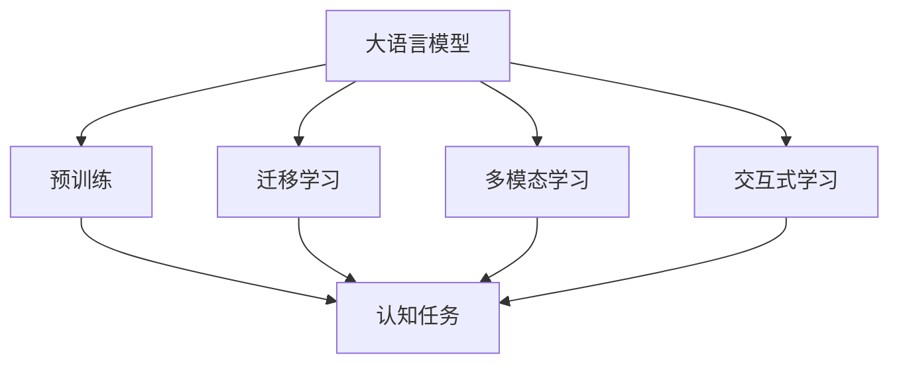

                 

## 1. 背景介绍

语言是人类社会交流的工具，而思维是人类认知世界的方式。在大数据和深度学习的推动下，大模型成为了理解语言与思维之间关系的强大工具。然而，尽管语言模型已经取得了巨大成功，它与人类思维之间的差异依然令人困惑。本文将探讨大语言模型在认知任务上的表现，分析其在理解思维能力方面的局限性，并展望未来可能的改进方向。

## 2. 核心概念与联系

### 2.1 核心概念概述

- **大语言模型 (Large Language Model, LLM)**：以自回归 (如 GPT) 或自编码 (如 BERT) 模型为代表的通用语言模型，通过在大规模无标签文本语料上进行预训练，学习到了丰富的语言知识和常识。

- **认知任务 (Cognitive Tasks)**：指那些要求模型理解、推理、生成等高级认知能力的任务，如问答、阅读理解、文本生成等。

- **迁移学习 (Transfer Learning)**：指将一个领域学习到的知识，迁移应用到另一个不同但相关的领域的学习范式。

- **多模态学习 (Multimodal Learning)**：指模型同时处理和融合多种数据模态（如文本、图像、音频等）进行学习的范式。

- **交互式学习 (Interactive Learning)**：指在模型的训练过程中，通过与用户互动进行学习的方式，如对话系统、智能助手等。

### 2.2 核心概念的关系

这些概念通过以下 Mermaid 流程图展示了它们之间的联系：



这个流程图展示了：

1. 大语言模型通过预训练学习到语言表示，这是认知任务的基础。
2. 认知任务需要模型理解、推理和生成高级语言能力，这是预训练模型的输出。
3. 迁移学习可以将预训练模型的知识迁移到新的任务，提升模型在认知任务上的表现。
4. 多模态学习可以融合多种数据模态，增强模型的感知和理解能力。
5. 交互式学习可以通过与用户的互动，使模型不断学习和优化。

## 3. 核心算法原理 & 具体操作步骤

### 3.1 算法原理概述

大语言模型在认知任务上的微调，通常遵循以下步骤：

1. **预训练**：在无标签的大型语料库上训练模型，学习语言表示。
2. **微调**：在有标签的任务数据集上微调模型，优化其对特定任务的适应性。
3. **迁移学习**：利用迁移学习技术，将预训练模型迁移到新的认知任务上。
4. **多模态学习**：融合多种数据模态，提高模型的感知和推理能力。
5. **交互式学习**：通过与用户的互动，使模型不断学习和优化。

### 3.2 算法步骤详解

#### 3.2.1 预训练

预训练是构建大语言模型的基础步骤，通常使用自监督学习任务，如语言建模、掩码语言建模等。

- **语言建模**：预测给定上下文下的下一个单词，学习单词之间的概率分布。
- **掩码语言建模**：随机遮挡输入序列中的一些单词，预测被遮挡的单词，学习上下文和单词之间的关系。

预训练过程使用大型语料库，如 Wikipedia、新闻、网络文章等，学习语言的整体结构和语言规律。

#### 3.2.2 微调

微调是在预训练模型上添加特定的任务层，如分类器、解码器等，用有标签的任务数据集进行训练，优化模型在特定认知任务上的表现。

微调通常使用较少的学习率，避免破坏预训练的权重。常用的优化器包括 Adam、AdamW 等。

#### 3.2.3 迁移学习

迁移学习是将预训练模型迁移到新的认知任务上的过程，通常包括以下步骤：

1. 在预训练模型上添加特定任务的适配层。
2. 在有标签的任务数据集上进行微调。
3. 利用迁移学习技术，如微调、微调后的微调、权重共享等，将模型的知识迁移到新的任务上。

#### 3.2.4 多模态学习

多模态学习是融合多种数据模态进行学习的过程。

- **视觉与文本融合**：将图像和文本数据同时输入模型，学习它们之间的关系。
- **音频与文本融合**：将音频和文本数据同时输入模型，学习它们之间的关系。

多模态学习可以显著提升模型的感知和推理能力。

#### 3.2.5 交互式学习

交互式学习是通过与用户的互动进行学习的过程。

- **对话系统**：通过对话历史，训练模型理解用户的意图和生成响应。
- **智能助手**：通过用户的操作记录，训练模型学习用户的行为模式和需求。

交互式学习可以不断优化模型，提高其适应性和实用性。

### 3.3 算法优缺点

#### 3.3.1 优点

1. **高效性**：预训练模型可以显著降低标注数据的需求，加速模型的训练和优化。
2. **泛化能力强**：通过迁移学习，模型可以在多个认知任务上取得优异表现。
3. **适应性广**：多模态学习使模型能够处理多种数据模态，增强了感知能力。
4. **用户体验好**：交互式学习通过与用户的互动，提高了模型的实用性和用户体验。

#### 3.3.2 缺点

1. **数据依赖**：模型依赖大量标注数据进行微调，获取高质量标注数据的成本高。
2. **偏差风险**：预训练模型可能存在偏差，影响其在特定任务上的表现。
3. **可解释性差**：大语言模型的决策过程缺乏可解释性，难以调试和优化。
4. **计算资源需求高**：大规模预训练模型需要高性能的计算资源，训练和推理成本高。

## 4. 数学模型和公式 & 详细讲解 & 举例说明

### 4.1 数学模型构建

假设预训练模型为 $M_{\theta}$，其中 $\theta$ 为预训练参数。给定一个认知任务 $T$，任务数据集 $D=\{(x_i, y_i)\}_{i=1}^N$，其中 $x_i$ 为输入，$y_i$ 为标签。

定义模型 $M_{\theta}$ 在输入 $x$ 上的输出为 $y=M_{\theta}(x)$，在任务 $T$ 上的损失函数为 $\ell(y,y_i)$，则在数据集 $D$ 上的经验风险为：

$$
\mathcal{L}(\theta) = \frac{1}{N} \sum_{i=1}^N \ell(y_i,y)
$$

微调的目标是最小化经验风险，即找到最优参数：

$$
\theta^* = \mathop{\arg\min}_{\theta} \mathcal{L}(\theta)
$$

### 4.2 公式推导过程

以问答系统为例，假设模型输入为 $q$，答案为 $a$，其中 $q$ 和 $a$ 均为文本。模型的输出 $y$ 为对 $q$ 的回答，模型在数据集 $D$ 上的损失函数为：

$$
\ell(y,y_i) = \begin{cases}
\text{BCE}(y,\hat{y}) & \text{if } \text{type}(y_i) = \text{text} \\
\text{NLL}(y,y_i) & \text{if } \text{type}(y_i) = \text{multi-token}
\end{cases}
$$

其中 BCE 为二分类交叉熵，NLL 为多分类交叉熵。

微调的目标是使得模型的预测 $y$ 与真实答案 $y_i$ 尽量接近，因此使用以下优化目标：

$$
\min_{\theta} \frac{1}{N} \sum_{i=1}^N \ell(y_i,y)
$$

### 4.3 案例分析与讲解

假设我们要构建一个基于 GPT 的问答系统。首先，在 Wikipedia 等大型语料库上进行预训练，然后使用少量的问答对数据进行微调。

- **预训练**：使用 GPT-2 在 Wikipedia 上进行预训练，学习语言的整体结构和规律。
- **微调**：在问答数据集上进行微调，优化模型对问答对的理解能力。
- **迁移学习**：将微调后的 GPT-2 迁移到其他认知任务，如阅读理解、文本生成等。

## 5. 项目实践：代码实例和详细解释说明

### 5.1 开发环境搭建

- **安装 Python**：在虚拟环境中安装 Python 3.8。
- **安装 PyTorch**：使用以下命令安装 PyTorch：
  ```bash
  conda install pytorch torchvision torchaudio cudatoolkit=11.1 -c pytorch -c conda-forge
  ```
- **安装 Transformers**：
  ```bash
  pip install transformers
  ```

### 5.2 源代码详细实现

```python
from transformers import BertForSequenceClassification, AdamW, BertTokenizerFast
import torch
from torch.utils.data import DataLoader
from sklearn.metrics import accuracy_score

# 加载预训练模型和分词器
model = BertForSequenceClassification.from_pretrained('bert-base-uncased')
tokenizer = BertTokenizerFast.from_pretrained('bert-base-uncased')

# 加载数据集
train_dataset = Dataset(train_data)
val_dataset = Dataset(val_data)
test_dataset = Dataset(test_data)

# 定义优化器
optimizer = AdamW(model.parameters(), lr=1e-5)

# 训练过程
for epoch in range(num_epochs):
    model.train()
    total_loss = 0
    for batch in DataLoader(train_dataset, batch_size):
        input_ids = batch['input_ids']
        attention_mask = batch['attention_mask']
        labels = batch['labels']

        # 前向传播
        outputs = model(input_ids, attention_mask=attention_mask, labels=labels)
        loss = outputs.loss

        # 反向传播和优化
        optimizer.zero_grad()
        loss.backward()
        optimizer.step()

        total_loss += loss.item()

    # 验证过程
    model.eval()
    total_correct = 0
    for batch in DataLoader(val_dataset, batch_size):
        with torch.no_grad():
            input_ids = batch['input_ids']
            attention_mask = batch['attention_mask']
            labels = batch['labels']

            outputs = model(input_ids, attention_mask=attention_mask)
            preds = outputs.predictions.argmax(-1)

            total_correct += accuracy_score(labels, preds)

    print(f"Epoch {epoch+1}, train loss: {total_loss/len(train_dataset)}, dev accuracy: {total_correct/len(val_dataset)}")

# 测试过程
model.eval()
total_correct = 0
for batch in DataLoader(test_dataset, batch_size):
    with torch.no_grad():
        input_ids = batch['input_ids']
        attention_mask = batch['attention_mask']
        labels = batch['labels']

        outputs = model(input_ids, attention_mask=attention_mask)
        preds = outputs.predictions.argmax(-1)

        total_correct += accuracy_score(labels, preds)

print(f"Test accuracy: {total_correct/len(test_dataset)}")
```

### 5.3 代码解读与分析

这段代码实现了问答系统的微调过程。首先加载预训练的 BertForSequenceClassification 模型和分词器。然后加载数据集，定义优化器，进行训练和验证。

在训练过程中，对每个批次的数据进行前向传播，计算损失，反向传播更新模型参数。在验证过程中，计算模型在验证集上的准确率。在测试过程中，计算模型在测试集上的准确率。

## 6. 实际应用场景

### 6.1 智能客服系统

智能客服系统可以通过微调大语言模型，理解用户的意图并生成合适的回答。系统可以不断积累用户的反馈数据，进行微调，逐步提升服务质量。

### 6.2 金融舆情监测

金融舆情监测系统可以通过微调大语言模型，自动分析和处理新闻、评论等信息，识别市场情绪和趋势，帮助金融机构做出及时的决策。

### 6.3 个性化推荐系统

个性化推荐系统可以通过微调大语言模型，学习用户的行为模式和兴趣偏好，生成个性化的推荐内容，提高用户体验。

### 6.4 未来应用展望

未来，大语言模型在认知任务上的应用将更加广泛。

- **医疗诊断**：通过微调大语言模型，理解患者描述和医学文献，辅助医生进行诊断和治疗。
- **法律咨询**：通过微调大语言模型，理解法律文本和案例，提供法律咨询服务。
- **教育培训**：通过微调大语言模型，理解学生问题和教材，提供个性化的教育培训。

## 7. 工具和资源推荐

### 7.1 学习资源推荐

- **《深度学习自然语言处理》**：斯坦福大学 CS224N 课程，涵盖 NLP 的基本概念和经典模型。
- **《Natural Language Processing with Transformers》**：Transformer 库作者所著，全面介绍 Transformer 及其应用。
- **CLUE**：中文语言理解测评基准，包含大量不同类型的中文 NLP 数据集，提供微调基线模型。

### 7.2 开发工具推荐

- **PyTorch**：深度学习框架，支持动态图和静态图，灵活方便。
- **TensorFlow**：由 Google 主导的开源框架，适合大规模工程应用。
- **Transformers**：NLP 工具库，提供丰富的预训练模型和微调样例。

### 7.3 相关论文推荐

- **Attention is All You Need**：Transformer 原论文，提出自注意力机制，推动预训练大模型的发展。
- **BERT: Pre-training of Deep Bidirectional Transformers for Language Understanding**：提出 BERT 模型，引入掩码语言建模任务。
- **Language Models are Unsupervised Multitask Learners**：提出 GPT-2 模型，展示大语言模型的零样本学习能力。

## 8. 总结：未来发展趋势与挑战

### 8.1 研究成果总结

本文介绍了大语言模型在认知任务上的微调方法，探讨了其在大模型中的应用和局限性，展望了未来的发展趋势。

### 8.2 未来发展趋势

- **模型规模增大**：预训练模型的参数量将进一步增大，学习更多语言知识和常识。
- **多模态融合**：融合多种数据模态，提升模型的感知和推理能力。
- **交互式学习**：通过与用户的互动，不断优化模型，提高用户体验。
- **小样本学习**：在少量标注数据下，通过提示学习等技术，提升模型的泛化能力。

### 8.3 面临的挑战

- **标注数据依赖**：获取高质量标注数据成本高，限制了模型的应用范围。
- **偏差风险**：模型可能存在偏差，影响其在特定任务上的表现。
- **可解释性差**：大语言模型的决策过程缺乏可解释性，难以调试和优化。
- **计算资源需求高**：大规模预训练和微调模型需要高性能的计算资源。

### 8.4 研究展望

- **无监督学习**：探索无监督和半监督学习技术，降低对标注数据的需求。
- **参数高效微调**：开发更多参数高效的微调方法，提高微调的效率。
- **多模态融合**：将视觉、音频等多模态数据与文本数据融合，提升模型的感知能力。
- **交互式学习**：通过与用户的互动，不断优化模型，提高用户体验。

## 9. 附录：常见问题与解答

### 9.1 问题解答

**Q1：大语言模型在认知任务上表现如何？**

A: 大语言模型在认知任务上取得了显著的进展，如问答、阅读理解、文本生成等。但与人类思维相比，仍存在差距，需要进一步优化。

**Q2：如何提高大语言模型的可解释性？**

A: 可以通过引入可解释性技术，如特征可视化、解释性模型等，提高模型的可解释性。同时，开发更多的解释性接口，帮助用户理解模型的决策过程。

**Q3：如何降低大语言模型的计算资源需求？**

A: 可以使用模型裁剪、量化加速等技术，减小模型尺寸，提高计算效率。同时，优化模型结构，减少内存和存储的使用。

**Q4：大语言模型在实际应用中需要注意哪些问题？**

A: 在实际应用中，需要注意数据隐私、模型安全等问题。同时，开发更高效、更稳定的模型部署方案，确保系统的高可用性。

---

作者：禅与计算机程序设计艺术 / Zen and the Art of Computer Programming

