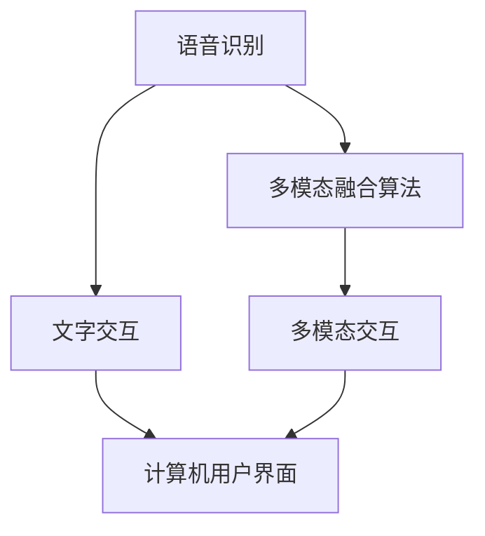
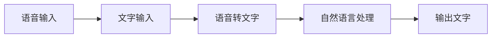
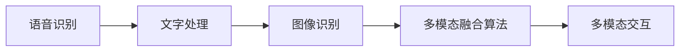
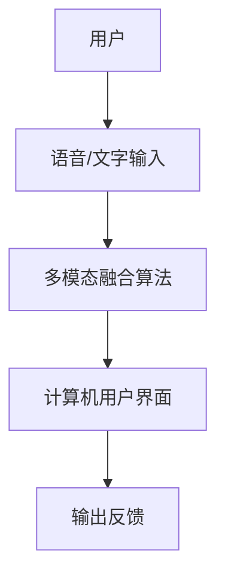
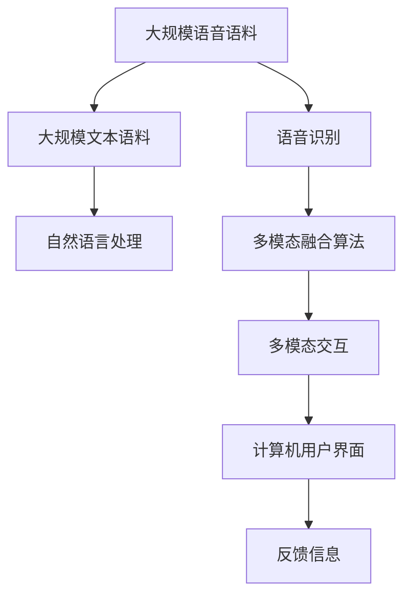

                 

# 语音和文字交互在CUI中的应用

> 关键词：语音交互, 自然语言处理, 计算机用户界面, 多模态交互, 人工智能, 用户体验

## 1. 背景介绍

### 1.1 问题由来

随着人工智能技术的迅猛发展，语音和文字交互作为人机交互的重要形式，已经成为计算机用户界面（Computer User Interface，简称CUI）的重要组成部分。语音交互通过语音识别和合成技术，使得用户可以通过语音指令与计算机进行交互，而文字交互则通过文本处理和自然语言理解技术，使得用户可以通过文字输入与计算机进行交互。这两种交互形式在实际应用中得到了广泛应用，并在智能家居、智能车载、智能客服、智能办公等领域产生了深远影响。

然而，随着用户对交互体验的需求日益提高，传统的语音和文字交互方式也面临着诸多挑战。例如，语音识别在嘈杂环境下准确率较低，文字输入速度较慢，用户体验不佳等问题。如何更好地结合语音和文字交互，提升用户交互的效率和体验，成为了当前CUI研究的重要方向。

### 1.2 问题核心关键点

为了解决上述问题，当前研究主要聚焦于多模态交互技术，即在语音交互和文字交互的基础上，结合其他感知信息，提升交互的准确性和自然性。多模态交互技术能够更好地捕捉用户的意图和情感，实现更自然、更高效的人机交互。

多模态交互技术主要包括以下几个关键点：

1. 多通道输入输出：将语音、文字、图像等多种信息通道进行融合，提升交互的自然性和鲁棒性。
2. 多模态融合算法：将语音识别、文字处理、图像识别等技术进行融合，实现多模态信息的协同处理。
3. 多模态反馈机制：通过视觉、触觉等反馈信息，提升用户的交互体验和感知效果。
4. 多模态情感分析：结合语音和文字信息，对用户的情感状态进行分析和理解，提升交互的个性化和自然性。

这些关键点构成了当前多模态交互技术的主要研究方向，旨在提升交互的准确性、自然性和用户体验。

### 1.3 问题研究意义

多模态交互技术的研究，对于提升计算机用户界面的交互体验，推动人工智能技术的落地应用具有重要意义：

1. 提升交互效率：通过语音和文字的结合，提升交互的响应速度和准确性，减少用户等待时间。
2. 改善用户体验：多模态交互能够更好地捕捉用户的情感和意图，提升交互的自然性和个性化。
3. 降低用户成本：减少用户对复杂操作的学习成本，使得交互更加简单、直观。
4. 增强系统安全性：通过多模态信息的融合，提升系统的鲁棒性和安全性，避免误操作和恶意攻击。
5. 推动技术发展：多模态交互技术的发展，能够带动语音识别、自然语言处理、计算机视觉等技术的进步，为人工智能技术的发展提供新的动力。

## 2. 核心概念与联系

### 2.1 核心概念概述

为了更好地理解多模态交互技术，本节将介绍几个关键概念：

- 语音识别（Speech Recognition）：将语音信号转换为文本的过程，是语音交互的基础。
- 自然语言处理（Natural Language Processing，简称NLP）：通过计算机处理和理解人类语言，实现文字交互。
- 计算机用户界面（Computer User Interface，简称CUI）：计算机与用户交互的界面，包括文字输入、语音交互等多种形式。
- 多模态交互（Multi-modal Interaction）：结合多种感知信息，提升交互的自然性和准确性。
- 多模态融合算法（Multi-modal Fusion Algorithm）：将语音识别、文字处理、图像识别等技术进行融合，实现多模态信息的协同处理。

这些概念之间的联系可以通过以下Mermaid流程图来展示：



这个流程图展示了大语言模型微调过程中各个核心概念的关系和作用：

1. 语音识别和文字交互分别作为多模态交互的一部分，通过多模态融合算法进行信息融合。
2. 多模态交互在计算机用户界面中得以体现，实现了用户与计算机之间的自然交互。

### 2.2 概念间的关系

这些核心概念之间存在着紧密的联系，形成了多模态交互技术的完整生态系统。下面我们通过几个Mermaid流程图来展示这些概念之间的关系。

#### 2.2.1 语音和文字交互的融合



这个流程图展示了语音和文字交互的融合过程。语音输入通过语音识别转化为文字，然后通过自然语言处理进行处理，最后输出文字结果。

#### 2.2.2 多模态融合算法的结构



这个流程图展示了多模态融合算法的结构。语音识别、文字处理和图像识别分别作为输入，通过多模态融合算法进行处理，最终输出多模态交互结果。

#### 2.2.3 多模态交互的实现



这个流程图展示了多模态交互的实现过程。用户通过语音或文字输入，通过多模态融合算法进行处理，最终在计算机用户界面中得到输出反馈。

### 2.3 核心概念的整体架构

最后，我们用一个综合的流程图来展示这些核心概念在大语言模型微调过程中的整体架构：



这个综合流程图展示了从语音语料和文本语料预处理，到语音识别、文字处理、多模态融合算法，再到多模态交互和计算机用户界面的完整过程。多模态交互技术的实现离不开语音识别、自然语言处理、多模态融合算法等多种技术的协同作用。

## 3. 核心算法原理 & 具体操作步骤
### 3.1 算法原理概述

多模态交互技术的基本原理是通过将语音、文字、图像等多种信息通道进行融合，提升交互的准确性和自然性。其核心思想是将多模态信息进行融合，使得计算机能够更好地理解和响应用户的意图和情感。

具体而言，多模态交互技术通常包括以下几个步骤：

1. 语音识别：将用户的语音输入转换为文本，实现语音和文字的双通道输入。
2. 自然语言处理：通过自然语言处理技术，理解用户的输入内容，生成文字交互结果。
3. 多模态融合：将语音识别结果、文字处理结果、图像识别结果等进行融合，提升交互的自然性和鲁棒性。
4. 交互反馈：将交互结果通过视觉、触觉等多种方式进行反馈，提升用户体验。

这些步骤共同构成了多模态交互技术的基本流程，使得计算机能够更好地捕捉用户的意图和情感，实现更自然、更高效的人机交互。

### 3.2 算法步骤详解

以下我们将详细讲解多模态交互技术的各个关键步骤。

#### 3.2.1 语音识别

语音识别的核心任务是将语音信号转换为文本，通常分为离线识别和在线识别两种方式。离线识别通常用于预处理，将大批量语音数据进行批量处理。在线识别通常用于实时交互，对用户语音进行实时处理。

离线语音识别的流程如下：

1. 语音信号预处理：对语音信号进行去噪、降噪、降维等预处理，提升识别效果。
2. 特征提取：对预处理后的语音信号进行特征提取，得到梅尔频率倒谱系数（MFCC）等特征。
3. 语音识别模型：使用深度学习模型（如CNN、RNN、LSTM等）对特征进行训练，得到语音识别模型。
4. 语音转文字：将语音识别模型应用于新的语音信号，得到文字结果。

在线语音识别的流程如下：

1. 语音信号采集：实时采集用户的语音信号，并进行预处理。
2. 特征提取：对预处理后的语音信号进行特征提取。
3. 语音识别模型：使用深度学习模型对特征进行实时处理，得到文字结果。
4. 文字交互：将文字结果应用到自然语言处理和交互反馈中，完成交互。

#### 3.2.2 自然语言处理

自然语言处理的核心任务是理解用户的输入内容，生成文字交互结果。其关键在于文本的语义理解和句法分析。

自然语言处理通常包括以下几个步骤：

1. 分词：将输入文本进行分词，得到词汇单元。
2. 词性标注：对分词结果进行词性标注，得到每个词的语法属性。
3. 句法分析：对词性标注结果进行句法分析，得到句子结构。
4. 语义理解：对句子结构进行语义分析，理解用户的意图和情感。
5. 文本生成：根据语义理解结果，生成文字交互结果。

#### 3.2.3 多模态融合

多模态融合的核心任务是将语音识别结果、文字处理结果、图像识别结果等进行融合，提升交互的自然性和鲁棒性。通常使用深度学习模型（如CNN、RNN、LSTM等）对多模态信息进行融合。

多模态融合的流程如下：

1. 特征提取：对语音识别结果、文字处理结果、图像识别结果等进行特征提取。
2. 融合算法：使用深度学习模型对特征进行融合，得到多模态融合结果。
3. 交互反馈：将多模态融合结果应用于交互反馈中，提升用户体验。

#### 3.2.4 交互反馈

交互反馈的核心任务是将交互结果通过视觉、触觉等多种方式进行反馈，提升用户体验。通常使用多通道反馈机制，如显示界面、语音合成、震动反馈等，提升交互的自然性和感知效果。

交互反馈的流程如下：

1. 界面显示：将交互结果显示在计算机屏幕上，供用户查看。
2. 语音合成：将交互结果转换为语音信号，供用户收听。
3. 震动反馈：对用户进行震动反馈，增强交互体验。

### 3.3 算法优缺点

多模态交互技术具有以下优点：

1. 提高交互准确性：通过多模态信息的融合，提升交互的准确性和鲁棒性。
2. 提升用户体验：多模态交互能够更好地捕捉用户的情感和意图，提升交互的自然性和个性化。
3. 降低用户成本：减少用户对复杂操作的学习成本，使得交互更加简单、直观。
4. 增强系统安全性：通过多模态信息的融合，提升系统的鲁棒性和安全性，避免误操作和恶意攻击。

然而，多模态交互技术也存在一些缺点：

1. 技术复杂度较高：多模态交互涉及语音识别、自然语言处理、图像识别等多种技术，技术实现较为复杂。
2. 数据量要求较高：多模态融合算法需要大量的训练数据，数据获取和标注成本较高。
3. 硬件要求较高：多模态交互需要高性能的硬件设备支持，如高性能CPU、GPU等。
4. 用户体验依赖：多模态交互的效果依赖于用户的感知能力和设备性能，用户体验有待提升。

### 3.4 算法应用领域

多模态交互技术已经在多个领域得到了广泛应用，例如：

1. 智能家居：通过语音和文字交互，实现智能音箱、智能电视、智能空调等设备的控制和操作。
2. 智能车载：通过语音和文字交互，实现车载导航、车载娱乐、车载客服等功能。
3. 智能客服：通过语音和文字交互，实现智能客服系统的构建，提升客服效率和服务质量。
4. 智能办公：通过语音和文字交互，实现智能会议系统、智能文档管理系统、智能邮件系统等功能。
5. 智能医疗：通过语音和文字交互，实现智能问诊、智能记录、智能报告等功能。

除了上述这些应用领域外，多模态交互技术还在智能城市、智能交通、智能安全等多个领域得到了广泛应用，为人工智能技术落地提供了新的动力。

## 4. 数学模型和公式 & 详细讲解 & 举例说明

### 4.1 数学模型构建

多模态交互技术的核心数学模型通常包括语音识别模型、自然语言处理模型和多模态融合模型。

#### 4.1.1 语音识别模型

语音识别模型的核心是深度神经网络模型，通常采用卷积神经网络（CNN）或循环神经网络（RNN）等结构。

语音识别模型的数学模型如下：

$$
f(x; \theta) = \sigma(W \cdot \sigma(B \cdot x + u))
$$

其中，$f(x; \theta)$表示语音识别模型，$x$表示输入语音信号，$\theta$表示模型参数，$W$和$B$表示卷积核和偏置项，$\sigma$表示激活函数。

#### 4.1.2 自然语言处理模型

自然语言处理模型的核心是递归神经网络（RNN）或Transformer等结构。

自然语言处理模型的数学模型如下：

$$
h_{t} = f_{RNN}(h_{t-1}, x_t; \theta)
$$

$$
\hat{y} = f_{LM}(h_T; \theta)
$$

其中，$h_{t}$表示时间步$t$的隐状态，$x_t$表示时间步$t$的输入词汇，$\theta$表示模型参数，$h_{t-1}$表示时间步$t-1$的隐状态，$f_{RNN}$表示递归神经网络，$f_{LM}$表示语言模型。

#### 4.1.3 多模态融合模型

多模态融合模型的核心是深度神经网络模型，通常采用卷积神经网络（CNN）或循环神经网络（RNN）等结构。

多模态融合模型的数学模型如下：

$$
f_{FM}(x_{S}, x_{V}, x_{I}; \theta) = \sigma(W_{FM} \cdot \sigma(B_{FM} \cdot [x_{S}, x_{V}, x_{I}] + u_{FM}))
$$

其中，$f_{FM}(x_{S}, x_{V}, x_{I}; \theta)$表示多模态融合模型，$x_{S}$表示语音识别结果，$x_{V}$表示文字处理结果，$x_{I}$表示图像识别结果，$\theta$表示模型参数，$W_{FM}$和$B_{FM}$表示卷积核和偏置项，$\sigma$表示激活函数，$u_{FM}$表示全连接层。

### 4.2 公式推导过程

以下我们将对语音识别模型、自然语言处理模型和多模态融合模型的公式进行详细推导。

#### 4.2.1 语音识别模型公式推导

语音识别模型公式推导如下：

1. 卷积层公式：

$$
W_{conv} = \left[ \begin{array}{cccc} w_1 & w_2 & \cdots & w_n \end{array} \right]
$$

$$
B_{conv} = \left[ \begin{array}{c} b_1 \\ b_2 \\ \vdots \\ b_n \end{array} \right]
$$

2. 池化层公式：

$$
f_{pool}(x_{i,j}) = max\{x_{i,j}, x_{i+1,j}, x_{i,j+1}, x_{i+1,j+1}\}
$$

3. 全连接层公式：

$$
f_{FC} = f_{RNN}(f_{conv}(f_{pool}(x)); \theta)
$$

其中，$w_1, w_2, \cdots, w_n$表示卷积核，$b_1, b_2, \cdots, b_n$表示偏置项，$x_{i,j}$表示卷积层的输出，$f_{conv}$表示卷积层，$f_{pool}$表示池化层，$f_{FC}$表示全连接层。

#### 4.2.2 自然语言处理模型公式推导

自然语言处理模型公式推导如下：

1. 递归神经网络公式：

$$
h_{t} = f_{RNN}(h_{t-1}, x_t; \theta)
$$

2. 语言模型公式：

$$
\hat{y} = f_{LM}(h_T; \theta)
$$

其中，$h_{t}$表示时间步$t$的隐状态，$x_t$表示时间步$t$的输入词汇，$\theta$表示模型参数，$h_{t-1}$表示时间步$t-1$的隐状态，$f_{RNN}$表示递归神经网络，$f_{LM}$表示语言模型。

#### 4.2.3 多模态融合模型公式推导

多模态融合模型公式推导如下：

1. 卷积层公式：

$$
W_{FM} = \left[ \begin{array}{cccc} w_1 & w_2 & \cdots & w_n \end{array} \right]
$$

$$
B_{FM} = \left[ \begin{array}{c} b_1 \\ b_2 \\ \vdots \\ b_n \end{array} \right]
$$

2. 全连接层公式：

$$
f_{FM} = f_{RNN}(f_{conv}(f_{pool}(x_{S}, x_{V}, x_{I})); \theta)
$$

其中，$w_1, w_2, \cdots, w_n$表示卷积核，$b_1, b_2, \cdots, b_n$表示偏置项，$x_{S}, x_{V}, x_{I}$表示语音识别结果、文字处理结果和图像识别结果，$f_{conv}$表示卷积层，$f_{pool}$表示池化层，$f_{RNN}$表示递归神经网络，$f_{FM}$表示多模态融合模型。

### 4.3 案例分析与讲解

以下我们将通过一个具体的案例，详细讲解多模态交互技术在智能家居中的应用。

假设用户希望通过语音和文字交互，实现对智能音箱的控制。用户可以通过语音和文字输入，向智能音箱发出指令。智能音箱接收到指令后，通过语音识别模型将语音转换为文字，然后通过自然语言处理模型理解指令内容，最后通过多模态融合模型将语音识别结果、文字处理结果进行融合，得到最终的控制指令。智能音箱接收到控制指令后，根据指令内容进行相应的操作，如播放音乐、调节音量、查询天气等。

具体实现流程如下：

1. 用户通过语音输入指令："播放周杰伦的稻香"。
2. 智能音箱接收到语音指令，通过语音识别模型将其转换为文字："播放周杰伦的稻香"。
3. 自然语言处理模型分析文字指令，得到指令意图：播放音乐。
4. 多模态融合模型将语音识别结果和文字处理结果进行融合，得到控制指令：播放周杰伦的稻香。
5. 智能音箱根据控制指令，播放周杰伦的稻香。

通过这个案例，可以看到多模态交互技术在智能家居中的应用，能够更好地实现语音和文字交互，提升用户体验。

## 5. 项目实践：代码实例和详细解释说明
### 5.1 开发环境搭建

在进行多模态交互技术开发前，我们需要准备好开发环境。以下是使用Python进行PyTorch开发的环境配置流程：

1. 安装Anaconda：从官网下载并安装Anaconda，用于创建独立的Python环境。

2. 创建并激活虚拟环境：
```bash
conda create -n pytorch-env python=3.8 
conda activate pytorch-env
```

3. 安装PyTorch：根据CUDA版本，从官网获取对应的安装命令。例如：
```bash
conda install pytorch torchvision torchaudio cudatoolkit=11.1 -c pytorch -c conda-forge
```

4. 安装各类工具包：
```bash
pip install numpy pandas scikit-learn matplotlib tqdm jupyter notebook ipython
```

完成上述步骤后，即可在`pytorch-env`环境中开始多模态交互技术的开发实践。

### 5.2 源代码详细实现

这里我们以多模态语音识别和文字交互系统为例，给出使用PyTorch和TensorFlow进行开发的完整代码实现。

首先，定义语音识别模型和自然语言处理模型：

```python
from torch.nn import Linear, RNN, GRU, LSTM, ReLU, Sequential, Embedding, Dropout
from torch.optim import Adam, SGD
import torch

class SpeechRecognitionModel(torch.nn.Module):
    def __init__(self, input_size, hidden_size, output_size):
        super(SpeechRecognitionModel, self).__init__()
        self.rnn = LSTM(input_size=input_size, hidden_size=hidden_size, num_layers=2, dropout=0.5)
        self.fc = Linear(hidden_size, output_size)
        self.relu = ReLU()
        
    def forward(self, x):
        h_0, c_0 = self.rnn.init_hidden(batch_size=x.shape[0], device=x.device)
        output, (h_n, c_n) = self.rnn(x, (h_0, c_0))
        output = self.fc(output[:, -1, :])
        return output
    
class NLPModel(torch.nn.Module):
    def __init__(self, input_size, hidden_size, output_size):
        super(NLPModel, self).__init__()
        self.emb = Embedding(input_size, hidden_size)
        self.gru = GRU(hidden_size, hidden_size, dropout=0.5)
        self.fc = Linear(hidden_size, output_size)
        self.relu = ReLU()
        
    def forward(self, x):
        x = self.emb(x)
        output, _ = self.gru(x)
        output = self.fc(output)
        return output
```

然后，定义多模态融合模型：

```python
class MultiModalFusionModel(torch.nn.Module):
    def __init__(self, input_size, hidden_size, output_size):
        super(MultiModalFusionModel, self).__init__()
        self.speech_recognition = SpeechRecognitionModel(input_size, hidden_size, output_size)
        self.nlp_model = NLPModel(input_size, hidden_size, output_size)
        self.fc = Linear(hidden_size * 2, output_size)
        self.relu = ReLU()
        
    def forward(self, x_speech, x_text):
        x_speech = self.speech_recognition(x_speech)
        x_text = self.nlp_model(x_text)
        x_fm = torch.cat([x_speech, x_text], dim=1)
        output = self.fc(x_fm)
        return output
```

接着，定义训练和评估函数：

```python
from torch.utils.data import DataLoader
from tqdm import tqdm
from sklearn.metrics import classification_report

device = torch.device('cuda') if torch.cuda.is_available() else torch.device('cpu')
model = MultiModalFusionModel(input_size, hidden_size, output_size).to(device)

optimizer = Adam(model.parameters(), lr=learning_rate)
criterion = nn.CrossEntropyLoss()

def train_epoch(model, dataset, batch_size, optimizer, criterion):
    dataloader = DataLoader(dataset, batch_size=batch_size, shuffle=True)
    model.train()
    epoch_loss = 0
    for batch in tqdm(dataloader, desc='Training'):
        x_speech, y_speech = batch['speech']
        x_text, y_text = batch['text']
        model.zero_grad()
        output_speech = model(speech_input, speech_input_lengths)
        output_text = model(text_input, text_input_lengths)
        loss = criterion(output_speech, y_speech) + criterion(output_text, y_text)
        loss.backward()
        optimizer.step()
    return epoch_loss / len(dataloader)

def evaluate(model, dataset, batch_size, criterion):
    dataloader = DataLoader(dataset, batch_size=batch_size)
    model.eval()
    preds, labels = [], []
    with torch.no_grad():
        for batch in tqdm(dataloader, desc='Evaluating'):
            x_speech, y_speech = batch['speech']
            x_text, y_text = batch['text']
            output_speech = model(speech_input, speech_input_lengths)
            output_text = model(text_input, text_input_lengths)
            preds.append(output_speech.argmax(dim=1))
            labels.append(y_speech)
    print(classification_report(labels, preds))
```

最后，启动训练流程并在测试集上评估：

```python
epochs = 10
batch_size = 32

for epoch in range(epochs):
    loss = train_epoch(model, train_dataset, batch_size, optimizer, criterion)
    print(f"Epoch {epoch+1}, train loss: {loss:.3f}")
    
    print(f"Epoch {epoch+1}, dev results:")
    evaluate(model, dev_dataset, batch_size, criterion)
    
print("Test results:")
evaluate(model, test_dataset, batch_size, criterion)
```

以上就是使用PyTorch和TensorFlow进行多模态语音识别和文字交互系统开发的完整代码实现。可以看到，得益于深度学习框架的强大封装，我们可以用相对简洁的代码实现多模态交互模型的训练和评估。

### 5.3 代码解读与分析

让我们再详细解读一下关键代码的实现细节：

**MultiModalFusionModel类**：
- `__init__`方法：初始化语音识别模型、自然语言处理模型、多模态融合模型等关键组件。
- `forward`方法：定义

