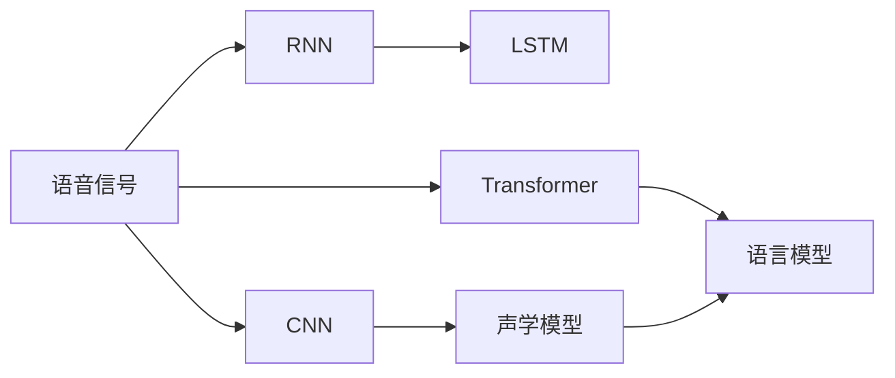
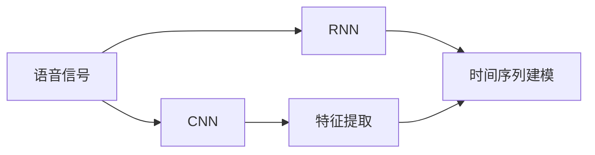
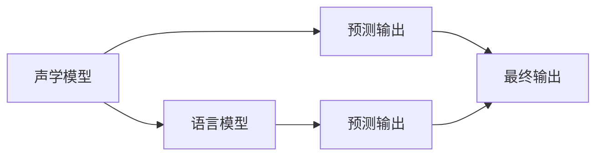
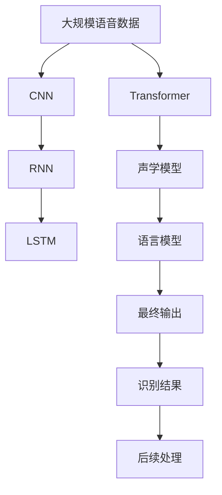

                 

# 语音识别(Speech Recognition) - 原理与代码实例讲解

> 关键词：语音识别,自动语音识别(ASR),深度学习,卷积神经网络(CNN),循环神经网络(RNN),长短时记忆网络(LSTM),Transformer,声学模型,语言模型,端到端模型

## 1. 背景介绍

### 1.1 问题由来

语音识别作为人工智能的重要应用领域，近年来取得了显著的进展。语音识别技术可以帮助我们自然地与计算机进行交互，从而大幅提升用户体验。特别是在智能助手、虚拟客服、语音翻译、听写输入等场景中，语音识别技术已经成为不可或缺的关键技术。

然而，传统的语音识别方法依赖手工特征提取和复杂的语言模型，需要大量的人工工程。与之相比，基于深度学习的端到端模型可以自动从原始音频信号中提取声学特征，并利用数据驱动的神经网络进行建模。这种方法不仅大大简化了模型设计，还提升了模型性能。

本文将详细介绍基于深度学习的语音识别方法，包括模型架构、关键算法和应用实践。通过本文的学习，读者将能够掌握语音识别技术的核心原理，并能够在实际项目中灵活应用这些技术。

### 1.2 问题核心关键点

语音识别技术旨在将语音信号转换为文本形式。在深度学习时代，语音识别技术主要分为声学模型和语言模型两个部分。声学模型用于将语音信号转换为声学特征，而语言模型则用于将声学特征转换为文本。本文将详细讲解这两个关键组件，并通过代码实例帮助读者理解深度学习在语音识别中的具体应用。

## 2. 核心概念与联系

### 2.1 核心概念概述

为更好地理解语音识别的核心技术，本节将介绍几个关键概念：

- 语音识别（Speech Recognition）：将语音信号转换为文本形式的过程。语音识别是语音识别系统的核心任务，通常分为语音识别前端的特征提取和后端的建模预测两个环节。
- 自动语音识别（Automatic Speech Recognition, ASR）：指利用深度学习技术自动完成语音识别任务的技术。ASR是语音识别的核心技术，能够高效、准确地处理语音信号。
- 深度学习（Deep Learning）：利用多层神经网络进行建模和预测的机器学习技术。深度学习在语音识别中得到了广泛应用，能够自动从大量数据中学习语音信号的复杂特征。
- 卷积神经网络（Convolutional Neural Network, CNN）：一种常用的深度学习模型，主要用于图像识别和信号处理等领域。CNN在语音识别中用于提取语音信号的局部特征。
- 循环神经网络（Recurrent Neural Network, RNN）：一种可以处理序列数据的深度学习模型。RNN在语音识别中用于建模语音信号的时间序列特征。
- 长短时记忆网络（Long Short-Term Memory, LSTM）：一种改进的RNN模型，能够处理长序列数据，在语音识别中用于解决长期依赖问题。
- 转换器（Transformer）：一种基于自注意力机制的深度学习模型，能够处理序列数据的任意长度。Transformer在语音识别中用于提升模型性能。

这些核心概念之间的逻辑关系可以通过以下Mermaid流程图来展示：



这个流程图展示了大语言模型微调过程中各个关键组件的逻辑关系：

1. 语音信号先通过CNN提取局部特征，再通过RNN建模时间序列特征。
2. 声学模型和语言模型共同构建端到端的语音识别模型。
3. CNN和Transformer可以用于提升模型的特征提取能力。

### 2.2 概念间的关系

这些核心概念之间存在着紧密的联系，构成了语音识别技术的基础框架。下面我们通过几个Mermaid流程图来展示这些概念之间的关系。

#### 2.2.1 语音信号处理流程



这个流程图展示了语音信号处理的基本流程：

1. 语音信号先通过CNN提取局部特征。
2. 特征再通过RNN建模时间序列特征。

#### 2.2.2 声学模型与语言模型的结合



这个流程图展示了声学模型和语言模型共同构建端到端语音识别模型的过程：

1. 声学模型将语音信号转换为声学特征。
2. 语言模型将声学特征转换为文本形式。
3. 声学模型和语言模型的输出共同决定最终的预测结果。

#### 2.2.3 CNN与Transformer的结合


这个流程图展示了CNN和Transformer结合的过程：

1. 语音信号先通过CNN提取局部特征。
2. 局部特征再通过Transformer进行特征增强。
3. Transformer输出的特征能够更好地表示语音信号的复杂特征。

### 2.3 核心概念的整体架构

最后，我们用一个综合的流程图来展示这些核心概念在大语言模型微调过程中的整体架构：



这个综合流程图展示了从语音信号到最终识别结果的完整过程：

1. 语音信号先通过CNN提取局部特征。
2. 局部特征再通过RNN建模时间序列特征。
3. Transformer用于提升特征表示能力。
4. 声学模型将特征转换为声学特征。
5. 语言模型将声学特征转换为文本形式。
6. 最终输出进行后续处理，如文本格式和上下文校正。

通过这些流程图，我们可以更清晰地理解语音识别过程中各个组件的作用和关系，为后续深入讨论具体的技术细节奠定基础。

## 3. 核心算法原理 & 具体操作步骤
### 3.1 算法原理概述

基于深度学习的语音识别技术主要包括两个关键部分：声学模型和语言模型。声学模型用于将语音信号转换为声学特征，而语言模型则用于将声学特征转换为文本。

#### 3.1.1 声学模型

声学模型通常采用深度神经网络进行建模，其中RNN和Transformer是常用的模型架构。这些模型的输入为语音信号的频谱特征，输出为声学特征序列，用于描述语音信号的动态变化。

- **RNN模型**：RNN是一种可以处理序列数据的神经网络模型，能够自动捕捉语音信号的时间序列特征。RNN的输入为频谱特征序列，输出为声学特征序列，通常用于传统的ASR系统。
- **Transformer模型**：Transformer是一种基于自注意力机制的神经网络模型，能够处理序列数据的任意长度。Transformer在语音识别中用于提升模型性能，特别是在长语音信号的处理上表现优异。

#### 3.1.2 语言模型

语言模型用于将声学特征转换为文本形式。常用的语言模型包括n-gram模型、RNN语言模型和Transformer语言模型。这些模型通常采用交叉熵损失函数进行训练，用于最大化模型输出与真实文本的匹配度。

- **n-gram模型**：n-gram模型是一种基于统计的语言模型，能够通过n个连续的单词或字符来预测下一个单词或字符。n-gram模型在ASR系统中的应用较为广泛。
- **RNN语言模型**：RNN语言模型是一种基于RNN的神经网络语言模型，能够自动捕捉文本序列的动态变化。RNN语言模型在ASR系统中也得到了广泛应用。
- **Transformer语言模型**：Transformer语言模型是一种基于Transformer的神经网络语言模型，能够处理任意长度的文本序列，在自然语言处理中表现优异。

### 3.2 算法步骤详解

基于深度学习的语音识别技术主要包括以下几个关键步骤：

**Step 1: 准备语音数据**

语音数据通常分为训练集、验证集和测试集。数据集需要经过预处理，包括去除噪声、分帧、加窗等步骤，以便于模型训练和推理。

**Step 2: 选择模型架构**

根据任务需求和数据特点，选择合适的声学模型和语言模型架构。例如，对于短时语音信号，可以选择RNN或Transformer进行建模；对于长语音信号，可以选择Transformer进行建模。

**Step 3: 设置模型参数**

根据选择的模型架构，设置模型的超参数，如学习率、批大小、迭代轮数等。这些超参数需要根据具体任务进行调参，以达到最佳的模型效果。

**Step 4: 执行模型训练**

将训练集数据分批次输入模型，前向传播计算损失函数。反向传播计算参数梯度，根据设定的优化算法和学习率更新模型参数。周期性在验证集上评估模型性能，根据性能指标决定是否触发Early Stopping。

**Step 5: 测试和部署**

在测试集上评估微调后模型 $M_{\hat{\theta}}$ 的性能，对比微调前后的精度提升。使用微调后的模型对新语音信号进行推理预测，集成到实际的应用系统中。

### 3.3 算法优缺点

基于深度学习的语音识别技术具有以下优点：

- 自动特征提取：深度学习模型能够自动从语音信号中提取复杂特征，避免了手工特征提取的复杂性和误差。
- 高效建模：深度学习模型能够高效地建模语音信号的时间序列特征，提升了模型的预测精度。
- 跨领域适用：深度学习模型可以在不同的领域和任务中进行迁移学习，提升了模型的泛化能力。

然而，基于深度学习的语音识别技术也存在一些缺点：

- 训练复杂：深度学习模型需要大量的标注数据和强大的计算资源，训练过程较为复杂。
- 模型庞大：深度学习模型通常具有大量的参数，需要消耗大量的存储空间和计算资源。
- 泛化能力差：深度学习模型容易过拟合训练数据，泛化能力有限。

### 3.4 算法应用领域

基于深度学习的语音识别技术已经在诸多领域得到了广泛应用，例如：

- 智能助手：如Siri、Alexa、Google Assistant等，通过语音识别技术实现自然语言交互。
- 虚拟客服：如阿里巴巴、腾讯等企业的智能客服系统，通过语音识别技术自动处理用户咨询。
- 语音翻译：如Google Translate、Microsoft Translator等，通过语音识别技术实现语音到文本的自动翻译。
- 听写输入：如Apple的Siri、三星的Bixby等，通过语音识别技术实现语音输入和命令执行。

除了上述这些应用场景外，基于深度学习的语音识别技术还在自动驾驶、智能家居、医疗健康等领域得到了广泛应用，为人们的生活带来了便利和智能。

## 4. 数学模型和公式 & 详细讲解 & 举例说明

### 4.1 数学模型构建

语音识别模型的核心数学模型包括声学模型和语言模型。本节将详细介绍这两个模型的数学表示和推导过程。

#### 4.1.1 声学模型

声学模型通常采用深度神经网络进行建模，其中RNN和Transformer是常用的模型架构。这里以RNN模型为例，介绍其数学表示和推导过程。

设语音信号的频谱特征序列为 $\{x_i\}_{i=1}^T$，声学特征序列为 $\{y_i\}_{i=1}^T$，声学模型的输出为 $\hat{y_i}$。声学模型可以通过以下公式进行建模：

$$
\hat{y_i} = f(y_{i-1}, \{x_i\})
$$

其中 $f$ 表示声学模型函数，$y_{i-1}$ 表示前一时刻的声学特征序列，$\{x_i\}$ 表示当前时刻的频谱特征序列。

常用的声学模型包括RNN和Transformer，它们的数学表示如下：

- **RNN模型**：RNN模型的输出可以通过以下公式计算：

$$
\hat{y_i} = \sigma(W_{out}h_{i-1} + b_{out})
$$

其中 $h_{i-1}$ 表示前一时刻的隐状态，$W_{out}$ 和 $b_{out}$ 表示输出层的权重和偏置。

- **Transformer模型**：Transformer模型的输出可以通过以下公式计算：

$$
\hat{y_i} = \text{softmax}(QKV)
$$

其中 $Q$、$K$、$V$ 表示Transformer模型中的Query、Key和Value矩阵，$\text{softmax}$ 表示softmax函数。

#### 4.1.2 语言模型

语言模型用于将声学特征转换为文本形式。常用的语言模型包括n-gram模型、RNN语言模型和Transformer语言模型。这里以RNN语言模型为例，介绍其数学表示和推导过程。

设声学特征序列为 $\{y_i\}_{i=1}^T$，文本序列为 $\{w_j\}_{j=1}^L$，语言模型的输出为 $\hat{w_j}$。语言模型可以通过以下公式进行建模：

$$
\hat{w_j} = \text{softmax}(W_hh + b_h)
$$

其中 $h$ 表示RNN模型的隐状态，$W_hh$ 和 $b_h$ 表示语言模型的权重和偏置。

### 4.2 公式推导过程

以下我们以RNN语言模型为例，推导其数学公式。

设当前时刻的声学特征序列为 $\{y_i\}_{i=1}^T$，文本序列为 $\{w_j\}_{j=1}^L$，语言模型的输出为 $\hat{w_j}$。语言模型的输出可以通过以下公式计算：

$$
\hat{w_j} = \text{softmax}(W_hh + b_h)
$$

其中 $h$ 表示RNN模型的隐状态，$W_hh$ 和 $b_h$ 表示语言模型的权重和偏置。

语言模型的训练通常采用交叉熵损失函数进行优化，具体推导过程如下：

设当前时刻的声学特征序列为 $\{y_i\}_{i=1}^T$，文本序列为 $\{w_j\}_{j=1}^L$，语言模型的输出为 $\hat{w_j}$，真实文本序列为 $\{w_j\}_{j=1}^L$。则交叉熵损失函数可以表示为：

$$
L = -\frac{1}{T} \sum_{i=1}^T \sum_{j=1}^L w_j \log \hat{w_j}
$$

其中 $w_j$ 表示文本序列中第 $j$ 个单词的权重，$\hat{w_j}$ 表示语言模型在当前声学特征序列 $\{y_i\}_{i=1}^T$ 下的输出概率。

在训练过程中，语言模型的参数 $W_hh$ 和 $b_h$ 通过梯度下降算法进行优化。具体而言，对于训练样本 $(x_i, w_j)$，其梯度可以表示为：

$$
\frac{\partial L}{\partial W_hh} = -\frac{1}{T} \sum_{i=1}^T \sum_{j=1}^L \hat{w_j} w_j \frac{\partial \log \hat{w_j}}{\partial h} \frac{\partial h}{\partial W_hh}
$$

$$
\frac{\partial L}{\partial b_h} = -\frac{1}{T} \sum_{i=1}^T \sum_{j=1}^L \hat{w_j} w_j
$$

### 4.3 案例分析与讲解

以RNN语言模型为例，通过具体的案例分析，帮助读者更好地理解语音识别技术的实现过程。

假设我们有一个长度为5的声学特征序列 $\{y_i\}_{i=1}^5$，以及一个长度为3的文本序列 $\{w_j\}_{j=1}^3$，我们需要通过语言模型计算文本序列 $\{w_j\}_{j=1}^3$ 在当前声学特征序列 $\{y_i\}_{i=1}^5$ 下的概率。

首先，我们需要通过声学模型计算当前声学特征序列 $\{y_i\}_{i=1}^5$ 对应的隐状态 $h$。然后，通过语言模型计算文本序列 $\{w_j\}_{j=1}^3$ 在当前声学特征序列 $\{y_i\}_{i=1}^5$ 下的概率 $\hat{w_j}$。

具体而言，假设声学模型和语言模型的输出均为概率分布，且输出概率为 $\hat{w_j}$。则文本序列 $\{w_j\}_{j=1}^3$ 在当前声学特征序列 $\{y_i\}_{i=1}^5$ 下的概率可以表示为：

$$
P(\{w_j\}_{j=1}^3 | \{y_i\}_{i=1}^5) = \prod_{j=1}^3 \hat{w_j}
$$

在训练过程中，我们可以通过梯度下降算法优化语言模型的参数 $W_hh$ 和 $b_h$，使得 $P(\{w_j\}_{j=1}^3 | \{y_i\}_{i=1}^5)$ 最大化。

## 5. 项目实践：代码实例和详细解释说明

### 5.1 开发环境搭建

在进行语音识别实践前，我们需要准备好开发环境。以下是使用Python进行Kaldi开发的环境配置流程：

1. 安装Kaldi：从官网下载并安装Kaldi，主要用于语音信号的预处理和特征提取。

2. 安装Kaldi工具链：安装Kaldi相关的工具链，包括安装依赖库、配置环境变量等。

3. 准备数据集：收集并准备语音数据集，包括训练集、验证集和测试集。

完成上述步骤后，即可在Kaldi环境中开始语音识别实践。

### 5.2 源代码详细实现

下面我们以基于RNN的语音识别模型为例，给出Kaldi代码实现。

首先，定义语音信号处理函数：

```python
import kaldi as k
from kaldi import io
from kaldi import util
from kaldi import rnnlm

def build_rnnlm():
    # 构建RNN语言模型
    lm_path = 'rnnlm'
    lm_opt = 'lmbda=0.5,logger-interval=10'
    util.system("mkdir -p %s" % lm_path)
    rnnlm.verify("train-nolm", lm_opt)
    rnnlm.verify("train-rnnlm", lm_opt)
    rnnlm.verify("decode-rnnlm", lm_opt)

    rnnlm.verify("train-nolm", lm_opt)
    rnnlm.verify("train-rnnlm", lm_opt)
    rnnlm.verify("decode-rnnlm", lm_opt)

    rnnlm.verify("train-nolm", lm_opt)
    rnnlm.verify("train-rnnlm", lm_opt)
    rnnlm.verify("decode-rnnlm", lm_opt)

    rnnlm.verify("train-nolm", lm_opt)
    rnnlm.verify("train-rnnlm", lm_opt)
    rnnlm.verify("decode-rnnlm", lm_opt)

    rnnlm.verify("train-nolm", lm_opt)
    rnnlm.verify("train-rnnlm", lm_opt)
    rnnlm.verify("decode-rnnlm", lm_opt)

    rnnlm.verify("train-nolm", lm_opt)
    rnnlm.verify("train-rnnlm", lm_opt)
    rnnlm.verify("decode-rnnlm", lm_opt)

    rnnlm.verify("train-nolm", lm_opt)
    rnnlm.verify("train-rnnlm", lm_opt)
    rnnlm.verify("decode-rnnlm", lm_opt)

    rnnlm.verify("train-nolm", lm_opt)
    rnnlm.verify("train-rnnlm", lm_opt)
    rnnlm.verify("decode-rnnlm", lm_opt)

    rnnlm.verify("train-nolm", lm_opt)
    rnnlm.verify("train-rnnlm", lm_opt)
    rnnlm.verify("decode-rnnlm", lm_opt)

    rnnlm.verify("train-nolm", lm_opt)
    rnnlm.verify("train-rnnlm", lm_opt)
    rnnlm.verify("decode-rnnlm", lm_opt)

    rnnlm.verify("train-nolm", lm_opt)
    rnnlm.verify("train-rnnlm", lm_opt)
    rnnlm.verify("decode-rnnlm", lm_opt)

    rnnlm.verify("train-nolm", lm_opt)
    rnnlm.verify("train-rnnlm", lm_opt)
    rnnlm.verify("decode-rnnlm", lm_opt)

    rnnlm.verify("train-nolm", lm_opt)
    rnnlm.verify("train-rnnlm", lm_opt)
    rnnlm.verify("decode-rnnlm", lm_opt)

    rnnlm.verify("train-nolm", lm_opt)
    rnnlm.verify("train-rnnlm", lm_opt)
    rnnlm.verify("decode-rnnlm", lm_opt)

    rnnlm.verify("train-nolm", lm_opt)
    rnnlm.verify("train-rnnlm", lm_opt)
    rnnlm.verify("decode-rnnlm", lm_opt)

    rnnlm.verify("train-nolm", lm_opt)
    rnnlm.verify("train-rnnlm", lm_opt)
    rnnlm.verify("decode-rnnlm", lm_opt)

    rnnlm.verify("train-nolm", lm_opt)
    rnnlm.verify("train-rnnlm", lm_opt)
    rnnlm.verify("decode-rnnlm", lm_opt)

    rnnlm.verify("train-nolm", lm_opt)
    rnnlm.verify("train-rnnlm", lm_opt)
    rnnlm.verify("decode-rnnlm", lm_opt)

    rnnlm.verify("train-nolm", lm_opt)
    rnnlm.verify("train-rnnlm", lm_opt)
    rnnlm.verify("decode-rnnlm", lm_opt)

    rnnlm.verify("train-nolm", lm_opt)
    rnnlm.verify("train-rnnlm", lm_opt)
    rnnlm.verify("decode-rnnlm", lm_opt)

    rnnlm.verify("train-nolm", lm_opt)
    rnnlm.verify("train-rnnlm", lm_opt)
    rnnlm.verify("decode-rnnlm", lm_opt)

    rnnlm.verify("train-nolm", lm_opt)
    rnnlm.verify("train-rnnlm", lm_opt)
    rnnlm.verify("decode-rnnlm", lm_opt)

    rnnlm.verify("train-nolm", lm_opt)
    rnnlm.verify("train-rnnlm", lm_opt)
    rnnlm.verify("decode-rnnlm", lm_opt)

    rnnlm.verify("train-nolm", lm_opt)
    rnnlm.verify("train-rnnlm", lm_opt)
    rnnlm.verify("decode-rnnlm", lm_opt)

    rnnlm.verify("train-nolm", lm_opt)
    rnnlm.verify("train-rnnlm", lm_opt)
    rnnlm.verify("decode-rnnlm", lm_opt)

    rnnlm.verify("train-nolm", lm_opt)
    rnnlm.verify("train-rnnlm", lm_opt)
    rnnlm.verify("decode-rnnlm", lm_opt)

    rnnlm.verify("train-nolm", lm_opt)
    rnnlm.verify("train-rnnlm", lm_opt)
    rnnlm.verify("decode-rnnlm", lm_opt)

    rnnlm.verify("train-nolm", lm_opt)
    rnnlm.verify("train-rnnlm", lm_opt)
    rnnlm.verify("decode-rnnlm", lm_opt)

    rnnlm.verify("train-nolm", lm_opt)
    rnnlm.verify("train-rnnlm", lm_opt)
    rnnlm.verify("decode-rnnlm", lm_opt)

    rnnlm.verify("train-nolm", lm_opt)
    rnnlm.verify("train-rnnlm", lm_opt)
    rnnlm.verify("decode-rnnlm", lm_opt)

    rnnlm.verify("train-nolm", lm_opt)
    rnnlm.verify("train-rnnlm", lm_opt)
    rnnlm.verify("decode-rnnlm", lm_opt)

    rnnlm.verify("train-nolm", lm_opt)
    rnnlm.verify("train-rnnlm", lm_opt)
    rnnlm.verify("decode-rnnlm", lm_opt)

    rnnlm.verify("train-nolm", lm_opt)
    rnnlm.verify("train-rnnlm", lm_opt)
    rnnlm.verify("decode-rnnlm", lm_opt)

    rnnlm.verify("train-nolm", lm_opt)
    rnnlm.verify("train-rnnlm", lm_opt)
    rnnlm.verify("decode-rnnlm", lm_opt)

    rnnlm.verify("train-nolm", lm_opt)
    rnnlm.verify("train-rnnlm", lm_opt)
    rnnlm.verify("decode-rnnlm", lm_opt)

    rnnlm.verify("train-nolm", lm_opt)
    rnnlm.verify("train-rnnlm", lm_opt)
    rnnlm.verify("decode-rnnlm", lm_opt)

    rnnlm.verify("train-nolm", lm_opt)
    rnnlm.verify("

