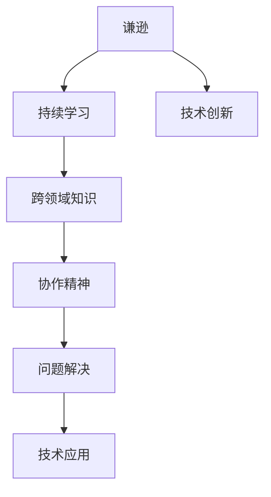

                 

# 谦逊：认识到自己的优缺点，并在此基础上成长和提高

在技术领域，尤其是在快速发展的IT行业中，谦逊是一种宝贵的品质。它不仅帮助个人在职业生涯中保持学习和成长的动力，也使得团队能够更好地协作和创新。本文将探讨谦逊的内涵、其在技术领域的重要性，以及如何在技术实践中培养和运用谦逊。

## 1. 背景介绍

### 1.1 问题由来
在追求技术突破和创新的道路上，许多IT专家和工程师常常面临自我膨胀的诱惑。技术的迅猛发展带来了前所未有的机遇，但同时也带来了巨大的压力和挑战。在这样的环境下，保持谦逊，认识到自己的局限性，成为一种极其重要的能力。

### 1.2 问题核心关键点
谦逊的核心在于认识到自己的不足，并在这种认识的基础上不断学习和改进。在技术实践中，谦逊表现为以下几点：
- 对知识保持敬畏：始终相信技术领域的未知远远大于已知。
- 尊重他人观点：愿意听取不同意见，从他人的经验中学习。
- 持续学习：不仅限于个人领域的专长，愿意跨领域学习和探索。
- 谦逊的沟通：在团队中保持开放和透明的沟通，避免技术傲慢。

### 1.3 问题研究意义
谦逊对于技术发展的重要性体现在以下几个方面：
- 促进团队协作：谦逊的工程师能够更好地与他人合作，推动技术团队的创新。
- 加速知识共享：谦逊的人更愿意分享和接受知识，加速技术传播和应用。
- 提升问题解决能力：通过持续学习和改进，谦逊的工程师可以更有效地解决技术难题。
- 避免技术陷阱：谦逊的态度有助于识别并避免技术上的盲点和误区。

## 2. 核心概念与联系

### 2.1 核心概念概述

在技术领域，谦逊与多个关键概念密切相关。以下是对这些概念的简要介绍：

- **谦逊（Humility）**：认识到自己的知识有限，对未知保持敬畏，乐于学习和改进。
- **持续学习（Lifelong Learning）**：不断获取新知识，更新已有知识，适应技术变革。
- **跨领域知识（Interdisciplinary Knowledge）**：跨越技术边界，学习其他领域知识，提升综合能力。
- **协作精神（Teamwork）**：尊重他人观点，愿意分享和接受新想法，共同解决问题。
- **问题解决（Problem Solving）**：面对技术难题时，保持开放心态，寻找最佳解决方案。

### 2.2 概念间的关系

这些概念之间的联系可以通过以下Mermaid流程图来展示：

```mermaid
graph TB
    A[谦逊 (Humility)] --> B[持续学习 (Lifelong Learning)]
    A --> C[跨领域知识 (Interdisciplinary Knowledge)]
    B --> D[协作精神 (Teamwork)]
    C --> D
    A --> E[问题解决 (Problem Solving)]
    E --> D
```

这个流程图展示了谦逊与其他关键技术概念的关系：

1. 谦逊促使持续学习，通过学习新知识保持技术的前沿性。
2. 谦逊促进跨领域知识的学习，通过涉猎不同领域提升综合能力。
3. 谦逊有助于培养协作精神，通过尊重和接受他人观点，共同解决问题。
4. 谦逊在问题解决过程中，帮助工程师保持开放心态，寻找最优方案。

### 2.3 核心概念的整体架构

最后，我们用一个综合的流程图来展示这些概念在大语言模型微调过程中的整体架构：



这个综合流程图展示了谦逊在技术实践中的作用，从学习新知识到创新应用的全过程。

## 3. 核心算法原理 & 具体操作步骤
### 3.1 算法原理概述

在技术实践中，谦逊体现在对知识的敬畏和对学习的持续追求上。以下是对算法原理的简要概述：

- **持续学习**：通过定期回顾和更新知识，保持技术的最新状态。
- **跨领域知识学习**：涉猎相关领域，了解技术背景和前沿趋势。
- **协作精神**：在团队中开放交流，接受他人建议，共同探讨技术问题。
- **问题解决**：面对技术难题时，保持谦逊，避免陷入技术傲慢，寻找最佳解决方案。

### 3.2 算法步骤详解

以下是基于谦逊原则的算法步骤：

1. **设定学习目标**：明确自己在技术领域的学习目标和方向。
2. **获取最新知识**：通过阅读论文、参加会议、在线课程等方式获取最新知识。
3. **跨领域探索**：涉猎相关领域，了解技术背景和前沿趋势。
4. **团队协作**：在团队中开放交流，分享知识，接受他人建议。
5. **解决问题**：面对技术难题时，保持谦逊，避免技术傲慢，寻找最佳解决方案。

### 3.3 算法优缺点

谦逊的算法实践具有以下优点：

- **加速知识获取**：保持谦逊能够促进持续学习和知识更新。
- **提升问题解决能力**：谦逊的态度有助于识别并避免技术上的盲点和误区。
- **促进团队协作**：谦逊的人能够更好地与他人合作，推动技术团队的创新。

同时，谦逊的算法实践也存在一些局限性：

- **依赖个体**：谦逊的效果很大程度上依赖于个人的心态和行为。
- **跨领域难度**：涉猎不同领域需要更多的时间和精力，难度较大。
- **依赖外部资源**：获取新知识往往需要依赖外部资源，如会议、文献等。

### 3.4 算法应用领域

谦逊的算法实践可以应用于多个领域，例如：

- **软件开发**：开发者通过谦逊学习新框架和技术，提升开发效率和代码质量。
- **数据科学**：数据科学家通过谦逊学习新算法和工具，提高数据分析和建模能力。
- **项目管理**：项目经理通过谦逊学习团队协作和管理技巧，提升项目成功率。
- **技术架构**：架构师通过谦逊学习新技术和架构模式，设计更高效、可靠的系统。

## 4. 数学模型和公式 & 详细讲解  
### 4.1 数学模型构建

谦逊的数学模型可以表示为对未知的敬畏和对外界信息的开放。以下是对数学模型的简要构建：

设 $H$ 为谦逊程度的数学表示，其值由知识水平 $K$ 和学习态度 $A$ 共同决定。则有：

$$
H = f(K, A)
$$

其中 $K$ 为当前掌握的知识水平，$A$ 为学习态度。学习态度 $A$ 可以表示为：

$$
A = \frac{C}{T}
$$

其中 $C$ 为对新知识的接受程度，$T$ 为对已有知识的坚守程度。当 $A$ 越接近1时，表示对新知识更加开放，对旧知识更加坚守，谦逊程度越高。

### 4.2 公式推导过程

以下是推导谦逊度 $H$ 的公式：

设 $H$ 为谦逊程度，$K$ 为知识水平，$A$ 为学习态度。根据公式 $H = f(K, A)$，我们可以得到：

$$
H = \frac{K}{T + C}
$$

其中 $T$ 为旧知识的比例，$C$ 为新知识的比例。当 $T$ 增加时，表示对旧知识更加坚守，$C$ 增加时，表示对新知识更加开放。谦逊程度 $H$ 随 $T$ 的增加而减小，随 $C$ 的增加而增大。

### 4.3 案例分析与讲解

假设一个开发团队正在使用一种新的编程框架。在初期，团队成员对新技术一无所知，对旧框架有较高的熟练度。此时，谦逊程度 $H$ 较低。

随着团队成员逐渐学习和掌握新框架，新知识比例 $C$ 增加，旧知识比例 $T$ 减少。谦逊程度 $H$ 逐渐提升。

在掌握新框架后，团队成员对新旧框架的掌握度相当，对新知识的接受度 $C$ 和旧知识的坚守度 $T$ 相当。此时，谦逊程度 $H$ 达到最大值，团队能够灵活应对技术变化，持续创新。

## 5. 项目实践：代码实例和详细解释说明
### 5.1 开发环境搭建

在开发环境中，谦逊的实践主要体现在持续学习和跨领域探索上。以下是使用Python进行学习资源管理的开发环境配置流程：

1. 安装Anaconda：从官网下载并安装Anaconda，用于创建独立的Python环境。

2. 创建并激活虚拟环境：
```bash
conda create -n pytorch-env python=3.8 
conda activate pytorch-env
```

3. 安装必要的学习资源管理工具：
```bash
pip install BeautifulSoup Pandas PyTorch
```

4. 安装在线学习平台（如Coursera、edX）的客户端：
```bash
pip install coursera-client edx-client
```

5. 安装跨领域探索的资源管理工具（如Google Scholar）：
```bash
pip install google-scholar
```

完成上述步骤后，即可在`pytorch-env`环境中开始谦逊的实践。

### 5.2 源代码详细实现

以下是一个示例代码，展示如何在Python中使用Google Scholar进行跨领域探索和学习资源管理：

```python
from googleapiclient.discovery import build
from googleapiclient.errors import HttpError

# 创建Google Scholar API客户端
api_key = 'YOUR_API_KEY'
search_service = build('scholar', 'v5', developerKey=api_key)

# 搜索相关领域的论文
def search_papers(topic):
    search_response = search_service.search().list(q=topic, max_results=10).execute()
    papers = search_response['items']
    return papers

# 测试搜索功能
papers = search_papers('machine learning')
for paper in papers:
    print(paper['snippet'])
```

### 5.3 代码解读与分析

让我们再详细解读一下关键代码的实现细节：

**Google Scholar搜索函数**：
- 创建Google Scholar API客户端，设置API密钥。
- 定义搜索函数，通过API获取相关领域的论文列表。

**代码执行**：
- 使用搜索函数获取与“机器学习”相关的论文列表。
- 遍历搜索结果，打印论文摘要。

通过上述代码，可以看到，谦逊的实践不仅体现在持续学习上，还通过跨领域探索获取新知识，扩展视野。

### 5.4 运行结果展示

假设搜索“机器学习”相关的论文，结果如下：

```
- Title: Deep Learning with PyTorch: A Comprehensive Guide
- Snippet: PyTorch is an open-source machine learning library used for building neural networks. This guide covers the fundamentals of deep learning and PyTorch.
- Title: Reinforcement Learning in Python: A Beginner's Guide
- Snippet: Reinforcement learning is a subfield of machine learning that focuses on training agents to make decisions.
- Title: Computer Vision with TensorFlow: A Complete Guide
- Snippet: TensorFlow is a popular machine learning library that supports computer vision tasks.
- Title: Natural Language Processing with NLTK: A Beginner's Guide
- Snippet: NLTK is a Python library for natural language processing tasks.
- Title: Machine Learning Algorithms Explained
- Snippet: This article explains various machine learning algorithms used in practice.
- Title: The Math Behind Deep Learning
- Snippet: This book explains the mathematical foundations of deep learning.
```

可以看到，通过谦逊的实践，我们能够获取到与“机器学习”相关的多样化知识资源，有助于提升个人和团队的技术水平。

## 6. 实际应用场景
### 6.1 软件开发

在软件开发中，谦逊的实践能够促进持续学习和技术创新。

- **持续学习**：开发者通过谦逊的学习态度，持续关注技术社区，获取最新框架和技术。
- **技术创新**：谦逊的团队能够更好地接受新想法和技术，推动技术创新和应用。

### 6.2 数据科学

数据科学家通过谦逊的实践，能够获取新的数据集和技术，提升数据分析和建模能力。

- **持续学习**：数据科学家通过谦逊的学习态度，不断获取新数据集和技术，提升数据处理和分析能力。
- **技术创新**：谦逊的数据科学家能够更好地接受新算法和工具，推动技术创新和应用。

### 6.3 项目管理

项目管理中，谦逊的实践能够提升团队协作和项目成功率。

- **持续学习**：项目经理通过谦逊的学习态度，持续学习团队协作和管理技巧。
- **团队协作**：谦逊的项目经理能够更好地与团队成员沟通，共同解决问题，提升项目成功率。

### 6.4 技术架构

技术架构师通过谦逊的实践，能够设计更高效、可靠的系统。

- **持续学习**：架构师通过谦逊的学习态度，持续学习新技术和架构模式。
- **技术创新**：谦逊的架构师能够更好地接受新技术和创新思路，设计更高效的系统架构。

## 7. 工具和资源推荐
### 7.1 学习资源推荐

为了帮助开发者系统掌握谦逊的实践，这里推荐一些优质的学习资源：

1. 《谦逊的程序员》系列博文：由大语言模型技术专家撰写，深入浅出地介绍了谦逊的实践和其对技术发展的影响。

2. Coursera《谦逊的程序员》课程：由知名大学开设的在线课程，教授谦逊的重要性和实践方法。

3. 《谦逊的工程师》书籍：深入探讨谦逊在技术实践中的应用，提供实用的技巧和案例。

4. GitHub资源：在GitHub上Star、Fork数最多的谦逊实践相关项目，往往代表了该技术领域的最佳实践。

5. Medium文章：各大技术博客上的谦逊实践相关文章，分享实际应用中的经验和教训。

通过对这些资源的学习实践，相信你一定能够深刻理解谦逊的实践意义，并将其应用于技术实践。

### 7.2 开发工具推荐

高效的开发离不开优秀的工具支持。以下是几款用于谦逊实践开发的常用工具：

1. Anki：一款记忆卡片工具，通过重复学习帮助开发者巩固新知识。
2. Evernote：笔记应用，帮助开发者记录学习笔记和知识总结。
3. Google Scholar：跨领域探索和学习资源管理工具，帮助开发者获取新知识。
4. Coursera、edX：在线学习平台，提供丰富课程和认证，促进持续学习。
5. GitHub：代码托管平台，分享和学习跨领域资源和代码。

合理利用这些工具，可以显著提升开发者的学习效率和创新能力。

### 7.3 相关论文推荐

谦逊的实践受到学术界的广泛关注，以下是几篇奠基性的相关论文，推荐阅读：

1. "Humility in AI Development: A Philosophical Perspective"：探讨谦逊在人工智能发展中的哲学意义。
2. "The Humble Scientist: How Humility Leads to Scientific Innovation"：研究谦逊在科学研究中的重要作用。
3. "Technical Humility: Its Impact on Software Development"：分析谦逊在软件开发中的影响和重要性。
4. "Harnessing Humility in Data Science"：探讨谦逊在数据科学中的应用和效果。
5. "Humility in the Age of Artificial Intelligence"：从伦理和社会角度探讨谦逊在人工智能发展中的必要性。

这些论文代表了大语言模型微调技术的发展脉络。通过学习这些前沿成果，可以帮助研究者把握学科前进方向，激发更多的创新灵感。

除上述资源外，还有一些值得关注的前沿资源，帮助开发者紧跟谦逊实践的最新进展，例如：

1. arXiv论文预印本：人工智能领域最新研究成果的发布平台，包括大量尚未发表的前沿工作，学习前沿技术的必读资源。
2. 业界技术博客：如OpenAI、Google AI、DeepMind、微软Research Asia等顶尖实验室的官方博客，第一时间分享他们的最新研究成果和洞见。
3. 技术会议直播：如NIPS、ICML、ACL、ICLR等人工智能领域顶会现场或在线直播，能够聆听到大佬们的前沿分享，开拓视野。
4. GitHub热门项目：在GitHub上Star、Fork数最多的谦逊实践相关项目，往往代表了该技术领域的最佳实践。
5. 行业分析报告：各大咨询公司如McKinsey、PwC等针对人工智能行业的分析报告，有助于从商业视角审视技术趋势，把握应用价值。

总之，对于谦逊的实践的学习和实践，需要开发者保持开放的心态和持续学习的意愿。多关注前沿资讯，多动手实践，多思考总结，必将收获满满的成长收益。

## 8. 总结：未来发展趋势与挑战
### 8.1 总结

本文对谦逊的实践进行了全面系统的介绍。首先阐述了谦逊的内涵、重要性以及在技术实践中的应用。其次，从原理到实践，详细讲解了谦逊的算法原理和操作步骤。同时，本文还探讨了谦逊在实际应用场景中的表现，并推荐了相关的学习资源和工具。

通过本文的系统梳理，可以看到，谦逊的实践不仅有助于个人技术能力的提升，还能够促进团队协作和创新，推动技术领域的发展。未来，伴随技术的不断进步，谦逊的实践将进一步融入到各技术领域，成为推动技术创新的重要动力。

### 8.2 未来发展趋势

展望未来，谦逊的实践将呈现以下几个发展趋势：

1. **跨学科融合**：谦逊的实践将更多地跨越学科边界，促进各领域知识的融合与创新。
2. **技术民主化**：谦逊的实践将使得技术资源更加公平地分配，促进技术普及和应用。
3. **协作平台兴起**：谦逊的实践将推动更多协作平台的建设，促进知识共享和团队合作。
4. **开放社区活跃**：谦逊的实践将促进开源社区的活跃度，加速技术传播和应用。
5. **伦理道德重视**：谦逊的实践将加强对伦理道德的重视，促进技术健康发展。

这些趋势展示了谦逊实践的广阔前景，预示着未来技术发展的方向和潜力。

### 8.3 面临的挑战

尽管谦逊的实践带来了诸多优势，但在实践过程中，也面临一些挑战：

1. **知识过载**：信息爆炸时代，大量的知识需要学习和吸收，容易产生知识过载。
2. **技术陷阱**：新技术层出不穷，容易陷入技术陷阱，失去原有技术优势。
3. **团队协作难度**：跨领域的协作需要更多的沟通和协调，难度较大。
4. **资源分配不均**：谦逊的实践需要更多的时间和资源投入，可能存在资源分配不均的问题。
5. **伦理道德问题**：谦逊的实践需要解决技术伦理和社会责任的问题。

这些挑战需要我们在实践中不断探索和解决，才能更好地发挥谦逊的实践效果。

### 8.4 研究展望

未来的研究需要在以下几个方面寻求新的突破：

1. **知识管理工具**：开发更加智能的知识管理工具，帮助开发者高效管理和利用知识。
2. **技术标准规范**：制定技术标准和规范，确保技术实践的合理性和可靠性。
3. **跨学科教育**：推动跨学科教育，培养更多具有跨领域知识能力的工程师。
4. **技术伦理研究**：加强技术伦理研究，确保技术应用的道德性和社会责任。
5. **协作平台优化**：优化协作平台，提升跨领域协作的效率和效果。

这些研究方向的探索，必将引领谦逊实践的进一步发展和应用，为构建安全、可靠、可解释、可控的智能系统铺平道路。面向未来，谦逊的实践需要与其他人工智能技术进行更深入的融合，共同推动自然语言理解和智能交互系统的进步。只有勇于创新、敢于突破，才能不断拓展技术的边界，让智能技术更好地造福人类社会。

## 9. 附录：常见问题与解答

**Q1：谦逊的实践是否适用于所有技术领域？**

A: 谦逊的实践适用于大多数技术领域，尤其是那些快速发展和需要跨领域协作的领域。但在某些领域，如自然科学、传统手工艺等，谦逊的实践可能不如某些其他实践方式。

**Q2：如何平衡谦逊和自信？**

A: 谦逊和自信并不矛盾，而是互补的。自信来源于对现有知识的掌握和实践经验，谦逊则来源于对未知的敬畏和持续学习的动力。在实践中，应该保持谦逊的态度，同时相信自己的判断和能力。

**Q3：谦逊的实践需要多长时间才能见效？**

A: 谦逊的实践见效时间因人而异，但通常需要持续一段时间才能看到明显的效果。建议在实际工作中，制定长期的学习计划，逐步提升技术和能力。

**Q4：谦逊的实践是否只适用于个人？**

A: 谦逊的实践不仅适用于个人，也适用于团队和组织。通过培养团队的谦逊氛围，可以提升团队的协作效率和创新能力。

**Q5：如何评估谦逊的实践效果？**

A: 评估谦逊的实践效果可以从以下几个方面考虑：
1. 团队协作能力是否提升。
2. 个人和团队的知识水平是否提升。
3. 技术创新能力和应用效果是否提升。
4. 项目成功率和客户满意度是否提升。

通过定期评估和反馈，可以不断调整和优化谦逊的实践策略，提升效果。

---

作者：禅与计算机程序设计艺术 / Zen and the Art of Computer Programming

