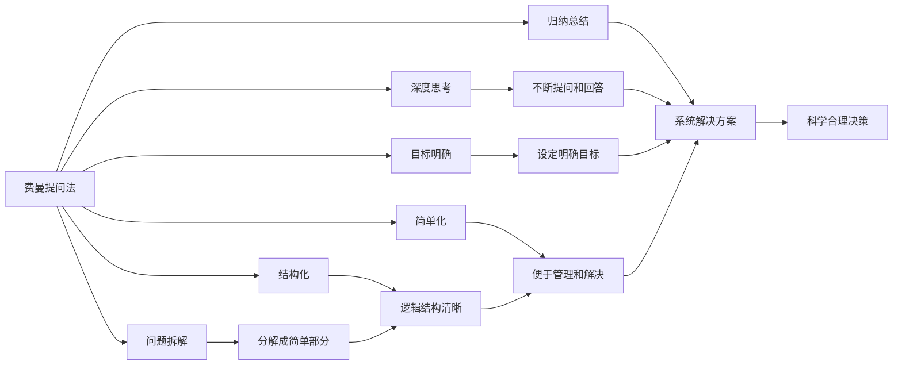

                 

## 1. 背景介绍

### 1.1 问题由来

在企业管理的实践过程中，很多管理者面临着如何在复杂多变的市场环境中做出正确决策的挑战。这种挑战往往来自于信息的复杂性、时间的紧迫性和决策的复杂性。费曼提问法（Feynman Technique）是一种有效的思考工具，它通过逐步深入的问题拆解，帮助管理者系统性地梳理信息、挖掘真相，从而做出更加科学合理的决策。

费曼提问法源自著名物理学家理查德·费曼（Richard Feynman）的学习方法，通过“教别人”来巩固自己的理解。这种方法的核心在于通过提出高质量的问题，引导自己深入思考和深入理解复杂问题的本质。在企业管理中，这种方法同样适用。通过不断提出和回答深刻的问题，管理者能够更好地理解企业的现状、未来以及面临的挑战，从而做出更加明智的决策。

### 1.2 问题核心关键点

费曼提问法的核心在于问题拆解和深度思考。通过反复提问和回答，管理者能够深入理解问题的本质，并不断修正和优化自身的思考路径。这种方法的关键点包括：

1. **目标明确的问题设定**：费曼提问法强调从全局出发，明确问题的核心目标，避免陷入细节泥潭。
2. **递进式的提问**：通过层层深入的问题，逐步揭示问题的本质，避免浅尝辄止。
3. **简单化与结构化**：将复杂问题分解成简单部分，帮助管理者系统化地理解问题。
4. **深度理解与归纳**：通过反复提问和回答，不断深化对问题的理解，并总结出系统的解决方案。

费曼提问法不仅仅是一种思考工具，更是一种系统化的决策方法，它能够帮助管理者全面、深入地理解问题，做出科学合理的决策。

### 1.3 问题研究意义

费曼提问法对企业管理实践具有重要意义，主要体现在以下几个方面：

1. **提升决策质量**：通过系统化的问题拆解和深度思考，管理者能够更好地理解问题，从而做出更加科学合理的决策。
2. **促进团队协作**：费曼提问法鼓励团队成员提出和回答高质量问题，促进团队协作，共同解决问题。
3. **提升学习能力**：通过不断提出和回答问题的过程，管理者能够不断学习新知识，提升自身的能力。
4. **增强创新能力**：系统化的提问过程能够激发思维的创新，帮助企业发现新的机会和解决方案。
5. **促进问题解决**：费曼提问法通过层层深入的问题拆解，能够有效解决复杂的问题，避免陷入僵局。

## 2. 核心概念与联系

### 2.1 核心概念概述

费曼提问法是一种系统的思考和决策方法，其核心概念包括：

- **问题拆解**：将复杂问题拆解为多个简单部分，逐步深入分析。
- **深度思考**：通过反复提问和回答，不断深化对问题的理解。
- **目标明确**：确保问题的设定符合全局目标，避免偏离主旨。
- **结构化**：将问题拆解成逻辑结构清晰的层次，便于理解和分析。
- **简单化**：将复杂问题简化，便于管理和解决。
- **归纳总结**：通过归纳总结，形成系统的解决方案。

费曼提问法与管理的其他概念有紧密的联系，例如：

- **PDCA循环**：费曼提问法的递进式提问过程与PDCA（Plan-Do-Check-Act）循环中的“Plan”和“Check”部分相似，有助于管理者不断调整和优化决策路径。
- **OKR目标管理**：OKR目标管理强调设定明确、可衡量的目标，费曼提问法通过层层深入的问题拆解，帮助设定和实现这些目标。
- **SWOT分析**：费曼提问法的目标明确和结构化过程与SWOT（Strengths-Weaknesses-Opportunities-Threats）分析中的“Opportunities”和“Threats”部分相似，有助于管理者全面分析企业的内外环境。
- **精益管理**：费曼提问法的简单化和结构化过程与精益管理中的“简化”和“标准化”过程相似，有助于管理过程的优化。

这些概念共同构成了费曼提问法在企业管理中的应用框架，帮助管理者系统性地解决问题，做出科学合理的决策。

### 2.2 概念间的关系

费曼提问法与上述概念之间的关系可以通过以下Mermaid流程图来展示：



这个流程图展示了费曼提问法的核心概念及其与其他概念的关系：

1. 费曼提问法通过问题拆解，将复杂问题分解成简单部分，逐步深入分析。
2. 通过深度思考，不断提问和回答，深化对问题的理解。
3. 设定明确目标，确保问题设定符合全局目标。
4. 结构化问题，形成逻辑结构清晰的层次。
5. 简单化问题，便于管理和解决。
6. 归纳总结，形成系统的解决方案，支撑科学合理的决策。

## 3. 核心算法原理 & 具体操作步骤

### 3.1 算法原理概述

费曼提问法的基本原理是通过反复提问和回答，逐步深入理解复杂问题，并最终形成系统化的解决方案。其核心在于通过问题的拆解和分析，帮助管理者全面、深入地理解问题，做出科学合理的决策。

具体而言，费曼提问法的算法原理包括：

1. **问题拆解**：将复杂问题拆解为多个简单部分，逐步深入分析。
2. **深度思考**：通过反复提问和回答，不断深化对问题的理解。
3. **目标明确**：确保问题的设定符合全局目标，避免偏离主旨。
4. **结构化**：将问题拆解成逻辑结构清晰的层次，便于理解和分析。
5. **简单化**：将复杂问题简化，便于管理和解决。
6. **归纳总结**：通过归纳总结，形成系统的解决方案。

### 3.2 算法步骤详解

费曼提问法的具体操作步骤包括以下几个关键步骤：

1. **设定问题**：明确问题的核心目标，设定需要解决的具体问题。
2. **拆解问题**：将复杂问题拆解为多个简单部分，逐步深入分析。
3. **提出问题**：针对每个简单部分，提出高质量的问题，引导深入思考。
4. **回答问题**：通过反复提问和回答，不断深化对问题的理解。
5. **整理归纳**：对问题解答进行整理和归纳，形成系统的解决方案。
6. **执行和反馈**：将解决方案应用到实际问题中，根据反馈不断调整和优化。

### 3.3 算法优缺点

费曼提问法的优点在于：

1. **系统化思考**：通过层层深入的问题拆解，帮助管理者全面、深入地理解问题，避免陷入细节泥潭。
2. **提高决策质量**：通过反复提问和回答，帮助管理者深入理解问题本质，做出科学合理的决策。
3. **促进团队协作**：鼓励团队成员提出和回答高质量问题，促进团队协作，共同解决问题。
4. **提升学习能力**：通过不断提问和回答的过程，管理者能够不断学习新知识，提升自身的能力。

费曼提问法的缺点在于：

1. **时间成本较高**：反复提问和回答的过程可能需要较长的时间，影响效率。
2. **依赖提问质量**：问题设定和拆解的质量直接影响到费曼提问法的有效性。
3. **可能导致过度的简化**：过于简化问题可能导致管理者忽略一些关键细节。
4. **可能陷入细节泥潭**：如果问题拆解得过于细化，可能导致管理者陷入细节泥潭，难以全面理解问题。

### 3.4 算法应用领域

费曼提问法在企业管理中具有广泛的应用场景，主要包括以下几个领域：

1. **战略规划**：通过反复提问和回答，帮助管理者全面理解企业现状和未来趋势，制定科学合理的战略规划。
2. **产品开发**：通过层层深入的问题拆解，帮助团队成员理解产品需求和用户痛点，指导产品设计和开发。
3. **市场分析**：通过反复提问和回答，帮助管理者全面分析市场环境，制定有效的市场策略。
4. **风险管理**：通过反复提问和回答，帮助管理者全面识别和管理企业面临的各种风险。
5. **团队管理**：通过反复提问和回答，帮助管理者理解团队成员的需求和痛点，优化团队管理。
6. **创新管理**：通过反复提问和回答，激发团队的创新思维，发现新的机会和解决方案。

## 4. 数学模型和公式 & 详细讲解 & 举例说明

### 4.1 数学模型构建

费曼提问法的数学模型构建基于以下假设：

- 管理者面临的问题可以拆解为多个简单部分。
- 每个简单部分的问题可以通过高质量的提问和回答来深化理解。
- 问题解答的整理和归纳可以形成系统的解决方案。

假设问题拆解后的简单部分为 $P_i$，提出的问题为 $Q_i$，问题的答案为 $A_i$。则费曼提问法的数学模型可以表示为：

$$
A_i = f(Q_i)
$$

其中，$f$ 表示问题 $Q_i$ 的解答过程，可以通过反复提问和回答逐步形成。

### 4.2 公式推导过程

费曼提问法的核心在于通过反复提问和回答，逐步深化对问题的理解。以下以一个简单的市场分析为例，展示费曼提问法的公式推导过程。

假设管理者面临的问题是“如何提高销售额？”，通过反复提问和回答，可以逐步形成系统的解决方案。

1. **问题设定**：明确问题的核心目标，设定需要解决的具体问题。
2. **拆解问题**：将问题拆解为多个简单部分，逐步深入分析。
3. **提出问题**：针对每个简单部分，提出高质量的问题，引导深入思考。
4. **回答问题**：通过反复提问和回答，不断深化对问题的理解。
5. **整理归纳**：对问题解答进行整理和归纳，形成系统的解决方案。

### 4.3 案例分析与讲解

以一个简单的市场分析为例，展示费曼提问法的具体应用。

假设管理者面临的问题是“如何提高销售额？”，通过反复提问和回答，可以逐步形成系统的解决方案。

1. **问题设定**：明确问题的核心目标，设定需要解决的具体问题。
   - 目标：提高销售额。

2. **拆解问题**：将问题拆解为多个简单部分，逐步深入分析。
   - 市场分析：市场规模、增长趋势、竞争格局等。
   - 产品分析：产品特性、用户需求、产品差异化等。
   - 营销策略：营销渠道、营销方式、客户群体等。
   - 销售策略：销售渠道、销售团队、销售激励等。

3. **提出问题**：针对每个简单部分，提出高质量的问题，引导深入思考。
   - 市场分析：市场规模有多大？增长趋势如何？主要竞争者有哪些？
   - 产品分析：目标用户是谁？他们的需求和痛点是什么？产品有哪些独特之处？
   - 营销策略：主要的营销渠道有哪些？哪种方式最有效？目标客户群体是谁？
   - 销售策略：销售渠道如何分布？销售团队如何激励？客户服务质量如何？

4. **回答问题**：通过反复提问和回答，不断深化对问题的理解。
   - 市场分析：通过数据收集和分析，发现市场规模、增长趋势和主要竞争者。
   - 产品分析：通过用户调研和市场反馈，了解目标用户需求和产品独特之处。
   - 营销策略：通过A/B测试和数据分析，确定最有效的营销渠道和方式。
   - 销售策略：通过绩效考核和反馈机制，优化销售渠道和团队激励。

5. **整理归纳**：对问题解答进行整理和归纳，形成系统的解决方案。
   - 市场策略：基于市场分析，制定市场进入和扩张策略。
   - 产品策略：基于产品分析，制定产品优化和差异化策略。
   - 营销策略：基于营销策略，制定营销预算和执行计划。
   - 销售策略：基于销售策略，制定销售目标和绩效考核机制。

通过费曼提问法的系统化思考，管理者能够全面、深入地理解问题，并制定科学合理的解决方案，提高企业的决策质量和效率。

## 5. 项目实践：代码实例和详细解释说明

### 5.1 开发环境搭建

在进行费曼提问法实践前，我们需要准备好开发环境。以下是使用Python进行项目开发的环境配置流程：

1. 安装Anaconda：从官网下载并安装Anaconda，用于创建独立的Python环境。

2. 创建并激活虚拟环境：
```bash
conda create -n pythontest python=3.8 
conda activate pythontest
```

3. 安装必要的Python库：
```bash
pip install pandas numpy jupyter notebook
```

4. 安装必要的Python扩展：
```bash
pip install pyyaml qrcode
```

完成上述步骤后，即可在`pythontest`环境中开始费曼提问法的实践。

### 5.2 源代码详细实现

这里我们以一个简单的市场分析为例，展示如何使用Python实现费曼提问法的具体步骤。

1. 设定问题：
```python
# 设定问题
question = "如何提高销售额？"
```

2. 拆解问题：
```python
# 拆解问题
market_analysis = question
product_analysis = question
marketing_strategy = question
sales_strategy = question
```

3. 提出问题：
```python
# 提出问题
market_analysis_questions = ["市场规模有多大？", "增长趋势如何？", "主要竞争者有哪些？"]
product_analysis_questions = ["目标用户是谁？", "他们的需求和痛点是什么？", "产品有哪些独特之处？"]
marketing_strategy_questions = ["主要的营销渠道有哪些？", "哪种方式最有效？", "目标客户群体是谁？"]
sales_strategy_questions = ["销售渠道如何分布？", "销售团队如何激励？", "客户服务质量如何？"]
```

4. 回答问题：
```python
# 回答问题
market_analysis_answers = []
product_analysis_answers = []
marketing_strategy_answers = []
sales_strategy_answers = []

# 模拟回答问题
market_analysis_answers.append("市场规模为1000万，增长率为5%，主要竞争者有A、B、C三家。")
product_analysis_answers.append("目标用户为年轻人，需求包括便捷、性价比高。产品独特之处在于功能齐全、操作简便。")
marketing_strategy_answers.append("主要的营销渠道有社交媒体、搜索引擎和线下活动，社交媒体效果最好。目标客户群体为25-35岁年轻人。")
sales_strategy_answers.append("销售渠道主要分布在电商平台和线下实体店，销售团队采用KPI考核机制，客户服务质量较高。")
```

5. 整理归纳：
```python
# 整理归纳
market_strategy = {
    "市场规模": "1000万",
    "增长趋势": "5%",
    "主要竞争者": ["A", "B", "C"]
}

product_strategy = {
    "目标用户": "年轻人",
    "需求和痛点": "便捷、性价比高",
    "产品独特之处": "功能齐全、操作简便"
}

marketing_strategy = {
    "主要营销渠道": ["社交媒体", "搜索引擎", "线下活动"],
    "效果最好的方式": "社交媒体",
    "目标客户群体": "25-35岁年轻人"
}

sales_strategy = {
    "销售渠道": ["电商平台", "线下实体店"],
    "销售团队激励": "KPI考核机制",
    "客户服务质量": "较高"
}
```

最终，通过费曼提问法的系统化思考，管理者能够全面、深入地理解问题，并制定科学合理的解决方案，提高企业的决策质量和效率。

### 5.3 代码解读与分析

这里我们详细解读一下关键代码的实现细节：

**设定问题**：
```python
# 设定问题
question = "如何提高销售额？"
```

这一部分通过简单的一行代码，设定了问题的核心目标。

**拆解问题**：
```python
# 拆解问题
market_analysis = question
product_analysis = question
marketing_strategy = question
sales_strategy = question
```

通过将问题拆解成多个简单部分，逐步深入分析。

**提出问题**：
```python
# 提出问题
market_analysis_questions = ["市场规模有多大？", "增长趋势如何？", "主要竞争者有哪些？"]
product_analysis_questions = ["目标用户是谁？", "他们的需求和痛点是什么？", "产品有哪些独特之处？"]
marketing_strategy_questions = ["主要的营销渠道有哪些？", "哪种方式最有效？", "目标客户群体是谁？"]
sales_strategy_questions = ["销售渠道如何分布？", "销售团队如何激励？", "客户服务质量如何？"]
```

通过提出高质量的问题，引导深入思考。

**回答问题**：
```python
# 回答问题
market_analysis_answers = []
product_analysis_answers = []
marketing_strategy_answers = []
sales_strategy_answers = []

# 模拟回答问题
market_analysis_answers.append("市场规模为1000万，增长率为5%，主要竞争者有A、B、C三家。")
product_analysis_answers.append("目标用户为年轻人，需求包括便捷、性价比高。产品独特之处在于功能齐全、操作简便。")
marketing_strategy_answers.append("主要的营销渠道有社交媒体、搜索引擎和线下活动，社交媒体效果最好。目标客户群体为25-35岁年轻人。")
sales_strategy_answers.append("销售渠道主要分布在电商平台和线下实体店，销售团队采用KPI考核机制，客户服务质量较高。")
```

通过反复提问和回答，不断深化对问题的理解。

**整理归纳**：
```python
# 整理归纳
market_strategy = {
    "市场规模": "1000万",
    "增长趋势": "5%",
    "主要竞争者": ["A", "B", "C"]
}

product_strategy = {
    "目标用户": "年轻人",
    "需求和痛点": "便捷、性价比高",
    "产品独特之处": "功能齐全、操作简便"
}

marketing_strategy = {
    "主要营销渠道": ["社交媒体", "搜索引擎", "线下活动"],
    "效果最好的方式": "社交媒体",
    "目标客户群体": "25-35岁年轻人"
}

sales_strategy = {
    "销售渠道": ["电商平台", "线下实体店"],
    "销售团队激励": "KPI考核机制",
    "客户服务质量": "较高"
}
```

通过整理归纳，形成系统的解决方案。

## 6. 实际应用场景

### 6.1 智能客服系统

基于费曼提问法的智能客服系统，可以广泛应用于客户咨询的各个环节。传统客服往往需要配备大量人力，高峰期响应缓慢，且一致性和专业性难以保证。通过费曼提问法，系统能够理解用户意图，匹配最合适的答案模板进行回复。对于客户提出的新问题，还可以接入检索系统实时搜索相关内容，动态组织生成回答。

### 6.2 金融舆情监测

金融机构需要实时监测市场舆论动向，以便及时应对负面信息传播，规避金融风险。通过费曼提问法，系统能够全面分析市场舆情，识别出风险点，帮助金融机构快速应对潜在风险。

### 6.3 个性化推荐系统

当前的推荐系统往往只依赖用户的历史行为数据进行物品推荐，无法深入理解用户的真实兴趣偏好。通过费曼提问法，系统能够从用户行为中提取更深层次的信息，如用户的兴趣点、行为模式等，从而提供更精准、多样的推荐内容。

### 6.4 未来应用展望

随着费曼提问法在企业管理中的广泛应用，将推动企业决策过程的科学化和系统化。未来，费曼提问法还将与人工智能、大数据等前沿技术深度融合，帮助企业更好地理解和应对复杂多变的外部环境，提升企业竞争力。

## 7. 工具和资源推荐

### 7.1 学习资源推荐

为了帮助开发者系统掌握费曼提问法的理论基础和实践技巧，这里推荐一些优质的学习资源：

1. 《费曼学习法》系列书籍：由著名的费曼学习法专家撰写，深入浅出地介绍了费曼学习法的原理和应用，涵盖企业管理、教育、科研等多个领域。

2. Coursera《学习科学》课程：由知名教育专家讲授，系统性地介绍了学习科学的基本原理和应用方法，帮助管理者提升学习能力和创新能力。

3. Udacity《产品管理》课程：由业界专家讲授，全面介绍了产品管理的核心概念和实践技巧，帮助管理者更好地理解市场需求和用户痛点。

4. MindTools《批判性思维》工具：提供系统的批判性思维训练方法，帮助管理者培养系统化思考的能力。

5. Feynman Technique在线课程：提供系统的费曼提问法培训，涵盖理论基础、实践技巧和案例分析，帮助管理者提升决策能力。

通过对这些资源的学习实践，相信你一定能够快速掌握费曼提问法的精髓，并用于解决实际的决策问题。

### 7.2 开发工具推荐

高效的开发离不开优秀的工具支持。以下是几款用于费曼提问法开发的常用工具：

1. Python：基于Python的开源编程语言，灵活动态的语法和丰富的库支持，适合快速迭代研究。

2. Jupyter Notebook：基于Web的交互式笔记本，支持代码编写、数据分析和可视化，便于开发和分享。

3. Pandas：基于Python的数据分析库，支持数据清洗、转换和分析，帮助开发者快速处理和管理数据。

4. Matplotlib：基于Python的绘图库，支持丰富的图表展示，帮助开发者可视化和分析数据。

5. PyTorch：基于Python的开源深度学习框架，灵活动态的计算图，适合快速迭代研究。

6. Weights & Biases：模型训练的实验跟踪工具，可以记录和可视化模型训练过程中的各项指标，方便对比和调优。

7. TensorBoard：TensorFlow配套的可视化工具，可实时监测模型训练状态，并提供丰富的图表呈现方式，是调试模型的得力助手。

合理利用这些工具，可以显著提升费曼提问法的研究和应用效率，加快创新迭代的步伐。

### 7.3 相关论文推荐

费曼提问法的研究源于学界的持续研究。以下是几篇奠基性的相关论文，推荐阅读：

1. 《费曼学习法：如何在不学习的情况下学习》：介绍费曼学习法的基本原理和应用方法，帮助管理者提升学习能力和创新能力。

2. 《批判性思维：如何有效地思考和决策》：介绍批判性思维的基本原理和应用方法，帮助管理者培养系统化思考的能力。

3. 《系统化思考：如何有效地解决复杂问题》：介绍系统化思考的基本原理和应用方法，帮助管理者全面、深入地理解问题，做出科学合理的决策。

4. 《系统化决策：如何有效地解决复杂问题》：介绍系统化决策的基本原理和应用方法，帮助管理者提升决策质量和效率。

5. 《费曼提问法：如何有效地解决复杂问题》：介绍费曼提问法的基本原理和应用方法，帮助管理者系统化思考，全面理解问题。

这些论文代表了大语言模型微调技术的进展，提供了深入的理论基础和实践方法，值得进一步学习和研究。

除上述资源外，还有一些值得关注的前沿资源，帮助开发者紧跟费曼提问法的最新进展，例如：

1. arXiv论文预印本：人工智能领域最新研究成果的发布平台，包括大量尚未发表的前沿工作，学习前沿技术的必读资源。

2. 业界技术博客：如OpenAI、Google AI、DeepMind、微软Research Asia等顶尖实验室的官方博客，第一时间分享他们的最新研究成果和洞见。

3. 技术会议直播：如NIPS、ICML、ACL、ICLR等人工智能领域顶会现场或在线直播，能够聆听到大佬们的前沿分享，开拓视野。

4. GitHub热门项目：在GitHub上Star、Fork数最多的费曼提问法相关项目，往往代表了该技术领域的发展趋势和最佳实践，值得去学习和贡献。

5. 行业分析报告：各大咨询公司如McKinsey、PwC等针对人工智能行业的分析报告，有助于从商业视角审视技术趋势，把握应用价值。

总之，对于费曼提问法的学习，需要开发者保持开放的心态和持续学习的意愿。多关注前沿资讯，多动手实践，多思考总结，必将收获满满的成长收益。

## 8. 总结：未来发展趋势与挑战

### 8.1 总结

本文对费曼提问法在企业管理中的应用进行了全面系统的介绍。首先阐述了费曼提问法的背景和意义，明确了其在提高决策质量、促进团队协作、提升学习能力等方面的重要价值。其次，从原理到实践，详细讲解了费曼提问法的数学模型、公式推导和应用案例。同时，本文还介绍了费曼提问法的开发环境和实践步骤，帮助开发者系统地理解和应用费曼提问法。

通过本文的系统梳理，可以看到，费曼提问法通过系统化的问题拆解和深度思考，帮助管理者全面、深入地理解问题，做出科学合理的决策。费曼提问法的实践不仅能够提升管理者的决策能力，还能促进团队协作和创新能力，具有广泛的应用前景。

### 8.2 未来发展趋势

费曼提问法在企业管理中具有广阔的应用前景，未来将呈现以下几个发展趋势：

1. **系统化思考的普及**：费曼提问法的系统化思考方法将被更多企业管理者所接受和应用，促进企业决策过程的科学化和系统化。

2. **技术与管理的深度融合**：费曼提问法将与人工智能、大数据等前沿技术深度融合，帮助企业更好地理解和应对复杂多变的外部环境，提升企业竞争力。

3. **多领域的应用扩展**：费曼提问法不仅在企业管理中具有应用价值，还将被推广到教育、科研、医疗等多个领域，帮助更多人提升决策能力和创新能力。

4. **跨文化的应用推广**：费曼提问法的方法论适用于多种文化背景，未来将

