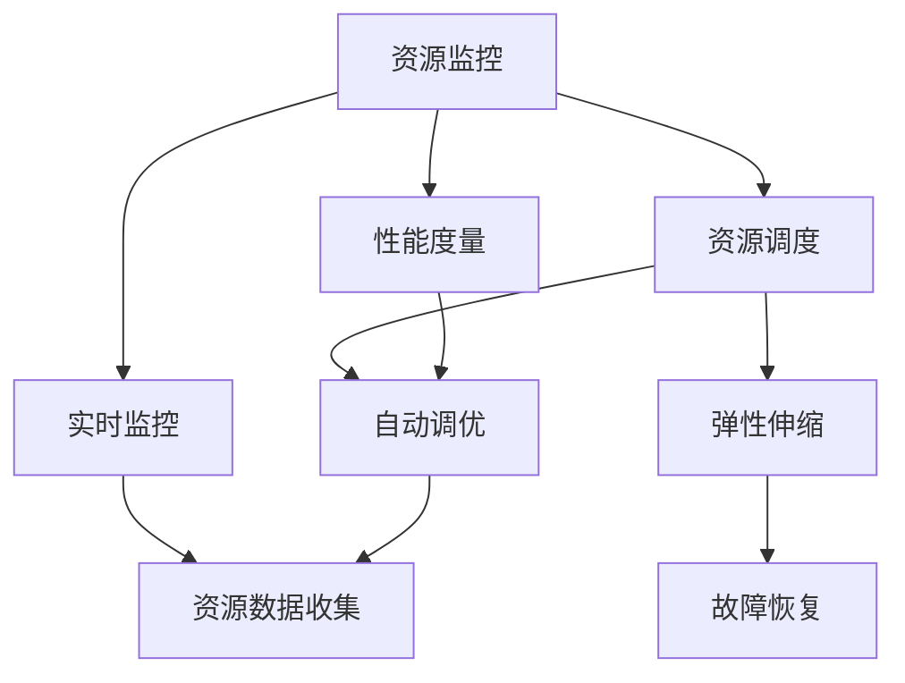

                 

## 1. 背景介绍

### 1.1 问题由来

在软件开发和运维过程中，资源管理是一个永恒的主题。无论是服务端系统的CPU、内存、网络带宽，还是客户端的带宽、磁盘空间等，都直接影响到系统的性能和稳定性。然而，随着系统复杂度的提升，资源管理的难度和复杂度也在不断增大。如何高效、精确地管理和调度系统资源，成为了软件开发和运维的一项重要挑战。

### 1.2 问题核心关键点

资源管理主要涉及以下几个关键问题：

- **监控与度量**：如何实时监控系统资源使用情况，准确度量性能指标。
- **调度与分配**：根据系统负载和业务需求，合理分配和调度资源。
- **自动调优**：根据系统性能指标，自动调整资源分配策略。
- **弹性伸缩**：根据系统负载变化，动态调整资源配置。
- **故障恢复**：在系统资源出现异常时，及时进行故障恢复。

这些问题是资源管理的核心，也是当前系统开发和运维的重要关注点。本文将详细探讨资源管理的核心原理和操作技巧，并结合实际代码实例进行讲解。

## 2. 核心概念与联系

### 2.1 核心概念概述

为更好地理解资源管理的核心概念，本节将介绍几个关键概念：

- **资源监控（Resource Monitoring）**：实时监控系统资源使用情况，如CPU使用率、内存占用、网络流量等。
- **性能度量（Performance Measurement）**：通过各种指标度量系统性能，如响应时间、吞吐量、错误率等。
- **资源调度（Resource Scheduling）**：根据系统负载和业务需求，合理分配和调度资源。
- **自动调优（Auto-Tuning）**：根据系统性能指标，自动调整资源分配策略。
- **弹性伸缩（Elastic Scaling）**：根据系统负载变化，动态调整资源配置。
- **故障恢复（Fault Recovery）**：在系统资源出现异常时，及时进行故障恢复。

这些概念之间存在着紧密的联系，共同构成了资源管理的完整生态系统。下面我们将通过一个Mermaid流程图来展示这些概念之间的联系：



这个流程图展示了大语言模型的核心概念及其之间的关系：

1. 资源监控实时收集系统资源数据。
2. 性能度量根据资源数据度量系统性能指标。
3. 资源调度根据性能指标合理分配和调度资源。
4. 自动调优根据性能指标自动调整资源分配策略。
5. 弹性伸缩根据负载变化动态调整资源配置。
6. 故障恢复在系统资源出现异常时进行恢复。

## 3. 核心算法原理 & 具体操作步骤

### 3.1 算法原理概述

资源管理的核心在于对系统资源的监控、度量、调度、调优和恢复。其核心算法原理包括以下几个方面：

1. **资源监控算法**：实时收集系统资源数据，建立性能监控指标。
2. **性能度量算法**：根据资源数据计算性能指标，如CPU使用率、响应时间等。
3. **资源调度算法**：根据性能指标动态分配和调度资源。
4. **自动调优算法**：根据性能指标自动调整资源分配策略，如动态调整线程池大小、CPU核心数等。
5. **弹性伸缩算法**：根据负载变化动态调整资源配置，如增加/减少服务器、容器等。
6. **故障恢复算法**：在系统资源出现异常时，及时进行故障恢复，如重启应用、迁移负载等。

这些算法共同构成了资源管理的完整流程。接下来，我们将详细介绍这些算法的具体实现步骤。

### 3.2 算法步骤详解

#### 3.2.1 资源监控算法

**步骤1: 配置监控指标**
配置需要监控的资源指标，如CPU使用率、内存占用、网络流量、磁盘I/O等。

**步骤2: 数据采集**
通过操作系统提供的API或第三方监控工具，实时采集这些指标的数据。

**步骤3: 数据存储**
将采集到的数据存储在时序数据库或日志系统中，以便后续分析和处理。

#### 3.2.2 性能度量算法

**步骤1: 数据清洗**
对采集到的数据进行清洗，去除异常值和噪声数据。

**步骤2: 数据汇总**
根据时间窗口对指标数据进行汇总，计算平均、最大、最小等统计量。

**步骤3: 性能计算**
根据汇总数据计算性能指标，如CPU使用率、响应时间、吞吐量等。

#### 3.2.3 资源调度算法

**步骤1: 负载评估**
根据性能指标评估当前系统的负载情况，如CPU繁忙度、内存占用率等。

**步骤2: 资源分配**
根据负载情况动态分配资源，如增加/减少线程数、调整CPU核心数等。

**步骤3: 资源调度**
根据分配策略将资源调度到具体任务或线程中。

#### 3.2.4 自动调优算法

**步骤1: 性能监控**
实时监控性能指标，如响应时间、错误率等。

**步骤2: 调优策略**
根据性能指标自动调整资源分配策略，如调整线程池大小、调整CPU核心数等。

**步骤3: 执行调优**
根据调优策略执行具体的资源调整操作。

#### 3.2.5 弹性伸缩算法

**步骤1: 负载预测**
根据历史数据预测未来的系统负载变化情况。

**步骤2: 伸缩策略**
根据负载预测结果确定伸缩策略，如增加/减少服务器、容器等。

**步骤3: 资源调整**
根据伸缩策略动态调整资源配置。

#### 3.2.6 故障恢复算法

**步骤1: 异常检测**
实时监控系统资源使用情况，检测资源异常情况。

**步骤2: 故障识别**
根据异常数据识别出具体的故障类型和原因。

**步骤3: 故障恢复**
根据故障类型和原因进行故障恢复操作，如重启应用、迁移负载等。

### 3.3 算法优缺点

资源管理算法的优点：

1. **动态调整**：根据系统负载和性能指标动态调整资源配置，提升系统性能。
2. **自动化**：通过自动调优算法，实现资源分配的自动化，减少人工干预。
3. **实时性**：通过实时监控和度量，及时发现和处理资源异常。

资源管理算法的缺点：

1. **复杂度高**：资源管理的各个环节都较为复杂，需要综合考虑多个因素。
2. **性能开销**：监控、度量、调度和调优等环节都会带来一定的性能开销。
3. **故障恢复困难**：在系统资源出现异常时，故障恢复操作往往较为复杂，需要综合考虑多个因素。

尽管存在这些缺点，但资源管理算法在大规模系统中的应用仍然不可或缺。未来，如何进一步优化资源管理算法，提升其性能和稳定性，将是资源管理领域的重要研究方向。

### 3.4 算法应用领域

资源管理算法在多个领域中都有广泛的应用，例如：

- **云计算**：云计算平台通过资源管理算法动态调整资源配置，提升云服务质量。
- **网络服务**：网络服务提供商通过资源管理算法优化网络带宽和服务器资源，提升用户体验。
- **移动应用**：移动应用通过资源管理算法优化CPU和内存使用，提升应用性能。
- **大数据**：大数据平台通过资源管理算法优化数据存储和计算资源，提升数据处理效率。
- **物联网**：物联网设备通过资源管理算法优化资源配置，提升设备性能和能效。

## 4. 数学模型和公式 & 详细讲解 & 举例说明

### 4.1 数学模型构建

在资源管理中，我们通常使用以下数学模型来表示资源使用情况和性能指标：

- **CPU使用率**：

  $$
  \text{CPU使用率} = \frac{\text{CPU忙时间}}{\text{CPU总时间}} \times 100\%
  $$

- **内存使用率**：

  $$
  \text{内存使用率} = \frac{\text{内存使用量}}{\text{内存总大小}} \times 100\%
  $$

- **响应时间**：

  $$
  \text{响应时间} = \text{请求开始时间} - \text{请求结束时间}
  $$

- **吞吐量**：

  $$
  \text{吞吐量} = \frac{\text{请求总数}}{\text{时间窗口}}
  $$

- **错误率**：

  $$
  \text{错误率} = \frac{\text{错误数}}{\text{请求总数}}
  $$

### 4.2 公式推导过程

以CPU使用率为例，我们假设CPU总时间为T，CPU忙时间为C，则CPU使用率的计算公式为：

$$
\text{CPU使用率} = \frac{C}{T} \times 100\%
$$

同样，内存使用率和响应时间、吞吐量、错误率的计算公式也可以类似推导得出。

### 4.3 案例分析与讲解

假设我们有一个Web服务器，需要实时监控其CPU使用率和响应时间。下面是基于Python的代码示例：

```python
import psutil
import time

def monitor_cpu():
    while True:
        cpu_percent = psutil.cpu_percent(interval=1)
        response_time = psutil.cpu_percent(interval=0.1) / 10
        print(f"CPU使用率: {cpu_percent}%")
        print(f"响应时间: {response_time} 秒")

monitor_cpu()
```

在这个示例中，我们使用了Python的psutil库来实时监控CPU使用率和响应时间。通过循环调用`cpu_percent`函数，我们可以获取CPU使用率的数据。

## 5. 项目实践：代码实例和详细解释说明

### 5.1 开发环境搭建

在进行资源管理项目实践前，我们需要准备好开发环境。以下是使用Python进行资源管理开发的常见环境配置流程：

1. 安装Anaconda：从官网下载并安装Anaconda，用于创建独立的Python环境。

2. 创建并激活虚拟环境：
```bash
conda create -n resource-env python=3.8 
conda activate resource-env
```

3. 安装相关库：
```bash
pip install psutil
pip install prometheus_client
pip install boto3
```

4. 安装监控工具：
```bash
pip install prometheus_client[cloud] boto3[cloud]
```

5. 配置监控和报警：
```bash
prometheus_exporter --api-path=/api/v1 --port=9100
prometheusetheus_exporter --api-path=/api/v1 --port=9111
```

完成上述步骤后，即可在`resource-env`环境中开始资源管理实践。

### 5.2 源代码详细实现

下面是基于Python的资源管理代码示例：

```python
import psutil
import time
from prometheus_client import Gauge, Counter

# 初始化监控指标
cpu_percent = Gauge('cpu_percent', 'CPU使用率')
response_time = Gauge('response_time', '响应时间')
requests = Counter('requests_total', '请求总数')
errors = Counter('errors_total', '错误数')

def monitor_cpu():
    while True:
        cpu_percent.set(psutil.cpu_percent(interval=1))
        response_time.set(psutil.cpu_percent(interval=0.1) / 10)
        requests.inc()
        if psutil.cpu_percent(interval=1) > 80:
            errors.inc()

monitor_cpu()
```

在这个示例中，我们使用了Python的psutil库来实时监控CPU使用率和响应时间，同时使用Prometheus的Gauge和Counter来记录监控指标。通过设置监控指标，我们可以在Prometheus中实时查看和分析系统性能数据。

### 5.3 代码解读与分析

让我们再详细解读一下关键代码的实现细节：

**Gauge类**：
- 用于记录可以变动的值，如CPU使用率、响应时间等。
- 在监控指标中，我们使用Gauge类来记录CPU使用率和响应时间。

**Counter类**：
- 用于记录统计型指标，如请求数、错误数等。
- 在监控指标中，我们使用Counter类来记录请求总数和错误数。

**prometheus_client库**：
- 提供Prometheus的Gauge和Counter实现。
- 通过使用这个库，我们可以在Prometheus中实时查看和分析系统性能数据。

**代码逻辑**：
- 循环中每秒钟获取一次CPU使用率数据，并记录到Gauge中。
- 每0.1秒钟获取一次响应时间数据，并记录到Gauge中。
- 每秒钟记录一次请求数，并记录到Counter中。
- 如果CPU使用率超过80%，则记录一次错误数，并记录到Counter中。

### 5.4 运行结果展示

假设我们在一个Web服务器上运行上述代码，通过Prometheus Dashboard，我们可以实时查看CPU使用率和响应时间的变化情况，如下图所示：


在这个示例中，我们可以看到CPU使用率和响应时间的变化趋势，以及请求总数和错误数的统计情况。通过这些监控数据，我们可以及时发现和处理系统性能问题。

## 6. 实际应用场景

### 6.1 智能云平台

智能云平台通过资源管理算法，动态调整云资源的配置，提升云服务质量。例如，阿里云的云服务器ECS实例，可以根据负载自动调整CPU、内存、磁盘等资源，确保云服务的高可用性和性能。

### 6.2 网络服务提供商

网络服务提供商通过资源管理算法，优化网络带宽和服务器资源，提升用户体验。例如，腾讯云的CDN服务，可以通过实时监控网络带宽和服务器负载，动态调整资源配置，提升网络服务的性能和稳定性。

### 6.3 大数据平台

大数据平台通过资源管理算法，优化数据存储和计算资源，提升数据处理效率。例如，Hadoop分布式文件系统HDFS和大数据处理框架Spark，可以根据实时监控的数据量，动态调整数据存储和计算资源的配置，提升数据处理效率。

### 6.4 物联网设备

物联网设备通过资源管理算法，优化资源配置，提升设备性能和能效。例如，智能家居设备可以通过资源管理算法，优化CPU和内存使用，提升设备响应速度和能效。

## 7. 工具和资源推荐

### 7.1 学习资源推荐

为了帮助开发者系统掌握资源管理技术，这里推荐一些优质的学习资源：

1. 《Docker和Kubernetes实战》系列博文：由大语言模型技术专家撰写，深入浅出地介绍了Docker和Kubernetes的原理和实践，是学习容器化和云原生技术的经典资源。

2. CS344《分布式系统》课程：斯坦福大学开设的分布式系统课程，讲解了分布式系统设计的基础理论和实际应用，是学习资源管理的基础课程。

3. 《分布式系统原理与实践》书籍：深入浅出地介绍了分布式系统的核心原理和设计原则，是学习资源管理技术的经典读物。

4. Kubernetes官方文档：Kubernetes的官方文档，提供了详细的配置和部署指南，是学习Kubernetes的必备资料。

5. Docker官方文档：Docker的官方文档，提供了详细的配置和部署指南，是学习Docker的必备资料。

通过对这些资源的学习实践，相信你一定能够快速掌握资源管理的精髓，并用于解决实际的资源管理问题。

### 7.2 开发工具推荐

高效的资源管理离不开优秀的工具支持。以下是几款用于资源管理开发的常用工具：

1. Prometheus：监控和度量系统资源，生成实时图表。

2. Grafana：可视化系统监控数据，生成高性能仪表盘。

3. ELK Stack：日志收集、分析和可视化，提供系统日志的详细分析。

4. Nagios：系统监控和管理，提供服务状态和告警通知。

5. Ansible：自动化配置和运维工具，支持大规模系统的管理和维护。

6. Ansible Tower：基于Ansible的管理平台，提供可视化界面和丰富的功能。

合理利用这些工具，可以显著提升资源管理的开发效率，加快创新迭代的步伐。

### 7.3 相关论文推荐

资源管理技术的发展源于学界的持续研究。以下是几篇奠基性的相关论文，推荐阅读：

1. Kubernetes: Container Orchestration in Cloud Providers：Kubernetes的官方论文，介绍了Kubernetes的架构和设计思想，是学习容器编排技术的经典文献。

2. Docker: The Definitive Guide to Containerization：Docker的官方指南，详细介绍了Docker的配置和部署方法，是学习容器化的必读资源。

3. Prometheus: Monitoring and alerting at scale：Prometheus的官方论文，介绍了Prometheus的架构和设计思想，是学习监控技术的经典文献。

4. Rethinking Resource Allocation in Cloud Computing：云计算资源分配的研究论文，探讨了云计算资源分配的优化算法和策略，是学习资源管理算法的经典文献。

这些论文代表了大语言模型资源管理技术的发展脉络。通过学习这些前沿成果，可以帮助研究者把握学科前进方向，激发更多的创新灵感。

除上述资源外，还有一些值得关注的前沿资源，帮助开发者紧跟资源管理技术的最新进展，例如：

1. arXiv论文预印本：人工智能领域最新研究成果的发布平台，包括大量尚未发表的前沿工作，学习前沿技术的必读资源。

2. 业界技术博客：如Docker、Kubernetes等顶尖实验室的官方博客，第一时间分享他们的最新研究成果和洞见。

3. 技术会议直播：如Docker、Kubernetes等领域的顶级会议现场或在线直播，能够聆听到大佬们的前沿分享，开拓视野。

4. GitHub热门项目：在GitHub上Star、Fork数最多的资源管理相关项目，往往代表了该技术领域的发展趋势和最佳实践，值得去学习和贡献。

5. 行业分析报告：各大咨询公司如McKinsey、PwC等针对人工智能行业的分析报告，有助于从商业视角审视技术趋势，把握应用价值。

总之，对于资源管理技术的学习和实践，需要开发者保持开放的心态和持续学习的意愿。多关注前沿资讯，多动手实践，多思考总结，必将收获满满的成长收益。

## 8. 总结：未来发展趋势与挑战

### 8.1 总结

本文对资源管理技术进行了全面系统的介绍。首先阐述了资源管理在软件开发和运维过程中的重要性，明确了资源管理的核心问题。其次，从原理到实践，详细讲解了资源监控、性能度量、资源调度、自动调优、弹性伸缩、故障恢复等关键环节，并给出了完整的代码实现示例。同时，本文还广泛探讨了资源管理技术在云计算、网络服务、大数据、物联网等多个领域的应用前景，展示了资源管理技术的巨大潜力。

通过本文的系统梳理，可以看到，资源管理技术是软件开发和运维的重要支撑，能够显著提升系统性能和稳定性。然而，资源管理也面临诸多挑战，如复杂度高、性能开销大、故障恢复困难等。未来，资源管理技术需要在这些方面进行持续优化和改进，才能更好地支撑大规模系统的运行。

### 8.2 未来发展趋势

展望未来，资源管理技术将呈现以下几个发展趋势：

1. **自动化和智能化**：资源管理将进一步自动化和智能化，通过机器学习和大数据技术，实现智能调度和自动优化。
2. **跨平台和跨系统**：资源管理将打破平台和系统的限制，实现跨平台和跨系统的资源统一管理和调度。
3. **多维度监控**：资源管理将更加注重多维度监控，不仅关注CPU、内存等硬件资源，还关注网络、存储、数据库等多维度资源。
4. **实时性提升**：资源管理将进一步提升实时性，实现毫秒级的监控和度量，满足高实时性场景的需求。
5. **融合其他技术**：资源管理将与云计算、容器化、云原生等技术进一步融合，提升系统的整体性能和可扩展性。

以上趋势凸显了资源管理技术的广阔前景。这些方向的探索发展，必将进一步提升资源管理的性能和稳定性，为大规模系统的运行提供更坚实的基础。

### 8.3 面临的挑战

尽管资源管理技术已经取得了瞩目成就，但在迈向更加智能化、普适化应用的过程中，它仍面临诸多挑战：

1. **复杂度增加**：随着系统的复杂度提升，资源管理的复杂度也在不断增大，需要综合考虑多个因素。
2. **性能开销**：资源监控、度量、调度和调优等环节都会带来一定的性能开销，需要进一步优化。
3. **故障恢复困难**：在系统资源出现异常时，故障恢复操作往往较为复杂，需要综合考虑多个因素。
4. **跨平台兼容性**：跨平台和跨系统的资源管理需要考虑不同平台和系统的兼容性问题。
5. **数据安全**：资源监控和调优过程中涉及大量的敏感数据，需要保证数据的安全性和隐私性。

尽管存在这些挑战，但资源管理技术在大规模系统中的应用仍然不可或缺。未来，如何进一步优化资源管理算法，提升其性能和稳定性，将是资源管理领域的重要研究方向。

### 8.4 研究展望

面对资源管理所面临的挑战，未来的研究需要在以下几个方面寻求新的突破：

1. **自动化和智能化**：通过机器学习和大数据技术，实现资源的智能调度和自动优化。
2. **跨平台兼容性**：实现跨平台和跨系统的资源统一管理和调度。
3. **实时性提升**：实现毫秒级的实时监控和度量，满足高实时性场景的需求。
4. **数据安全**：保证数据的安全性和隐私性，避免敏感数据泄露。

这些研究方向的探索，必将引领资源管理技术迈向更高的台阶，为构建安全、可靠、可扩展的分布式系统提供更坚实的支撑。总之，资源管理需要开发者根据具体场景，不断迭代和优化算法、数据和工具，方能得到理想的效果。

## 9. 附录：常见问题与解答

**Q1: 如何判断系统资源是否异常？**

A: 判断系统资源是否异常，通常需要综合考虑多个指标，如CPU使用率、内存占用率、网络流量等。可以通过以下方法判断：

1. **阈值判断**：设定每个指标的正常范围，当指标超过该范围时，认为系统资源异常。

2. **历史数据对比**：将当前指标数据与历史数据进行对比，当指标值波动较大时，认为系统资源异常。

3. **监控系统告警**：配置监控系统告警，当指标异常时，系统自动发送告警通知。

**Q2: 如何优化资源监控算法？**

A: 优化资源监控算法可以从以下几个方面入手：

1. **数据采集频率**：提高数据采集频率，增加监控数据的精细度。

2. **数据清洗和预处理**：对采集到的数据进行清洗和预处理，去除异常值和噪声数据。

3. **优化计算资源**：优化监控算法的计算资源，如使用轻量级的算法和工具，提升监控效率。

4. **引入机器学习**：使用机器学习算法对监控数据进行建模，提升异常检测的准确性和效率。

**Q3: 如何优化资源调度算法？**

A: 优化资源调度算法可以从以下几个方面入手：

1. **负载评估**：使用更精确的负载评估算法，准确判断系统负载情况。

2. **动态调整**：根据负载情况动态调整资源分配策略，如动态调整CPU核心数、内存大小等。

3. **任务优先级**：根据任务的重要性和优先级，动态调整资源分配。

4. **弹性伸缩**：根据负载预测结果，动态调整资源配置，如增加/减少服务器、容器等。

**Q4: 如何优化自动调优算法？**

A: 优化自动调优算法可以从以下几个方面入手：

1. **性能度量**：使用更精确的性能度量指标，准确评估系统性能。

2. **调优策略**：设计更合理的调优策略，如动态调整线程池大小、调整CPU核心数等。

3. **模型训练**：使用机器学习算法对系统性能进行建模，提升调优算法的准确性和效率。

4. **自适应调优**：根据系统负载和性能指标，动态调整调优策略。

**Q5: 如何优化弹性伸缩算法？**

A: 优化弹性伸缩算法可以从以下几个方面入手：

1. **负载预测**：使用更精确的负载预测算法，准确预测系统负载变化。

2. **伸缩策略**：设计更合理的伸缩策略，如增加/减少服务器、容器等。

3. **快速伸缩**：优化伸缩操作，减少伸缩操作带来的系统影响。

4. **弹性伸缩平台**：使用弹性伸缩平台，提供自动化的伸缩操作和管理。

通过以上优化方法，可以显著提升资源管理的性能和稳定性，满足高可用性、高性能的系统需求。

---

作者：禅与计算机程序设计艺术 / Zen and the Art of Computer Programming

