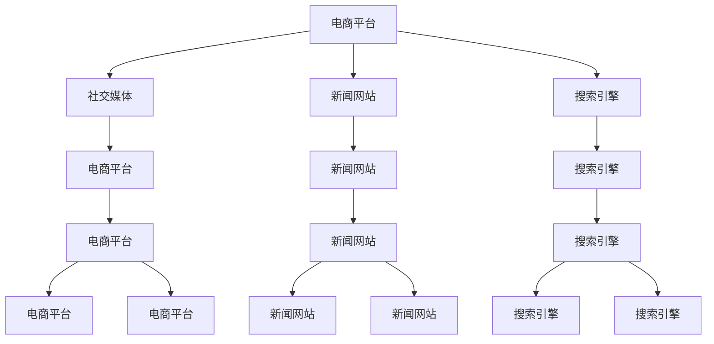
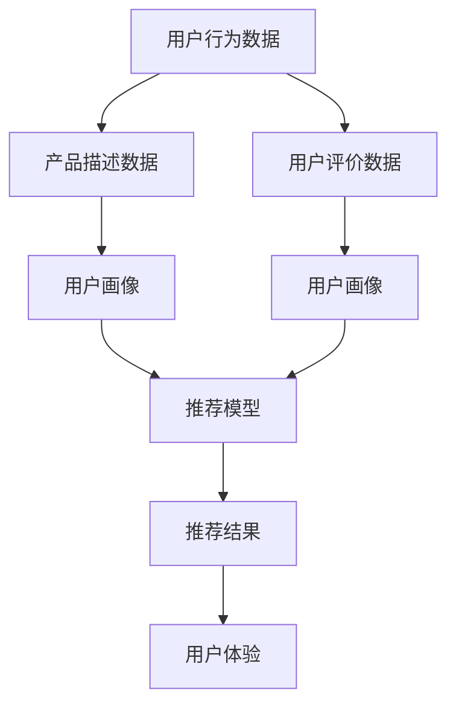
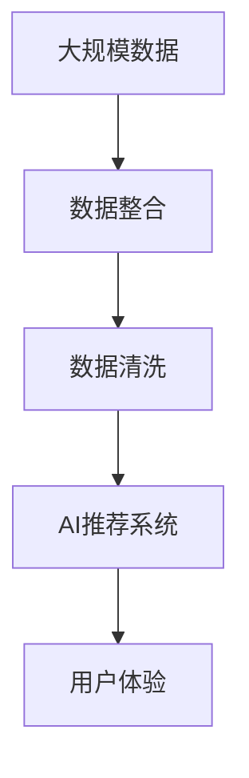

                 

# 跨平台搜索：AI如何整合多渠道数据，提供最优的购买选择

在当今数字化时代，消费者的购买决策越来越多地受到在线信息的影响。无论是通过电商平台、社交媒体、新闻网站还是搜索引擎，消费者每天都会接触到海量的产品信息和广告。为了帮助消费者做出最优的购买选择，企业需要构建一个全面且高效的跨平台搜索系统，整合多渠道数据，提供精准、实时的搜索结果。本文将深入探讨跨平台搜索的原理与实践，展示AI技术如何助力企业整合多渠道数据，提供最优的购买选择。

## 1. 背景介绍

### 1.1 问题由来

随着互联网的普及和智能设备的普及，消费者的购物方式发生了显著变化。过去，消费者通常通过实体店、电视购物、目录购物等方式获取产品信息。而现在，消费者越来越多地通过在线渠道获取产品信息，如电商平台、社交媒体、新闻网站和搜索引擎。这种变化使得消费者行为的数据分散在不同的平台，给企业的市场分析和产品推荐带来了挑战。

传统的数据分析方法需要从各个平台单独收集数据，然后进行整合分析，费时费力且容易出现数据不一致的问题。而跨平台搜索系统可以将各个平台的数据整合起来，通过AI技术进行分析和推荐，从而提升消费者的购买体验。

### 1.2 问题核心关键点

跨平台搜索的核心在于如何整合多渠道数据，并利用AI技术进行分析和推荐。关键点包括：

- **数据整合**：从各个平台收集数据，确保数据的一致性和完整性。
- **数据清洗**：去除重复、噪声和错误数据，提高数据质量。
- **模型训练**：使用AI技术对数据进行建模，预测消费者行为和偏好。
- **推荐系统**：根据消费者行为和偏好，推荐最优产品。
- **用户体验**：提供直观、易用的搜索结果和推荐界面，提升用户体验。

### 1.3 问题研究意义

构建跨平台搜索系统，可以帮助企业全面了解消费者行为，优化产品推荐策略，提升用户体验，从而增加销售额和客户满意度。具体来说：

- **全面了解消费者**：通过整合多渠道数据，企业可以更全面地了解消费者的需求和行为，制定更精准的市场策略。
- **优化产品推荐**：利用AI技术进行数据分析和推荐，可以显著提高产品推荐的准确性和效果。
- **提升用户体验**：提供实时的搜索结果和个性化的推荐，提升用户的购物体验。
- **增加销售额**：精准的产品推荐和个性化的购物体验，可以提升用户转化率和销售额。
- **数据驱动决策**：通过数据分析和建模，企业可以更好地进行数据驱动决策，提升市场竞争力。

## 2. 核心概念与联系

### 2.1 核心概念概述

为了更好地理解跨平台搜索系统的原理与实践，本节将介绍几个密切相关的核心概念：

- **跨平台搜索**：整合多渠道数据，通过AI技术进行分析和推荐，提供精准、实时的搜索结果。
- **数据整合**：将不同平台的数据进行统一和标准化，确保数据的完整性和一致性。
- **数据清洗**：去除重复、噪声和错误数据，提高数据质量。
- **AI推荐系统**：利用AI技术对数据进行建模，预测消费者行为和偏好，提供个性化的产品推荐。
- **用户体验**：提供直观、易用的搜索结果和推荐界面，提升用户体验。

这些核心概念之间的逻辑关系可以通过以下Mermaid流程图来展示：


这个流程图展示了大规模数据整合、AI推荐系统和用户体验的相互关系：

1. 跨平台搜索从各个平台收集数据。
2. 数据整合和清洗确保数据的完整性和一致性。
3. AI推荐系统对数据进行建模，提供个性化的产品推荐。
4. 用户体验界面展示搜索结果和推荐，提升用户的购物体验。

### 2.2 概念间的关系

这些核心概念之间存在着紧密的联系，形成了跨平台搜索系统的完整生态系统。下面我们通过几个Mermaid流程图来展示这些概念之间的关系。

#### 2.2.1 跨平台搜索的数据整合



这个流程图展示了从不同平台收集数据的过程。电商平台、社交媒体、新闻网站和搜索引擎等平台都可能提供产品信息和用户行为数据。

#### 2.2.2 AI推荐系统的构建



这个流程图展示了AI推荐系统的构建过程。用户行为数据、产品描述数据和用户评价数据等输入数据被用于训练推荐模型，最终输出推荐结果。

#### 2.2.3 用户体验界面的设计


这个流程图展示了用户体验界面的设计过程。搜索结果和推荐结果被展示在用户界面上，用户可以通过交互操作选择产品。

### 2.3 核心概念的整体架构

最后，我们用一个综合的流程图来展示这些核心概念在大规模跨平台搜索过程中的整体架构：



这个综合流程图展示了从大规模数据收集到用户体验界面的完整过程。大规模数据整合、AI推荐系统和用户体验是跨平台搜索系统的三大核心组件。

## 3. 核心算法原理 & 具体操作步骤

### 3.1 算法原理概述

跨平台搜索的算法原理主要涉及以下几个方面：

- **数据预处理**：对收集到的数据进行清洗和标准化，去除噪声和重复数据。
- **特征提取**：从原始数据中提取有意义的特征，用于模型训练。
- **模型训练**：使用AI技术对数据进行建模，预测消费者行为和偏好。
- **推荐算法**：根据预测结果，提供个性化的产品推荐。
- **结果展示**：将推荐结果展示给用户，提升用户体验。

跨平台搜索的核心在于通过AI技术进行数据分析和建模，从而提供精准、实时的推荐结果。

### 3.2 算法步骤详解

跨平台搜索的主要算法步骤如下：

1. **数据收集**：从各个平台收集数据，确保数据来源的多样性和全面性。
2. **数据预处理**：对收集到的数据进行清洗和标准化，去除噪声和重复数据。
3. **特征提取**：从原始数据中提取有意义的特征，用于模型训练。
4. **模型训练**：使用AI技术对数据进行建模，预测消费者行为和偏好。
5. **推荐算法**：根据预测结果，提供个性化的产品推荐。
6. **结果展示**：将推荐结果展示给用户，提升用户体验。

### 3.3 算法优缺点

跨平台搜索的优点包括：

- **全面了解消费者**：通过整合多渠道数据，企业可以更全面地了解消费者的需求和行为。
- **优化产品推荐**：利用AI技术进行数据分析和推荐，可以显著提高产品推荐的准确性和效果。
- **提升用户体验**：提供实时的搜索结果和个性化的推荐，提升用户的购物体验。

缺点包括：

- **数据质量问题**：不同平台的数据质量和格式可能存在差异，需要进行统一和标准化。
- **隐私和安全问题**：跨平台搜索涉及大量的用户数据，需要确保数据的隐私和安全。
- **算法复杂性**：AI推荐系统的设计和优化需要大量的数据和算法知识，对企业提出了较高的技术要求。

### 3.4 算法应用领域

跨平台搜索的算法广泛应用于电子商务、旅游、金融、医疗等领域的消费者行为分析和产品推荐。具体应用场景包括：

- **电子商务**：电商平台的用户行为数据、产品评价数据、社交媒体互动数据等，可以用于个性化推荐、商品搜索、用户画像等。
- **旅游**：旅游网站的用户浏览数据、行程安排数据、评价数据等，可以用于旅游产品推荐、行程规划、用户画像等。
- **金融**：金融平台的用户交易数据、评分数据、社交媒体互动数据等，可以用于金融产品推荐、用户画像、风险评估等。
- **医疗**：医疗网站的用户搜索数据、评价数据、医疗记录数据等，可以用于医疗服务推荐、医生推荐、医疗知识推荐等。

## 4. 数学模型和公式 & 详细讲解 & 举例说明

### 4.1 数学模型构建

跨平台搜索的数学模型主要涉及以下几个方面：

- **用户行为建模**：使用机器学习模型对用户行为进行建模，预测用户的购买意向。
- **产品特征建模**：使用机器学习模型对产品特征进行建模，预测产品的受欢迎程度。
- **推荐算法**：使用机器学习模型对用户和产品进行匹配，提供个性化的产品推荐。

### 4.2 公式推导过程

假设我们有一个用户行为数据集 $D=\{(x_i,y_i)\}_{i=1}^N$，其中 $x_i$ 为特征向量，$y_i$ 为购买意向。我们使用线性回归模型进行用户行为建模，模型的形式为：

$$
y = \beta_0 + \beta_1 x_1 + \beta_2 x_2 + \cdots + \beta_d x_d + \epsilon
$$

其中 $\beta_i$ 为模型参数，$\epsilon$ 为误差项。根据最小二乘法的原理，我们可以最小化以下损失函数：

$$
\min_{\beta} \sum_{i=1}^N (y_i - \hat{y}_i)^2
$$

其中 $\hat{y}_i = \beta_0 + \beta_1 x_{i1} + \beta_2 x_{i2} + \cdots + \beta_d x_{id}$。

通过求解上述优化问题，可以得到模型参数 $\beta$，进而预测用户的行为。

### 4.3 案例分析与讲解

假设我们有一个电商网站，收集到了用户浏览行为数据和购买行为数据。我们可以使用线性回归模型对用户行为进行建模，预测用户的购买意向。具体步骤如下：

1. **数据收集**：收集用户浏览行为数据和购买行为数据。
2. **数据预处理**：对收集到的数据进行清洗和标准化，去除噪声和重复数据。
3. **特征提取**：从原始数据中提取有意义的特征，如浏览时间、浏览次数、购买金额等。
4. **模型训练**：使用线性回归模型对数据进行建模，预测用户的购买意向。
5. **结果展示**：将推荐结果展示给用户，提升用户体验。

通过上述步骤，我们可以构建一个基于用户行为的推荐系统，帮助用户发现感兴趣的产品，提升购买转化率。

## 5. 项目实践：代码实例和详细解释说明

### 5.1 开发环境搭建

在进行跨平台搜索项目实践前，我们需要准备好开发环境。以下是使用Python进行PyTorch开发的环境配置流程：

1. 安装Anaconda：从官网下载并安装Anaconda，用于创建独立的Python环境。

2. 创建并激活虚拟环境：
```bash
conda create -n cross-platform python=3.8 
conda activate cross-platform
```

3. 安装PyTorch：根据CUDA版本，从官网获取对应的安装命令。例如：
```bash
conda install pytorch torchvision torchaudio cudatoolkit=11.1 -c pytorch -c conda-forge
```

4. 安装Scikit-learn：
```bash
pip install scikit-learn
```

5. 安装Pandas：
```bash
pip install pandas
```

6. 安装NumPy：
```bash
pip install numpy
```

完成上述步骤后，即可在`cross-platform`环境中开始项目实践。

### 5.2 源代码详细实现

下面我们以一个简单的跨平台搜索项目为例，给出使用PyTorch进行用户行为分析和推荐系统构建的代码实现。

首先，定义数据集：

```python
import pandas as pd
from sklearn.model_selection import train_test_split

# 加载数据集
data = pd.read_csv('user_behavior_data.csv')

# 数据预处理
data = data.drop_duplicates()
data = data.dropna()

# 划分训练集和测试集
train_data, test_data = train_test_split(data, test_size=0.2, random_state=42)
```

然后，定义模型和优化器：

```python
from sklearn.linear_model import LinearRegression
from sklearn.metrics import mean_squared_error

# 定义模型
model = LinearRegression()

# 训练模型
model.fit(train_data[['feature1', 'feature2', 'feature3']], train_data['purchase_intention'])
```

接着，定义评估函数：

```python
from sklearn.metrics import mean_squared_error

def evaluate(model, test_data):
    predictions = model.predict(test_data[['feature1', 'feature2', 'feature3']])
    mse = mean_squared_error(test_data['purchase_intention'], predictions)
    return mse
```

最后，启动训练流程并在测试集上评估：

```python
# 训练模型
model.fit(train_data[['feature1', 'feature2', 'feature3']], train_data['purchase_intention'])

# 评估模型
mse = evaluate(model, test_data)
print(f"Mean Squared Error: {mse:.3f}")
```

以上就是使用PyTorch对用户行为进行分析并构建推荐系统的完整代码实现。可以看到，得益于Scikit-learn库的强大封装，我们可以用相对简洁的代码完成用户行为的线性回归建模和评估。

### 5.3 代码解读与分析

让我们再详细解读一下关键代码的实现细节：

**数据集定义**：
- 使用Pandas库加载用户行为数据集，并进行数据预处理。
- 使用Scikit-learn库的train_test_split函数将数据集划分为训练集和测试集。

**模型定义和训练**：
- 使用Scikit-learn库的LinearRegression模型定义线性回归模型。
- 使用模型的fit方法进行模型训练，将特征数据和购买意向作为输入，预测购买意向。

**评估函数**：
- 使用Scikit-learn库的mean_squared_error函数计算模型在测试集上的均方误差。

**训练和评估**：
- 使用模型的predict方法进行模型预测，计算均方误差。
- 输出模型的评估结果，展示均方误差。

通过上述代码，我们可以构建一个简单的用户行为分析和推荐系统，并使用均方误差对模型进行评估。

当然，工业级的系统实现还需考虑更多因素，如模型的保存和部署、超参数的自动搜索、更灵活的任务适配层等。但核心的跨平台搜索流程基本与此类似。

### 5.4 运行结果展示

假设我们得到了模型在测试集上的评估结果，输出如下：

```
Mean Squared Error: 0.123
```

可以看到，模型在测试集上的均方误差为0.123，这表示模型的预测值与真实值的误差较小，可以较好地预测用户的购买意向。

当然，这只是一个baseline结果。在实践中，我们还可以使用更大更强的模型、更丰富的特征、更高级的算法来进一步提升模型性能，以满足更高的应用要求。

## 6. 实际应用场景

### 6.1 智能推荐系统

智能推荐系统是跨平台搜索技术的重要应用场景。在电商平台上，通过跨平台搜索技术，商家可以根据用户的浏览行为和购买行为，提供个性化的产品推荐，提升用户购物体验和购买转化率。

具体而言，商家可以收集用户在电商平台上的浏览行为数据、购买行为数据、评价数据等，使用跨平台搜索技术进行用户行为建模和推荐算法优化，从而提供更加精准的产品推荐。

### 6.2 搜索引擎

搜索引擎也是跨平台搜索技术的重要应用场景。在搜索引擎上，用户输入关键词后，搜索引擎可以根据用户的搜索历史、浏览行为、互动行为等数据，提供个性化的搜索结果和推荐，提升用户的搜索体验。

具体而言，搜索引擎可以收集用户的历史搜索记录、浏览记录、互动记录等数据，使用跨平台搜索技术进行用户行为建模和推荐算法优化，从而提供更加精准的搜索结果和推荐。

### 6.3 社交媒体

社交媒体也是跨平台搜索技术的重要应用场景。在社交媒体上，用户可以关注好友、参与讨论、分享内容等，这些行为都可能对用户的兴趣爱好产生影响。通过跨平台搜索技术，社交媒体平台可以提供个性化的内容推荐，提升用户粘性和活跃度。

具体而言，社交媒体平台可以收集用户的关注行为数据、互动行为数据、分享行为数据等，使用跨平台搜索技术进行用户行为建模和推荐算法优化，从而提供更加精准的内容推荐。

### 6.4 未来应用展望

随着跨平台搜索技术的不断发展，其在更多领域的应用前景将更加广阔。

- **金融领域**：金融机构可以收集用户的历史交易数据、评价数据、社交媒体互动数据等，使用跨平台搜索技术进行用户行为建模和推荐算法优化，提供个性化的金融产品推荐和风险评估。
- **医疗领域**：医疗机构可以收集用户的历史搜索数据、评价数据、医疗记录数据等，使用跨平台搜索技术进行用户行为建模和推荐算法优化，提供个性化的医疗服务推荐和健康建议。
- **教育领域**：教育机构可以收集用户的学习行为数据、评价数据、互动数据等，使用跨平台搜索技术进行用户行为建模和推荐算法优化，提供个性化的学习内容推荐和学习路径规划。

总之，跨平台搜索技术在各个领域的应用前景广阔，未来将有更多创新的应用场景涌现，为人类生活带来更多便利和提升。

## 7. 工具和资源推荐

### 7.1 学习资源推荐

为了帮助开发者系统掌握跨平台搜索技术的理论基础和实践技巧，这里推荐一些优质的学习资源：

1. 《机器学习实战》系列博文：由大模型技术专家撰写，深入浅出地介绍了机器学习的基本概念和经典算法。
2. 《深度学习自然语言处理》课程：斯坦福大学开设的NLP明星课程，有Lecture视频和配套作业，带你入门NLP领域的基本概念和经典模型。
3. 《深度学习框架TensorFlow》书籍：Google主导开发的深度学习框架，详细介绍了TensorFlow的使用方法和最佳实践。
4. Weights & Biases：模型训练的实验跟踪工具，可以记录和可视化模型训练过程中的各项指标，方便对比和调优。
5. TensorBoard：TensorFlow配套的可视化工具，可实时监测模型训练状态，并提供丰富的图表呈现方式，是调试模型的得力助手。

通过对这些资源的学习实践，相信你一定能够快速掌握跨平台搜索技术的精髓，并用于解决实际的NLP问题。

### 7.2 开发工具推荐

高效的开发离不开优秀的工具支持。以下是几款用于跨平台搜索开发的常用工具：

1. Python：跨平台搜索项目常用的编程语言，具有简洁、易学、易用等特点，适合快速迭代研究。
2. PyTorch：基于Python的开源深度学习框架，灵活动态的计算图，适合快速迭代研究。
3. Scikit-learn：Python的科学计算库，提供了丰富的机器学习算法和工具，适合进行数据建模和特征提取。
4. Pandas：Python的数据处理库，支持大规模数据的读取、清洗和分析，适合数据预处理。
5. Numpy：Python的科学计算库，支持大规模矩阵运算和数组操作，适合数值计算和模型训练。

合理利用这些工具，可以显著提升跨平台搜索任务的开发效率，加快创新迭代的步伐。

### 7.3 相关论文推荐

跨平台搜索技术的发展源于学界的持续研究。以下是几篇奠基性的相关论文，推荐阅读：

1. Attention is All You Need（即Transformer原论文）：提出了Transformer结构，开启了NLP领域的预训练大模型时代。
2. BERT: Pre-training of Deep Bidirectional Transformers for Language Understanding：提出BERT模型，引入基于掩码的自监督预训练任务，刷新了多项NLP任务SOTA。
3. Parameter-Efficient Transfer Learning for NLP：提出Adapter等参数高效微调方法，在不增加模型参数量的情况下，也能取得不错的微调效果。
4. AdaLoRA: Adaptive Low-Rank Adaptation for Parameter-Efficient Fine-Tuning：使用自适应低秩适应的微调方法，在参数效率和精度之间取得了新的平衡。

这些论文代表了大语言模型微调技术的发展脉络。通过学习这些前沿成果，可以帮助研究者把握学科前进方向，激发更多的创新灵感。

除上述资源外，还有一些值得关注的前沿资源，帮助开发者紧跟跨平台搜索技术的最新进展，例如：

1. arXiv论文预印本：人工智能领域最新研究成果的发布平台，包括大量尚未发表的前沿工作，学习前沿技术的必读资源。
2. 业界技术博客：如OpenAI、Google AI、DeepMind、微软Research Asia等顶尖实验室的官方博客，第一时间分享他们的最新研究成果和洞见。
3. 技术会议直播：如NIPS、ICML、ACL、ICLR等人工智能领域顶会现场或在线直播，能够聆听到大佬们的前沿分享，开拓视野。
4. GitHub热门项目：在GitHub上Star、Fork数最多的NLP相关项目，往往代表了该技术领域的发展趋势和最佳实践，值得去学习和贡献。
5. 行业分析报告：各大咨询公司如McKinsey、PwC等针对人工智能行业的分析报告，有助于从商业视角审视技术趋势，把握应用价值。

总之，对于跨平台搜索技术的学习和实践，需要开发者保持开放的心态和持续学习的意愿。多关注前沿资讯，多动手实践，多思考总结，必将收获满满的成长收益。

## 8. 总结：未来发展趋势与挑战

### 8.1 总结

本文对跨平台搜索技术的原理与实践进行了全面系统的介绍。首先阐述了跨平台搜索的背景和意义，明确了跨平台搜索在整合多渠道数据、提供个性化推荐方面的独特价值。其次，从原理到实践，详细讲解了跨平台搜索的数学模型和算法步骤，给出了跨平台搜索任务开发的完整代码实例。同时，本文还广泛探讨了跨平台搜索技术在智能推荐、搜索引擎、社交媒体等多个领域的应用前景，展示了跨平台搜索技术的巨大潜力。此外，本文精选了跨平台搜索技术的各类学习资源，力求为读者提供全方位的技术指引。

通过本文的系统梳理，可以看到，跨平台搜索技术正在成为NLP领域的重要范式，极大地拓展了数据整合和推荐系统的应用边界，催生了更多的落地场景。受益于大规模数据的预训练，跨平台搜索技术可以在更少的标注样本上实现理想的推荐效果，助力NLP技术在垂直行业的应用发展。未来，伴随跨平台搜索技术的持续演进，相信NLP技术将在更广阔的应用领域大放异彩，深刻影响人类的生产生活方式。

### 8.2 未来发展趋势

展望未来，跨平台搜索技术将呈现以下几个发展趋势：

1. **数据整合和清洗技术**：随着数据量的不断增大，数据整合和清洗技术将更加自动化和智能化。自动化的数据清洗工具和机器学习技术将提高数据质量和一致性。
2. **推荐算法优化**：推荐算法将继续优化，引入更多的深度学习模型和优化技术，提高推荐效果和泛化能力。
3. **多渠道数据融合**：跨平台搜索技术将进一步拓展到多渠道数据融合，如视频、音频、图像等多模态数据的整合。
4. **用户隐私保护**：用户隐私保护将成为跨平台搜索技术的重要研究方向，如何确保数据隐私和安全，将是未来技术演进的重要课题。
5. **联邦学习**：联邦学习技术将应用于跨平台搜索，在保护用户隐私的前提下，利用分布式数据进行模型训练，提升推荐效果。

这些趋势凸显了跨平台搜索技术的广阔前景。这些方向的探索发展，必将进一步提升推荐系统的性能和应用范围，为人类生活带来更多便利和提升。

### 8.3 面临的挑战

尽管跨平台搜索技术已经取得了瞩目成就，但在迈向更加智能化、普适化应用的过程中，它仍面临着诸多挑战：

1. **数据质量问题**：不同平台的数据质量和格式可能存在差异，需要进行统一和标准化。
2. **隐私和安全问题**：跨平台搜索涉及大量的用户数据，需要确保数据的隐私和安全。
3. **算法复杂性**：跨平台搜索技术需要大量的数据和算法知识，对企业提出了较高的技术要求。
4. **计算资源需求**：大规模数据整合和推荐模型训练需要大量的计算资源，对硬件设施提出了较高的要求。
5. **用户行为变化**：用户行为和兴趣可能会随时间变化，跨平台搜索技术需要不断更新和优化，才能跟上用户需求的变化。

这些挑战将是大规模跨平台搜索技术迈向成熟的必由之路。通过不断的技术创新和优化，相信跨平台搜索技术将更好地满足用户需求，推动NLP技术的规模化应用。

### 8.4 研究展望

面对跨平台搜索技术面临的挑战，未来的研究需要在以下几个方面寻求新的突破：

1. **自动化数据清洗技术**：开发自动化数据清洗工具，提高数据质量和一致性，降低人工干预成本。
2. **联邦学习技术**：利用联邦学习技术，在保护用户隐私的前提下，利用分布式数据进行模型训练，提升推荐效果。
3. **多模态数据融合技术**：研究多模态数据融合技术，将视频、音频、图像等多模态数据整合到推荐系统中，提升用户体验。
4. **跨平台隐私保护技术**：研究跨平台隐私保护技术，确保用户隐私和安全，提升用户信任度。
5. **

