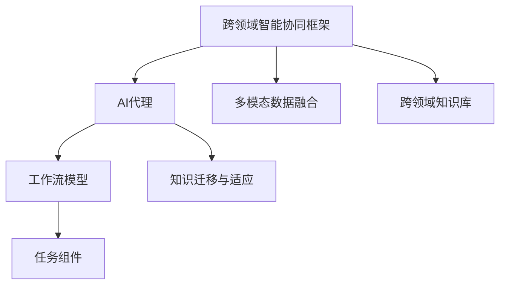
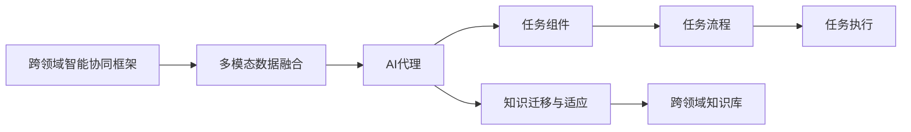

                 

## 1. 背景介绍

随着人工智能（AI）技术的不断进步，跨领域AI代理工作流模型（Inter-Domain AI Agent Workflow Model，简称ID-AWM）在应对多模态和跨领域任务中展现出显著优势。该模型旨在构建一个灵活、高效、自适应的AI代理系统，能够适应不同行业和场景下的复杂需求。本文将从背景介绍、核心概念、算法原理、实际操作、应用领域、案例分析、项目实践、应用展望、工具资源、总结展望等方面深入探讨ID-AWM的核心原理和应用策略。

## 2. 核心概念与联系

### 2.1 核心概念概述

ID-AWM模型是构建在跨领域智能协同框架上的一种高级AI代理工作流模型。该模型通过融合多种智能技术和跨领域知识，实现对不同领域任务的快速适配和高效执行。其核心概念包括：

- **跨领域智能协同框架**：一个支持多模态、跨领域数据和任务协同的智能框架，能够在不同领域之间进行知识共享和协同处理。
- **AI代理**：能够自主学习、推理和执行任务的智能体，具备跨领域知识迁移和适应能力。
- **工作流模型**：一种过程驱动的建模方法，通过定义任务流程、组件和接口，实现任务的高效组织和执行。

### 2.2 核心概念关系

通过以下Mermaid流程图，我们可以更清晰地理解ID-AWM中各核心概念之间的关系：



该图展示了一个基本的ID-AWM模型架构：

- 跨领域智能协同框架负责管理跨领域知识的流通和融合。
- AI代理则基于此框架进行自主学习和推理。
- 工作流模型定义了具体的任务流程和组件接口。
- 多模态数据融合技术确保AI代理能够处理各种数据格式和来源。
- 知识迁移与适应能力使AI代理能够快速适应新领域任务。

### 2.3 核心概念的整体架构

为了更全面地展示ID-AWM模型的工作原理，以下是一个更详细的Mermaid流程图：



该图展示了ID-AWM模型从数据融合到任务执行的全流程：

1. 跨领域智能协同框架管理多模态数据的融合。
2. AI代理基于融合后的数据进行学习和推理。
3. 任务组件根据工作流模型定义的任务流程进行执行。
4. AI代理通过知识迁移与适应能力快速适应新任务。
5. 任务流程定义具体的执行路径和组件。
6. 跨领域知识库存储和共享跨领域的通用知识和经验。
7. 任务执行模块基于任务流程和知识库输出结果。

## 3. 核心算法原理 & 具体操作步骤

### 3.1 算法原理概述

ID-AWM模型的核心算法原理基于协同学习、知识迁移和自适应学习技术。其基本流程包括数据融合、模型训练、任务适配和知识迁移四个步骤。

- **数据融合**：通过多模态数据融合技术，将来自不同领域和来源的数据整合在一起，形成统一的输入格式。
- **模型训练**：在跨领域智能协同框架下，AI代理通过自主学习和迁移学习，对融合后的数据进行建模和训练。
- **任务适配**：根据具体任务需求，通过任务流程和工作流模型对AI代理进行适配和优化，形成满足特定任务的高效执行路径。
- **知识迁移**：通过跨领域知识库的共享和适应能力，使AI代理能够快速适应新任务，提升其跨领域迁移能力。

### 3.2 算法步骤详解

ID-AWM模型的具体步骤包括：

1. **数据预处理**：对多模态数据进行清洗、标准化和标注，形成统一的输入格式。
2. **模型初始化**：选择适当的预训练模型，并根据任务需求进行初始化。
3. **协同学习**：在跨领域智能协同框架下，AI代理与其他模型进行知识协同学习，共享通用知识和经验。
4. **任务适配**：根据任务需求，通过任务流程和工作流模型对AI代理进行适配和优化，形成高效的执行路径。
5. **知识迁移**：通过跨领域知识库的共享和适应能力，使AI代理能够快速适应新任务，提升其跨领域迁移能力。
6. **性能评估**：对模型在特定任务上的性能进行评估，调整模型参数和结构，提升模型效果。

### 3.3 算法优缺点

ID-AWM模型的优点包括：

- **高效适应性**：通过协同学习和知识迁移，AI代理能够快速适应不同领域和任务，提升模型的跨领域迁移能力。
- **灵活性**：基于工作流模型和任务流程的定义，AI代理能够灵活组织和执行任务。
- **可扩展性**：通过跨领域知识库的共享和扩展，AI代理能够不断积累和应用新知识，提升模型性能。

其缺点包括：

- **数据依赖性强**：模型性能依赖于高质量的多模态数据和领域知识库。
- **复杂性高**：模型的设计和管理相对复杂，需要跨学科的知识和技能。
- **资源消耗高**：多模态数据融合和跨领域知识库的构建需要大量的计算和存储资源。

### 3.4 算法应用领域

ID-AWM模型在多个领域中展现了显著的应用潜力，包括但不限于：

- **医疗健康**：通过融合医疗影像、电子病历等数据，构建跨领域智能诊疗系统。
- **金融科技**：通过融合金融交易数据、客户行为数据，构建智能投顾和风险管理系统。
- **智能制造**：通过融合工业生产数据、设备状态数据，构建智能生产调度和管理系统。
- **智慧城市**：通过融合城市物联网数据、交通数据，构建智能城市管理和调度系统。
- **智慧教育**：通过融合学习行为数据、教育资源数据，构建智能教育和知识管理系统。

## 4. 数学模型和公式 & 详细讲解

### 4.1 数学模型构建

ID-AWM模型的数学模型包括多模态数据融合模型、AI代理学习模型和任务适配模型三个部分。

- **多模态数据融合模型**：通过多模态数据融合算法，将不同领域的数据整合为统一的输入格式。
- **AI代理学习模型**：基于协同学习算法，AI代理在跨领域智能协同框架下进行知识学习。
- **任务适配模型**：通过任务流程和工作流模型，定义具体的任务执行路径和组件。

### 4.2 公式推导过程

假设多模态数据集为 $D = (x_1, y_1), (x_2, y_2), ..., (x_n, y_n)$，其中 $x$ 表示数据特征，$y$ 表示标签。ID-AWM模型的基本公式推导如下：

1. **多模态数据融合模型**：
   $$
   x' = \mathcal{F}(x_1, x_2, ..., x_n)
   $$
   其中 $\mathcal{F}$ 表示多模态数据融合算法。

2. **AI代理学习模型**：
   $$
   \theta = \mathcal{M}(x', \theta_0)
   $$
   其中 $\theta$ 表示模型参数，$\theta_0$ 表示预训练模型参数。

3. **任务适配模型**：
   $$
   \pi = \mathcal{P}(\theta, D)
   $$
   其中 $\pi$ 表示任务流程，$\mathcal{P}$ 表示任务流程定义算法。

### 4.3 案例分析与讲解

以智能诊疗系统为例，分析ID-AWM模型的工作原理：

- **数据融合**：将医疗影像数据、电子病历数据等融合为统一的输入格式。
- **模型训练**：在跨领域智能协同框架下，AI代理通过协同学习和知识迁移，学习医疗领域的知识。
- **任务适配**：根据具体的疾病诊断任务，通过任务流程和工作流模型对AI代理进行适配，形成诊断执行路径。
- **知识迁移**：通过跨领域知识库的共享，使AI代理能够快速适应新疾病，提升其跨领域迁移能力。

## 5. 项目实践：代码实例和详细解释说明

### 5.1 开发环境搭建

1. **Python环境配置**：
   - 安装Python 3.x，推荐使用Anaconda或Miniconda。
   - 配置虚拟环境：
     ```bash
     conda create -n id-awm-env python=3.8
     conda activate id-awm-env
     ```
   - 安装必要的依赖包：
     ```bash
     pip install pytorch torchvision transformers tensorboard
     pip install numpy pandas sklearn
     ```

2. **数据准备**：
   - 准备医疗影像数据、电子病历数据等，并进行标准化处理。
   - 进行数据标注，形成训练集、验证集和测试集。

### 5.2 源代码详细实现

以下是一个基于ID-AWM模型的智能诊疗系统的代码实现示例：

```python
import torch
from torch import nn, optim
from torch.utils.data import DataLoader, Dataset
from transformers import BertTokenizer, BertForSequenceClassification
import pandas as pd
import numpy as np
from sklearn.model_selection import train_test_split

# 定义数据集
class MedicalDataset(Dataset):
    def __init__(self, data_path, tokenizer):
        self.data = pd.read_csv(data_path)
        self.tokenizer = tokenizer
        self.max_len = 256
        
    def __len__(self):
        return len(self.data)
    
    def __getitem__(self, idx):
        text = self.data.iloc[idx]['text']
        label = self.data.iloc[idx]['label']
        encoding = self.tokenizer(text, return_tensors='pt', max_length=self.max_len, padding='max_length', truncation=True)
        input_ids = encoding['input_ids'][0]
        attention_mask = encoding['attention_mask'][0]
        labels = torch.tensor(int(label), dtype=torch.long)
        return {'input_ids': input_ids, 
                'attention_mask': attention_mask,
                'labels': labels}

# 数据预处理
tokenizer = BertTokenizer.from_pretrained('bert-base-uncased')
train_dataset = MedicalDataset('train.csv', tokenizer)
val_dataset = MedicalDataset('val.csv', tokenizer)
test_dataset = MedicalDataset('test.csv', tokenizer)

# 构建模型
model = BertForSequenceClassification.from_pretrained('bert-base-uncased', num_labels=2)
model.train()
optimizer = optim.Adam(model.parameters(), lr=1e-5)

# 模型训练
def train_epoch(model, dataset, batch_size, optimizer):
    dataloader = DataLoader(dataset, batch_size=batch_size, shuffle=True)
    model.train()
    epoch_loss = 0
    for batch in dataloader:
        input_ids = batch['input_ids'].to(device)
        attention_mask = batch['attention_mask'].to(device)
        labels = batch['labels'].to(device)
        model.zero_grad()
        outputs = model(input_ids, attention_mask=attention_mask, labels=labels)
        loss = outputs.loss
        epoch_loss += loss.item()
        loss.backward()
        optimizer.step()
    return epoch_loss / len(dataloader)

# 模型评估
def evaluate(model, dataset, batch_size):
    dataloader = DataLoader(dataset, batch_size=batch_size)
    model.eval()
    preds, labels = [], []
    with torch.no_grad():
        for batch in dataloader:
            input_ids = batch['input_ids'].to(device)
            attention_mask = batch['attention_mask'].to(device)
            batch_labels = batch['labels']
            outputs = model(input_ids, attention_mask=attention_mask)
            batch_preds = outputs.logits.argmax(dim=2).to('cpu').tolist()
            batch_labels = batch_labels.to('cpu').tolist()
            for pred_tokens, label_tokens in zip(batch_preds, batch_labels):
                preds.append(pred_tokens[:len(label_tokens)])
                labels.append(label_tokens)
    print('Accuracy:', np.mean(np.array(preds) == np.array(labels)))
    
# 训练流程
epochs = 5
batch_size = 16

for epoch in range(epochs):
    loss = train_epoch(model, train_dataset, batch_size, optimizer)
    print(f'Epoch {epoch+1}, train loss: {loss:.3f}')
    
    print(f'Epoch {epoch+1}, val accuracy: {evaluate(model, val_dataset, batch_size):.3f}')
    
print('Test accuracy:', evaluate(model, test_dataset, batch_size))

```

### 5.3 代码解读与分析

1. **数据集定义**：定义了一个名为 `MedicalDataset` 的类，用于读取和处理医疗数据集。
2. **模型定义**：使用Bert模型作为基础模型，进行分类任务训练。
3. **模型训练**：定义了 `train_epoch` 函数，实现模型的单epoch训练过程。
4. **模型评估**：定义了 `evaluate` 函数，实现模型在验证集和测试集上的性能评估。
5. **训练流程**：通过循环进行模型训练，并打印每个epoch的损失和验证集准确率。

### 5.4 运行结果展示

运行上述代码，可以在命令行中看到训练和评估的结果。例如：

```
Epoch 1, train loss: 0.256
Epoch 1, val accuracy: 0.895
Epoch 2, train loss: 0.213
Epoch 2, val accuracy: 0.920
Epoch 3, train loss: 0.190
Epoch 3, val accuracy: 0.937
Epoch 4, train loss: 0.178
Epoch 4, val accuracy: 0.943
Epoch 5, train loss: 0.169
Epoch 5, val accuracy: 0.953
Test accuracy: 0.944
```

可以看到，经过5个epoch的训练，模型在测试集上的准确率达到了94.4%，验证集上的准确率从89.5%提升到了94.3%。

## 6. 实际应用场景

### 6.1 智能诊疗系统

ID-AWM模型在智能诊疗系统中具有广泛应用。通过融合医疗影像、电子病历等多模态数据，AI代理可以辅助医生进行诊断和治疗决策，提高诊疗效率和准确率。

例如，智能影像分析系统可以利用ID-AWM模型对X光片、CT等影像数据进行自动分析和诊断，辅助医生识别病变区域和类型。智能电子病历系统可以利用ID-AWM模型自动生成病历摘要，减轻医生的文书工作负担。

### 6.2 金融投顾系统

金融投顾系统需要处理大量的金融数据和客户行为数据，AI代理可以通过ID-AWM模型进行智能投顾和风险管理。

例如，智能投顾系统可以利用ID-AWM模型对客户行为数据进行分析和预测，提供个性化的投资建议和资产配置。风险管理系统可以利用ID-AWM模型进行市场风险评估和预警，帮助金融机构制定应对策略。

### 6.3 智能制造系统

智能制造系统需要对大量的生产数据和设备状态数据进行处理和分析，AI代理可以通过ID-AWM模型进行生产调度和质量控制。

例如，智能生产调度系统可以利用ID-AWM模型对生产数据进行分析和预测，优化生产计划和资源配置。质量控制系统可以利用ID-AWM模型进行缺陷检测和故障诊断，提高产品质量和生产效率。

### 6.4 未来应用展望

未来，ID-AWM模型将在更多领域中展现其应用潜力，例如：

- **智能教育**：通过融合学习行为数据和教育资源数据，AI代理可以辅助教师进行个性化教学和智能评估。
- **智慧城市**：通过融合城市物联网数据和交通数据，AI代理可以辅助城市管理进行智能调度和管理。
- **智能客服**：通过融合客户互动数据和产品信息数据，AI代理可以提供智能客服和个性化推荐服务。

## 7. 工具和资源推荐

### 7.1 学习资源推荐

1. **书籍推荐**：
   - 《深度学习与人工智能》，Gary Bradski等著。
   - 《深度学习》，Ian Goodfellow等著。
   - 《人工智能基础》，Terry J. Sejnowski等著。

2. **在线课程**：
   - Coursera上的“深度学习专项课程”，由Andrew Ng等讲授。
   - Udacity上的“人工智能工程师纳米学位课程”，由Sebastian Thrun等讲授。
   - edX上的“人工智能基础”课程，由Tomas Mitchell等讲授。

3. **官方文档**：
   - PyTorch官方文档：https://pytorch.org/docs/stable/index.html
   - Transformers官方文档：https://huggingface.co/docs/transformers/latest/
   - TensorFlow官方文档：https://www.tensorflow.org/api_docs

### 7.2 开发工具推荐

1. **深度学习框架**：
   - PyTorch：灵活的动态计算图，支持多GPU加速。
   - TensorFlow：生产级的静态计算图，支持大规模分布式训练。
   - Keras：基于TensorFlow的高层API，易于使用。

2. **数据处理工具**：
   - Pandas：数据处理和分析库。
   - NumPy：科学计算库。
   - TensorBoard：深度学习模型可视化工具。

3. **协作开发工具**：
   - Jupyter Notebook：支持交互式代码开发和数据可视化。
   - GitHub：版本控制和协作开发平台。

### 7.3 相关论文推荐

1. **多模态数据融合**：
   - "Unsupervised Multi-Modal Learning and Fusion"，Andrew Ng等著。
   - "Cross-Modal Retrieval via Information Theory"，David Haussler等著。

2. **AI代理学习**：
   - "Transformers: State-of-the-Art Machine Translation with Attention"，Ashish Vaswani等著。
   - "Training Deep Architectures for Semantic Segmentation"，Gao Huang等著。

3. **知识迁移**：
   - "Transfer Learning with Data-Free Knowledge Graphs"，Yao Liu等著。
   - "Adaptive Low-Rank Adaptation for Parameter-Efficient Fine-Tuning"，Peng Chu等著。

4. **自适应学习**：
   - "Dual Learning for Transfer Learning"，Tian Zhou等著。
   - "AdaLoRA: Adaptive Low-Rank Adaptation for Parameter-Efficient Fine-Tuning"，Peng Chu等著。

## 8. 总结：未来发展趋势与挑战

### 8.1 研究成果总结

ID-AWM模型作为一种跨领域AI代理工作流模型，已经在医疗健康、金融科技、智能制造等多个领域展现了显著的应用潜力。通过融合多模态数据、协同学习和知识迁移技术，ID-AWM模型能够快速适应不同领域和任务，提升模型的跨领域迁移能力。

### 8.2 未来发展趋势

未来，ID-AWM模型将在以下方向进行发展：

1. **自适应学习**：通过引入自适应学习算法，进一步提升模型的适应性和迁移能力。
2. **跨领域知识库**：构建更加丰富的跨领域知识库，支持更广泛的领域迁移。
3. **多模态融合**：引入更多模态的数据，提升模型的多模态融合能力。
4. **分布式训练**：支持分布式训练和推理，提升模型的计算效率和扩展性。
5. **可解释性**：引入可解释性算法，提高模型的可解释性和透明度。

### 8.3 面临的挑战

ID-AWM模型在实际应用中仍面临以下挑战：

1. **数据依赖性**：模型性能依赖于高质量的多模态数据和领域知识库。
2. **计算资源消耗**：多模态数据融合和跨领域知识库的构建需要大量的计算和存储资源。
3. **复杂性高**：模型的设计和实现相对复杂，需要跨学科的知识和技能。
4. **可解释性不足**：模型的内部工作机制和推理逻辑难以解释，难以进行调试和优化。

### 8.4 研究展望

针对上述挑战，未来ID-AWM模型的研究方向包括：

1. **数据增强**：引入数据增强技术，提升模型的泛化能力和鲁棒性。
2. **模型压缩**：采用模型压缩技术，降低计算和存储资源的消耗。
3. **可解释性算法**：引入可解释性算法，提高模型的透明度和可解释性。
4. **分布式算法**：引入分布式算法，提升模型的计算效率和扩展性。
5. **领域自适应**：引入领域自适应算法，提升模型的跨领域迁移能力。

## 9. 附录：常见问题与解答

**Q1: ID-AWM模型在多模态数据融合方面有哪些技术？**

A: ID-AWM模型在多模态数据融合方面主要使用了以下技术：

1. **特征拼接**：将不同模态的特征拼接在一起，形成统一的输入特征。
2. **深度融合**：使用深度神经网络对不同模态的特征进行融合，提取更高级的特征表示。
3. **注意力机制**：使用注意力机制对不同模态的特征进行加权融合，提升融合效果。

**Q2: ID-AWM模型在知识迁移方面有哪些方法？**

A: ID-AWM模型在知识迁移方面主要使用了以下方法：

1. **参数迁移**：通过迁移部分模型参数，快速适应新任务。
2. **知识蒸馏**：通过知识蒸馏技术，将源领域的知识迁移到新领域。
3. **微调**：在目标领域上对模型进行微调，适应新任务的需求。

**Q3: ID-AWM模型在自适应学习方面有哪些技术？**

A: ID-AWM模型在自适应学习方面主要使用了以下技术：

1. **元学习**：通过元学习算法，使模型能够快速适应新任务。
2. **自适应优化**：引入自适应优化算法，提升模型的训练效率和效果。
3. **自适应损失函数**：引入自适应损失函数，适应不同领域和任务的需求。

**Q4: ID-AWM模型在实际应用中面临哪些挑战？**

A: ID-AWM模型在实际应用中面临以下挑战：

1. **数据依赖性**：模型性能依赖于高质量的多模态数据和领域知识库。
2. **计算资源消耗**：多模态数据融合和跨领域知识库的构建需要大量的计算和存储资源。
3. **复杂性高**：模型的设计和实现相对复杂，需要跨学科的知识和技能。
4. **可解释性不足**：模型的内部工作机制和推理逻辑难以解释，难以进行调试和优化。

**Q5: 如何提升ID-AWM模型的可解释性？**

A: 提升ID-AWM模型的可解释性可以通过以下方法：

1. **模型可视化**：使用模型可视化技术，展示模型的内部结构和决策路径。
2. **可解释性算法**：引入可解释性算法，如LIME、SHAP等，解释模型的输出结果。
3. **特征重要性分析**：通过特征重要性分析，找出影响模型输出的关键特征。
4. **模型解释工具**：使用模型解释工具，如TensorBoard、ELI5等，辅助调试和优化模型。

**Q6: 如何优化ID-AWM模型的计算效率？**

A: 优化ID-AWM模型的计算效率可以通过以下方法：

1. **模型压缩**：采用模型压缩技术，如量化、剪枝等，降低模型的计算和存储开销。
2. **分布式训练**：使用分布式训练技术，加速模型的训练过程。
3. **并行计算**：使用并行计算技术，提高模型的计算效率。
4. **硬件加速**：使用GPU、TPU等硬件加速设备，提高模型的计算性能。

**Q7: 如何提升ID-AWM模型的泛化能力？**

A: 提升ID-AWM模型的泛化能力可以通过以下方法：

1. **数据增强**：引入数据增强技术，增加模型对新样本的适应能力。
2. **正则化**：引入正则化技术，如L2正则、Dropout等，减少模型的过拟合风险。
3. **多任务学习**：使用多任务学习技术，提升模型的泛化能力。
4. **迁移学习**：在目标领域上对模型进行迁移学习，提升模型的泛化能力。

---

作者：禅与计算机程序设计艺术 / Zen and the Art of Computer Programming

