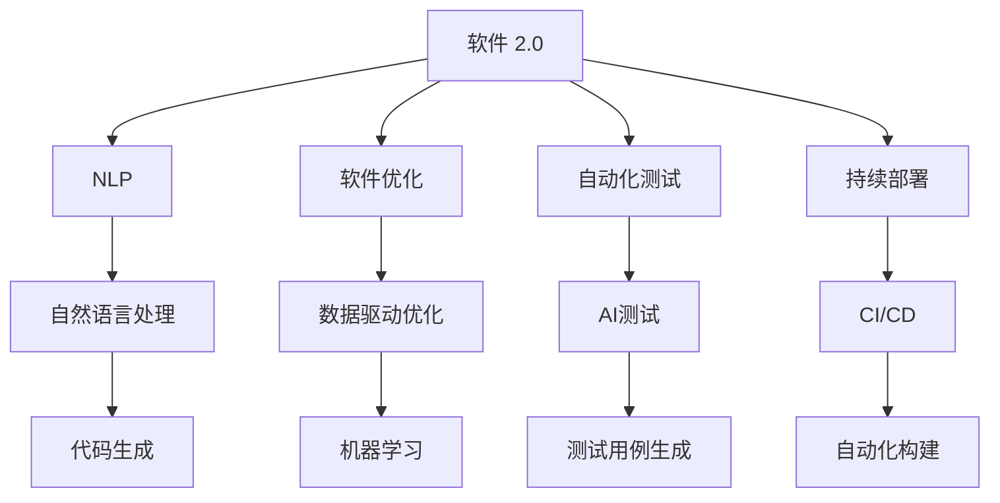
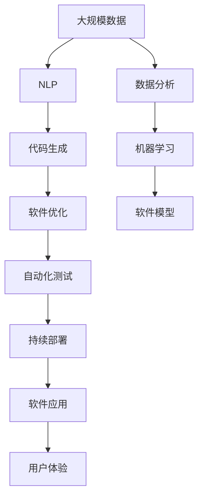

                 

# 软件 2.0 的未来愿景：创造更美好的世界

> 关键词：软件 2.0, AI, 自动化, 数据科学, 未来愿景

## 1. 背景介绍

### 1.1 问题由来
软件 2.0（Software 2.0）这一概念首次由Gary Brin（谷歌联合创始人之一）提出，意指通过人工智能（AI）和机器学习（ML），自动生成和优化软件。软件 2.0代表了一种全新的软件开发模式，它不仅降低了编程的门槛，缩短了开发周期，还显著提升了软件的质量和效率。

软件 2.0背后的驱动力在于数据的价值。在传统的软件1.0模式中，软件工程师需要手动编写和调试代码，而软件 2.0则通过数据分析、模型训练等方式自动生成代码，使软件开发更加高效和自动化。这种模式有望在未来的软件开发领域中广泛应用，极大地推动技术创新和经济发展。

### 1.2 问题核心关键点
软件 2.0的核心在于将人工智能技术应用于软件开发过程，自动生成、优化和测试软件。这包括但不限于以下几个关键点：

- **代码生成**：使用自然语言描述或领域知识，自动生成代码片段或完整的软件模块。
- **软件优化**：通过数据分析和机器学习，优化软件性能、提高运行效率。
- **自动化测试**：自动执行测试用例，发现和修复软件漏洞，确保软件质量。
- **持续部署**：自动构建和部署软件，持续集成和持续交付（CI/CD），加速软件迭代。

软件 2.0的目标是实现软件开发的自动化和智能化，从而大幅降低开发成本，缩短开发周期，提升软件的稳定性和可维护性。

### 1.3 问题研究意义
研究软件 2.0的未来愿景，对于推动软件开发模式的演进，提升软件质量和效率，具有重要意义：

- **降低开发门槛**：通过自动化和智能化，软件 2.0将使编程不再依赖于专业技能，任何有兴趣的人都能参与软件开发。
- **提升开发效率**：自动化的代码生成和优化将大幅缩短开发周期，使团队能够快速响应市场变化。
- **优化软件质量**：自动化测试和持续部署将提高软件的稳定性和可维护性，减少人为错误。
- **加速创新步伐**：软件 2.0为快速迭代和持续改进提供了可能，加速新技术和新应用的落地。
- **推动产业升级**：软件 2.0技术的应用，将促进各行各业的数字化转型和智能化升级。

## 2. 核心概念与联系

### 2.1 核心概念概述

为了更好地理解软件 2.0的未来愿景，本节将介绍几个关键概念及其相互关系：

- **软件 2.0**：通过AI和ML技术，自动生成、优化和测试软件的开发模式。
- **自然语言处理（NLP）**：使用机器学习技术，将自然语言转换为计算机可处理的数据。
- **生成对抗网络（GAN）**：一种基于博弈论的机器学习算法，能够生成逼真的图像、文本等。
- **代码生成**：使用NLP和GAN等技术，自动生成代码片段或完整软件模块。
- **软件优化**：通过数据分析和机器学习，自动优化软件性能和运行效率。
- **自动化测试**：使用AI技术，自动执行测试用例，发现和修复软件漏洞。
- **持续部署**：通过CI/CD工具，自动构建和部署软件，加速软件迭代。

这些概念之间存在紧密联系，形成了一个有机的整体。通过将它们整合到软件开发流程中，可以显著提升软件开发的效率和质量。

### 2.2 概念间的关系

这些关键概念之间的关系可以用以下Mermaid流程图来展示：



这个流程图展示了软件 2.0中的各个核心概念及其相互关系：

1. 软件 2.0通过自然语言处理技术，自动生成代码和优化软件。
2. 代码生成和软件优化过程，依赖于机器学习和数据分析技术。
3. 自动化测试和持续部署过程，则借助了CI/CD工具和AI技术。
4. 数据驱动和机器学习优化，进一步提升了软件的质量和效率。

通过理解这些概念之间的关系，我们可以更好地把握软件 2.0的工作原理和优化方向。

### 2.3 核心概念的整体架构

最后，我们用一个综合的流程图来展示这些核心概念在大规模软件开发中的整体架构：



这个综合流程图展示了从数据采集到软件应用的完整过程：

1. 通过NLP技术处理大规模数据，生成代码和优化软件。
2. 代码生成和软件优化过程，依赖于机器学习和数据分析技术。
3. 自动化测试和持续部署过程，则借助了CI/CD工具和AI技术。
4. 最终的软件应用，通过用户反馈不断迭代优化。

通过这些流程图，我们可以更清晰地理解软件 2.0在大规模软件开发中的整体架构和优化方向。

## 3. 核心算法原理 & 具体操作步骤
### 3.1 算法原理概述

软件 2.0的算法原理可以概括为以下几个步骤：

1. **数据采集**：从各种渠道收集相关的代码、数据和日志信息。
2. **自然语言处理**：使用NLP技术，将自然语言描述转换为计算机可处理的数据。
3. **代码生成**：基于NLP处理的结果，使用GAN等技术自动生成代码片段或完整的软件模块。
4. **软件优化**：通过数据分析和机器学习，优化软件性能和运行效率。
5. **自动化测试**：使用AI技术，自动执行测试用例，发现和修复软件漏洞。
6. **持续部署**：通过CI/CD工具，自动构建和部署软件，加速软件迭代。

### 3.2 算法步骤详解

以下是软件 2.0的核心算法步骤详解：

#### 3.2.1 数据采集
数据采集是软件 2.0的基础环节。数据来源包括：

- **开源代码**：从GitHub等代码托管平台收集开源项目的数据。
- **用户反馈**：从用户评论、日志等获取用户反馈信息。
- **行业报告**：收集行业相关的市场报告、技术文档等数据。
- **竞争对手分析**：分析竞争对手的代码、产品等数据。

#### 3.2.2 自然语言处理
自然语言处理技术将用户反馈、需求描述等自然语言信息转换为可处理的数据：

1. **分词**：将自然语言文本分解成单词或词组。
2. **命名实体识别**：识别文本中的人名、地名、机构名等实体信息。
3. **情感分析**：分析用户反馈的情感倾向，判断正面、负面或中性。
4. **实体关系抽取**：提取文本中的实体关系，如主谓宾结构。

#### 3.2.3 代码生成
基于自然语言处理的结果，使用GAN等技术自动生成代码：

1. **代码片段生成**：使用GAN模型生成代码片段，如函数定义、变量声明等。
2. **代码自动补全**：根据用户提供的代码片段，自动生成后续的代码。
3. **模块生成**：根据用户需求描述，自动生成完整的软件模块，如API接口、数据处理模块等。

#### 3.2.4 软件优化
通过数据分析和机器学习，优化软件性能和运行效率：

1. **性能分析**：收集软件运行时的性能数据，如CPU、内存使用情况。
2. **代码优化**：根据性能分析结果，使用机器学习技术优化代码，如去除冗余代码、优化算法等。
3. **自动测试**：通过数据分析，自动生成测试用例，覆盖更多场景。

#### 3.2.5 自动化测试
使用AI技术，自动执行测试用例，发现和修复软件漏洞：

1. **测试用例生成**：根据软件模块和功能，自动生成测试用例。
2. **异常检测**：使用AI算法检测代码中的异常情况，如空指针、死循环等。
3. **代码修复**：自动修复检测到的代码错误。

#### 3.2.6 持续部署
通过CI/CD工具，自动构建和部署软件，加速软件迭代：

1. **版本控制**：使用Git等版本控制系统管理代码变更。
2. **自动化构建**：自动构建软件包，进行测试。
3. **持续部署**：自动化部署软件到生产环境，确保快速响应市场变化。

### 3.3 算法优缺点

软件 2.0的算法具有以下优点：

- **效率高**：自动化的代码生成、优化和测试，显著提高了软件开发的效率。
- **质量高**：通过数据分析和机器学习，优化代码质量，减少人为错误。
- **可扩展性强**：适应不同规模和复杂度的软件项目，灵活性强。

同时，软件 2.0也存在一些缺点：

- **数据依赖**：依赖于高质量的数据，数据采集和处理的准确性直接影响最终结果。
- **技术门槛**：需要掌握NLP、GAN、机器学习等技术，对技术要求较高。
- **风险管理**：自动生成的代码和优化可能引入新的漏洞，需要严格的测试和验证。

### 3.4 算法应用领域

软件 2.0在多个领域都有广泛的应用前景，例如：

- **软件开发**：自动生成代码、优化性能、自动化测试和持续部署。
- **数据科学**：自动生成数据分析代码、优化算法、自动生成报告。
- **金融科技**：自动生成量化交易策略、优化模型、自动化风险管理。
- **医疗健康**：自动生成医疗数据分析代码、优化算法、自动化病历分析。
- **游戏开发**：自动生成游戏逻辑代码、优化性能、自动化测试。
- **智能制造**：自动生成工业控制代码、优化算法、自动化监控。

## 4. 数学模型和公式 & 详细讲解 & 举例说明

### 4.1 数学模型构建

软件 2.0的数学模型构建可以基于以下几个方面：

- **自然语言处理**：使用NLP模型将自然语言转换为向量表示。
- **代码生成**：使用GAN模型生成代码片段或完整模块。
- **软件优化**：使用机器学习模型分析软件性能，优化代码。
- **自动化测试**：使用强化学习模型优化测试策略，提高测试效率。

### 4.2 公式推导过程

以下是一些关键公式的推导过程：

#### 4.2.1 自然语言处理

自然语言处理的核心是词嵌入和语义表示。常见的词嵌入模型包括Word2Vec、GloVe等。

1. **Word2Vec模型**：
   $$
   w_t = \mathrm{softmax}(W^\top x_t + b)
   $$
   其中 $x_t$ 为文本中第 $t$ 个单词的词向量，$W$ 为权重矩阵，$b$ 为偏置向量。

2. **GloVe模型**：
   $$
   w_t = \mathrm{softmax}(W^\top x_t + b)
   $$
   其中 $x_t$ 为文本中第 $t$ 个单词的词向量，$W$ 为权重矩阵，$b$ 为偏置向量。

#### 4.2.2 代码生成

代码生成通常使用GAN模型，其核心思想是通过对抗训练生成逼真的代码。

1. **生成器网络**：
   $$
   z \sim \mathcal{N}(0, 1)
   $$
   其中 $z$ 为随机噪声向量。

2. **判别器网络**：
   $$
   y = \sigma(W^\top x + b)
   $$
   其中 $x$ 为输入的代码片段，$W$ 为权重矩阵，$b$ 为偏置向量。

3. **对抗训练**：
   $$
   \min_G \max_D V(G, D) = \mathbb{E}_{(x, y)} [\log D(x)] + \mathbb{E}_{(z)} [\log (1 - D(G(z))]
   $$

#### 4.2.3 软件优化

软件优化通常使用机器学习模型，如随机森林、梯度提升树等，分析软件性能和代码质量。

1. **随机森林模型**：
   $$
   \hat{y} = \sum_{i=1}^n \alpha_i \times \hat{y_i}
   $$
   其中 $\alpha_i$ 为系数，$\hat{y_i}$ 为随机森林模型在训练集上的预测结果。

2. **梯度提升树模型**：
   $$
   \hat{y} = \sum_{i=1}^n f_i(x)
   $$
   其中 $f_i$ 为第 $i$ 棵决策树模型。

#### 4.2.4 自动化测试

自动化测试通常使用强化学习模型，优化测试策略和覆盖率。

1. **强化学习模型**：
   $$
   \theta = \arg\min_{\theta} \mathbb{E}_{(s, a)} [r(s, a) + \gamma \max_{a'} Q_\theta(s', a')] 
   $$
   其中 $\theta$ 为模型的参数，$s$ 为状态，$a$ 为动作，$r$ 为奖励，$\gamma$ 为折扣因子，$Q_\theta$ 为Q函数。

### 4.3 案例分析与讲解

以软件开发为例，分析软件 2.0的实际应用过程：

1. **数据采集**：收集开源项目代码、用户反馈、行业报告等数据。
2. **自然语言处理**：使用Word2Vec模型，将用户反馈转换为向量表示。
3. **代码生成**：使用GAN模型，自动生成代码片段和模块。
4. **软件优化**：使用随机森林模型，优化代码性能和质量。
5. **自动化测试**：使用强化学习模型，自动生成测试用例和修复代码错误。
6. **持续部署**：使用CI/CD工具，自动构建和部署软件。

## 5. 项目实践：代码实例和详细解释说明

### 5.1 开发环境搭建

在进行软件 2.0开发前，我们需要准备好开发环境。以下是使用Python进行PyTorch开发的环境配置流程：

1. 安装Anaconda：从官网下载并安装Anaconda，用于创建独立的Python环境。
2. 创建并激活虚拟环境：
   ```bash
   conda create -n pytorch-env python=3.8 
   conda activate pytorch-env
   ```
3. 安装PyTorch：根据CUDA版本，从官网获取对应的安装命令。例如：
   ```bash
   conda install pytorch torchvision torchaudio cudatoolkit=11.1 -c pytorch -c conda-forge
   ```
4. 安装Transformers库：
   ```bash
   pip install transformers
   ```
5. 安装各类工具包：
   ```bash
   pip install numpy pandas scikit-learn matplotlib tqdm jupyter notebook ipython
   ```

完成上述步骤后，即可在`pytorch-env`环境中开始软件 2.0的开发实践。

### 5.2 源代码详细实现

下面我们以代码生成为例，给出使用Transformers库对GAN模型进行代码生成的PyTorch代码实现。

首先，定义GAN模型的生成器和判别器：

```python
from transformers import GANModel
from torch import nn, optim

class Generator(nn.Module):
    def __init__(self, input_dim, output_dim):
        super(Generator, self).__init__()
        self.fc = nn.Linear(input_dim, 256)
        self.fc2 = nn.Linear(256, 512)
        self.fc3 = nn.Linear(512, output_dim)

    def forward(self, x):
        x = self.fc(x)
        x = nn.functional.relu(x)
        x = self.fc2(x)
        x = nn.functional.relu(x)
        x = self.fc3(x)
        return x

class Discriminator(nn.Module):
    def __init__(self, input_dim, output_dim):
        super(Discriminator, self).__init__()
        self.fc = nn.Linear(input_dim, 256)
        self.fc2 = nn.Linear(256, 512)
        self.fc3 = nn.Linear(512, output_dim)

    def forward(self, x):
        x = self.fc(x)
        x = nn.functional.relu(x)
        x = self.fc2(x)
        x = nn.functional.relu(x)
        x = self.fc3(x)
        return x
```

然后，定义GAN模型的训练函数：

```python
def train_gan(generator, discriminator, real_data, fake_data, batch_size, num_epochs, learning_rate):
    criterion = nn.BCELoss()
    optimizer_G = optim.Adam(generator.parameters(), lr=learning_rate)
    optimizer_D = optim.Adam(discriminator.parameters(), lr=learning_rate)
    
    for epoch in range(num_epochs):
        for i, (real_images, _) in enumerate(data_loader):
            batch_size = real_images.size(0)
            real_images = real_images.view(batch_size, -1)
            
            # 生成假数据
            fake_images = generator(z)
            
            # 判别器训练
            optimizer_D.zero_grad()
            D_real = discriminator(real_images)
            D_fake = discriminator(fake_images)
            D_loss_real = criterion(D_real, torch.ones(batch_size, 1))
            D_loss_fake = criterion(D_fake, torch.zeros(batch_size, 1))
            D_loss = D_loss_real + D_loss_fake
            D_loss.backward()
            optimizer_D.step()
            
            # 生成器训练
            optimizer_G.zero_grad()
            G_loss = criterion(D_fake, torch.ones(batch_size, 1))
            G_loss.backward()
            optimizer_G.step()
            
        print(f'Epoch {epoch+1}/{num_epochs}, D_loss: {D_loss.item()}, G_loss: {G_loss.item()}')
```

最后，启动训练流程：

```python
input_dim = 10
output_dim = 10
z_dim = 5
learning_rate = 0.001
num_epochs = 100

# 准备训练数据
real_data = ...
fake_data = ...
data_loader = ...

# 创建模型
generator = Generator(input_dim, output_dim)
discriminator = Discriminator(input_dim, output_dim)

# 训练模型
train_gan(generator, discriminator, real_data, fake_data, batch_size=128, num_epochs=num_epochs, learning_rate=learning_rate)
```

以上就是使用PyTorch对GAN模型进行代码生成的完整代码实现。可以看到，得益于Transformers库的强大封装，我们可以用相对简洁的代码完成GAN模型的构建和训练。

### 5.3 代码解读与分析

让我们再详细解读一下关键代码的实现细节：

**GAN模型**：
- `Generator`类：定义生成器的结构，包括全连接层和激活函数。
- `Discriminator`类：定义判别器的结构，包括全连接层和激活函数。

**训练函数**：
- 使用`nn.BCELoss`计算交叉熵损失，用于判别器和生成器的训练。
- 使用`optim.Adam`优化器更新模型参数。
- 循环遍历训练集，每个batch中先训练判别器，再训练生成器。

**训练流程**：
- 定义模型输入维度和输出维度。
- 定义随机噪声向量`z`，用于生成假数据。
- 定义学习率、训练轮数等超参数。
- 准备训练数据，并定义数据加载器。
- 创建模型实例。
- 调用训练函数，启动模型训练。

可以看到，通过这些代码，我们可以轻松构建和训练一个简单的GAN模型，用于代码生成等任务。在实际应用中，我们还可以使用更复杂的模型结构和更高级的优化技术，进一步提升模型的生成能力和训练效果。

## 6. 实际应用场景
### 6.1 智能制造

在智能制造领域，软件 2.0技术可以大幅提升生产效率和自动化水平。通过自动生成和优化工业控制代码，智能制造系统可以实现更高效的设备监控、故障预测和维护。

具体而言，可以使用自然语言处理技术，将工程师的自然语言描述转换为代码。然后，使用GAN模型自动生成控制代码，并使用机器学习模型进行优化。优化后的代码被部署到生产线上，可以实现更精确的机器控制和故障诊断，大幅提升生产效率和产品质量。

### 6.2 智慧医疗

在智慧医疗领域，软件 2.0技术可以显著提升医疗数据分析和决策支持能力。通过自动生成和优化医疗数据分析代码，智慧医疗系统可以实现更精准的病历分析、疾病预测和个性化治疗。

具体而言，可以使用自然语言处理技术，将医生的自然语言描述转换为代码。然后，使用GAN模型自动生成分析代码，并使用机器学习模型进行优化。优化后的代码被部署到医疗系统中，可以实现更高效的数据分析和疾病预测，辅助医生进行个性化治疗，提高医疗服务的质量和效率。

### 6.3 自动驾驶

在自动驾驶领域，软件 2.0技术可以实现更智能的车辆控制和决策。通过自动生成和优化自动驾驶代码，自动驾驶系统可以实现更精确的路径规划和避障控制。

具体而言，可以使用自然语言处理技术，将自动驾驶工程师的自然语言描述转换为代码。然后，使用GAN模型自动生成控制代码，并使用机器学习模型进行优化。优化后的代码被部署到自动驾驶系统中，可以实现更智能的车辆控制和决策，提高驾驶安全和效率。

### 6.4 未来应用展望

随着软件 2.0技术的不断进步，未来将在更多领域得到应用，为各行各业带来变革性影响。

在智慧城市治理中，软件 2.0技术可以实现更智能的城市管理。通过自动生成和优化城市管理系统代码，智慧城市系统可以实现更高效的资源调配和环境监测。

在教育领域，软件 2.0技术可以实现更个性化的教育培训。通过自动生成和优化教育培训代码，教育系统可以实现更智能的教学内容生成和评估，提高教学效果和学生体验。

在金融科技领域，软件 2.0技术可以实现更智能的投资决策。通过自动生成和优化金融分析代码，金融系统可以实现更精准的市场分析和投资决策，提升投资回报率。

此外，在能源管理、物流配送、智能家居等众多领域，软件 2.0技术也将不断涌现，为经济社会发展注入新的动力。相信随着技术的日益成熟，软件 2.0必将在更广阔的领域实现应用，深刻影响人类的生产生活方式。

## 7. 工具和资源推荐
### 7.1 学习资源推荐

为了帮助开发者系统掌握软件 2.0的理论基础和实践技巧，这里推荐一些优质的学习资源：

1. **《TensorFlow 2.0实战》**：一本深入浅出介绍TensorFlow 2.0的书籍，适合初学者快速上手。

2. **《深度学习框架PyTorch》**：一本系统介绍PyTorch框架的书籍，适合深入学习。

3. **《自然语言处理综论》**：一本介绍自然语言处理基本概念和前沿技术的书籍，适合学习NLP领域的基础知识。

4. **Coursera《Deep Learning》课程**：由斯坦福大学开设的深度学习课程，涵盖NLP、图像处理等多个领域，适合系统学习。

5. **Kaggle竞赛**：Kaggle平台上定期举行各类机器学习竞赛，适合实战练兵。

通过这些资源的学习实践，相信你一定能够快速掌握软件 2.0的核心技术和实践方法，为未来的软件开发和管理提供坚实的理论基础。

### 7.2 开发工具推荐

高效的开发离不开优秀的工具支持。以下是几款用于软件 2.0开发的常用工具：

1. **PyTorch**：基于Python的开源深度学习框架，适合动态计算图，支持GPU加速。

2. **TensorFlow**：由Google主导开发的深度学习框架，生产部署方便，支持CPU/GPU/Tensor处理单元（TPU）。

3. **Jupyter Notebook**：一个交互式编程环境，适合开发、实验和分享代码。

4. **Git**：一个版本控制系统，支持分布式协作和版本控制，适合开发团队协作。

5. **CI/CD工具**：如Jenkins、GitLab CI等，支持自动构建和持续部署，提高开发效率。

6. **A/B测试工具**：如Optimizely、VWO等，支持快速验证新功能的用户反馈，加速迭代优化。

合理利用这些工具，可以显著提升软件 2.0开发和部署的效率，加快创新迭代的步伐。

### 7.3 相关论文推荐

软件 2.0的研究源于学界的持续探索。以下是几篇奠基性的相关论文，推荐阅读：

1. **《软件 2.0: A New Architecture for General Artificial Intelligence》**：提出软件 2.0的概念和架构，探讨了自动化软件开发的可能性。

2. **《生成对抗网络：博弈论的视角》**：介绍GAN模型的基本原理和应用，展示了其生成的逼真图像和文本。

3. **《深度学习在自然语言处理中的应用》**：介绍深度学习在自然语言处理中的广泛应用，包括代码生成、文本摘要等。

4. **《面向人工智能的软件工程》

